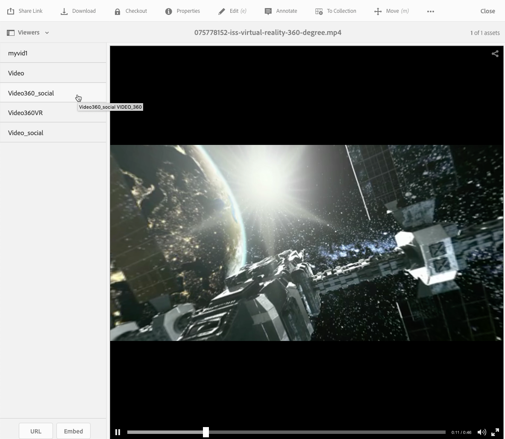

# 360/VR Video {#vr-video}

Bij video&#39;s van 360 graden wordt een weergave in elke richting tegelijkertijd vastgelegd. Ze worden opgenomen met een omnidirectionele camera of een verzameling camera&#39;s. Tijdens het afspelen op een plat beeldscherm heeft de gebruiker controle over de kijkhoek; afspelen op mobiele apparaten maakt doorgaans gebruik van de ingebouwde gyroscopische besturingselementen.

Dynamic Media - de wijze Scene7 omvat inheemse steun voor de levering van 360 videoactiva. Standaard is geen aanvullende configuratie nodig voor weergave of afspelen. U levert 360 Video gebruikend standaardvideouitbreidingen zoals .mp4, .mkv, en .mov. De meest algemene codec is H.264.

In deze sectie wordt beschreven hoe u met de 360/VR Video-viewer werkt om equirechthoekige video te renderen voor een indrukwekkende kijkervaring van een kamer, eigenschap, locatie, landschap, medische procedure, enzovoort.

Ruimtelijke audio wordt momenteel niet ondersteund. als audio in stereo wordt gemengd, verandert de balans (L/R) niet aangezien de klant de kijkhoek van de camera verandert.

Zie ook Voorinstellingen [voor viewers](/help/assets/managing-viewer-presets.md)beheren.

## 360 Video in actie {#video-in-action}

Tik op [Ruimtestation 360](http://mobiletest.scene7.com/s7viewers/html5/Video360Viewer.html?asset=Viewers/space_station_360-AVS) om een browservenster te openen en een video van 360 graden te bekijken. Tijdens het afspelen van video sleept u de muisaanwijzer naar een nieuwe locatie om de weergavehoek te wijzigen.

*Video frame from Space Station 360*

## 360/VR-video en Adobe Premiere Pro {#vr-video-and-adobe-premiere-pro}

Met Adobe Premier Pro kunt u 360/VR-beeldmateriaal weergeven en bewerken. U kunt bijvoorbeeld logo&#39;s en tekst op de juiste wijze in een scène plaatsen en effecten en overgangen toepassen die specifiek zijn ontworpen voor rechthoekige media.

Zie [Video](https://helpx.adobe.com/premiere-pro/how-to/edit-360-vr-video.html)360/VR bewerken.

## Elementen uploaden voor gebruik met de 360-videoviewer {#uploading-assets-for-use-with-the-video-viewer}

360 video-elementen die naar AEM worden geüpload, worden op een elementpagina aangeduid als **Multimedia** , vergelijkbaar met normale video-elementen.

*Een geüploade 360 video-element dat in de kaartweergave wordt weergegeven. Het element wordt aangeduid als Multimedia.*

**Elementen uploaden voor gebruik met de 360-videoviewer:**

1. Er is een map gemaakt voor uw 360-video-element.
1. [Pas een adaptief videoprofiel toe op de map](/help/assets/video-profiles.md#applying-a-video-profile-to-folders).

   Bij het renderen van 360 video-inhoud worden hogere eisen gesteld aan de resolutie van de bronvideo en aan de resolutie van gecodeerde vertoningen dan aan de standaard niet-360 video-inhoud.

   U kunt het uit-van-de-doos Aangepast videoprofiel gebruiken dat reeds met Dynamic Media wordt geleverd. Houd er echter rekening mee dat dit resulteert in een aanzienlijk lagere videokwaliteit dan bij niet-360-video die is gecodeerd met dezelfde instellingen die worden gerenderd met een niet-360-videoviewer. Ga daarom als volgt te werk als u hoogwaardige 360 video nodig hebt:

   * In het ideale geval moet de oorspronkelijke 360 video-inhoud een van de volgende resoluties hebben:

      * 1080p - 1920 x 1080, bekend als Full HD- of FHD-resolutie of,
      * 2160p - 3840 x 2160, bekend als 4K, UHD of Ultra HD-resolutie. Deze zeer grote schermresolutie wordt meestal aangetroffen op hoogwaardige televisietoestellen en computermonitoren. De resolutie van 2160p wordt vaak &#39;4K&#39; genoemd omdat de breedte dichtbij 4000 pixels ligt. Met andere woorden, het biedt vier keer de pixels van 1080p.
   * [Maak een aangepast adaptief videoprofiel](/help/assets/video-profiles.md#creating-a-video-encoding-profile-for-adaptive-streaming) met uitvoeringen van hogere kwaliteit. U kunt bijvoorbeeld een adaptief videoprofiel met de volgende drie instellingen maken:

      * width=auto; height=720; bitsnelheid=2500 kbps
      * width=auto; height=1080; bitsnelheid=5000 kbps
      * width=auto; height=1440; bitsnelheid=6600 kbps
   * Verwerk 360 video-inhoud in een map die exclusief is bestemd voor 360 video-elementen.
   Houd er rekening mee dat deze aanpak ook grotere eisen stelt aan het netwerk en de CPU van de eindgebruiker.

1. [Upload uw video naar de map](/help/assets/managing-video-assets.md#uploadingandpreviewingvideoassets).

## De standaardverhouding van 360 video&#39;s overschrijven  {#overriding-the-default-aspect-ratio-of-videos}

Als u een geüpload element wilt kwalificeren als een 360-video die u wilt gebruiken met de 360-videoviewer, moet het element een hoogte-breedteverhouding van 2 hebben.

Standaard detecteert AEM video als &quot;360&quot; als de hoogte-breedteverhouding (breedte/hoogte) 2,0 is. Als u een Beheerder bent, kunt u het gebrek aspectverhouding plaatsen van 2 met voeten treden door het facultatieve `s7video360AR` bezit in CRXDE Lite bij het volgende te plaatsen:

* `/conf/global/settings/cloudconfigs/dmscene7/jcr:content`

   * **Type** eigenschap: Dubbel
   * **Waarde**: drijvende-kommaverhouding, standaard 2.0.

Nadat u deze eigenschap hebt ingesteld, wordt deze direct van kracht op zowel bestaande als nieuw geüploade video&#39;s.

De hoogte-breedteverhouding is van toepassing op 360 video-elementen voor de pagina met elementdetails en de [Video 360 Media WCM-component](/help/assets/adding-dynamic-media-assets-to-pages.md#dynamic-media-components).

Begin met het uploaden van 360 video&#39;s.

## Voorvertoning van 360 video {#previewing-video}

Met Voorvertoning kunt u zien hoe uw 360-video er uitziet voor klanten en kunt u controleren of deze zich gedraagt zoals u had verwacht.

Zie ook Voorinstellingen [van viewer](/help/assets/managing-viewer-presets.md#editing-viewer-presets)bewerken.

Als u tevreden bent met de 360-video, kunt u deze publiceren.

See [Embedding the Video or Image Viewer on a Web Page](https://helpx.adobe.com/experience-manager/6-5/help/assets/embed-code.html).
See [Linking URLs to your web application](https://helpx.adobe.com/experience-manager/6-5/help/assets/linking-urls-to-yourwebapplication.html). De op URL gebaseerde methode van koppelen is niet mogelijk als uw interactieve inhoud koppelingen naar relatieve URL&#39;s bevat, met name koppelingen naar pagina&#39;s van AEM Sites.
See [Adding Dynamic Media Assets to pages.](https://helpx.adobe.com/experience-manager/6-5/help/assets/adding-dynamic-media-assets-to-pages.html)

**Een voorvertoning van 360 video&#39;s weergeven**

1. Navigeer in **[!UICONTROL Assets]** naar een bestaande 360-video die u hebt gemaakt. Tik op het 360 Video-element om dit te openen in de voorvertoningsmodus.

   

   Tik op het 360-video-element om een voorvertoning van de video weer te geven.

1. Tik op de voorvertoningspagina linksboven op de pagina op de vervolgkeuzelijst en selecteer vervolgens **[!UICONTROL Viewers.]**

   

   Tik in de lijst Viewers op **[!UICONTROL Video360_social]** een van de volgende handelingen:

   * Sleep de muisaanwijzer over de video om de kijkhoek van de statische scène te wijzigen.
   * Tik op de **[!UICONTROL Play]** knop van de video om te beginnen met afspelen; terwijl de video wordt afgespeeld, sleept u de muisaanwijzer over de video om de kijkhoek te wijzigen.
   *socialA 360 videoscreenshot.*

   * Tik in de lijst Viewers op **[!UICONTROL Video360VR.]**

      Virtuele realiteit (VR) video is overweldigende video-inhoud die wordt benaderd via headsets van virtuele realiteit. Net als bij gewone video&#39;s maakt u aan het begin VR-video&#39;s wanneer een video wordt opgenomen of vastgelegd met videocamera&#39;s van 360 graden.
   
   *Een videoschermafbeelding van 360 VR.*

1. Tik rechtsboven op de voorvertoningspagina op **[!UICONTROL Close.]**

## 360-video publiceren {#publishing-video}

U moet de 360-video publiceren om deze te kunnen gebruiken. Wanneer u een 360-video publiceert, wordt de URL en de insluitcode geactiveerd. Het publiceert ook de 360 Video aan de wolk van Dynamic Media die met een CDN voor scalable en prestatieslevering geïntegreerd is.

Zie [Dynamic Media Assets](/help/assets/publishing-dynamicmedia-assets.md) publiceren voor meer informatie over het publiceren van 360 Video.
See also [Embedding the Video or Image Viewer on a Web Page](https://helpx.adobe.com/experience-manager/6-5/help/assets/embed-code.html).
See also [Linking URLs to your web application](https://helpx.adobe.com/experience-manager/6-5/help/assets/linking-urls-to-yourwebapplication.html). De op URL gebaseerde methode van koppelen is niet mogelijk als uw interactieve inhoud koppelingen naar relatieve URL&#39;s bevat, met name koppelingen naar pagina&#39;s van AEM Sites.
See also [Adding Dynamic Media Assets to pages.](https://helpx.adobe.com/experience-manager/6-5/help/assets/adding-dynamic-media-assets-to-pages.html)
