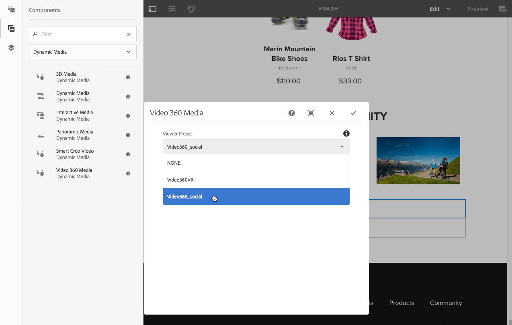
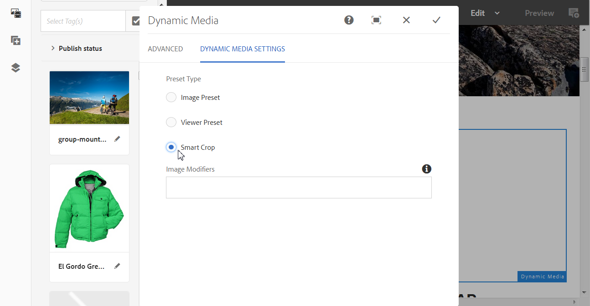
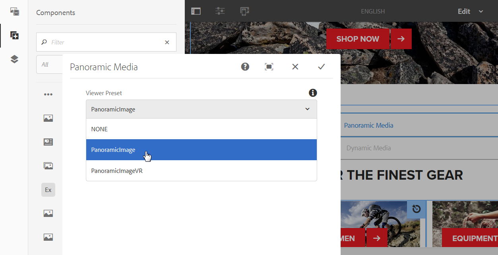

# Adding Dynamic Media Assets to Pages{#adding-dynamic-media-assets-to-pages}

Als u de functionaliteit voor dynamische media wilt toevoegen aan assets die u op uw websites gebruikt, kunt u de component **Dynamische media**, **Interactieve media**, **Panoramische media** of **Video 360-media** rechtstreeks op de pagina toevoegen. U doet dit door naar de modus Lay-out te gaan en de componenten voor dynamische media in te schakelen. Vervolgens kunt u deze componenten aan de pagina toevoegen en assets aan de component toevoegen. De componenten voor dynamische media zijn slim: ze weten of u een afbeelding of een video toevoegt en de beschikbare configuratieopties veranderen dienovereenkomstig.

U voegt dynamische media-assets rechtstreeks aan de pagina toe als u AEM als uw WCM gebruikt. Als u een oplossing van derden gebruikt voor uw WCM, moet u uw assets [koppelen](/help/assets/linking-urls-to-yourwebapplication.md) of [insluiten](/help/assets/embed-code.md). Voor een responsieve website van derden raadpleegt u het [leveren van geoptimaliseerde afbeeldingen op een responsieve site](/help/assets/responsive-site.md).

>[!NOTE]
>
>U moet elementen publiceren voordat u deze aan pagina&#39;s in AEM toevoegt. See [Publishing Dynamic Media Assets](/help/assets/publishing-dynamicmedia-assets.md).

## Een component Dynamische media aan een pagina toevoegen {#adding-a-dynamic-media-component-to-a-page}

Het toevoegen van een mediacomponent Dynamische media, Interactieve media, Panoramische media of Video 360 aan een pagina is hetzelfde als het toevoegen van een component aan een pagina. De dynamische componenten van Media worden beschreven in de volgende secties.

1. Open in AEM de pagina waaraan u de component Dynamische media wilt toevoegen.
1. Tik in het linkerdeelvenster op het pictogram **[!UICONTROL Componenten]** en filter vervolgens op Dynamische media.

   Als er geen dynamische mediacomponenten beschikbaar zijn, moet u de dynamische mediacomponenten inschakelen of inschakelen. Zie [Paginasjablonen](/help/sites-authoring/templates.md#editing-templates-template-authors) bewerken voor meer informatie.

   

1. Sleep een component **[!UICONTROL Dynamische media]** en zet deze op de gewenste locatie op de pagina neer.

   In het onderstaande voorbeeld wordt de component **[!UICONTROL Video 360 Media]** gebruikt.

   

1. Houd de muisaanwijzer rechtstreeks boven de component. Tik eenmaal om de werkbalk van de component weer te geven wanneer de component is omringd door een blauw vak. Tik op het pictogram **[!UICONTROL Configuratie (moersleutel)]** .

   

1. Afhankelijk van de Dynamic Media-component die u op de pagina hebt neergezet, wordt een configuratiedialoogvenster geopend. [Stel de componentopties](/help/assets/adding-dynamic-media-assets-to-pages.md#dynamic-media-components) naar wens in.

   In het onderstaande voorbeeld ziet u het dialoogvenster Dynamische media **[!UICONTROL Video 360 Media]** component en de opties die beschikbaar zijn in de vervolgkeuzelijst Voorinstelling viewer.

   

   De Dynamic Media Video 360 Media-component.

1. Als u klaar bent, tikt u in de rechterbovenhoek van het dialoogvenster op het vinkje om de wijzigingen op te slaan.

## Dynamische mediacomponenten lokaliseren {#localizing-dynamic-media-components}

U kunt dynamische mediacomponenten op twee manieren lokaliseren:

* Within a web page in Sites, open **[!UICONTROL Properties]** and select the **[!UICONTROL Advanced]** tab. Selecteer de gewenste taal voor lokalisatie.

   

* Selecteer de gewenste pagina of paginagroep in de sitekiezer. Tik op **[!UICONTROL Eigenschappen]** en selecteer het tabblad **[!UICONTROL Geavanceerd]** . Selecteer de gewenste taal voor lokalisatie.

   >[!NOTE]
   >
   >Niet alle talen die in het menu **[!UICONTROL Taal]** beschikbaar zijn, hebben tokens toegewezen.

## Dynamische mediacomponenten {#dynamic-media-components}

De dynamische componenten van Media zijn beschikbaar wanneer u het pictogram van **[!UICONTROL Componenten]** tikt, dan filter op **[!UICONTROL Dynamische Media]**.

De dynamische componenten van Media die beschikbaar zijn omvatten het volgende:

* **[!UICONTROL Dynamische media]** - wordt gebruikt voor elementen zoals afbeeldingen, video, eCatalogs en centrifuges.
* **[!UICONTROL Interactieve media]** - Gebruik voor alle interactieve elementen, zoals interactieve video, interactieve afbeeldingen of carrouselsets.
* **[!UICONTROL Panoramische media]** - Gebruik voor panoramische afbeeldingen of panoramische VR-afbeeldingselementen.
* **[!UICONTROL Video 360 Media]** - Gebruik voor 360 video en 360 VR video activa.

>[!NOTE]
>
>Deze componenten zijn niet standaard beschikbaar en moeten via de sjablooneditor beschikbaar worden gemaakt voordat ze kunnen worden gebruikt. [Nadat ze beschikbaar zijn gesteld](/help/sites-authoring/templates.md#editing-templates-template-authors)in de sjablooneditor, kunt u de componenten aan de pagina toevoegen, net als alle andere AEM-componenten.

### Dynamische media-component {#dynamic-media-component}

De component Dynamische media is slim. Afhankelijk van het feit of u een afbeelding of video toevoegt, hebt u verschillende opties. De component ondersteunt voorinstellingen voor afbeeldingen, op afbeeldingen gebaseerde viewers, zoals afbeeldingssets, centrifuges, gemengde mediasets en video. Bovendien reageert de viewer hierop. De grootte van het scherm verandert automatisch op basis van de schermgrootte. Alle viewers zijn HTML5-viewers.

>[!NOTE]
>
>Als uw webpagina het volgende heeft:
>
>* Meerdere instanties van de component Dynamic Media die op dezelfde pagina worden gebruikt.
>* Elke instantie gebruikt hetzelfde elementtype.
>
>
Houd er rekening mee dat het toewijzen van een andere viewervoorinstelling aan elke Dynamic Media-component op die pagina niet wordt ondersteund.
>
>U kunt echter dezelfde viewervoorinstelling gebruiken voor alle Dynamic Media-componenten die elementen van hetzelfde type gebruiken, op de pagina.

Wanneer u de component Dynamische media toevoegt en **[!UICONTROL Dynamische media-instellingen]** leeg zijn of een element niet correct kunt toevoegen, controleert u het volgende:

* Dynamische media is [ingeschakeld](/help/assets/config-dynamic.md). Dynamische media is standaard uitgeschakeld.
* De afbeelding heeft een piramideTIFF-bestand. Afbeeldingen die zijn geïmporteerd voordat dynamische media is ingeschakeld, hebben geen TIFF-bestand met piramide.

#### Wanneer u met afbeeldingen werkt {#when-working-with-images}

Met de component Dynamische media kunt u dynamische afbeeldingen toevoegen, zoals afbeeldingssets, centrifuges en gemengde mediasets. U kunt inzoomen, uitzoomen en, indien van toepassing, een afbeelding binnen een centrifugeset draaien of een afbeelding van een ander type set selecteren.

U kunt de viewervoorinstelling, afbeeldingsvoorinstelling of afbeeldingsindeling ook rechtstreeks in de component configureren. Als u een afbeelding responsief wilt maken, kunt u de onderbrekingspunten instellen of een responsieve voorinstelling voor de afbeelding toepassen.

U *moet* de volgende instellingen voor dynamische media bewerken door op het pictogram **[!UICONTROL Bewerken]** in de component te tikken en vervolgens op **[!UICONTROL Dynamische media-instellingen]**.

>[!NOTE]
>
>Standaard is de afbeeldingscomponent voor dynamische media adaptief. If you want to make it a fixed size, set it in the component in the **[!UICONTROL Advanced]** tab with the **[!UICONTROL Width]** and **[!UICONTROL Height]**.

* **[!UICONTROL Voorinstelling]** viewer: selecteer een bestaande viewervoorinstelling in het keuzemenu. Als de viewervoorinstelling die u zoekt niet zichtbaar is, moet u deze mogelijk zichtbaar maken. Zie Viewer-voorinstellingen beheren. U kunt geen viewervoorinstelling selecteren als u een voorinstelling voor afbeeldingen gebruikt en andersom.

   Dit is de enige beschikbare optie als u beeldreeksen, spin reeksen, of gemengde media reeksen bekijkt. De weergegeven viewervoorinstellingen zijn ook slim. Alleen relevante viewervoorinstellingen worden weergegeven.

* **[!UICONTROL Viewermodifiers]**—Viewer modifiers hebben de vorm van name=value pair met een &amp;-scheidingsteken en laten u viewers wijzigen zoals beschreven in de Viewer Reference Guide. Een voorbeeld van een viewermodifier is `posterimage=img.jpg&caption=text.vtt,1` die een andere afbeelding instelt voor de videominiatuur en een ondertitelingsbestand aan de video koppelt.

* **[!UICONTROL Voorinstelling]** afbeelding - Selecteer een bestaande voorinstelling voor de afbeelding in het keuzemenu. Als de voorinstelling die u zoekt niet zichtbaar is, moet u deze mogelijk zichtbaar maken. Zie Voorinstellingen afbeelding beheren. U kunt geen viewervoorinstelling selecteren als u een voorinstelling voor afbeeldingen gebruikt en andersom.

   Deze optie is niet beschikbaar als u afbeeldingssets, centrifuges of gemengde mediasets bekijkt.

* **[!UICONTROL Afbeeldingswijzigingstoetsen]**- U kunt afbeeldingseffecten toepassen door extra opdrachten voor afbeeldingen te leveren. Deze worden beschreven in Voorinstellingen afbeelding en de verwijzing Opdracht Beeldserver.

   Deze optie is niet beschikbaar als u afbeeldingssets, centrifuges of gemengde mediasets bekijkt.

* **[!UICONTROL Onderbrekingspunten]**- Als u dit element gebruikt op een responsieve site, moet u de onderbrekingspunten van de afbeelding toevoegen. Afbeeldingsonderbrekingspunten moeten door komma&#39;s (,) worden gescheiden. Deze optie werkt wanneer er geen hoogte of breedte is gedefinieerd in een voorinstelling voor afbeeldingen.

   Deze optie is niet beschikbaar als u afbeeldingssets, centrifuges of gemengde mediasets bekijkt.

   You can edit the following Advanced Settings by tapping **[!UICONTROL Edit]** in the component.

* **[!UICONTROL Titel]**- Wijzig de titel van de afbeelding.

* **[!UICONTROL Alt-tekst]**- Voeg een titel toe aan de afbeelding voor gebruikers die afbeeldingen hebben uitgeschakeld.

   Deze optie is niet beschikbaar als u afbeeldingssets, centrifuges of gemengde mediasets bekijkt.

* **[!UICONTROL URL, Openen in]**—U kunt een element zo instellen dat een koppeling wordt geopend. Stel de URL in en kies Openen in om aan te geven of deze in hetzelfde venster of in een nieuw venster moet worden geopend.

   Deze optie is niet beschikbaar als u afbeeldingssets, centrifuges of gemengde mediasets bekijkt.

* **[!UICONTROL Breedte]**- Voer een waarde in pixels in als u wilt dat de afbeelding een vaste grootte heeft. Als u deze waarde leeg laat, wordt het element adaptief.

* **[!UICONTROL Hoogte]**- Voer een waarde in pixels in als u wilt dat de afbeelding een vaste grootte heeft. Als u deze waarde leeg laat, wordt het element adaptief.

#### Wanneer u werkt met video {#when-working-with-video}

Met de component Dynamische media kunt u dynamische video toevoegen aan uw webpagina&#39;s. Wanneer u de component bewerkt, kunt u een vooraf gedefinieerde videoviewer gebruiken om de video op de pagina af te spelen.

U moet de volgende instellingen voor dynamische media bewerken door in de component op **[!UICONTROL Bewerken]** te klikken.

>[!NOTE]
>
>Standaard is de videocomponent Dynamic Media adaptief. Als u van het een vaste grootte wilt maken, plaats het in de component met de **[!UICONTROL Breedte]** en de **[!UICONTROL Hoogte]** op het **[!UICONTROL Geavanceerde]** lusje.

* **[!UICONTROL Viewer preset**—Selecteer een bestaande voorinstelling voor een videoviewer in het vervolgkeuzemenu. Als de viewervoorinstelling die u zoekt niet zichtbaar is, moet u deze mogelijk zichtbaar maken. Zie Viewer-voorinstellingen beheren.

* **[!UICONTROL Viewer modifiers**—Viewer modifiers have the form of name=value pair with a &amp; delimiter and let you change viewers as described in the Adobe Viewers Reference Guide. Een voorbeeld van een viewer-modifier is `posterimage=img.jpg&caption=text.vtt,1`

   Met viewermodifiers kunt u bijvoorbeeld het volgende doen:

   * Een bijschriftbestand koppelen aan een video: [https://marketing.adobe.com/resources/help/en_US/s7/viewers_ref/r_html5_video_viewer_url_caption.html](https://marketing.adobe.com/resources/help/en_US/s7/viewers_ref/r_html5_video_viewer_url_caption.html)
   * Een navigatiebestand koppelen aan een video: [https://marketing.adobe.com/resources/help/en_US/s7/viewers_ref/r_html5_video_viewer_url_navigation.html](https://marketing.adobe.com/resources/help/en_US/s7/viewers_ref/r_html5_video_viewer_url_navigation.html)
   You can edit the following Advanced Settings by clicking **[!UICONTROL Edit]** in the component.

* **[!UICONTROL Titel**—Wijzig de titel van de video.

* **[!UICONTROL Breedte]**- Voer een waarde in pixels in als u wilt dat de afbeelding een vaste grootte heeft. Als u deze waarde leeg laat, wordt het element adaptief.

* **[!UICONTROL Hoogte]**- Voer een waarde in pixels in als u wilt dat de afbeelding een vaste grootte heeft. Als u deze waarde leeg laat, wordt het element adaptief.

#### Wanneer u werkt met Slim uitsnijden {#when-working-with-smart-crop}

Met de component Dynamische media kunt u SmartCrop-afbeeldingselementen toevoegen aan uw webpagina&#39;s. Wanneer u de component bewerkt, kunt u een vooraf gedefinieerde videoviewer gebruiken om de video op de pagina af te spelen.

Zie ook [Afbeeldingsprofielen](/help/assets/image-profiles.md).

U moet de volgende instelling voor dynamische media bewerken door in de component op **[!UICONTROL Bewerken]** te klikken.

>[!NOTE]
>
>Standaard is de afbeeldingscomponent voor dynamische media adaptief. If you want to make it a fixed size, set it in the component in the **[!UICONTROL Advanced]** tab with the **[!UICONTROL Width]** and **[!UICONTROL Height]**.

* **[!UICONTROL Afbeeldingswijzigingstoetsen]**- U kunt afbeeldingseffecten toepassen door extra opdrachten voor afbeeldingen te leveren. Deze worden beschreven in Voorinstellingen afbeelding en de verwijzing Opdracht Beeldserver.

   Deze optie is niet beschikbaar als u afbeeldingssets, centrifuges of gemengde mediasets bekijkt.

   You can edit the following Advanced Settings by clicking **[!UICONTROL Edit]** in the component.

* **[!UICONTROL Titel]**- Wijzig de titel van de afbeelding Slim uitsnijden.

* **[!UICONTROL Alt-tekst]**- Voeg een titel toe aan de slimme-bijsnijdafbeelding voor gebruikers die afbeeldingen hebben uitgeschakeld.

   Deze optie is niet beschikbaar als u afbeeldingssets, centrifuges of gemengde mediasets bekijkt.

* **[!UICONTROL URL, Openen in]**—U kunt een element zo instellen dat een koppeling wordt geopend. Stel de URL in en kies Openen in om aan te geven of deze in hetzelfde venster of in een nieuw venster moet worden geopend.

   Deze optie is niet beschikbaar als u afbeeldingssets, centrifuges of gemengde mediasets bekijkt.

* **[!UICONTROL Breedte]**- Voer een waarde in pixels in als u wilt dat de afbeelding een vaste grootte heeft. Als u deze waarde leeg laat, wordt het element adaptief.

* **[!UICONTROL Hoogte]**- Voer een waarde in pixels in als u wilt dat de afbeelding een vaste grootte heeft. Als u deze waarde leeg laat, wordt het element adaptief.

### Interactieve mediacomponent {#interactive-media-component}

De interactieve component van Media is voor die activa die interactiviteit op hen zoals hotspots of beeldkaarten hebben. Als u een interactieve afbeelding, interactieve video of carrouselbanner hebt, gebruikt u de component **[!UICONTROL Interactieve media]** .

De component Interactieve media is slim. Afhankelijk van het feit of u een afbeelding of video toevoegt, hebt u verschillende opties. Bovendien reageert de viewer hierop. De grootte van het scherm verandert automatisch op basis van de schermgrootte. Alle viewers zijn HTML5-viewers.

>[!NOTE]
>
>Als uw webpagina het volgende heeft:
>
>* Meerdere instanties van de component Interactive Media die op dezelfde pagina worden gebruikt.
>* Elke instantie gebruikt hetzelfde elementtype.
>
>
Houd er rekening mee dat het toewijzen van een andere viewervoorinstelling aan elke interactieve mediacomponent op die pagina niet wordt ondersteund.
>
>U kunt echter dezelfde viewervoorinstelling gebruiken voor alle interactieve mediacomponenten die op de pagina elementen van hetzelfde type gebruiken.

You can edit the following **[!UICONTROL General]** settings by tapping **[!UICONTROL Edit]** in the component.

* **[!UICONTROL Voorinstelling]** viewer: selecteer een bestaande viewervoorinstelling in het keuzemenu. Als de viewervoorinstelling die u zoekt niet zichtbaar is, moet u deze mogelijk zichtbaar maken. Voorinstellingen voor viewers moeten worden gepubliceerd voordat ze kunnen worden gebruikt. Zie Viewer-voorinstellingen beheren.

* **[!UICONTROL Titel]**- Wijzig de titel van de video.

* **[!UICONTROL Breedte]**- Voer een waarde in pixels in als u wilt dat de afbeelding een vaste grootte heeft. Als u deze waarde leeg laat, wordt het element adaptief.

* **[!UICONTROL Hoogte]**- Voer een waarde in pixels in als u wilt dat de afbeelding een vaste grootte heeft. Als u deze waarde leeg laat, wordt het element adaptief.

   You can edit the following **[!UICONTROL Add To Cart]** settings by clicking **[!UICONTROL Edit]** in the component.

* **[!UICONTROL Productelement]** tonen - Deze waarde is standaard geselecteerd. Het productelement toont een afbeelding van het product zoals gedefinieerd in de module Handel. Schakel het vinkje uit om het productelement niet weer te geven.

* **[!UICONTROL Productprijs]** tonen - Deze waarde is standaard geselecteerd. De prijs van het product is de prijs van het object zoals gedefinieerd in de module Handel. Schakel het vinkje uit om de productprijs niet weer te geven.

* **[!UICONTROL Productformulier]** tonen - Deze waarde is standaard niet geselecteerd. Het productformulier bevat alle productvarianten zoals grootte en kleur. Schakel het vinkje uit om de productvarianten niet weer te geven.

### Panoramische mediacomponent {#panoramic-media-component}

Panoramische media-component is bedoeld voor die elementen die bolvormige panoramische afbeeldingen zijn. Dergelijke afbeeldingen bieden een kijkervaring van 360° voor een ruimte, eigenschap, locatie of landschap. Een afbeelding kan alleen als bolvormig panorama worden beschouwd als de afbeelding een van de volgende opties of beide heeft:

* Een hoogte-breedteverhouding van 2:1.
* Gelabeld met de trefwoorden `equirectangular` (`spherical` + `panorama`) of (`spherical` + `panoramic`). Zie [Tags](/help/sites-authoring/tags.md)gebruiken.

Both the aspect ratio and keyword criteria apply to panoramic assets for the asset details page and the **[!UICONTROL Panoramic Media]** WCM component.

>[!NOTE]
>
>Als uw webpagina het volgende heeft:
>
>* Meerdere versies van het **[!UICONTROL Panoramische Media]** -onderdeel dat op dezelfde pagina wordt gebruikt.
>* Elke instantie gebruikt hetzelfde elementtype.
>
>
Be aware that assigning a different viewer preset to each **[!UICONTROL Panoramic Media]** component on that page is not supported.
>
>U kunt echter dezelfde viewervoorinstelling gebruiken voor alle Panoramische Media-componenten die elementen van hetzelfde type gebruiken, op de pagina.

U kunt het volgende plaatsen uitgeven door te tikken **[!UICONTROL vormt]** in de component.

* **[!UICONTROL Voorinstelling]** viewer - Selecteer een bestaande viewer in het vervolgkeuzemenu met voorinstellingen voor viewer.

Als de viewervoorinstelling die u zoekt niet zichtbaar is, controleert u of deze is gepubliceerd. U moet viewervoorinstellingen publiceren voordat u deze kunt gebruiken. Zie Voorinstellingen [van viewers](/help/assets/managing-viewer-presets.md)beheren.

### Video 360-mediacomponent {#video-media-component}

Met de Media **[!UICONTROL -component]** Video 360 kunt u equirechthoekige video op uw webpagina weergeven voor een indrukwekkende kijkervaring in een kamer, eigenschap, locatie, landschap of medische procedure.

Tijdens het afspelen op een plat beeldscherm heeft de gebruiker controle over de kijkhoek; afspelen op mobiele apparaten maakt doorgaans gebruik van de ingebouwde gyroscopische besturingselementen.

De viewer bevat native ondersteuning voor de levering van 360 video-elementen. Standaard is geen aanvullende configuratie nodig voor weergave of afspelen. U levert 360 Video gebruikend standaardvideouitbreidingen zoals .mp4, .mkv, en .mov. De meest algemene codec is H.264.

U kunt het volgende plaatsen uitgeven door te tikken **[!UICONTROL vormt]** in de component.

* **[!UICONTROL Voorinstelling]** viewer - Selecteer een bestaande viewer in het vervolgkeuzemenu met voorinstellingen voor viewer. Gebruik Video360VR voor eindgebruikers die een virtuele realiteitsbril gebruiken. Bevat basisbesturingselementen voor het afspelen van video en functies voor sociale media. Gebruik Video360_social, die basisbesturingselementen voor het afspelen van video bevat. Video renderen wordt uitgevoerd in de stereomodus. Handmatige zichtpuntcontrole is uitgeschakeld, maar gyroscopische controle is ingeschakeld. Er zijn geen functies voor sociale media.

Als de viewervoorinstelling die u zoekt niet zichtbaar is, controleert u of deze is gepubliceerd. U moet viewervoorinstellingen publiceren voordat u deze kunt gebruiken. Zie Voorinstellingen [van viewers](/help/assets/managing-viewer-presets.md)beheren.

### HTTP/2 gebruiken om dynamische media-elementen te leveren {#using-http-to-delivery-dynamic-media-assets}

HTTP/2 is het nieuwe, bijgewerkte webprotocol dat de manier verbetert waarop browsers en servers communiceren. Het zorgt voor een snellere overdracht van informatie en vermindert de hoeveelheid verwerkingskracht die nodig is. De levering van dynamische media-elementen kan nu plaatsvinden via HTTP/2, wat betere responstijd en laadtijden biedt.

Zie [HTTP2 Levering van Inhoud](/help/assets/http2.md) voor volledige details over begonnen worden het gebruiken van HTTP/2 met uw Dynamische rekening van Media.

>[!MORELIKETHIS]
>
>* [De videospeler gebruiken in dynamische AEM-media](https://helpx.adobe.com/experience-manager/kt/assets/using/dynamic-media-video-player-feature-video-use.html)
>* [Interactieve video gebruiken met AEM Dynamic Media](https://helpx.adobe.com/experience-manager/kt/assets/using/dynamic-media-interactive-video-feature-video-use.html)
>* [Understanding the Asset Viewer with AEM Dynamic Media](https://helpx.adobe.com/experience-manager/kt/assets/using/dynamic-media-viewer-feature-video-understand.html)
>* [Aangepaste videominiatuur gebruiken met dynamische AEM-media](https://helpx.adobe.com/experience-manager/kt/assets/using/dynamic-media-video-thumbnails-feature-video-use.html)
>* [Werken met kleurbeheer met dynamische AEM-media](https://helpx.adobe.com/experience-manager/kt/assets/using/dynamic-media-color-management-technical-video-setup.html)
>* [Afbeelding verscherpen gebruiken met dynamische AEM-media](https://helpx.adobe.com/experience-manager/kt/assets/using/dynamic-media-image-sharpening-feature-video-use.html)

