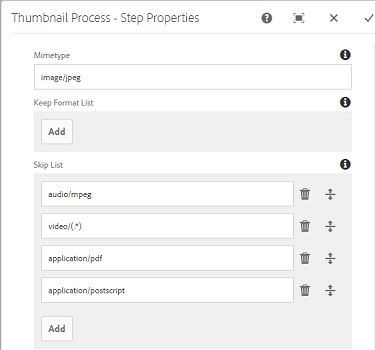

# PDF-raster gebruiken {#using-pdf-rasterizer}

Wanneer u grote, inhoudintensieve PDF- of AI-bestanden uploadt naar [!DNL Adobe Experience Manager Assets], genereert de standaardomzetting mogelijk geen nauwkeurige uitvoer. De Adobe PDF Rasterizer-bibliotheek kan een betrouwbaardere en nauwkeurigere uitvoer genereren dan de uitvoer uit een standaardbibliotheek. Adobe raadt u aan de PDF Rasterizer-bibliotheek te gebruiken voor de volgende scenario&#39;s:

* AI-bestanden of PDF-bestanden met veel inhoud.
* AI-bestanden en PDF-bestanden met miniaturen die niet standaard worden gegenereerd.
* AI-bestanden met Pantone Matching System (PMS)-kleuren.

Miniaturen en voorvertoningen die worden gegenereerd met PDF Rasterizer, zijn beter in kwaliteit dan uitvoer in de buitenverpakking en bieden daarom een consistente kijkervaring op verschillende apparaten. De Adobe PDF Rasterizer-bibliotheek ondersteunt geen kleurruimteconversies. De uitvoer wordt altijd naar RGB uitgevoerd, ongeacht de kleurruimte van het bronbestand.

1. Installeer het PDF Rasterizer-pakket op uw [!DNL Experience Manager] implementatie via [Package Share](https://www.adobeaemcloud.com/content/marketplace/marketplaceProxy.html?packagePath=/content/companies/public/adobe/packages/cq640/product/assets/aem-assets-pdf-rasterizer-pkg).

   >[!NOTE]
   >
   >De PDF Rasterizer-bibliotheek is alleen beschikbaar voor Windows en Linux.

1. Open de [!DNL Assets] workflowconsole op `https://[aem_server]:[port]/workflow`. Open [!UICONTROL DAM Update Asset] workflow.

1. Voer de volgende stappen uit om te voorkomen dat de standaardmethoden worden gebruikt voor het genereren van miniaturen en webvertoningen voor PDF- en AI-bestanden:

   * Open de **[!UICONTROL Process Thumbnails]** stap en voeg `application/pdf` of voeg desgewenst `application/postscript` toe in het **[!UICONTROL Skip Mime Types]** veld onder het **[!UICONTROL Thumbnails]** tabblad.
   

   * Voeg op het **[!UICONTROL Web Enabled Image]** tabblad naar wens toe `application/pdf` of `application/postscript` onder **[!UICONTROL Skip List]** .
   

1. Open de **[!UICONTROL Rasterize PDF/AI Image Preview Rendition]** stap en verwijder het MIME-type waarvoor u de standaardgeneratie voorvertoningsafbeeldingsuitvoeringen wilt overslaan. Verwijder bijvoorbeeld het MIME-type `application/pdf`, `application/postscript`of `application/illustrator` uit de **[!UICONTROL MIME Types]** lijst.

   

1. Sleep de **[!UICONTROL PDF Rasterizer Handler]** stap van het zijpaneel naar onder de **[!UICONTROL Process Thumbnails]** stap.
1. Configureer de volgende argumenten voor de **[!UICONTROL PDF Rasterizer Handler]** stap:

   * MIME-typen: `application/pdf` of `application/postscript`
   * Opdrachten: `PDFRasterizer -d -p 1 -s 1280 -t PNG -i ${file}`
   * Miniatuurgrootten toevoegen: 319:319, 140:100, 48:48. Voeg indien nodig aangepaste miniatuurconfiguratie toe.
   De opdrachtregelargumenten voor de `PDFRasterizer` opdracht kunnen het volgende bevatten:

   * `-d`: Vlag om het vloeiend weergeven van tekst, vectorillustraties en afbeeldingen mogelijk te maken. Hiermee maakt u afbeeldingen van betere kwaliteit. Het opnemen van deze parameter zorgt er echter voor dat de opdracht langzaam wordt uitgevoerd en dat de afbeeldingen groter worden.

   * `-p`: Paginanummer. De standaardwaarde is alle pagina&#39;s. Als u alle pagina&#39;s wilt aangeven, gebruikt u `*`.

   * `-s`: Maximale afmetingen afbeelding (hoogte of breedte). Deze wordt voor elke pagina geconverteerd naar DPI. Als de pagina&#39;s van verschillende grootte zijn, kan elke pagina potentieel met verschillende hoeveelheid schalen. De standaardinstelling is het daadwerkelijke paginaformaat.

   * `-t`: Type uitvoerafbeelding. Geldige typen zijn JPEG, PNG, GIF en BMP. De standaardwaarde is JPEG.

   * `-i`: Pad voor invoer-PDF. Het is een verplichte parameter.

   * `-h`: Help

1. Als u tussenliggende vertoningen wilt verwijderen, selecteert u **[!UICONTROL Delete Generated Rendition]**.

1. Selecteer PDF Rasterizer om webuitvoeringen te laten genereren. **[!UICONTROL Generate Web Rendition]**

   

1. Geef de instellingen op het **[!UICONTROL Web Enabled Image]** tabblad op.

   

1. Sla de workflow op.

1. Als u PDF-rasterfunctie wilt inschakelen voor het verwerken van PDF-pagina&#39;s met PDF-bibliotheken, opent u het **[!UICONTROL DAM Process Subasset]** model via de [!UICONTROL Workflow] console.

1. Sleep vanuit het zijpaneel de stap PDF Rasterizer Handler onder de **[!UICONTROL Create Web-Enabled Image Rendition]** stap.

1. Configureer de volgende argumenten voor de **[!UICONTROL PDF Rasterizer Handler]** stap:

   * MIME-typen: `application/pdf` of `application/postscript`

   * Opdrachten: `PDFRasterizer -d -p 1 -s 1280 -t PNG -i ${file}`
   * Miniatuurgrootten toevoegen: `319:319`, `140:100`, `48:48`. Voeg desgewenst aangepaste miniatuurconfiguratie toe.
   De opdrachtregelargumenten voor de `PDFRasterizer` opdracht kunnen het volgende bevatten:

   * `-d`: Vlag om het vloeiend weergeven van tekst, vectorillustraties en afbeeldingen mogelijk te maken. Hiermee maakt u afbeeldingen van betere kwaliteit. Het opnemen van deze parameter zorgt er echter voor dat de opdracht langzaam wordt uitgevoerd en dat de afbeeldingen groter worden.

   * `-p`: Paginanummer. De standaardwaarde is alle pagina&#39;s. `*` geeft alle pagina&#39;s aan.

   * `-s`: Maximale afmetingen afbeelding (hoogte of breedte). Deze wordt voor elke pagina geconverteerd naar DPI. Als de pagina&#39;s van verschillende grootte zijn, kan elke pagina potentieel met verschillende hoeveelheid schalen. De standaardinstelling is het daadwerkelijke paginaformaat.

   * `-t`: Type uitvoerafbeelding. Geldige typen zijn JPEG, PNG, GIF en BMP. De standaardwaarde is JPEG.

   * `-i`: Pad voor invoer-PDF. Het is een verplichte parameter.

   * `-h`: Help

1. Als u tussenliggende vertoningen wilt verwijderen, selecteert u **[!UICONTROL Delete Generated Rendition]**.
1. Selecteer PDF Rasterizer om webuitvoeringen te laten genereren. **[!UICONTROL Generate Web Rendition]**

   

1. Geef de instellingen op het **[!UICONTROL Web Enabled Image]** tabblad op.

   

1. Sla de workflow op.
1. Upload een PDF- of AI-bestand naar [!DNL Experience Manager Assets]. PDF-rasterfunctie genereert de miniaturen en webuitvoeringen voor het bestand.
