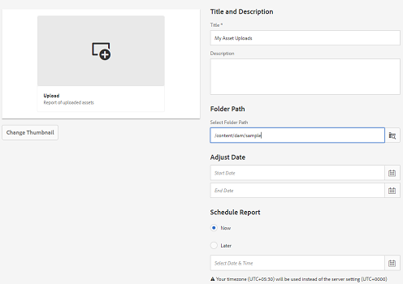

# Asset Reports {#asset-reports}

Asset Reporting is een belangrijk hulpmiddel om het nut van de implementatie van Adobe Experience Manager (AEM)-middelen te beoordelen. Met AEM Assets kunt u verschillende rapporten genereren voor uw digitale middelen. De rapporten bevatten nuttige informatie over het gebruik van uw systeem, over de manier waarop gebruikers met elementen werken en over de elementen die worden gedownload en gedeeld.

Gebruik de informatie in de rapporten om zeer belangrijke succesmetriek af te leiden om de goedkeuring van activa AEM binnen uw onderneming en door klanten te meten.

Het rapportagekader voor AEM Assets gebruikt Sling-taken om rapportageaanvragen op geordende wijze asynchroon te verwerken. Het is schaalbaar voor grote opslagruimten. De asynchrone rapportverwerking verhoogt de efficiency en de snelheid waarmee de rapporten worden geproduceerd.

De interface van het rapportbeheer is intuïtief en omvat fijnkorrelige opties en controles om tot gearchiveerde rapporten toegang te hebben en de loopstatussen van het meningsrapport (succes, ontbroken, en een rij gevormd) in werking te stellen.

Wanneer een rapport wordt gegenereerd, ontvangt u een melding via e-mail (optioneel) en een postbusmelding. U kunt een rapport weergeven, downloaden of verwijderen van de pagina met rapportlijsten waarop alle eerder gegenereerde rapporten worden weergegeven.

## Rapporten genereren {#generate-reports}

AEM Assets produceert de volgende standaardrapporten voor u:

* Uploaden
* Downloaden
* Verlopen
* Wijziging
* Publiceren
* Poortpublicatie merk
* Schijfgebruik
* Bestanden
* Delen van koppeling

AEM-beheerders kunnen deze rapporten eenvoudig genereren en aanpassen voor uw implementatie. Een beheerder kan deze stappen volgen om een rapport te produceren:

1. Klik in de interface van Experience Manager op **[!UICONTROL Tools]** > **[!UICONTROL Assets]** > **[!UICONTROL Reports]**.
   

1. Klik op de [!UICONTROL Asset Reports] pagina op **[!UICONTROL Create]** de werkbalk.
1. Kies op de **[!UICONTROL Create Report]** pagina het rapport dat u wilt maken en klik op **[!UICONTROL Next]**.

   

   >[!NOTE]
   >
   >Voordat u een rapport **[!UICONTROL Asset Downloaded]** kunt genereren, moet u controleren of de service voor het downloaden van assets is ingeschakeld. Open vanuit de webconsole (`https://[aem_server]:[port]/system/console/configMgr`) de configuratie **[!UICONTROL Day CQ DAM Event Recorder]** en selecteer de optie **[!UICONTROL Asset Downloaded (DOWNLOADED)]** in Gebeurtenistypen als deze nog niet is geselecteerd.

   >[!NOTE]
   >
   >Standaard worden de Content Fragments en de shares van de koppeling opgenomen in het rapport Gedownloade middelen. Selecteer de aangewezen optie om een rapport van verbindingsaandelen tot stand te brengen of inhoudsfragmenten van het downloadrapport uit te sluiten.

1. Configureer rapportdetails zoals titel, beschrijving, miniatuur en mappad in de CRX-opslagplaats waar het rapport wordt opgeslagen. Standaard is het mappad `/content/dam`. U kunt een ander pad opgeven.

   

   Kies het datumbereik voor uw rapport.

   U kunt ervoor kiezen het rapport nu of op een toekomstige datum en tijd te genereren.

   >[!NOTE]
   >
   >Als u ervoor kiest om het rapport later te plannen, zorg ervoor dat u de datum en de tijd in de gebieden van de Datum en van de Tijd specificeert. Als u geen waarde specificeert, behandelt de rapportmotor het als een rapport dat onmiddellijk moet worden geproduceerd.

   De gebieden van de configuratie kunnen verschillen gebaseerd op het type van rapport u creeert. Het **[!UICONTROL Disk Usage]** rapport bevat bijvoorbeeld opties voor het opnemen van elementen bij het berekenen van de schijfruimte die door elementen wordt gebruikt. U kunt ervoor kiezen om elementen in submappen op te nemen of uit te sluiten voor het berekenen van het schijfgebruik.

   >[!NOTE]
   >
   >Het rapport **[!UICONTROL Disk Usage]** bevat geen datumbereikvelden omdat het alleen het huidige gebruik van schijfruimte aangeeft.

   

   Wanneer u het **[!UICONTROL Files]** rapport maakt, kunt u submappen opnemen of uitsluiten. U kunt echter geen elementuitvoeringen opnemen voor dit rapport.

   

   In het rapport **[!UICONTROL Link Share]** worden URL&#39;s weergegeven voor assets die vanuit AEM Assets worden gedeeld met externe gebruikers. Het bevat e-mail-id&#39;s van de gebruiker die de assets heeft gedeeld, e-mail-id&#39;s van gebruikers met wie de assets worden gedeeld, de datum van delen en de vervaldatum voor de koppeling. De kolommen kunnen niet worden aangepast.

   The **[!UICONTROL Link Share]** report, does not include options for sub-folders and renditions because it merely publishes the shared URLs that appear under `/var/dam/share`.

   

1. Klik op **[!UICONTROL Next]** de werkbalk.

1. Op de **[!UICONTROL Configure Columns]** pagina zijn enkele kolommen standaard geselecteerd om in het rapport te worden weergegeven. U kunt meer kolommen selecteren. Schakel een geselecteerde kolom uit om deze uit te sluiten in het rapport.

   

   Als u een aangepaste kolomnaam of een aangepast eigenschapspad wilt weergeven, configureert u de eigenschappen voor het element binair onder het knooppunt jcr:content in CRX. U kunt dit ook toevoegen via de padkiezer voor eigenschappen.

   

1. Klik op **[!UICONTROL Create]** de werkbalk. Een bericht meldt dat de rapportgeneratie is in werking gesteld.
1. In de pagina van de Rapporten van Activa, is de status van de rapportgeneratie gebaseerd op de huidige staat van de rapportbaan, bijvoorbeeld Succes, Mislukt, In de wachtrij geplaatst, of Gepland. Dezelfde status wordt weergegeven in het vak met meldingen. Klik op de rapportkoppeling om de rapportpagina weer te geven. Alternatively, select the report, and click **[!UICONTROL View]** from the toolbar.

   

   Klik **[!UICONTROL Download]** van de toolbar om het rapport in formaat te downloaden CSV.

## Aangepaste kolommen toevoegen {#add-custom-columns}

U kunt douanekolommen aan de volgende rapporten toevoegen om meer gegevens voor uw douanevereisten te tonen:

* Uploaden
* Downloaden
* Verlopen
* Wijziging
* Publiceren
* Poortpublicatie merk
* Bestanden

Ga als volgt te werk om aangepaste kolommen aan deze rapporten toe te voegen:

1. Klik in de interface Experience Manager op **[!UICONTROL Tools]** > **[!UICONTROL Assets]** > **[!UICONTROL Reports]**.
1. Klik op de [!UICONTROL Asset Reports] pagina op **[!UICONTROL Create]** de werkbalk.

1. Kies op de **[!UICONTROL Create Report]** pagina het rapport dat u wilt maken en klik op **[!UICONTROL Next]**.
1. Configureer rapportdetails zoals titel, beschrijving, miniatuur, mappad en datumbereik.

1. Als u een aangepaste kolom wilt weergeven, geeft u de naam op van de kolom onder **[!UICONTROL Custom Columns]**.

   

1. Voeg het bezitspad onder de `jcr:content` knoop in CRXDE toe gebruikend de plukker van de bezitspad. U kunt ook het pad typen in het veld Pad eigenschap.

   

   Als u meer aangepaste kolommen wilt toevoegen, klikt u op stap 5 **[!UICONTROL Add]** en 6 en herhaalt u deze.

1. Klik op **[!UICONTROL Create]** de werkbalk. Een bericht meldt dat de rapportgeneratie is in werking gesteld.

## De zuiveringsservice configureren {#configure-purging-service}

Om rapporten te verwijderen die u niet meer vereist, vorm de dienst van de Leegmaken van het Rapport DAM van de Webconsole om bestaande rapporten te zuiveren die op hun hoeveelheid en leeftijd worden gebaseerd.

1. Open de webconsole (configuratiemanager) vanuit `https://[aem_server]:[port]/system/console/configMgr`.
1. Open de **[!UICONTROL DAM Report Purge Service]** configuratie.
1. Geef de frequentie (tijdsinterval) voor de zuiveringsservice op in het `scheduler.expression.name` veld. U kunt de leeftijd en de kwantitatieve drempel voor rapporten ook vormen.
1. Sla de wijzigingen op.
