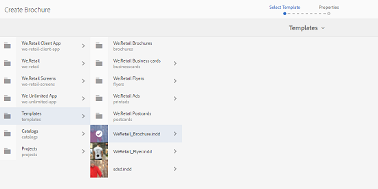
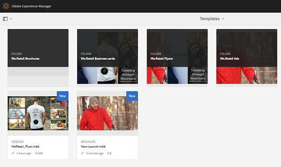

# Elementsjablonen {#asset-templates}

Elementsjablonen zijn een speciale klasse elementen die het snel opnieuw gebruiken van visueel rijke inhoud voor digitale media en gedrukte media mogelijk maken. Een activamalplaatje omvat twee delen, de vaste overseinensectie en de editable sectie.

De sectie met vaste berichten kan eigen inhoud bevatten, zoals merklogo en copyrightinformatie die zijn uitgeschakeld voor bewerking. De bewerkbare sectie kan visuele en tekstuele inhoud bevatten in velden die kunnen worden bewerkt om berichten aan te passen.

Dankzij de flexibiliteit om beperkte bewerkingen uit te voeren en de globale handtekening te beveiligen, zijn asset templates ideaal voor het maken van bouwstenen voor snelle aanpassing en distributie van inhoud als inhoudsartefacten voor verschillende functies. Inhoud die opnieuw wordt gebruikt, helpt de kosten voor het beheer van afdruk- en digitale kanalen te verlagen en biedt holistische en consistente ervaringen op deze kanalen.

Als markeerteken kunt u sjablonen opslaan en beheren in AEM Assets en één basissjabloon gebruiken om eenvoudig meerdere persoonlijke afdrukervaringen te maken. U kunt diverse soorten marketing onderpand, met inbegrip van brochures, vliegers, postcards, visitekaartjes, etc. tot stand brengen om uw marketing bericht aan klanten lucently over te brengen. U kunt ook uitvoer van meerdere pagina&#39;s samenstellen op basis van bestaande of nieuwe afdrukuitvoer. Met name kunt u tegelijkertijd eenvoudig zowel digitale als afdrukervaringen bieden, zodat gebruikers een consistente, geïntegreerde ervaring hebben.

Elementsjablonen zijn meestal Adobe InDesign-bestanden, maar de ervaring in Adobe InDesign vormt geen belemmering voor het maken van stellaire artefacten. U hoeft de velden van uw Adobe InDesign-sjabloon niet toe te wijzen aan de productvelden die u anders nodig hebt bij het maken van catalogi. U kunt de sjablonen in de WYSIWYG-modus rechtstreeks in de webinterface bewerken. Als u echter wilt dat Adobe InDesign uw bewerkingswijzigingen verwerkt, moet u eerst AEM-middelen configureren voor integratie met de Adobe InDesign-server.

De mogelijkheid om Adobe InDesign-sjablonen vanuit de webinterface te bewerken, bevordert een betere samenwerking tussen Creative Suite- en Marketing-medewerkers en verkort tegelijk de tijd die nodig is om lokale promotieinitiatieven op de markt te brengen.

U kunt het volgende doen met middelensjablonen:

* Bewerkbare sjabloonvelden wijzigen vanuit de webinterface
* De basisopmaak van tekst bepalen, zoals tekengrootte, stijl en tekst op tagniveau
* Afbeeldingen in de sjabloon wijzigen met de inhoudkiezer
* Sjabloonbewerkingen voorvertonen
* Meerdere sjabloonbestanden samenvoegen om een vervorming van meerdere pagina&#39;s te maken

Wanneer u een sjabloon voor uw onderpand kiest, maakt AEM Assets een kopie van de sjabloon die u kunt bewerken. De oorspronkelijke sjabloon blijft behouden, zodat uw globale handtekening intact blijft en opnieuw kan worden gebruikt om de consistentie van uw merk te handhaven.

U kunt het bijgewerkte bestand in de bovenliggende map in de volgende indelingen exporteren:

* INDD
* PDF
* JPG

U kunt de uitvoer in deze indelingen ook downloaden naar uw lokale systeem.

## Een zekerheid maken {#creating-a-collateral}

Overweeg een scenario waarin u digitaal afdrukbaar materiaal wilt maken, zoals brochures, vliegers en advertenties voor een komende campagne en wereldwijd wilt delen met verkooppunten. Het creëren van onderpand dat op een malplaatje wordt gebaseerd helpt een verenigde klantenervaring over kanalen leveren. Ontwerpers kunnen de campagnemalplaatjes (enig-pagina of multi-page) tot stand brengen gebruikend een creatieve oplossing, zoals InDesign en de malplaatjes uploaden aan Middelen AEM voor u. Voordat u een zekerheid maakt, moet u een of meer INDD-sjablonen uploaden naar en beschikbaar hebben in Experience Manager.

1. Klik in de interface van Experience Manager op [!UICONTROL Middelen].

1. Kies **[!UICONTROL Sjablonen]** in de opties.

   

1. Klik op **[!UICONTROL Maken]** en kies in het menu het element dat u wilt maken. Kies bijvoorbeeld **[!UICONTROL Brochure]**.

   

1. Een of meer INDD-sjablonen vooraf uploaden naar en beschikbaar hebben in Experience Manager. Kies een sjabloon voor de brochure en klik op **[!UICONTROL Volgende]**.

   

1. Geef een naam en een optionele beschrijving voor de brochure op.

   

1. (Optioneel) Klik op **[!UICONTROL Codes]** en selecteer een of meer codes voor de brochure. Klik op **[!UICONTROL Bevestigen]** om uw selectie te bevestigen.

   

1. Klik op **[!UICONTROL Maken]**. Een dialoogvenster bevestigt dat er een nieuwe brochure wordt gemaakt. Klik op **[!UICONTROL Openen]** om de brochure te openen in de bewerkingsmodus.

   <!-- -->

   U kunt ook het dialoogvenster sluiten en naar de map op de pagina Sjablonen gaan waarmee u bent begonnen om de brochure weer te geven die u hebt gemaakt. Het type van het onderpand verschijnt op zijn duimnagel in kaartmening. In dit geval wordt de brochure bijvoorbeeld weergegeven op de miniatuur.

   

## Een zekerheid bewerken {#editing-a-collateral}

U kunt direct nadat u het hebt gemaakt, een onderpand bewerken. U kunt de sjabloon ook openen vanaf de pagina Sjablonen of de elementpagina.

1. Voer een van de volgende handelingen uit om het onderpand te openen voor bewerking:

   * Open het onderpand (brochure in dit geval) dat u in stap 7 van [Create een onderpand](/help/assets/asset-templates.md#creating-a-collateral)hebt gemaakt.
   * Navigeer op de pagina Sjablonen naar de map waarin u het onderpand hebt gemaakt en klik op de handeling Snel [!UICONTROL bewerken] op de miniatuur van een onderpand.
   * Klik op de werkbalk op **[!UICONTROL Bewerken]** op de elementpagina voor het onderpand.
   * Select the collateral and click **[!UICONTROL Edit]** from the toolbar.
   <!-- -->

   De elementenzoeker en de teksteditor worden links op de pagina weergegeven. De teksteditor is standaard geopend.

   U kunt de teksteditor gebruiken om de tekst te wijzigen die u in het tekstveld wilt weergeven. U kunt de tekengrootte, stijl, kleur en tekst op tagniveau wijzigen.

   Met behulp van de zoekfunctie voor elementen kunt u naar afbeeldingen in AEM-elementen bladeren of deze zoeken en de bewerkbare afbeeldingen in de sjabloon vervangen door afbeeldingen van uw keuze.

   

   De bewerkbare tekst wordt rechts weergegeven. Een veld dat in AEM-elementen kan worden bewerkt, kan alleen worden bewerkt als het desbetreffende veld in de sjabloon in InDesign is gelabeld. Met andere woorden, ze moeten in InDesign als bewerkbaar worden gemarkeerd.

   

   >[!NOTE]
   >
   >Zorg ervoor dat uw AEM-instantie is geïntegreerd met een InDesign-server, zodat AEM-middelen gegevens kunnen extraheren uit de InDesign-sjabloon en deze beschikbaar kunnen maken voor bewerking. Zie AEM-elementen [integreren met InDesign Server](/help/assets/indesign.md)voor meer informatie.

1. Als u de tekst in een bewerkbaar veld wilt wijzigen, klikt u op het tekstveld in de lijst met bewerkbare velden en bewerkt u de tekst in het veld.

   

   U kunt de teksteigenschappen, zoals lettertypestijl, -kleur en -grootte, bewerken met de beschikbare opties.

1. Klik op **[!UICONTROL Voorvertoning]** om een voorvertoning van de tekstwijzigingen weer te geven.

   

1. Als u een afbeelding wilt omwisselen, klikt u op de **[!UICONTROL Asset Finder]**.

   

1. Selecteer het afbeeldingsveld in de lijst met bewerkbare velden en sleep een gewenste afbeelding van de elementkiezer naar het bewerkbare veld.

   

   U kunt ook naar afbeeldingen zoeken met behulp van trefwoorden, tags en op basis van hun publicatiestatus. U kunt door de opslagplaats van de Middelen van AEM doorbladeren en aan de plaats van het gewenste beeld navigeren.

   

1. Klik op **[!UICONTROL Voorvertoning]** om een voorvertoning van de afbeelding weer te geven.

   

1. Als u een specifieke pagina in een pagina-element wilt bewerken dat uit meerdere pagina&#39;s bestaat, gebruikt u de paginanavigator onderaan.

   

1. Klik op **[!UICONTROL Voorvertoning]** op de werkbalk om een voorvertoning van alle wijzigingen weer te geven. Klik op **[!UICONTROL Gereed]** om de bewerkingswijzigingen in het onderpand op te slaan.

   >[!NOTE]
   >
   >De pictogrammen Voorvertoning en Gereed zijn alleen beschikbaar als de bewerkbare afbeeldingsvelden in het onderpand geen ontbrekende pictogrammen hebben. Als er pictogrammen ontbreken in het onderpand, komt dat doordat AEM de afbeeldingen in de InDesign-sjabloon niet kan oplossen. In de volgende gevallen kan AEM afbeeldingen gewoonlijk niet oplossen:
   >
   >    * Afbeeldingen worden niet ingesloten in de onderliggende InDesign-sjabloon
   >    * Afbeeldingen worden gekoppeld vanuit het lokale bestandssysteem
   >
   >Ga als volgt te werk om AEM in te schakelen om afbeeldingen op te lossen:
   >
   >    * Afbeeldingen insluiten tijdens het maken van InDesign-sjablonen (zie [Koppelingen en ingesloten afbeeldingen](https://helpx.adobe.com/indesign/using/graphics-links.html)).
   >    * Koppel AEM aan uw lokale bestandssysteem en wijs vervolgens ontbrekende pictogrammen toe aan bestaande AEM-elementen.
   >
   >Zie [Aanbevolen werkwijzen voor het werken met InDesign-documenten in AEM](https://helpx.adobe.com/experience-manager/kb/best-practices-idd-docs-aem.html)voor meer informatie over het werken met InDesign-documenten.

1. Als u een PDF-uitvoering voor de brochure wilt genereren, selecteert u de optie Acrobat in het dialoogvenster en klikt u op **[!UICONTROL Doorgaan]**.
1. Het onderpand wordt gecreeerd in de omslag u met begon. Als u de vertoningen wilt weergeven, opent u het onderpand en kiest u **[!UICONTROL Uitvoeringen]** in de lijst GlobalNav.

   

1. Klik op de PDF-uitvoering in de lijst met uitvoeringen om het PDF-bestand te downloaden. Open het PDF-bestand om het onderpand te bekijken.

   

## Zekerheden samenvoegen {#merge-collateral}

1. Klik in de interface Experience Manager op [!UICONTROL Middelen] op de navigatiepagina.

1. Kies **[!UICONTROL Sjablonen]** in de opties.

1. Klik op **[!UICONTROL Maken]** en kies **[!UICONTROL Samenvoegen]** in het menu.

   

1. Klik op de pagina [!UICONTROL Sjabloon samenvoegen] op **[!UICONTROL Samenvoegen]**.

   

1. Navigeer naar de locatie van de elementen die u wilt samenvoegen en klik op de miniaturen van de elementen die u wilt samenvoegen om deze te selecteren.

   

   U kunt ook naar sjablonen zoeken in het vak Onderzoek.

   

   U kunt door de gegevensopslagplaats of inzamelingen van Middelen van AEM doorbladeren, en aan de plaats van de gewenste malplaatjes navigeren en dan hen selecteren om samen te voegen.

   

   U kunt verschillende filters toepassen om de gewenste sjablonen te doorzoeken. U kunt bijvoorbeeld naar sjablonen zoeken op basis van het bestandstype of de tags.

   

1. Klik op **[!UICONTROL Volgende]** op de werkbalk.
1. Wijzig in het scherm **[!UICONTROL Voorbeeld en opnieuw rangschikken]** de sjablonen indien nodig en bekijk een voorvertoning van de selectie van de sjablonen die u wilt samenvoegen. Klik vervolgens op **[!UICONTROL Volgende]** op de werkbalk.

   

1. In het [!UICONTROL Configure scherm van het Malplaatje] , specificeer een naam voor het onderpand. U kunt desgewenst tags opgeven die u geschikt acht. Selecteer **[!UICONTROL Acrobat (.PDF)]** als u de uitvoer in PDF-indeling wilt exporteren. Standaard wordt het onderpand geëxporteerd in de JPG- en InDesign-indeling. Als u de weergaveminiatuur voor het uit meerdere pagina&#39;s bestaande element wilt wijzigen, klikt u op **[!UICONTROL Miniatuur]** wijzigen.

   

1. Klik op **[!UICONTROL Opslaan]** en vervolgens op **[!UICONTROL OK]** in het dialoogvenster om het dialoogvenster te sluiten. Het uit meerdere pagina&#39;s bestaande element wordt gemaakt in de map waarmee u bent begonnen.

   >[!NOTE]
   >
   >U kunt een samengevoegd onderpand later niet bewerken of gebruiken om ander onderpand te maken.
