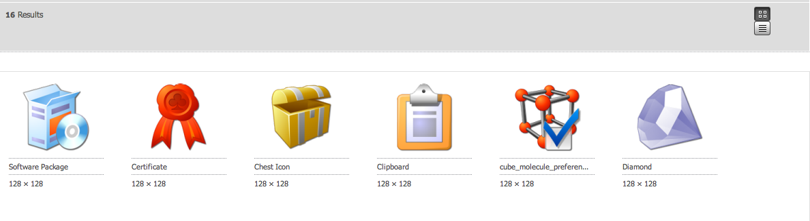
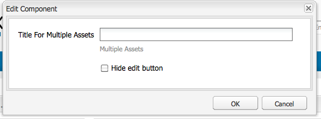

# Elementeditorpagina&#39;s maken en configureren {#creating-and-configuring-asset-editor-pages}

In dit document wordt het volgende beschreven:

* Waarom zou u aangepaste pagina&#39;s in de Editor van middelen maken?
* Pagina&#39;s in de Asset Editor maken en aanpassen. Dit zijn WCM-pagina&#39;s waarmee u metagegevens kunt weergeven en bewerken en acties kunt uitvoeren op het element.
* Meerdere elementen tegelijk bewerken.

<!-- TBD: Add UICONTROL tags. Need PM review. Flatten the structure a bit. Re-write to remove Geometrixx mentions and to adhere to 6.5 default samples. -->

>[!NOTE]
>
>Asset Share is beschikbaar als een open-source referentie-implementatie. Zie [ Commons van het Aandeel van Activa ](https://adobe-marketing-cloud.github.io/asset-share-commons/). Het wordt niet officieel gesteund.

## Waarom de pagina&#39;s van de Redacteur van Activa creëren en vormen? {#why-create-and-configure-asset-editor-pages}

Digital Asset Management wordt in meer scenario&#39;s gebruikt. Wanneer u van een kleinschalige oplossing voor een kleine gebruikersgroep professioneel opgeleide gebruikers - bijvoorbeeld fotografen of taxonomisten - overschakelt op grotere en meer uiteenlopende gebruikersgroepen - bijvoorbeeld zakelijke gebruikers, WCM-auteurs en journalisten - kan de krachtige gebruikersinterface van [!DNL Adobe Experience Manager Assets] te veel informatie bieden. Belanghebbenden vragen om specifieke gebruikersinterfaces of toepassingen voor toegang tot de digitale middelen die voor hen van belang zijn.

Deze asset-centric toepassingen kunnen eenvoudige fotogalerieën in een Intranet zijn waar de werknemers foto&#39;s van handelsshowbezoeken of een perscentrum in een openbaar-onder ogen ziende website kunnen uploaden. Asset-centric toepassingen kunnen ook worden uitgebreid tot complete oplossingen, zoals winkelwagentjes, kassa&#39;s en verificatieprocessen.

Het creëren van een middel-centric toepassing wordt een configuratieproces dat geen codering vereist, slechts kennis van gebruikersgroepen en hun behoeften en kennis van de meta-gegevens die worden gebruikt. Elementgerichte toepassingen die met [!DNL Assets] zijn gemaakt, kunnen worden uitgebreid: met een matige coderingsinspanning kunnen opnieuw bruikbare componenten voor het zoeken, weergeven en wijzigen van elementen worden gemaakt.

Een op elementen gerichte toepassing in [!DNL Experience Manager] bestaat uit een pagina Asset Editor, die kan worden gebruikt voor een gedetailleerde weergave van een specifiek element. Een pagina van de Redacteur van Activa staat ook voor het uitgeven van meta-gegevens toe, op voorwaarde dat de gebruiker die tot de activa toegang heeft de noodzakelijke toestemmingen heeft.

<!--
## Create and configure an Asset Share page {#creating-and-configuring-an-asset-share-page}

You customize the DAM Finder functionality and create pages that have all the functionality you require, which are called Asset Share pages. To create an Asset Share page, you add the page using the Geometrixx Asset Share template and then you customize the actions users can perform on that page, determine how viewers see the assets, and decide how users can build their queries.

Here are some use cases for creating a customized Asset Share page:

* Press Center for Journalists.
* Image Search Engine for internal business users.
* Image Database for website users.
* Media Tagging Interface for metadata editors.

### Create an Asset Share page {#creating-an-asset-share-page}

To create an Asset Share page, you can either create it when you are working on web sites or from the digital asset manager.

>[!NOTE]
>
>By default, when you create an Asset Share page from **New** in the digital asset manager, an Asset viewer and Asset editor are automatically created for you.

To create an new Asset Share page in the **Websites** console:

1. In the **Websites** tab, navigate to the place where you want to create an asset share page and click **New**.

1. Select the **Asset Share** page and click **Create**. The new page is created and the asset share page is listed in the **Websites** tab.

The basic page created using the Geometrixx DAM Asset Share template looks as follows:

To customize your Asset Share page, you use elements from the sidekick and you also edit query builder properties. The page **Geometrixx Press Center** is a customized version of a page based on this template:

To create an asset share page by way of the digital asset manager:

1. In the digital asset manager, in **New**, select **New Asset Share**.
1. In the **Title**, enter the name of the asset share page. If desired, enter a name for the URL.

   

1. Double-click the asset share page to open it and configure the page.

   

   By default, when you create an Asset Share page from **New**, an Asset viewer and Asset editor are automatically created for you.

#### Customize actions {#customizing-actions}

You can determine what actions users can perform on selected digital assets from a selection of predefined actions.

To add actions to the Asset Share page:

1. In the Asset Share page that you want to customize, click **Actions** in the sidekick.

The following actions are available:

 | Action | Description |
 |---|---|
 | [!UICONTROL Delete Action] | Users can delete the selected assets. |
 | [!UICONTROL Download Action] | Lets users download selected assets to their computers. |
 | [!UICONTROL Lightbox Action] | Saves assets to a "lightbox"   where you can perform other actions on them. This comes in handy when working   with assets across multiple pages. The lightbox can also be used as a   shopping cart for assets. |
 | [!UICONTROL Move Action] | Users can move the asset to another   location |
 | [!UICONTROL Tags Action] | Lets users add tags to selected assets |
 | [!UICONTROL View Asset Action] | Opens the asset in the Asset editor for   user manipulation. |

1. Drag the appropriate action to the **Actions** area on the page. Doing so creates a button that is used to execute that action.

#### Determine how search results are presented {#determining-how-search-results-are-presented}

You determine how results are displayed from a predefined list of lenses.

To change how search results are viewed:

1. In the Asset Share page that you want to customize, click Search.

1. Drag the appropriate lens to the top center of the page. In the Press Center, the lenses are already available. Users press the appropriate lens icon to display search results as desired.

The following lenses are available:

| Lens | Description |
|---|---|
| **[!UICONTROL List Lens]** |Presents the assets in a list fashion with details. |
| **[!UICONTROL Mosaic Lens]** |Presents assets in a mosaic fashion. |

#### Mosaic Lens {#mosaic-lens}

#### List Lens {#list-lens}

#### Customize the Query Builder {#customizing-the-query-builder}

The query builder lets you enter search terms and create content for the Asset Share page. When you edit the query builder, you also get to determine how many search results are displayed per page, which asset editor opens when you double-click an asset, the path the query searches, and customizes nodetypes.

To customize the query builder:

1. In the Asset Share page that you want to customize, click **Edit** in the Query Builder. By default, the **General** tab opens.
1. Select the number of results per page, the path of the asset editor (if you have a customized asset editor) and the Actions title.

1. Click the **Paths** tab. Enter a path or multiple paths that the search will run. These paths are overwritten if the user uses the Paths predicate.

1. Enter another node type, if desired.

1. In the **Query Builder URL** field, you can override or wrap the query builder and enter the new servlet URLs with the existing query builder component. In the **Feed URL** field, you can override the Feed URL as well.

1. In the **Text** field, enter the text you want to appear for results and page numbers of results. Click **OK** when finished making changes.

#### Add predicates {#adding-predicates}

Experience Manager Assets includes several predicates that you can add to the Asset Share page. These let your users further narrow searches. In some cases, they may override a query builder parameter (for example, the Path parameter).

To add predicates:

1. In the Asset Share page that you want to customize, click **Search**.

1. Drag the appropriate predicates to the Asset Share page underneath the query builder. Doing so creates the appropriate fields.

The following predicates are available:

| Predicate | Description |
|---|---|
| **[!UICONTROL Date Predicate]** |Lets users search for assets that were modified before and after certain dates. |
| **[!UICONTROL Options Predicate]** |The site owner can specify a property to search for (as in the property predicate, for example, cq:tags) and a content tree to populate the options from (for example, the tag tree). Doing so generates a list of options where the users can select the values (tags) that the selected property (tag property) should have. This predicate lets you build list controls like the list of tags, file types, image orientations, and so on. It is great for a fixed set of options. |
| **[!UICONTROL Path Predicate]** |Lets users define the path and subfolders, if desired. |
| **[!UICONTROL Property Predicate]** |The site owner specifies a property to search for, for example, tiff:ImageLength and the user can then enter a value, for example, 800. This returns all images that are 800 pixels high. Useful predicate if your property can have arbitrary values. |

For more information, see the [predicate Javadocs](https://helpx.adobe.com/experience-manager/6-5/sites/developing/using/reference-materials/javadoc/com/day/cq/search/eval/package-summary.html).

1. To configure the predicate further, double-click it. For example, when you open the Path Predicate, you need to assign the root path.

-->

## Een pagina voor de Editor van middelen maken en configureren {#creating-and-configuring-an-asset-editor-page}

U kunt de Editor van middelen aanpassen om te bepalen hoe gebruikers de digitale elementen kunnen weergeven en bewerken. Hiertoe maakt u een pagina in de Editor van middelen en past u vervolgens de weergaven en acties aan die gebruikers op die pagina kunnen uitvoeren.

>[!NOTE]
>
>Als u aangepaste velden wilt toevoegen aan de DAM Asset Editor, voegt u nieuwe `cq:Widget` knooppunten toe aan `/apps/dam/content/asseteditors.`

### Een pagina voor de Editor van middelen maken {#creating-the-asset-editor-page}

Als u de pagina Asset Editor maakt, is het verstandig de pagina direct onder de pagina Asset Share te maken.

Een pagina voor de Editor van middelen maken:

1. In het **[!UICONTROL Websites]** lusje, navigeer aan de plaats waar u een pagina van de Redacteur van Activa wilt creëren en **Nieuw** klikken.
1. Selecteer **de Redacteur van Activa van 0&rbrace; Geometrixx en klik** creeer **.** De nieuwe pagina wordt gecreeerd en de pagina is vermeld in de **Websites** tabel.

De basispagina die is gemaakt met de sjabloon Geometrixx Asset Editor ziet er als volgt uit:

Als u de pagina Asset Editor wilt aanpassen, gebruikt u elementen van de assistent. De pagina van de Redacteur van Activa die van het **Centrum van de Pers van de Geometrixx** wordt betreden is een aangepaste versie van een pagina die op dit malplaatje wordt gebaseerd:

#### Een Asset Editor instellen om te openen vanaf een pagina voor het delen van elementen {#setting-which-asset-editor-opens-from-an-asset-share-page}

Nadat u de aangepaste pagina Asset Editor hebt gemaakt, dient u ervoor te zorgen dat de elementen op de aangepaste pagina Editor worden geopend wanneer u dubbelklikt op elementen die met Delen van element zijn aangepast.

De pagina Asset Editor instellen:

1. In de pagina van het Aandeel van Activa, geeft de klik **&#x200B;**&#x200B;naast de Bouwer van de Vraag uit.

1. Klik het **Algemene** lusje als het niet reeds wordt geselecteerd.

1. Op het **Weg van de Redacteur van Activa** gebied, ga de weg aan de Redacteur van Activa in u de pagina van het Aandeel van Activa binnen wilt openen en **O.K.** klikken.

#### Elementbewerkingscomponenten toevoegen {#adding-asset-editor-components}

U bepaalt welke functionaliteit een Redacteur van Activa door componenten aan de pagina toe te voegen heeft.

Elementbewerkingscomponenten toevoegen:

1. In de pagina van de Redacteur van Activa die u wilt aanpassen, selecteer **Redacteur van Activa** in sidekick. Alle beschikbare componenten van de Asset Editor worden weergegeven.

>[!NOTE]
>
>Wat u kunt aanpassen, hangt af van welke componenten beschikbaar zijn. Als u componenten wilt inschakelen, gaat u naar de ontwerpmodus en selecteert u de onderdelen die u wilt inschakelen.

1. Sleep de componenten van het hulpstuk aan de Redacteur van Activa en maak om het even welke veranderingen in de de dialoogvakjes van de componentendialoog aan. De componenten worden beschreven in de volgende lijst en in de gedetailleerde instructies beschreven die volgen.

>[!NOTE]
>
>Bij het ontwerpen van de pagina Asset Editor maakt u componenten die alleen-lezen of bewerkbaar zijn. Gebruikers weten dat een veld kan worden bewerkt als een afbeelding van een potlood in die component wordt weergegeven. Standaard worden de meeste componenten ingesteld als alleen-lezen.

| Component | Beschrijving |
|---|---|
| **[!UICONTROL Metadata Form]en[!UICONTROL Metadata Text Field]** | Hiermee kunt u aanvullende metagegevens aan een element toevoegen en een handeling op dat element uitvoeren, zoals verzenden. |
| **[!UICONTROL Sub Assets]** | Hiermee kunt u subelementen aanpassen. |
| **Markeringen** | Gebruikers kunnen tags selecteren en aan een element toevoegen. |
| **[!UICONTROL Thumbnail]** | Toont een duimnagel van het element, zijn filename, en laat u een afwisselende tekst toevoegen. U kunt ook hier de acties in de Asset Editor toevoegen. |
| **[!UICONTROL Title]** | Hiermee geeft u de titel van het element weer, die kan worden aangepast. |

#### Metagegevensformulier en tekstveld - De component Metagegevens weergeven configureren {#metadata-form-and-text-field-configuring-the-view-metadata-component}

Het metagegevensformulier is een formulier met een begin- en eindactie. In tussen, gaat u **gebieden van de Tekst 0&rbrace; in.** Zie [ Forms ](/help/sites-authoring/default-components-foundation.md#form-component) voor meer informatie bij het werken met vormen.

1. Creeer een beginactie door **te klikken geeft** op het gebied van het Begin van de vorm uit. U kunt desgewenst een titel voor een vak invoeren. Door gebrek, is de titel van de Doos **Meta-gegevens**. Schakel het selectievakje Clientvalidatie in als u de JavaScript-clientcode voor validatie wilt genereren.

1. Creeer een actie van het Eind door **te klikken geeft** op het gebied van het Eind van de vorm uit. U kunt bijvoorbeeld een **[!UICONTROL Submit]** -optie maken waarmee gebruikers hun wijzigingen in metagegevens kunnen verzenden. Naar keuze, kunt u de optie van het Terugstellen van de a **&#x200B;**&#x200B;toevoegen die de meta-gegevens aan zijn originele staat terugstelt.

1. In tussen het **Begin van de Vorm** en het **Eind van de Vorm**, sleep de Gebieden van de Tekst van Meta-gegevens aan de vorm. Gebruikers vullen metagegevens in deze tekstvelden in. Deze kunnen worden verzonden of een andere actie uitvoeren.

1. Dubbelklik de gebiedsnaam, bijvoorbeeld, **Titel** om het meta-gegevensgebied te openen en veranderingen aan te brengen. In het **Algemene** lusje van **geeft het venster van de Component** uit, bepaalt u namespace en het gebiedsetiket en type, bijvoorbeeld, `dc:title`.

Zie [ Aanpassen en Uitbreidend Assets ](/help/assets/extending-assets.md) voor informatie bij het wijzigen van namespaces beschikbaar in de meta-gegevensvorm.

1. Klik de **Beperkingen** tabel. Hier kunt u selecteren of een veld vereist is en zo nodig beperkingen toevoegen.

1. Klik de **Vertoning** tabel. Hier kunt u een nieuwe breedte en een nieuw aantal rijen voor het meta-gegevensgebied ingaan. Selecteer het **Gebied is read slechts** checkbox om gebruikers toe te laten de meta-gegevens uitgeven.

Hieronder ziet u een voorbeeld van een metagegevensformulier met verschillende velden:

Op de pagina Asset Editor kunnen gebruikers vervolgens waarden invoeren in de metagegevensvelden (als deze bewerkbaar zijn) en de eindactie uitvoeren (bijvoorbeeld door de wijzigingen te verzenden).

#### Subactiva {#sub-assets}

In de subcomponent Assets kunt u subelementen weergeven en selecteren. U kunt bepalen welke namen onder [ belangrijkste activa ](/help/assets/assets.md#what-are-digital-assets) en sub-activa verschijnen.

Dubbelklik op de component Sub-Assets, zodat u het dialoogvenster met subelementen kunt openen waarin u de titels voor het hoofdelement en eventuele subelementen kunt wijzigen. De standaardwaarden worden onder het desbetreffende veld weergegeven.

Hier volgt een voorbeeld van een gevulde Sub-Assets-component:

Als u bijvoorbeeld een subelement selecteert, ziet u hoe de component de juiste pagina weergeeft en hoe de titel van het vak verandert van Sub-Assets in Siblings.

#### Tags {#tags}

De component Tags is een component waarin gebruikers bestaande tags aan een element kunnen toewijzen. Hierdoor kunnen gebruikers de elementen later ordenen en ophalen. U kunt van deze component alleen-lezen maken, zodat gebruikers geen codes kunnen toevoegen, maar alleen deze weergeven.

Dubbelklik op de component Tags, zodat u het dialoogvenster Codes kunt openen waarin u desgewenst de titel van Codes kunt wijzigen en waarin u de toegewezen naamruimten kunt selecteren. Schakel het selectievakje **[!UICONTROL Hide Edit]** uit om dit veld bewerkbaar te maken. Standaard zijn codes bewerkbaar.

Als gebruikers tags kunnen bewerken, kunnen ze op het potlood klikken om tags toe te voegen door deze te selecteren in het vervolgkeuzemenu Codes.

Hier volgt een gevulde component Tags:

#### Miniatuur {#thumbnail}

In het element Miniatuur wordt de geselecteerde miniatuur weergegeven (bij veel van de indelingen wordt de miniatuur automatisch geëxtraheerd). Bovendien toont de component filename, en [ acties die u ](/help/assets/assets-finder-editor.md#adding-asset-editor-actions) kunt wijzigen.

Dubbelklik op de miniatuurcomponent zodat u het dialoogvenster met miniaturen kunt openen waarin u de alt-tekst kunt wijzigen. Door gebrek, blijft de duimnagel alt tekst **klikken om** activa te downloaden.

Hieronder ziet u een voorbeeld van een gevulde miniatuurcomponent:

#### Titel {#title}

In de component Title worden de titel van het element en een beschrijving weergegeven.

Standaard bevindt het bestand zich in de modus Alleen-lezen, zodat gebruikers het bestand niet kunnen bewerken. Om het editable te maken, klik de component tweemaal en ontruim **uitgeeft knoop** checkbox. Voer bovendien een titel in voor meerdere elementen.

Als de Titel kan worden uitgegeven, kunt u een titel en een beschrijving toevoegen door het Potlood te klikken om het **venster van de Eigenschappen van 0&rbrace; Activa te openen &lbrace;.** Bovendien kunt u het element in- en uitschakelen door de datum en tijd te selecteren.

Wanneer het uitgeven van [!UICONTROL Title], kunnen de gebruikers de **Titel**, **Beschrijving** veranderen, en **ingaan** en **van Tijden** om de activa aan en weg te zetten.

Hier volgt een voorbeeld van een gevulde component Title:

#### Acties in de Asset Editor toevoegen {#adding-asset-editor-actions}

U kunt bepalen welke handelingen gebruikers op geselecteerde digitale elementen kunnen uitvoeren op basis van een selectie vooraf gedefinieerde handelingen.

Handelingen toevoegen aan de pagina Asset Editor:

1. In de pagina van de Redacteur van Activa die u wilt aanpassen, klik **Redacteur van Activa** in sidekick.

De volgende acties zijn beschikbaar:

| Handeling | Beschrijving |
|---|---|
| [!UICONTROL Download] | Hiermee kunnen gebruikers geselecteerde elementen downloaden naar hun computers. |
| [!UICONTROL Editors] | Gebruikers kunnen een afbeelding bewerken (interactief bewerken) |
| [!UICONTROL Lightbox] | Hiermee slaat u elementen op in een &#39;lichtbak&#39; waar u andere handelingen op kunt uitvoeren. Dit is handig wanneer u met elementen op meerdere pagina&#39;s werkt. |
| [!UICONTROL Locking] | Hiermee kunnen gebruikers een element vergrendelen. Deze functionaliteit is niet standaard ingeschakeld en moet zijn ingeschakeld in de lijst met componenten. |
| [!UICONTROL References] | Klik hierop om te tonen op welke pagina&#39;s het element wordt gebruikt. |
| [!UICONTROL Versioning] | Hiermee kunt u versies van een element maken en herstellen. |

1. Sleep de aangewezen actie aan het **gebied van Acties** op de pagina. Er wordt een optie gemaakt waarmee de handeling wordt uitgevoerd die op de pagina wordt gesleept.

## Elementen bewerken via de pagina Asset Editor {#multi-editing-assets-with-the-asset-editor-page}

Met [!DNL Experience Manager Assets] kunt u verschillende elementen tegelijk wijzigen. Nadat u de elementen hebt geselecteerd, kunt u tegelijkertijd tags en metagegevens wijzigen.

Elementen bewerken via de pagina Asset Editor:

1. Open de Geometrixx **pagina van het Centrum van de Pers 1&rbrace;:**
   `https://localhost:4502/content/geometrixx/en/company/press.html`

1. Selecteer de elementen:

   * in Windows: `Ctrl + click` elk element.
   * op Mac: `Cmd + click` elk element.

   Als u een reeks elementen wilt selecteren, klikt u op het eerste element en `Shift + click` op het laatste element.

1. Klik **uitgeven Meta-gegevens** op het **3&rbrace; gebied van Acties &lbrace;(linkerdeel van de pagina).**
1. De Geometrixx **pagina van de Redacteur van de Activa van het Centrum van de pers** opent in een nieuw lusje. De metagegevens van de elementen worden als volgt weergegeven:

   * Een label-dat niet op alle activa maar slechts op slechts enkelen van toepassing is - wordt getoond in cursief.
   * Een label dat op alle elementen van toepassing is, wordt met een normaal lettertype weergegeven.
   * Andere metagegevens dan labels: de waarde van het veld wordt alleen weergegeven als deze voor alle geselecteerde elementen gelijk is.

1. Klik **Download** om een dossier van het PIT te downloaden dat de activa originele vertoningen bevat.
1. Klik uitgeven de markeringsoptie die naast het **gebied van Markeringen** is.

   * Een tag die niet van toepassing is op alle elementen, maar alleen op een paar elementen, heeft een grijze achtergrond.
   * Een tag die op alle elementen van toepassing is, heeft een witte achtergrond.

   U kunt:

   * Klik op `x` om de tag voor alle elementen te verwijderen.
   * Klik op `+` om de tag aan alle elementen toe te voegen.
   * Klik de **pijl** en selecteer een markering om een nieuwe markering aan alle activa toe te voegen.

   Klik **O.K.** om de veranderingen in de vorm te schrijven. De doos naast het **gebied van Markeringen** wordt automatisch gecontroleerd.

1. Bewerk het veld Beschrijving. Stel deze bijvoorbeeld in op:

   `This is a common description`

   Wanneer een veld wordt bewerkt, overschrijft de waarde de bestaande waarden van de geselecteerde elementen wanneer het formulier wordt verzonden.

   Opmerking: het vak naast het veld wordt automatisch ingeschakeld wanneer het veld wordt bewerkt.

1. Klik **Metagegevens van de Update** om de vorm voor te leggen en de veranderingen voor alle activa te bewaren.

   Opmerking: alleen de geselecteerde metagegevens worden gewijzigd.
