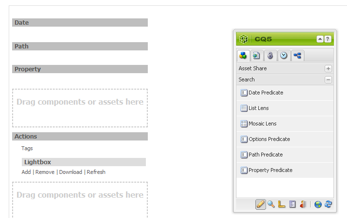
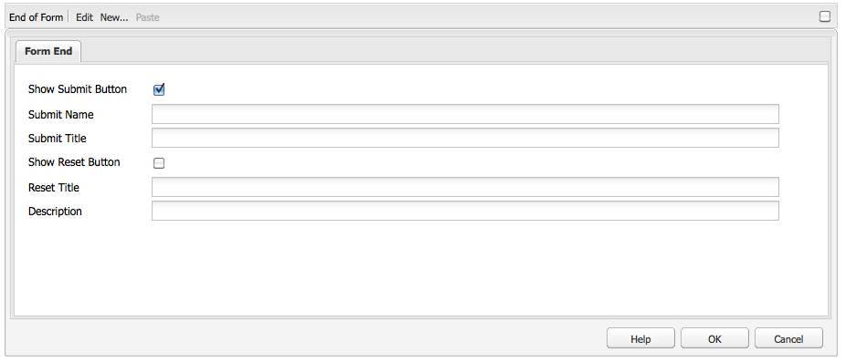
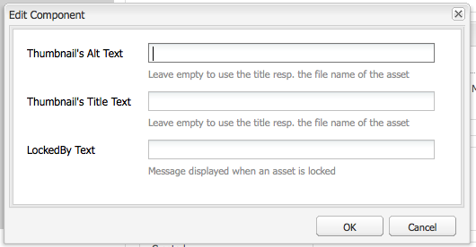

# Elementeditorpagina&#39;s maken en configureren {#creating-and-configuring-asset-editor-pages}

In dit document wordt het volgende beschreven:

* Waarom zou u aangepaste pagina&#39;s in de Asset Editor maken.
* Hoe te om de pagina&#39;s van de Redacteur van Activa tot stand te brengen en aan te passen, die WCM pagina&#39;s zijn die u meta-gegevens bekijken en laten uitgeven evenals acties op de activa uitvoeren.
* Meerdere elementen tegelijk bewerken.

<!-- TBD: Add UICONTROL tags. Need PM review. Flatten the structure a bit. Re-write to remove Geometrixx mentions and to adhere to 6.5 default samples. -->

>[!NOTE]
>
>Asset Share is beschikbaar als een open-source referentie-implementatie. Zie Opmerkingen voor [het delen van elementen](https://adobe-marketing-cloud.github.io/asset-share-commons/). Het wordt niet officieel gesteund.

## Waarom de pagina&#39;s van de Redacteur van Activa creëren en vormen? {#why-create-and-configure-asset-editor-pages}

Digital Asset Management wordt in steeds meer scenario&#39;s gebruikt. Bij de overgang van een kleinschalige oplossing voor een kleine gebruikersgroep professioneel opgeleide gebruikers - bijvoorbeeld fotografen of taxonomisten - naar grotere en meer gevarieerde gebruikersgroepen - bijvoorbeeld zakelijke gebruikers, WCM-auteurs, journalisten, enzovoort - kan de krachtige gebruikersinterface van Adobe Experience Manager Assets voor professionele gebruikers te veel informatie bieden en kunnen belanghebbenden specifieke gebruikersinterfaces of toepassingen aanvragen om toegang te krijgen tot de digitale middelen die voor hen van belang zijn.

Deze asset-centric toepassingen kunnen eenvoudige fotogalerieën in een Intranet zijn waar de werknemers foto&#39;s van handelsshowbezoeken of een perscentrum in een openbaar-onder ogen ziende website kunnen uploaden. Asset-centric toepassingen kunnen ook worden uitgebreid tot complete oplossingen, zoals winkelwagentjes, kassa&#39;s en verificatieprocessen.

Het creëren van een middel-centric toepassing wordt grotendeels een configuratieproces dat geen codering vereist, slechts kennis van gebruikersgroepen en hun behoeften evenals kennis van de meta-gegevens die worden gebruikt. Elementgerichte toepassingen die zijn gemaakt met Elementen zijn uitbreidbaar: met een matige codeerinspanning kunnen herbruikbare componenten voor het zoeken, bekijken, en het wijzigen van activa worden gecreeerd.

Een op elementen gerichte toepassing in Experience Manager bestaat uit een pagina Asset Editor, die kan worden gebruikt om een gedetailleerde weergave van een specifiek element te krijgen. Een pagina van de Redacteur van Activa staat ook voor het uitgeven van meta-gegevens toe, op voorwaarde dat de gebruiker die tot de activa toegang heeft de noodzakelijke toestemmingen heeft.

<!--
## Create and configure an Asset Share page {#creating-and-configuring-an-asset-share-page}

You customize the DAM Finder functionality and create pages that have all the functionality you require, which are called Asset Share pages. To create a new Asset Share page, you add the page using the Geometrixx Asset Share template and then you customize the actions users can perform on that page, determine how viewers see the assets, and decide how users can build their queries.

Here are some use cases for creating a customized Asset Share page:

* Press Center for Journalists.
* Image Search Engine for internal business users.
* Image Database for website users.
* Media Tagging Interface for metadata editors.

### Create an Asset Share page {#creating-an-asset-share-page}

To create a new Asset Share page, you can either create it when you are working on web sites or from the digital asset manager.

>[!NOTE]
>
>By default, when you create an Asset Share page from **New** in the digital asset manager, an Asset viewer and Asset editor are automatically created for you.

To create an new Asset Share page in the **Websites** console:

1. In the **Websites** tab, navigate to the place where you want to create an asset share page and click **New**.

1. Select the **Asset Share** page and click **Create**. The new page is created and the asset share page is listed in the **Websites** tab.

The basic page created using the Geometrixx DAM Asset Share template looks as follows:

To customize your Asset Share page, you use elements from the sidekick and you also edit query builder properties. The page **Geometrixx Press Center** is a customized version of a page based on this template:

To create a new asset share page via the digital asset manager:

1. In the digital asset manager, in **New**, select **New Asset Share**.
1. In the **Title**, enter the name of the asset share page. If desired, enter a name for the URL.

   

1. Double-click the asset share page to open it and configure the page.

   

   By default, when you create an Asset Share page from **New**, an Asset viewer and Asset editor are automatically created for you.

#### Customize actions {#customizing-actions}

You can determine what actions users can perform on selected digital assets from a selection of predefined actions.

To add actions to the Asset Share page:

1. In the Asset Share page that you want to customize, click **Actions** in the sidekick.

The following actions are available:

 | Action | Description |
 |---|---|
 | [!UICONTROL Delete Action] | Users can delete the selected assets. |
 | [!UICONTROL Download Action] | Lets users download selected assets to their computers. |
 | [!UICONTROL Lightbox Action] | Saves assets to a "lightbox"   where you can perform other actions on them. This comes in handy when working   with assets across multiple pages. The lightbox can also be used as a   shopping cart for assets. |
 | [!UICONTROL Move Action] | Users can move the asset to another   location |
 | [!UICONTROL Tags Action] | Lets users add tags to selected assets |
 | [!UICONTROL View Asset Action] | Opens the asset in the Asset editor for   user manipulation. |

1. Drag the appropriate action to the **Actions** area on the page. Doing so creates a button that is used to execute that action.

#### Determine how search results are presented {#determining-how-search-results-are-presented}

You determine how results are displayed from a predefined list of lenses.

To change how search results are viewed:

1. In the Asset Share page that you want to customize, click Search.

1. Drag the appropriate lens to the top center of the page. In the Press Center, the lenses are already available. Users press the appropriate lens icon to display search results as desired.

The following lenses are available:

| Lens | Description |
|---|---|
| **[!UICONTROL List Lens]** |Presents the assets in a list fashion with details. |
| **[!UICONTROL Mosaic Lens]** |Presents assets in a mosaic fashion. |

#### Mosaic Lens {#mosaic-lens}

#### List Lens {#list-lens}

#### Customize the Query Builder {#customizing-the-query-builder}

The query builder lets you enter search terms and create content for the Asset Share page. When you edit the query builder, you also get to determine how many search results are displayed per page, which asset editor opens when you double-click an asset, the path the query searches, and customizes nodetypes.

To customize the query builder:

1. In the Asset Share page that you want to customize, click **Edit** in the Query Builder. By default, the **General** tab opens.
1. Select the number of results per page, the path of the asset editor (if you have a customized asset editor) and the Actions title.

1. Click the **Paths** tab. Enter a path or multiple paths that the search will run. These paths are overwritten if the user uses the Paths predicate.

1. Enter another node type, if desired.

1. In the **Query Builder URL** field, you can override or wrap the query builder and enter the new servlet URLs with the existing query builder component. In the **Feed URL** field, you can override the Feed URL as well.

1. In the **Text** field, enter the text you want to appear for results and page numbers of results. Click **OK** when finished making changes.

#### Add predicates {#adding-predicates}

Experience Manager Assets includes a number of predicates that you can add to the Asset Share page. These let your users further narrow searches. In some cases, they may override a query builder parameter (for example, the Path parameter).

To add predicates:

1. In the Asset Share page that you want to customize, click **Search**.

1. Drag the appropriate predicates to the Asset Share page underneath the query builder. Doing so creates the appropriate fields.

The following predicates are available:

| Predicate | Description |
|---|---|
| **[!UICONTROL Date Predicate]** |Lets users search for assets that were modified before and after certain dates. |
| **[!UICONTROL Options Predicate]** |The site owner can specify a property to search for (as in the property predicate, for example cq:tags) and a content tree to populate the options from (for example the tag tree). Doing so generates a list of options where the users can select the values (tags) that the selected property (tag property) should have. This predicate lets you build list controls like the list of tags, file types, image orientations, and so on. It is great for a fixed set of options. |
| **[!UICONTROL Path Predicate]** |Lets users define the path and subfolders, if desired. |
| **[!UICONTROL Property Predicate]** |The site owner specifies a property to search for, e.g. tiff:ImageLength and the user can then enter a value, e.g. 800. This returns all images that are 800 pixels high. Useful predicate if your property can have arbitrary values. |

For more information, see the [predicate Javadocs](https://helpx.adobe.com/experience-manager/6-5/sites/developing/using/reference-materials/javadoc/com/day/cq/search/eval/package-summary.html).

1. To configure the predicate further, double-click it. For example, when you open the Path Predicate, you need to assign the root path.

-->

## Een pagina voor de Editor van middelen maken en configureren {#creating-and-configuring-an-asset-editor-page}

U kunt de middeleneditor aanpassen om te bepalen hoe gebruikers de digitale elementen kunnen weergeven en bewerken. Hiertoe maakt u een nieuwe pagina in de Editor van middelen en past u de weergaven aan en de acties die gebruikers op die pagina kunnen uitvoeren.

>[!NOTE]
>
>Als u aangepaste velden wilt toevoegen aan de DAM Asset Editor, voegt u nieuwe `cq:Widget` knooppunten toe aan `/apps/dam/content/asseteditors.`

### Een pagina voor de Editor van middelen maken {#creating-the-asset-editor-page}

Als u de pagina Asset Editor maakt, is het verstandig de pagina direct onder de pagina Asset Share te maken.

Een pagina voor de Editor van middelen maken:

1. Navigeer op het **[!UICONTROL Websites]** tabblad naar de plaats waar u een pagina voor de middeleneditor wilt maken en klik op **Nieuw**.
1. Selecteer **Geometrixx-itemeditor** en klik op **Maken**. De nieuwe pagina wordt gemaakt en de pagina wordt weergegeven op het tabblad **Websites** .

De basispagina die is gemaakt met de sjabloon Geometrixx Asset Editor ziet er als volgt uit:

Als u de pagina Asset Editor wilt aanpassen, gebruikt u elementen van de assistent. De pagina Asset Editor die vanuit het **Geometrixx Press Center** wordt geopend, is een aangepaste versie van een pagina die op deze sjabloon is gebaseerd:

#### Een Asset Editor instellen om te openen vanaf een pagina voor het delen van elementen {#setting-which-asset-editor-opens-from-an-asset-share-page}

Nadat u de aangepaste pagina Asset Editor hebt gemaakt, moet u ervoor zorgen dat de elementen op de aangepaste pagina Editor worden geopend wanneer u dubbelklikt op elementen die u hebt gemaakt met het aangepaste Delen van middelen.

De pagina Asset Editor instellen:

1. Klik in de pagina Asset Share op **Bewerken** naast de Query Builder.

1. Klik op het tabblad **Algemeen** als dit nog niet is geselecteerd.

1. Voer in het veld **Pad van de Asset Editor** het pad naar de editor voor middelen in waarin de pagina voor het delen van elementen moet worden geopend en klik op **OK**.

#### Elementbewerkingscomponenten toevoegen {#adding-asset-editor-components}

U bepaalt welke functionaliteit een middeleneditor heeft door componenten aan de pagina toe te voegen.

Elementeditorcomponenten toevoegen:

1. Selecteer de optie **Asset Editor** in de assistent op de pagina Asset Editor die u wilt aanpassen. Alle beschikbare componenten van de middeleneditor worden weergegeven.

>[!NOTE]
>
>Wat u kunt aanpassen, hangt af van welke componenten beschikbaar zijn. Als u componenten wilt inschakelen, gaat u naar de ontwerpmodus en selecteert u de onderdelen die u wilt inschakelen.

1. Sleep de componenten van de hulpwerkplaats aan de activaredacteur en maak om het even welke wijzigingen in de componentendialogen. De componenten worden beschreven in de volgende lijst en in de gedetailleerde instructies beschreven die volgen.

>[!NOTE]
>
>Bij het ontwerpen van de pagina voor de middeleneditor maakt u componenten die alleen-lezen of bewerkbaar zijn. Gebruikers weten dat een veld kan worden bewerkt als een afbeelding van een potlood in die component wordt weergegeven. Standaard worden de meeste componenten ingesteld als alleen-lezen.

| Component | Beschrijving |
|---|---|
| **[!UICONTROL Metadata Form]and[!UICONTROL Metadata Text Field]** | Hiermee kunt u aanvullende metagegevens aan een element toevoegen en een handeling op dat element uitvoeren, zoals verzenden. |
| **[!UICONTROL Sub Assets]** | Hiermee kunt u subelementen aanpassen. |
| **Tags** | Gebruikers kunnen tags selecteren en aan een element toevoegen. |
| **[!UICONTROL Thumbnail]** | Toont een duimnagel van het element, zijn filename, en laat u een afwisselende tekst toevoegen. U kunt hier ook acties voor middeleneditors toevoegen. |
| **[!UICONTROL Title]** | Hiermee geeft u de titel van het element weer, die kan worden aangepast. |

#### Metagegevensformulier en tekstveld - De component Metagegevens weergeven configureren {#metadata-form-and-text-field-configuring-the-view-metadata-component}

Het metagegevensformulier is een formulier met een begin- en eindactie. Tussendoor voert u **tekstvelden** in. Zie [Forms](/help/sites-authoring/default-components-foundation.md#form-component) voor meer informatie over het werken met formulieren.

1. Maak een startactie door in het gedeelte Start van het formulier op **Bewerken** te klikken. U kunt desgewenst een titel voor een vak invoeren. Standaard is de titel van het vak **Metagegevens**. Schakel het selectievakje Clientvalidatie in als u de Java-Script-clientcode voor validatie wilt genereren.

1. Maak een actie Einde door te klikken op **Bewerken** in het gebied Einde van het formulier. U kunt bijvoorbeeld een knop **Verzenden** maken waarmee gebruikers hun wijzigingen in de metagegevens kunnen verzenden. U kunt desgewenst een knop **Herstellen** toevoegen waarmee de metagegevens in de oorspronkelijke staat worden hersteld.

1. Sleep Metagegevenstekstvelden tussen het begin **van het** formulier en het einde **van het** formulier naar het formulier. Gebruikers vullen metagegevens in deze tekstvelden in. Deze kunnen worden verzonden of een andere actie uitvoeren.

1. Dubbelklik op de veldnaam, bijvoorbeeld **Titel** om het metagegevensveld te openen en wijzigingen aan te brengen. Op het tabblad **Algemeen** van het venster Component **** bewerken definieert u de naamruimte en het veldlabel, evenals het type, bijvoorbeeld `dc:title`.

Zie Elementen [aanpassen en uitbreiden](/help/assets/extending-assets.md) voor informatie over het wijzigen van de naamruimten in het metagegevensformulier.

1. Klik op het tabblad **Restricties** . Hier kunt u selecteren of een veld vereist is en zo nodig beperkingen toevoegen.

1. Klik op het tabblad **Weergave** . Hier kunt u een nieuwe breedte en een nieuw aantal rijen voor het meta-gegevensgebied ingaan. Schakel het selectievakje **Veld is alleen** -lezen in om gebruikers toe te staan de metagegevens te bewerken.

Hieronder ziet u een voorbeeld van een metagegevensformulier met verschillende velden:

Op de pagina Asset Editor kunnen gebruikers vervolgens waarden invoeren in de metagegevensvelden (als deze bewerkbaar zijn) en de eindactie uitvoeren (bijvoorbeeld door de wijzigingen te verzenden).

#### Subactiva {#sub-assets}

In de component Subelementen kunt u subelementen weergeven en selecteren. U kunt bepalen welke namen onder het [hoofdelement](/help/assets/assets.md#what-are-digital-assets) en de subelementen worden weergegeven.

Dubbelklik op de component Subelementen om het dialoogvenster Subelementen te openen, waarin u de titels voor het hoofdelement en eventuele subelementen kunt wijzigen. De standaardwaarden worden onder het desbetreffende veld weergegeven.

Hieronder ziet u een voorbeeld van een onderdeel van een subelement dat is gevuld:

Als u bijvoorbeeld een subelement selecteert, ziet u hoe de component de juiste pagina weergeeft en hoe de titel van het vak verandert van Subelementen in Siblings.

#### Tags {#tags}

De component Tags is een component waarin gebruikers bestaande tags aan een element kunnen toewijzen. Hierdoor kunnen gebruikers de elementen later ordenen en ophalen. U kunt van deze component alleen-lezen maken, zodat gebruikers geen codes kunnen toevoegen, maar alleen deze weergeven.

Dubbelklik op de component Tags om het dialoogvenster Codes te openen waarin u desgewenst de titel van Codes kunt wijzigen en waarin u de toegewezen naamruimten kunt selecteren. Als u dit veld bewerkbaar wilt maken, schakelt u het **[!UICONTROL Hide Edit]** selectievakje uit. Standaard zijn codes bewerkbaar.

Als gebruikers tags kunnen bewerken, kunnen ze op het potlood klikken om tags toe te voegen door deze te selecteren in het vervolgkeuzemenu Codes.

Hier volgt een gevulde component Tags:

#### Miniatuur {#thumbnail}

In het element Miniatuur wordt de geselecteerde miniatuur weergegeven (bij veel van de indelingen wordt de miniatuur automatisch geëxtraheerd). Bovendien geeft de component de bestandsnaam weer en [acties die u kunt wijzigen](/help/assets/assets-finder-editor.md#adding-asset-editor-actions).

Dubbelklik op de miniatuurcomponent om het dialoogvenster met miniaturen te openen waarin u de alt-tekst kunt wijzigen. Standaard wordt in de alt-tekst van de miniatuur **Klikken standaard gebruikt om elementen te downloaden** .

Hieronder ziet u een voorbeeld van een gevulde miniatuurcomponent:

#### Titel {#title}

In de component Title worden de titel van het element en een beschrijving weergegeven.

Standaard bevindt het bestand zich in de modus Alleen-lezen, zodat gebruikers het bestand niet kunnen bewerken. Als u dit bewerkbaar wilt maken, dubbelklikt u op de component en schakelt u het selectievakje **Bewerken verbergen** uit. Voer bovendien een titel in voor meerdere elementen.

Als de titel kan worden bewerkt, kunt u een titel en een beschrijving toevoegen door op het potlood te klikken om het venster Eigenschappen van **element** te openen. Bovendien kunt u het element in- en uitschakelen door de datum en tijd te selecteren.

Tijdens het bewerken van de afbeelding kunnen gebruikers de [!UICONTROL Title]Titel **,** Beschrijving **wijzigen en** Aan **en** Uit-tijd **** invoeren om het element in en uit te schakelen.

Hier volgt een voorbeeld van een gevulde component Title:

#### Acties in de Asset Editor toevoegen {#adding-asset-editor-actions}

U kunt bepalen welke handelingen gebruikers op geselecteerde digitale elementen kunnen uitvoeren op basis van een selectie vooraf gedefinieerde handelingen.

Handelingen toevoegen aan de pagina Asset Editor:

1. Klik op de pagina Asset Editor die u wilt aanpassen op **Asset Editor** in de assistent.

De volgende acties zijn beschikbaar:

| Actie | Beschrijving |
|---|---|
| [!UICONTROL Download] | Hiermee kunnen gebruikers geselecteerde elementen downloaden naar hun computers. |
| [!UICONTROL Editors] | Gebruikers kunnen een afbeelding bewerken (interactief bewerken) |
| [!UICONTROL Lightbox] | Hiermee slaat u elementen op in een &#39;lichtbak&#39; waar u andere handelingen op kunt uitvoeren. Dit is handig wanneer u met elementen op meerdere pagina&#39;s werkt. |
| [!UICONTROL Locking] | Hiermee kunnen gebruikers een element vergrendelen. Deze functionaliteit is niet standaard ingeschakeld en moet worden ingeschakeld in de lijst met componenten. |
| [!UICONTROL References] | Klik hierop om te tonen op welke pagina&#39;s het element wordt gebruikt. |
| [!UICONTROL Versioning] | Hiermee kunt u versies van een element maken en herstellen. |

1. Sleep de gewenste actie naar het gebied **Handelingen** op de pagina. Als u dit doet, wordt een knop gemaakt waarmee die handeling wordt uitgevoerd.

## Elementen bewerken via de pagina Asset Editor {#multi-editing-assets-with-the-asset-editor-page}

Met Experience Manager-elementen kunt u meerdere elementen tegelijk wijzigen. Nadat u elementen hebt geselecteerd, kunt u tegelijkertijd de volgende wijzigingen aanbrengen:

* Tags
* Metagegevens

Elementen bewerken via de pagina Asset Editor:

1. Open de pagina **Press Center** :
   `https://localhost:4502/content/geometrixx/en/company/press.html`

1. Selecteer de elementen:

   * in Windows: `Ctrl + click` elk element.
   * op Mac: `Cmd + click` elk element.

   Een reeks elementen selecteren: Klik op het eerste element en vervolgens op `Shift + click` het laatste element.

1. Klik op Metagegevens **** bewerken in het veld **Handelingen** (links op de pagina).
1. De pagina Geometrixx **Press Center Asset Editor** wordt op een nieuw tabblad geopend. De metagegevens van de elementen worden als volgt weergegeven:

   * Een tag, die niet van toepassing is op alle elementen, maar alleen op een paar elementen, wordt cursief weergegeven.
   * Een label dat op alle elementen van toepassing is, wordt met een normaal lettertype weergegeven.
   * Andere metagegevens dan codes: de waarde van het veld wordt alleen weergegeven als deze voor alle geselecteerde elementen gelijk is.

1. Klik op **Downloaden** om een ZIP-bestand met de elementen van de oorspronkelijke vertoningen te downloaden.
1. Klik op de optie Codes naast het veld **Codes** bewerken.

   * Een tag die niet van toepassing is op alle elementen, maar alleen op een paar elementen, heeft een grijze achtergrond.
   * Een tag die van toepassing is op alle elementen heeft een witte achtergrond.

   U kunt:

   * Klik `x` om de tag voor alle elementen te verwijderen.
   * Klik `+` om de tag aan alle elementen toe te voegen.
   * Klik op de **pijl** en selecteer een tag om een nieuwe tag aan alle elementen toe te voegen.

   Klik op **OK** om de wijzigingen in het formulier te schrijven. Het vak naast het veld **Codes** wordt automatisch ingeschakeld.

1. Bewerk het veld Beschrijving. Stel bijvoorbeeld in op:

   `This is a common description`

   Wanneer een veld wordt bewerkt, overschrijft de waarde de bestaande waarden van de geselecteerde elementen wanneer het formulier wordt verzonden.

   Opmerking: Het vak naast het veld wordt automatisch ingeschakeld wanneer het veld wordt bewerkt.

1. Klik op Metagegevens **** bijwerken om het formulier te verzenden en de wijzigingen voor alle elementen op te slaan.

   Opmerking: alleen de geselecteerde metagegevens worden gewijzigd.
