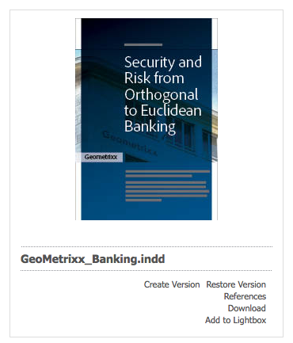

# Elementeditorpagina&#39;s maken en configureren {#creating-and-configuring-asset-editor-pages}

In dit document wordt het volgende beschreven:

* Waarom zou u aangepaste pagina&#39;s in de Asset Editor maken.
* Hoe te om de pagina&#39;s van de Redacteur van Activa tot stand te brengen en aan te passen, die WCM pagina&#39;s zijn die u meta-gegevens bekijken en laten uitgeven evenals acties op de activa uitvoeren.
* Meerdere elementen tegelijk bewerken.

<!-- TBD: Add UICONTROL tags. Need PM review. Flatten the structure a bit. Re-write to remove Geometrixx mentions and to adhere to 6.5 OOTB samples. -->

>[!NOTE]
>
>Asset Share is beschikbaar als een open-source referentie-implementatie. Zie Opmerkingen voor [het delen van elementen](https://adobe-marketing-cloud.github.io/asset-share-commons/). Het wordt niet officieel gesteund.

## Waarom de pagina&#39;s van de Redacteur van Activa creëren en vormen? {#why-create-and-configure-asset-editor-pages}

Digital Asset Management wordt in steeds meer scenario&#39;s gebruikt. Bij de overgang van een kleinschalige oplossing voor een kleine gebruikersgroep professioneel opgeleide gebruikers - bijvoorbeeld fotografen of taxonomisten - naar grotere en gevarieerdere gebruikersgroepen - bijvoorbeeld zakelijke gebruikers, WCM-auteurs, journalisten enzovoort - kan de krachtige gebruikersinterface van Adobe Experience Manager-middelen (AEM) voor professionele gebruikers te veel informatie bieden en kunnen belanghebbenden specifieke gebruikersinterfaces of toepassingen aanvragen om toegang te krijgen tot de digitale middelen die voor hen van belang zijn.

Deze asset-centric toepassingen kunnen eenvoudige fotogalerieën in een Intranet zijn waar de werknemers foto&#39;s van handelsshowbezoeken of een perscentrum in een openbaar-onder ogen ziende website kunnen uploaden, zoals het voorbeeld dat van Geometrixx wordt voorzien. Asset-centric toepassingen kunnen ook worden uitgebreid tot complete oplossingen, zoals winkelwagentjes, kassa&#39;s en verificatieprocessen.

Het creëren van een middel-centric toepassing wordt grotendeels een configuratieproces dat geen codering vereist, slechts kennis van gebruikersgroepen en hun behoeften evenals kennis van de meta-gegevens die worden gebruikt. Elementgerichte toepassingen die zijn gemaakt met AEM Assets zijn uitbreidbaar: met een matige codeerinspanning kunnen herbruikbare componenten voor het zoeken, bekijken, en het wijzigen van activa worden gecreeerd.

Een op elementen gerichte toepassing in AEM bestaat uit een pagina Asset Editor, die kan worden gebruikt voor een gedetailleerde weergave van een specifiek element. Een pagina van de Redacteur van Activa staat ook voor het uitgeven van meta-gegevens toe, op voorwaarde dat de gebruiker die tot de activa toegang heeft de noodzakelijke toestemmingen heeft.

## Een pagina voor het delen van elementen maken en configureren {#creating-and-configuring-an-asset-share-page}

U past de DAM Finder-functionaliteit aan en maakt pagina&#39;s met alle functionaliteit die u nodig hebt. Deze worden pagina&#39;s voor het delen van middelen genoemd. Om een nieuwe pagina van het Aandeel van Activa tot stand te brengen, voegt u de pagina toe gebruikend het malplaatje van het Aandeel van Activa Geometrixx en dan past u de acties aan die gebruikers op die pagina kunnen uitvoeren, bepalen hoe de kijkers de activa zien, en beslissen hoe de gebruikers hun vragen kunnen bouwen.

Hier volgen enkele handige voorbeelden voor het maken van een aangepaste pagina voor het delen van bedrijfsmiddelen:

* Pers Center for Journalists
* Zoekmachine voor afbeeldingen voor interne zakelijke gebruikers
* Afbeeldingsdatabase voor websitegebruikers
* Media Taging Interface voor metagegevenseditors

### Een pagina voor het delen van elementen maken {#creating-an-asset-share-page}

Als u een nieuwe pagina voor het delen van elementen wilt maken, kunt u deze maken wanneer u aan websites werkt of via het beheer van digitale elementen.

>[!NOTE]
>
>Wanneer u in het beheer van digitale middelen een pagina voor het delen van bedrijfsmiddelen maakt op basis van **Nieuw** , worden standaard automatisch een viewer voor middelen en een Asset-editor gemaakt.

Een nieuwe pagina voor het delen van elementen maken in de **websiteconsole** :

1. Navigeer op het tabblad **Websites** naar de plaats waar u een pagina voor het delen van elementen wilt maken en klik op **Nieuw**.

1. Selecteer de pagina **Asset Share** en klik op **Maken**. De nieuwe pagina wordt gemaakt en de pagina voor het delen van elementen wordt weergegeven op het tabblad **Websites** .

De basispagina die is gemaakt met de sjabloon Geometrixx DAM Asset Share ziet er als volgt uit:

Als u de pagina voor het delen van elementen wilt aanpassen, gebruikt u elementen van het hulpprogramma en bewerkt u ook de eigenschappen van de querybuilder. De pagina **Geometrixx Press Center** is een aangepaste versie van een pagina die op deze sjabloon is gebaseerd:

Een nieuwe pagina voor het delen van elementen maken via Digital Asset Manager:

1. Selecteer in **Nieuw** in Beheer digitale elementen de optie **Nieuw element delen**.
1. Voer in de **titel** de naam in van de pagina voor het delen van elementen. Voer desgewenst een naam voor de URL in.

   

1. Dubbelklik op de pagina voor het delen van elementen om deze te openen en de pagina te configureren.

   

   Wanneer u een pagina voor het delen van bedrijfsmiddelen maakt op basis van **Nieuw**, worden standaard automatisch een viewer voor middelen en een Asset-editor gemaakt.

#### Handelingen aanpassen {#customizing-actions}

U kunt bepalen welke handelingen gebruikers op geselecteerde digitale elementen kunnen uitvoeren op basis van een selectie vooraf gedefinieerde handelingen.

Handelingen toevoegen aan de pagina Asset Share:

1. Klik op de pagina Asset Share die u wilt aanpassen op **Handelingen** in het zijpaneel.

De volgende acties zijn beschikbaar:

| Actie | Beschrijving |
|---|---|
| [!UICONTROL Handeling verwijderen] | Gebruikers kunnen de geselecteerde elementen verwijderen. |
| [!UICONTROL Handeling downloaden] | Hiermee kunnen gebruikers geselecteerde elementen downloaden naar hun computers. |
| [!UICONTROL Lichtbakactie] | Hiermee slaat u elementen op in een &#39;lichtbak&#39; waar u andere handelingen op kunt uitvoeren. Dit is handig wanneer u met elementen op meerdere pagina&#39;s werkt. De lichtbak kan ook worden gebruikt als winkelwagentje voor bedrijfsmiddelen. |
| [!UICONTROL Handeling verplaatsen] | Gebruikers kunnen het element naar een andere locatie verplaatsen |
| [!UICONTROL Handeling Tags] | Gebruikers kunnen tags toevoegen aan geselecteerde elementen |
| [!UICONTROL Actie element weergeven] | Hiermee opent u het element in de Asset Editor, zodat de gebruiker het kan bewerken. |

1. Sleep de gewenste actie naar het gebied **Handelingen** op de pagina. Als u dit doet, wordt een knop gemaakt waarmee die handeling wordt uitgevoerd.

#### Bepalen hoe zoekresultaten worden weergegeven {#determining-how-search-results-are-presented}

U bepaalt hoe de resultaten worden weergegeven in een vooraf gedefinieerde lijst met lenzen.

Zo wijzigt u de weergave van zoekresultaten:

1. Klik op Zoeken op de pagina Asset Share die u wilt aanpassen.

1. Sleep de desbetreffende lens naar het bovenste midden van de pagina. In het Centrum van de Pers, zijn de lenzen reeds beschikbaar. Gebruikers drukken op het juiste lenspictogram om de zoekresultaten naar wens weer te geven.

De volgende lenzen zijn beschikbaar:

| Lens | Beschrijving |
|---|---|
| **[!UICONTROL Lijstlens]** | De elementen worden in een lijst met details weergegeven. |
| **[!UICONTROL Mozaïeklens]** | Hiermee worden elementen op mozaïekwijze weergegeven. |

#### Mozaïeklens {#mosaic-lens}

#### Lijstlens {#list-lens}

#### De Query Builder aanpassen {#customizing-the-query-builder}

Met de querybuilder kunt u zoektermen invoeren en inhoud maken voor de pagina Asset Share. Wanneer u de vraagbouwer uitgeeft, moet u ook bepalen hoeveel onderzoeksresultaten per pagina worden getoond, welke activaredacteur opent wanneer u activa tweemaal klikt, de weg de vraagonderzoeken, en nodetypes aanpast.

U kunt als volgt de builder van query aanpassen:

1. In de pagina van het Aandeel van Activa die u wilt aanpassen, klik **uitgeven** in de Bouwer van de Vraag. Standaard wordt het tabblad **Algemeen** geopend.
1. Selecteer het aantal resultaten per pagina, het pad van de middeleneditor (als u een aangepaste editor voor elementen hebt) en de titel Handelingen.

1. Klik op het tabblad **Paden** . Voer een of meerdere paden in die de zoekopdracht moet uitvoeren. Deze paden worden overschreven als de gebruiker de voorspelling van paden gebruikt.

1. Voer desgewenst een ander knooppunttype in.

1. Op het gebied van de Bouwer van de **Vraag URL** , kunt u de vraagbouwer met voeten treden of verpakken en nieuwe servlet URLs met de bestaande component ingaan van de vraagbouwer. In het veld URL **** van feed kunt u ook de URL van feed overschrijven.

1. Voer in het veld **Tekst** de tekst in die u wilt weergeven voor de resultaten en paginanummers. Klik op **OK** wanneer u klaar bent met het aanbrengen van wijzigingen.

#### Voorspellen toevoegen {#adding-predicates}

AEM Assets bevat een aantal voorspellingen die u kunt toevoegen aan de pagina Asset Share. Hierdoor kunnen uw gebruikers verder beperkte zoekopdrachten uitvoeren. In sommige gevallen, kunnen zij een parameter van de vraagbouwer met voeten treden (bijvoorbeeld, de parameter van de Weg).

Voorspelden toevoegen:

1. Klik op **Zoeken** op de pagina Asset Share die u wilt aanpassen.

1. Sleep de aangewezen predikaten aan de pagina van het Aandeel van Activa onder de vraagbouwer. Hiermee maakt u de juiste velden.

De volgende voorspellingen zijn beschikbaar:

| Voorspelend | Beschrijving |
|---|---|
| **[!UICONTROL Datumvoorspelling]** | Hiermee kunnen gebruikers zoeken naar elementen die voor en na bepaalde datums zijn gewijzigd. |
| **[!UICONTROL Voorspelling opties]** | De eigenaar van de site kan een eigenschap opgeven waarnaar moet worden gezocht (zoals in de eigenschap predikaat, bijvoorbeeld cq:tags) en een inhoudsstructuur om de opties te vullen (bijvoorbeeld de codestructuur). Hiermee wordt een lijst met opties gegenereerd waarin gebruikers de waarden (tags) kunnen selecteren die de geselecteerde eigenschap (eigenschap tag) moet hebben. Op deze manier kunt u lijstbesturingselementen maken, zoals de lijst met tags, bestandstypen, afbeeldingsrichtingen, enzovoort. Het is ideaal voor een vaste set opties. |
| **[!UICONTROL Padvoorspelling]** | Gebruikers kunnen het pad en de submappen desgewenst definiëren. |
| **[!UICONTROL Eigenschappenvoorspelling]** | De eigenaar van de site geeft een eigenschap op waarnaar moet worden gezocht, bijvoorbeeld tiff:ImageLength en de gebruiker kan vervolgens een waarde invoeren, bijvoorbeeld 800. Hiermee worden alle afbeeldingen geretourneerd die 800 pixels hoog zijn. Nuttige voorspelling als uw bezit willekeurige waarden kan hebben. |

Zie JavaDocs [voorspellen voor meer informatie](https://helpx.adobe.com/experience-manager/6-5/sites/developing/using/reference-materials/javadoc/com/day/cq/search/eval/package-summary.html).

1. Als u de voorspelling verder wilt configureren, dubbelklikt u erop. Als u bijvoorbeeld het pad wilt openen, moet u het hoofdpad toewijzen.

## Een pagina voor de Editor van middelen maken en configureren {#creating-and-configuring-an-asset-editor-page}

U kunt de middeleneditor aanpassen om te bepalen hoe gebruikers de digitale elementen kunnen weergeven en bewerken. Hiertoe maakt u een nieuwe pagina in de Editor van middelen en past u de weergaven aan en de acties die gebruikers op die pagina kunnen uitvoeren.

>[!NOTE]
>
>Als u aangepaste velden wilt toevoegen aan de DAM-middeleneditor, voegt u nieuwe cq:Widget-knooppunten toe aan `/apps/dam/content/asseteditors.`

### Een pagina voor de Editor van middelen maken {#creating-the-asset-editor-page}

Als u de pagina Asset Editor maakt, is het verstandig de pagina direct onder de pagina Asset Share te maken.

Een pagina voor de Editor van middelen maken:

1. Navigeer op het tabblad **Websites** naar de plaats waar u een pagina voor de middeleneditor wilt maken en klik op **Nieuw**.
1. Selecteer **Geometrixx Asset Editor** en klik op **Maken**. De nieuwe pagina wordt gemaakt en de pagina wordt weergegeven op het tabblad **Websites** .

De basispagina die is gemaakt met de sjabloon Geometrixx Asset Editor ziet er als volgt uit:

Als u de pagina Asset Editor wilt aanpassen, gebruikt u elementen van de assistent. De pagina Asset Editor die vanuit het **Geometrixx Press Center** wordt geopend, is een aangepaste versie van een pagina die op deze sjabloon is gebaseerd:

#### Een Asset Editor instellen om te openen vanaf een pagina voor het delen van elementen {#setting-which-asset-editor-opens-from-an-asset-share-page}

Nadat u de aangepaste pagina Asset Editor hebt gemaakt, moet u ervoor zorgen dat de elementen op de aangepaste pagina Editor worden geopend wanneer u dubbelklikt op elementen die u hebt gemaakt met het aangepaste Delen van middelen.

De pagina Asset Editor instellen:

1. Klik in de pagina Asset Share op **Bewerken** naast de Query Builder.

1. Klik op het tabblad **Algemeen** als dit nog niet is geselecteerd.

1. Voer in het veld **Pad van de Asset Editor** het pad naar de editor voor middelen in waarin de pagina voor het delen van elementen moet worden geopend en klik op **OK**.

#### Elementbewerkingscomponenten toevoegen {#adding-asset-editor-components}

U bepaalt welke functionaliteit een middeleneditor heeft door componenten aan de pagina toe te voegen.

Elementeditorcomponenten toevoegen:

1. Selecteer de optie **Asset Editor** in de assistent op de pagina Asset Editor die u wilt aanpassen. Alle beschikbare componenten van de middeleneditor worden weergegeven.

>[!NOTE]
>
>Wat u kunt aanpassen, hangt af van welke componenten beschikbaar zijn. Als u componenten wilt inschakelen, gaat u naar de ontwerpmodus en selecteert u de onderdelen die u wilt inschakelen.

1. Sleep de componenten van de hulpwerkplaats aan de activaredacteur en maak om het even welke wijzigingen in de componentendialogen. De componenten worden beschreven in de volgende lijst en in de gedetailleerde instructies beschreven die volgen.

>[!NOTE]
>
>Bij het ontwerpen van de pagina voor de middeleneditor maakt u componenten die alleen-lezen of bewerkbaar zijn. Gebruikers weten dat een veld kan worden bewerkt als een afbeelding van een potlood in die component wordt weergegeven. Standaard worden de meeste componenten ingesteld als alleen-lezen.

| Component | Beschrijving |
|---|---|
| **[!UICONTROL Tekstveld Metagegevensformulier]en[!UICONTROL Metagegevens]** | Hiermee kunt u aanvullende metagegevens aan een element toevoegen en een handeling op dat element uitvoeren, zoals verzenden. |
| **[!UICONTROL Subactiva]** | Hiermee kunt u subelementen aanpassen. |
| **Tags** | Gebruikers kunnen tags selecteren en aan een element toevoegen. |
| **[!UICONTROL Miniatuur]** | Toont een duimnagel van het element, zijn filename, en laat u een afwisselende tekst toevoegen. U kunt hier ook acties voor middeleneditors toevoegen. |
| **[!UICONTROL Titel]** | Hiermee geeft u de titel van het element weer, die kan worden aangepast. |

#### Metagegevensformulier en tekstveld - De component Metagegevens weergeven configureren {#metadata-form-and-text-field-configuring-the-view-metadata-component}

Het metagegevensformulier is een formulier met een begin- en eindactie. Tussendoor voert u **tekstvelden** in. Zie [Formulieren](/help/sites-authoring/default-components-foundation.md#form-component) voor meer informatie over het werken met formulieren.

1. Maak een startactie door in het gedeelte Start van het formulier op **Bewerken** te klikken. U kunt desgewenst een titel voor een vak invoeren. Standaard is de titel van het vak **Metagegevens**. Schakel het selectievakje Clientvalidatie in als u de Java-Script-clientcode voor validatie wilt genereren.

1. Maak een actie Einde door te klikken op **Bewerken** in het gebied Einde van het formulier. U kunt bijvoorbeeld een knop **Verzenden** maken waarmee gebruikers hun wijzigingen in de metagegevens kunnen verzenden. U kunt desgewenst een knop **Herstellen** toevoegen waarmee de metagegevens in de oorspronkelijke staat worden hersteld.

1. Sleep Metagegevenstekstvelden tussen het begin **van het** formulier en het einde **van het** formulier naar het formulier. Gebruikers vullen metagegevens in deze tekstvelden in. Deze kunnen worden verzonden of een andere actie uitvoeren.

1. Dubbelklik op de veldnaam, bijvoorbeeld **Titel** om het metagegevensveld te openen en wijzigingen aan te brengen. Op het tabblad **Algemeen** van het venster Component **** bewerken definieert u de naamruimte en het veldlabel, evenals het type, bijvoorbeeld `dc:title`.

Zie [AEM-elementen](/help/assets/extending-assets.md) aanpassen en uitbreiden voor informatie over het wijzigen van de naamruimten in het metagegevensformulier.

1. Klik op het tabblad **Restricties** . Hier kunt u selecteren of een veld vereist is en zo nodig beperkingen toevoegen.

1. Klik op het tabblad **Weergave** . Hier kunt u een nieuwe breedte en een nieuw aantal rijen voor het meta-gegevensgebied ingaan. Schakel het selectievakje **Veld is alleen** -lezen in om gebruikers toe te staan de metagegevens te bewerken.

Hieronder ziet u een voorbeeld van een metagegevensformulier met verschillende velden:

Op de pagina Asset Editor kunnen gebruikers vervolgens waarden invoeren in de metagegevensvelden (als deze bewerkbaar zijn) en de eindactie uitvoeren (bijvoorbeeld door de wijzigingen te verzenden).

#### Subactiva {#sub-assets}

In de component Subelementen kunt u subelementen weergeven en selecteren. U kunt bepalen welke namen onder het [hoofdelement](/help/assets/assets.md#what-are-digital-assets) en de subelementen worden weergegeven.

Dubbelklik op de component Subelementen om het dialoogvenster Subelementen te openen, waarin u de titels voor het hoofdelement en eventuele subelementen kunt wijzigen. De standaardwaarden worden onder het desbetreffende veld weergegeven.

Hieronder ziet u een voorbeeld van een onderdeel van een subelement dat is gevuld:

Als u bijvoorbeeld een subelement selecteert, ziet u hoe de component de juiste pagina weergeeft en hoe de titel van het vak verandert van Subelementen in Siblings.

#### Tags {#tags}

De component Tags is een component waarin gebruikers bestaande tags aan een element kunnen toewijzen. Hierdoor kunnen gebruikers de elementen later ordenen en ophalen. U kunt van deze component alleen-lezen maken, zodat gebruikers geen codes kunnen toevoegen, maar alleen deze weergeven.

Dubbelklik op de component Tags om het dialoogvenster Codes te openen waarin u desgewenst de titel van Codes kunt wijzigen en waarin u de toegewezen naamruimten kunt selecteren. Schakel het selectievakje Bewerken **** verbergen uit om dit veld bewerkbaar te maken. Standaard zijn codes bewerkbaar.

Als gebruikers tags kunnen bewerken, kunnen ze op het potlood klikken om tags toe te voegen door deze te selecteren in het vervolgkeuzemenu Codes.

Hier volgt een gevulde component Tags:

#### Miniatuur {#thumbnail}

In het element Miniatuur wordt de geselecteerde miniatuur weergegeven (bij veel van de indelingen wordt de miniatuur automatisch geëxtraheerd). Bovendien geeft de component de bestandsnaam weer en [acties die u kunt wijzigen](/help/assets/assets-finder-editor.md#adding-asset-editor-actions).

Dubbelklik op de miniatuurcomponent om het dialoogvenster met miniaturen te openen waarin u de alt-tekst kunt wijzigen. Standaard wordt in de alt-tekst van de miniatuur **Klikken standaard gebruikt om elementen te downloaden** .

Hieronder ziet u een voorbeeld van een gevulde miniatuurcomponent:

#### Titel {#title}

In de component Title worden de titel van het element en een beschrijving weergegeven.

Standaard bevindt het bestand zich in de modus Alleen-lezen, zodat gebruikers het bestand niet kunnen bewerken. Als u dit bewerkbaar wilt maken, dubbelklikt u op de component en schakelt u het selectievakje **Bewerken verbergen** uit. Voer bovendien een titel in voor meerdere elementen.

Als de titel kan worden bewerkt, kunt u een titel en een beschrijving toevoegen door op het potlood te klikken om het venster Eigenschappen van **element** te openen. Bovendien kunt u het element in- en uitschakelen door de datum en tijd te selecteren.

Wanneer gebruikers de Titel bewerken door op het potloodpictogram te klikken, kunnen ze de **Titel**, **Beschrijving** wijzigen en **Aan** en **Uit-tijd** invoeren om het element in en uit te schakelen.

Hier volgt een voorbeeld van een gevulde component Title:

#### Acties in de Asset Editor toevoegen {#adding-asset-editor-actions}

U kunt bepalen welke handelingen gebruikers op geselecteerde digitale elementen kunnen uitvoeren op basis van een selectie vooraf gedefinieerde handelingen.

Handelingen toevoegen aan de pagina Asset Editor:

1. Klik op de pagina Asset Editor die u wilt aanpassen op **Asset Editor** in de assistent.

De volgende acties zijn beschikbaar:

| Actie | Beschrijving |
|---|---|
| [!UICONTROL Downloaden] | Hiermee kunnen gebruikers geselecteerde elementen downloaden naar hun computers. |
| [!UICONTROL Editors] | Gebruikers kunnen een afbeelding bewerken (interactief bewerken) |
| [!UICONTROL Lichtbak] | Hiermee slaat u elementen op in een &#39;lichtbak&#39; waar u andere handelingen op kunt uitvoeren. Dit is handig wanneer u met elementen op meerdere pagina&#39;s werkt. |
| [!UICONTROL Vergrendelen] | Hiermee kunnen gebruikers een element vergrendelen. Deze functionaliteit is niet standaard ingeschakeld en moet worden ingeschakeld in de lijst met componenten. |
| [!UICONTROL Verwijzingen] | Klik hierop om te tonen op welke pagina&#39;s het element wordt gebruikt. |
| [!UICONTROL Versioning] | Hiermee kunt u versies van een element maken en herstellen. |

1. Sleep de gewenste actie naar het gebied **Handelingen** op de pagina. Als u dit doet, wordt een knop gemaakt waarmee die handeling wordt uitgevoerd.

## Elementen bewerken via de pagina Asset Editor {#multi-editing-assets-with-the-asset-editor-page}

Met AEM-middelen kunt u wijzigingen in meerdere elementen tegelijk aanbrengen. Nadat u elementen hebt geselecteerd, kunt u tegelijkertijd de volgende wijzigingen aanbrengen:

* Tags
* Metagegevens

Elementen bewerken via de pagina Asset Editor:

1. Open de pagina Geometrixx **Press Center** :
   `https://localhost:4502/content/geometrixx/en/company/press.html`

1. Selecteer de elementen:

   * in Windows: `Ctrl + click` elk element.
   * op Mac: `Cmd + click` elk element.
   Een reeks elementen selecteren: Klik op het eerste element en vervolgens op `Shift + click` het laatste element.

1. Klik op Metagegevens **** bewerken in het veld **Handelingen** (links op de pagina).
1. De pagina Geometrixx **Press Center Asset Editor** wordt op een nieuw tabblad geopend. De metagegevens van de elementen worden als volgt weergegeven:

   * Een tag, die niet van toepassing is op alle elementen, maar alleen op een paar elementen, wordt cursief weergegeven.
   * Een label dat op alle elementen van toepassing is, wordt met een normaal lettertype weergegeven.
   * Andere metagegevens dan codes: de waarde van het veld wordt alleen weergegeven als deze voor alle geselecteerde elementen gelijk is.

1. Klik op **Downloaden** om een ZIP-bestand met de elementen van de oorspronkelijke vertoningen te downloaden.
1. Klik op het potloodpictogram naast het veld **Codes** om de codes te bewerken:

   * Een tag die niet van toepassing is op alle elementen, maar alleen op een paar elementen, heeft een grijze achtergrond.
   * Een tag die van toepassing is op alle elementen heeft een witte achtergrond.
   U kunt:

   * Klik op het pictogram **x** om de tag voor alle elementen te verwijderen.
   * Klik op het pictogram **+** om de tag aan alle elementen toe te voegen.
   * Klik op de **pijl** en selecteer een tag om een nieuwe tag aan alle elementen toe te voegen.
   Klik op **OK** om de wijzigingen in het formulier te schrijven. Het vak naast het veld **Codes** wordt automatisch ingeschakeld.

1. Bewerk het veld Beschrijving. Stel bijvoorbeeld in op:

   `This is a common description`

   Wanneer een veld wordt bewerkt, overschrijft de waarde de bestaande waarden van de geselecteerde elementen wanneer het formulier wordt verzonden.

   Opmerking: Het vak naast het veld wordt automatisch ingeschakeld wanneer het veld wordt bewerkt.

1. Klik op Metagegevens **** bijwerken om het formulier te verzenden en de wijzigingen voor alle elementen op te slaan.

   Opmerking: alleen de geselecteerde metagegevens worden gewijzigd.
