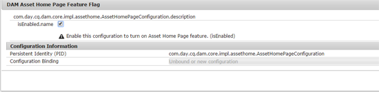

# [!DNL Adobe Experience Manager Assets] Introductiepagina  {#aem-assets-home-page-experience}

Pas de [!DNL Adobe Experience Manager Assets]-startpagina aan voor een welkomstscherm, inclusief een momentopname van recente activiteiten rond elementen.

[!DNL Assets] de homepage verstrekt een rijke en gepersonaliseerde ervaring van het welkomstscherm, die een momentopname van recente activiteiten, zoals activa omvat die onlangs werden bekeken of geupload.

De startpagina [!DNL Assets] is standaard uitgeschakeld. Voer de volgende stappen uit om het in te schakelen:

1. Open [!DNL Experience Manager] Configuratiebeheer `https://[aem_server]:[port]/system/console/configMgr`.
1. Open de service **[!UICONTROL Day CQ DAM Event Recorder]**.
1. Selecteer **[!UICONTROL Enable this service]** om activiteitenopname toe te laten.

   

1. Selecteer in de lijst **[!UICONTROL Event Types]** de gebeurtenissen die moeten worden opgenomen en sla de wijzigingen op.

   >[!CAUTION]
   >
   >Als u de weergaveopties voor het element, de bekeken projecten en de weergegeven verzamelingen inschakelt, wordt het aantal opgenomen gebeurtenissen aanzienlijk verhoogd.

1. Open de **[!UICONTROL DAM Asset Home Page Feature Flag]** dienst van de Manager `https://[aem_server]:[port]/system/console/configMgr` van de Configuratie.
1. Selecteer de optie `isEnabled.name` om de functie [!DNL Assets] Startpagina in te schakelen. Sla de wijzigingen op.

   

1. Open het dialoogvenster **[!UICONTROL User Preferences]** en selecteer **[!UICONTROL Enable Assets Home Page]**. Sla de wijzigingen op.

   

Nadat u de startpagina [!DNL Assets] hebt ingeschakeld, navigeert u naar de gebruikersinterface [!DNL Assets] via de navigatiepagina of opent u deze rechtstreeks via de URL `https://[aem_server]:[port]/aem/assetshome.html/content/dam`.

Klik op **[!UICONTROL Click here to configure your experience link]** om uw gebruikersnaam, achtergrondafbeelding en profielafbeelding toe te voegen.

De startpagina [!DNL Assets] bevat de volgende secties:

* Welkomstsectie
* Widget-sectie

**Welkomstsectie**

Als uw profiel bestaat, wordt in de welkomstsectie een welkomstbericht weergegeven dat aan u is gericht. Bovendien worden uw profielfoto en een welkomstafbeelding weergegeven (indien al geconfigureerd).

Als uw profiel onvolledig is, geeft de welkomstsectie een algemeen welkomstbericht en een tijdelijke aanduiding voor uw profielafbeelding weer.

**Widget-sectie**

Deze sectie verschijnt onder de welkomstsectie en toont buiten-de-dooswidgets onder de volgende secties:

* Activiteit
* Recent
* Discover

**Activiteit**: Onder deze sectie geeft de  **[!UICONTROL My Activity]** widget recente activiteiten weer die door de aangemelde gebruiker zijn uitgevoerd met elementen (waaronder elementen zonder vertoningen), zoals het uploaden van middelen, downloads, het maken van elementen, bewerkingen, opmerkingen, annotaties en shares.

**Recent**: De  **[!UICONTROL Recently Viewed]** widget onder deze sectie toont onlangs betreden entiteiten door de het programma geopende gebruiker, met inbegrip van omslagen, inzamelingen, en projecten.

**Detecteren**: De  **[!UICONTROL New]** widget in deze sectie geeft de elementen en uitvoeringen weer die onlangs naar de  [!DNL Assets] implementatie zijn geüpload.

Om het zuiveren van de gegevens van de gebruikersactiviteit toe te laten, laat **[!UICONTROL DAM Event Purge Service]** van de Manager van de Configuratie toe. Nadat u deze dienst toelaat, worden de activiteiten van de het programma geopende gebruiker die een gespecificeerd aantal overschrijden geschrapt door het systeem.

Het welkomstscherm biedt eenvoudige navigatiehulpmiddelen, zoals pictogrammen op de werkbalk, voor toegang tot mappen, verzamelingen en catalogi.

>[!NOTE]
>
>Als u de services [!UICONTROL Day CQ DAM Event Recorder] en [!UICONTROL DAM Event Purge] inschakelt, nemen schrijfbewerkingen naar JCR toe en wordt de zoekindex aanzienlijk verhoogd, waardoor de belasting op de [!DNL Experience Manager]-server aanzienlijk toeneemt. De extra belasting op de [!DNL Experience Manager]-server kan van invloed zijn op de prestaties.

>[!CAUTION]
>
>Het vastleggen, filteren en leegmaken van gebruikersactiviteiten die vereist zijn voor de startpagina van [!DNL Assets], legt de prestaties zwaar op de proef. Daarom moeten beheerders de startpagina effectief configureren voor doelgebruikers.
>
>Adobe raadt beheerders en gebruikers die bulkbewerkingen uitvoeren aan de functie Startpagina van bedrijfsmiddelen niet te gebruiken om te voorkomen dat gebruikers meer gaan werken. Bovendien kunnen beheerders opnameactiviteiten voor specifieke gebruikers uitsluiten door [!UICONTROL Day CQ DAM Event Recorder] van [!UICONTROL Configuration Manager] te configureren.
>
>Als u deze functie gebruikt, raadt Adobe u aan de opschoonfrequentie te laten bepalen op basis van het laden van de server.
