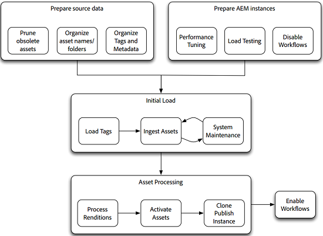

# Hoe te om activa in bulk te migreren {#assets-migration-guide}

Bij het migreren van elementen naar [!DNL Adobe Experience Manager]zijn er verschillende stappen die u moet overwegen. Het uitpakken van elementen en metagegevens uit hun huidige huis valt buiten het bereik van dit document, omdat dit document sterk verschilt tussen implementaties. In dit document wordt echter beschreven hoe u deze elementen in kunt brengen, de metagegevens ervan kunt toepassen, uitvoeringen kunt genereren en kunt u ze activeren om instanties te publiceren. [!DNL Experience Manager]

## Vereisten {#prerequisites}

Voordat u daadwerkelijk een van de stappen in deze methodologie uitvoert, moet u de richtlijnen in tips voor het afstemmen van [middelenprestaties bekijken en implementeren](performance-tuning-guidelines.md). Veel van de stappen, zoals het vormen van maximum gezamenlijke banen, verbeteren zeer de stabiliteit en de prestaties van de server onder lading. Andere stappen, zoals het vormen van een Opslag van de Gegevens van het Dossier, zijn veel moeilijker uit te voeren nadat het systeem met activa is geladen.

>[!NOTE]
>
>De volgende gereedschappen voor middelenmigratie maken geen deel uit van [!DNL Experience Manager] en worden niet ondersteund door Adobe:
>
>* ACS AEM Tagmaker
>* ACS AEM Tools CSV Asset Importer
>* ACS Commons Bulk Workflow Manager
>* ACS Commons Snelle Manager van de Actie
>* Synthetische workflow

>
>
Deze software is opensource en valt onder de [Apache v2-licentie](https://adobe-consulting-services.github.io/pages/license.html). Om een vraag te stellen of een probleem te melden gaat u naar de respectieve [GitHub-problemen voor ACS AEM-tools](https://github.com/Adobe-Consulting-Services/acs-aem-commons/issues) en [ACS AEM Commons](https://github.com/Adobe-Consulting-Services/acs-aem-tools/issues).

## Migreren naar [!DNL Experience Manager] {#migrating-to-aem}

Het migreren van activa aan [!DNL Experience Manager] vereist verscheidene stappen en zou als gefaseerd proces moeten worden beschouwd. De fasen van de migratie zijn als volgt:

1. Workflows uitschakelen.
1. Labels laden.
1. Samenvatting van elementen.
1. Uitvoeringen verwerken.
1. Elementen activeren.
1. Workflows inschakelen.

### Workflows uitschakelen {#disabling-workflows}

Voordat u de migratie start, moet u de draagraketten voor de [!UICONTROL DAM Update Asset] workflow uitschakelen. U kunt het beste alle elementen in het systeem opnemen en de workflows vervolgens in batches uitvoeren. Als u al woont terwijl de migratie plaatsvindt, kunt u deze activiteiten plannen om op off-hours te lopen.

### Labels laden {#loading-tags}

Mogelijk hebt u al een tagtaxonomie die u op uw afbeeldingen toepast. Hoewel gereedschappen als CSV Asset Importer en [!DNL Experience Manager] ondersteuning voor metagegevensprofielen het toepassen van tags op elementen kunnen automatiseren, moeten de tags in het systeem worden geladen. De [ACS AEM de eigenschap van de Maker](https://adobe-consulting-services.github.io/acs-aem-tools/features/tag-maker/index.html) van de Markering van Hulpmiddelen laat u markeringen bevolken door een spreadsheet van Microsoft te gebruiken Excel die in het systeem wordt geladen.

### Middelen opnemen {#ingesting-assets}

Prestaties en stabiliteit zijn belangrijke zorgen wanneer activa in het systeem worden opgenomen. Omdat u een grote hoeveelheid gegevens in het systeem laadt, wilt u ervoor zorgen dat het systeem zo goed mogelijk presteert om de vereiste hoeveelheid tijd te minimaliseren en overbelasting van het systeem te vermijden, wat tot een systeemneerstorting kan leiden, vooral in systemen die reeds in productie zijn.

Er zijn twee manieren om de elementen in het systeem te laden: een op push-gebaseerde benadering waarbij gebruik wordt gemaakt van HTTP of een pull-gebaseerde benadering waarbij gebruik wordt gemaakt van de JCR API&#39;s.

#### Verzenden via HTTP {#pushing-through-http}

Het team van Managed Services van Adobe gebruikt een hulpmiddel genoemd Glutton om gegevens in klantenmilieu&#39;s te laden. Glutton is een kleine toepassing van Java die alle activa van één folder in een andere folder op een [!DNL Experience Manager] plaatsing laadt. In plaats van Glutton kunt u ook hulpprogramma&#39;s zoals Perl-scripts gebruiken om de elementen in de opslagplaats te posten.

Er zijn twee grote nadelen aan het gebruiken van de benadering van het doorduwen van https:

1. De elementen moeten via HTTP naar de server worden verzonden. Dit vereist behoorlijk wat overheadkosten en is tijdrovend, waarbij de tijd wordt verlengd die het vergt om uw migratie uit te voeren.
1. Als u tags en aangepaste metagegevens hebt die op de elementen moeten worden toegepast, is voor deze aanpak een tweede aangepast proces vereist dat u moet uitvoeren om deze metagegevens toe te passen op de elementen nadat deze zijn geïmporteerd.

De andere manier om elementen in te nemen is het ophalen van elementen van het lokale bestandssysteem. Als u echter geen externe schijf of netwerkshare aan de server kunt koppelen om een pull-based aanpak uit te voeren, is het posten van de elementen via HTTP de beste optie.

#### Ophalen uit het lokale bestandssysteem {#pulling-from-the-local-filesystem}

De [ACS AEM Tools CSV Asset Importer](https://adobe-consulting-services.github.io/acs-aem-tools/features/csv-asset-importer/index.html) vult elementen van het bestandssysteem en de metagegevens van elementen van een CSV-bestand voor het importeren van elementen. De API van de Manager van de Activa van de Experience Manager wordt gebruikt om de activa in het systeem in te voeren en de gevormde meta-gegevenseigenschappen toe te passen. In het ideale geval worden elementen op de server gemonteerd via een netwerkbestandsinstallatie of via een externe schijf.

Aangezien elementen niet via een netwerk hoeven te worden verzonden, verbeteren de algehele prestaties aanzienlijk en wordt deze methode over het algemeen beschouwd als de meest efficiënte manier om elementen in de opslagplaats te laden. Bovendien kunt u, omdat het gereedschap metagegevens ondersteunt, alle elementen en metagegevens in één stap importeren in plaats van ook een tweede stap te maken om de metagegevens toe te passen met een apart gereedschap.

### Procesuitvoeringen {#processing-renditions}

Nadat u de elementen in het systeem hebt geladen, moet u ze verwerken via de [!UICONTROL DAM Update Asset] workflow om metagegevens te extraheren en uitvoeringen te genereren. Voordat u deze stap uitvoert, moet u de [!UICONTROL DAM Update Asset] workflow dupliceren en aanpassen aan uw wensen. De out-of-the-box workflow bevat veel stappen die u wellicht niet nodig hebt, zoals het genereren of [!DNL InDesign Server] integreren van Scene7 PTIFF.

Nadat u de werkstroom volgens uw behoeften hebt gevormd, hebt u twee opties om het uit te voeren:

1. De eenvoudigste aanpak is [ACS Commons Bulk Workflow Manager](https://adobe-consulting-services.github.io/acs-aem-commons/features/bulk-workflow-manager.html). Met dit gereedschap kunt u een query uitvoeren en de resultaten van de query verwerken via een workflow. Er zijn ook opties voor het instellen van batchgrootten.
1. U kunt [ACS Commons Fast Action Manager](https://adobe-consulting-services.github.io/acs-aem-commons/features/fast-action-manager.html) gebruiken in overleg met [Synthetische workflows](https://adobe-consulting-services.github.io/acs-aem-commons/features/synthetic-workflow.html). While this approach is much more involved, it lets you remove the overhead of the [!DNL Experience Manager] workflow engine while optimizing the use of server resources. Bovendien verhoogt de Fast Action Manager de prestaties nog meer door serverresources dynamisch te controleren en het plaatsen van de lading op het systeem te vertragen. U vindt voorbeeldscripts op de ACS Commons-functiepagina.

### Elementen activeren {#activating-assets}

Voor plaatsingen die een publicatielaag hebben, moet u de activa uit activeren aan publiceer landbouwbedrijf. Hoewel Adobe aanbeveelt meerdere publicatieinstanties uit te voeren, is het het meest efficiënt om alle elementen te repliceren naar één publicatieinstantie en die instantie vervolgens te klonen. Wanneer u grote aantallen elementen activeert en een boomstructuur activeert, moet u mogelijk ingrijpen. Dit is de reden waarom: Als u de activering uitschakelt, worden items toegevoegd aan de wachtrij Verschuivende taken/gebeurtenis. Nadat de grootte van deze rij ongeveer 40.000 punten begint te overschrijden, vertraagt de verwerking dramatisch. Als deze wachtrij groter is dan 100.000 items, heeft de systeemstabiliteit te lijden.

Om dit probleem te verhelpen, kunt u de [Snelle Manager](https://adobe-consulting-services.github.io/acs-aem-commons/features/fast-action-manager.html) van de Actie gebruiken om middelenreplicatie te beheren. Dit werkt zonder de het Verschuiven rijen te gebruiken, verminderend overheadkosten, terwijl het vertragen van de werkbelasting om de server te verhinderen worden overbelast. Een voorbeeld om FAM te gebruiken om replicatie te beheren wordt getoond op de de documentatiepagina van de eigenschap.

Andere opties om assets naar de publicatiefarm te sturen, omvatten het gebruik van [vlt-rcp](https://jackrabbit.apache.org/filevault/rcp.html) of [oak-run](https://github.com/apache/jackrabbit-oak/tree/trunk/oak-run), die als hulpprogramma&#39;s als onderdeel van Jackrabbit worden verstrekt. Another option is to use an open-sourced tool for your [!DNL Experience Manager] infrastructure called [Grabbit](https://github.com/TWCable/grabbit), which claims to have faster performance than vlt.

Voor elk van deze benaderingen is het voorbehoud dat de elementen op de auteurinstantie niet aantonen dat ze zijn geactiveerd. Als u de markering van deze elementen met de juiste activeringsstatus wilt afhandelen, moet u ook een script uitvoeren om de elementen te markeren als geactiveerd.

>[!NOTE]
>
>Adobe biedt geen ondersteuning voor Grabbit.

### Kloonpublicatie {#cloning-publish}

Nadat de elementen zijn geactiveerd, kunt u de publicatieinstantie klonen om zoveel kopieën te maken als nodig zijn voor de implementatie. Het klonen van een server is vrij eenvoudig, maar er zijn enkele belangrijke stappen om te onthouden. Publicatie klonen:

1. Maak een back-up van de broninstantie en de datastore.
1. Herstel de back-up van de instantie en de datastore naar de doellocatie. De volgende stappen verwijzen allemaal naar dit nieuwe exemplaar.
1. Perform a filesystem search under `crx-quickstart/launchpad/felix` for `sling.id`. Verwijder dit bestand.
1. Zoek en verwijder eventuele `repository-XXX` bestanden onder het hoofdpad van de datastore.
1. Bewerk `crx-quickstart/install/org.apache.jackrabbit.oak.plugins.blob.datastore.FileDataStore.config` en wijs `crx-quickstart/launchpad/config/org/apache/jackrabbit/oak/plugins/blob/datastore/FileDataStore.config` naar de locatie van de datastore in de nieuwe omgeving.
1. Start de omgeving.
1. Werk de configuratie van om het even welke replicatieagenten op de auteur(s) bij om aan correcte te richten publiceer instanties of verzender spoelagenten op de nieuwe instantie om aan de correcte verzenders voor het nieuwe milieu te richten.

### Workflows inschakelen {#enabling-workflows}

Nadat de migratie is voltooid, moeten de draagraketten voor de [!UICONTROL DAM Update Asset] workflows opnieuw worden ingeschakeld om het genereren van vertoningen en het ophalen van metagegevens te ondersteunen voor doorlopend systeemgebruik van dag tot dag.

## Migreren naar meerdere [!DNL Experience Manager] implementaties {#migrating-between-aem-instances}

Hoewel bijna niet zo gemeenschappelijk, soms moet u grote hoeveelheden gegevens van één [!DNL Experience Manager] plaatsing aan een andere migreren; wanneer u bijvoorbeeld een [!DNL Experience Manager] upgrade uitvoert, uw hardware upgradet of naar een nieuw datacenter migreert, zoals met een AMS-migratie.

In dit geval worden uw elementen al gevuld met metagegevens en worden er al uitvoeringen gegenereerd. U kunt zich eenvoudig concentreren op het verplaatsen van elementen van de ene naar de andere instantie. Wanneer het migreren tussen [!DNL Experience Manager] plaatsing, voert u de volgende stappen uit:

1. Workflows uitschakelen: Omdat u uitvoeringen samen met onze elementen migreert, wilt u de draagraketten voor de workflow uitschakelen. [!UICONTROL DAM Update Asset]

1. Labels migreren: Omdat er al tags zijn geladen in de [!DNL Experience Manager] implementatie van de bron, kunt u deze maken in een inhoudspakket en het pakket installeren op de doelinstantie.

1. Elementen migreren: Er zijn twee hulpmiddelen die voor het bewegen van activa van één [!DNL Experience Manager] plaatsing aan een andere worden geadviseerd:

   * **Met Vault Remote Copy** of vlt rcp kunt u vlt in een netwerk gebruiken. U kunt een bron- en doelmap opgeven en met vlt alle gegevens in de opslagplaats van de ene instantie downloaden en in de andere instantie laden. Vlt rcp is te vinden op [https://jackrabbit.apache.org/filevault/rcp.html](https://jackrabbit.apache.org/filevault/rcp.html)
   * **Grabbit** is een opensource-hulpprogramma voor inhoudssynchronisatie dat door Time Warner Cable voor hun [!DNL Experience Manager] implementatie is ontwikkeld. Omdat het ononderbroken gegevensstromen, in vergelijking met vlt rcp gebruikt, heeft het een lagere latentie en beweert een snelheidsverbetering van twee tot tien keer sneller dan vlt rcp. Grabbit ondersteunt ook alleen synchronisatie van delta-inhoud, waardoor wijzigingen kunnen worden gesynchroniseerd nadat een initiële migratievoldoende is voltooid.

1. Elementen activeren: Volg de instructies voor het [activeren van elementen](#activating-assets) die zijn gedocumenteerd voor de eerste migratie naar [!DNL Experience Manager].

1. Kloonpublicatie: Net als bij een nieuwe migratie is het efficiënter om één publicatieexemplaar te laden en te klonen dan de inhoud op beide knooppunten te activeren. Zie Publiceren [klonen.](#cloning-publish)

1. Workflows inschakelen: Nadat u de migratie hebt voltooid, schakelt u de draagraketten voor de [!UICONTROL DAM Update Asset] workflow opnieuw in om het genereren van vertoningen en het ophalen van metagegevens te ondersteunen voor doorlopend systeemgebruik van dag tot dag.
