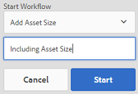

# Digitale middelen verwerken {#process-assets}

[!DNL Adobe Experience Manager Assets] kunt u op verschillende manieren aan uw digitale middelen werken, zodat u krachtige middelen kunt verwerken. U kunt de standaard of aangepaste verwerkingsmethodes gebruiken om bedrijfsprocesvoltooiing, controles en naleving, ontdekking en distributie, en basishygiëne van uw digitale activa te verzekeren. U kunt de taken voor middelenbeheer uitvoeren en tegelijkertijd de vereiste schaal en aanpassing realiseren.

## Workflows begrijpen {#understand-workflows}

Voor de verwerking van bedrijfsmiddelen [!DNL Experience Manager] gebruikt workflows. Workflows helpen de bedrijfslogica of -activiteiten te automatiseren. De korrelige stappen om specifieke taken te verwezenlijken worden verstrekt door gebrek en de ontwikkelaars kunnen hun eigen douanestappen tot stand brengen. Deze stappen kunnen in een logische volgorde worden gecombineerd om workflows te maken. Een workflow kan bijvoorbeeld watermerken toepassen op geüploade afbeeldingen op basis van specifieke criteria, zoals de map waarnaar de afbeelding is geüpload, de resolutie van de afbeelding, enzovoort. Een ander voorbeeld is een workflow die is geconfigureerd voor watermerken en die tegelijkertijd metagegevens toevoegt, uitvoeringen maakt, intelligente tags toevoegt en publiceert naar een datastore.

## Standaardworkflows beschikbaar in [!DNL Experience Manager] {#default-workflows}

Standaard worden alle geüploade elementen verwerkt met [!UICONTROL DAM Update Asset] workflow. De workflow wordt uitgevoerd voor elk geüpload element en voert basistaken voor middelenbeheer uit, zoals het genereren van uitvoeringen, het terugsturen van metagegevens, het uitnemen van pagina&#39;s, het uitnemen van media en het transcoderen.

Zie voor meer informatie over de verschillende workflowmodellen die standaard beschikbaar zijn **[!UICONTROL Tools > Workflow > Models]** in [!DNL Experience Manager].

*Afbeelding: Enkele standaardworkflows beschikbaar in [!DNL Experience Manager].*

## Workflows toepassen om elementen te verwerken {#applying-workflows-to-assets}

Workflows toepassen op digitale elementen is hetzelfde als voor websitepagina&#39;s. Voor een volledige handleiding over het maken en gebruiken van workflows raadpleegt u [workflows starten](/help/sites-authoring/workflows-participating.md).

Gebruik workflows in digitale elementen om het element te activeren of watermerken te maken. Veel van de workflows voor elementen worden automatisch ingeschakeld. De workflow die automatisch een uitvoering maakt nadat een afbeelding is bewerkt, wordt bijvoorbeeld automatisch ingeschakeld.

>[!NOTE]
>
>Als een workflow die beschikbaar is in de klassieke gebruikersinterface niet beschikbaar is in een gebruikersinterface met aanraakfuncties, zoals [!UICONTROL Request to Activate] en [!UICONTROL Request to Deactivate], zie [workflowmodellen maken](/help/sites-developing/workflows-models.md#classic2touchui).

## Een workflow toepassen op een element {#apply-a-workflow-to-an-asset}

<!-- 
TBD: Add animated GIF for these steps instead of all these screenshots.
-->
Voer de volgende stappen uit om een workflow toe te passen op een element:

1. Navigeer naar de locatie van het element waarvoor u een workflow wilt starten en klik op het element om de elementpagina te openen. Selecteren **[!UICONTROL Timeline]** in het menu om de tijdlijn weer te geven.

   

1. Klikken **[!UICONTROL Actions]** onderaan om de lijst met acties te openen die beschikbaar zijn voor het element.

1. Klikken **[!UICONTROL Start Workflow]** in de lijst.

1. In de **[!UICONTROL Start Workflow]** selecteert u een workflowmodel in de lijst.

1. (Optioneel) Geef een titel op voor de workflow die kan worden gebruikt om naar de instantie van de workflow te verwijzen.

   

1. Klikken **[!UICONTROL Start]** en klik vervolgens op **[!UICONTROL Proceed]**. Elke stap van de workflow wordt als een gebeurtenis in de tijdlijn weergegeven.

   

## Een workflow toepassen op meerdere elementen {#applying-a-workflow-to-multiple-assets}

1. Van de [!DNL Assets] navigeer naar de locatie van de elementen waarvoor u een workflow wilt starten en selecteer de elementen. Selecteren **[!UICONTROL Timeline]** in het menu om de tijdlijn weer te geven.

   

1. Klikken **[!UICONTROL Actions]**  onderaan.
1. Klik op **[!UICONTROL Start Workflow]**. In de **[!UICONTROL Start Workflow]** selecteert u een workflowmodel in de lijst.

   

1. (Optioneel) Geef een titel voor de workflow op, die kan worden gebruikt om naar de instantie van de workflow te verwijzen.
1. Klik op **[!UICONTROL Start]** en klik vervolgens op **[!UICONTROL Confirm]** in het dialoogvenster. De workflow wordt uitgevoerd op alle elementen die u hebt geselecteerd.

## Een workflow toepassen op meerdere mappen {#applying-a-workflow-to-multiple-folders}

De procedure voor het toepassen van een workflow op meerdere mappen is vergelijkbaar met de procedure voor het toepassen van een workflow op meerdere elementen. Selecteer de mappen in het dialoogvenster [!DNL Assets] en voert stap 2-7 van de procedure uit [een workflow toepassen op meerdere elementen](/help/assets/assets-workflow.md#applying-a-workflow-to-multiple-assets).

## Een workflow toepassen op een verzameling {#applying-a-workflow-to-a-collection}

Zie [een workflow toepassen op een verzameling](/help/assets/manage-collections.md#running-a-workflow-on-a-collection).

## Een workflow automatisch starten om elementen voorwaardelijk te verwerken {#auto-execute-workflow-on-some-assets}

Beheerders kunnen de workflow zodanig configureren dat elementen automatisch worden uitgevoerd en verwerkt op basis van vooraf gedefinieerde voorwaarden. De functionaliteit is bijvoorbeeld handig voor zakelijke gebruikers en marketers om een aangepaste workflow voor specifieke mappen te maken. Alle elementen van de foto&#39;s van een agentschap kunnen van een watermerk zijn voorzien of alle elementen die door een freelancer zijn geüpload, kunnen worden verwerkt om specifieke uitvoeringen te maken.

Voor een workflowmodel kunnen gebruikers een workflowstartprogramma maken dat deze uitvoert. Een werkstroomopstarter bewaakt wijzigingen in de inhoudsopslagplaats en voert de werkstroom uit wanneer aan de vooraf gedefinieerde voorwaarden is voldaan. Beheerders kunnen toegang verlenen tot marketers om de workflows te maken en de starcher te configureren. Gebruikers kunnen de standaardinstelling wijzigen [!UICONTROL DAM Update Asset] om de extra stappen toe te voegen die nodig zijn om specifieke elementen te verwerken. De workflow wordt uitgevoerd op alle nieuw geüploade elementen. Gebruik een van de volgende methoden om de uitvoering van de extra stappen voor specifieke elementen te beperken:

* Maak een kopie van het dialoogvenster [!UICONTROL DAM Update Asset] en deze wijzigen om uit te voeren in een specifieke maphiërarchie. Deze aanpak is handig voor een aantal mappen.
* De extra verwerkingsstappen kunnen worden toegevoegd met een [OF splitsen](/help/sites-developing/workflows-step-ref.md#or-split) indien voorwaardelijk van toepassing op zoveel mappen als vereist.

## Aanbevolen werkwijzen en beperkingen {#best-practices-limitations-tips}

* Houd rekening met uw behoeften aan alle typen uitvoeringen wanneer u workflows ontwerpt. Als u in de toekomst geen uitvoering nodig hebt, verwijdert u de aanmaakstap uit de workflow. Uitvoeringen kunnen daarna niet bulksgewijs worden verwijderd. Ongewenste vertoningen kunnen de opslagruimte innemen na langdurig gebruik van [!DNL Experience Manager]. Voor afzonderlijke elementen kunt u uitvoeringen handmatig uit de gebruikersinterface verwijderen. Voor meerdere elementen kunt u ofwel [!DNL Experience Manager] om specifieke vertoningen te verwijderen of de activa te schrappen en die opnieuw te uploaden.
* Standaard, [!UICONTROL DAM Update Asset] de workflow bevat enkele stappen om miniaturen en webrengingen te maken. Als er standaarduitvoeringen worden verwijderd uit de workflow, wordt de gebruikersinterface van [!DNL Assets] wordt niet correct weergegeven.

>[!MORELIKETHIS]
>
>* [Toepassen en deelnemen aan workflows](/help/sites-authoring/workflows.md)
>* [Workflowmodellen maken en workflowfunctionaliteit uitbreiden](/help/sites-developing/workflows.md)
>* [Methoden voor het uitvoeren van workflows](/help/sites-administering/workflows-starting.md)
>* [Best practices voor workflows](/help/sites-developing/workflows-best-practices.md)
