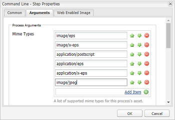

# ImageMagick installeren en configureren om met AEM-middelen te werken{#install-and-configure-imagemagick-to-work-with-aem-assets}

ImageMagick is een softwareplug-in voor het maken, bewerken, samenstellen of omzetten van bitmapafbeeldingen. Afbeeldingen kunnen in verschillende indelingen (meer dan 200) worden gelezen en geschreven, waaronder PNG, JPEG, JPEG-2000, GIF, TIFF, DPX, EXR, WebP, Postscript, PDF en SVG. Met ImageMagick kunt u afbeeldingen vergroten, verkleinen, spiegelen, roteren, vervormen, schuintrekken en transformeren. U kunt ook afbeeldingskleuren aanpassen, verschillende speciale effecten toepassen of tekst, lijnen, veelhoeken, ellipsen en curven tekenen met ImageMagick.

Gebruik de Adobe Experience Manager (AEM)-mediafunctie vanaf de opdrachtregel om afbeeldingen te verwerken via ImageMagick. Als u met ImageMagick met verschillende bestandsindelingen wilt werken, raadpleegt u de aanbevolen werkwijzen voor [bestandsindelingen](/help/assets/assets-file-format-best-practices.md)voor Middelen. Zie Ondersteunde [elementen voor informatie over alle ondersteunde bestandsindelingen](/help/assets/assets-formats.md).

Als u grote bestanden wilt verwerken met ImageMagick, moet u rekening houden met hogere geheugenvereisten dan gebruikelijk, mogelijke wijzigingen die vereist zijn voor IM-beleid en de algemene invloed op de prestaties. De geheugenvereisten zijn afhankelijk van verschillende factoren zoals resolutie, bitdiepte, kleurprofiel en bestandsindeling. Als u zeer grote bestanden wilt verwerken met ImageMagick, moet u de AEM-server op de juiste wijze als benchmark instellen. Aan het eind zijn er enkele nuttige bronnen beschikbaar.

>[!NOTE]
>
>Als u AEM gebruikt op Adobe Managed Services (AMS), kunt u contact opnemen met de klantenservice van Adobe als u een groot aantal PSD- of PSB-bestanden met hoge resolutie wilt verwerken. Experience Manager kan PSB-bestanden met zeer hoge resolutie die groter zijn dan 30000 x 23000 pixels, niet verwerken.

## ImageMagick installeren {#installing-imagemagick}

Er zijn meerdere versies van ImageMagic-installatiebestanden beschikbaar voor verschillende besturingssystemen. Gebruik de juiste versie voor uw besturingssysteem.

1. Download de juiste [ImageMagick-installatiebestanden](https://www.imagemagick.org/script/download.php) voor uw besturingssysteem.
1. Start het installatiebestand om ImageMagick te installeren op de schijf waarop de AEM-server zich bevindt.

1. Plaats de variabele van het wegmilieu aan de installatiemap ImageMagic.
1. Om te controleren of de installatie succesvol was, voer het `identify -version` bevel uit.

## De processtap van de opdrachtregel instellen {#set-up-the-command-line-process-step}

U kunt de processtap van de bevellijn voor uw bepaald gebruiksgeval plaatsen. Voer de volgende stappen uit om elke keer dat u een JPEG-afbeeldingsbestand toevoegt aan de AEM-server, een gespiegelde afbeelding en miniaturen (140x100, 48x48, 319x319 en 1280x1280) te genereren: `/content/dam`

1. Ga op de AEM-server naar de workflowconsole (`https://[aem_server]:[port]/workflow`) en open het workflowmodel voor **[!UICONTROL DAM Update Asset]** .
1. Open vanuit het workflowmodel **[!UICONTROL DAM Update Asset]** de stap **[!UICONTROL EPS-miniaturen (aangedreven door ImageMagick)]** .
1. Voeg op het tabblad **** Argumenten `image/jpeg` toe aan de lijst **[!UICONTROL MIME-typen]** .

   

1. Voer in het vak **[!UICONTROL Opdrachten]** de volgende opdracht in:

   `convert ./${filename} -flip ./${basename}.flipped.jpg`

1. Selecteer de vlaggen Gegenereerde vertoning **** verwijderen en Webvertoning **[!UICONTROL genereren]** .

   

1. Geef op het tabblad **[!UICONTROL Web Enabled Image]** de details voor de vertoning op met afmetingen van 1280x1280 pixels. Geef bovendien `image/jpeg` in het vak **[!UICONTROL Mimetype]** op.

   

1. Click **[!UICONTROL OK]** to save the changes.

   >[!NOTE]
   >
   >Het `convert` bevel kan niet met bepaalde versies van Vensters (bijvoorbeeld SE) lopen, omdat het met het inheemse `convert` nut conflicteert dat deel van de installatie van Vensters uitmaakt. In dit geval, vermeld de volledige weg voor het nut ImageMagick. Geef bijvoorbeeld
   >
   >
   >`"C:\Program Files\ImageMagick-6.8.9-Q16\convert.exe" -define jpeg:size=319x319 ./${filename} -thumbnail 319x319 cq5dam.thumbnail.319.319.png`

1. Open de stap Miniaturen **** verwerken en voeg het MIME-type toe `image/jpeg` onder MIME-typen **** overslaan.

   

1. Voeg op het tabblad Afbeelding **[!UICONTROL voor]** web het MIME-type toe `image/jpeg` onder de lijst **[!UICONTROL Overslaan]**. Click **[!UICONTROL OK]** to save the changes.

   

1. Sla de workflow op.
1. Als u wilt controleren of ImageMagic afbeeldingen correct kan verwerken, uploadt u een JPG-afbeelding naar AEM-elementen. Controleer of er een gespiegelde afbeelding en de uitvoeringen voor zijn gegenereerd.

## Beveiligingskwetsbaarheden beperken {#mitigating-security-vulnerabilities}

Er zijn meerdere beveiligingskwetsbaarheden verbonden aan het gebruik van ImageMagick voor het verwerken van afbeeldingen. Als u bijvoorbeeld door gebruikers verzonden afbeeldingen verwerkt, bestaat het risico dat de code op afstand wordt uitgevoerd (RCE).

Daarnaast zijn verschillende plug-ins voor beeldverwerking afhankelijk van de ImageMagick-bibliotheek, waaronder, maar niet uitsluitend, PHP&#39;s fantaick, Ruby&#39;s magick en paperclip en de imagemagick van nodejs.

Als u ImageMagick of een betrokken bibliotheek gebruikt, raadt Adobe u aan de bekende kwetsbaarheden te beperken door ten minste een van de volgende taken (maar bij voorkeur beide) uit te voeren:

1. Controleer of alle afbeeldingsbestanden beginnen met de verwachte [&quot;toverbytes&quot;](https://en.wikipedia.org/wiki/List_of_file_signatures) die overeenkomen met de afbeeldingsbestandstypen die u ondersteunt voordat u ze naar ImageMagick stuurt voor verwerking.
1. Gebruik een beleidsdossier om de kwetsbare Codeurs uit te schakelen ImageMagick. Het algemene beleid voor ImageMagick is te vinden op `/etc/ImageMagick`.
