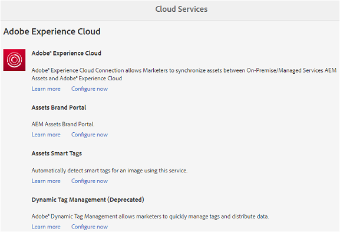

# Integratie van AEM-middelen met Brand Portal configureren {#configure-aem-assets-integration-with-brand-portal}

Als u een klant van het Brand Portal voor Adobe Experience Manager (AEM) Assets Brand Portal bent, kunt u AEM Assets integreren met Brand Portal om het publiceren van middelen naar Brand Portal mogelijk te maken. U kunt deze integratie instellen via de interface van Adobe.io.

Eerst, creeer een toepassing, die een authentificatiemechanisme, in de Openbare gateway van de Wolk van de Marketing omvat. Maak vervolgens een profiel in uw AEM Assets-instantie met de toepassings-id die u van de gateway verkrijgt.

Gebruik deze configuratie om elementen van AEM Assets naar Brand Portal te publiceren. Op de achtergrond, verifieert de server AEM uw profiel met de gateway en integreert dan Middelen AEM met het Portaal van het Merk.

>[!NOTE]
>
>De gebruikersinterface voor het configureren van Auth-integratie bevindt zich in [https://legacy-oauth.cloud.adobe.io/](https://legacy-oauth.cloud.adobe.io/), die eerder is gehost in [https://marketing.adobe.com/developer/](https://marketing.adobe.com/developer/).

## JWT-toepassing maken {#create-jwt-application}

1. Meld u aan bij [https://legacy-oauth.cloud.adobe.io/](https://legacy-oauth.cloud.adobe.io/) met uw Adobe-id. **De pagina JWT-toepassingen** wordt geopend.

   >[!NOTE]
   >
   >U kunt een toepassings-id alleen maken als u de systeembeheerder van uw organisatie bent. Tenant is de technische naam voor uw organisatie die is geregistreerd bij Adobe Marketing Cloud.

1. Selecteer Toepassing **** toevoegen om een toepassing te maken.
1. Geef een naam voor de toepassing en een optionele beschrijving op.
1. Selecteer in de lijst **[!UICONTROL Organisatie]** de organisatie waarvoor u elementen wilt synchroniseren.
1. Selecteer in de lijst **[!UICONTROL Bereik]** de optie **[!UICONTROL dam-read]**, **[!UICONTROL dam-sync]**, **[!UICONTROL dam-write]** en **[!UICONTROL cc-share]**.
1. Click **[!UICONTROL Add]**. Er wordt een JWT Service-toepassing gemaakt. U kunt de toepassing bewerken en opslaan.
1. Kopieer de toepassings-id die voor de nieuwe toepassing wordt gegenereerd.

   >[!NOTE]
   >
   >Zorg ervoor dat u de toepassing niet per ongeluk geheim kopieert in plaats van toepassings-id.

## Nieuwe cloudconfiguratie maken {#create-a-new-cloud-configuration}

1. Klik op de **[!UICONTROL navigatiepagina]** van de lokale AEM Assets-instantie op het pictogram **[!UICONTROL Gereedschappen]** aan de linkerkant.

1. Ga naar **[!UICONTROL Cloud Services]>[!UICONTROL Oudere Cloud Services]**.

   

1. Zoek in **[!UICONTROL Cloud Services]** de service **[!UICONTROL Assets Brand Portal]** onder **[!UICONTROL Adobe Experience Cloud]**.

   

1. Klik op **[!UICONTROL Nu]** configureren onder de service om het dialoogvenster Configuratie **** maken weer te geven.
1. Geef in het dialoogvenster **[!UICONTROL Configuratie]** maken een titel en naam op voor de nieuwe configuratie en klik op **[!UICONTROL Maken]**.

   

1. Geef in het dialoogvenster **[!UICONTROL AEM Assets Brand Portal Replication]** de URL van uw organisatie op in het veld **[!UICONTROL Tenant URL]** .
1. Plak in het veld **[!UICONTROL Client-id]** de toepassings-id die u hebt gekopieerd aan het einde van de procedure [Een toepassing](/help/assets/brand-portal-configuring-integration.md#create-jwt-application)maken. Selecteer **[!UICONTROL OK]**.

   

1. Schakel het selectievakje **[!UICONTROL Openbare map publiceren]** in om de elementen (gepubliceerd vanuit AEM) openbaar te maken voor algemene gebruikers van het Brand Portal.

   >[!NOTE]
   >
   >De optie voor het inschakelen van **[!UICONTROL Openbare Mappublicatie]** is beschikbaar in AEM 6.3.2.1 en hoger.

1. Van de pagina van de Configuratie **[!UICONTROL van het Portaal van de]** Merk, klik de Openbare Sleutel **[!UICONTROL van de]** Vertoning om de openbare sleutel te tonen die voor uw instantie wordt geproduceerd.

   

   U kunt ook op Openbare sleutel **[!UICONTROL downloaden voor OAuth Gateway]** om het bestand met de openbare sleutel te downloaden. Open vervolgens het bestand om de openbare sleutel weer te geven.

## Integratie inschakelen {#enable-integration}

1. Toon de openbare sleutel gebruikend één van de volgende methodes die in de laatste stap van de procedure worden vermeld [voeg een nieuwe configuratie aan de Wolk](/help/assets/brand-portal-configuring-integration.md#create-a-new-cloud-configuration)van de Marketing toe.

   * Klik op de knop **[!UICONTROL Openbare sleutel]** weergeven om de toets weer te geven.
   * Open het gedownloade bestand met de sleutel.

1. Open de Marketing Cloud Developer Connection-interface en klik op de toepassing die u hebt gemaakt in [Create an application](/help/assets/brand-portal-configuring-integration.md#create-jwt-application).
1. Plak de openbare sleutel in het **[!UICONTROL Openbare Zeer belangrijke]** gebied van de configuratieinterface
1. Click **[!UICONTROL Save]**. Een bericht bevestigt dat de toepassing is bijgewerkt.

## Integratie testen {#test-the-integration}

1. Klik op de **[!UICONTROL navigatiepagina]** van de lokale AEM Assets-instantie op het pictogram **[!UICONTROL Gereedschappen]** aan de linkerkant.

1. Ga naar **[!UICONTROL Implementatie]** > **[!UICONTROL Replicatie]**.

   

1. Klik in de pagina **[!UICONTROL Replication]** op **[!UICONTROL Agents op de auteur]**.

   

1. Als u de verbinding tussen AEM-auteur en Brand Portal wilt controleren, opent u een van de vier replicatieagents en klikt u op Verbinding **** testen.

   >[!NOTE]
   >
   >De replicatieagenten werken parallel en delen de baandistributie gelijk, daardoor verhogend de het publiceren snelheid met vier keer de originele snelheid. Nadat de wolkendienst wordt gevormd, wordt de extra configuratie niet vereist om de replicatieagenten toe te laten die door gebrek worden geactiveerd om parallelle publicatie van veelvoudige activa toe te laten.

   >[!NOTE]
   >
   >Vermijd onbruikbaar makend om het even welke replicatieagenten, aangezien het de replicatie van sommige activa kan veroorzaken om te ontbreken.

   

1. Bekijk de bodem van de testresultaten om te verifiëren dat de replicatie succesvol was.

   

Nadat de replicatie slaagt, kunt u activa, omslagen, en Inzamelingen aan het Portaal van het Merk publiceren. Zie voor meer informatie:

* [Middelen en mappen publiceren naar Brand Portal](/help/assets/brand-portal-publish-folder.md)
* [Verzamelingen publiceren naar Brand Portal](/help/assets/brand-portal-publish-collection.md)

## Middelen publiceren naar Brand Portal {#publish-assets-to-brand-portal}

Nadat de replicatie slaagt, kunt u activa, omslagen, en Inzamelingen aan het Portaal van het Merk publiceren. Voer de volgende stappen uit om elementen te publiceren naar Brand Portal:

>[!NOTE]
>
>Adobe raadt gefaseerde publicatie aan, bij voorkeur tijdens niet-piekuren, zodat de AEM-auteur niet te veel bronnen in beslag neemt.

1. Selecteer in de middelenconsole de elementen/map die u wilt publiceren en klik op de werkbalk op de optie **[!UICONTROL Snel publiceren]** .

   U kunt ook de elementen selecteren die u naar Brand Portal wilt publiceren.

   

1. Voor het publiceren van de elementen naar Brand Portal zijn de volgende twee opties beschikbaar:
   * [Elementen direct publiceren](#publish-to-bp-now)
   * [Elementen later publiceren](#publish-to-bp-now)

### Elementen nu publiceren {#publish-to-bp-now}

Voer een van de volgende twee handelingen uit om de geselecteerde elementen te publiceren naar Brand Portal:

* Selecteer **[!UICONTROL Snel publiceren]** op de werkbalk. Selecteer vervolgens in het menu **[!UICONTROL Publiceren naar Brand Portal]**.

* Selecteer Publicatie **[!UICONTROL beheren in de werkbalk]**.

   1. Kies vervolgens in de **[!UICONTROL Handeling]** de optie **[!UICONTROL Publiceren naar Brand Portal]** en **[!UICONTROL vervolgens]** Nu **[!UICONTROL in de planning]**. Click **[!UICONTROL Next]**.

   2. Bevestig uw selectie binnen **[!UICONTROL bereik]** en klik op **[!UICONTROL Publiceren naar Brand Portal]**.

Er verschijnt een bericht waarin wordt aangegeven dat de elementen in de wachtrij zijn geplaatst voor publicatie naar Brand Portal. Meld u aan bij de interface Brand Portal om de gepubliceerde elementen te bekijken.

### Elementen later publiceren {#publish-to-bp-later}

Publiceren van de elementen naar Brand Portal naar een latere datum of tijd plannen:

1. Als u middelen/mappen hebt geselecteerd om te publiceren, selecteert u Publicatie **** beheren in de werkbalk boven in het scherm.

1. Selecteer op de pagina Publicatie **** beheren de optie **[!UICONTROL Publiceren naar Brand Portal]** in **[!UICONTROL Actie]** en selecteer **[!UICONTROL Later]** in **[!UICONTROL Planning]**.

   

1. Selecteer een **[!UICONTROL activeringsdatum]** en geef de tijd op. Click **[!UICONTROL Next]**.

1. Selecteer een **activeringsdatum** en geef de tijd op. Click **Next**.

1. Geef een **[!UICONTROL workflowtitel]** op in **[!UICONTROL Workflows]**. Klik op Later **** publiceren.

   

Meld u nu aan bij Brand Portal om te zien of de gepubliceerde middelen beschikbaar zijn op de interface Brand Portal.

