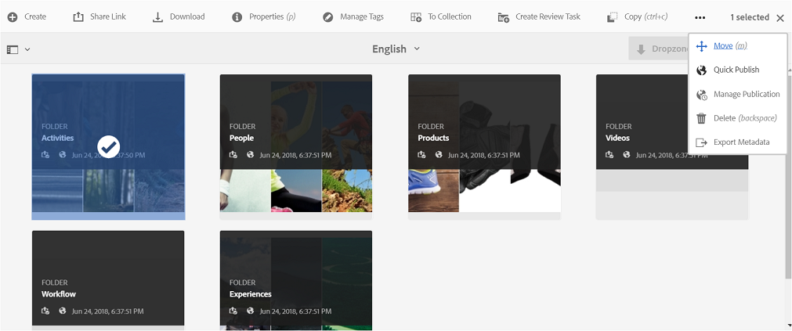

# Assets publiceren naar Brand Portal {#publish-assets-to-brand-portal}

Als beheerder van Adobe Experience Manager-middelen (AEM) kunt u elementen en mappen publiceren naar de AEM Assets Brand Portal-instantie (of de publicatieworkflow plannen op een latere datum of tijd) voor uw organisatie. U moet echter eerst AEM Assets configureren met Brand Portal. Zie [AEM Assets configureren met Brand Portal](/help/assets/configure-aem-assets-with-brand-portal.md) voor meer informatie.

Nadat de replicatie slaagt, kunt u activa, omslagen, en Inzamelingen aan het Portaal van het Merk publiceren. Voer de volgende stappen uit om elementen te publiceren naar Brand Portal:

>[!NOTE]
>
>Adobe raadt gefaseerde publicatie aan, bij voorkeur niet tijdens piekuren, zodat de AEM-auteur niet te veel bronnen in beslag neemt.

1. Selecteer in de middelenconsole de elementen/map die u wilt publiceren en klik op de optie **[!UICONTROL Quick Publish]** op de werkbalk.

   U kunt ook de elementen selecteren die u naar Brand Portal wilt publiceren.

   

1. Voor het publiceren van de elementen naar Brand Portal zijn de volgende twee opties beschikbaar:
   * [Elementen direct publiceren](#publish-to-bp-now)
   * [Assets later publiceren](#publish-to-bp-now)

## Assets nu publiceren {#publish-to-bp-now}

Voer een van de volgende handelingen uit om de geselecteerde assets naar Brand Portal te publiceren:

* Selecteer **[!UICONTROL Quick Publish]** in de werkbalk. Selecteer vervolgens **[!UICONTROL Publish to Brand Portal]** in het menu.

* Selecteer **[!UICONTROL Manage Publication]** in de werkbalk.

   1. Selecteer vervolgens **[!UICONTROL Action]** in **[!UICONTROL Publish to Brand Portal]** en selecteer **[!UICONTROL Scheduling]** **[!UICONTROL Now]**. Klik op **[!UICONTROL Next]**.

   2. Bevestig binnen **[!UICONTROL Scope]** uw selectie en klik **[!UICONTROL Publish to Brand Portal]**.

Er verschijnt een bericht waarin wordt aangegeven dat de assets in de wachtrij zijn geplaatst voor publicatie naar Brand Portal. Meld u aan bij de Brand Portal-interface om de gepubliceerde assets te bekijken.

## Assets later publiceren {#publish-to-bp-later}

Voer de volgende handelingen uit om het publiceren van de assets naar Brand Portal op een latere datum of tijd te plannen:

1. Als u elementen/mappen hebt geselecteerd om te publiceren, selecteert u **[!UICONTROL Manage Publication]** in de werkbalk boven in het scherm.

1. Selecteer **[!UICONTROL Manage Publication]** op &lt;a0/> pagina **[!UICONTROL Publish to Brand Portal]** van **[!UICONTROL Action]** en selecteer **[!UICONTROL Later]** van **[!UICONTROL Scheduling]**.

   

1. Selecteer een **[!UICONTROL Activation date]** en geef de tijd op. Klik op **[!UICONTROL Next]**.

1. Selecteer een **activeringsdatum** en geef de tijd op. Klik op **Next**.

1. Geef een **[!UICONTROL Workflow title]** op in **[!UICONTROL Workflows]**. Klik op **[!UICONTROL Publish Later]**.

   

Meld u nu aan bij Brand Portal om te zien of de gepubliceerde middelen beschikbaar zijn op de interface Brand Portal.

