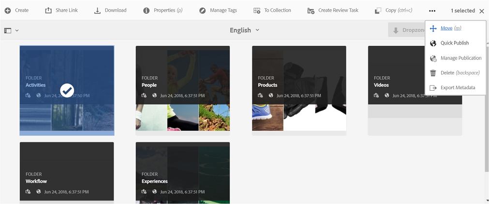
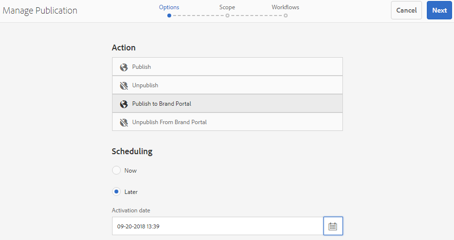
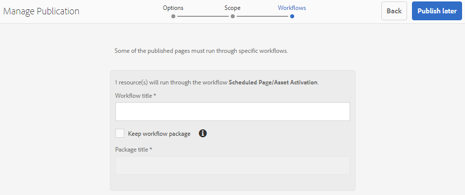
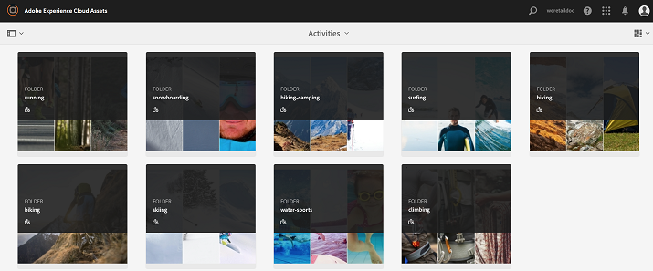
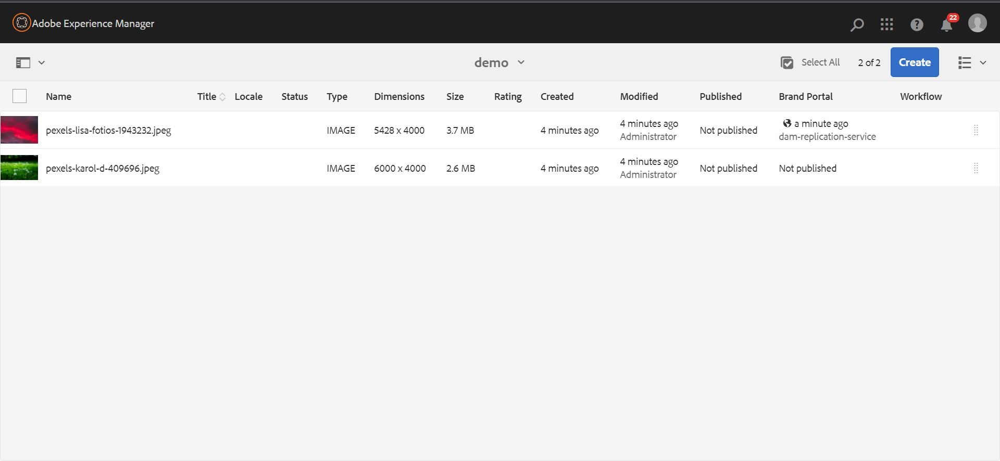

# Elementen publiceren naar Brand Portal {#publish-assets-to-brand-portal}

| Versie | Artikelkoppeling |
| -------- | ---------------------------- |
| AEM as a Cloud Service | [&#x200B; klik hier &#x200B;](https://experienceleague.adobe.com/docs/experience-manager-cloud-service/content/assets/brand-portal/publish-to-brand-portal.html?lang=en) |
| AEM 6.5 | Dit artikel |

Als Adobe Experience Manager (AEM) Assets-beheerder kunt u elementen en mappen publiceren naar het AEM Assets Brand Portal-exemplaar (of de publicatieworkflow plannen op een latere datum/tijd) voor uw organisatie. U moet echter eerst AEM Assets configureren met Brand Portal. Voor details, zie [&#x200B; AEM Assets met Brand Portal &#x200B;](/help/assets/configure-aem-assets-with-brand-portal.md) vormen.

Nadat de replicatie is gelukt, kunt u elementen, mappen en verzamelingen publiceren naar Brand Portal. Voer de volgende stappen uit om elementen te publiceren naar Brand Portal:

>[!NOTE]
>
>Adobe raadt aan om de publicatie in fasen te laten plaatsvinden, bij voorkeur tijdens de niet-piekuren, zodat de auteur van AEM niet te veel middelen in beslag neemt.

1. Selecteer in de Assets-console de middelen/map die u wilt publiceren en klik op de optie **[!UICONTROL Quick Publish]** op de werkbalk.

   U kunt ook de elementen selecteren die u naar Brand Portal wilt publiceren.

   

1. Voor het publiceren van de elementen naar Brand Portal zijn de volgende twee opties beschikbaar:
   * [Elementen direct publiceren](#publish-to-bp-now)
   * [Elementen later publiceren](#publish-to-bp-now)

## Elementen nu publiceren {#publish-to-bp-now}

Voer een van de volgende twee handelingen uit om de geselecteerde elementen te publiceren naar Brand Portal:

* Selecteer in de werkbalk de optie **[!UICONTROL Quick Publish]** . Selecteer vervolgens **[!UICONTROL Publish to Brand Portal]** in het menu.

* Selecteer in de werkbalk de optie **[!UICONTROL Manage Publication]** .

   1. Selecteer vervolgens **[!UICONTROL Action]** **[!UICONTROL Publish to Brand Portal]** bij **[!UICONTROL Scheduling]** Selecteren **[!UICONTROL Now]** . Klik op **[!UICONTROL Next]** .

   2. Bevestig uw selectie in **[!UICONTROL Scope]** en klik op **[!UICONTROL Publish to Brand Portal]** .

Er wordt een bericht weergegeven dat de elementen in de wachtrij zijn geplaatst voor publicatie naar Brand Portal. Meld u aan bij de Brand Portal-interface om de gepubliceerde middelen te bekijken.

## Elementen later publiceren {#publish-to-bp-later}

U kunt als volgt de publicatie van de elementen naar Brand Portal plannen op een latere datum of tijd:

1. Als u middelen/mappen hebt geselecteerd om te publiceren, selecteert u **[!UICONTROL Manage Publication]** in de werkbalk boven in het scherm.

1. Selecteer op de pagina **[!UICONTROL Manage Publication]** de optie **[!UICONTROL Publish to Brand Portal]** from **[!UICONTROL Action]** en selecteer **[!UICONTROL Later]** from **[!UICONTROL Scheduling]** .

   

1. Selecteer een **[!UICONTROL Activation date]** en geef tijd op. Klik op **[!UICONTROL Next]** .

1. Selecteer een **datum van de Activering** en specificeer tijd. Klik **daarna**.

1. Geef een **[!UICONTROL Workflow title]** in **[!UICONTROL Workflows]** op. Klik op **[!UICONTROL Publish Later]** .

   

Meld u nu aan bij Brand Portal om te zien of de gepubliceerde middelen beschikbaar zijn op de interface van Brand Portal.

## Gepubliceerd bestand of map weergeven op Brand Portal {#view-published-file-folder}

1. Meld u aan bij de Brand Portal-interface om de gepubliceerde middelen weer te geven (afhankelijk van uw geplande datum of tijd).

   

1. De schakelaar aan de mening van de Lijst  om de huidige te zien publiceert status van de activa.

<!--2. On the [Asset Reports page](#https://experienceleague.adobe.com/en/docs/experience-manager-cloud-service/content/assets/admin/asset-reports), you can see the current state of the report job, for example, Success, Failed, Queued, or Scheduled.-->

