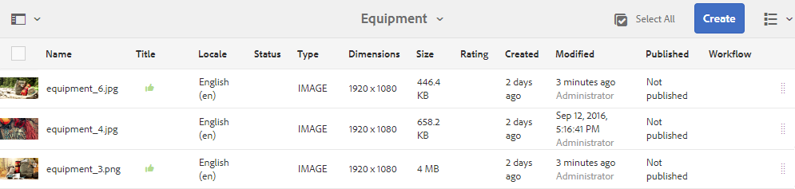

# Map-assets en verzamelingen reviewen {#review-folder-assets-and-collections}

Stel revisieworkflows in voor elementen in een map of verzameling en deel deze met revisoren of creatieve partners om feedback te zoeken.

[!DNL Adobe Experience Manager Assets] Hiermee kunt u een workflow voor ad-hocrevisies instellen voor elementen in een map of verzameling en deze delen met revisoren of creatieve partners om feedback te vragen.

U kunt de revisiewerkstroom aan een project koppelen of een onafhankelijke revisietaak maken.

Nadat u de middelen hebt gedeeld, kunnen revisoren deze goedkeuren of afwijzen. Meldingen worden in verschillende fasen van de workflow verzonden om beoogde ontvangers op de hoogte te stellen van de voltooiing van verschillende taken. Als u bijvoorbeeld een map of verzameling deelt, ontvangt de controleur een melding dat een map of verzameling is gedeeld voor revisie.

Nadat de controleur de controle heeft voltooid (activa goedkeurt of verwerpt), ontvangt u een bericht van de revisievoltooiing.

## Een revisietaak maken voor mappen {#creating-a-review-task-for-folders}

1. Selecteer in de gebruikersinterface [!DNL Assets] de map waarvoor u een revisietaak wilt maken.
1. Klik in de werkbalk op **[!UICONTROL Create Review Task]**  om de pagina **[!UICONTROL Review Task]** te openen. Als de optie niet wordt weergegeven op de werkbalk, klikt u op **[!UICONTROL More]** en selecteert u de optie.

1. (Optioneel) Selecteer in de lijst **[!UICONTROL Project]** het project waaraan u de revisietaak wilt koppelen. Standaard is de optie **[!UICONTROL None]** geselecteerd. Als u geen project aan de overzichtstaak wilt associëren, behoud deze selectie.

   >[!NOTE]
   >
   >Slechts zijn de projecten waarvoor u de (of hogere) toestemmingen op het niveau van de Redacteur hebt zichtbaar in **[!UICONTROL Projects]** lijst.

1. Voer een naam in voor de overzichtstaak en selecteer een fiatteur in de lijst **[!UICONTROL Assign To]**.

   >[!NOTE]
   >
   >De leden/groepen van het geselecteerde project zijn beschikbaar als fiatteurs in **[!UICONTROL Assign To]** lijst.

1. Voer een beschrijving, de prioriteit van de taak en de vervaldatum voor de controletaak in.

   

1. Voer op het tabblad Geavanceerd een label in dat u wilt gebruiken om de URI te maken.

   

1. Klik **[!UICONTROL Submit]**, en klik dan **[!UICONTROL Done]** om het bevestigingsbericht te sluiten. Er wordt een bericht voor de nieuwe taak naar de goedkeurder verzonden.
1. Meld u aan bij [!DNL Assets] als fiatteur en navigeer naar [!DNL Assets] UI. Als u elementen wilt goedkeuren, klikt u op **[!UICONTROL Notifications]** en selecteert u vervolgens de revisietaak in de lijst.

   

1. Controleer op de pagina **[!UICONTROL Review Task]** de details van de overzichtstaak en klik vervolgens op **[!UICONTROL Review]**.
1. Selecteer op de pagina **[!UICONTROL Review Task]** elementen en klik op **[!UICONTROL Approve/Reject]** om deze goed te keuren of af te wijzen, al naar gelang het geval.

   

1. Klik op **[!UICONTROL Complete]** op de werkbalk. Voer in het dialoogvenster een opmerking in en klik op **[!UICONTROL Complete]** om te bevestigen.
1. Navigeer naar de [!DNL Assets] gebruikersinterface en open de map. De pictogrammen voor de goedkeuringsstatus van de elementen worden weergegeven in de kaartweergave en de lijstweergave.

   **Kaartweergave**

   

   **Lijstweergave**

   

## Een overzichtstaak maken voor verzamelingen {#creating-a-review-task-for-collections}

1. Selecteer op de pagina Verzamelingen de verzameling waarvoor u een revisietaak wilt maken.
1. Klik in de werkbalk op **[!UICONTROL Create Review Task]**  om de pagina **[!UICONTROL Review Task]** te openen. Als de optie niet op de werkbalk wordt weergegeven, klikt u op **[!UICONTROL More]** en selecteert u de optie.

1. (Optioneel) Selecteer in de lijst **[!UICONTROL Project]** het project waaraan u de revisietaak wilt koppelen. Standaard is de optie **[!UICONTROL None]** geselecteerd. Als u geen project aan de overzichtstaak wilt associëren, behoud deze selectie.

   >[!NOTE]
   >
   >Slechts zijn de projecten waarvoor u de (of hogere) toestemmingen op het niveau van de Redacteur hebt zichtbaar in **[!UICONTROL Projects]** lijst.

1. Voer een naam in voor de overzichtstaak en selecteer een fiatteur in de lijst **[!UICONTROL Assign To]**.

   >[!NOTE]
   >
   >De leden/groepen van het geselecteerde project zijn beschikbaar als fiatteurs in **[!UICONTROL Assign To]** lijst.

1. Voer een beschrijving, de prioriteit van de taak en de vervaldatum voor de controletaak in.

   

1. Klik **[!UICONTROL Submit]**, en klik dan **[!UICONTROL Done]** om het bevestigingsbericht te sluiten. Er wordt een bericht voor de nieuwe taak naar de goedkeurder verzonden.
1. Meld u aan bij [!DNL Assets] als fiatteur en navigeer naar de [!DNL Assets]-console. Als u elementen wilt goedkeuren, klikt u op **[!UICONTROL Notifications]** en selecteert u vervolgens de revisietaak in de lijst.
1. Controleer op de pagina **[!UICONTROL Review Task]** de details van de overzichtstaak en klik vervolgens op **[!UICONTROL Review]**.
1. Alle elementen in de verzameling zijn zichtbaar op de overzichtspagina. Selecteer de elementen en klik op **[!UICONTROL Approve/Reject]** om elementen goed te keuren of af te wijzen.

   

1. Klik op **[!UICONTROL Complete]** op de werkbalk. Voer in het dialoogvenster een opmerking in en klik op **[!UICONTROL Complete]** om te bevestigen.
1. Navigeer naar de verzamelingsconsole en open de verzameling. De pictogrammen voor de goedkeuringsstatus van de elementen worden weergegeven in zowel de Kaart- als lijstweergave.

   

   *Afbeelding: Kaartweergave.*

   

   *Afbeelding: Lijstweergave.*
