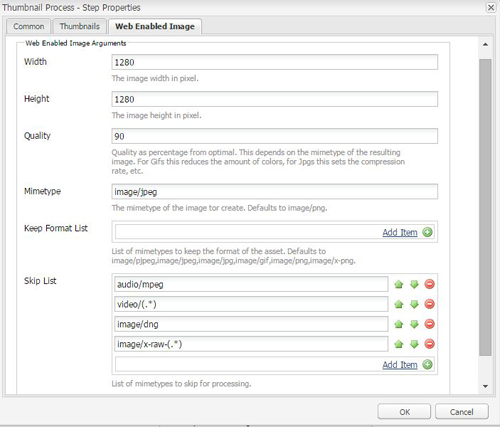

# Afbeeldingen verwerken met Camera Raw {#camera-raw-support}

U kunt de [!DNL Adobe Camera Raw] ondersteuning inschakelen voor het verwerken van Raw-bestandsindelingen, zoals CR2, NEF en RAF, en voor het renderen van afbeeldingen in de JPEG-indeling. De functionaliteit wordt ondersteund bij [!DNL Adobe Experience Manager Assets] het gebruik van het [Camera Raw-pakket](https://www.adobeaemcloud.com/content/marketplace/marketplaceProxy.html?packagePath=/content/companies/public/adobe/packages/aem630/product/assets/aem-assets-cameraraw-pkg) dat beschikbaar is via Package Share.

>[!NOTE]
>
>De functionaliteit ondersteunt alleen JPEG-uitvoeringen. Deze functie wordt ondersteund in Windows 64-bits, Mac OS en RHEL 7.x.

Ga als volgt te werk om [!DNL Camera Raw] ondersteuning in [!DNL Experience Manager Assets]te schakelen:

1. Download het [Camera Raw-pakket](https://www.adobeaemcloud.com/content/marketplace/marketplaceProxy.html?packagePath=/content/companies/public/adobe/packages/aem630/product/assets/aem-assets-cameraraw-pkg) van het Delen van pakketten.
1. Ga naar `https://[aem_server]:[port]/workflow`. Open de workflow **[!UICONTROL DAM Update Asset]** .
1. Open de stap Miniaturen **** verwerken.
1. Geef de volgende configuratie op het tabblad **[!UICONTROL Miniaturen]** op:

   * **[!UICONTROL Miniaturen]**: `140:100:false, 48:48:false, 319:319:false`
   * **[!UICONTROL MIME-typen]** overslaan: `skip:image/dng, skip:image/x-raw-(.*)`
   

1. Geef op het tabblad **[!UICONTROL Web Enabled Image]** (Afbeelding **[!UICONTROL voor web ingeschakeld) in het veld]** Skip List `audio/mpeg, video/(.*), image/dng, image/x-raw-(.*)`(Lijstoverslaan).

   

1. Voeg vanuit het zijpaneel de stap **[!UICONTROL Camera Raw/DNG Handler]** toe onder de stap **[!UICONTROL Miniatuurverwezenlijking]** .
1. Voeg in de stap **[!UICONTROL Camera Raw/DNG Handler]** de volgende configuratie toe op het tabblad **[!UICONTROL Argumenten]** :

   * **[!UICONTROL MIME-typen]**: `image/dng` en `image/x-raw-(.*)`
   * **[!UICONTROL Opdracht]**:

      * `DAM_Raw_Converter ${directory}/${filename} ${directory} cq5dam.web.1280.1280.jpeg 1280 1280`
      * `DAM_Raw_Converter ${directory}/${filename} ${directory} cq5dam.thumbnail.319.319.jpeg 319 319`
      * `DAM_Raw_Converter ${directory}/${filename} ${directory} cq5dam.thumbnail.140.100.jpeg 140 100`
      * `DAM_Raw_Converter ${directory}/${filename} ${directory} cq5dam.thumbnail.48.48.jpeg 48 48`
   

1. Click **[!UICONTROL Save]**.

>[!NOTE]
>
>Zorg ervoor dat de bovenstaande configuratie hetzelfde is als het **[!UICONTROL voorbeeld-DAM-updateelement met de configuratie van de stappen]** voor Camera RAW en DNG-afhandeling.

U kunt nu Camera Raw-bestanden importeren in AEM-elementen. Nadat u het Camera RAW-pakket hebt geïnstalleerd en de vereiste workflow hebt geconfigureerd, wordt de optie **[!UICONTROL Afbeelding aanpassen]** weergegeven in de lijst met zijvensters.

*Afbeelding: Opties in het zijpaneel.*

*Afbeelding: Gebruik deze optie om lichte bewerkingen uit te voeren op uw afbeeldingen.*

Nadat u de bewerkingen in een [!DNL Camera Raw] afbeelding hebt opgeslagen, `AdjustedPreview.jpg` wordt een nieuwe uitvoering voor de afbeelding gegenereerd. Voor andere afbeeldingstypen behalve [!DNL Camera Raw]worden de wijzigingen in alle uitvoeringen doorgevoerd.

## Beste werkwijzen, bekende problemen en beperkingen {#best-practices}

De functionaliteit heeft de volgende beperkingen:

* De functionaliteit ondersteunt alleen JPEG-uitvoeringen. Deze functie wordt ondersteund in Windows 64-bits, Mac OS en RHEL 7.x.
* Metagegevensterugname wordt niet ondersteund voor RAW- en DNG-indelingen.
* De [!DNL Camera Raw] bibliotheek heeft beperkingen rond de totale pixel het in een tijd kan verwerken. Op dit moment kan het maximaal 65000 pixels aan de lange zijde van een bestand of 512 MP verwerken, ongeacht de criteria die het eerst worden aangetroffen.
