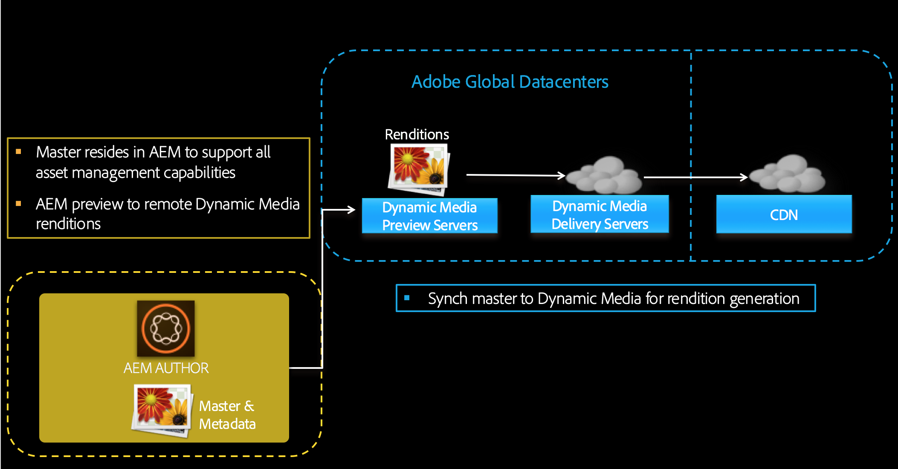

# Het vormen Dynamische Media - wijze Scene7{#configuring-dynamic-media-scene-mode}

Als u Adobe Experience Manager gebruikt die is ingesteld voor verschillende omgevingen, zoals een voor ontwikkeling, een voor ophaling en een voor live productie, moet u Dynamic Media Cloud Services configureren voor elk van deze omgevingen.

## Het diagram van de architectuur van Dynamische Media - wijze Scene7 {#architecture-diagram-of-dynamic-media-scene-mode}

Het volgende architectuurdiagram beschrijft hoe Dynamische Media - wijze Scene7 werkt.

Met de nieuwe architectuur is AEM verantwoordelijk voor hoofdelementen en synchronisaties met Dynamic Media voor het verwerken en publiceren van bedrijfsmiddelen:

1. Wanneer het hoofdelement naar AEM wordt geüpload, wordt het naar Dynamic Media gerepliceerd. Op dat moment worden met Dynamic Media alle processen voor het genereren van elementen, zoals videocodering en dynamische varianten van een afbeelding, verwerkt. <!-- (In Dynamic Media - Scene7 mode, be aware that you can only upload assets whose file sizes are 2 GB or less.) Jira ticket CQ-4286561 fixed this issue. DM-S7 NOW SUPPORTS THE UPLOAD OF ASSETS LARGER THAN 2 GB. -->
1. Nadat de vertoningen worden geproduceerd, kan AEM veilig tot de verre Dynamische vertoningen van Media toegang hebben en voorproef (geen binaire getallen worden teruggestuurd naar de instantie AEM).
1. Nadat de inhoud klaar is om te worden gepubliceerd en goedgekeurd, brengt het de Dynamische dienst van Media in werking om inhoud uit te duwen naar leveringsservers en geheim voorgeheugeninhoud bij CDN.



## Dynamische media inschakelen in de modus Scene7 {#enabling-dynamic-media-in-scene-mode}

[Dynamische media](https://www.adobe.com/solutions/web-experience-management/dynamic-media.html) zijn standaard uitgeschakeld. Als u gebruik wilt maken van dynamische mediafuncties, moet u deze inschakelen.

>[!NOTE]
>
>Dynamische media - de wijze Scene7 is voor de instantie van de Auteur AEM slechts. Als dusdanig, moet u `runmode=dynamicmedia_scene7` op de instantie van de Auteur AEM vormen, *niet* de instantie van de Publicatie AEM.

Om dynamische media toe te laten, moet u AEM opstarten gebruikend `dynamicmedia_scene7` runmode van de bevellijn door het volgende in een eindvenster in te gaan (gebruikte voorbeeldhaven is 4502):

```shell
java -Xms4096m -Xmx4096m -Doak.queryLimitInMemory=500000 -Doak.queryLimitReads=500000 -jar cq-quickstart-6.5.0.jar -gui -r author,dynamicmedia_scene7 -p 4502
```

## (Optioneel) Dynamische mediavoorinstellingen en -configuraties migreren van 6,3 naar 6,5 Nul downtime {#optional-migrating-dynamic-media-presets-and-configurations-from-to-zero-downtime}

Als u de Dynamische Media van AEM van 6.3 aan 6.4 of 6.5 bevordert (die nu de capaciteit voor nul onderbreking plaatsingen omvat), moet u het volgende krullbevel in werking stellen om al uw voorinstellingen en configuraties van `/etc` aan `/conf` in CRXDE Lite te migreren.

>[!NOTE]
>
>Als u uw AEM-instantie uitvoert in de compatibiliteitsmodus, dat wil zeggen dat de compatibiliteit in het pakket is geïnstalleerd, hoeft u deze opdrachten niet uit te voeren.

Voor alle upgrades, met of zonder het compatibiliteitspakket, kunt u de standaard, out-of-box kijker vooraf instelt kopiëren die oorspronkelijk met Dynamische Media door het volgende de krullbevel van Linux in werking te stellen kwam:

`curl -u admin:admin -X POST https://<server_address>:<server_port>/libs/settings/dam/dm/presets/viewer.pushviewerpresets.json`

Als u aangepaste voorinstellingen en configuraties van viewers die u hebt gemaakt, wilt migreren van `/etc` `/conf`naar, voert u de volgende Linux-curl-opdracht uit:

`curl -u admin:admin -X POST https://<server_address>:<server_port>/libs/settings/dam/dm/presets.migratedmcontent.json`

## Functiepakket 18912 voor migratie van grote hoeveelheden bedrijfsmiddelen installeren {#installing-feature-pack-for-bulk-asset-migration}

De installatie van functiepak 18912 is *optioneel*.

Met Feature Pack 18912 kunt u opgenomen elementen bulksgewijs via FTP importeren of elementen migreren van Dynamic Media - Hybride modus of Dynamic Media Classic naar Dynamic Media - Scene7-modus op AEM. Het is verkrijgbaar bij [Adobe Professional Services](https://www.adobe.com/experience-cloud/consulting-services.html).

Zie [Installeren van functiepak 18912 voor bulkassemigratie](/help/assets/bulk-ingest-migrate.md) voor meer informatie.

## Dynamische mediaconfiguratie maken {#configuring-dynamic-media-cloud-services}

**Voordat u dynamische media** configureert: Nadat u uw provisioning-e-mail met Dynamic Media-referenties hebt ontvangen, moet u zich [aanmelden](https://www.adobe.com/marketing-cloud/experience-manager/scene7-login.html) bij Dynamic Media Classic om uw wachtwoord te wijzigen. Het wachtwoord dat in de e-mailprovisioning wordt ingevoerd, wordt door het systeem gegenereerd en is alleen bedoeld als tijdelijk wachtwoord. Het is belangrijk dat u het wachtwoord bijwerkt zodat Dynamic Media Cloud Service wordt ingesteld met de juiste referenties.


**Een dynamische mediaconfiguratie maken**

1. Tik in AEM op het AEM-logo om toegang te krijgen tot de algemene navigatieconsole en tik op het pictogram Extra of tik vervolgens op **[!UICONTROL Cloud Services > Dynamic Media Configuration]**.
1. On the Dynamic Media Configuration Browser page, in the left pane, tap **[!UICONTROL global]** (do not tap or select the folder icon to the left of **[!UICONTROL global]**), then tap **[!UICONTROL Create]**.
1. Voer op de pagina Dynamische mediaconfiguratie maken een titel in, het e-mailadres van de Dynamic Media-account, het wachtwoord en selecteer vervolgens het gebied. Deze worden door Adobe aan u verstrekt in de levering e-mail. Neem contact op met de ondersteuningsafdeling als u dit niet hebt ontvangen.

   Klik op **[!UICONTROL Verbinden met dynamische media]**.

   >[!NOTE]
   >
   >Nadat u een e-mailbericht met dynamische media-referenties hebt ontvangen, [meldt u zich aan bij](https://www.adobe.com/marketing-cloud/experience-manager/scene7-login.html) Dynamic Media Classic om uw wachtwoord te wijzigen. Het wachtwoord dat in de e-mailprovisioning wordt ingevoerd, wordt door het systeem gegenereerd en is alleen bedoeld als tijdelijk wachtwoord. Het is belangrijk dat u het wachtwoord bijwerkt zodat de Dynamic Media Cloud Service wordt ingesteld met de juiste referenties.

1. Wanneer de verbinding tot stand is gebracht, kunt u ook het volgende instellen:

   * **[!UICONTROL Bedrijf]** - de naam van de Dynamic Media-account. Het is mogelijk dat u meerdere Dynamic Media-accounts hebt voor verschillende submerken, divisies of verschillende testomgevingen/productieomgevingen.

   * **[!UICONTROL Pad naar hoofdmap van bedrijf]**

   * **[!UICONTROL Middelen]** publiceren - U kunt uit de volgende drie opties kiezen:
      * **[!UICONTROL Onmiddellijk]** betekent dit dat wanneer elementen worden geüpload, het systeem de elementen opgeeft en direct de URL/Embed levert. Er is geen tussenkomst van de gebruiker nodig om elementen te publiceren.
      * **[!UICONTROL Bij activering]** betekent dit dat u het element eerst expliciet moet publiceren voordat er een URL/insluitkoppeling wordt opgegeven.
   * **[!UICONTROL Beveiligde voorvertoningsserver]** - hiermee kunt u het URL-pad naar de beveiligde voorvertoningsserver voor vertoningen opgeven. Dat wil zeggen dat AEM na het genereren van uitvoeringen veilig toegang heeft tot de externe dynamische media-uitvoeringen en deze voorvertoning kan bekijken (er worden geen binaire bestanden teruggestuurd naar de AEM-instantie).
Tenzij u een speciale regeling hebt om de server van uw eigen bedrijf of een speciale server te gebruiken, adviseert Adobe Systems dat u dit het plaatsen zoals gespecificeerd verlaat.

   * **[!UICONTROL Alle inhoud]** synchroniseren - <!-- NEW OPTION, CQDOC-15371, Added March 4, 2020-->Standaard geselecteerd. Schakel deze optie uit als u elementen selectief wilt opnemen in of uitsluiten van de synchronisatie met dynamische media. Als u deze optie uitschakelt, kunt u kiezen uit de volgende twee dynamische media-synchronisatiemodi:

   * **[!UICONTROL Dynamische media-synchronisatiemodus]**
      * **[!UICONTROL Standaard]** ingeschakeld - De configuratie wordt standaard toegepast op alle mappen, tenzij u een map markeert die specifiek is bedoeld voor uitsluiting. <!-- you can then deselect the folders that you do not want the configuration applied to.-->
      * **[!UICONTROL Deze optie is standaard]** uitgeschakeld. De configuratie wordt pas op een map toegepast als u expliciet een geselecteerde map markeert voor synchronisatie met Dynamic Media.
Als u een geselecteerde map wilt markeren voor synchronisatie met Dynamic Media, selecteert u een elementmap en klikt u op **[!UICONTROL Eigenschappen]** op de werkbalk. Kies op het tabblad **[!UICONTROL Details]** in de vervolgkeuzelijst **[!UICONTROL Dynamische media-synchronisatiemodus]** een van de volgende drie opties. Tik op **[!UICONTROL Opslaan]** als u klaar bent. *Onthoud: Deze drie opties zijn niet beschikbaar als u Alle inhoud ****synchroniseren eerder hebt geselecteerd.*
         * **[!UICONTROL Overgenomen]** - geen expliciete synchronisatiewaarde in de map; in plaats daarvan overerft de map de synchronisatiewaarde van een van de bovenliggende mappen of de standaardmodus in de cloudconfiguratie. De gedetailleerde status voor overgeërfde toont als knopinfo.
         * **[!UICONTROL Inschakelen voor submappen]** - Alles opnemen in deze substructuur voor synchronisatie met dynamische media. De mapspecifieke instellingen overschrijven de standaardmodus in de cloudconfiguratie.
         * **[!UICONTROL Uitgeschakeld voor submappen]** - sluit alles in deze substructuur uit van synchroniseren naar dynamische media.
   >[!NOTE]
   >
   >Er is geen steun voor versioning in DMS7. Also, delayed activation applies only if **[!UICONTROL Publish Assets]** in the Edit Dynamic Media Configuration page is set to **[!UICONTROL Upon Activation]**, and then only until the first time the asset is activated.
   >
   >
   >Nadat een middel wordt geactiveerd, worden om het even welke updates onmiddellijk gepubliceerd live aan S7 Levering.

1. Tik op **[!UICONTROL Opslaan]**.
1. Als u de dynamische media-inhoud veilig wilt voorvertonen voordat deze wordt gepubliceerd, moet u de AEM-auteurinstantie &#39;whitelist&#39; om verbinding te maken met Dynamic Media:

   * Meld u aan bij uw Dynamic Media Classic-account: [https://www.adobe.com/marketing-cloud/experience-manager/scene7-login.html](https://www.adobe.com/marketing-cloud/experience-manager/scene7-login.html). Adobe heeft uw gegevens en aanmeldingsgegevens opgegeven op het moment van de provisioning. Neem contact op met Technische ondersteuning als u deze informatie niet hebt.
   * Klik in de navigatiebalk rechtsboven op de pagina op **[!UICONTROL Instellingen > Toepassingsinstellingen > Publicatie-instelling > Afbeeldingsserver]**.

   * Voor de Server van het Beeld publiceert pagina, in de Publish drop-down lijst van de Context, uitgezochte Beeld **[!UICONTROL Test Serving]**.
   * Tik voor het filter Clientadres op **[!UICONTROL Toevoegen]**.
   * Schakel het selectievakje in om het adres in te schakelen (inschakelen) en voer vervolgens het IP-adres in van de instantie AEM-auteur (niet Dispatcher IP).
   * Click **[!UICONTROL Save]**.

U wordt nu gebeëindigd met de basisconfiguratie; u bent klaar om Dynamische Media - wijze te gebruiken Scene7.

Als u uw configuratie verder wilt aanpassen, kunt u naar keuze om het even welke taken voltooien onder [(Facultatieve) Vormende Geavanceerde Montages in Dynamische Media - wijze](#optionalconfigurationofadvancedsettingindynamicmediascene7mode)Scene7.

## (Facultatief) het vormen Geavanceerde Montages in Dynamische Media - wijze Scene7 {#optional-configuring-advanced-settings-in-dynamic-media-scene-mode}

Als u de configuratie en de opstelling van Dynamische Media - wijze Scene7 verder wilt aanpassen, of zijn prestaties optimaliseren, kunt u één of meerdere van de volgende *facultatieve* taken voltooien:

* [(Facultatief) Opstelling en configuratie van Dynamische Media - Scene7 wijzemontages](#optionalsetupandconfigurationofdynamicmediascene7modesettings)

* [(Facultatief) het stemmen van de prestaties van Dynamische Media - wijze Scene7](#optional-tuning-the-performance-of-dynamic-media-scene-mode)
* [(Optioneel) Elementen filteren voor replicatie](#optional-filtering-assets-for-replication)

### (Facultatief) Opstelling en configuratie van Dynamische Media - Scene7 wijzemontages</p> {#optional-setup-and-configuration-of-dynamic-media-scene-mode-settings-p}

Wanneer u op runmode bent `dynamicmedia_scene7`, gebruikt u het Dynamische Klassieke (Scene7) gebruikersinterface van Media om veranderingen in uw Dynamische montages van Media aan te brengen.

Sommige taken hierboven vereisen dat u zich hier in Dynamische Klassieke Media (Scene7) registreert: [https://www.adobe.com/marketing-cloud/experience-manager/scene7-login.html](https://www.adobe.com/marketing-cloud/experience-manager/scene7-login.html)

De taken van de opstelling en van de configuratie omvatten het volgende:

* [Publicatie-instelling voor afbeeldingsserver](#publishing-setup-for-image-server)
* [Algemene instellingen van toepassing configureren](#configuring-application-general-settings)
* [Kleurbeheer configureren](#configuring-color-management)
* [Elementverwerking configureren](#configuring-asset-processing)
* [Aangepaste MIME-typen toevoegen voor niet-ondersteunde indelingen](#adding-custom-mime-types-for-unsupported-formats)
* [Voorinstellingen voor batchsets maken om automatisch afbeeldingssets en centrifuges te genereren](#creating-batch-set-presets-to-auto-generate-image-sets-and-spin-sets)

#### Publicatie-instelling voor afbeeldingsserver {#publishing-setup-for-image-server}

De instellingen voor Publicatie-instellingen bepalen hoe elementen standaard worden geleverd via Dynamische media. Als er geen instelling is opgegeven, levert Dynamic Media een element op basis van de standaardinstellingen die zijn gedefinieerd in Publicatie-instelling. Als u bijvoorbeeld een aanvraag indient om een afbeelding te leveren die geen resolutiekenmerk bevat, levert dit een afbeelding op met de standaardinstelling Objectresolutie.

Publicatie-instelling configureren: Klik in Dynamic Media Classic op **[!UICONTROL Setup > Application Setup > Publish Setup > Image Server]**.

Het scherm van de Server van het Beeld vestigt standaardmontages voor het leveren van beelden. Zie het scherm UI voor beschrijving van elke het plaatsen.

* **[!UICONTROL Attributen]** aanvragen - Met deze instellingen worden limieten ingesteld voor afbeeldingen die van de server kunnen worden geleverd.
* **[!UICONTROL Standaardaanvraagkenmerken]** - Deze instellingen hebben betrekking op de standaardweergave van afbeeldingen.
* **[!UICONTROL Algemene miniatuurkenmerken]** - Deze instellingen hebben betrekking op de standaardweergave van miniatuurafbeeldingen.
* **[!UICONTROL Standaardwaarden voor catalogusvelden]**- Deze instellingen hebben betrekking op de resolutie en het standaardminiatuurtype van afbeeldingen.
* **[!UICONTROL Attributen]** kleurbeheer - Met deze instellingen wordt bepaald welke ICC-kleurprofielen worden gebruikt.
* **[!UICONTROL Compatibiliteitskenmerken]** - Met deze instelling kunnen alinea&#39;s met regelafstand en navolgende in tekstlagen op dezelfde manier worden behandeld als in versie 3.6 voor achterwaartse compatibiliteit.
* **[!UICONTROL Ondersteuning voor]** lokalisatie - Met deze instellingen kunt u meerdere kenmerken voor landinstellingen beheren. U kunt hiermee ook een landinstellingenkaarttekenreeks opgeven, zodat u kunt definiëren welke talen u wilt ondersteunen voor de verschillende knopinfo in Viewers. Zie **Overwegingen bij het instellen van lokalisatie van middelen** voor meer informatie over het instellen van lokalisatieservice [](https://help.adobe.com/en_US/scene7/using/WS997f1dc4cb0179f034e07dc31412799d19a-8000.html).

#### Algemene instellingen van toepassing configureren {#configuring-application-general-settings}

Als u de pagina Algemene instellingen toepassing wilt openen, klikt u op Dynamische Media Classic Global Navigation Bar, **[!UICONTROL Instellen > Toepassingsinstellingen > Algemene instellingen]**.

**Servers - **Voor rekeninglevering, verstrekt de Dynamische Media automatisch de toegewezen servers voor uw bedrijf. Deze servers worden gebruikt om URL-tekenreeksen voor uw website en toepassingen samen te stellen. Deze URL-aanroepen gelden specifiek voor uw account. Wijzig geen van de servernamen, tenzij dit expliciet wordt opgedragen door AEM-ondersteuning.

**[!UICONTROL Afbeeldingen]** overschrijven - Met dynamische media kunnen twee bestanden niet dezelfde naam hebben. De URL-id van elk item (de bestandsnaam minus de extensie) moet uniek zijn. Met deze opties geeft u op hoe vervangende elementen worden geüpload: of zij het origineel vervangen of dupliceren. Dubbele elementen krijgen de naam &quot;-1&quot;. (De naam van bijvoorbeeld stoel.tif wordt gewijzigd in stoel-1.tif). Deze opties zijn van invloed op elementen die naar een andere map zijn geüpload dan het origineel of op elementen met een andere bestandsnaamextensie dan het origineel (zoals JPG, TIF of PNG).

* **[!UICONTROL Overschrijven in huidige map, dezelfde naam/extensie]** voor basisafbeeldingen - Deze optie is de strengste regel voor vervanging. Hiervoor moet u de vervangende afbeelding uploaden naar dezelfde map als het origineel en moet de vervangende afbeelding dezelfde bestandsnaamextensie hebben als het origineel. Als niet aan deze vereisten wordt voldaan, wordt een dubbel gecreeerd.

>[!NOTE]
>
>Kies altijd de volgende instelling om consistentie met AEM te behouden: In huidige map **overschrijven, dezelfde naam/extensie voor basisafbeelding**

* **[!UICONTROL Overschrijven in een map, dezelfde naam/extensie]** voor basiselementen - Vereist dat de vervangende afbeelding dezelfde bestandsnaamextensie heeft als de oorspronkelijke afbeelding (bijvoorbeeld stoel.jpg moet stoel.jpg vervangen, niet stoel.tif). U kunt de vervangende afbeelding echter naar een andere map uploaden dan het origineel. De bijgewerkte afbeelding staat in de nieuwe map; kan het bestand niet meer vinden op de oorspronkelijke locatie
* **[!UICONTROL Overschrijven in elke map, dezelfde naam van het basiselement, ongeacht de extensie]** . Deze optie is de meest inclusieve vervangingsregel. U kunt een vervangende afbeelding uploaden naar een andere map dan het origineel, een bestand met een andere bestandsnaamextensie uploaden en het oorspronkelijke bestand vervangen. Als het oorspronkelijke bestand zich in een andere map bevindt, bevindt de vervangende afbeelding zich in de nieuwe map waarnaar het is geüpload.

**[!UICONTROL Standaardkleurprofielen]** - Zie Kleurbeheer [](#configuring-color-management) configureren voor meer informatie.

>[!NOTE]
>
>By default, the system shows 15 renditions when you select **[!UICONTROL Renditions]** and 15 viewer presets when you select **[!UICONTROL Viewers]** in the asset&#39;s detail view. U kunt deze limiet verhogen. See [Increasing the number of image presets that display](/help/assets/managing-image-presets.md#increasingthenumberofimagepresetsthatdisplay) or [Increasing the number of viewer presets that display](/help/assets/managing-viewer-presets.md#increasing-the-number-of-viewer-presets-that-display).


#### Kleurbeheer configureren {#configuring-color-management}

Met dynamisch kleurbeheer voor media kunt u correcte elementen kleuren. Met kleurcorrectie behouden ingesloten elementen hun kleurruimte (RGB, CMYK, Grijs) en ingesloten kleurprofiel. Wanneer u een dynamische uitvoering aanvraagt, wordt de afbeeldingskleur met CMYK-, RGB- of grijsuitvoer gecorrigeerd naar de doelkleurruimte. Zie Voorinstellingen [voor afbeeldingen](/help/assets/managing-image-presets.md)configureren.

De standaardeigenschappen voor kleuren configureren om kleurcorrectie in te schakelen bij het aanvragen van afbeeldingen:

1. [Meld u aan bij Dynamic Media Classic](https://www.adobe.com/marketing-cloud/experience-manager/scene7-login.html) met aanmeldingsgegevens die tijdens de provisioning worden geleverd. Ga naar **[!UICONTROL Setup > Application Setup]**.
1. Vouw het gebied **[!UICONTROL Publicatie-instelling]** uit en selecteer **[!UICONTROL Afbeeldingsserver]**. Stel **[!UICONTROL Publicatiecontext]** in op **[!UICONTROL Beeldserver]** bij het instellen van de standaardinstellingen voor publicatie-instanties.
1. Blader naar de eigenschap die u wilt wijzigen, bijvoorbeeld een eigenschap in het gebied Kenmerken **[!UICONTROL kleurbeheer]** .

   U kunt de volgende eigenschappen voor kleurcorrectie instellen:

   * **[!UICONTROL CMYK-standaardkleurruimte]** - Naam van het standaard CMYK-kleurprofiel
   * **[!UICONTROL Standaardkleurruimte]** voor grijswaarden - Naam van standaardkleurprofiel voor grijswaarden
   * **[!UICONTROL Standaardkleurruimte]** RGB - Naam van het standaard RGB-kleurprofiel
   * **[!UICONTROL Render-intentie]** kleurconversie - Geeft de render-intentie op. Acceptable values are: **[!UICONTROL perceptual]**, **[!UICONTROL relative colometric]**, **[!UICONTROL saturation]**, **[!UICONTROL absolute colometric]**. Adobe recommends **[!UICONTROL relative]]**as the default.

1. Tik op **[!UICONTROL Opslaan]**.

U kunt bijvoorbeeld de standaardkleurruimte **[!UICONTROL voor]** RGB instellen op *sRGB* en de standaardkleurruimte **[!UICONTROL voor]** CMYK op *WebCoated*.

Dit doet het volgende:

* Hiermee schakelt u kleurcorrectie in voor RGB- en CMYK-afbeeldingen.
* RGB-afbeeldingen die geen kleurprofiel hebben, worden verondersteld zich in de *sRGB* -kleurruimte te bevinden.
* CMYK-afbeeldingen die geen kleurprofiel hebben, worden aangenomen in *WebCoated* -kleurruimte.
* Dynamische uitvoeringen die RGB-uitvoer retourneren, retourneren deze in de *sRGB *kleurruimte.
* Dynamische uitvoeringen die CMYK-uitvoer retourneren, retourneren deze in de *WebCoated* -kleurruimte.

#### Elementverwerking configureren {#configuring-asset-processing}

U kunt bepalen welke elementtypen door Dynamic Media moeten worden verwerkt en de geavanceerde parameters voor elementverwerking aanpassen. U kunt bijvoorbeeld parameters voor elementverwerking opgeven om het volgende te doen:

* Een Adobe PDF converteren naar een eCatalog-element.
* Zet een Adobe Photoshop-document (.PSD) om in een bannersjabloon voor personalisatie.
* Hiermee wordt een Adobe Illustrator-bestand (.AI) of een Adobe Photoshop Encapsulated PostScript-bestand (.EPS) gerasterd.
* Opmerking: U kunt videoprofielen en afbeeldingsprofielen gebruiken om respectievelijk de verwerking van video&#39;s en afbeeldingen te definiëren.

Zie Elementen [uploaden](/help/assets/managing-assets-touch-ui.md#uploading-assets).

**Elementverwerking configureren**

1. Klik in AEM op het AEM-logo voor toegang tot de algemene navigatieconsole en klik vervolgens op **[!UICONTROL Gereedschappen > Algemeen > CRXDE Lite]**.
1. Navigeer in de linkerspoorstaaf naar het volgende:

   `/conf/global/settings/cloudconfigs/dmscene7/jcr:content/mimeTypes`

   

1. Selecteer een mime-type onder de map mimeTypes.
1. Aan de rechterkant van de pagina CRXDE Lite, in het lagere gedeelte:

   * Dubbelklik op het **[!UICONTROL ingeschakelde]** veld. Standaard zijn alle elementtypen ingeschakeld (ingesteld op **[!UICONTROL true]**), wat betekent dat de elementen worden gesynchroniseerd met Dynamic Media voor verwerking. Als u wilt uitsluiten dat dit elementtype mime wordt verwerkt, wijzigt u deze instelling in **[!UICONTROL false]**.

   * Dubbelklik op **[!UICONTROL jobParam]** om het bijbehorende tekstveld te openen. Zie [Ondersteunde MIME-typen](/help/assets/assets-formats.md#supported-mime-types) voor een lijst met toegestane waarden voor de verwerkingsparameters die u voor een bepaald MIME-type kunt gebruiken.

1. Voer een van de volgende handelingen uit:

   * Herhaal stap 3-4 om extra mime-typen te bewerken.
   * Klik in de menubalk van de pagina CRXDE Lite op Alles **[!UICONTROL opslaan]**.

1. Tik in de linkerbovenhoek van de pagina op **[!UICONTROL CRXDE Lite]** om terug te keren naar AEM.

#### Aangepaste MIME-typen toevoegen voor niet-ondersteunde indelingen {#adding-custom-mime-types-for-unsupported-formats}

U kunt aangepaste MIME-typen voor niet-ondersteunde indelingen toevoegen in AEM Assets. To ensure that any new node you add in CRXDE Lite is not deleted by AEM, you must ensure that you move the MIME type before `image_` and its enabled value is set to **[!UICONTROL false]**.

**Aangepaste MIME-typen toevoegen voor niet-ondersteunde indelingen**

1. Tik vanuit AEM op **[!UICONTROL Gereedschappen > Bewerkingen > Webconsole]**.

   

1. Er wordt een nieuw browsertabblad geopend voor de pagina Configuratie **[!UICONTROL van de webconsole van]** Adobe Experience Manager.

   

1. Schuif op de pagina omlaag naar de naam *Adobe CQ Scene7 Asset MIME type Service*, zoals u in de volgende schermafbeelding ziet. Tik rechts van de naam op de knop **[!UICONTROL De configuratiewaarden]** bewerken (potloodpictogram).

   

1. Op de **pagina van de Dienst** van het TypeDienst van Elementen MIME van Adobe CQ Scene7, klik om het even welk plusteken pictogram &lt;+>. De locatie in de tabel waar u op het plusteken klikt om het nieuwe mime-type toe te voegen, is triviaal.

   

1. Typ `DWG=image/vnd.dwg` in het lege tekstveld dat u zojuist hebt toegevoegd.

   Het voorbeeld `DWG=image/vnd.dwg` is alleen ter illustratie. Het MIME-type dat u hier toevoegt, kan elke andere niet-ondersteunde indeling hebben.

   

1. In the lower-right corner of the page, tap **[!UICONTROL Save]**.

   U kunt nu het browsertabblad sluiten waarop de pagina Configuratie webconsole van Adobe Experience Manager wordt geopend.

1. Keer terug naar het browser lusje dat uw open console AEM heeft.
1. Tik in AEM op **[!UICONTROL Gereedschappen > Algemeen > CRXDE Lite]**.

   

1. Navigeer in de linkerspoorstaaf naar het volgende:

   `conf/global/settings/cloudconfigs/dmscene7/jcr:content/mimeTypes`

1. Sleep het mime-type `image_vnd.dwg` en zet het vlak boven `image_` in de structuur neer, zoals in de volgende schermafbeelding wordt getoond.

   

1. With the mime type `image_vnd.dwg` still selected, from the **[!UICONTROL Properties]** tab, in the **[!UICONTROL enabled]** row, under the **[!UICONTROL Value]** column header, double-click the value to open the **[!UICONTROL Value]** drop-down list.
1. Typ `false` in het veld (of selecteer **[!UICONTROL Onwaar]** in de vervolgkeuzelijst).

   

1. Klik in de linkerbovenhoek van de pagina van CRXDE Lite op Alles **[!UICONTROL opslaan]**.

#### Voorinstellingen voor batchsets maken om automatisch afbeeldingssets en centrifuges te genereren {#creating-batch-set-presets-to-auto-generate-image-sets-and-spin-sets}

Met voorinstellingen voor batchsets kunt u het maken van afbeeldingssets of centrifuges automatiseren terwijl elementen naar dynamische media worden geüpload.

Bepaal eerst de naamgevingsconventie voor hoe elementen in een set moeten worden gegroepeerd. Vervolgens kunt u een voorinstelling voor een batch-set maken. Dit is een unieke, op zichzelf staande set instructies die definiëren hoe de set moet worden samengesteld met afbeeldingen die overeenkomen met de gedefinieerde naamgevingsconventies in het vooraf ingestelde recept.

Wanneer u bestanden uploadt, maakt Dynamic Media automatisch een set met alle bestanden die overeenkomen met de gedefinieerde naamgevingsconventie in de actieve voorinstellingen.

**Standaardnaamgeving configureren**

Een standaardnaamgevingsconventie maken die wordt gebruikt in een willekeurig recept voor een voorinstelling voor batchverwerking. De standaardnaamgevingsconventie die is geselecteerd in de definitie van de voorinstelling voor batch-sets, is mogelijk alles wat uw bedrijf nodig heeft om sets te genereren in batch. Er wordt een voorinstelling voor een batchset gemaakt waarin de standaardnaamgevingsconventie wordt gebruikt die u definieert. U kunt zo veel voorinstellingen Batch-set maken met alternatieve, aangepaste naamconventies die nodig zijn voor een bepaalde set inhoud als er een uitzondering is op de standaardnaamgeving die door het bedrijf is gedefinieerd.

Hoewel het instellen van een standaardnaamgevingsconventie niet is vereist voor het gebruik van de functie voor voorinstellingen voor batchsets, wordt u aangeraden de standaardnaamgevingsconventie te gebruiken om zoveel elementen van de naamgevingsconventie te definiëren als u wilt groeperen in een set, zodat u het maken van batchsets kunt stroomlijnen.

U kunt ook Code **** weergeven gebruiken zonder formuliervelden. In deze weergave maakt u uw definities van de naamgevingsconventie volledig met behulp van reguliere expressies.

Er zijn twee elementen beschikbaar voor definitie, Identieke en Basisnaam. Met deze velden kunt u alle elementen van een naamgevingsconventie definiëren en het gedeelte van de conventie identificeren dat wordt gebruikt voor de naamgeving van de set waarin deze elementen zich bevinden. De individuele naamgevingsconventie van een onderneming kan voor elk van deze elementen gebruik maken van een of meer definitielijnen. U kunt zo vele lijnen voor uw unieke definitie gebruiken en hen groeperen in verschillende elementen, zoals voor HoofdBeeld, het element van de Kleur, het element van de Afwisselende Mening, en het element van het Monster.

**Standaardnaamgeving configureren**

1. Logon aan uw Dynamische Klassieke (Scene7) rekening van Media: [https://www.adobe.com/marketing-cloud/experience-manager/scene7-login.html](https://www.adobe.com/marketing-cloud/experience-manager/scene7-login.html)

   Adobe heeft uw gegevens en aanmeldingsgegevens opgegeven op het moment van de provisioning. Neem contact op met Technische ondersteuning als u deze informatie niet hebt.

1. Tik op de navigatiebalk boven aan de pagina op **[!UICONTROL Instellingen > Toepassingsinstellingen > Voorinstellingen batchset > Standaardnaam]**.
1. Select **[!UICONTROL View Form]** or **[!UICONTROL View Code]** to specify how you want to view and enter information about each element.

   U kunt het selectievakje Code **** weergeven inschakelen om de waarde van de reguliere expressie naast de formulierselecties weer te geven. U kunt deze waarden invoeren of wijzigen om de elementen van de naamgevingsconventie te definiëren, als de formulierweergave u beperkt om welke reden dan ook. Als uw waarden niet kunnen worden geparseerd in de formulierweergave, worden de formuliervelden inactief.

   >[!NOTE]
   >
   >Door-geactiveerde formuliervelden wordt niet gevalideerd dat de reguliere expressies juist zijn. U ziet de resultaten van de reguliere expressie die u bouwt voor elk element na de resultaatregel. De volledige reguliere expressie wordt onder aan de pagina weergegeven.

1. Vouw indien nodig elk element uit en voer de naamgevingsconventies in die u wilt gebruiken.
1. Voer zo nodig een van de volgende handelingen uit:

   * Tik op **[!UICONTROL Toevoegen]** om een andere naamgevingsconventie voor een element toe te voegen.
   * Tik op **[!UICONTROL Verwijderen]** om een naamgevingsconventie voor een element te verwijderen.

1. Voer een van de volgende handelingen uit:

   * Tik op **[!UICONTROL Opslaan als]** en typ een naam voor de voorinstelling.
   * Tik op **[!UICONTROL Opslaan]** als u een bestaande voorinstelling bewerkt.

**Een voorinstelling voor een batchset maken**

Dynamische media gebruikt vooraf ingestelde batch-sets om elementen te ordenen in sets afbeeldingen (alternatieve afbeeldingen, kleuropties, 360 centrifuges) die kunnen worden weergegeven in viewers. De voorinstellingen voor batchsets worden automatisch naast de processen voor het uploaden van elementen in Dynamic Media uitgevoerd.

U kunt uw voorinstellingen voor batchsets maken, bewerken en beheren. Er zijn twee vormen van vooraf ingestelde batch-definities: een voor een standaardnaamgevingsconventie die u hebt ingesteld en een conventie voor aangepaste naamgevingsconventies die u direct maakt.

U kunt de methode voor formuliervelden gebruiken om een voorinstelling voor een batchset te definiëren of de methode voor code, waarmee u reguliere expressies kunt gebruiken. Net als bij Standaardnaam kunt u de optie Code weergeven kiezen terwijl u de definitie in de formulierweergave definieert en reguliere expressies gebruiken om uw definities samen te stellen. U kunt ook de optie voor het uitsluitend gebruiken van de ene weergave of de andere uitschakelen.

**Een voorinstelling voor een batch-set maken**

1. Logon aan uw Dynamische Klassieke (Scene7) rekening van Media: [https://www.adobe.com/marketing-cloud/experience-manager/scene7-login.html](https://www.adobe.com/marketing-cloud/experience-manager/scene7-login.html)

   Adobe heeft uw gegevens en aanmeldingsgegevens opgegeven op het moment van de provisioning. Neem contact op met Technische ondersteuning als u deze informatie niet hebt.

1. Tik op de navigatiebalk boven aan de pagina op **[!UICONTROL Instellingen > Toepassingsinstellingen > Voorinstellingen batchset > Voorinstelling]** batchset.

   Merk op dat de Formulier **[!UICONTROL van de]** Mening, zoals die in de hoger-juiste hoek van de pagina van Details wordt geplaatst, de standaardmening is.

1. Tik in het deelvenster Lijst met voorinstellingen op **[!UICONTROL Toevoegen]** om de definitievelden te activeren in het deelvenster Details aan de rechterkant van het scherm.
1. Typ in het veld Naam voorinstelling in het deelvenster Details een naam voor de voorinstelling.
1. Selecteer een type voorinstelling in het keuzemenu Type batch.
1. Voer een van de volgende handelingen uit:

   * If you are using a default naming convention that you previously set up under **[!UICONTROL Application Setup > Batch Set Presets > Default Naming]**, expand **[!UICONTROL Asset Naming Conventions]**, and then in the File Naming drop-down list, tap **[!UICONTROL Default]**.

   * To define a new naming convention as you set up the preset, expand **[!UICONTROL Asset Naming Conventions]**, and then in the File Naming drop-down list, click **[!UICONTROL Custom]**.

1. Definieer bij Volgorde de volgorde waarin afbeeldingen worden weergegeven nadat de set is gegroepeerd in Dynamische media.

   Uw elementen worden standaard alfanumeriek geordend. U kunt echter een door komma&#39;s gescheiden lijst met reguliere expressies gebruiken om de volgorde te definiëren.

1. Geef bij Naamgeving instellen en Creatieconcept het achtervoegsel of het voorvoegsel op van de basisnaam die u in de Naamgevingsconventie voor middelen hebt gedefinieerd. Definieer ook waar de set wordt gemaakt in de mappenstructuur Dynamische media.

   Als u grote aantallen sets definieert, kunt u deze beter apart houden van de mappen die de elementen zelf bevatten. U kunt bijvoorbeeld een map met afbeeldingssets maken en hier gegenereerde sets plaatsen.

1. Tik in het venster Details op **[!UICONTROL Opslaan]**.
1. Tik op **[!UICONTROL Actief]** naast de naam van de nieuwe voorinstelling.

   Als u de voorinstelling activeert, weet u zeker dat de voorinstelling van de batch-set wordt toegepast wanneer u elementen uploadt naar Dynamic Media.

**Een voorinstelling voor een batch-set maken voor het automatisch genereren van een 2D-centrifugeset**

U kunt de Type **[!UICONTROL Meerassige reeks]** van het Type van Reeks gebruiken om een recept tot stand te brengen dat de generatie van 2D Reeksen van de Draai automatiseert. Bij het groeperen van afbeeldingen worden de reguliere expressies Rij en Kolom gebruikt, zodat de afbeeldingselementen op de juiste wijze worden uitgelijnd op de corresponderende locatie in de multidimensionale array. Er is geen minimum- of maximumaantal rijen of kolommen dat u in een centrifugeerset moet hebben.

Stel dat u bijvoorbeeld een spin-set met meerdere assen wilt maken met de naam `spin-2dspin`. U hebt een set afbeeldingen met een set centrifuges die drie rijen bevatten, met 12 afbeeldingen per rij. De afbeeldingen krijgen de volgende naam:

```
spin-01-01
 spin-01-02
 …
 spin-01-12
 spin-02-01
 …
 spin-03-12
```

Met deze informatie kan het recept voor Type batch-set als volgt worden gemaakt:


De groepering voor het gedeelte met de naam van de gedeelde asset van de spinset wordt toegevoegd aan het veld **Overeenkomst** (zoals gemarkeerd). Het variabele gedeelte van de naam van de asset met de rij en kolom wordt toegevoegd aan respectievelijk de velden **Rij** en **Kolom**.

Wanneer de spinset wordt geüpload en gepubliceerd, activeert u de naam van het recept voor de 2D-spinset die wordt vermeld onder **Voorinstellingen voor batchsets** in het dialoogvenster **Taakopties uploaden**.

**Een voorinstelling voor een batch-set maken voor het automatisch genereren van een 2D-reeks met draaien**

1. Logon aan uw Dynamische Klassieke (Scene7) rekening van Media: [https://www.adobe.com/marketing-cloud/experience-manager/scene7-login.html](https://www.adobe.com/marketing-cloud/experience-manager/scene7-login.html)

   Adobe heeft uw gegevens en aanmeldingsgegevens opgegeven op het moment van de provisioning. Neem contact op met Technische ondersteuning als u deze informatie niet hebt.

1. Klik op de navigatiebalk boven aan de pagina op **[!UICONTROL Setup > Application Setup > Batch Set Presets > Batch Set Preset**.

   Merk op dat de Formulier **[!UICONTROL van de]** Mening, zoals die in de hoger-juiste hoek van de pagina van Details wordt geplaatst, de standaardmening is.

1. Klik in het deelvenster Lijst met voorinstellingen op **[!UICONTROL Toevoegen]** om de definitievelden te activeren in het deelvenster Details aan de rechterkant van het scherm.
1. Typ in het veld Naam voorinstelling in het deelvenster Details een naam voor de voorinstelling.
1. In the Batch Set Type drop-down menu, select **[!UICONTROL Asset Set]**.
1. Selecteer in de vervolgkeuzelijst Subtype de optie **[!UICONTROL Meerdere assen draaien]**.
1. Vouw de naamgevingsconventies **[!UICONTROL voor]** middelen uit en klik vervolgens in de vervolgkeuzelijst Bestandsnaamgeving op **[!UICONTROL Aangepast]**.
1. Use the **[!UICONTROL Match]** and, optionally, **[!UICONTROL Base Name]** attributes to define a regular expression for the naming of image assets that make up the grouping.

   De reguliere expressie Letterlijke overeenkomst ziet er bijvoorbeeld als volgt uit:

   `(w+)-w+-w+`

1. Breid de Positie **[!UICONTROL van de Kolom van de]** Rij uit, en bepaal dan het naamformaat voor de positie van het beeldelement binnen de 2D Reeks van de Rotatie serie.

   Gebruik het haakje om de rij- of kolompositie in de bestandsnaam in te sluiten.

   Voor uw reguliere rijexpressie ziet deze er bijvoorbeeld als volgt uit:

   `\w+-R([0-9]+)-\w+`

   or

   `\w+-(\d+)-\w+`

   Voor uw kolom regelmatige uitdrukking, zou het als het volgende kunnen kijken:

   `\w+-\w+-C([0-9]+)`

   or

   `\w+-\w+-C(\d+)`

   Dit zijn slechts voorbeelden. U kunt uw reguliere expressie maken op een manier die aan uw wensen voldoet.

   >[!NOTE]
   >
   >Als de combinatie van reguliere rij- en kolomexpressies de positie van het element binnen de multidimensionale spinsetarray niet kan bepalen, wordt dat element niet toegevoegd aan de set en wordt een fout geregistreerd.

1. Geef bij Naamgeving instellen en Creatieconcept het achtervoegsel of het voorvoegsel op van de basisnaam die u in de Naamgevingsconventie voor middelen hebt gedefinieerd.

   Definieer ook waar de centrifugeset wordt gemaakt in de structuur van de map Dynamic Media Classic.

   Als u grote aantallen sets definieert, kunt u deze beter apart houden van de mappen die de elementen zelf bevatten. Maak bijvoorbeeld een map met centrifuges waarin de gegenereerde sets hier worden geplaatst.

1. Klik in het venster Details op **[!UICONTROL Opslaan]**.
1. Klik op **[!UICONTROL Actief]** naast de naam van de nieuwe voorinstelling.

   Als u de voorinstelling activeert, weet u zeker dat de voorinstelling van de batch-set wordt toegepast wanneer u elementen uploadt naar Dynamic Media.

### (Facultatief) het stemmen van de prestaties van Dynamische Media - wijze Scene7 {#optional-tuning-the-performance-of-dynamic-media-scene-mode}

Adobe raadt de volgende tips voor synchronisatieprestaties/schaalbaarheid aan om dynamische media (met `dynamicmedia_scene7` uitvoeringsmodus) vloeiend te houden:

* Werk de vooraf bepaalde de werkschemadraad van de de rij van de Granite (videoactiva) werkrij bij.
* Werk de vooraf gedefinieerde graniet transient workflow (afbeeldingen en niet-video-elementen) in de wachtrij met arbeidersthreads bij.
* Werk de maximale uploadverbindingen bij met de Dynamic Media Classic-server.

#### De Granite Transient Workflow-wachtrij bijwerken {#updating-the-granite-transient-workflow-queue}

De Granite Transit Workflow-wachtrij wordt gebruikt voor de **[!UICONTROL DAM Update Asset]** -workflow. In Dynamische media, wordt het gebruikt voor beeldopname en verwerking.

**De Granite Transient Workflow-wachtrij bijwerken**

1. Ga naar [https://&lt;server>/system/console/configMgr](https://localhost:4502/system/console/configMgr) en zoek naar **Wachtrij: Granite Transient Workflow Queue**.

   >[!NOTE]
   >
   >Een tekstonderzoek is noodzakelijk in plaats van een directe URL omdat OSGi PID dynamisch wordt geproduceerd.

1. Wijzig in het veld **[!UICONTROL Maximale parallelle taken]** het getal in de gewenste waarde.

   Standaard is het maximale aantal parallelle taken afhankelijk van het aantal beschikbare CPU-cores. Op een 4-core server worden bijvoorbeeld twee threads toegewezen. (Een waarde tussen 0,0 en 1,0 is gebaseerd op verhouding, of om het even welke aantallen groter dan 1 zullen het aantal arbeidersdraden toewijzen.)

   Adobe raadt aan dat 32 **[!UICONTROL Maximum Parallelle Banen]** worden gevormd om behoorlijk zware upload van dossiers aan Dynamische Media Klassiek (Scene7) te steunen.

   

1. Tik op **[!UICONTROL Opslaan]**.

#### De Granite Workflow-wachtrij bijwerken {#updating-the-granite-workflow-queue}

De Granite Workflow-wachtrij wordt gebruikt voor niet-tijdelijke workflows. In Dynamische Media, gebruikte het aan procesvideo met de **[!UICONTROL Dynamische Media Encode Video]** werkschema.

**De Granite Workflow-wachtrij bijwerken**

1. Navigeer naar `https://<server>/system/console/configMgr` en zoek naar **Wachtrij: Granite Workflow Queue**.

   >[!NOTE]
   >
   >Een tekstonderzoek is noodzakelijk in plaats van een directe URL omdat OSGi PID dynamisch wordt geproduceerd.

1. Wijzig in het veld **[!UICONTROL Maximale parallelle taken]** het getal in de gewenste waarde.

   Standaard is het maximale aantal parallelle taken afhankelijk van het aantal beschikbare CPU-cores. Op een 4-core server worden bijvoorbeeld twee threads toegewezen. (Een waarde tussen 0,0 en 1,0 is gebaseerd op verhouding, of om het even welke aantallen groter dan 1 zullen het aantal arbeidersdraden toewijzen.)

   In de meeste gevallen is de standaardinstelling 0,5 voldoende.

   

1. Tik op **[!UICONTROL Opslaan]**.

#### Het bijwerken van Scene7 uploadt verbinding {#updating-the-scene-upload-connection}

Scene7 uploadt verbinding die plaatst synchroniseert activa AEM aan Dynamische Media Klassieke servers.

**Om de Scene7 uploadverbinding bij te werken**

1. Ga naar `https://<server>/system/console/configMgr/com.day.cq.dam.scene7.impl.Scene7UploadServiceImpl`
1. Wijzig desgewenst het nummer in het veld **[!UICONTROL Aantal verbindingen]** en/of in het veld **[!UICONTROL Tijdslimiet]** voor actieve taak.

   Met de instelling **[!UICONTROL Aantal verbindingen]** bepaalt u het maximum aantal HTTP-verbindingen dat AEM mag uploaden naar dynamische media. doorgaans is de vooraf gedefinieerde waarde van 10 verbindingen voldoende.

   De time-out **[!UICONTROL van de]** actieve taak bepaalt de wachttijd voor geüploade dynamische media-elementen die in de leveringsserver moeten worden gepubliceerd. Deze waarde is standaard 2100 seconden of 35 minuten.

   In de meeste gevallen is de instelling 2100 voldoende.

   

1. Tik op **[!UICONTROL Opslaan]**.

### (Optioneel) Elementen filteren voor replicatie {#optional-filtering-assets-for-replication}

Bij niet-dynamische media-implementaties repliceert u *alle* elementen (zowel afbeeldingen als video) van de AEM-auteuromgeving naar het AEM-publicatieknooppunt. Deze workflow is nodig omdat de AEM-publicatieservers ook de middelen leveren.

Bij dynamische media-implementaties is het echter niet nodig dezelfde middelen te repliceren naar publicatieknooppunten van AEM, omdat elementen via de cloudservice worden geleverd. Zo voorkomt u extra opslagkosten en langere verwerkingstijden om elementen te repliceren. Andere inhoud, zoals sitepagina&#39;s, blijft beschikbaar via de publicatieknooppunten van AEM.

Met de filters kunt u *uitsluiten* dat elementen worden gerepliceerd naar het publicatieknooppunt van AEM.

#### Standaardelementfilters gebruiken voor replicatie {#using-default-asset-filters-for-replication}

Als u Dynamische media voor beeldverwerking en/of video gebruikt, kunt u de standaardfilters gebruiken die wij ongewijzigd verstrekken. De volgende filters zijn standaard actief:

<table>
 <tbody>
  <tr>
   <td> </td>
   <td><strong>Filter</strong></td>
   <td><strong>Mimetype</strong></td>
   <td><strong>Uitvoeringen</strong></td>
  </tr>
  <tr>
   <td>Dynamische levering van mediafbeelding</td>
   <td><p>filterafbeeldingen</p> <p>filtersets</p> <p> </p> </td>
   <td><p>Begint met <strong>afbeelding/</strong></p> <p>Bevat <strong>toepassing/</strong> en eindigt met <strong>set</strong>.</p> </td>
   <td>De 'filter-images' die buiten het vak (voor afzonderlijke afbeeldingselementen, waaronder interactieve afbeeldingen) en 'filtersets' (voor centrifuges, afbeeldingssets, gemengde mediasets en Carousel-sets) worden gebruikt, zijn:
    <ul>
     <li>Sluit de oorspronkelijke afbeelding en statische afbeeldingsuitvoeringen uit van replicatie.</li>
    </ul> </td>
  </tr>
  <tr>
   <td>Dynamische videoverstrekking media</td>
   <td>filter-video</td>
   <td>Begint met <strong>video/</strong></td>
   <td>De uit-van-de-doos "filter-video"zal:
    <ul>
     <li>Sluit de originele video en statische miniatuuruitvoeringen uit van replicatie.<br /> <br /> </li>
    </ul> </td>
  </tr>
 </tbody>
</table>

>[!NOTE]
>
>Filters zijn van toepassing op MIME-typen en kunnen geen padspecifieke notatie hebben.

#### Elementfilters aanpassen voor replicatie {#customizing-asset-filters-for-replication}

1. Tik in AEM op het AEM-logo om toegang te krijgen tot de algemene navigatieconsole en tik op **[!UICONTROL Gereedschappen > Algemeen > CRXDE Lite]**.
1. Navigeer in de linkermapstructuur naar `/etc/replication/agents.author/publish/jcr:content/damRenditionFilters` om de filters te bekijken.

   

1. Als u het Mime-type voor het filter wilt definiëren, gaat u als volgt naar het Mime-type:

   Vouw in de linkerspoorstaaf uit `content > dam > <locate_your_asset> > jcr:content > metadata`en ga vervolgens in de tabel naar `dc:format`.

   De volgende afbeelding is een voorbeeld van het pad van een element naar `dc:format`.

   

   De `dc:format` waarde voor het element `Fiji Red.jpg` is `image/jpeg`.

   Als u wilt dat dit filter op alle afbeeldingen van toepassing is, ongeacht de indeling, stelt u de waarde in op de `image/*` standaardexpressie die op alle afbeeldingen van een willekeurige indeling `*` wordt toegepast.

   Als u het filter alleen wilt toepassen op afbeeldingen van het type JPEG, voert u een waarde in van `image/jpeg`.

1. Bepaal welke uitvoeringen u van replicatie wilt omvatten of uitsluiten.

   U kunt onder andere de volgende tekens gebruiken om te filteren voor replicatie:

<table>
 <tbody>
  <tr>
   <td><strong>Te gebruiken teken</strong></td>
   <td><strong>Hoe het activa voor replicatie filtreert</strong></td>
  </tr>
  <tr>
   <td>*</td>
   <td>Jokerteken<br /> </td>
  </tr>
  <tr>
   <td>+</td>
   <td>Omvat activa voor replicatie.</td>
  </tr>
  <tr>
   <td>-</td>
   <td>Sluit elementen van replicatie uit.</td>
  </tr>
 </tbody>
</table>

Ga naar `content/dam/<locate your asset>/jcr:content/renditions`.

De volgende afbeelding is een voorbeeld van de uitvoeringen van een element.


Als u slechts origineel wilde herhalen, dan zou u ingaan `+original`.

