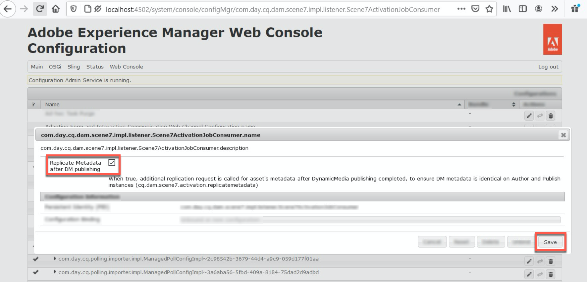

# Dynamic Media configureren - Scene7-modus{#configuring-dynamic-media-scene-mode}

Als u Adobe Experience Manager-configuratie gebruikt voor verschillende omgevingen, zoals ontwikkeling, staging en productie, configureert u Dynamic Media-Cloud Services voor elk van deze omgevingen.

## Architectuurdiagram van Dynamic Media - Scene7-modus {#architecture-diagram-of-dynamic-media-scene-mode}

In het volgende architectuurdiagram wordt beschreven hoe de modus Dynamic Media - Scene7 werkt.

Met de nieuwe architectuur is Experience Manager verantwoordelijk voor primaire bronactiva en synchrone met Dynamic Media voor activaverwerking en het publiceren:

1. Wanneer het primaire bronelement naar de Experience Manager wordt geüpload, wordt het naar Dynamic Media gerepliceerd. Op dat moment verwerkt Dynamic Media alle processen voor het genereren van elementen, zoals videocodering en dynamische varianten van een afbeelding. <!-- (In Dynamic Media - Scene7 mode, be aware that you can only upload assets whose file sizes are 2 GB or less.) Jira ticket CQ-4286561 fixed this issue. DM-S7 NOW SUPPORTS THE UPLOAD OF ASSETS LARGER THAN 2 GB. -->
1. Nadat de vertoningen worden geproduceerd, kan de Experience Manager tot de verre vertoningen van Dynamic Media veilig toegang hebben en voorproef (geen binaire getallen worden teruggestuurd naar de instantie van de Experience Manager).
1. Nadat de inhoud klaar is om te worden gepubliceerd en goedgekeurd, brengt het de dienst van Dynamic Media teweeg om inhoud uit te duwen naar leveringsservers en geheim voorgeheugeninhoud bij CDN (het Netwerk van de Levering van de Inhoud) in het voorgeheugen op.


>[!NOTE]
>
>Voor de volgende lijst met functies moet u de CDN uit de doos gebruiken die is gebundeld met Adobe Experience Manager - Dynamic Media. Een andere aangepaste CDN wordt niet ondersteund met deze functies.
>
>* [Smart Imaging](/help/assets/imaging-faq.md)
>* [Cache-validatie](/help/assets/invalidate-cdn-cache-dynamic-media.md)
>* [Hotlink-beveiliging](/help/assets/hotlink-protection.md)
>* [HTTP/2-levering van inhoud](/help/assets/http2.md)
>* URL omleiden op CDN-niveau
>* Akamai ChinaCDN (voor optimale levering in China)


## Dynamic Media inschakelen in Scene7-modus {#enabling-dynamic-media-in-scene-mode}

[Dynamische ](https://www.adobe.com/solutions/web-experience-management/dynamic-media.html) media is standaard uitgeschakeld. Als u gebruik wilt maken van Dynamic Media-functies, moet u deze inschakelen.

>[!NOTE]
>
>De modus Dynamic Media - Scene7 is alleen bedoeld voor de instantie Auteur van de Experience Manager. Als dusdanig, moet u `runmode=dynamicmedia_scene7` op de instantie van de Auteur van de Experience Manager vormen, *not* de instantie van de Publicatie van de Experience Manager.

Om Dynamic Media toe te laten, moet u Experience Manager beginnen gebruikend `dynamicmedia_scene7` looppas wijze van de bevellijn door het volgende in een eindvenster in te gaan (gebruikte voorbeeldhaven is 4502):

```shell
java -Xms4096m -Xmx4096m -Doak.queryLimitInMemory=500000 -Doak.queryLimitReads=500000 -jar cq-quickstart-6.5.0.jar -gui -r author,dynamicmedia_scene7 -p 4502
```

## (Optioneel) Dynamic Media-voorinstellingen en -configuraties migreren van 6.3 naar 6.5 Zero Downtime {#optional-migrating-dynamic-media-presets-and-configurations-from-to-zero-downtime}

De upgrade van Experience Manager Dynamic Media van 6.3 naar 6.4 of 6.5 omvat nu de mogelijkheid om geen downtime te implementeren. Als u al uw voorinstellingen en configuraties wilt migreren van `/etc` naar `/conf` in CRXDE Lite, moet u de volgende krullopdracht uitvoeren.

>[!NOTE]
>
>Als u de Experience Manager-instantie uitvoert in de compatibiliteitsmodus - u hebt dus het compatibiliteitspakket geïnstalleerd - hoeft u deze opdrachten niet uit te voeren.

Voor alle upgrades, met of zonder het compatibiliteitspakket, kunt u de standaard, out-of-box viewer vooraf instelt kopiëren die oorspronkelijk met Dynamic Media door het volgende Linux® krullbevel in werking te stellen kwam:

`curl -u admin:admin -X POST https://<server_address>:<server_port>/libs/settings/dam/dm/presets/viewer.pushviewerpresets.json`

Als u aangepaste viewervoorinstellingen en -configuraties die u hebt gemaakt van `/etc` naar `/conf` wilt migreren, voert u de volgende Linux® curl-opdracht uit:

`curl -u admin:admin -X POST https://<server_address>:<server_port>/libs/settings/dam/dm/presets.migratedmcontent.json`

## Installeren van functiepak 18912 voor het migreren van grote bedrijfsmiddelen {#installing-feature-pack-for-bulk-asset-migration}

De installatie van functiepak 18912 is *optioneel*.

Met Feature Pack 18912 kunt u middelen bulksgewijs invoeren via FTP, of elementen migreren van Dynamic Media - Hybride modus of Dynamic Media Classic naar Dynamic Media - Scene7 modus op Experience Manager. Het is beschikbaar bij [Adobe Professional Services](https://www.adobe.com/experience-cloud/consulting-services.html).

Zie [Actiepakket 18912 installeren voor migratie van grote hoeveelheden elementen](/help/assets/bulk-ingest-migrate.md) voor meer informatie.

## Dynamic Media-configuratie maken in Cloud Services {#configuring-dynamic-media-cloud-services}

**Voordat u Dynamic Media**  configureert- Nadat u uw instelgegevens via e-mail met Dynamic Media-referenties hebt ontvangen, moet u de Klassieke  [Dynamic Media-bureaubladtoepassing](https://experienceleague.adobe.com/docs/dynamic-media-classic/using/getting-started/signing-out.html#getting-started) openen en u aanmelden bij uw account om uw wachtwoord te wijzigen. Het wachtwoord dat in de e-mailprovisioning wordt ingevoerd, wordt door het systeem gegenereerd en is alleen bedoeld als tijdelijk wachtwoord. Het is belangrijk dat u het wachtwoord bijwerkt, zodat Dynamic Media Cloud Service de juiste referenties krijgt.


**Een Dynamic Media-configuratie maken in Cloud Services**

1. Tik in Experience Manager op het logo van de Experience Manager om toegang te krijgen tot de algemene navigatieconsole en tik op het pictogram Gereedschappen en tik vervolgens op **[!UICONTROL Cloud Services > Dynamic Media Configuration.]**
1. Tik op de pagina Configuratiebrowser voor dynamische media in het linkerdeelvenster op **[!UICONTROL global]** (tik niet op het mappictogram links van **[!UICONTROL global]** of selecteer dit niet) en tik vervolgens op **[!UICONTROL Create.]**
1. Voer op de pagina **[!UICONTROL Create Dynamic Media Configuration]** een titel in, het e-mailadres van de Dynamic Media-account, het wachtwoord en selecteer vervolgens uw regio. Deze informatie wordt u door Adobe in de levering-e-mail verstrekt. Neem contact op met de klantenservice van Adobe als u het e-mailbericht niet hebt ontvangen.

   Tik op **[!UICONTROL Connect to Dynamic Media.]**

   >[!NOTE]
   Nadat u uw provisioning-e-mail met Dynamic Media-referenties hebt ontvangen, opent u [Klassieke Dynamic Media-bureaubladtoepassing](https://experienceleague.adobe.com/docs/dynamic-media-classic/using/getting-started/signing-out.html#getting-started) en meldt u zich aan bij uw account om uw wachtwoord te wijzigen. Het wachtwoord dat in de e-mailprovisioning wordt ingevoerd, wordt door het systeem gegenereerd en is alleen bedoeld als tijdelijk wachtwoord. Het is belangrijk dat u het wachtwoord bijwerkt, zodat de Dynamic Media-Cloud Service de juiste referenties krijgt.

1. Wanneer de verbinding is gelukt, stelt u het volgende in. Koppen met een sterretje (*) zijn vereist:

   * **[!UICONTROL Company]** - de naam van de Dynamic Media-account. Je hebt meerdere Dynamic Media-accounts. U kunt bijvoorbeeld verschillende submerken, divisies, testomgevingen of productieomgevingen hebben.

   * **[!UICONTROL Company Root Folder Path]**

   * **[!UICONTROL Publishing Assets]** - U kunt uit de volgende drie opties kiezen:
      * **[!UICONTROL Immediately]** betekent dat wanneer elementen worden geüpload, het systeem de elementen opgeeft en de URL/Embed onmiddellijk levert. Er is geen tussenkomst van de gebruiker nodig om elementen te publiceren.
      * **[!UICONTROL Upon Activation]** betekent dat u het element eerst expliciet moet publiceren voordat er een URL/Embed-koppeling wordt opgegeven.<br><!-- CQDOC-17478, Added March 9, 2021-->Vanaf Experience Manager 6.5.8 weerspiegelt de instantie van de Publicatie van de Experience Manager nauwkeurige de meta-gegevenswaarden van Dynamic Media, zoals  `dam:scene7Domain` en  `dam:scene7FileStatus` in  **[!UICONTROL Upon Activation]** publicatiewijze slechts. Installeer Service Pack 8 en start vervolgens Experience Manager opnieuw om deze functionaliteit in te schakelen. Ga naar Sling Config Manager. Zoek de configuratie voor `Scene7ActivationJobConsumer Component` of creeer nieuwe). Schakel het selectievakje **[!UICONTROL Replicate Metadata after Dynamic Media publishing]** in en tik op **[!UICONTROL Save]**.

         

      * **[!UICONTROL Selective Publish]** Met deze optie kunt u bepalen welke mappen in Dynamic Media worden gepubliceerd. Hiermee kunt u functies gebruiken, zoals Slim uitsnijden of Dynamische uitvoeringen, of bepalen welke mappen uitsluitend in Experience Manager worden gepubliceerd voor voorvertoning. Dezelfde activa worden *niet* gepubliceerd in Dynamic Media voor levering in het publieke domein.<br>U kunt deze optie hier in de map instellen  **[!UICONTROL Dynamic Media Cloud Configuration]** of, als u dat wilt, u kunt deze optie instellen op mapniveau, in de map  **[!UICONTROL Properties]**.<br>Zie  [Werken met Selectieve publicatie in Dynamic Media.](/help/assets/selective-publishing.md)<br>Als u deze configuratie later wijzigt, of u wijzigt de configuratie later op mapniveau, hebben die wijzigingen alleen invloed op nieuwe elementen die u vanaf dat punt uploadt. De publicatiestatus van bestaande elementen in de map blijft ongewijzigd totdat u deze handmatig wijzigt vanuit **[!UICONTROL Quick Publish]** of het dialoogvenster **[!UICONTROL Manage Publication]**.
   * **[!UICONTROL Secure Preview Server]** - Hiermee kunt u het URL-pad naar de voorvertoningsserver voor veilige vertoningen opgeven. Met andere woorden, nadat uitvoeringen zijn gegenereerd, kan Experience Manager de externe Dynamic Media-uitvoeringen veilig openen en bekijken (er worden geen binaire bestanden teruggestuurd naar de instantie Experience Manager).
Tenzij u een speciale regeling hebt om de server van uw eigen bedrijf of een speciale server te gebruiken, adviseert Adobe dat u dit het plaatsen zoals gespecificeerd verlaat.

   * **[!UICONTROL Sync all content]** -  <!-- NEW OPTION, CQDOC-15371, Added March 4, 2020-->Standaard geselecteerd. Schakel deze optie uit als u elementen selectief wilt opnemen in of uitsluiten van de synchronisatie met Dynamic Media. Als u deze optie uitschakelt, kunt u kiezen uit de volgende twee Dynamic Media-synchronisatiemodi:

   * **[!UICONTROL Dynamic Media sync mode]**
      * **[!UICONTROL Enabled by default]** - De configuratie wordt standaard toegepast op alle mappen, tenzij u een map markeert die specifiek is bedoeld voor uitsluiting.  <!-- you can then deselect the folders that you do not want the configuration applied to.-->
      * **[!UICONTROL Disabled by default]** - De configuratie wordt pas op een map toegepast als u een geselecteerde map expliciet markeert voor synchronisatie met Dynamic Media.
Als u een geselecteerde map voor synchronisatie met Dynamic Media wilt markeren, selecteert u een elementmap en tikt u op **[!UICONTROL Properties]** op de werkbalk. Kies op het tabblad **[!UICONTROL Details]** in de vervolgkeuzelijst **[!UICONTROL Dynamic Media sync mode]** een van de volgende drie opties. Tik **[!UICONTROL Save.]** *Onthoud: Deze drie opties zijn niet beschikbaar als u **Alle inhoud synchroniseren**eerder hebt geselecteerd.* Zie ook  [Werken met Selectief publiceren op mapniveau in Dynamic Media.](/help/assets/selective-publishing.md)
         * **[!UICONTROL Inherited]** - Geen expliciete synchronisatiewaarde in de map; in plaats daarvan neemt de map de synchronisatiewaarde over van een van de bovenliggende mappen of de standaardmodus in de cloudconfiguratie. De gedetailleerde status voor overgeërfde presentaties wordt weergegeven als knopinfo.
         * **[!UICONTROL Enable for subfolders]** - Neem alles op in deze substructuur voor synchronisatie met Dynamic Media. De mapspecifieke instellingen overschrijven de standaardmodus in de cloudconfiguratie.
         * **[!UICONTROL Disabled for subfolders]** - Sluit alles in deze substructuur uit van synchroniseren naar Dynamic Media.

   >[!NOTE]
   Er is geen steun voor versioning in DMS7. Ook is de vertraagde activering slechts van toepassing als **[!UICONTROL Publish Assets]** op de pagina Configuratie van dynamische media bewerken is ingesteld op **[!UICONTROL Upon Activation]**, en dit alleen tot de eerste keer dat de asset wordt geactiveerd.
   Nadat een middel wordt geactiveerd, worden om het even welke updates onmiddellijk gepubliceerd live aan S7 Levering.

1. Tik op **[!UICONTROL Save.]**
1. Als u Dynamic Media-inhoud veilig wilt voorvertonen voordat deze wordt gepubliceerd, moet u de Experience Manager auteur-instantie &#39;lijsten van gewenste personen&#39; om verbinding te maken met Dynamic Media:

   * Open [Dynamic Media Classic desktop application](https://experienceleague.adobe.com/docs/dynamic-media-classic/using/getting-started/signing-out.html#getting-started) en meld u vervolgens aan bij uw account. Adobe heeft uw aanmeldingsgegevens en aanmeldingsgegevens op het moment van de levering verstrekt. Neem contact op met Technische ondersteuning als u deze informatie niet hebt.

   * Tik op **[!UICONTROL Setup > Application Setup > Publish Setup > Image Server]** op de navigatiebalk rechts boven aan de pagina.

   * Selecteer **[!UICONTROL Test Image Serving.]** in de vervolgkeuzelijst Publicatie-context op de pagina Publiceren afbeeldingsserver
   * Tik **[!UICONTROL Add.]** op voor het clientadresfilter
   * Schakel het selectievakje in om het adres in te schakelen. Ga het IP adres van de instantie van de Auteur van de Experience Manager (niet Verzender IP) in.
   * Tik op **[!UICONTROL Save.]**

U wordt nu gebeëindigd met de basisconfiguratie; U kunt de Dynamic Media - Scene7-modus gebruiken.

Als u uw configuratie verder wilt aanpassen, kunt u naar keuze om het even welke taken voltooien onder [ (Facultatief) het Vormen Geavanceerde Montages in Dynamic Media - Scene7 wijze](#optional-configuring-advanced-settings-in-dynamic-media-scene-mode).

## (Optioneel) Geavanceerde instellingen configureren in de modus Dynamic Media - Scene7 {#optional-configuring-advanced-settings-in-dynamic-media-scene-mode}

Als u de configuratie en opstelling van Dynamic Media - Scene7 wijze verder wilt aanpassen, of zijn prestaties optimaliseren, kunt u één of meerdere van de volgende *facultatieve* taken voltooien:

* [(Optioneel) Instellingen voor Dynamic Media - Scene7-modus instellen en configureren](#optional-setup-and-configuration-of-dynamic-media-scene7-mode-settings)

* [(Optioneel) De prestaties van de Dynamic Media-Scene7-modus afstemmen](#optional-tuning-the-performance-of-dynamic-media-scene-mode)

* [(Optioneel) Elementen filteren voor replicatie](#optional-filtering-assets-for-replication)

### (Optioneel) Instellingen {#optional-setup-and-configuration-of-dynamic-media-scene7-mode-settings} voor Dynamic Media - Scene7-modus instellen en configureren

In de uitvoermodus `dynamicmedia_scene7` wijzigt u de Dynamic Media-instellingen in de klassieke Dynamic Media-gebruikersinterface.

Voor sommige van de bovenstaande taken is het vereist dat u de [Klassieke Dynamic Media-bureaubladtoepassing](https://experienceleague.adobe.com/docs/dynamic-media-classic/using/getting-started/signing-out.html#getting-started) opent en zich vervolgens aanmeldt bij uw account.

De taken van de opstelling en van de configuratie omvatten het volgende:

* [Publicatie-instelling voor afbeeldingsserver](#publishing-setup-for-image-server)
* [Algemene instellingen van toepassing configureren](#configuring-application-general-settings)
* [Kleurbeheer configureren](#configuring-color-management)
* [MIME-typen bewerken voor ondersteunde indelingen](#editing-mime-types-for-supported-formats)
* [MIME-typen toevoegen voor niet-ondersteunde indelingen](#adding-mime-types-for-unsupported-formats)
* [Voorinstellingen voor batchsets maken om automatisch afbeeldingssets en centrifuges te genereren](#creating-batch-set-presets-to-auto-generate-image-sets-and-spin-sets)

#### Publicatie-instelling voor afbeeldingsserver {#publishing-setup-for-image-server}

De instellingen voor Publicatie-instellingen bepalen hoe elementen standaard worden geleverd door Dynamic Media. Als er geen instelling is opgegeven, levert Dynamic Media een element op basis van de standaardinstellingen die zijn gedefinieerd in Publicatie-instelling. Als u bijvoorbeeld een aanvraag indient om een afbeelding te leveren die geen resolutiekenmerk bevat, levert dit een afbeelding op met de standaardinstelling Objectresolutie.

Publicatie-instelling configureren: Tik in Dynamic Media Classic op **[!UICONTROL Setup > Application Setup > Publish Setup > Image Server]**.

Het scherm van de Server van het Beeld vestigt standaardmontages voor het leveren van beelden. Zie het scherm UI voor beschrijving van elke het plaatsen.

* **[!UICONTROL Request Attributes]** - Met deze instellingen worden limieten ingesteld voor afbeeldingen die van de server kunnen worden geleverd.
* **[!UICONTROL Default Request Attributes]** - Deze instellingen hebben betrekking op de standaardweergave van afbeeldingen.
* **[!UICONTROL Common Thumbnail Attributes]** - Deze instellingen hebben betrekking op de standaardweergave van miniatuurafbeeldingen.
* **[!UICONTROL Defaults for Catalog Fields]**- Deze instellingen hebben betrekking op de resolutie en het standaardtype miniatuur van afbeeldingen.
* **[!UICONTROL Color Management Attributes]** - Deze instellingen bepalen welke ICC-kleurprofielen worden gebruikt.
* **[!UICONTROL Compatibility Attributes]** - Met deze instelling kunnen alinea&#39;s met regelafstand en navolgende in tekstlagen op dezelfde manier worden behandeld als in versie 3.6, voor achterwaartse compatibiliteit.
* **[!UICONTROL Localization Support]** - Met deze instellingen kunt u meerdere kenmerken voor de landinstelling beheren. U kunt hiermee ook een landinstellingenkaarttekenreeks opgeven, zodat u kunt definiëren welke talen u wilt ondersteunen voor de verschillende knopinfo in Viewers. Zie [Overwegingen bij het instellen van lokalisatie van middelen](https://help.adobe.com/en_US/scene7/using/WS997f1dc4cb0179f034e07dc31412799d19a-8000.html) voor meer informatie over het instellen van **[Localisatie-ondersteuning]**.

#### Algemene instellingen van toepassing configureren {#configuring-application-general-settings}

Tik op **[!UICONTROL Setup > Application Setup > General Settings.]** om de pagina Algemene instellingen toepassing te openen in de klassieke algemene navigatiebalk van Dynamic Media

**Servers - **Voor rekeninglevering, verstrekt Dynamic Media automatisch de toegewezen servers voor uw bedrijf. Deze servers worden gebruikt om URL-tekenreeksen voor uw website en toepassingen samen te stellen. Deze URL-aanroepen gelden specifiek voor uw account. Wijzig geen van de servernamen, tenzij de klantenservice dit expliciet opgeeft.

**[!UICONTROL Overwrite Images]** - Dynamic Media staat niet toe dat twee bestanden dezelfde naam hebben. De URL-id van elk item (de bestandsnaam minus de extensie) moet uniek zijn. Met deze opties geeft u op hoe vervangende elementen worden geüpload: of zij het origineel vervangen of dupliceren. Dubbele elementen krijgen de naam &quot;-1&quot;. (De naam van bijvoorbeeld stoel.tif wordt gewijzigd in stoel-1.tif). Deze opties zijn van invloed op elementen die naar een andere map zijn geüpload dan het origineel of op elementen met een andere bestandsnaamextensie dan het origineel (zoals JPG, TIF of PNG).

* **[!UICONTROL Overwrite in current folder, same base image name/extension]** - Deze optie is de strengste regel voor vervanging. Hiervoor moet u de vervangende afbeelding uploaden naar dezelfde map als het origineel en moet de vervangende afbeelding dezelfde bestandsnaamextensie hebben als het origineel. Als niet aan deze vereisten wordt voldaan, wordt een dubbel gecreeerd.

>[!NOTE]
Kies altijd de volgende instelling om consistentie met de Experience Manager te behouden: **Overschrijven in huidige map, dezelfde naam/extensie voor basisafbeelding**

* **[!UICONTROL Overwrite in any folder, same base asset name/extension]** - Vereist dat de vervangende afbeelding dezelfde bestandsnaamextensie heeft als de oorspronkelijke afbeelding (bijvoorbeeld eigenschap.jpg moet de naam stoel.jpg vervangen, niet stoel.tif). U kunt de vervangende afbeelding echter naar een andere map uploaden dan het origineel. De bijgewerkte afbeelding staat in de nieuwe map; kan het bestand niet meer vinden op de oorspronkelijke locatie
* **[!UICONTROL Overwrite in any folder, same base asset name regardless of extension]** - Deze optie is de meest inclusieve vervangingsregel. U kunt een vervangende afbeelding uploaden naar een andere map dan het origineel, een bestand met een andere bestandsnaamextensie uploaden en het oorspronkelijke bestand vervangen. Als het oorspronkelijke bestand zich in een andere map bevindt, bevindt de vervangende afbeelding zich in de nieuwe map waarnaar het is geüpload.

**[!UICONTROL Default Color Profiles]** - Zie Kleurbeheer  [configureren ](#configuring-color-management) voor meer informatie.

>[!NOTE]
Standaard geeft het systeem 15 uitvoeringen weer wanneer u **[!UICONTROL Renditions]** en 15 viewervoorinstellingen selecteert wanneer u **[!UICONTROL Viewers]** in de gedetailleerde weergave van de asset selecteert. U kunt deze limiet verhogen. Zie [Het aantal voorinstellingen voor afbeeldingen dat wordt weergegeven, vergroten](/help/assets/managing-image-presets.md#increasing-or-decreasing-the-number-of-image-presets-that-display) of [Het aantal voorinstellingen voor viewers dat wordt weergegeven, vergroten](/help/assets/managing-viewer-presets.md#increasing-the-number-of-viewer-presets-that-display).


#### Kleurbeheer configureren {#configuring-color-management}

Met dynamisch kleurbeheer voor media kunt u correcte elementen kleuren. Met kleurcorrectie behouden ingesloten elementen hun kleurruimte (RGB, CMYK, Grijs) en ingesloten kleurprofiel. Wanneer u een dynamische uitvoering aanvraagt, wordt de afbeeldingskleur met CMYK-, RGB- of grijsuitvoer gecorrigeerd naar de doelkleurruimte. Zie [Voorinstellingen voor afbeeldingen configureren](/help/assets/managing-image-presets.md).

De standaardeigenschappen voor kleuren zo configureren dat kleurcorrectie wordt ingeschakeld wanneer afbeeldingen worden aangevraagd:

1. Open de [Dynamic Media Klassieke bureaubladtoepassing](https://experienceleague.adobe.com/docs/dynamic-media-classic/using/getting-started/signing-out.html#getting-started) en meld u vervolgens aan bij uw account met de aanmeldingsgegevens die tijdens de provisioning zijn opgegeven.
1. Ga naar **[!UICONTROL Setup > Application Setup.]**
1. Vouw het gebied **[!UICONTROL Publish Setup]** uit en selecteer **[!UICONTROL Image Server.]** **[!UICONTROL Publish Context]** instellen op **[!UICONTROL Image Serving]** bij het instellen van standaardinstellingen voor publicatie-instanties.
1. Blader naar de eigenschap die u wilt wijzigen. Een eigenschap in het gebied **[!UICONTROL Color Management Attributes]**.

   U kunt de volgende eigenschappen voor kleurcorrectie instellen:

   * **[!UICONTROL CMYK Default Color Space]** - Naam van het standaard CMYK-kleurprofiel
   * **[!UICONTROL Gray-Scale Default Color Space]** - Naam van het standaardgrijskleurprofiel
   * **[!UICONTROL RGB Default Color Space]** - Naam van het standaard RGB-kleurprofiel
   * **[!UICONTROL Color Conversion Rendering Intent]** - Geeft de render-intentie op. Acceptabele waarden zijn: **[!UICONTROL perceptual]**, **[!UICONTROL relative colometric]**, **[!UICONTROL saturation]**, **[!UICONTROL absolute colometric.]** Adobe raadt **[!UICONTROL relative]** als standaardwaarde aan.

1. Tik op **[!UICONTROL Save.]**

U kunt bijvoorbeeld **[!UICONTROL RGB Default Color Space]** instellen op *sRGB* en **[!UICONTROL CMYK Default Color Space]** op *WebCoated*.

Dit doet het volgende:

* Hiermee schakelt u kleurcorrectie in voor RGB- en CMYK-afbeeldingen.
* RGB-afbeeldingen zonder kleurprofiel worden verondersteld in de kleurruimte *sRGB* te staan.
* CMYK-afbeeldingen zonder kleurprofiel worden geacht zich in de kleurruimte *WebCoated* te bevinden.
* Dynamische uitvoeringen die RGB-uitvoer retourneren, retourneren deze in de kleurruimte *sRGB*.
* Dynamische uitvoeringen die CMYK-uitvoer retourneren, retourneren deze in de kleurruimte *WebCoated*.

#### MIME-typen bewerken voor ondersteunde indelingen {#editing-mime-types-for-supported-formats}

U kunt bepalen welke elementtypen door Dynamic Media worden verwerkt en geavanceerde parameters voor elementverwerking aanpassen. U kunt bijvoorbeeld parameters voor elementverwerking opgeven om het volgende te doen:

* Een Adobe PDF converteren naar een eCatalog-element.
* Converteer een Adobe Photoshop-document (.PSD) naar een bannersjabloonelement voor personalisatie.
* Rasteren een Adobe Illustrator-bestand (.AI) of een Adobe Photoshop Encapsulated PostScript® (.EPS).
* [U kunt videoprofielen ](/help/assets/video-profiles.md) en  [beeldbewerkingsprofielen ](/help/assets/image-profiles.md) gebruiken om respectievelijk de verwerking van video&#39;s en afbeeldingen te definiëren.

Zie [Elementen uploaden](/help/assets/manage-assets.md#uploading-assets).

**MIME-typen bewerken voor ondersteunde indelingen**

1. Tik in Experience Manager op het logo van de Experience Manager om toegang te krijgen tot de algemene navigatieconsole en tik op **[!UICONTROL Tools > General > CRXDE Lite.]**
1. Navigeer in de linkerspoorstaaf naar het volgende:

   `/conf/global/settings/cloudconfigs/dmscene7/jcr:content/mimeTypes`

   

1. Selecteer een mime-type onder de map mimeTypes.
1. Aan de rechterkant van de pagina CRXDE Lite, in het onderste gedeelte:

   * Dubbelklik op het veld **[!UICONTROL enabled]**. Standaard zijn alle elementtypen ingeschakeld (ingesteld op **[!UICONTROL true]**), wat betekent dat de elementen worden gesynchroniseerd met Dynamic Media voor verwerking. Als u wilt uitsluiten dat dit elementtype mime wordt verwerkt, wijzigt u deze instelling in **[!UICONTROL false.]**

   * dubbeltikken **[!UICONTROL jobParam]** om het bijbehorende tekstveld te openen. Zie [Ondersteunde MIME-typen](/help/assets/assets-formats.md#supported-mime-types) voor een lijst met toegestane waarden voor de verwerkingsparameters die u voor een bepaald mime-type kunt gebruiken.

1. Voer een van de volgende handelingen uit:

   * Herhaal stap 3-4 om meer MIME-typen te bewerken.
   * Tik op **[!UICONTROL Save All.]** op de menubalk van de pagina CRXDE Lite

1. Tik in de linkerbovenhoek van de pagina op **[!UICONTROL CRXDE Lite]** om terug te keren naar de Experience Manager.

#### MIME-typen toevoegen voor niet-ondersteunde indelingen {#adding-mime-types-for-unsupported-formats}

U kunt aangepaste MIME-typen toevoegen voor niet-ondersteunde indelingen in Experience Manager Assets. Zorg ervoor dat om het even welke nieuwe knoop u in CRXDE Lite toevoegt niet door Experience Manager wordt geschrapt door het MIME type vóór `image_` te bewegen. Zorg er ook voor dat de ingeschakelde waarde is ingesteld op **[!UICONTROL false.]**

**MIME-typen toevoegen voor niet-ondersteunde indelingen**

1. Tik vanuit Experience Manager op **[!UICONTROL Tools > Operations > Web Console.]**

   

1. Er wordt een nieuw browsertabblad geopend voor de pagina **[!UICONTROL Adobe Experience Manager Web Console Configuration]**.

   

1. Schuif op de pagina omlaag naar de naam *Adobe CQ Scene7 Asset MIME type Service*, zoals u in de volgende schermafbeelding ziet. Tik rechts van de naam op **[!UICONTROL Edit the configuration values]** (potloodpictogram).

   

1. Tik op de pagina **Adobe CQ Scene7 Asset MIME type Service** op een plusteken &lt;+>. De locatie in de tabel waar u op het plusteken tikt om het nieuwe mime-type toe te voegen, is triviaal.

   

1. Typ `DWG=image/vnd.dwg` in het lege tekstveld dat u zojuist hebt toegevoegd.

   Het voorbeeld `DWG=image/vnd.dwg` is alleen ter illustratie. Het MIME-type dat u hier toevoegt, kan elke andere niet-ondersteunde indeling hebben.

   

1. Tik in de rechterbenedenhoek van de pagina op **[!UICONTROL Save.]**

   Op dit punt kunt u het browsertabblad sluiten waarop de pagina Configuratie Adobe Experience Manager-webconsole is geopend.

1. Keer terug naar het browser lusje dat uw open console van de Experience Manager heeft.
1. Tik vanuit Experience Manager op **[!UICONTROL Tools > General > CRXDE Lite.]**

   

1. Navigeer in de linkerspoorstaaf naar het volgende:

   `conf/global/settings/cloudconfigs/dmscene7/jcr:content/mimeTypes`

1. Sleep het mime-type `image_vnd.dwg` en zet het direct boven `image_` in de structuur neer, zoals in de volgende schermafbeelding wordt getoond.

   

1. Terwijl het mime-type `image_vnd.dwg` nog steeds is geselecteerd, tikt u op het tabblad **[!UICONTROL Properties]** in de rij **[!UICONTROL enabled]** onder de kolomkop **[!UICONTROL Value]** op de waarde om de vervolgkeuzelijst **[!UICONTROL Value]** te openen.
1. Typ `false` in het veld (of selecteer **[!UICONTROL false]** in de vervolgkeuzelijst).

   

1. Tik in de linkerbovenhoek van de pagina CRXDE Lite op **[!UICONTROL Save All.]**

#### Voorinstellingen voor batchsets maken om automatisch afbeeldingssets en centrifuges {#creating-batch-set-presets-to-auto-generate-image-sets-and-spin-sets} te genereren

Met voorinstellingen voor batchsets kunt u het maken van afbeeldingssets of centrifuges automatiseren terwijl elementen naar Dynamic Media worden geüpload.

Bepaal eerst de naamgevingsconventie voor de manier waarop elementen in een set worden gegroepeerd. Maak vervolgens een voorinstelling voor een batchset die een unieke, zelfstandige set instructies is. In deze code moet worden gedefinieerd hoe de set wordt samengesteld met behulp van afbeeldingen die overeenkomen met de gedefinieerde naamgevingsconventies in het vooraf ingestelde recept.

Wanneer u bestanden uploadt, maakt Dynamic Media automatisch een set met alle bestanden die overeenkomen met de gedefinieerde naamgevingsconventie in de actieve voorinstellingen.

**Standaardnaamgeving configureren**

Een standaardnaamgevingsconventie maken die wordt gebruikt in een willekeurig recept voor een voorinstelling voor batchverwerking. De standaardnaamgevingsconventie die is geselecteerd in de definitie van de voorinstelling voor batch-sets is waarschijnlijk alles wat uw bedrijf nodig heeft om sets te genereren in batch. Er wordt een voorinstelling voor een batchset gemaakt waarin de standaardnaamgevingsconventie wordt gebruikt die u definieert. U kunt zo veel voorinstellingen Batch-set maken met alternatieve, aangepaste naamconventies die nodig zijn voor een bepaalde set inhoud als er een uitzondering is op de standaardnaamgeving die door het bedrijf is gedefinieerd.

Als u een standaardnaamgevingsconventie wilt instellen, is het niet nodig vooraf ingestelde batchvoorinstellingen te gebruiken, maar de standaardnaamgevingsconventie kunt u het beste gebruiken. Hiermee kunt u zoveel elementen van uw naamgevingsconventie definiëren als u in een set wilt groeperen, zodat u het maken van batchsets kunt stroomlijnen.

Als alternatief kunt u **[!UICONTROL View Code]** gebruiken als er geen formuliervelden beschikbaar zijn. In deze weergave maakt u uw definities van de naamgevingsconventie volledig met behulp van reguliere expressies.

Er zijn twee elementen beschikbaar voor definitie, Identieke en Basisnaam. Met deze velden kunt u alle elementen van een naamgevingsconventie definiëren en het gedeelte van de conventie identificeren dat wordt gebruikt voor de naamgeving van de set waarin deze elementen zich bevinden. De individuele noemende overeenkomst van een bedrijf gebruikt vaak één of meerdere lijnen van definitie voor elk van deze elementen. U kunt zo vele lijnen voor uw unieke definitie gebruiken en hen groeperen in verschillende elementen, zoals voor HoofdBeeld, het element van de Kleur, het element van de Afwisselende Mening, en het element van het Monster.

**Standaardnaamgeving configureren**

1. Open [Dynamic Media Classic desktop application](https://experienceleague.adobe.com/docs/dynamic-media-classic/using/getting-started/signing-out.html#getting-started) en meld u vervolgens aan bij uw account.

   Adobe heeft uw aanmeldingsgegevens en aanmeldingsgegevens op het moment van de levering verstrekt. Neem contact op met Technische ondersteuning als u deze informatie niet hebt.

1. Tik op **[!UICONTROL Setup > Application Setup > Batch Set Presets > Default Naming.]** op de navigatiebalk boven aan de pagina
1. Selecteer **[!UICONTROL View Form]** of **[!UICONTROL View Code]** om op te geven hoe u informatie over elke asset wilt weergeven en invoeren.

   U kunt het selectievakje **[!UICONTROL View Code]** inschakelen om de waarde van de reguliere expressie naast de formulierselecties weer te geven. U kunt deze waarden invoeren of wijzigen om de elementen van de naamgevingsconventie te definiëren, als de formulierweergave u beperkt om welke reden dan ook. Als uw waarden niet kunnen worden geparseerd in de formulierweergave, worden de formuliervelden inactief.

   >[!NOTE]
   Door-geactiveerde formuliervelden wordt niet gevalideerd dat de reguliere expressies juist zijn. U ziet de resultaten van de reguliere expressie die u bouwt voor elk element na de resultaatregel. De volledige reguliere expressie wordt onder aan de pagina weergegeven.

1. Vouw indien nodig elk element uit en voer de naamgevingsconventies in die u wilt gebruiken.
1. Voer zo nodig een van de volgende handelingen uit:

   * Tik **[!UICONTROL Add]** om een andere naamgevingsconventie voor een element toe te voegen.
   * Tik **[!UICONTROL Remove]** om een naamgevingsconventie voor een element te verwijderen.

1. Voer een van de volgende handelingen uit:

   * Tik op **[!UICONTROL Save As]** en typ een naam voor de voorinstelling.
   * Tik **[!UICONTROL Save]** als u een bestaande voorinstelling bewerkt.

**Een voorinstelling voor een batchset maken**

Dynamic Media gebruikt voorinstellingen voor batchsets om elementen te ordenen in sets afbeeldingen (alternatieve afbeeldingen, kleuropties, 360 centrifugeren) die kunnen worden weergegeven in viewers. De voorinstellingen voor batchsets worden automatisch naast de processen voor het uploaden van elementen in Dynamic Media uitgevoerd.

U kunt uw voorinstellingen voor batchsets maken, bewerken en beheren. Er zijn twee vormen van vooraf ingestelde batch-definities: een voor een standaardnaamgevingsconventie die u kunt instellen en een conventie voor aangepaste naamgevingsconventies die u direct maakt.

U kunt de methode voor formuliervelden gebruiken om een voorinstelling voor een batchset te definiëren of de methode voor code, waarmee u reguliere expressies kunt gebruiken. Net als bij Standaardnaam kunt u de optie Code weergeven kiezen terwijl u de definitie in de formulierweergave definieert en reguliere expressies gebruiken om uw definities samen te stellen. U kunt ook de optie voor het uitsluitend gebruiken van de ene weergave of de andere uitschakelen.

**Een voorinstelling voor een batch-set maken**

1. Open [Dynamic Media Classic desktop application](https://experienceleague.adobe.com/docs/dynamic-media-classic/using/getting-started/signing-out.html#getting-started) en meld u vervolgens aan bij uw account.

   Adobe heeft uw aanmeldingsgegevens en aanmeldingsgegevens op het moment van de levering verstrekt. Neem contact op met Technische ondersteuning als u deze informatie niet hebt.

1. Tik op **[!UICONTROL Setup > Application Setup > Batch Set Presets > Batch Set Preset.]** op de navigatiebalk boven aan de pagina

   **[!UICONTROL View Form]**, zoals ingesteld in de rechterbovenhoek van de pagina Details, is de standaardweergave.

1. Tik in het deelvenster Lijst met voorinstellingen op **[!UICONTROL Add]** om de definitievelden te activeren in het deelvenster Details aan de rechterkant van het scherm.
1. Typ in het veld Naam voorinstelling in het deelvenster Details een naam voor de voorinstelling.
1. Selecteer een type voorinstelling in het keuzemenu Type batch.
1. Voer een van de volgende handelingen uit:

   * Als u een standaardnaamgevingsconventie gebruikt die u eerder hebt ingesteld onder **[!UICONTROL Application Setup > Batch Set Presets > Default Naming]**, vouwt u **[!UICONTROL Asset Naming Conventions]** uit en tikt u vervolgens in de vervolgkeuzelijst Bestandsnaamgeving op **[!UICONTROL Default.]**

   * Als u een nieuwe naamgevingsconventie wilt definiëren terwijl u de voorinstelling instelt, vouwt u **[!UICONTROL Asset Naming Conventions]** uit en tikt u vervolgens in de vervolgkeuzelijst Bestandsnaamgeving op **[!UICONTROL Custom.]**

1. Definieer bij Volgorde de volgorde waarin de afbeeldingen worden weergegeven nadat de set in Dynamic Media is gegroepeerd.

   Uw elementen worden standaard alfanumeriek geordend. U kunt echter een door komma&#39;s gescheiden lijst met reguliere expressies gebruiken om de volgorde te definiëren.

1. Geef bij Naamgeving instellen en Creatieconcept het achtervoegsel of het voorvoegsel op van de basisnaam die u in de Naamgevingsconventie voor middelen hebt gedefinieerd. Definieer ook waar de set wordt gemaakt in de Dynamic Media-mapstructuur.

   Als u grote aantallen sets definieert, moet u de sets gescheiden houden van de mappen die de elementen zelf bevatten. Maak bijvoorbeeld een map met afbeeldingssets en plaats hier gegenereerde sets.

1. Tik in het venster Details op **[!UICONTROL Save.]**
1. Tik **[!UICONTROL Active]** naast de naam van de nieuwe voorinstelling.

   Als u de voorinstelling activeert, weet u zeker dat wanneer u elementen uploadt naar Dynamic Media, de voorinstelling van de batch-set wordt toegepast om de set te genereren.

**Een voorinstelling voor een batch-set maken voor het automatisch genereren van een 2D-centrifugeset**

U kunt het Type van Reeks van de Partij **[!UICONTROL Multi-Axis Spin Set]** gebruiken om een recept tot stand te brengen dat de generatie van 2D Reeksen van de Rotatie automatiseert. Bij het groeperen van afbeeldingen worden de reguliere expressies Rij en Kolom gebruikt, zodat de afbeeldingselementen op de juiste wijze worden uitgelijnd op de corresponderende locatie in de multidimensionale array. Er is geen minimum- of maximumaantal rijen of kolommen dat u in een centrifugeerset moet hebben.

Stel dat u bijvoorbeeld een centrifugeset met meerdere assen wilt maken met de naam `spin-2dspin`. U hebt een set afbeeldingen met een set centrifuges die drie rijen bevatten, met 12 afbeeldingen per rij. De afbeeldingen krijgen de volgende naam:

```
spin-01-01
 spin-01-02
 …
 spin-01-12
 spin-02-01
 …
 spin-03-12
```

Met deze informatie kunt u het recept voor Type batch-set als volgt maken:


De groepering voor het gedeelde element naamdeel van de spinset wordt toegevoegd aan het **Match** gebied (zoals benadrukt). Het variabele gedeelte van de naam van de asset met de rij en kolom wordt toegevoegd aan respectievelijk de velden **Rij** en **Kolom**.

Wanneer de spinset wordt geüpload en gepubliceerd, activeert u de naam van het recept voor de 2D-spinset die wordt vermeld onder **Voorinstellingen voor batchsets** in het dialoogvenster **Taakopties uploaden**.

**Een voorinstelling voor een batch-set maken voor het automatisch genereren van een 2D-reeks met draaien**

1. Open [Dynamic Media Classic desktop application](https://experienceleague.adobe.com/docs/dynamic-media-classic/using/getting-started/signing-out.html#getting-started) en meld u vervolgens aan bij uw account.

   Adobe heeft uw aanmeldingsgegevens en aanmeldingsgegevens op het moment van de levering verstrekt. Neem contact op met Technische ondersteuning als u deze informatie niet hebt.

1. Tik op de navigatiebalk boven aan de pagina op **[!UICONTROL Setup]> [!UICONTROL Application Setup] > [!UICONTROL Batch Set Presets] >[!UICONTROL Batch Set Preset]**.

   **[!UICONTROL View Form]**, zoals ingesteld in de rechterbovenhoek van de pagina Details, is de standaardweergave.

1. Tik in het deelvenster Lijst met voorinstellingen op **[!UICONTROL Add]** om de definitievelden te activeren in het deelvenster Details aan de rechterkant van het scherm.
1. Typ in het veld Naam voorinstelling in het deelvenster Details een naam voor de voorinstelling.
1. Selecteer in het vervolgkeuzemenu Batchsettype de optie **[!UICONTROL Asset Set.]**
1. Selecteer **[!UICONTROL Multi-Axis Spin Set.]** in de vervolgkeuzelijst Subtype
1. **[!UICONTROL Asset Naming Conventions]** uitvouwen en vervolgens in de vervolgkeuzelijst Bestandsnaamgeving tikken op **[!UICONTROL Custom.]**
1. Gebruik de kenmerken **[!UICONTROL Match]** en (optioneel) **[!UICONTROL Base Name]** om een reguliere expressie te definiëren voor de naamgeving van afbeeldingsassets waaruit de groepering bestaat.

   De reguliere expressie Letterlijke overeenkomst kan er bijvoorbeeld als volgt uitzien:

   `(w+)-w+-w+`

1. Vouw **[!UICONTROL Row Column Position]** uit en definieer vervolgens de naamnotatie voor de positie van het afbeeldingselement binnen de 2D-array met spellingsets.

   Gebruik het haakje om de rij- of kolompositie in de bestandsnaam in te sluiten.

   Voor uw reguliere rijexpressie kan deze er bijvoorbeeld als volgt uitzien:

   `\w+-R([0-9]+)-\w+`

   or

   `\w+-(\d+)-\w+`

   Voor de reguliere kolomexpressie kan deze er als volgt uitzien:

   `\w+-\w+-C([0-9]+)`

   of

   `\w+-\w+-C(\d+)`

   Bovenstaande voorbeelden dienen slechts ter illustratie. U kunt uw reguliere expressie maken op een manier die aan uw wensen voldoet.

   >[!NOTE]
   Als de combinatie van de reguliere rij- en kolomexpressies de positie van het element binnen de multidimensionale spin-set-array niet kan bepalen, wordt het element niet aan de set toegevoegd. Er wordt ook een fout geregistreerd.

1. Geef bij Naamgeving instellen en Creatieconcept het achtervoegsel of het voorvoegsel op van de basisnaam die u in de Naamgevingsconventie voor middelen hebt gedefinieerd.

   Bepaal ook waar de centrifugeset wordt gemaakt in de Classic-mapstructuur van Dynamic Media.

   Als u grote aantallen sets definieert, moet u de sets gescheiden houden van de mappen die de elementen zelf bevatten. Maak bijvoorbeeld een map met centrifugesets om gegenereerde sets hier te plaatsen.

1. Tik in het venster Details op **[!UICONTROL Save.]**
1. Tik **[!UICONTROL Active]** naast de naam van de nieuwe voorinstelling.

   Als u de voorinstelling activeert, weet u zeker dat wanneer u elementen uploadt naar Dynamic Media, de voorinstelling van de batch-set wordt toegepast om de set te genereren.

### (Optioneel) De prestaties van de Dynamic Media - Scene7-modus afstemmen {#optional-tuning-the-performance-of-dynamic-media-scene-mode}

Om de Dynamic Media - Scene7-modus vlot te laten werken, raadt Adobe de volgende tips voor synchronisatieprestaties/schaalbaarheid aan:

* De vooraf gedefinieerde taakparameters bijwerken voor het verwerken van verschillende bestandsindelingen.
* Het bijwerken van de vooraf gedefinieerde Granite-workflow (video-elementen) vormt een wachtrij voor arbeidersthreads.
* Het bijwerken van de vooraf gedefinieerde tijdelijke Granite-workflow (afbeeldingen en niet-video-elementen) vormt een wachtrij voor arbeidersthreads.
* De maximale uploadverbindingen naar de Dynamic Media Classic-server bijwerken.

#### De vooraf gedefinieerde taakparameters bijwerken voor de verwerking van verschillende bestandsindelingen

U kunt taakparameters instellen voor snellere verwerking wanneer u bestanden uploadt. Als u bijvoorbeeld PSD-bestanden uploadt, maar deze niet als sjablonen wilt verwerken, kunt u de uitname van lagen instellen op false (uitgeschakeld). In dat geval ziet de aangepaste taakparameter er als volgt uit: `process=None&createTemplate=false`.

Gebruik de volgende parameters als u sjabloonontwerp wilt inschakelen: `process=MaintainLayers&layerNaming=AppendName&createTemplate=true`.

<!-- REMOVED BASED ON CQDOC-17657 You can tune job parameters for faster processing when you upload files. For example, if you are uploading PSD files, but do not want to process them as templates, you can set layer extraction to false (off). In such case, the tuned job parameter would appear as `process=None&createTemplate=false`. -->

Adobe raadt u aan de volgende taakparameters voor PDF-, PostScript®- en PSD-bestanden te gebruiken:

<!-- OLD PDF JOB PARAMETERS `pdfprocess=Rasterize&resolution=150&colorspace=Auto&pdfbrochure=false&keywords=false&links=false` -->

<!-- OLD POSTSCRIPT JOB PARAMETERS `psprocess=Rasterize&psresolution=150&pscolorspace=Auto&psalpha=false&psextractsearchwords=false&aiprocess=Rasterize&airesolution=150&aicolorspace=Auto&aialpha=false` -->

| Bestandstype | Aanbevolen taakparameters |
| ---| ---|
| PDF | `pdfprocess=Thumbnail&resolution=150&colorspace=Auto&pdfbrochure=false&keywords=false&links=false` |
| PostScript® | `psprocess=Rasterize&psresolution=150&pscolorspace=Auto&psalpha=false&psextractsearchwords=false&aiprocess=Thumbnail&airesolution=150&aicolorspace=Auto&aialpha=false` |
| PSD | `process=None&layerNaming=AppendName&anchor=Center&createTemplate=false&extractText=false&extendLayers=false` |

<!-- CQDOC-17657 for PSD entry in table above -->

Als u een van deze parameters wilt bijwerken, volgt u de stappen in [Ondersteuning voor Classic uploadtaakparameter voor MIME-elementen/Dynamic Media Classic-uploads](/help/sites-administering/scene7.md#enabling-mime-type-based-assets-scene-upload-job-parameter-support).

#### De voorlopige wachtrij van Granite-workflows bijwerken {#updating-the-granite-transient-workflow-queue}

De Granite Transit Workflow-wachtrij wordt gebruikt voor de **[!UICONTROL DAM Update Asset]**-workflow. In Dynamic Media wordt het gebruikt voor het opnemen en verwerken van afbeeldingen.

**De voorlopige wachtrij van Granite bijwerken**

1. Navigeer naar [https://&lt;server>/system/console/configMgr](https://localhost:4502/system/console/configMgr) en zoek naar **Wachtrij: Granite Transient Workflow Queue**.

   >[!NOTE]
   Een tekstonderzoek is noodzakelijk in plaats van een directe URL omdat OSGi PID dynamisch wordt geproduceerd.

1. Wijzig in het veld **[!UICONTROL Maximum Parallel Jobs]** het getal in de gewenste waarde.

   U kunt **[!UICONTROL Maximum Parallel Jobs]** verhogen om voldoende ondersteuning te bieden voor het zwaar uploaden van bestanden naar Dynamic Media. De exacte waarde is afhankelijk van de hardwarecapaciteit. In bepaalde scenario&#39;s - dat wil zeggen een eerste migratie of een eenmalige bulkupload - kunt u een grote waarde gebruiken. Houd er echter rekening mee dat het gebruik van een grote waarde (bijvoorbeeld twee keer het aantal cores) negatieve gevolgen kan hebben voor andere gelijktijdige activiteiten. Als dusdanig, test en pas de waarde aan die op uw bepaald gebruiksgeval wordt gebaseerd.

<!--    By default, the maximum number of parallel jobs depends on the number of available CPU cores. For example, on a 4-core server, it assigns 2 worker threads. (A value between 0.0 and 1.0 is ratio based, or any numbers greater than 1 will assign the number of worker threads.)

   Adobe recommends that 32 **[!UICONTROL Maximum Parallel Jobs]** be configured to adequately support heavy upload of files to Dynamic Media Classic (Scene7). -->


1. Tik op **[!UICONTROL Save.]**

#### De Granite-workflowwachtrij bijwerken {#updating-the-granite-workflow-queue}

De Granite Workflow-wachtrij wordt gebruikt voor niet-tijdelijke workflows. In Dynamic Media werd video verwerkt met de **[!UICONTROL Dynamic Media Encode Video]**-workflow.

**De Granite-werkstroomwachtrij bijwerken**

1. Navigeer naar `https://<server>/system/console/configMgr` en zoek naar **Wachtrij: Gerichte werkstroom Wachtrij**.

   >[!NOTE]
   Een tekstonderzoek is noodzakelijk in plaats van een directe URL omdat OSGi PID dynamisch wordt geproduceerd.

1. Wijzig in het veld **[!UICONTROL Maximum Parallel Jobs]** het getal in de gewenste waarde.

   U kunt de functie Maximum aantal parallelle taken verhogen om voldoende ondersteuning te bieden voor het zwaar uploaden van bestanden naar Dynamic Media. De exacte waarde is afhankelijk van de hardwarecapaciteit. In bepaalde scenario&#39;s - dat wil zeggen een eerste migratie of een eenmalige bulkupload - kunt u een grote waarde gebruiken. Houd er echter rekening mee dat het gebruik van een grote waarde (bijvoorbeeld twee keer het aantal cores) negatieve gevolgen kan hebben voor andere gelijktijdige activiteiten. Als dusdanig, test en pas de waarde aan die op uw bepaald gebruiksgeval wordt gebaseerd.

   

1. Tik op **[!UICONTROL Save.]**

#### De Dynamic Media Classic-uploadverbinding {#updating-the-scene-upload-connection} bijwerken

Met de instelling Scene7 Upload Connection synchroniseert u Experience Manager-elementen met Dynamic Media Classic-servers.

**De Dynamic Media Classic-uploadverbinding bijwerken**

1. Ga naar `https://<server>/system/console/configMgr/com.day.cq.dam.scene7.impl.Scene7UploadServiceImpl`
1. Wijzig desgewenst het getal in het veld **[!UICONTROL Number of connections]** en/of het veld **[!UICONTROL Active job timeout]**.

   Met de instelling **[!UICONTROL Number of connections]** bepaalt u het maximum aantal HTTP-verbindingen dat is toegestaan voor Experience Manager naar Dynamic Media-upload. doorgaans is de vooraf gedefinieerde waarde van tien verbindingen voldoende .

   Met de instelling **[!UICONTROL Active job timeout]** bepaalt u de wachttijd voordat geüploade Dynamic Media-elementen worden gepubliceerd op de leveringsserver. Deze waarde is standaard 2100 seconden of 35 minuten.

   In de meeste gevallen is de instelling 2100 voldoende.

   

1. Tik op **[!UICONTROL Save.]**

### (Optioneel) Elementen filteren voor replicatie {#optional-filtering-assets-for-replication}

Bij niet-Dynamic Media-implementaties repliceert u *all* middelen (zowel afbeeldingen als video) van de ontwerpomgeving van de Experience Manager naar het knooppunt Publiceren van de Experience Manager. Deze workflow is nodig omdat de Experience Manager Publish-servers ook de elementen leveren.

In Dynamic Media-implementaties is het echter niet nodig dezelfde middelen te repliceren naar publicatieknooppunten van Experience Managers, omdat elementen via de Cloud Service worden geleverd. Zo voorkomt u extra opslagkosten en langere verwerkingstijden om elementen te repliceren. Andere inhoud, zoals sitepagina&#39;s, wordt nog steeds aangeboden vanaf de publicatieknooppunten van de Experience Manager.

De filters verstrekken een manier voor u om *activa* uit te sluiten van worden herhaald aan de Experience Manager publicatieknooppunt.

#### Standaardelementfilters gebruiken voor replicatie {#using-default-asset-filters-for-replication}

Als u Dynamic Media gebruikt voor beeldbewerking, video of beide, kunt u de standaardfilters gebruiken die Adobe ongewijzigd biedt. De volgende filters zijn standaard actief:

<table>
 <tbody>
  <tr>
   <td> </td>
   <td><strong>Filter</strong></td>
   <td><strong>MIME-type</strong></td>
   <td><strong>Uitvoeringen</strong></td>
  </tr>
  <tr>
   <td>Afbeeldingslevering Dynamic Media</td>
   <td><p>filterafbeeldingen</p> <p>filtersets</p> <p> </p> </td>
   <td><p>Begint met <strong>image/</strong></p> <p>Bevat <strong>application/</strong> en eindigt met <strong>set</strong>.</p> </td>
   <td>De 'filter-images' die buiten het vak (voor afzonderlijke afbeeldingselementen, inclusief interactieve afbeeldingen) en 'filtersets' (voor centrifuges, afbeeldingssets, gemengde mediasets en Carousel-sets) worden gebruikt, zijn:
    <ul>
     <li>Sluit de oorspronkelijke afbeelding en statische afbeeldingsuitvoeringen uit van replicatie.</li>
    </ul> </td>
  </tr>
  <tr>
   <td>Dynamic Media Video Delivery</td>
   <td>filter-video</td>
   <td>Begint met <strong>video/</strong></td>
   <td>De uit-van-de-doos "filter-video"zal:
    <ul>
     <li>Sluit de originele video en statische miniatuuruitvoeringen uit van replicatie.<br /> <br /> </li>
    </ul> </td>
  </tr>
 </tbody>
</table>

>[!NOTE]
Filters zijn van toepassing op MIME-typen en kunnen geen padspecifieke notatie hebben.

#### Elementfilters aanpassen voor replicatie {#customizing-asset-filters-for-replication}

1. Tik in Experience Manager op het logo van de Experience Manager om toegang te krijgen tot de algemene navigatieconsole en tik op **[!UICONTROL Tools > General > CRXDE Lite.]**
1. Navigeer in de linkermapstructuur naar `/etc/replication/agents.author/publish/jcr:content/damRenditionFilters` om de filters te bekijken.

   

1. Als u het Mime-type voor het filter wilt definiëren, gaat u als volgt naar het Mime-type:

   Vouw `content > dam > <locate_your_asset> > jcr:content > metadata` in de linkerrails uit en zoek `dc:format` in de tabel.

   De volgende afbeelding is een voorbeeld van het pad van een element naar `dc:format`.

   

   De `dc:format` voor het element `Fiji Red.jpg` is `image/jpeg`.

   Als u dit filter wilt toepassen op alle afbeeldingen, ongeacht de indeling, stelt u de waarde in op `image/*`, waarbij `*` een reguliere expressie is die wordt toegepast op alle afbeeldingen in een willekeurige indeling.

   Als u het filter alleen wilt toepassen op afbeeldingen van het type JPEG, voert u de waarde `image/jpeg` in.

1. Bepaal welke uitvoeringen u van replicatie wilt omvatten of uitsluiten.

   U kunt onder andere de volgende tekens gebruiken om te filteren voor replicatie:

<table>
 <tbody>
  <tr>
   <td><strong>Te gebruiken teken</strong></td>
   <td><strong>Hoe het activa voor replicatie filtreert</strong></td>
  </tr>
  <tr>
   <td>*</td>
   <td>Jokerteken<br /> </td>
  </tr>
  <tr>
   <td>+</td>
   <td>Omvat activa voor replicatie.</td>
  </tr>
  <tr>
   <td>-</td>
   <td>Sluit elementen van replicatie uit.</td>
  </tr>
 </tbody>
</table>

Ga naar `content/dam/<locate your asset>/jcr:content/renditions`.

De volgende afbeelding is een voorbeeld van de uitvoeringen van een element.


Als u slechts origineel wilde herhalen, dan zou u `+original` ingaan.

