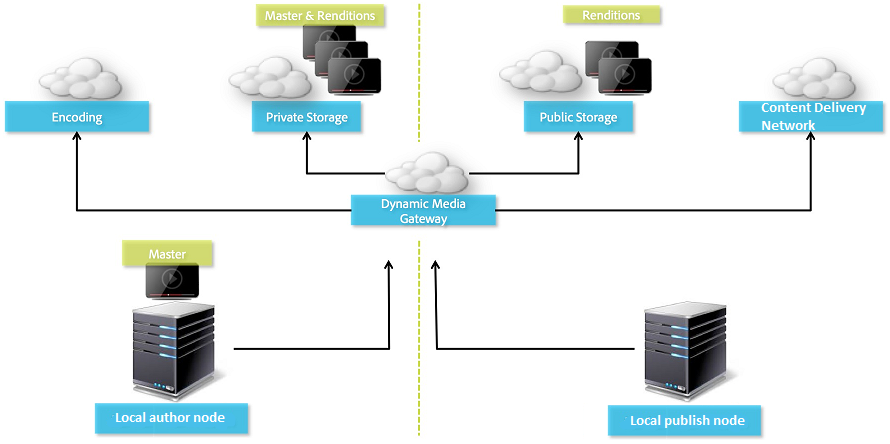

# Dynamische media configureren - hybride modus {#configuring-dynamic-media-hybrid-mode}

De dynamische media-Hybride moet voor gebruik worden toegelaten en worden gevormd. Afhankelijk van uw gebruiksgeval, heeft de Dynamische Media verscheidene [gesteunde configuraties](#supported-dynamic-media-configurations).

>[!NOTE]
>
>Zie [Dynamische media configureren - Scene7-modus](/help/assets/config-dms7.md) als u dynamische media wilt configureren en uitvoeren in de Scene7-uitvoeringsmodus.
>
>Als u van plan bent om Dynamische Media in hybride looppaswijze te vormen en in werking te stellen, volg de instructies op deze pagina.

Meer informatie over het werken met [video](/help/assets/video.md) in Dynamische media.

>[!NOTE]
>
>Als u Adobe Experience Manager-instellingen gebruikt voor verschillende omgevingen, zoals een voor ontwikkeling, een voor staging en een voor live productie, moet u Dynamic Media-Cloud Services configureren voor elk van deze omgevingen.

>[!NOTE]
>
>Als er problemen optreden met de dynamische mediaconfiguratie, is het belangrijk dat u de logbestanden bekijkt die specifiek zijn voor dynamische media. Deze worden automatisch geïnstalleerd wanneer u dynamische media inschakelt:
>
>* `s7access.log`
>* `ImageServing.log`

>
>
Ze worden beschreven in [Uw AEM-instantie controleren en onderhouden](/help/sites-deploying/monitoring-and-maintaining.md).

Hybride publicaties en levering vormen een kernelement van de toevoeging Dynamic Media aan Adobe Experience Manager. Met hybride publicatie kunt u dynamische media-elementen, zoals afbeeldingen, sets en video, uit de cloud leveren in plaats van uit de AEM publicatieknooppunten.

Andere inhoud, zoals Dynamic Media-viewers, sitepagina&#39;s en statische inhoud, blijft beschikbaar via de AEM publicatieknooppunten.

Als u een klant van Dynamische Media bent, moet u hybride levering als leveringsmechanisme voor alle Dynamische inhoud van Media gebruiken.

## Hybride publicatiearchitectuur voor video&#39;s {#hybrid-publishing-architecture-for-videos}



## Hybride publicatiearchitectuur voor afbeeldingen {#hybrid-publishing-architecture-for-images}


## Ondersteunde dynamische mediaconfiguraties {#supported-dynamic-media-configurations}

De configuratietaken die volgen verwijzen naar de volgende termen:

| **Term** | **Dynamische media ingeschakeld** | **Beschrijving** |
|---|---|---|
| AEM auteurknooppunt | Wit vinkje in een groene cirkel | Het auteurknooppunt dat u op locatie of via Managed Services implementeert. |
| AEM publicatieknooppunt | Wit &quot;X&quot; in een rood vierkant. | Het publicatieknooppunt dat u op locatie of via Managed Services implementeert. |
| Publicatieknooppunt voor Image Service | Witte vinkje in een groene cirkel. | Het publicatieknooppunt dat u op de Centra van Gegevens in werking stelt die door Adobe worden beheerd. Verwijst naar de URL van de afbeeldingsservice. |

U kunt ervoor kiezen om Dynamische media alleen te implementeren voor beeldbewerking, alleen voor video of voor zowel beeldbewerking als video. Verwijs naar de volgende lijst om de stappen te bepalen voor het vormen van Dynamische Media voor uw specifiek scenario.

<table>
 <tbody>
  <tr>
   <td><strong>Scenario</strong></td>
   <td ><strong>Hoe het werkt</strong></td>
   <td><strong>Configuratiestappen</strong></td>
  </tr>
  <tr>
   <td>ALLEEN images in productie leveren</td>
   <td>De beelden worden geleverd door servers in de wereldwijde gegevenscentra van Adobe en dan in het voorgeheugen ondergebracht door CDN voor scalable prestaties en globaal bereik.</td>
   <td>
    <ol>
     <li>Op de AEM <strong>auteur</strong> knoop, <a href="#enabling-dynamic-media">laat dynamische media</a> toe.</li>
     <li>Vorm beeldvorming in <a href="#configuring-dynamic-media-cloud-services">Dynamische Cloud Services van Media</a>.</li>
     <li><a href="#configuring-image-replication">Afbeeldingsreplicatie</a> configureren.</li>
     <li><a href="#replicating-catalog-settings">Catalogusinstellingen</a> repliceren.</li>
     <li><a href="#replicating-viewer-presets">Viewervoorinstellingen</a> dupliceren.</li>
     <li><a href="#using-default-asset-filters-for-replication">Gebruik standaardelementfilters voor replicatie</a>.</li>
     <li><a href="#configuring-dynamic-media-image-server-settings">Dynamische instellingen</a> voor Media Image Server configureren.</li>
     <li><a href="#delivering-assets">Elementen</a> leveren.</li>
    </ol> </td>
  </tr>
  <tr>
   <td>Alleen afbeeldingen leveren in pre-productie (Dev, QE, Stage, enzovoort.)</td>
   <td>Afbeeldingen worden geleverd via het AEM publicatieknooppunt. In dit scenario, aangezien het verkeer minimaal is, is er geen behoefte om beelden aan het gegevenscentrum van Adobe te leveren. Een extra voordeel is dat u hiermee een beveiligde voorvertoning van inhoud kunt bekijken voordat de productie wordt gestart</td>
   <td>
    <ol>
     <li>Op de AEM <strong>auteur</strong> knoop, <a href="#enabling-dynamic-media">laat dynamische media</a> toe.</li>
     <li>Op AEM <strong>publish</strong>-knooppunt <a href="#enabling-dynamic-media">enable dynamic media</a>.</li>
     <li><a href="#replicating-viewer-presets">Viewervoorinstellingen</a> dupliceren.</li>
     <li>Stel <a href="#setting-up-asset-filters-for-imaging-in-non-production-deployments">elementfilter in voor niet-productieafbeeldingen</a>.</li>
     <li><a href="#configuring-dynamic-media-image-server-settings">Dynamische instellingen voor Media Image Server configureren.</a></li>
     <li><a href="#delivering-assets">Elementen leveren.</a></li>
    </ol> </td>
  </tr>
  <tr>
   <td>ALLEEN video leveren in elke omgeving (Productie, Dev, QE, Stage, enzovoort)</td>
   <td>De video's worden geleverd en in het voorgeheugen ondergebracht door CDN voor scalable prestaties en globaal bereik. De video-posterafbeelding (miniatuur van video die wordt weergegeven voordat het afspelen wordt gestart) wordt door de AEM-publicatie-instantie geleverd.</td>
   <td>
    <ol>
     <li>Op de AEM <strong>auteur</strong> knoop, <a href="#enabling-dynamic-media">laat dynamische media</a> toe.</li>
     <li>Schakel op het AEM <strong>publish</strong>-knooppunt <a href="#enabling-dynamic-media">dynamic media</a> in (de publicatie-instantie dient voor de videoposterafbeelding en biedt metagegevens voor het afspelen van video).</li>
     <li>Video configureren in <a href="#configuring-dynamic-media-cloud-services">Cloud Services voor dynamische media.</a></li>
     <li><a href="#replicating-viewer-presets">Viewervoorinstellingen</a> dupliceren.</li>
     <li>Stel <a href="#setting-up-asset-filters-for-video-only-deployments">elementfilter in voor alleen video</a>.</li>
     <li><a href="#delivering-assets">Elementen leveren.</a></li>
    </ol> </td>
  </tr>
  <tr>
   <td>Lever ZOWEL beelden als video in productie</td>
   <td><p>De video's worden geleverd en in het voorgeheugen ondergebracht door CDN voor scalable prestaties en globaal bereik. Afbeeldingen en videoposterafbeeldingen worden via servers in wereldwijde datacenters van Adobe geleverd en worden vervolgens in cache geplaatst door een CDN voor schaalbare prestaties en een wereldwijd bereik.</p> <p>Raadpleeg de vorige secties voor het instellen van het beeld of de video in de preproductie. </p> </td>
   <td>
    <ol>
     <li>Op de AEM <strong>auteur</strong> knoop, <a href="#enabling-dynamic-media">laat dynamische media</a> toe.</li>
     <li>Video configureren in <a href="#configuring-dynamic-media-cloud-services">Cloud Services voor dynamische media.</a></li>
     <li>Afbeeldingen configureren in <a href="#configuring-dynamic-media-cloud-services">Cloud Services voor dynamische media.</a></li>
     <li><a href="#configuring-image-replication">Afbeeldingsreplicatie</a> configureren.</li>
     <li><a href="#replicating-catalog-settings">Catalogusinstellingen</a> repliceren.</li>
     <li><a href="#replicating-viewer-presets">Viewervoorinstellingen</a> dupliceren.</li>
     <li><a href="#using-default-asset-filters-for-replication">Gebruik standaardelementfilters voor replicatie.</a></li>
     <li><a href="#configuring-dynamic-media-image-server-settings">Dynamische instellingen voor Media Image Server configureren.</a></li>
     <li><a href="#delivering-assets">Elementen leveren.</a></li>
    </ol> </td>
  </tr>
 </tbody>
</table>

## Dynamische media {#enabling-dynamic-media} inschakelen

[Dynamische ](https://www.adobe.com/solutions/web-experience-management/dynamic-media.html) media is standaard uitgeschakeld. Als u gebruik wilt maken van dynamische mediafuncties, moet u dynamische media inschakelen met de uitvoeringsmodus `dynamicmedia` zoals u bijvoorbeeld `publish` uitvoeringsmodus gebruikt. Controleer voordat u de optie inschakelt de [technische vereisten.](/help/sites-deploying/technical-requirements.md#requirements-for-aem-dynamic-media-add-on)

>[!NOTE]
>
>Als u dynamische media inschakelt via de uitvoeringsmodus, wordt de functionaliteit in AEM 6.1 en AEM 6.0 vervangen, waarbij u dynamische media hebt ingeschakeld door de markering `dynamicMediaEnabled` in te stellen op **[!UICONTROL true.]** Deze markering heeft geen functionaliteit in AEM 6.2 en hoger. Bovendien hoeft u de snelstartprocedure niet opnieuw te starten om dynamische media in te schakelen.

Als u Dynamische media inschakelt, zijn de dynamische mediafuncties beschikbaar in de gebruikersinterface en ontvangt elk geüploade afbeeldingselement een *cqdam.piramid.tiff*-uitvoering die wordt gebruikt voor snelle levering van dynamische afbeeldingsuitvoeringen. Deze PTIFF&#39;s hebben belangrijke voordelen, zoals (1) de mogelijkheid om slechts één primaire bronafbeelding te beheren en onbeperkte uitvoeringen ter plekke te genereren zonder extra opslagruimte en (2) de mogelijkheid om interactieve visualisatie te gebruiken, zoals zoomen, pannen, centrifugeren, enzovoort.

Als u Dynamic Media Classic (Scene7) in AEM wilt gebruiken, moet u Dynamic Media niet inschakelen, tenzij u een [specifiek scenario](/help/sites-administering/scene7.md#aem-scene-integration-versus-dynamic-media) gebruikt. Dynamische media is uitgeschakeld, tenzij u dynamische media in de runmode inschakelt.

Om dynamische media toe te laten, moet u de dynamische media runmode of van de bevellijn of van de naam van het quickstart dossier toelaten.

**Dynamische media inschakelen**

1. Ga als volgt te werk op de opdrachtregel wanneer u de snelstart start:

   * Voeg `-r dynamicmedia` aan het eind van de bevellijn toe wanneer het begin van het jar dossier.

   ```shell
   java -Xmx4096m -Doak.queryLimitInMemory=500000 -Doak.queryLimitReads=500000 -jar cq-quickstart-6.5.0.jar -r dynamicmedia
   ```

   Als u publiceert naar s7delivery, dan moet u ook de volgende TrustStore argumenten omvatten:

   ```
   -Djavax.net.ssl.trustStore=<absoluteFilePath>/customerTrustStoreFileName>
   
    -Djavax.net.ssl.trustStorePassword=<passwordForTrustStoreFile>
   ```

1. Verzoek `https://localhost:4502/is/image` en zorg ervoor de Server van het Beeld nu loopt.

   >[!NOTE]
   >
   >Raadpleeg de volgende logboeken in de map `crx-quickstart/logs/` voor informatie over het oplossen van problemen met Dynamic Media:
   >
   >* ImageServer-&lt;PortId>-&lt;jjyy>&lt;dd>.log - Het ImageServer-logboek bevat statistieken en analytische gegevens die worden gebruikt voor het analyseren van het gedrag van het interne ImageServer-proces.

   Voorbeeld van de naam van een logbestand voor een afbeeldingsserver: `ImageServer-57346-2020-07-25.log`
   * s7access-&lt;yyyy>&lt;dd>.log - Het s7access logboek registreert elke aanvraag die aan Dynamische Media door `/is/image` en `/is/content` wordt gedaan.

   Deze logboeken worden alleen gebruikt wanneer Dynamische media is ingeschakeld. Zij zijn niet inbegrepen in **Download volledig** pakket dat van `system/console/status-Bundlelist` pagina wordt geproduceerd; wanneer u Customer Support belt als u een probleem hebt met Dynamic Media, voeg dan beide logbestanden aan het probleem toe.

### Als u AEM hebt geïnstalleerd op een andere poort of een ander contextpad... {#if-you-installed-aem-to-a-different-port-or-context-path}

Als u [AEM aan een toepassingsserver](/help/sites-deploying/application-server-install.md) opstelt en Dynamische Media toegelaten hebt, moet u **self** domein in externalizer vormen. Anders werkt het genereren van miniaturen voor elementen niet correct voor dynamische media-elementen.

Bovendien als u quickstart op een verschillende haven of contextweg in werking stelt, moet u ook **self** domein veranderen.

Wanneer Dynamische media is ingeschakeld, worden de statische miniatuuruitvoeringen voor afbeeldingselementen gegenereerd met Dynamische media. Voor het correct genereren van miniaturen voor dynamische media, moet AEM een URL-aanvraag naar zichzelf uitvoeren en zowel het poortnummer als het contextpad kennen.

In AEM:

* Het **self** domein in [externalizer](/help/sites-developing/externalizer.md) wordt gebruikt om zowel het havenaantal als contextweg terug te winnen.
* Als geen **self** domein wordt gevormd, worden het havenaantal en contextweg teruggewonnen van de dienst van HTTP van Jetty.

In een AEM plaatsing van de WAR van QuickStart, kunnen het havenaantal en contextweg niet worden afgeleid, daarom moet u een **self** domein vormen. Zie [externalizer documentatie](/help/sites-developing/externalizer.md) over hoe te om **self** domein te vormen.

>[!NOTE]
In een [AEM stand-alone plaatsing QuickStart](/help/sites-deploying/deploy.md), te hoeven een **self** domein over het algemeen niet worden gevormd omdat het havenaantal en contextweg auto-gevormd kan zijn. Nochtans, als alle netwerkinterfaces worden uitgezet, moet u **self** domein vormen.

## Dynamische media {#disabling-dynamic-media} uitschakelen

Dynamische media zijn niet standaard ingeschakeld. Als u echter eerder dynamische media hebt ingeschakeld, kunt u deze later uitschakelen.

Als u dynamische media wilt uitschakelen nadat u deze hebt ingeschakeld, verwijdert u de runmodusmarkering `-r dynamicmedia`.

**Dynamische media uitschakelen nadat deze is ingeschakeld**

1. Op de opdrachtregel kunt u een van de volgende handelingen uitvoeren wanneer u de snelstart start:

   * Voeg `-r dynamicmedia` niet aan de bevellijn toe wanneer het beginnen van het jar dossier.

   ```shell
   java -Xmx4096m -Doak.queryLimitInMemory=500000 -Doak.queryLimitReads=500000 -jar cq-quickstart-6.5.0.jar
   ```

1. Verzoek `https://localhost:4502/is/image`. U ontvangt een bericht dat Dynamische media is uitgeschakeld.

   >[!NOTE]
   Nadat de uitvoeringsmodus Dynamische media is uitgeschakeld, wordt de workflowstap waarmee de uitvoering `cqdam.pyramid.tiff` wordt gegenereerd, automatisch overgeslagen. Hierdoor worden ook ondersteuning voor dynamische uitvoering en andere functies voor dynamische media uitgeschakeld.
   Wanneer de uitvoeringsmodus Dynamische media is uitgeschakeld nadat de AEM is geconfigureerd, zijn alle elementen die in die uitvoeringsmodus zijn geüpload nu ongeldig.

## (Optioneel) Dynamische voorinstellingen en configuraties van media migreren van 6.3 naar 6.5 Nul downtime {#optional-migrating-dynamic-media-presets-and-configurations-from-to-zero-downtime}

Als u AEM Dynamische Media van 6.3 aan 6.5 bevordert (die nu de capaciteit voor nul onderbreking plaatsingen) omvat, moet u het volgende krullbevel in werking stellen om al uw voorinstellingen en configuraties van `/etc` aan `/conf` in CRXDE Lite te migreren.

**Opmerking**: Als u uw AEM op verenigbaarheidswijze-namelijk in werking stelt hebt u het verenigbaarheidspakket geïnstalleerd-u te hoeven om deze bevelen in werking te stellen.

Voor alle upgrades, met of zonder het compatibiliteitspakket, kunt u de standaard, out-of-box kijker vooraf instelt kopiëren die oorspronkelijk met Dynamische Media door het volgende de krullbevel van Linux in werking te stellen kwam:

`curl -u admin:admin -X POST https://<server_address>:<server_port>/libs/settings/dam/dm/presets/viewer.pushviewerpresets.json`

Als u aangepaste voorinstellingen en configuraties van viewers die u hebt gemaakt van `/etc` naar `/conf` wilt migreren, voert u de volgende Linux-curl-opdracht uit:

`curl -u admin:admin -X POST https://<server_address>:<server_port>/libs/settings/dam/dm/presets.migratedmcontent.json`

## Afbeeldingsreplicatie {#configuring-image-replication} configureren

Dynamische beeldlevering via media werkt door beeldelementen, waaronder videominiaturen, te publiceren van AEM Author en deze te repliceren naar Adobe op aanvraag (de Replication Service URL). De activa worden dan geleverd door de dienst van de beeldlevering op bestelling (de Dienst URL van het Beeld).

U moet het volgende doen:

1. [Verificatie](#setting-up-authentication) instellen.
1. [Vorm de replicatieagent](#configuring-the-replication-agent).

De Replication Agent publiceert Dynamic Media-elementen, zoals afbeeldingen, videometagegevens en stelt deze in op de door Adobe gehoste Image Service. De replicatieagent is niet standaard ingeschakeld.

Nadat u de replicatieagent hebt gevormd, moet u [bevestigen en testen dat het met succes opstelling](#validating-the-replication-agent-for-dynamic-media) is geweest. In dit gedeelte worden deze procedures beschreven.

>[!NOTE]
De standaardgeheugenlimiet voor het maken van PTIFF is 3 GB voor alle workflows. U kunt bijvoorbeeld één afbeelding verwerken die 3 GB geheugen vereist terwijl andere workflows worden gepauzeerd, of u kunt 10 afbeeldingen parallel verwerken die elk 300 MB geheugen vereisen.
De geheugenlimiet is configureerbaar en moet passen bij de beschikbaarheid van de systeembronnen en het type afbeeldingsinhoud dat wordt verwerkt. Als u vele zeer grote activa hebt en genoeg geheugen op het systeem hebt, kunt u deze grens verhogen om ervoor te zorgen dat de beelden parallel worden verwerkt.
Een afbeelding waarvoor meer dan de maximale geheugenlimiet is vereist, wordt afgewezen.
Als u de geheugenlimiet voor het maken van PTIFF wilt wijzigen, navigeert u naar **[!UICONTROL Tools > Operations > Web Console > Adobe CQ Scene7 PTiffManager]** en wijzigt u de waarde **[!UICONTROL maxMemory]**.

### Verificatie {#setting-up-authentication} instellen

U moet replicatieverificatie instellen bij de auteur om afbeeldingen te repliceren naar de service voor het leveren van dynamische media-afbeeldingen. U doet dit door een KeyStore te verkrijgen en dan het onder **[!UICONTROL dynamic-media-replication]** gebruiker op te slaan en het te vormen. Uw bedrijfsbeheerder had tijdens het inrichtingsproces een welkomstbericht met het KeyStore-bestand en de benodigde gegevens moeten ontvangen. Neem contact op met de klantenservice als u dit niet hebt ontvangen.

**Verificatie instellen**

1. Neem contact op met de klantenservice voor uw KeyStore-bestand en wachtwoord als u dit nog niet hebt. Dit maakt deel uit van provisioning en de sleutels worden aan uw account gekoppeld.
1. Tik in AEM op het AEM-logo om toegang te krijgen tot de globale navigatieconsole en tik vervolgens op **[!UICONTROL Tools > Security > Users.]**
1. Navigeer op de pagina Gebruikersbeheer naar de **[!UICONTROL dynamic-media-replication]**-gebruiker en tik vervolgens om deze te openen.

   

1. Tik op het tabblad **[!UICONTROL Keystore]** op de pagina Gebruikersinstellingen bewerken voor dynamische media-replicatie en klik vervolgens op **[!UICONTROL Create KeyStore.]**

   

1. Voer een wachtwoord in en bevestig het wachtwoord in het dialoogvenster **[!UICONTROL Set KeyStore Access Password]**.

   >[!NOTE]
   Het wachtwoord onthouden dat u invoert. U zult het opnieuw moeten ingaan wanneer u de Agent van de Replicatie later vormt.

   

1. Vouw op de pagina **[!UICONTROL Edit User Settings For dynamic-media-replication]** de **Privésleutel toevoegen uit het KeyStore-bestand**-gebied uit en voeg het volgende toe (zie de volgende afbeeldingen):

   * Op **[!UICONTROL New Alias]** gebied, ga de naam van een alias in die u later in de replicatieconfiguratie zult gebruiken; bijvoorbeeld `replication`.
   * Tik **[!UICONTROL KeyStore File.]** Navigeer naar het KeyStore-bestand dat u via Adobe ontvangt, selecteer het en tik op **[!UICONTROL Open.]**
   * Voer in het veld **[!UICONTROL KeyStore File Password]** het wachtwoord voor het sleutelarchief-bestand in. Dit is **niet** het Wachtwoord KeyStore dat u in Stap 5 creeerde maar is de Adobe van het Wachtwoord van het Dossier KeyStore in het Welkome e-mail die naar u tijdens levering wordt verzonden. Neem contact op met de klantenservice van Adobe als u geen wachtwoord voor een KeyStore-bestand hebt ontvangen.
   * Voer in het veld **[!UICONTROL Private Key Password]** het wachtwoord voor de persoonlijke sleutel in (dit kan hetzelfde wachtwoord voor de persoonlijke sleutel zijn als in de vorige stap). Adobe geeft het wachtwoord voor de persoonlijke sleutel op in het welkomstbericht dat u tijdens de levering hebt ontvangen. Neem contact op met de klantenservice van Adobe als u geen wachtwoord voor een persoonlijke sleutel hebt ontvangen.
   * Voer in het veld **[!UICONTROL Private Key Alias]** de alias van de persoonlijke sleutel in. Bijvoorbeeld, `*companyname*-alias`. Adobe geeft de alias voor de persoonlijke sleutel op in het welkomstbericht dat u tijdens de levering hebt ontvangen. Neem contact op met de klantenservice van Adobe als u geen alias voor een persoonlijke sleutel hebt ontvangen.

   

1. Tik **[!UICONTROL Save & Close]** om uw wijzigingen in deze gebruiker op te slaan.

   Daarna, moet u [de replicatieagent vormen.](#configuring-the-replication-agent)

### De replicatieagent {#configuring-the-replication-agent} configureren

1. Tik in AEM op het AEM-logo om toegang te krijgen tot de globale navigatieconsole en tik vervolgens op **[!UICONTROL Tools > Deployment > Replication > Agents on author.]**
1. Tik op **[!UICONTROL Dynamic Media Hybrid Image Replication (s7delivery).]** op de pagina Agents op de auteurspagina
1. Tik op **[!UICONTROL Edit.]**
1. Tik op de tab **[!UICONTROL Settings]** en voer vervolgens het volgende in:

   * **[!UICONTROL Enabled]** - Schakel dit selectievakje in om de replicatieagent in te schakelen.
   * **[!UICONTROL Region]** - Instellen op het juiste gebied: Noord-Amerika, Europa of Azië
   * **[!UICONTROL Tenant ID]** - Deze waarde is de naam van uw bedrijf/huurder die aan de Dienst van de Replicatie publiceert. Deze waarde is de huurder-id die Adobe opgeeft in het welkomstbericht dat u tijdens de levering hebt ontvangen. Neem contact op met de klantenservice van Adobe als u dit niet hebt ontvangen.
   * **[!UICONTROL Key Store Alias]** - Deze waarde is gelijk aan de waarde** New Alias** die is ingesteld bij het genereren van de sleutel in  [Setting Up Authentication](#setting-up-authentication). bijvoorbeeld  `replication`. (Zie stap 7 in [Verificatie instellen](#setting-up-authentication).)
   * **[!UICONTROL Key Store Password]** - Dit is het KeyStore-wachtwoord dat is gemaakt toen u op  **[!UICONTROL Create KeyStore.]** Adobe tikte, geeft dit wachtwoord niet op. Zie stap 5 van [Verificatie instellen](#setting-up-authentication).

   In de volgende afbeelding ziet u de replicatieagent met voorbeeldgegevens:

   

1. Tik op **[!UICONTROL OK.]**

### De Replication Agent for Dynamic Media valideren {#validating-the-replication-agent-for-dynamic-media}

Ga als volgt te werk om de replicatieagent voor dynamische media te valideren:

Tik **[!UICONTROL Test Connection.]** Voorbeeld uitvoer is als volgt:

```shell
11.03.2016 10:57:55 - Transferring content for ReplicationAction{type=TEST, path[0]='/content/dam', time=1457722675402, userId='admin', revision='null'}
11.03.2016 10:57:55 - * Auth User: replication-receiver
11.03.2016 10:57:55 - * HTTP Version: 1.1
11.03.2016 10:57:55 - * Using OAuth 2.0 Authorization Grants
11.03.2016 10:57:55 - * OAuth 2.0 User: dynamic-media-replication
11.03.2016 10:57:55 - * OAuth 2.0 Token: '*****' initialized
11.03.2016 10:57:55 - Publishing: POST[https://replicate-na.assetsadobe.com:8580/is-publish/publish-receiver?Cmd=Test&RootId=xfpuu-6613]
11.03.2016 10:57:55 - Publish response: OK[]
11.03.2016 10:57:55 - Transfer succeeded in 141 ms for ReplicationAction{type=TEST, path[0]='/content/dam', time=1457722675402, userId='admin', revision='null'}
-------------------------------------------------------------------------------------------------------------------------------
Replication test succeeded
```

>[!NOTE]
U kunt ook op een van de volgende manieren controleren:
* Controleer de replicatielogboeken om ervoor te zorgen het middel wordt herhaald.
* Publiceer een afbeelding. Tik op de afbeelding en selecteer **[!UICONTROL Viewers]** in het keuzemenu. Selecteer vervolgens een viewervoorinstelling, klik op URL en kopieer/plak de URL in de browser om te controleren of de afbeelding zichtbaar is.


### Probleemoplossingsverificatie {#troubleshooting-authentication}

Bij het instellen van verificatie zijn er enkele problemen die u kunt oplossen. Controleer voordat u deze inschakelt of u replicatie hebt ingesteld.

#### Probleem: HTTP-statuscode 401 met bericht - Autorisatie vereist {#problem-http-status-code-with-message-authorization-required}

Dit probleem kan worden veroorzaakt door het niet instellen van de KeyStore voor `dynamic-media-replication`-gebruiker.

```shell
Replication test to s7delivery:https://s7bern.macromedia.com:8580/is-publish/
17.06.2016 18:54:43 - Transferring content for ReplicationAction{type=TEST, path[0]='/content/dam', time=1466214883309, userId='admin', revision='null'}
17.06.2016 18:54:43 - * Auth User: replication-receiver
17.06.2016 18:54:43 - * HTTP Version: 1.1
17.06.2016 18:54:43 - * Using OAuth 2.0 Authorization Grants
17.06.2016 18:54:43 - * OAuth 2.0 User: dynamic-media-replication
17.06.2016 18:54:43 - No OAuth token available. OAuth not initialized
17.06.2016 18:54:43 - * Using Client Auth SSL alias - replication-alias *
17.06.2016 18:54:43 - Publishing: POST[https://<localhost>:8580/is-publish//publish-receiver?Cmd=Test&RootId=brough]
17.06.2016 18:54:43 - Transfer failed for ReplicationAction{type=TEST, path[0]='/content/dam', time=1466214883309, userId='admin', revision='null'}. java.io.IOException: Failed to execute request
'https://<localhost>:8580/is-publish//publish-receiver?Cmd=Test&RootId=brough':
 Server returned status code 401 with message: Authorization required.
17.06.2016 18:54:43 - Error while replicating: com.day.cq.replication.ReplicationException: Transfer failed for ReplicationAction{type=TEST, path[0]='/content/dam', time=1466214883309,
 userId='admin', revision='null'}. java.io.IOException: Failed to execute request
'https://<localhost>:8580/is-publish//publish-receiver?Cmd=Test&RootId=brough':
 Server returned status code 401 with message: Authorization required.
```

**Oplossing**: Controleer of het bestand  `KeyStore` is opgeslagen bij  **dynamic-media-** replicationuser en of het juiste wachtwoord is opgegeven.

#### Probleem: Kan sleutel niet decoderen - kan gegevens niet decoderen {#problem-could-not-decrypt-key-could-not-decrypt-data}

```xml
Replication test to s7delivery:https://<localhost>:8580/is-publish/
17.06.2016 19:00:16 - Transferring content for ReplicationAction{type=TEST, path[0]='/content/dam', time=1466215216662, userId='admin', revision='null'}
17.06.2016 19:00:16 - * Auth User: replication-receiver
17.06.2016 19:00:16 - * HTTP Version: 1.1
17.06.2016 19:00:16 - * Using OAuth 2.0 Authorization Grants
17.06.2016 19:00:16 - * OAuth 2.0 User: dynamic-media-replication
17.06.2016 19:00:16 - No OAuth token available. OAuth not initialized
17.06.2016 19:00:16 - * Using Client Auth SSL alias - replication-alias *
17.06.2016 19:00:16 - Transfer failed for ReplicationAction{type=TEST, path[0]='/content/dam', time=1466215216662, userId='admin', revision='null'}. java.lang.SecurityException: java.security.UnrecoverableKeyException: Could not decrypt key: Could not decrypt data.
```

**Oplossing**: Controleer het wachtwoord. Het wachtwoord in de replicatieagent wordt opgeslagen is niet het zelfde wachtwoord dat werd gebruikt om keystore tot stand te brengen dat.

#### Probleem: InvalidAlgorithmParameterException {#problem-invalidalgorithmparameterexception}

Dit probleem wordt veroorzaakt door een configuratiefout in uw AEM Auteur-instantie. Het Java-proces op de auteur krijgt niet de juiste `javax.net.ssl.trustStore`. U ziet deze fout in het replicatielogboek:

```shell
14.04.2016 09:37:43 - Transfer failed for ReplicationAction{type=TEST, path[0]='/content/dam', time=1460651862089, userId='admin', revision='null'}. java.io.IOException: Failed to execute request 'https://<localhost>:8580/is-publish/publish-receiver?Cmd=Test&RootId=rbrough-osx2': java.lang.RuntimeException: Unexpected error: java.security.InvalidAlgorithmParameterException: the trustAnchors parameter must be non-empty
14.04.2016 09:37:43 - Error while replicating: com.day.cq.replication.ReplicationException: Transfer failed for ReplicationAction{type=TEST, path[0]='/content/dam', time=1460651862089, userId='admin', revision='null'}. java.io.IOException: Failed to execute request 'https://<localhost>:8580/is-publish/publish-receiver?Cmd=Test&RootId=rbrough-osx2': java.lang.RuntimeException: Unexpected error: java.security.InvalidAlgorithmParameterException: the trustAnchors parameter must be non-empty
```

Of het foutenlogboek:

```shell
07.25.2019 12:00:59.893 *ERROR* [sling-threadpool-db2763bb-bc50-4bb5-bb64-10a09f432712-(apache-sling-job-thread-pool)-90-com_day_cq_replication_job_s7delivery(com/day/cq/replication/job/s7delivery)] com.day.cq.replication.Agent.s7delivery.queue Error during processing of replication.

java.io.IOException: Failed to execute request 'https://replicate-na.assetsadobe.com:8580/is-publish/publish-receiver?Cmd=Test&RootId=rbrough-osx': java.lang.RuntimeException: Unexpected error: java.security.InvalidAlgorithmParameterException: the trustAnchors parameter must be non-empty
        at com.scene7.is.catalog.service.publish.atomic.PublishingServiceHttp.executePost(PublishingServiceHttp.scala:195)
```

**Oplossing**: Zorg ervoor dat voor het Java-proces op de AEM-auteur de eigenschap system is  `-Djavax.net.ssl.trustStore=` ingesteld op een geldige vertrouwde opslag.

#### Probleem: KeyStore is niet ingesteld of is niet geïnitialiseerd {#problem-keystore-is-either-not-set-up-or-it-is-not-initialized}

Dit probleem kan worden veroorzaakt door een hotfix of een functiepak die het dynamic-media-user of keystore-knooppunt overschrijft.

Voorbeeld van replicatielogboek:

```shell
Replication test to s7delivery:https://replicate-na.assetsadobe.com/is-publish
02.08.2016 14:37:44 - Transferring content for ReplicationAction{type=TEST, path[0]='/content/dam', time=1470173864834, userId='admin', revision='null'}
02.08.2016 14:37:44 - * Auth User: replication-receiver
02.08.2016 14:37:44 - * HTTP Version: 1.1
02.08.2016 14:37:44 - * Using OAuth 2.0 Authorization Grants
02.08.2016 14:37:44 - * OAuth 2.0 User: dynamic-media-replication
02.08.2016 14:37:44 - Transfer failed for ReplicationAction{type=TEST, path[0]='/content/dam', time=1470173864834, userId='admin', revision='null'}. com.adobe.granite.keystore.KeyStoreNotInitialisedException: Uninitialised key store for user dynamic-media-replication
```

**Oplossing**:

1. Ga naar de pagina Gebruikersbeheer:
   `localhost:4502/libs/granite/security/content/useradmin.html`
1. Navigeer op de pagina Gebruikersbeheer naar de `dynamic-media-replication`-gebruiker en tik vervolgens om deze te openen.
1. Klik op het tabblad **[!UICONTROL KeyStore]**. Als de **[!UICONTROL Create KeyStore]** knoop verschijnt, dan moet u de stappen onder [Opstelling Authentificatie ](#setting-up-authentication) vroeger opnieuw doen.
1. Als u de opstelling KeyStore moest opnieuw doen, kunt u [het Vormen van de Agent van de Replicatie ](/help/assets/config-dynamic.md#configuring-the-replication-agent) opnieuw moeten doen, eveneens.

   Wijzig de s7delivery Replication Agent.
   `localhost:4502/etc/replication/agents.author/s7delivery.html`

1. Tik **[!UICONTROL Test Connection]** om te controleren of de configuratie geldig is.

#### Probleem: Publish Agent gebruikt SSL in plaats van OAuth {#problem-publish-agent-is-using-ssl-instead-of-oauth}

Dit probleem kan worden veroorzaakt door een hotfix of een functiepakket die niet correct hebben geïnstalleerd of de instellingen overschrijven.

Voorbeeld van replicatielogboek:

```shell
01.08.2016 18:42:59 - Transferring content for ReplicationAction{type=TEST, path[0]='/content/dam', time=1470073379634, userId='admin', revision='null'}
01.08.2016 18:42:59 - * Auth User: replication-receiver
01.08.2016 18:42:59 - * HTTP Version: 1.1
01.08.2016 18:42:59 - * Using Client Auth SSL alias - replication-receiver *
01.08.2016 18:42:59 - Publishing: POST[https://replicate-eu.assetsadobe2.com:443/is-publish/publish-receiver?Cmd=Test&RootId=altayerstaging]
01.08.2016 18:42:59 - Transfer failed for ReplicationAction{type=TEST, path[0]='/content/dam', time=1470073379634, userId='admin', revision='null'}. java.io.IOException: Failed to execute request 'https://replicate-eu.assetsadobe2.com:443/is-publish/publish-receiver?Cmd=Test&RootId=rbroughstaging': Server returned status code 401 with message: Authorization required.
01.08.2016 18:42:59 - Error while replicating: com.day.cq.replication.ReplicationException: Transfer failed for ReplicationAction{type=TEST, path[0]='/content/dam', time=1470073379634, userId='admin', revision='null'}. java.io.IOException: Failed to execute request 'https://replicate-eu.assetsadobe2.com:443/is-publish/publish-receiver?Cmd=Test&RootId=rbroughstaging': Server returned status code 401 with message: Authorization required.
```

**Oplossing:**

1. Klik in AEM op **[!UICONTROL Tools > General > CRXDE Lite.]**

   `localhost:4502/crx/de/index.jsp`

1. Navigeer aan de knoop van de Agent van de Replicatie s7delivery.
   `localhost:4502/crx/de/index.jsp#/etc/replication/agents.author/s7delivery/jcr:content`

1. Voeg deze instelling toe aan de replicatieagent (Boolean met waarde ingesteld op **[!UICONTROL True]**):

   `enableOauth=true`

1. Tik in de linkerbovenhoek van de pagina op **[!UICONTROL Save All.]**

### Uw configuratie testen {#testing-your-configuration}

Adobe adviseert dat u een test van begin tot eind van de configuratie uitvoert.

Zorg ervoor dat u het volgende al hebt gedaan voordat u met deze test begint:

* Voorinstellingen voor toegevoegde afbeelding.
* Configureer **[!UICONTROL Dynamic Media Configuration (Pre 6.3)]** onder Cloud Services. De afbeeldingsservice-URL is vereist voor deze test

**Om uw configuratie te testen**

1. Upload een afbeeldingselement. (Tik in Elementen op **[!UICONTROL Create > Files]** en selecteer het bestand.)
1. Wacht tot de workflow is voltooid.
1. Publiceer het afbeeldingselement. (Selecteer het element en tik **[!UICONTROL Quick Publish.]**)
1. Navigeer naar de uitvoeringen voor die afbeelding door de afbeelding te openen en op **[!UICONTROL Renditions.]** te tikken

   

1. Selecteer een dynamische vertoning.
1. Klik **[!UICONTROL URL]** om URL voor dit middel te verkrijgen.
1. Navigeer naar de geselecteerde URL en controleer of de afbeelding zich naar behoren gedraagt.

U kunt ook testen of uw elementen zijn geleverd door req=exists aan uw URL toe te voegen.

## Dynamische media-Cloud Services configureren {#configuring-dynamic-media-cloud-services}

De Dynamic Media Cloud-service biedt ondersteuning voor cloudservices, zoals hybride publicatie en levering van afbeeldingen en video, videoanalyse en videocodering.

Als onderdeel van de configuratie moet u een registratie-id, een URL voor de videoservice, een URL voor de afbeeldingsservice, een URL voor de replicatieservice en een verificatieverificatie invoeren. U zou al deze informatie als deel van het proces van de rekeninglevering moeten ontvangen. Als u deze gegevens niet hebt ontvangen, neemt u contact op met de Adobe Experience Manager Administrator of Adobe Technical Support om deze gegevens te vragen.

>[!NOTE]
Voordat u Dynamic Media Cloud-services instelt, moet u uw publicatie-instantie instellen. U moet ook replicatie-instellingen hebben voordat u Dynamic Media Cloud-services kunt configureren.

Dynamische mediawolkenservices configureren:

1. Tik in AEM op het AEM logo om toegang te krijgen tot de algemene navigatieconsole en tik **[!UICONTROL Tools > Cloud Services > Dynamic Media Configuration (Pre-6.3).]**
1. Selecteer **[!UICONTROL global]** in het linkerdeelvenster van de pagina Dynamic Media Configuration Browser, en tik **[!UICONTROL Create.]**
1. Typ in het dialoogvenster **[!UICONTROL Create Dynamic Media Configuration]** een titel in het veld Titel.
1. Als u Dynamic Media voor video configureert,

   * Typ uw registratie-id in het veld **[!UICONTROL Registration ID]**.
   * Voer in het veld **V[!UICONTROL ideo Service URL]** de URL van de videoservice in voor Dynamic Media Gateway.

1. Als u Dynamische media voor beeldverwerking, op **[!UICONTROL Image Service URL]** gebied vormt, ga de beelddienst URL voor de Dynamische Gateway van Media in.
1. Tik **[!UICONTROL Save]** om terug te keren naar de browserpagina Dynamische mediaconfiguratie.
1. Tik op het AEM om de globale navigatieconsole te openen.

## Video-rapportage {#configuring-video-reporting} configureren

U kunt video rapportering over veelvoudige installaties van AEM vormen gebruikend Dynamische Hybride van Media.

**Wanneer te gebruiken:** Op het tijdstip dat u Dynamische Configuratie van Media (pre 6.3) vormt, zijn talrijke eigenschappen begonnen met inbegrip van video het melden. De configuratie leidt tot een rapportreeks in een regionaal bedrijf Analytics. Als u veelvoudige knopen van de Auteur vormt, creeert u een afzonderlijke rapportreeks voor elke. Dit heeft tot gevolg dat de rapportage van gegevens tussen de installaties inconsistent is. Bovendien als elke knoop van de Auteur naar de zelfde Hybride Publish server verwijst, verandert de laatste installatie van de Auteur de reeks van het bestemmingsrapport voor al videorapportering. Deze kwestie overlaadt het systeem van Analytics met teveel rapportseries.

**Ga aan de slag:** Configureer video rapportage door de volgende drie taken uit te voeren.

1. Maak een vooraf ingesteld pakket voor videoanalyse nadat u Dynamic Media Configuration (Pre 6.3) hebt geconfigureerd op het eerste auteurknooppunt. Deze aanvankelijke taak is belangrijk omdat het een nieuwe configuratie toestaat om het gebruiken van de zelfde rapportreeks voort te zetten.
1. Installeer het vooraf ingestelde pakket van de Analyse van de Video aan om het even welk ***nieuw*** knoop ***vóór*** u vormt Dynamische Configuratie van Media (pre 6.3).
1. Verifieer en zuivert de pakketinstallatie.

### Een voorinstellingspakket voor videoanalyse maken nadat het eerste auteurknooppunt {#creating-a-video-analytics-preset-package-after-configuring-the-first-author-node} is geconfigureerd

Wanneer u deze taak hebt voltooid, beschikt u over een pakketbestand met de voorinstellingen voor videoanalyse. Deze voorinstellingen bevatten een rapportsuite, de trackingserver, de naamruimte voor bijhouden en de Marketing Cloud-organisatie-id, indien beschikbaar.

1. Als u dit nog niet hebt gedaan, configureert u Dynamic Media Configuration (Pre 6.3).
1. (Optioneel) Geef de rapportsuite-id weer en kopieer deze. (U moet toegang hebben tot het JCR). Hoewel het niet nodig is om de rapportsuite-id te hebben, wordt de validatie eenvoudiger.
1. Maak een pakket met gebruik van Package Manager.
1. Bewerk het pakket om een filter op te nemen.

   In AEM: `/conf/global/settings/dam/dm/presets/analytics/jcr:content/userdata`

1. Maak het pakket.
1. Download of deel het voorinstellingspakket voor Video Analytics, zodat het kan worden gedeeld met de volgende nieuwe auteurknooppunten.

### Het vooraf ingestelde pakket voor videoanalyse installeren voordat u extra auteurknooppunten {#installing-the-video-analytics-preset-package-before-you-configure-additional-author-nodes} configureert

Zorg ervoor dat u deze taak ***voor*** voltooit u Dynamische Configuratie van Media (pre 6.3). Als u dit niet doet, wordt er een andere ongebruikte rapportsuite gemaakt. Bovendien, alhoewel de video het melden correct zal blijven werken, wordt het verzamelen van gegevens niet geoptimaliseerd.

Zorg ervoor dat het vooraf ingestelde pakket voor Video Analytics van het eerste auteurknooppunt toegankelijk is op het nieuwe auteurknooppunt.

1. Upload het vooraf ingestelde pakket voor videoanalyse dat u eerder hebt gemaakt naar Package Manager.
1. Installeer het vooraf ingestelde pakket Video Analytics.
1. Configuratie van dynamische media configureren (vóór 6.3).

### Installatie van pakket controleren en fouten opsporen {#verifying-and-debugging-the-package-installation}

1. Voer een van de volgende handelingen uit om de installatie van het pakket te controleren en, indien nodig, fouten op te sporen:

   * **Controleer de voorinstelling Video Analytics via het**
JCRToor de voorinstelling Video Analytics via het JCR hebt u toegang tot CRXDE Lite.

      AEM - Navigeer in CRXDE Lite naar `/conf/global/settings/
dam/dm/presets/analytics/jcr:content/userdata`

      Dat is `https://localhost:4502/crx/de/index.jsp#/conf/global/settings/dam/dm/presets/analytics/jcr%3Acontent/userdata`

      Als u geen toegang hebt tot CRXDE Lite op het knooppunt Auteur, kunt u de voorinstelling controleren via de server Publiceren.

   * **Controleer de vooraf ingestelde Video Analytics via de Server van het Beeld**

      U kunt de voorinstelling Video-analyse rechtstreeks valideren door een verzoek om req=userdata in te dienen op een afbeeldingsserver.
Als u bijvoorbeeld de voorinstelling Analytics wilt weergeven op het knooppunt Auteur, kunt u het volgende verzoek indienen:

      `https://localhost:4502/is/image/conf/global/settings/dam/dm/presets/analytics?req=userdata`

      Als u de voorinstelling wilt valideren op publicatieservers, kunt u een vergelijkbare directe aanvraag indienen bij de publicatieserver. De reacties zijn hetzelfde op de knooppunten Auteur en Publiceren. De reactie ziet er ongeveer als volgt uit:**

      ```
      marketingCloudOrgId=0FC4E86B573F99CC7F000101
       reportSuite=aemaem6397618-2018-05-23
       trackingNamespace=aemvideodal
       trackingServer=aemvideodal.d2.sc.omtrdc.net
      ```

   * **Controleer de voorinstelling Video Analytics via Video Reporting tool in**
AEMTap  **[!UICONTROL Tools > Assets > Video Reporting]**

      `https://localhost:4502/mnt/overlay/dam/gui/content/s7dam/videoreports/videoreport.html`

      Als u het volgende foutbericht ziet, is de rapportsuite beschikbaar, maar niet gevuld. Deze fout is correct-en gewenst-in een nieuwe installatie alvorens het systeem om het even welke gegevens verzamelt.
   

   Als u rapportgegevens wilt genereren, uploadt en publiceert u één video. Gebruik **[!UICONTROL Copy URL]** en voer de video minstens één keer uit.

   Houd er rekening mee dat het maximaal 12 uur kan duren voordat de rapportgegevens zijn gevuld met het gebruik van de Video Viewer.

   Als er een fout is en de rapportreeks niet correct wordt geplaatst, wordt het volgende alarm getoond.

   

   Deze fout wordt ook getoond als de Video Rapportering alvorens u de Dynamische diensten van de Configuratie van Media (pre 6.3) vormt in werking wordt gesteld.

### Probleemoplossing voor de configuratie van videoverportage {#troubleshooting-the-video-reporting-configuration}

* Tijdens de installatie zijn soms verbindingen met de Analytics API-server onderbroken. De installatie probeert de verbinding 20 keer opnieuw, maar het ontbreekt nog. Wanneer deze situatie voorkomt, registreert het logboekdossier veelvoudige fouten. Zoeken naar `SiteCatalystReportService`.
* Als u het pakket met voorinstellingen voor analysemogelijkheden niet eerst installeert, wordt mogelijk een nieuwe rapportsuite gemaakt.
* De bevordering van AEM 6.3 aan AEM 6.4 of AEM 6.4.1, toen het vormen van Dynamische Configuratie van Media (pre 6.3), leidt nog tot een rapportreeks. Dit probleem is bekend en moet worden opgelost voor AEM 6.4.2.

### Informatie over de voorinstelling voor Video-analyse {#about-the-video-analytics-preset}

De voorinstelling voor Video-analyse (ook wel analysevoorinstelling genoemd) wordt naast de voorinstellingen voor de viewer opgeslagen in Dynamische media. Het is in feite hetzelfde als een viewervoorinstelling, maar met informatie die wordt gebruikt om AppMeasurement- en Video Heartbeat-rapportage te configureren.

De eigenschappen van de voorinstelling zijn als volgt:

* `reportSuite`
* `trackingServer`
* `trackingNamespace`
* `marketingCloudOrgId` (niet aanwezig in oudere AEM versies)

AEM 6.4 en nieuwere versies slaan deze voorinstelling op `/conf/global/settings/dam/dm/presets/analytics/jcr:content/userdata`

## Catalogusinstellingen {#replicating-catalog-settings} herhalen

U moet uw eigen standaardinstellingen voor de catalogus publiceren als onderdeel van het installatieproces via het JCR. Catalogusinstellingen herhalen:

1. In een Eindvenster, stel het volgende in werking:

   `curl -u admin:admin localhost:4502/libs/settings/dam/dm/presets/viewer.pushviewerpresets`

1. Navigeer in AEM naar de volgende locatie in CRXDE Lite (vereist beheerdersrechten):

   `https://<*server*>:<*port*>/crx/de/index.jsp#/conf/global/settings/dam/dm/imageserver/`

1. Tik op het tabblad **[!UICONTROL Replication]**. 
1. Tik op **[!UICONTROL Replicate.]**

## Viewer-voorinstellingen {#replicating-viewer-presets} repliceren

Als u *een element met een viewervoorinstelling wilt leveren, moet u de viewervoorinstelling repliceren/publiceren.* (Alle viewervoorinstellingen moeten *en* worden gerepliceerd om de URL of insluitcode voor een element te verkrijgen.
Zie [Voorinstellingen van viewer publiceren](/help/assets/managing-viewer-presets.md#publishing-viewer-presets) voor meer informatie.

>[!NOTE]
Standaard geeft het systeem diverse uitvoeringen weer wanneer u **[!UICONTROL Renditions]** selecteert en een aantal viewervoorinstellingen selecteert wanneer u **[!UICONTROL Viewers]** selecteert in de gedetailleerde weergave van het element. U kunt het aantal dat u ziet verhogen of verlagen. Zie [Het aantal voorinstellingen voor afbeeldingen dat wordt weergegeven, vergroten](/help/assets/managing-image-presets.md#increasing-or-decreasing-the-number-of-image-presets-that-display) of [Het aantal voorinstellingen voor viewers dat wordt weergegeven, vergroten](/help/assets/managing-viewer-presets.md#increasing-the-number-of-viewer-presets-that-display).

## Elementen filteren voor replicatie {#filtering-assets-for-replication}

Bij niet-dynamische media-implementaties repliceert u *alle* elementen (zowel afbeeldingen als video) van de AEM auteursomgeving naar het AEM publicatieknooppunt. Deze workflow is nodig omdat de AEM ook de middelen levert.

Bij dynamische media-implementaties is het echter niet nodig dezelfde middelen te repliceren naar publicatieknooppunten, omdat elementen via de cloud worden geleverd. Zo voorkomt u extra opslagkosten en langere verwerkingstijden om elementen te repliceren. Andere inhoud, zoals Dynamic Media-viewers, sitepagina&#39;s en statische inhoud, wordt nog steeds aangeboden vanaf de AEM publicatieknooppunten.

Naast het repliceren van de activa, worden de volgende niet-activa ook herhaald:

* Configuratie dynamische media leveren: `/conf/global/settings/dam/dm/imageserver/jcr:content`
* Voorinstellingen afbeelding: `/conf/global/settings/dam/dm/presets/macros`
* Voorinstellingen viewer: `/conf/global/settings/dam/dm/presets/viewer`

Met de filters kunt u *assets* uitsluiten van replicatie naar het AEM publicatieknooppunt.

### Standaardelementfilters gebruiken voor replicatie {#using-default-asset-filters-for-replication}

Als u Dynamische media voor (1) beeldvorming in productie **of** (2) beeldvorming en video gebruikt, dan kunt u de standaardfilters gebruiken die wij as-is verstrekken. De volgende filters zijn standaard actief:

<table>
 <tbody>
  <tr>
   <td> </td>
   <td><strong>Filter</strong></td>
   <td><strong>Mimetype</strong></td>
   <td><strong>Uitvoeringen</strong></td>
  </tr>
  <tr>
   <td>Dynamische levering van mediafbeelding</td>
   <td><p>filterafbeeldingen</p> <p>filtersets</p> <p> </p> </td>
   <td><p>Begint met <strong>image/</strong></p> <p>Bevat <strong>application/</strong> en eindigt met <strong>set</strong>.</p> </td>
   <td>De 'filter-images' die buiten het vak (voor afzonderlijke afbeeldingselementen, waaronder interactieve afbeeldingen) en 'filtersets' (voor centrifuges, afbeeldingssets, gemengde mediasets en Carousel-sets) worden gebruikt, zijn:
    <ul>
     <li>Neem PTIFF-afbeeldingen en metagegevens op voor replicatie (elke uitvoering die begint met <strong>cqdam</strong>).</li>
     <li>Sluit de oorspronkelijke afbeelding en statische afbeeldingsuitvoeringen uit van replicatie.</li>
    </ul> </td>
  </tr>
  <tr>
   <td>Dynamische videoverstrekking media</td>
   <td>filter-video</td>
   <td>Begint met <strong>video/</strong></td>
   <td>De uit-van-de-doos "filter-video"zal:
    <ul>
     <li>Inclusief proxy-video-uitvoeringen, videominiatuur/posterafbeelding, metagegevens (zowel bij bovenliggende video als bij video-uitvoeringen) voor replicatie (Elke uitvoering die begint met <strong>cqdam</strong>).</li>
     <li>Sluit de originele video en statische miniatuuruitvoeringen uit van replicatie.<br /> <br /> <strong>Opmerking: </strong> de proxy-video-uitvoeringen bevatten geen binaire getallen, maar zijn in plaats daarvan alleen knooppunteigenschappen. Er is dus geen invloed op de grootte van de uitgeversopslagplaats.</li>
    </ul> </td>
  </tr>
  <tr>
   <td>Dynamic Media Classic (Scene7)-integratie</td>
   <td><p>filterafbeeldingen</p> <p>filtersets</p> <p>filter-video</p> </td>
   <td><p>Begint met <strong>image/</strong></p> <p>Bevat <strong>application/</strong> en eindigt met <strong>set</strong>.</p> <p>Begint met <strong>video/</strong></p> </td>
   <td><p>U vormt het Vervoer URI om aan uw AEM te richten publiceert server in plaats van de Adobe Dynamische Dienst URL van de Replicatie van de Wolk van Media Cloud. Als u dit filter instelt, kan Dynamic Media Classic elementen leveren in plaats van AEM publicatie-instantie.</p> <p>Met de 'filter-images', 'filtersets' en 'filter-video' uit de box worden:</p>
    <ul>
     <li>Inclusief PTIFF-afbeelding, proxyvideo-uitvoeringen en metagegevens voor replicatie. Maar omdat ze niet bestaan in het JCR-programma voor AEM die werken - Dynamic Media Classic-integratie - doet het in feite niets.</li>
     <li>Sluit de oorspronkelijke afbeelding, statische afbeeldingsuitvoeringen, oorspronkelijke video en statische miniatuuruitvoeringen uit van replicatie. In plaats daarvan levert Dynamic Media Classic beeld- en video-elementen.</li>
    </ul> </td>
  </tr>
 </tbody>
</table>

>[!NOTE]
Filters zijn van toepassing op MIME-typen en kunnen geen padspecifieke notatie hebben.

### Elementfilters instellen voor alleen-video-implementaties {#setting-up-asset-filters-for-video-only-deployments}

Als u Dynamic Media alleen voor video gebruikt, voert u de volgende stappen uit om elementfilters voor replicatie in te stellen:

1. Tik in AEM op het AEM logo om toegang te krijgen tot de algemene navigatieconsole en tik **[!UICONTROL Tools > Deployment > Replication > Agents on author.]**
1. Tik op **[!UICONTROL Default Agent (publish).]** op de pagina Agents op de auteurspagina
1. Tik op **[!UICONTROL Edit.]**
1. Schakel in het dialoogvenster **[!UICONTROL Agent Settings]** op het tabblad **[!UICONTROL Settings]** **[!UICONTROL Enabled]** in om de agent in te schakelen.
1. Tik op **[!UICONTROL OK.]**
1. Tik in AEM op **[!UICONTROL Tools > General > CRXDE Lite.]**
1. Navigeer in de linkermappenstructuur naar `/etc/replication/agents.author/dynamic_media_replication/jcr:content/damRenditionFilters`
1. **[!UICONTROL filter-video]** zoeken, er met de rechtermuisknop op klikken en **[!UICONTROL Copy.]** selecteren
1. Navigeer in de linkermappenstructuur naar `/etc/replication/agents.author/publish`
1. **[!UICONTROL jcr:content]** zoeken, er met de rechtermuisknop op klikken en **[!UICONTROL Paste.]** selecteren

Hierdoor wordt de AEM-publicatie-instantie zo ingesteld dat zowel de videoposterafbeelding als de videometagegevens worden geleverd die zijn vereist voor het afspelen, terwijl de video zelf wordt geleverd door de Dynamic Media-cloudservice. Het filter sluit ook de originele video en statische miniatuuruitvoeringen uit van replicatie, die niet nodig zijn voor de publicatie-instantie.

### Elementfilters instellen voor imaging in implementaties buiten de productie {#setting-up-asset-filters-for-imaging-in-non-production-deployments}

Als u Dynamische media voor beeldvorming in niet productielokaties gebruikt, volg deze stappen aan opstellings activafilters voor replicatie:

1. Tik in AEM op het AEM logo om toegang te krijgen tot de algemene navigatieconsole en tik **[!UICONTROL Tools > Deployment > Replication > Agents on author.]**
1. Tik op **[!UICONTROL Default Agent (publish).]** op de pagina Agents op de auteurspagina
1. Tik op **[!UICONTROL Edit.]**
1. Schakel in het dialoogvenster **[!UICONTROL Agent Settings]** op het tabblad **[!UICONTROL Settings]** **[!UICONTROL Enabled]** in om de agent in te schakelen.
1. Tik op **[!UICONTROL OK.]**
1. Tik in AEM op **[!UICONTROL Tools > General > CRXDE Lite.]**
1. Navigeer in de linkermappenstructuur naar `/etc/replication/agents.author/dynamic_media_replication/jcr:content/damRenditionFilters`

   

1. **[!UICONTROL filter-images]** zoeken, er met de rechtermuisknop op klikken en **[!UICONTROL Copy.]** selecteren
1. Navigeer in de linkermappenstructuur naar `/etc/replication/agents.author/publish`
1. Zoek **[!UICONTROL jcr:content]**, klik er met de rechtermuisknop op en selecteer **[!UICONTROL Create > Create Node.]** Voer de naam `damRenditionFilters` van het type `nt:unstructured` in.
1. `damRenditionFilters` zoeken, er met de rechtermuisknop op klikken en **[!UICONTROL Paste.]** selecteren

Hiermee wordt de AEM-publicatie-instantie zo ingesteld dat de afbeeldingen worden geleverd aan uw niet-productieomgeving. Het filter sluit ook de oorspronkelijke afbeelding en statische uitvoeringen uit van replicatie, die niet nodig zijn voor de publicatie-instantie.

>[!NOTE]
Als er vele verschillende filters in een auteur zijn, heeft elke agent een verschillende gebruiker nodig die aan het wordt toegewezen. De granietcode dwingt het model van één filter per gebruiker af. Voor elke filterinstelling moet er altijd een andere gebruiker zijn.
Als u meer dan één filter op een server gebruikt - bijvoorbeeld, één filter voor replicatie om te publiceren en een tweede filter voor s7delivery - dan moet u ervoor zorgen dat deze twee filters een verschillende **userId** hebben die aan hen in **jcr:content** knoop wordt toegewezen. Zie de volgende afbeelding:


### Elementfilters aanpassen voor replicatie {#customizing-asset-filters-for-replication}

Elementfilters optioneel aanpassen voor replicatie:

1. Tik in AEM op het AEM logo om toegang te krijgen tot de algemene navigatieconsole en tik **[!UICONTROL Tools > General > CRXDE Lite.]**
1. Navigeer in de linkermapstructuur naar `/etc/replication/agents.author/dynamic_media_replication/jcr:content/damRenditionFilters` om de filters te bekijken.

   

1. Als u het Mime-type voor het filter wilt definiëren, gaat u als volgt naar het Mime-type:

   Vouw `content > dam > <locate_your_asset> >  jcr:content > metadata` in het linkerspoor uit en zoek **[!UICONTROL dc:format.]** in de tabel

   De volgende afbeelding is een voorbeeld van het pad van een element naar dc:format.

   

   De `dc:format` voor het element `Fiji Red.jpg` is `image/jpeg`.

   Als u dit filter wilt toepassen op alle afbeeldingen, ongeacht de indeling, stelt u de waarde in op `image/*`, waarbij `*` een reguliere expressie is die wordt toegepast op alle afbeeldingen in een willekeurige indeling.

   Als u het filter alleen wilt toepassen op afbeeldingen van het type JPEG, voert u de waarde `image/jpeg` in.

1. Bepaal welke uitvoeringen u van replicatie wilt omvatten of uitsluiten.

   U kunt onder andere de volgende tekens gebruiken om te filteren voor replicatie:

<table>
 <tbody>
  <tr>
   <td><strong>Te gebruiken teken</strong></td>
   <td><strong>Hoe het activa voor replicatie filtreert</strong></td>
  </tr>
  <tr>
   <td>*</td>
   <td>Jokerteken<br /> </td>
  </tr>
  <tr>
   <td>+</td>
   <td>Omvat activa voor replicatie.</td>
  </tr>
  <tr>
   <td>-</td>
   <td>Sluit elementen van replicatie uit.</td>
  </tr>
 </tbody>
</table>

Ga naar `content/dam/<locate your asset>/jcr:content/renditions`.

De volgende afbeelding is een voorbeeld van de uitvoeringen van een element.


Als u in het bovenstaande voorbeeld alleen de PTIFF (Piramid TIFF) wilt repliceren, voert u `+cqdam,*` in, die alle uitvoeringen bevat die beginnen met `cqdam`. In het voorbeeld is die vertoning `cqdam.pyramid.tiff`.

Als u slechts origineel wilde herhalen, dan zou u `+original` ingaan.

## Dynamische instellingen van Media Image Server {#configuring-dynamic-media-image-server-settings} configureren

Wanneer u de Dynamic Media Image Server configureert, moet u de Adobe CQ Scene7 ImageServer-bundel en de Adobe CQ Scene7 PlatformServer-bundel bewerken.

>[!NOTE]
De dynamische Media werkt uit-van-de-doos [nadat het ](#enabling-dynamic-media) wordt toegelaten. Nochtans, kunt u naar keuze verkiezen om uw installatie te verfijnen door de Dynamische Server van het Beeld van Media te vormen om aan bepaalde specificaties of vereisten te voldoen.

**Vereiste**:  ** Voordat u Dynamic Media Image Server configureert, moet u ervoor zorgen dat uw VM van Windows een installatie van de Microsoft Visual C++-bibliotheken bevat. De bibliotheken zijn nodig om Dynamic Media Image Server uit te voeren. U kunt [het Visual C++ 2010 Redistributable Pakket van Microsoft (x64) hier ](https://www.microsoft.com/en-us/download/details.aspx?id=14632) downloaden.

Dynamische instellingen voor Media Image Server configureren:

1. Tik in de linkerbovenhoek van AEM op **[!UICONTROL Adobe Experience Manager]** om de globale navigatieconsole te openen en tik vervolgens op **[!UICONTROL Tools > Operations > Web Console.]**
1. Tik op de configuratiepagina van de Adobe Experience Manager-webconsole op **[!UICONTROL OSGi > Configuration]** om alle bundels weer te geven die momenteel in AEM worden uitgevoerd.

   De Dynamic Media Delivery Servers bevinden zich onder de volgende namen in de lijst:

   * `Adobe CQ Scene7 ImageServer`
   * `Adobe CQ Scene7 PlatformServer`

1. Tik in de lijst met bundels rechts van Adobe CQ Scene7 ImageServer op het pictogram Edit.
1. Stel in het dialoogvenster Adobe CQ Scene7 ImageServer de volgende configuratiewaarden in:

   >[!NOTE]
   In de meeste gevallen is het niet nodig de standaardwaarden te wijzigen. Als u echter wel de standaardwaarden wijzigt, moet u de bundel opnieuw starten om de wijzigingen door te voeren.

<table>
 <tbody>
  <tr>
   <td><strong>Eigenschap</strong></td>
   <td><strong>Standaardwaarde</strong></td>
   <td><strong>Beschrijving</strong></td>
  </tr>
  <tr>
   <td>TcpPort.name</td>
   <td><code><em>empty</em></code></td>
   <td>Het aantal van de haven voor communicatie met het proces ImageServer te gebruiken. Standaard wordt de vrije poort automatisch gedetecteerd.</td>
  </tr>
  <tr>
   <td>AllowRemoteAccess.name</td>
   <td><code><em>empty</em></code></td>
   <td><p>Externe toegang tot ImageServer-proces toestaan of weigeren. Als de waarde false is, luistert de afbeeldingsserver alleen op de localhost.</p> <p>Standaard externalizer-instellingen die naar de localhost verwijzen, moeten het werkelijke domein of IP-adres van de specifieke VM-instantie opgeven. De reden hiervoor is dat de localhost mogelijk naar het bovenliggende systeem van de VM wijst.</p> <p>Domeinen of IP-adressen voor de VM moeten mogelijk een vermelding van het hostbestand hebben, zodat deze zelf kan worden opgelost.</p> </td>
  </tr>
  <tr>
   <td>MaxRenderRgnPixels</td>
   <td>16 MPixels</td>
   <td>Maximale grootte in megapixels die wordt gerenderd.</td>
  </tr>
  <tr>
   <td>MaxMessageSize</td>
   <td>16 MBytes</td>
   <td>Maximale berichtgrootte in megabytes die wordt afgeleverd.</td>
  </tr>
  <tr>
   <td>RandomAccessUrlTimeout</td>
   <td>20</td>
   <td>De waarde van de onderbreking voor hoe lang in seconden ImageServer op JCR zal wachten om op een gerangschikte tegelverzoek te antwoorden.</td>
  </tr>
  <tr>
   <td>WorkerThreads</td>
   <td>10</td>
   <td>Aantal arbeidersdraden.</td>
  </tr>
 </tbody>
</table>

1. Tik op **[!UICONTROL Save.]**
1. Tik in de lijst met bundels rechts van Adobe CQ Scene7 PlatformServer op het pictogram **[!UICONTROL Edit]**.
1. Stel in het dialoogvenster Adobe CQ Scene7 PlatformServer de volgende standaardopties in:

   >[!NOTE]
   De dynamische Server van het Beeld van Media gebruikt zijn eigen schijfgeheime voorgeheugen om reacties in het voorgeheugen onder te brengen. De AEM HTTP-cache en de Dispacher kunnen niet worden gebruikt om reacties van Dynamic Media Image Server in cache op te slaan.

   | **Eigenschap** | **Standaardwaarde** | **Beschrijving** |
   |---|---|---|
   | Cache ingeschakeld | Ingeschakeld | Of de responscache is ingeschakeld. |
   | Cachewortels | cachegeheugen | Een of meer paden naar de responscachemappen. Relatieve paden worden omgezet in de interne bundelmap s7imaging. |
   | Max. grootte cache | 20000000 | Maximale grootte van responscache in bytes. |
   | Max. items in cache | 100000 | Maximumaantal items dat is toegestaan in de cache. |

### Standaardinstellingen voor manifest {#default-manifest-settings}

Standaard manifest laat u de gebreken vormen die worden gebruikt om de Dynamische Reacties van de Levering van Media te produceren. U kunt de kwaliteit (JPEG-kwaliteit, resolutie, modus voor het berekenen van nieuwe beeldpixels), het in cache plaatsen (verlopen) en het renderen van te grote afbeeldingen voorkomen (standaard-pix, standaard-miniatuur, maxpix).

De locatie van de standaardmanifestconfiguratie wordt ontleend aan de **[!UICONTROL Catalog root]** standaardwaarde van **[!UICONTROL Adobe CQ Scene7 PlatformServer]** bundel. Deze waarde bevindt zich standaard op het volgende pad binnen **[!UICONTROL Tools > General > CRXDE Lite]**:

`/conf/global/settings/dam/dm/imageserver/`


U kunt de waarden van de eigenschappen wijzigen, zoals wordt beschreven in de onderstaande tabel, door nieuwe waarden in te voeren.

Wanneer u klaar bent met het aanbrengen van wijzigingen in het standaardmanifest, tikt u in de linkerbovenhoek van de pagina op **[!UICONTROL Save All.]**

Zorg ervoor dat u op het tabblad **[!UICONTROL Access Control]** (rechts van het tabblad Eigenschappen) tikt en stel vervolgens de toegangsbeheerbevoegdheden in op `jcr:read` voor alle gebruikers en voor gebruikers met dynamische media-replicatie.


Instellingen voor de manifestatie en de standaardwaarden ervan:

<table>
 <tbody>
  <tr>
   <td><strong>Eigenschap</strong></td>
   <td><strong>Standaardwaarde</strong></td>
   <td><strong>Beschrijving</strong></td>
  </tr>
  <tr>
   <td>bkgcolor</td>
   <td>FFFFFF</td>
   <td><p>Standaardachtergrondkleur. De RGB-waarde die wordt gebruikt om een willekeurig gebied van een antwoordafbeelding dat geen werkelijke afbeeldingsgegevens bevat, in te vullen.</p> <p>Zie ook <a href="https://microsite.omniture.com/t2/help/en_US/s7/is_ir_api/is_api/image_catalog/r_bkgcolor.html">BkgColor</a> in de API voor beeldbewerking.</p> </td>
  </tr>
  <tr>
   <td>defaultPix</td>
   <td>300 300</td>
   <td><p>Standaardweergavegrootte. De server beperkt antwoordafbeeldingen tot maximaal deze breedte en hoogte als in de aanvraag niet expliciet de weergavegrootte wordt opgegeven met wid=, hei= of scl=.</p> <p>Opgegeven als twee gehele getallen, 0 of groter, gescheiden door een komma. Breedte en hoogte in pixels. Een van beide of beide waarden kunnen op 0 worden ingesteld om ze onbeperkt te houden. Is niet van toepassing op geneste/ingesloten aanvragen.</p> <p>Zie ook <a href="https://microsite.omniture.com/t2/help/en_US/s7/is_ir_api/is_api/image_catalog/r_defaultpix.html">DefaultPix</a> in de Beeldserver-API.</p> <p>Gewoonlijk gebruikt u echter een viewervoorinstelling of voorinstelling voor afbeeldingen om het element te leveren. De standaardvoorinstelling is alleen van toepassing op elementen die geen viewervoorinstelling of voorinstelling voor afbeeldingen gebruiken.</p> </td>
  </tr>
  <tr>
   <td>standaard miniatuur</td>
   <td>100 100</td>
   <td><p>Standaardminiatuurgrootte. Wordt gebruikt in plaats van kenmerk::DefaultPix voor aanvragen van miniaturen (req=tmb).</p> <p>De server beperkt antwoordafbeeldingen tot maximaal deze breedte en hoogte als een miniatuuraanvraag (req=tmb) de grootte niet expliciet opgeeft met gebruik van wid=, hei= of scl=.</p> <p>Opgegeven als twee gehele getallen, 0 of groter, gescheiden door een komma. Breedte en hoogte in pixels. Een van beide of beide waarden kunnen op 0 worden ingesteld om ze onbeperkt te houden. </p> <p>Is niet van toepassing op geneste/ingesloten aanvragen.</p> <p>Zie ook <a href="https://microsite.omniture.com/t2/help/en_US/s7/is_ir_api/is_api/image_catalog/r_defaultthumbpix.html">DefaultThumbPix</a> in de API voor beeldbewerking. </p> </td>
  </tr>
  <tr>
   <td>vervaldatum</td>
   <td>36000000</td>
   <td><p>De standaardtijd voor de clientcache om te live gaan. Biedt een standaardvervalinterval voor het geval dat een bepaalde catalogusrecord geen geldige catalogus bevat::Expiration value.</p> <p>Reëel getal, 0 of hoger. Aantal milliseconden tot aan vervaldatum sinds de antwoordgegevens werden geproduceerd. Reeks aan 0 om altijd het antwoordbeeld onmiddellijk te verlopen, dat effectief cliënt caching onbruikbaar maakt. Deze waarde wordt standaard ingesteld op 10 uur. Als een nieuwe afbeelding wordt gepubliceerd, duurt het tien uur voordat de oude afbeelding de cache van de gebruiker verlaat. Neem contact op met de klantenservice als u de cache sneller moet wissen.</p> <p>Zie ook <a href="https://docs.adobe.com/content/help/en/dynamic-media-developer-resources/image-serving-api/image-serving-api/attributes/r-expiration.html">Verlopen</a> in de API voor beeldbewerking.</p> </td>
  </tr>
  <tr>
   <td>jpegquality</td>
   <td>80</td>
   <td><p>Standaard JPEG-coderingskenmerken. Hiermee geeft u de standaardkenmerken op voor JPEG-antwoordafbeeldingen.</p> <p>Geheel getal en markering, gescheiden door een komma. De eerste waarde ligt in het bereik 1.100 en definieert de kwaliteit. De tweede waarde kan 0 zijn voor normaal gedrag of 1 voor het uitschakelen van de downsampling van RGB-chromaticiteit die gewoonlijk door JPEG-codeermodules wordt gebruikt.</p> <p>Zie ook <a href="https://microsite.omniture.com/t2/help/en_US/s7/is_ir_api/is_api/image_catalog/r_jpegquality.html">JpegQuality</a> in de API voor beeldbewerking.</p> </td>
  </tr>
  <tr>
   <td>maxpix</td>
   <td>2000 2000</td>
   <td><p>Limiet voor afbeeldingsgrootte beantwoorden. Maximale breedte en hoogte van antwoordafbeelding die aan de client worden geretourneerd.</p> <p>De server retourneert een fout als een aanvraag een antwoordafbeelding veroorzaakt waarvan de breedte of hoogte groter is dan kenmerk::MaxPix.</p> <p>Zie ook <a href="https://microsite.omniture.com/t2/help/en_US/s7/is_ir_api/is_api/image_catalog/r_maxpix.html">MaxPix</a> in de API voor beeldbewerking.</p> </td>
  </tr>
  <tr>
   <td>resmode</td>
   <td>SHARP2</td>
   <td><p>Standaardmodus voor opnieuw berekenen van pixels. Hiermee geeft u de standaardkenmerken voor resampling en interpolatie op die moeten worden gebruikt voor het schalen van afbeeldingsgegevens.</p> <p>Wordt gebruikt wanneer resMode= niet is opgegeven in een aanvraag.</p> <p>Toegestane waarden zijn BILIN, BICUB of SHARP2.</p> <p>Enum. Stel dit in op 2 voor bilin, 3 voor bicub of 4 voor de interpolatiemodus Sharp2. Gebruik Sharp2 voor de beste resultaten.</p> <p>Zie ook <a href="https://microsite.omniture.com/t2/help/en_US/s7/is_ir_api/is_api/image_catalog/r_is_cat_resmode.html">ResMode</a> in Image Serving API.</p> </td>
  </tr>
  <tr>
   <td>resolutie</td>
   <td>72</td>
   <td><p>Standaardobjectresolutie. Biedt een standaardobjectresolutie voor het geval een bepaalde catalogusrecord geen geldige catalogus bevat::resolutiewaarde.</p> <p>Reëel getal, groter dan 0. Doorgaans uitgedrukt als pixels per inch, maar mogelijk ook in andere eenheden, zoals pixels per meter.</p> <p>Zie ook <a href="https://microsite.omniture.com/t2/help/en_US/s7/is_ir_api/is_api/image_catalog/r_resolution.html">Resolutie</a> in de API voor beeldbewerking.</p> </td>
  </tr>
  <tr>
   <td>miniatuur</td>
   <td>1%,11%,21%,31%,41%,51%,61%,71%,81%,91%</td>
   <td>Deze waarden vertegenwoordigen een momentopname van videoplaytime en worden overgegaan tot <a href="https://encoding.com/">encoding.com</a>. Zie <a href="/help/assets/video.md#about-video-thumbnails-in-dynamic-media-hybrid-mode">Informatie over videominiaturen</a> voor meer informatie.</td>
  </tr>
 </tbody>
</table>

## Dynamisch mediakleurbeheer configureren {#configuring-dynamic-media-color-management}

Met dynamisch kleurbeheer voor media kunt u de juiste elementen kleuren om ze voor te vertonen.

Met kleurcorrectie behouden ingesloten elementen hun kleurruimte (RGB, CMYK, Grijs) en ingesloten kleurprofiel in de gegenereerde piramide TIFF-uitvoering. Wanneer u een dynamische uitvoering aanvraagt, wordt de afbeeldingskleur gecorrigeerd in de doelkleurruimte. U configureert het uitvoerkleurprofiel in de publicatie-instellingen voor dynamische media in de JCR.

Bij kleurbeheer voor Adobe wordt gebruikgemaakt van ICC-profielen, een indeling die is gedefinieerd door het ICC (International Color Consortium).

U kunt dynamisch kleurbeheer voor media configureren en voorinstellingen voor afbeeldingen configureren met CMYK-, RGB- of grijsuitvoer. Zie [Voorinstellingen voor afbeeldingen configureren](/help/assets/managing-image-presets.md).

Gevallen van geavanceerd gebruik zouden een handmatige configuratie `icc=` bepaling kunnen gebruiken om een profiel van de outputkleur uitdrukkelijk te selecteren:

* `icc` -  [https://docs.adobe.com/content/help/en/dynamic-media-developer-resources/image-serving-api/image-serving-api/http-protocol-reference/command-reference/r-icc.html](https://docs.adobe.com/content/help/en/dynamic-media-developer-resources/image-serving-api/image-serving-api/http-protocol-reference/command-reference/r-icc.html)

* `iccEmbed` -  [https://docs.adobe.com/content/help/en/dynamic-media-developer-resources/image-serving-api/image-serving-api/http-protocol-reference/command-reference/r-iccembed.html](https://docs.adobe.com/content/help/en/dynamic-media-developer-resources/image-serving-api/image-serving-api/http-protocol-reference/command-reference/r-iccembed.html)

>[!NOTE]
De standaardset Adobe-kleurprofielen is alleen beschikbaar als [Feature Pack 12445 van Software Distribution](https://experience.adobe.com/#/downloads/content/software-distribution/en/aem.html?package=/content/software-distribution/en/details.html/content/dam/aem/public/adobe/packages/cq630/featurepack/cq-6.3.0-featurepack-12445) is geïnstalleerd. Alle eigenschapspakken en de dienstpakken zijn beschikbaar bij [Softwaredistributie](https://experience.adobe.com/#/downloads/content/software-distribution/en/aem.html). Het Feature Pack 12445 verstrekt de kleurenprofielen van de Adobe.

### Feature Pack 12445 {#installing-feature-pack} installeren

U moet functiepak 12445 installeren om de mogelijkheden voor dynamisch kleurbeheer voor media te kunnen gebruiken.

**Om functiepak 12445 te installeren**

1. Navigeer naar [Softwaredistributie](https://experience.adobe.com/#/downloads/content/software-distribution/en/aem.html) en download `cq-6.3.0-featurepack-12445`.

   Zie [Werken met pakketten](/help/sites-administering/package-manager.md) voor meer informatie over het gebruik van pakketten in [!DNL Adobe Experience Manager].

1. Installeer het functiepakket.

### De standaardkleurprofielen {#configuring-the-default-color-profiles} configureren

Nadat u het functiepakket hebt geïnstalleerd, moet u de juiste standaardkleurprofielen configureren om kleurcorrectie in te schakelen wanneer u RGB- of CMYK-afbeeldingsgegevens aanvraagt.

**De standaardkleurprofielen configureren**

1. Navigeer in **[!UICONTROL Tools > General > CRXDE Lite]** naar `/conf/global/settings/dam/dm/imageserver/jcr:content` dat de standaard Adobe Color-profielen bevat.

   

1. Voeg een eigenschap voor kleurcorrectie toe door naar de onderkant van het tabblad **[!UICONTROL Properties]** te schuiven en handmatig de naam, het type en de waarde van de eigenschap in te voeren. Deze worden in de volgende tabellen beschreven. Nadat u de waarden hebt ingevoerd, tikt u op **[!UICONTROL Add]** en **[!UICONTROL Save All]** om de waarden op te slaan.

   De eigenschappen voor kleurcorrectie worden beschreven in de tabel **Eigenschappen voor kleurcorrectie**. Waarden die u kunt toewijzen aan eigenschappen voor kleurcorrectie bevinden zich in de tabel **Kleurprofiel**.

   Voeg in **[!UICONTROL Name]** bijvoorbeeld `iccprofilecmyk` toe, selecteer **[!UICONTROL Type]** `String` en voeg `WebCoated` toe als **[!UICONTROL Value.]** Dan tikken **[!UICONTROL Add]** en **[!UICONTROL Save All]** om uw waarden op te slaan.

   

   **Tabel met kleurcorrectie-eigenschappen**

<table>
 <tbody>
  <tr>
   <td><strong>Eigenschap</strong></td>
   <td><strong>Type</strong></td>
   <td><strong>Standaard</strong></td>
   <td><strong>Beschrijving</strong></td>
  </tr>
  <tr>
   <td><a href="https://docs.adobe.com/content/help/en/dynamic-media-developer-resources/image-serving-api/image-serving-api/attributes/r-iccprofilergb.html">iccprofilergb</a></td>
   <td>Tekenreeks</td>
   <td>&lt;empty&gt;</td>
   <td>Naam van het standaard RGB-kleurprofiel.</td>
  </tr>
  <tr>
   <td><a href="https://docs.adobe.com/content/help/en/dynamic-media-developer-resources/image-serving-api/image-serving-api/attributes/r-iccprofilecmyk.html">icprofilecmyk</a></td>
   <td>Tekenreeks</td>
   <td>&lt;empty&gt;</td>
   <td>Naam van het standaard CMYK-kleurprofiel.</td>
  </tr>
  <tr>
   <td><a href="https://docs.adobe.com/content/help/en/dynamic-media-developer-resources/image-serving-api/image-serving-api/attributes/r-iccprofilegray.html">icprofilegray</a></td>
   <td>Tekenreeks</td>
   <td>&lt;empty&gt;</td>
   <td>Naam van het standaardkleurprofiel Grijs.</td>
  </tr>
  <tr>
   <td><a href="https://docs.adobe.com/content/help/en/dynamic-media-developer-resources/image-serving-api/image-serving-api/attributes/r-iccprofilesrcrgb.html">iccprofilesrcrgb</a></td>
   <td>Tekenreeks</td>
   <td>&lt;empty&gt;</td>
   <td>Naam van het standaard RGB-kleurprofiel dat wordt gebruikt voor RGB-afbeeldingen zonder ingesloten kleurprofiel</td>
  </tr>
  <tr>
   <td><a href="https://docs.adobe.com/content/help/en/dynamic-media-developer-resources/image-serving-api/image-serving-api/attributes/r-iccprofilesrccmyk.html">iccprofilesrcmyk</a></td>
   <td>Tekenreeks</td>
   <td>&lt;empty&gt;</td>
   <td>Naam van het standaard CMYK-kleurprofiel dat wordt gebruikt voor CMYK-afbeeldingen zonder ingesloten kleurprofiel.</td>
  </tr>
  <tr>
   <td><a href="https://docs.adobe.com/content/help/en/dynamic-media-developer-resources/image-serving-api/image-serving-api/attributes/r-iccprofilesrcgray.html">iccprofilesrcgray</a></td>
   <td>Tekenreeks</td>
   <td>&lt;empty&gt;</td>
   <td>Naam van het standaard grijskleurprofiel dat wordt gebruikt voor CMYK-afbeeldingen zonder ingesloten kleurprofiel.</td>
  </tr>
  <tr>
   <td><a href="https://docs.adobe.com/content/help/en/dynamic-media-developer-resources/image-serving-api/image-serving-api/attributes/r-iccblackpointcompensation.html">icblackpointcompensatie</a></td>
   <td>Boolean</td>
   <td>Waar</td>
   <td>Hiermee geeft u aan of zwartpuntcompensatie moet worden toegepast tijdens kleurcorrectie. Adobe raadt u aan dit aan te doen.</td>
  </tr>
  <tr>
   <td><a href="https://docs.adobe.com/content/help/en/dynamic-media-developer-resources/image-serving-api/image-serving-api/attributes/r-iccdither.html">icdithering</a></td>
   <td>Boolean</td>
   <td>Onwaar</td>
   <td>Hiermee geeft u aan of dithering moet worden toegepast tijdens kleurcorrectie.</td>
  </tr>
  <tr>
   <td><a href="https://docs.adobe.com/content/help/en/dynamic-media-developer-resources/image-serving-api/image-serving-api/attributes/r-iccrenderintent.html">iccrenderintent</a></td>
   <td>Tekenreeks</td>
   <td>relatief</td>
   <td><p>Geeft de render-intentie aan. Acceptabele waarden zijn: <strong>perceptueel, relatief, verzadiging, absoluut. </strong><i></i>Adobe raadt  <strong>relatief  </strong><i></i>aan als standaard.</p> </td>
  </tr>
 </tbody>
</table>

>[!NOTE]
Namen van eigenschappen zijn hoofdlettergevoelig en moeten allemaal kleine letters zijn.

**Kleurprofieltabel**

De volgende kleurprofielen zijn geïnstalleerd:

<table>
 <tbody>
  <tr>
   <th><p>Naam</p> </th>
   <th><p>Kleurruimte</p> </th>
   <th><p>Beschrijving</p> </th>
  </tr>
  <tr>
   <td>AdobeRGB</td>
   <td>RGB</td>
   <td>Adobe RGB (1998)</td>
  </tr>
  <tr>
   <td>AppleRGB</td>
   <td>RGB</td>
   <td>Apple RGB</td>
  </tr>
  <tr>
   <td>CIERGB</td>
   <td>RGB</td>
   <td>CIE RGB</td>
  </tr>
  <tr>
   <td>CoatedFogra27</td>
   <td>CMYK</td>
   <td>Coated FOGRA27 (ISO 12647-2:2004)</td>
  </tr>
  <tr>
   <td>CoatedFogra39</td>
   <td>CMYK</td>
   <td>Coated FOGRA39 (ISO 12647-2:2004)</td>
  </tr>
  <tr>
   <td>CoatedGraCol</td>
   <td>CMYK</td>
   <td>Coated GRACoL 2006 (ISO 12647-2:2004)</td>
  </tr>
  <tr>
   <td>ColorMatchRGB</td>
   <td>RGB</td>
   <td>ColorMatch RGB</td>
  </tr>
  <tr>
   <td>EuropeISOCoated</td>
   <td>CMYK</td>
   <td>Europe ISO Coated FOGRA27</td>
  </tr>
  <tr>
   <td>EuroscaleCoated</td>
   <td>CMYK</td>
   <td>Euroscale Coated v2</td>
  </tr>
  <tr>
   <td>EuroscaleUncoated</td>
   <td>CMYK</td>
   <td>Euroscale Uncoated v2</td>
  </tr>
  <tr>
   <td>JapanColorCoated</td>
   <td>CMYK</td>
   <td>Japan Color 2001 Coated</td>
  </tr>
  <tr>
   <td>JapanColorNewspaper</td>
   <td>CMYK</td>
   <td>Japan Color 2002 Newspaper</td>
  </tr>
  <tr>
   <td>JapanColorUncoated</td>
   <td>CMYK</td>
   <td>Japan Color 2001 Uncoated</td>
  </tr>
  <tr>
   <td>JapanColorWebCoated</td>
   <td>CMYK</td>
   <td>Japan Color 2003 Web Coated</td>
  </tr>
  <tr>
   <td>JapanWebCoated</td>
   <td>CMYK</td>
   <td>Japan Web Coated (Ad)</td>
  </tr>
  <tr>
   <td>NewsprintSNAP2007</td>
   <td>CMYK</td>
   <td>US Newsprint (SNAP 2007)</td>
  </tr>
  <tr>
   <td>NTSC</td>
   <td>RGB</td>
   <td>NTSC (1953)</td>
  </tr>
  <tr>
   <td>PAL</td>
   <td>RGB</td>
   <td>PAL/SECAM</td>
  </tr>
  <tr>
   <td>ProPhoto</td>
   <td>RGB</td>
   <td>ProPhoto RGB</td>
  </tr>
  <tr>
   <td>PS4Default</td>
   <td>CMYK</td>
   <td>Photoshop 4 standaard CMYK</td>
  </tr>
  <tr>
   <td>PS5Standaard</td>
   <td>CMYK</td>
   <td>Photoshop 5 standaard CMYK</td>
  </tr>
  <tr>
   <td>SheetfedCoated</td>
   <td>CMYK</td>
   <td>U.S. Sheetfed Coated v2</td>
  </tr>
  <tr>
   <td>SheetfedUncoated</td>
   <td>CMYK</td>
   <td>U.S. Sheetfed Uncoated v2</td>
  </tr>
  <tr>
   <td>SMPTE</td>
   <td>RGB</td>
   <td>SMPTE-C</td>
  </tr>
  <tr>
   <td>sRGB</td>
   <td>RGB</td>
   <td>sRGB IEC61966-2.1</td>
  </tr>
  <tr>
   <td>UncoatedFogra29</td>
   <td>CMYK</td>
   <td>Uncoated FOGRA29 (ISO 12647-2:2004)</td>
  </tr>
  <tr>
   <td>WebCoated</td>
   <td>CMYK</td>
   <td>U.S. Web Coated (SWOP) v2</td>
  </tr>
  <tr>
   <td>WebCoatedFogra28</td>
   <td>CMYK</td>
   <td>Web Coated FOGRA28 (ISO 12647-2:2004)</td>
  </tr>
  <tr>
   <td>WebCoatedGrade3</td>
   <td>CMYK</td>
   <td>Web Coated SWOP 2006 Grade 3 Paper</td>
  </tr>
  <tr>
   <td>WebCoatedGrade5</td>
   <td>CMYK</td>
   <td>Web Coated SWOP 2006 Grade 5 Paper</td>
  </tr>
  <tr>
   <td>WebUncoated</td>
   <td>CMYK</td>
   <td>U.S. Web Uncoated v2</td>
  </tr>
  <tr>
   <td>WideGamutRGB</td>
   <td>RGB</td>
   <td>Brede RGB-kleuromvang</td>
  </tr>
 </tbody>
</table>

1. Tik op **[!UICONTROL Save All.]**

U kunt bijvoorbeeld **[!UICONTROL iccprofilergb]** instellen op `sRGB` en **[!UICONTROL iccprofilecmyk]** op **[!UICONTROL WebCoated.]**

Dit doet het volgende:

* Hiermee schakelt u kleurcorrectie in voor RGB- en CMYK-afbeeldingen.
* RGB-afbeeldingen die geen kleurprofiel hebben, worden geacht zich in de kleurruimte *sRGB* te bevinden.
* CMYK-afbeeldingen zonder kleurprofiel worden geacht zich in de kleurruimte *WebCoated* te bevinden.
* Dynamische uitvoeringen die RGB-uitvoer retourneren, retourneren deze in de *sRGB *kleurruimte.
* Dynamische uitvoeringen die CMYK-uitvoer retourneren, retourneren deze in de kleurruimte *WebCoated*.

## Elementen {#delivering-assets} leveren

Nadat u alle bovenstaande taken hebt voltooid, worden de geactiveerde dynamische media-elementen geleverd via de Image- of Video-service. In AEM, verschijnt deze capaciteit in **[!UICONTROL Copy Image URL]**, **[!UICONTROL Copy Viewer URL]**, **[!UICONTROL Embed Viewer Code]**, en in WCM.

Zie [Dynamische media-elementen leveren](/help/assets/delivering-dynamic-media-assets.md).

<table>
 <tbody>
  <tr>
   <td><strong>Wanneer u...</strong></td>
   <td><strong>Resultaat</strong></td>
  </tr>
  <tr>
   <td>URL van afbeelding kopiëren</td>
   <td><p>In het dialoogvenster URL kopiëren wordt een URL weergegeven die vergelijkbaar is met de volgende URL (URL is alleen bedoeld voor demonstratiedoeleinden):</p> <p><code>https://IMAGESERVICEPUBLISHNODE/is/image/content/dam/path/to/Image.jpg?$preset$</code></p> <p>Waarbij <code>IMAGESERVICEPUBLISHNODE</code> verwijst naar de URL van de afbeeldingsservice.</p> <p>Zie ook <a href="/help/assets/delivering-dynamic-media-assets.md">Dynamische media-elementen leveren</a>.</p> </td>
  </tr>
  <tr>
   <td>Een viewer-URL kopiëren</td>
   <td><p>In het dialoogvenster URL kopiëren wordt een URL weergegeven die vergelijkbaar is met de volgende URL (URL is alleen bedoeld voor demonstratiedoeleinden):</p> <p><code>https://PUBLISHNODE/etc/dam/viewers/s7viewers/html5/BasicZoomViewer.html?asset=/content/dam/path/to/Image.jpg&amp;config=/conf/global/settings/dam/dm/presets/viewer/Zoom_dark&amp;serverUrl=https://IMAGESERVICEPUBLISHNODE/is/image/&amp;contentRoot=%2F</code></p> <p>Waarbij <code>PUBLISHNODE</code> verwijst naar het gewone AEM publicatieknooppunt en <code>IMAGESERVICEPUBLISHNODE</code> naar de URL van de afbeeldingsservice.</p> <p>Zie ook <a href="/help/assets/delivering-dynamic-media-assets.md">Dynamische media-elementen leveren</a>.</p> </td>
  </tr>
  <tr>
   <td>Insluitcode van een viewer kopiëren</td>
   <td><p>In het dialoogvenster Code insluiten kopiëren wordt een codefragment weergegeven dat lijkt op het volgende (codevoorbeeld is alleen bedoeld voor demonstratiedoeleinden):</p> <p><code class="code">&lt;style type="text/css"&gt;
       #s7basiczoom_div.s7basiczoomviewer{
       width:100%;
       height:auto;
       }
       &lt;/style&gt;
       &lt;script
       type="text/javascript" src="https://PUBLISHNODE/etc/dam/viewers/s7viewers/html5/js/BasicZoomViewer.js"&gt;&lt;/script&gt;
       &lt;div id="s7basiczoom_div"&gt;&lt;/div&gt;
       &lt;script type="text/javascript"&gt;
       var s7basiczoomviewer = new s7viewers.BasicZoomViewer({
       "containerId" : "s7basiczoom_div",
       "params" : {
       "serverurl" : "https://IMAGESERVICEPUBLISHNODE/is/image/",
       "contenturl" : "https://PUBLISHNODE/",
       "config" : "/conf/global/settings/dam/dm/presets/viewer/Zoom_dark",
       "asset" : "/content/dam/path/to/Image.jpg" }
       }).init();
       &lt;/script&gt;</code></p> <p>Waarbij <code>PUBLISHNODE</code> verwijst naar het gewone AEM publicatieknooppunt en <code>IMAGESERVICEPUBLISHNODE</code> naar de URL van de afbeeldingsservice.</p> <p>Zie ook <a href="/help/assets/delivering-dynamic-media-assets.md">Dynamische media-elementen leveren</a>.</p> </td>
  </tr>
 </tbody>
</table>

### WCM Dynamic Media en Interactive Media Components {#wcm-dynamic-media-and-interactive-media-components}

WCM-pagina&#39;s die verwijzen naar de componenten Dynamic Media en Interactive Media verwijzen naar de leveringsservice.
