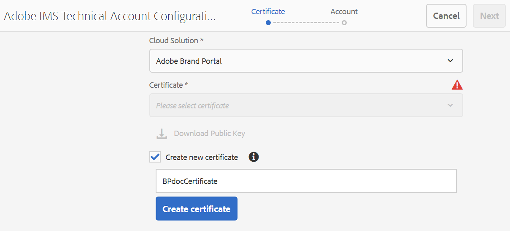
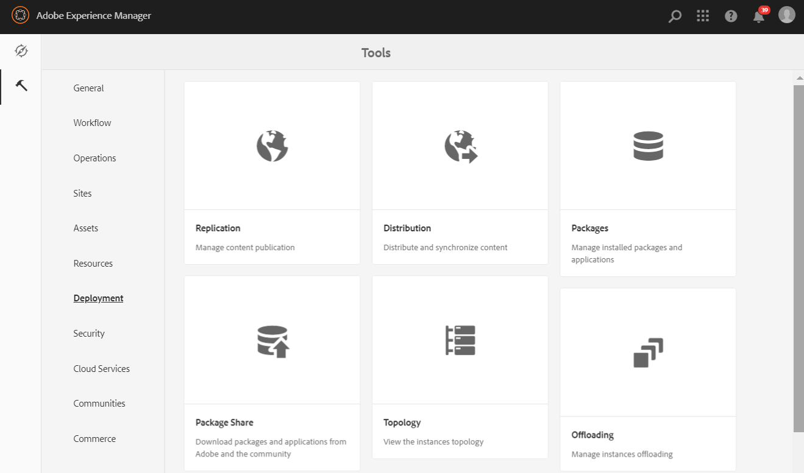
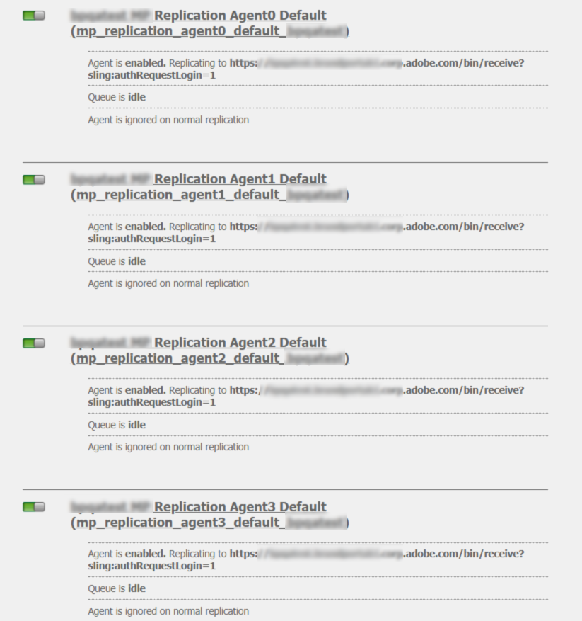

# AEM Assets configureren met Brand Portal {#configure-integration-65}

AEM Assets (Adobe Experience Manager) wordt geconfigureerd met Brand Portal via Adobe I/O, dat een IMS-token aanschaft voor autorisatie van uw Brand Portal-tenant.

>[!NOTE]
>
>Het configureren van AEM-middelen met Brand Portal via Adobe I/O wordt ondersteund op AEM 6.5.4.0 en hoger.
>
>Eerder, werd het Portaal van het Merk gevormd in Klassieke UI via Verouderde Gateway OAuth, die de het symbolenuitwisseling van JWT gebruikt om een token van de Toegang te verkrijgen IMS voor vergunning.
>
>Configuratie via verouderde OAuth wordt vanaf 6 april 2020 niet meer ondersteund en wordt gewijzigd in configureren via Adobe I/O.

>[!TIP]
>
>***Alleen voor bestaande klanten***
>
>Het wordt geadviseerd om bestaande oudere configuratie van de Gateway te blijven gebruiken OAuth. Als er problemen optreden met de oudere OAuth Gateway-configuratie, verwijdert u de bestaande configuratie en maakt u een nieuwe configuratie via Adobe I/O.

In deze Help worden de volgende twee gebruiksgevallen beschreven:
* [Nieuwe configuratie](#configure-new-integration-65): Als u een nieuwe gebruiker van het Merk Portal bent en uw AEM Assets auteurinstantie met het Portaal van het Merk wilt vormen, kunt u nieuwe configuratie op de I/O van Adobe tot stand brengen.
* [Configuratie](#upgrade-integration-65)upgrade: Als u een bestaande gebruiker bent van het Merk Portal met uw AEM Assets auteursinstantie die met het Portaal van het Merk op erfenisOAuth Gateway wordt gevormd, wordt het geadviseerd om de bestaande configuraties te schrappen en nieuwe configuratie op Adobe I/O tot stand te brengen.

De verstrekte informatie is gebaseerd op de veronderstelling dat iedereen die deze Hulp leest met de volgende technologieën vertrouwd is:

* Adobe Experience Manager- en AEM-pakketten installeren, configureren en beheren

* Linux- en Microsoft Windows-besturingssystemen gebruiken

## Vereisten {#prerequisites}

U hebt het volgende nodig om AEM Assets te configureren met Brand Portal:

* Een up-to-run AEM Assets auteurinstantie met het nieuwste Service Pack.
* URL van Brand Portal-tenant.
* Een gebruiker met systeembeheerdersbevoegdheden op de IMS-organisatie van de Brand Portal-tenant.

[AEM 6.5 downloaden en installeren](#aemquickstart)

[De nieuwste AEM Service Pack downloaden en installeren](#servicepack)

### AEM 6.5 downloaden en installeren {#aemquickstart}

Het wordt aanbevolen AEM 6.5 te hebben om een instantie van AEM-auteur in te stellen. Als AEM niet actief is, kunt u het downloaden van de volgende locaties:

* Als u een bestaande AEM-klant bent, downloadt u AEM 6.5 van de [Adobe-licentiewebsite](http://licensing.adobe.com).

* Als u een Adobe-partner bent, gebruikt u het [Adobe Partner Training Program](https://adobe.allegiancetech.com/cgi-bin/qwebcorporate.dll?idx=82357Q) om AEM 6.5 aan te vragen.

Nadat u AEM hebt gedownload, raadpleegt u het [implementeren en onderhouden](https://helpx.adobe.com/experience-manager/6-5/sites/deploying/using/deploy.html#defaultlocalinstall)van instructies voor het instellen van een AEM-auteurinstantie.

### Download en installeer de nieuwste AEM Service Pack {#servicepack}

Zie voor gedetailleerde instructies

* [Opmerkingen bij de release AEM 6.5 Service Pack](https://helpx.adobe.com/experience-manager/6-5/release-notes/sp-release-notes.html)

**Neem contact op met de klantenservice** als u het nieuwste AEM-pakket of Service Pack niet kunt vinden.

## Configuratie maken {#configure-new-integration-65}

Voer de volgende stappen in de vermelde opeenvolging uit als u Middelen AEM met het Portaal van het Merk voor het eerst vormt:
1. [Openbaar certificaat verkrijgen](#public-certificate)
1. [Adobe I/O-integratie maken](#createnewintegration)
1. [IMS-accountconfiguratie maken](#create-ims-account-configuration)
1. [Cloudservice configureren](#configure-the-cloud-service)
1. [Configuratie testen](#test-integration)

### IMS-configuratie maken {#create-ims-configuration}

IMS-configuratie verifieert uw Brand Portal-tenant met de AEM Assets-auteurinstantie.

De IMS-configuratie omvat twee stappen:

* [Openbaar certificaat verkrijgen](#public-certificate)
* [IMS-accountconfiguratie maken](#create-ims-account-configuration)

### Openbaar certificaat verkrijgen {#public-certificate}

Met een openbaar certificaat kunt u uw profiel verifiëren op Adobe I/O.

1. Aanmelden bij de instantie van de auteur van AEM AssetsStandaard-URL: http:// localhost:4502/aem/start.html
1. Ga vanuit het deelvenster **Tools**  naar **[!UICONTROL Security]** >> **[!UICONTROL Adobe IMS Configurations]**.

   

1. De pagina Adobe IMS Configurations wordt geopend.

   Klik op **[!UICONTROL Create]**.

   Hiermee gaat u naar de pagina **[!UICONTROL Adobe IMS Technical Account Configuration]**.

1. Standaard wordt het tabblad **Certificate** geopend.

   Selecteer in **Cloud Solution** de optie **[!UICONTROL Adobe Brand Portal]**.

1. Schakel het selectievakje **[!UICONTROL Create new certificate]** in en geef een **alias** op voor het certificaat. De alias fungeert als naam voor het dialoogvenster.

1. Klik op **[!UICONTROL Create certificate]**. Er wordt een dialoogvenster weergegeven. Klik op **[!UICONTROL OK]** om het openbare certificaat te genereren.

   

1. Klik op **[!UICONTROL Download Public Key]** en sla het certificaatbestand *AEM-Adobe-IMS.crt* op uw computer op. Het certificaatbestand wordt gebruikt om [Adobe I/O-integratie te maken](#createnewintegration).

   

1. Klik op **[!UICONTROL Next]**.

   Maak op het tabblad **Account** het Adobe IMS-account. Hiervoor hebt u echter de integratiedetails nodig. Laat deze pagina voorlopig open.

   Open een nieuw tabblad en [maak een Adobe I/O-integratie](#createnewintegration) om de integratiedetails voor IMS-accountconfiguraties op te halen.

### Adobe I/O-integratie maken {#createnewintegration}

Bij een Adobe I/O-integratie worden de API-sleutel, het clientgeheim en de payload (JWT) gegenereerd die vereist zijn voor het instellen van de IMS-accountconfiguraties.

1. Meld u aan bij Adobe I/O Console met systeembeheerdersbevoegdheden voor de IMS-organisatie van de Brand Portal-tenant.

   Standaard-URL: [https://console.adobe.io/](https://console.adobe.io/)

1. Klik op **[!UICONTROL Create Integration]**.

1. Selecteer **[!UICONTROL Access an API]** en klik op **[!UICONTROL Continue]**.

   

1. Een pagina voor het maken van een nieuwe integratie wordt geopend.

   Selecteer uw organisatie in de vervolgkeuzelijst.

   Selecteer in **[!UICONTROL Experience Cloud]** de optie **[!UICONTROL AEM Brand Portal]** en klik op **[!UICONTROL Continue]**.

   Als de optie Brand Portal voor u is uitgeschakeld, controleert u of u de juiste organisatie hebt geselecteerd in het keuzemenu boven de optie **[!UICONTROL Adobe Services]**. Neem contact op met de beheerder als u uw organisatie niet kent.

   

1. Geef een naam en een beschrijving voor de integratie op. Klik op **[!UICONTROL Select a File from your computer]** en upload het bestand `AEM-Adobe-IMS.crt` dat u hebt gedownload in de sectie voor het [verkrijgen van openbare certificaten](#public-certificate).

1. Selecteer het profiel van uw organisatie.

   Of selecteer het standaardprofiel **[!UICONTROL Assets Brand Portal]** en klik op **[!UICONTROL Create Integration]**. De integratie wordt gemaakt.

1. Klik op **[!UICONTROL Continue to integration details]** om de integratiegegevens weer te geven.

   Kopieer de **[!UICONTROL API Key]**

   Klik op **[!UICONTROL Retrieve Client Secret]** en kopieer de sleutel van het clientgeheim.

   

1. Ga naar het tabblad **[!UICONTROL JWT]** en kopieer de **[!UICONTROL JWT payload]**.

   De informatie over de API-sleutel, de sleutel van het clientgeheim en de JWT-payload worden gebruikt om een IMS-accountconfiguratie te maken.

### IMS-accountconfiguratie maken {#create-ims-account-configuration}

Controleer of u de volgende stappen hebt uitgevoerd:

* [Openbaar certificaat verkrijgen](#public-certificate)
* [Adobe I/O-integratie maken](#createnewintegration)

**Stappen om IMS-accountconfiguratie te maken:**

1. Open op de pagina IMS Configuration het tabblad **[!UICONTROL Accounts]**. U hebt de pagina open gelaten aan het einde van de sectie voor [Openbaar certificaat verkrijgen](#public-certificate).

1. Geef een **[!UICONTROL Title]** op voor het IMS-account.

   Voer in **[!UICONTROL Authorization Server]** de volgende URL in: [https://ims-na1.adobelogin.com/](https://ims-na1.adobelogin.com/)

   Plak de API-sleutel, het clientgeheim en de JWT-payload die u hebt gekopieerd aan het einde van [Adobe I/O-integratie maken](#createnewintegration).

   Klik op **[!UICONTROL Create]**.

   De integratie wordt gemaakt.

   

1. Selecteer de IMS-configuratie en klik op **[!UICONTROL Check Health]**. Er wordt een dialoogvenster weergegeven.

   Klik op **[!UICONTROL Check]**. Bij een geslaagde verbinding wordt het bericht *Token retrieved successfully* weergegeven.

   

>[!CAUTION]
>
>U kunt slechts één IMS-configuratie hebben. Maak geen meerdere IMS-configuraties.
>
>Zorg ervoor dat de IMS-configuratie slaagt voor de statuscontrole. Als de configuratie niet slaagt voor de statuscontrole, is deze ongeldig. U moet deze dan verwijderen en een nieuwe, geldige configuratie maken.

### Cloudservice configureren {#configure-the-cloud-service}

Voer de volgende stappen uit om de configuratie van de Brand Portal-cloudservice te maken:

1. Aanmelden bij de auteur-instantie van AEM Assets

   Standaard-URL: http:// localhost:4502/aem/start.html
1. Ga vanuit het deelvenster **Tools**  naar **[!UICONTROL Cloud Services >> AEM Brand Portal]**.

   De pagina Brand Portal Configurations wordt geopend.

1. Klik op **[!UICONTROL Create]**.

1. Geef een **[!UICONTROL Title]** op voor de configuratie.

   Selecteer de IMS-configuratie die u in de stap [IMS-accountconfiguratie maken](#create-ims-account-configuration) hebt gemaakt.

   Voer in **[!UICONTROL Service URL]** de URL van uw Brand Portal-tenant in.

   

1. Klik op **[!UICONTROL Save and Close]**. De cloudconfiguratie wordt gemaakt. De auteur-instantie van uw AEM-middelen is nu geïntegreerd met de medewerker van het Brand Portal.

### Configuratie testen {#test-integration}

1. Aanmelden bij de auteur-instantie van AEM Assets

   Standaard-URL: http:// localhost:4502/aem/start.html

1. Ga vanuit het deelvenster **Tools**  naar **[!UICONTROL Deployment >> Replication]**.

   

1. Replicatiepagina wordt geopend.

   Klik op **[!UICONTROL Agents on author]**.

   

1. Vier replicatieagenten worden gecreeerd voor elke huurder.

   Bepaal de plaats van de replicatieagenten van uw huurder van het Portaal van het Merk.

   Klik op de URL van de replicatieagent.

   

   >[!NOTE]
   >
   >De replicatieagenten werken parallel en delen de baandistributie gelijk, daardoor verhogend de het publiceren snelheid met vier keer de originele snelheid. Nadat de wolkendienst wordt gevormd, wordt de extra configuratie niet vereist om de replicatieagenten toe te laten die door gebrek worden geactiveerd om parallelle publicatie van veelvoudige activa toe te laten.

   >[!NOTE]
   >
   >Vermijd onbruikbaar makend om het even welke replicatieagenten, aangezien het de replicatie van sommige activa kan veroorzaken om te ontbreken.

1. To verify the connection between AEM Assets author and Brand Portal, click **[!UICONTROL Test Connection]**.

   

1. Bekijk de bodem van de testresultaten om te verifiëren dat de replicatie succesvol was.

   

   >[!NOTE]
   >
   >De replicatieagenten werken parallel en delen de baandistributie gelijk, daardoor verhogend de het publiceren snelheid met vier keer de originele snelheid. Nadat de wolkendienst wordt gevormd, wordt de extra configuratie niet vereist om de replicatieagenten toe te laten die door gebrek worden geactiveerd om parallelle publicatie van veelvoudige activa toe te laten.

1. Verifieer de testresultaten op alle vier replicatieagenten één voor één.

   >[!NOTE]
   >
   >Vermijd onbruikbaar makend om het even welke replicatieagenten, aangezien het de replicatie van sommige activa kan veroorzaken om te ontbreken.

Brand Portal is geconfigureerd met de auteur-instantie van AEM Assets. U kunt nu het volgende doen:

* [Assets publiceren van AEM Assets naar Brand Portal](../assets/brand-portal-publish-assets.md)
* [Mappen publiceren van AEM Assets naar Brand Portal](../assets/brand-portal-publish-folder.md)
* [Verzamelingen publiceren van AEM Assets naar Brand Portal](../assets/brand-portal-publish-collection.md)
* [Asset Sourcing](https://docs.adobe.com/content/help/en/experience-manager-brand-portal/using/asset-sourcing-in-brand-portal/brand-portal-asset-sourcing.html) configureren, zodat gebruikers van het Brand Portal elementen kunnen leveren en publiceren naar AEM Assets.

## Upgradeconfiguratie {#upgrade-integration-65}

Voer de volgende stappen in de vermelde opeenvolging uit om bestaande configuraties te bevorderen:
1. [Werken met taken controleren](#verify-jobs)
1. [Bestaande configuraties verwijderen](#delete-existing-configuration)
1. [Configuratie maken](#configure-new-integration-65)

### Werken met taken controleren {#verify-jobs}

Zorg ervoor dat er geen publicatietaak wordt uitgevoerd op de AEM Assets auteurinstantie voordat u wijzigingen aanbrengt. Voor dat, kunt u alle vier replicatieagenten verifiëren en ervoor zorgen dat de rij ideaal/leeg is.

1. Aanmelden bij de auteur-instantie van AEM Assets

   Standaard-URL: http:// localhost:4502/aem/start.html

1. Ga vanuit het deelvenster **Tools**  naar **[!UICONTROL Deployment >> Replication]**.

1. Replicatiepagina wordt geopend.

   Klik op **[!UICONTROL Agents on author]**.

   

1. Bepaal de plaats van de replicatieagenten van uw huurder van het Portaal van het Merk.

   Zorg ervoor dat de **Rij voor alle replicatieagenten inactief** is, is geen het publiceren baan actief.

   

### Bestaande configuraties verwijderen {#delete-existing-configuration}

U moet de volgende controle-lijst in werking stellen terwijl het schrappen van de bestaande configuraties.
* Alle vier replicatieagents verwijderen
* Cloudservice verwijderen
* MAC-gebruiker verwijderen

1. Meld u aan bij de instantie van de auteur van AEM-middelen en open CRX Lite als beheerder.

   Standaard-URL: http:// localhost:4502/crx/de/index.jsp

1. Navigeer aan en schrap alle vier replicatieagenten van uw Poorthuurder van het Merk. `/etc/replications/agents.author`

   

1. Navigeer naar `/etc/cloudservices/mediaportal` en verwijder de configuratie **van de** Cloud-service.

   

1. Navigeer aan `/home/users/mac` en schrap de gebruiker **van** MAC van uw Poorthuurder van het Merk.

   

U kunt nu configuratie [op uw AEM 6.5 auteurinstantie op de I/O van Adobe](#configure-new-integration-65) tot stand brengen.

<!--
   Comment Type: draft

   <li> </li>
   -->

<!--
   Comment Type: draft

   <li>Step text</li>
   -->

Nadat de replicatie slaagt, kunt u activa, omslagen, en inzamelingen aan het Portaal van het Merk publiceren. Zie voor meer informatie:

* [Assets publiceren naar Brand Portal](/help/assets/brand-portal-publish-assets.md)
* [Mappen publiceren naar Brand Portal](/help/assets/brand-portal-publish-folder.md)
* [Verzamelingen publiceren naar Brand Portal](/help/assets/brand-portal-publish-collection.md)
