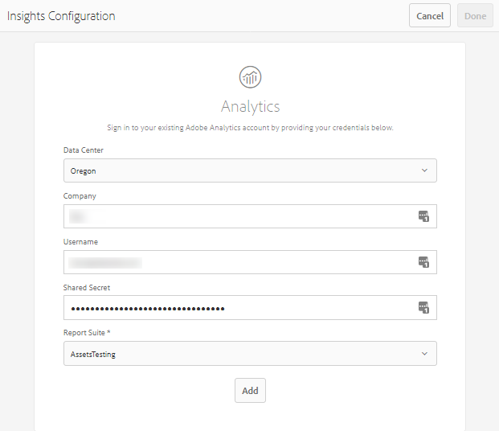

# Elementengegevens configureren {#configure-asset-insights}

[!DNL Adobe Experience Manager Assets] haalt gebruiksgegevens op over digitale middelen die door websites van derden worden gebruikt [!DNL Adobe Analytics]. Om de Inzichten van Activa toe te laten om deze gegevens terug te winnen en inzichten te produceren, vorm eerst de eigenschap om met te integreren [!DNL Adobe Analytics]. Als u deze functie wilt gebruiken in een installatie op locatie, kunt u [!DNL Adobe Analytics] licentie afzonderlijk. Klanten op [!DNL Managed Services] ontvangen [!DNL Analytics] licentie gebundeld met [!DNL Experience Manager]. Zie [Managed Services-productbeschrijving](https://helpx.adobe.com/legal/product-descriptions/adobe-experience-manager-managed-services.html).

>[!NOTE]
>
>Inzichten worden alleen ondersteund en opgegeven voor afbeeldingen.

1. In [!DNL Experience Manager], klikt u op **[!UICONTROL Tools]** > **[!UICONTROL Assets]**.

   

1. Klik op de knop **[!UICONTROL Insights Configuration]** kaart.
1. Selecteer een datacenter in de wizard en geef uw referenties op, inclusief de naam van uw organisatie, gebruikersnaam en gedeeld geheim.

   

   *Afbeelding: configureren [!DNL Adobe Analytics] voor Assets Insights in [!DNL Experience Manager].*

1. Klik op **[!UICONTROL Authenticate]**.
1. Na [!DNL Experience Manager] verifieert uw geloofsbrieven, van **[!UICONTROL Report Suite]** lijst, kiest u een [!DNL Adobe Analytics] rapportsuite van waar u gegevens wilt ophalen met behulp van Assets Insights. Klik op **[!UICONTROL Add]**.
1. Na [!DNL Experience Manager] stelt uw rapportsuite in, klikt u op **[!UICONTROL Done]**.

## Paginatracering {#page-tracker}

Nadat u uw [!DNL Adobe Analytics] -account, wordt de code van Paginanummer voor u gegenereerd. Elementeninzichten kunnen worden bijgehouden [!DNL Experience Manager] elementen die in websites van derden worden gebruikt, nemen de paginacontrackercode in de websitecode op. Gebruik de [!UICONTROL Page Tracker] nut in [!DNL Experience Manager Assets] om de code van de paginacontracker te produceren. Ga voor meer informatie over het opnemen van uw code in Paginanummering in externe webpagina&#39;s naar [Paginatracering gebruiken en code insluiten in webpagina&#39;s](/help/assets/use-page-tracker.md).

1. In [!DNL Experience Manager], klikt u op **[!UICONTROL Tools]** > **[!UICONTROL Assets]**.

   

1. Van de **[!UICONTROL Navigation]** pagina, klikt u op de **[!UICONTROL Insights Page Tracker]** kaart.
1. Klikken **[!UICONTROL Download]** om de code van de paginacontracker te downloaden.
