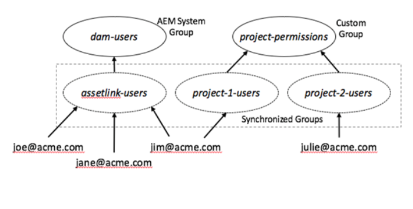

# Experience Manager Assets for Adobe Asset Link configureren {#adobe-asset-link}

[ de Verbinding van het Activa van Adobe (AAL) ](https://www.adobe.com/creativecloud/business/enterprise/adobe-asset-link.html) stroomlijnt samenwerking tussen creatieven en verkopers in het proces van de inhoudsverwezenlijking. Adobe Experience Manager Assets wordt verbonden met Creative Cloud-bureaubladapps Adobe InDesign, Adobe Photoshop en Adobe Illustrator. Met het deelvenster Adobe Asset Link hebben creatieve toepassingen toegang tot inhoud die in AEM Assets is opgeslagen en kunnen ze deze inhoud wijzigen zonder dat ze de meest bekende creatieve toepassingen hoeven te gebruiken.

Om Experience Manager Assets te vormen die met de Verbinding van Activa moet worden gebruikt, voer de volgende taken uit. Experience Manager-beheerdersaccount gebruiken om de configuratie uit te voeren:

1. Installeer de pakketten naar wens. De details zijn in [ eerste vereisten ](#prerequisites).

1. Vorm Experience Manager of [ manueel ](#manual-configuration) of gebruikend a [ pakket ](#configure-using-package).

1. Om Creative Cloud in kaart te brengen vergunning gegeven gebruikers met de gebruikers van Experience Manager, beheer [ controle van de gebruikerstoegang ](#user-access).

1. Creeer [ de index van de douanevraag ](#create-custom-index), vorm [ Vertoningen FPO ](/help/assets/configure-fpo-renditions.md) voor InDesign, vorm [ de integratie van Adobe Stock ](/help/assets/aem-assets-adobe-stock.md), en vorm [ visueel of gelijkenis onderzoek ](https://experienceleague.adobe.com/docs/experience-manager-65/assets/using/search-assets.html#configvisualsearch).

## Vereisten en ondersteuning voor verschillende functies {#prerequisites}

Zorg ervoor dat u het juiste servicepakket en -pakket installeert. Zie de volgende vereisten voor elke Experience Manager-versie en voor specifieke mogelijkheden.

| Assets-functionaliteit | Experience Manager-versie en vereisten voor ondersteuning |
|--- |--- |
| Koppeling van middelen werkt standaard | Experience Manager 6.5 en 6.5.2 of hoger.   Experience Manager 6.4.4 en 6.4.6 of hoger.   Adobe adviseert installerend het recentste [ de dienstpak van Experience Manager (SP) ](https://experienceleague.adobe.com/docs/experience-manager-release-information/aem-release-updates/aem-releases-updates.html) alvorens AAL te gebruiken. |
| Asset Link werkt na het installeren van een pakket | Voor Experience Manager 6.4.0 - 6.4.3, installeer [ adobe-asset-link-support ](https://experience.adobe.com/#/downloads/content/software-distribution/en/aem.html?package=/content/software-distribution/en/details.html/content/dam/aem/public/adobe/packages/cq640/featurepack/adobe-asset-link-support) pakket. |
| Adobe Stock-integratie | Experience Manager 6.4.2 of hoger |
| Zoeken op visuele of gelijkenis | Experience Manager 6.5.0 of hoger |

## Experience Manager configureren met het configuratiepakket {#configure-using-package}

Adobe adviseert dat u [ adobe-asset-link-config ](https://experience.adobe.com/#/downloads/content/software-distribution/en/aem.html?package=/content/software-distribution/en/details.html/content/dam/aem/public/adobe/packages/cq640/product/assets/adobe-asset-link-config) configuratiepakket installeert om de meeste configuratietaken te automatiseren, die door een paar handtaken worden gevolgd. Alternatief, kunt u [ manueel vormen ](#manual-configuration).

>[!CAUTION]
>
>Gebruik het configuratiepakket niet als uw Experience Manager-instantie is geconfigureerd voor gebruikersaanmelding bij Adobe IMS-accounts. In plaats daarvan, [ vormt manueel ](#manual-configuration) uw instantie van Experience Manager.

1. Als u Package Manager wilt openen, opent u in de Experience Manager-webinterface **[!UICONTROL Tools]** > **[!UICONTROL Deployment]** > **[!UICONTROL Package Share]** . Installeer het pakket `adobe-asset-link-config` .

1. Ga naar **[!UICONTROL Tools]** > **[!UICONTROL Operations]** > **[!UICONTROL Web Console]** . Zoek **[!UICONTROL Adobe Granite OAuth IMS Provider]** -configuratie en klik om deze te bewerken.

   Stel de volgende eigenschappen in en sla de wijzigingen op.

   * [!UICONTROL Group Mappings]: Laat leeg, tenzij gewenst. Voor details, zie [ Afbeelding van de Groep ](#group-mapping).
   * [!UICONTROL Organization]: voer de organisatie-id in die u in de Adobe Admin Console gebruikt. Voor meer informatie over organisatie IDs, zie [ gebruikersgroep ](https://helpx.adobe.com/enterprise/using/create-aal-user-group.html) creëren.

1. Zoek **[!UICONTROL Adobe Granite Bearer Authentication Handler]** -configuratie en klik om deze te bewerken.

   Voeg **[!UICONTROL InDesignAem2]** Client IDs aan het **[!UICONTROL Allowed OAuth client ids]** configuratiebezit toe.

## Experience Manager handmatig configureren {#manual-configuration}

Configureer Experience Manager handmatig als u ervoor kiest geen configuratiepakket te gebruiken of als uw Experience Manager-implementatie zo is geconfigureerd dat gebruikersaanmelding met Adobe IMS-accounts wordt ondersteund.

Experience Manager handmatig configureren:

1. Open **[!UICONTROL Tools]** > **[!UICONTROL Operations]** > **[!UICONTROL Web Console]** om het configuratiemanager te openen. Selecteer **[!UICONTROL OSGi]** > **[!UICONTROL Configuration]** in het menu bovenaan.

1. Zoek de **[!UICONTROL Adobe Granite OAuth IMS Provider]** -configuratie en klik om deze te bewerken.

   Stel de volgende configuratie in en klik op **[!UICONTROL Save]** .

   * [!UICONTROL Authorization Endpoint]: ` https://ims-na1.adobelogin.com/ims/authorize/v1`
   * [!UICONTROL Token Endpoint]: ` https://ims-na1.adobelogin.com/ims/token/v1`
   * [!UICONTROL Profile Endpoint]: ` https://ims-na1.adobelogin.com/ims/profile/v1`
   * [!UICONTROL Validation URL]: ` https://ims-na1.adobelogin.com/ims/validate_token/v1`
   * [!UICONTROL Organization]: Reeks aan organisatieidentiteitskaart in [ Adobe Admin Console ](https://adminconsole.adobe.com/).
   * [!UICONTROL Group Mappings]: Laat leeg tenzij u een speciale kwestie hebt. Voor details, zie [ Afbeelding van de Groep ](#group-mapping).

1. Zoek **[!UICONTROL Adobe Granite Bearer Authentication Handler]** -configuratie en klik om deze te bewerken.

   Voeg de volgende client-id&#39;s toe aan de configuratieeigenschap **[!UICONTROL Allowed OAuth client ids]** : `InDesignAem2, cc-europa-desktop_0_1, cc-europa-desktop_1_0, cc-europa-desktop_2_0, cc-europa-desktop_3_0, cc-europa-desktop_4_0, cc-europa-desktop_5_0, cc-europa-desktop_6_0, cc-europa-desktop_7_0, cc-europa-desktop_8_0, cc-europa-desktop_9_0, and cc-europa-desktop_10_0` .

   Als u elke `Client ID` wilt toevoegen, klikt u op `+` . Klik op **[!UICONTROL Save]** nadat u alle id&#39;s hebt toegevoegd.

1. Controleer in de **[!UICONTROL Adobe Granite OAuth Application and Provider]** -configuratie de bestaande **[!UICONTROL Adobe Granite OAuth Application and Provider]** -instanties. Als u een instantie zoekt met de `Config ID` waarde `ims` , gebruikt u deze voor de instructies in deze procedure. Klik anders op `+` om een configuratieinstantie te maken. Stel de volgende eigenschapswaarden in en klik op **[!UICONTROL Save]** .

   * [!UICONTROL Client ID]: niet wijzigen
   * [!UICONTROL Client Secret]: niet wijzigen
   * [!UICONTROL Config ID]: ` ims`
   * [!UICONTROL Scope]: `AdobeID, OpenID, read_organizations` (andere waarden kunnen zich ook in de configuratie bevinden)
   * [!UICONTROL Provider ID]: ` ims`
   * [!UICONTROL Create users]: ` Checked`
   * [!UICONTROL User ID Property]: `Email` voor nieuwe configuratie. Anders verandert u niet.

1. Zoek de **[!UICONTROL Apache Jackrabbit Oak Default Sync Handler]** -configuratie met **[!UICONTROL Sync Handler Name]** `ims` en klik om deze te bewerken.

   Stel de volgende configuratie-eigenschappen in en klik op **[!UICONTROL Save]** .

   * [!UICONTROL User Expiration Time and User Membership Expiration]: Tijd in minuten volgend op met &#39;m&#39; zonder spatie. Bijvoorbeeld `15m` gedurende 15 minuten. Voor details, zie [ Afbeelding van de Groep ](#group-mapping).
   * [!UICONTROL User auto membership]: niet wijzigen
   * [!UICONTROL User Dynamic Membership]: ` Deslect`

1. Zoek de **[!UICONTROL Adobe Granite OAuth Authentication Handler]** -configuratie en klik om deze te bewerken. Klik op **[!UICONTROL Save]** zonder wijzigingen aan te brengen.

1. Navigeer naar `/apps/system/config` als u de relatieve prioriteit van de handler voor toonder-verificatie in CRXDE wilt aanpassen. Zoek `com.adobe.granite.auth.oauth.impl.BearerAuthenticationHandler.config` en open de configuratie ervan. Voeg aan het einde `service.ranking=I"-10"` toe. Sla de wijzigingen op.

   >[!NOTE]
   >
   >Elke aanvraag die wordt geverifieerd met een token voor toonder, heeft betrekking op drie aanroepen van Adobe IMS, gebruikerssynchronisatie en het maken van een aanmeldingstoken in Experience Manager. Om deze overhead te overwinnen, legt Adobe Asset Link het login-token vast dat in de reactie van Experience Manager is geretourneerd en verzendt deze met volgende verzoeken. Dit proces werkt alleen als de relatieve prioriteit van de verificatiehandler aan toonder wordt aangepast.

1. (Optioneel) Als de Experience Manager-gebruikers hoofdlettergebruik- of gemengde domeinnamen in hun e-mailadressen hebben, selecteert u **[!UICONTROL Change Locking User to Lower Case]** in **[!UICONTROL Adobe Granite ACP Platform Configs]** in Experience Manager Web Console.

## Aanvullende configuratie na migratie naar bedrijfsprofielen {#configure-migration-activity}

Gebruikers van Adobe Asset Link kunnen verbinding maken met Experience Manager om IMS-aanmelding toe te staan vanaf de Creative Cloud for Enterprise (CCE) org. Experience Manager gebruikt de client-id&#39;s om de toegestane IMS-organisatie te identificeren. Na migratie naar bedrijfsprofielen is het vereist om de client-id en de geheime sleutel voor de IMS-org in Experience Manager te configureren voor de Verteller. Voor meer informatie over Bedrijfs Profielen, zie [ introducerend de Profielen van Adobe ](https://helpx.adobe.com/enterprise/kb/introducing-adobe-profiles.html).

Aanvullende configuratie is alleen vereist als u verschillende Adobe IMS-organisaties voor Experience Manager en Creative Cloud for Enterprise (CCE) gebruikt en er een vertrouwensrelatie tussen deze twee organisaties tot stand is gebracht.

>[!NOTE]
>
>* De oplossing voor bedrijfsprofielen is beschikbaar in Experience Manager 6.5.11.0 .
>* De bestaande configuratie blijft werken als u dezelfde Adobe IMS-organisatie gebruikt met Experience Manager en CCE.

**Eerste vereisten**

1. Een Experience Manager-instantie aan de slag waarbij verificatie aan toonder is geconfigureerd voor AAL.
1. Installeer het volgende pakket (Service Pack 11) op uw Experience Manager 6.5-exemplaar.

   [ Download Experience Manager 6.5.11.0 ](https://experience.adobe.com/#/downloads/content/software-distribution/en/aem.html?package=/content/software-distribution/en/details.html/content/dam/aem/public/adobe/packages/cq650/servicepack/aem-service-pkg-6.5.11.zip)

1. Neem contact op met [!UICONTROL Customer Support] voor de client-id en geheime sleutel voor de verificatie van uw IMS-org aan toonder.

Hieronder vindt u de aanvullende configuraties die vereist zijn na de migratie naar bedrijfsprofielen:

1. In **[!UICONTROL Adobe Granite OAuth IMS Configuration Provider]** (`com.adobe.granite.auth.ims.impl.ImsConfigProviderImpl`), plaats:

   * OAuth Configuration ID (`oauth.configmanager.ims.configid`): `ims` (Verifieer eens, u kunt het reeds gevormd hebben)

   * IMS-eigenaar (`ims.owningEntity`): uw IMS org-id

   

1. Open de **[!UICONTROL Bearer Authentication Handler]** -configuratie en voeg de client-id die u van [!UICONTROL Customer Support] hebt gekregen toe aan de lijst met **[!UICONTROL Allowed OAuth client ids]** .

    toe

1. Open de configuratie van **[!UICONTROL Adobe Granite OAuth Application and Provider]** en voeg de **[!UICONTROL Client ID]** en **[!UICONTROL Client Secret]** (Geheime sleutel) toe die van de Klantenondersteuning worden verkregen.

   Zorg ervoor dat het **[!UICONTROL Config ID]** veld (`oauth.config.id`) dezelfde waarde bevat als in het **[!UICONTROL OAuth configuration ID]** veld (`oauth.configmanager.ims.configid`) hierboven.

   

1. Open de **[!UICONTROL Adobe Granite IMS Cluster Exchange Token Preprocessor]** -configuratie en stel deze in op `enable` .

## Toegangsbeheer voor gebruikers beheren {#user-access}

In dit gedeelte wordt beschreven hoe gebruikers kunnen worden beheerd en hoe ze toegang krijgen tot de Experience Manager-opslagplaats.

### Groepstoewijzing {#group-mapping}

Groepstoewijzing bepaalt hoe groepen in Experience Manager overeenkomen met groepen in Adobe IMS. Het speelt een belangrijke rol bij de manier waarop gebruikers van Adobe Asset Link toestemming krijgen om toegang te krijgen tot Experience Manager Assets.

Bij gebruik met Adobe Asset Link delegeert Experience Manager gebruikersbeheerfuncties aan Adobe IMS. Er worden automatisch gebruikers en groepen gemaakt die overeenkomen met gebruikers en groepen in Adobe IMS. Bovendien worden gebruikers, groepen en groepslidmaatschap in Experience Manager gesynchroniseerd, zodat deze overeenkomen met de gebruikers, groepen en groepen in Adobe IMS.

Neem bijvoorbeeld een scenario waarin gebruikers van Adobe Asset Link lid zijn van de Adobe IMS-groep voor koppelingen. In dit geval wordt in Experience Manager een gesynchroniseerde groep met de naam assetlink-users gemaakt wanneer een gebruiker uit die Adobe IMS-groep voor het eerst verbinding maakt met Adobe Asset Link. Elke nieuwe gebruiker in de Adobe IMS-groep wordt toegevoegd aan de corresponderende groep in Experience Manager wanneer deze voor het eerst via Adobe Asset Link verbinding maakt met Experience Manager.

Groepen in Experience Manager die overeenkomen met en gesynchroniseerd zijn met groepen in Adobe IMS, kunnen rechtstreeks toegang krijgen of door van hen lid te maken van een andere groep. Hier is een voorbeeld van hoe de toestemmingen kunnen worden beheerd.

De volgende regels zijn van toepassing op groepstoewijzingen in Experience Manager:

* Controleer of de eigenschap **[!UICONTROL Group Mappings]** in de **[!UICONTROL Adobe Granite OAuth IMS Provider]** -configuratie leeg is.
* Het lidmaatschap van een gebruikersgroep van Adobe Asset Link wordt geëvalueerd wanneer de gebruiker verifieert en de periode in de eigenschap **[!UICONTROL User Expiration Time]** in de **[!UICONTROL Apache Jackrabbit Oak Default Sync Handler]** -configuratie is verstreken. Momenteel kunnen gebruikers worden toegevoegd aan en verwijderd uit groepen in Experience Manager om te synchroniseren met wat er in Adobe IMS wordt gevonden.
* Vermijd conflicten met de groepsnaam. Zorg ervoor dat de namen die worden gebruikt voor groepen die in Adobe IMS zijn gemaakt (om gebruikers te beheren), verschillen van alle namen van Experience Manager-systeemgroepen.

  Zorg er bijvoorbeeld voor dat ze verschillen van de groep `dam-users` en de groepen die door de Experience Manager-beheerder zijn gemaakt.

  Een Adobe IMS-groep waarvan de naam een conflict veroorzaakt met de naam van een Experience Manager-systeemgroep of een handmatig gemaakte groep, wordt niet gebruikt om de gebruikersmachtigingen te beheren.
* Als een Adobe IMS-gebruiker verbinding maakt met een Experience Manager-instantie waarvan de gebruikersnaam een conflict veroorzaakt met een eerder gemaakte Experience Manager-gebruiker, krijgt de Adobe IMS-gebruiker een andere naam met toegevoegde nummers om deze uniek te maken.

**de eerste toegangscontrole van de Opstelling**

Gebruikers die verbinding maken via Adobe Asset Link kunnen alleen elementen weergeven en gebruiken nadat hun de vereiste machtigingen zijn verleend. De [ sectie van de Afbeelding van de Groep ](#group-mapping) hierboven bespreekt hoe gebruikersgroepen in Experience Manager worden gecreeerd, die beantwoorden aan en met gebruikersgroepen in uw organisatie binnen Adobe IMS gesynchroniseerd zijn. Adobe raadt aan dat de Experience Manager-beheerders deze groepen gebruiken om toegangsbeheer voor gebruikers van Adobe Asset Link te beheren.

Voor elke Experience Manager-groep die is gesynchroniseerd met een Adobe IMS-groep (die wordt gebruikt voor het beheer van de gebruikerstoegang):

1. Controleer of de groep een lid heeft dat kan worden gebruikt voor een eerste verbinding via Adobe Asset Link.
1. Gebruik die gebruiker om u aan te melden bij Adobe Asset Link en verbinding te maken met Experience Manager. Van deze verbinding wordt verwacht dat deze mislukt.
1. Zoek in Experience Manager de groep die overeenkomt met de groep in Adobe IMS en geef deze het gewenste toegangsbeheer. De nieuwe groep is bijvoorbeeld lid van de groep damgebruikers.
1. Sluit Adobe Asset Link en start de Creative Cloud-toepassing opnieuw.
1. Open Adobe Asset Link opnieuw om te controleren of de gebruiker de verwachte toegang heeft.

Als deze stappen zijn uitgevoerd, kunnen andere gebruikers in dezelfde groep verbinding maken met Experience Manager Asset Link in hun eerste poging. Zij hebben automatisch de zelfde toestemmingen zoals de andere gebruikers in de groep.

## Experience Manager-gebruikers beheren voor Adobe Asset Link {#manage-users}

Gebruikers van Adobe Asset Link kunnen verbinding maken met Experience Manager wanneer zij zijn aangemeld bij hun Creative Cloud-toepassing. Bij deze verificatie wordt gebruikgemaakt van Adobe IMS-technologie en worden gebruikersgegevens gemaakt in Experience Manager, als deze technologie niet bestaat. Experience Manager-zakelijke klanten kunnen hun gebruikers vaak beheren met een externe identiteitsprovider die is geïntegreerd met Experience Manager. Identiteitsproviders zijn onder andere Adobe IMS en andere producten die de SAML- en LDAP-protocollen gebruiken. U kunt gebruikers ook lokaal in Experience Manager maken en beheren.

Gebruikers die verbinding maken met Experience Manager via Adobe Asset Link, hebben geen conflict met bestaande gebruikersgegevens die in Experience Manager zijn opgeslagen vanaf vorige directe aanmelding, als:

* Alle gebruikersnamen die worden gebruikt voor directe aanmelding bij Experience Manager verschillen van gebruikersnamen die worden gebruikt in Adobe IMS voor Creative Cloud-aanmelding.
* Adobe IMS wordt gebruikt als de identiteitsprovider voor directe aanmelding bij Experience Manager.
* Gebruikers maken verbinding met Experience Manager via Adobe Asset Link voordat ze zich direct aanmelden bij dezelfde account.

Anderzijds moeten de gebruikersgegevens die zijn gemaakt als gevolg van de directe aanmelding bij Experience Manager, worden bijgewerkt om met Adobe Asset Link te kunnen werken, in de volgende scenario&#39;s:

* Dezelfde gebruikersnaam, zoals het e-mailadres van de gebruiker, wordt voor beide gebruikt: het account in Creative Cloud, dat Adobe IMS gebruikt, en het account in een externe identiteitsprovider anders dan Adobe IMS.
* Dezelfde gebruikersnaam wordt gebruikt voor beide: de account in Creative Cloud en een lokale Experience Manager-account.
* De Creative Cloud-accounts in Adobe IMS zijn gefedereerde id&#39;s die worden geleverd door dezelfde externe identiteitsprovider die is geïntegreerd met Experience Manager voor directe aanmelding.

De gebruikers die met deze scenario&#39;s zijn gemaakt, hebben geen eigenschap die vereist is voor gebruikers en die zijn gesynchroniseerd met Adobe IMS.

Zo werkt u dergelijke gebruikers in Experience Manager bij om te werken met Adobe Asset Link:

1. Zoek in de Experience Manager-webconsole naar de **[!UICONTROL Apache Jackrabbit Oak External PrincipalConfiguration]** -configuratie en klik om deze te bewerken. Schakel het selectievakje **[!UICONTROL External Identity Protection]** uit en klik op **[!UICONTROL Save]** .
1. Ga naar **[!UICONTROL Tools]** > **[!UICONTROL Security]** > **[!UICONTROL Users]** om de gebruikersbeheerinterface in Experience Manager te openen. Selecteer de gebruiker die u wilt bijwerken en noteer het einde van het URL-pad van de browser voor die gebruiker, te beginnen met `/home/users` . U kunt ook zoeken naar de gebruikersnaam in CRXDE. Een voorbeeldgebruikerspad: `/home/users/x/xTac082TDh-guJzzG7WM`.
1. Navigeer in CRXDE naar het gebruikerspad, selecteer het gebruikersknooppunt en bekijk de eigenschappen van het knooppunt door het tabblad **[!UICONTROL Properties]** in het middelste gebied te selecteren. Dit knooppunt heeft de eigenschapwaarde `jcr:primaryType` `rep:User` .
1. Voer onder aan het tabgebied **[!UICONTROL Properties]** een `Name` waarde `rep:externalId` , `Type` waarde `String` en `Value` waarde `rep:authorizableId` in, `ims` , waarbij `rep:authorizableId` de waarde van de eigenschap `rep:authorizableId` van het knooppunt is. (Er wordt een puntkomma zonder spaties gebruikt om de waarde `rep:authorizableId` van `ims` te scheiden.)
1. Klik op de knop **[!UICONTROL Add]** rechts van de nieuwe invoer en klik vervolgens op **[!UICONTROL Save All]** .
1. Herhaal stap 2 tot en met 5 voor alle andere gebruikers die u wilt upgraden voor gebruik met Adobe Asset Link.
1. Zoek in de Experience Manager-webconsole naar de **[!UICONTROL Apache Jackrabbit Oak External PrincipalConfiguration]** -configuratie en klik om deze te bewerken. Schakel het selectievakje **[!UICONTROL External Identity Protection]** uit en klik op **[!UICONTROL Save]** .

>[!NOTE]
>
>Start Experience Manager opnieuw om verificatie mogelijk te maken als de services binnen enkele minuten niet zijn hersteld.

Na deze wijziging kan een bijgewerkte Experience Manager-gebruiker verbinding maken met Adobe Asset Link en doorgaan met het gebruik van de methode voor directe aanmelding bij Experience Manager die voor de update is gebruikt. Als de verificatie met Adobe IMS is voltooid, worden de Experience Manager-gebruikersprofielgegevens gesynchroniseerd met het gebruikersprofiel in Adobe IMS.

Er is een methode waarmee een bulkmigratie van meerdere Experience Manager-gebruikers kan worden uitgevoerd, zodat ze met Adobe Asset Link kunnen werken. Neem contact op met Adobe Care voor meer informatie en assistentie bij het inschakelen van deze optie.

Als alternatief voor de stappen kan een Adobe Asset Link-gebruiker onder bepaalde omstandigheden snel toegang krijgen tot Experience Manager. In dergelijke gevallen wordt de reeds bestaande gebruikersinformatie gevonden en verwijderd bij Experience Manager User Management of Experience Manager CRXDE voordat de gebruiker verbinding maakt met Adobe Asset Link. Nieuwe gebruikersgegevens worden na de verbinding in Experience Manager gemaakt. Gebruik deze benadering slechts als u zeker bent dat er geen belangrijke gegevens zijn die als kind van de gebruikersknoop worden toegevoegd. Dergelijke extra gegevens zijn knooppunten die het onderliggende knooppunt van het gebruikerknooppunt zijn, met uitzondering van `tokens`-, `preferences` -, `profile` -, `profiles` - `profiles/public` - en `rep:policy/*` -knooppunten.

## Workflow automatisch starten om elementen voorwaardelijk te verwerken {#auto-start-workflow}

In Experience Manager 6.4 en Experience Manager 6.5 kunnen beheerders workflows zodanig configureren dat ze elementen automatisch uitvoeren en verwerken op basis van vooraf gedefinieerde voorwaarden.

De configuratie is bijvoorbeeld handig voor zakelijke gebruikers en marketers om een aangepaste workflow te maken voor een paar specifieke mappen. Alle elementen van de foto&#39;s van een agentschap kunnen van een watermerk zijn voorzien of alle elementen die door een freelancer zijn geüpload, kunnen worden verwerkt om specifieke uitvoeringen te maken.

Voor meer informatie en voor de configuratie van Experience Manager, zie [ auto-voert werkschema op activa ](https://experienceleague.adobe.com/docs/experience-manager-65/assets/using/assets-workflow.html#auto-execute-workflow-on-some-assets) uit.

## Een aangepaste index maken in Experience Manager 6.4.x-versies {#create-custom-index}

Experience Manager bevat indexen die worden gebruikt om te vragen. Maak de volgende aangepaste index voor de opgegeven versie. Experience Manager 6.5.0 bevat deze index standaard. Adobe Asset Link vereist deze index om te bepalen welke elementen een gebruiker heeft uitgecheckt.

1. Zoek in CRXDE het knooppunt `/oak:index` . Maak een knooppunt met de naam `cqDrivelock` en stel `Type` in op `oak:QueryIndexDefinition` .

1. Voeg de volgende eigenschappen toe aan het nieuwe knooppunt en sla de wijzigingen op:

   * `Name: type; Type: string; Value: property`

   * `Name: propertyNames; Type: Name[] (click the "Multi" button); Value: cq:drivelock`

## Zoeken op visuele of gelijkenis configureren {#configure-visual-similarity-search}

Met de visuele zoekfunctie kunt u zoeken naar visueel vergelijkbare elementen in de AEM Assets-opslagplaats via het paneel Adobe Asset Link. De functionaliteit is beschikbaar in 6.5.0 of latere versies en alleen de geïndexeerde elementen worden doorzocht. Voor meer informatie, zie [ hoe te om visueel onderzoek ](https://experienceleague.adobe.com/docs/experience-manager-65/assets/using/search-assets.html#configvisualsearch) te vormen.

## Uitvoeringen alleen voor plaatsing genereren voor Adobe InDesign {#fpo-renditions}

Experience Manager biedt uitvoeringen die alleen voor plaatsing (FPO) worden gebruikt. Deze FPO-uitvoeringen hebben een kleine bestandsgrootte maar hebben dezelfde hoogte-breedteverhouding. Als een FPO-uitvoering niet beschikbaar is voor een element, gebruikt Adobe InDesign in plaats daarvan het oorspronkelijke element. Dit fallback-mechanisme zorgt ervoor dat de creatieve workflow zonder onderbrekingen doorgaat. Voor meer informatie, zie [ vertoningen FPO ](/help/assets/configure-fpo-renditions.md) produceren.

## Integreren met Adobe Stock {#adobe-stock-integration}

Organisaties integreren hun Adobe Stock-accounts in Experience Manager Assets. Het helpt marketers om gelicentieerde foto&#39;s, vectoren, illustraties, video&#39;s, sjablonen en 3D-middelen van hoge kwaliteit en zonder royalty&#39;s beschikbaar te maken voor hun creatieve en marketingprojecten. Creatieve professionals kunnen deze elementen gebruiken via het deelvenster Asset Link.

Om met Adobe Stock te integreren, zie [ de activa van Adobe Stock in Experience Manager Assets ](/help/assets/aem-assets-adobe-stock.md). Experience Manager 6.4.2 of hoger is vereist voor integratie met Adobe Stock.

## Problemen met Experience Manager oplossen {#troubleshoot}

Als u problemen ondervindt bij het configureren of gebruiken van Adobe Asset Link, probeert u het volgende:

* Zorg ervoor dat uw implementatie aan de voorwaarden voldoet. Controleer met name of de juiste functiepakketten of pakketten zijn geïnstalleerd.
* Neem contact op met de partner of systeemintegrator van uw organisatie.
* Als uw Creative Cloud-gebruikers niet kunnen controleren in de uitgecheckte middelen, controleert u of de domeinnamen in de e-mailadressen zijn opgeslagen. Om te bevestigen, zie [ handconfiguratie ](#manual-configuration).
* Voor meer info, zie [ de Verbinding van Activa problemen oplossen ](https://helpx.adobe.com/enterprise/kb/asset-link-troubleshooting.html).

>[!MORELIKETHIS]
>
>* [ Ongeveer de Verbinding van Activa van Adobe ](https://helpx.adobe.com/enterprise/using/adobe-asset-link.html)
>* [ Verbinding van Activa van het Gebruik in de Desktopapp van Creative Cloud en beheert activa ](https://helpx.adobe.com/nl/enterprise/using/manage-assets-using-adobe-asset-link.html)
>* [ vorm Adobe Experience Manager Assets as a Cloud Service ](https://helpx.adobe.com/enterprise/using/configure-aem-assets-for-asset-link.html).
