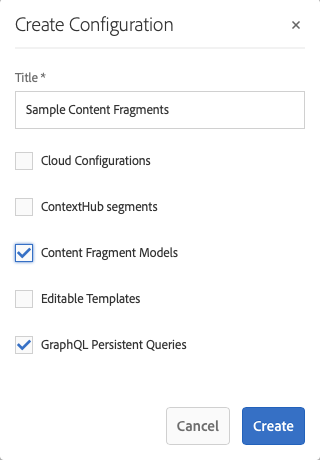

# Inhoudsfragmenten - Configuratiebrowser{#content-fragments-configuration-browser}

Leer hoe u bepaalde functionaliteit voor inhoudsfragmenten in de configuratiegrowser kunt inschakelen voor het gebruik van de krachtige functies voor koploze weergave van Adobe Experience Manager (AEM).

## Functionaliteit van inhoudsfragment inschakelen voor uw instantie {#enable-content-fragment-functionality-instance}

Alvorens Inhoudsfragmenten te gebruiken, gebruik Browser van de Configuratie **** om het volgende toe te laten:

* **Modellen van het Fragment van de Inhoud** - verplicht
* **de Blijvende Vragen van GraphQL** - facultatief

>[!CAUTION]
>
>Als u niet **Modellen van het Fragment van de Inhoud** toelaat:
>
>* **creeer** optie zal niet beschikbaar voor het creëren van modellen zijn.
>* u kunt niet [ de configuratie van Plaatsen selecteren om het verwante eind-punt ](/help/sites-developing/headless/graphql-api/graphql-endpoint.md#enabling-graphql-endpoint) tot stand te brengen.

U moet het volgende doen om de functionaliteit van inhoudsfragmenten in te schakelen:

* Het gebruik van de functionaliteit voor inhoudsfragmenten inschakelen via de configuratiebrowser
* De configuratie toepassen op uw Assets-map

### Functionaliteit van inhoudsfragment inschakelen in configuratievenster {#enable-content-fragment-functionality-in-configuration-browser}

Om [ bepaalde functionaliteit van het Fragment van de Inhoud ](#creating-a-content-fragment-model) te gebruiken, moet u **** eerst hen als **Browser van de Configuratie** toelaten:

>[!NOTE]
>
>Voor meer informatie, zie [ Browser van de Configuratie:](/help/sites-administering/configurations.md#using-configuration-browser).

1. Ga naar **Tools**, **Algemeen** en open vervolgens de **Browserconfiguratie**.

1. Het gebruik **creeert** om de dialoog te openen, waar u:

   1. Specificeer a **Titel**.
   1. Om hun gebruik toe te laten selecteer
      * **Modellen van contentfragmenten**
      * **de Blijvende Vragen van GraphQL**

      

1. Selecteer **creeer** om de definitie te bewaren.

<!-- 1. Select the location appropriate to your website. -->

### De configuratie toepassen op uw Assets-map {#apply-the-configuration-to-your-assets-folder}

Wanneer de configuratie **globale** voor de functionaliteit van het inhoudsfragment wordt toegelaten, dan op om het even welke omslag van Assets van toepassing is.

Als u andere configuraties (dus exclusief algemene configuraties) wilt gebruiken met een vergelijkbare Assets-map, moet u de verbinding definiëren. U doet dit door de juiste **Configuratie** te selecteren op het tabblad **Cloud Services** van de **Mapeigenschappen** van de juiste map.

 toe
