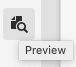

# Voorvertoning - JSON-representatie {#preview-json-representation}

Wanneer het ontwikkelen van de modellen voor de Fragmenten van de Inhoud als deel van uw AEM hoofdloze implementatie, zou u steekproefJSON output voor een inhoudsfragment kunnen willen bekijken, zoals die op een model wordt gebaseerd. Als u bijvoorbeeld wilt weten hoe de uiteindelijke uitvoer eruit zal zien. Dit kan handig zijn voor het valideren van de JSON-modelstructuur, bijvoorbeeld met standaardvoorbeeldinhoud per gegevenstype.

Met de **Voorvertoning** pictogram:

U kunt de JSON-weergave van het huidige fragment weergeven. Bijvoorbeeld:

<!--
**Copy URL** lets you copy to clipboard the URL for either author or publish.
-->
