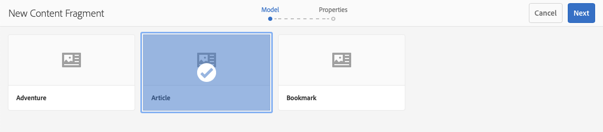
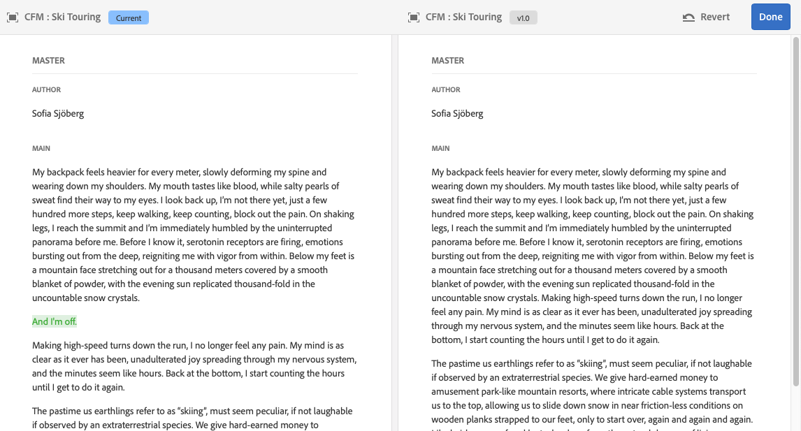

# Contentfragmenten beheren {#managing-content-fragments}

Leer hoe u de middelenconsole kunt gebruiken om uw AEM inhoudsfragmenten, de basis van uw inhoud zonder kop, te beheren.

Nadat u de [Content Fragment Models](#creating-a-content-model) hebt gedefinieerd, kunt u deze gebruiken om uw Content Fragments](#creating-a-content-fragment) te maken.[

De [Inhoudsfragmenteditor](#opening-the-fragment-editor) biedt verschillende [modi](#modes-in-the-content-fragment-editor) om u in staat te stellen:

* [De ](#editing-the-content-of-your-fragment) inhoud bewerken en Variaties  [beheren](#creating-and-managing-variations-within-your-fragment)
* [Uw fragment notities aanbrengen](/help/assets/content-fragments/content-fragments-variations.md#annotating-a-content-fragment)
* [Inhoud koppelen aan uw fragment](#associating-content-with-your-fragment)
* [De metagegevens configureren](#viewing-and-editing-the-metadata-properties-of-your-fragment)
* [De boomstructuur weergeven](/help/assets/content-fragments/content-fragments-structure-tree.md)
* [Voorvertoning van de JSON-representatie](/help/assets/content-fragments/content-fragments-json-preview.md)

>[!NOTE]
>
>Inhoudsfragmenten kunnen worden gebruikt:
>
>* bij het ontwerpen van pagina&#39;s; zie [Pagina-authoring met inhoudfragmenten](/help/sites-authoring/content-fragments.md).
>* voor [Koploze inhoudslevering met behulp van inhoudsfragmenten met GraphQL](/help/assets/content-fragments/content-fragments-graphql.md).

>[!NOTE]
>
>Inhoudsfragmenten worden opgeslagen als **Elementen**, zodat ze primair worden beheerd vanuit de **Assets**-console.

## Inhoudsfragmenten maken {#creating-content-fragments}

### Een inhoudsmodel maken {#creating-a-content-model}

[U kunt ](/help/assets/content-fragments/content-fragments-models.md) contentfragmentmodellen inschakelen en maken voordat u inhoudsfragmenten met gestructureerde inhoud maakt.

### Een inhoudsfragment maken {#creating-a-content-fragment}

De methode voor het maken van een inhoudsfragment is:

1. Ga naar de map **Assets** waar u het fragment wilt maken.
1. Selecteer **Maken** en vervolgens **Inhoudsfragment** om de wizard te openen.
1. In de eerste stap van de wizard moet u de basis van het nieuwe fragment opgeven.

   * [Model](/help/assets/content-fragments/content-fragments-models.md)  - gebruikt om een fragment tot stand te brengen dat gestructureerde inhoud vereist; bijvoorbeeld het  **** Adventuremodel

      * Alle beschikbare modellen worden weergegeven.

   Na selectie gebruikt u **Volgende** om door te gaan.

   

1. Geef in de stap **Eigenschappen** het volgende op:

   * **Basis**

      * **Titel**

         De fragmenttitel.

         Verplicht.

      * **Beschrijving**

      * **Tags**
   * **Geavanceerd**

      * **Naam**

         de naam; wordt gebruikt om de URL te vormen.

         Verplicht; wordt automatisch afgeleid van de titel, maar kan worden bijgewerkt.

1. Selecteer **Maken** om de actie te voltooien en **open** vervolgens het fragment voor het bewerken of keer terug naar de console met **Gereed**.

   >[!NOTE]
   >In de modus **List** van de console kunt u de **View Settings** bijwerken om de kolom **Content Fragment Model** in te schakelen.

## Handelingen voor een inhoudsfragment in de middelenconsole {#actions-for-a-content-fragment-assets-console}

In de **Assets** console is een reeks acties beschikbaar voor uw inhoudsfragmenten, of:

* van de werkbalk; nadat u het fragment hebt geselecteerd, zijn alle relevante handelingen beschikbaar.
* Als [snelle acties](/help/sites-authoring/basic-handling.md#quick-actions); een subset van acties beschikbaar voor de afzonderlijke fragmentkaarten.

Selecteer het fragment om de werkbalk weer te geven met de toepasselijke acties:

* **Downloaden**

   * Sla het fragment op als een ZIP-bestand. U kunt definiëren of u Elements, Variaties, Metagegevens wilt opnemen.

* **Maken**
* **Afhandeling**
* **Eigenschappen**

   * Hiermee kunt u de metagegevens van het fragment weergeven en/of bewerken.

* **Bewerken**

   * Hiermee kunt u het fragment [openen voor het bewerken van inhoud](/help/assets/content-fragments/content-fragments-variations.md) samen met de elementen, variaties, bijbehorende inhoud en metagegevens.

* **Tags beheren**
* **Naar verzameling**
* **Kopiëren**  (en  **Plakken**)
* **Verplaatsen**
* **Snel publiceren**
* **Publicatie beheren**
* **Verwijderen**

>[!NOTE]
>
>Veel hiervan zijn [standaardhandelingen voor elementen](/help/assets/manage-assets.md) en/of de [AEM-bureaubladtoepassing](https://helpx.adobe.com/experience-manager/desktop-app/aem-desktop-app.html).

## De fragmenteditor openen {#opening-the-fragment-editor}

Uw fragment openen voor bewerken:

>[!CAUTION]
>
>Als u een inhoudsfragment wilt bewerken, hebt u [de juiste machtigingen](/help/sites-developing/customizing-content-fragments.md#asset-permissions) nodig. Neem contact op met de systeembeheerder als er problemen optreden.

>[!CAUTION]
>
>U hebt de juiste machtigingen nodig om een inhoudsfragment te bewerken. Neem contact op met de systeembeheerder als er problemen optreden.

1. Met de console **Middelen** kunt u naar de locatie van het inhoudsfragment navigeren.
1. Open het fragment voor bewerking door:

   * Klikken of tikken op de fragment- of fragmentkoppeling (dit is afhankelijk van de consoleweergave).
   * Selecteer het fragment en **Bewerk** op de werkbalk.

1. De fragmenteditor wordt geopend. Breng de gewenste wijzigingen aan:

   

1. Nadat u wijzigingen hebt aangebracht, gebruikt u **Opslaan en sluiten**.

<!-- 
1. After making changes, use **Save**, **Save & close** or **Close** as required.

   >[!NOTE]
   >
   >**Save & close** is available via the **Save** dropdown.

   >[!NOTE]
   >
   >Both **Save & Close** and **Close** will exit the editor - see [Save, Close and Versions](#save-close-and-versions) for full information on how the various options operate for content fragments.
-->

## Modi en handelingen in de Inhoudsfragmenteditor {#modes-actions-content-fragment-editor}

Er zijn verschillende modi en acties beschikbaar in de Inhoudsfragmenteditor.

### Modi in de Content Fragment Editor {#modes-in-the-content-fragment-editor}

Navigeer door de verschillende modi met de pictogrammen in het zijpaneel:

* Variaties: [De inhoud bewerken](#editing-the-content-of-your-fragment) en [De variaties beheren](#creating-and-managing-variations-within-your-fragment)

* [Annotaties](/help/assets/content-fragments/content-fragments-variations.md#annotating-a-content-fragment)
* [Gekoppelde inhoud](#associating-content-with-your-fragment)
* [Metagegevens](#viewing-and-editing-the-metadata-properties-of-your-fragment)
* [Boomstructuur](/help/assets/content-fragments/content-fragments-structure-tree.md)
* [Voorvertoning](/help/assets/content-fragments/content-fragments-json-preview.md)

### Werkbalkhandelingen in de Inhoudsfragmenteditor {#toolbar-actions-in-the-content-fragment-editor}

Sommige functies in de bovenste werkbalk zijn beschikbaar in meerdere modi:

<!-- screenshot changed from original text see commented out below -->

* Er wordt een bericht weergegeven wanneer al naar het fragment wordt verwezen op een inhoudspagina. U kunt **Close** het bericht.

* Het zijpaneel kan worden verborgen/getoond gebruikend **Kneep van de Kant** pictogram.

* Onder de fragmentnaam ziet u de naam van het [Content Fragment Model](/help/assets/content-fragments/content-fragments-models.md) dat wordt gebruikt voor het maken van het huidige fragment:

   * De naam is ook een verbinding die de modelredacteur zal openen.

* Zie de status van het fragment; bijvoorbeeld informatie over het tijdstip waarop deze is gemaakt, gewijzigd of gepubliceerd.

* **Opslaan en sluiten**

<!--
Some features in the top toolbar are available from multiple modes:

* A message will be shown when the fragment is already referenced on a content page. You can **Close** the message.

* The side panel can be hidden/shown using the **Toggle Side Panel** icon.

* Underneath the fragment name you can see the name of the [Content Fragment Model](/help/assets/content-fragments/content-fragments-models.md) used for creating the current fragment:

  * The name is also a link that will open the model editor.

* See the status of the fragment; for example, information about when it was created, modified or published. The status is also color-coded:

  * **New**: grey
  * **Draft**: blue
  * **Published**: green
  * **Modified**: orange
  * **Deactivated**: red

* **Save** provides access to the **Save & close** option.
  
* The three dots (**...**) drop-down provides access to additional actions:
  * **Update page references**
    * This updates any page references. 
  * **[Quick publish](#publishing-and-referencing-a-fragment)**
  * **[Manage Publication](#publishing-and-referencing-a-fragment)**
-->

<!--
This updates any page references and ensures that the Dispatcher is flushed as required. -->

<!--
## Save, Close and Versions {#save-close-and-versions}

>[!NOTE]
>
>Versions can also be [created, compared and reverted from the Timeline](/help/assets/content-fragments/content-fragments-managing.md#timeline-for-content-fragments).

The editor has various options:

* **Save** and **Save & close**

  * **Save** will save the latest changes and remain in the editor.
  * **Save & close** will save the latest changes and exit the editor.

  >[!CAUTION]
  >
  >To edit a content fragment you need [the appropriate permissions](/help/sites-developing/customizing-content-fragments.md#asset-permissions). Please contact your system administrator if you are experiencing issues. 

  >[!NOTE]
  >
  >It is possible to remain in the editor, making a series of changes, before saving.

  >[!CAUTION]
  >
  >In addition to simply saving your changes, the actions also update any references and ensures that the Dispatcher is flushed as required. These changes can take time to process. Due to this, there can be a performance impact on a large/complex/heavily-loaded system.
  >
  >Please bear this in mind when using **Save & close** and then quickly re-entering the fragment editor to make and save further changes.

* **Close**

  Will exit the editor without saving the latest changes (i.e made since the last **Save**).

While editing your content fragment AEM automatically creates versions to ensure that prior content can be restored if you cancel your changes (using **Close** without saving):

1. When a content fragment is opened for editing AEM checks for the existence of the cookie-based token that indicates whether an *editing session* exists:

   1. If the token is found, the fragment is considered to be part of the existing editing session.
   2. If the token is *not* available and the user starts editing content, a version is created and a token for this new editing session is sent to the client, where it is saved in a cookie.

2. While there is an *active* editing session, the content being edited is automatically saved every 600 seconds (default).

   >[!NOTE]
   >
   >The auto save interval is configurable using the `/conf` mechanism.
   >
   >Default value, see:
   >&nbsp;&nbsp;`/libs/settings/dam/cfm/jcr:content/autoSaveInterval`

3. If the user cancels the edit, the version created at the start of the editing session is restored and the token is removed to end the editing session.
4. If the user selects to **Save** the edits, the updated elements/variations are persisted and the token is removed to end the editing session.
-->

## De inhoud van het fragment bewerken {#editing-the-content-of-your-fragment}

Nadat u het fragment hebt geopend, kunt u het tabblad [Variaties](/help/assets/content-fragments/content-fragments-variations.md) gebruiken om de inhoud te ontwerpen.

## Variaties maken en beheren in uw fragment {#creating-and-managing-variations-within-your-fragment}

Als u de Master inhoud hebt gemaakt, kunt u [Variaties](/help/assets/content-fragments/content-fragments-variations.md) van die inhoud maken en beheren.

## Inhoud koppelen aan uw fragment {#associating-content-with-your-fragment}

U kunt ook [inhoud](/help/assets/content-fragments/content-fragments-assoc-content.md) aan een fragment koppelen. Dit biedt een verbinding zodat elementen (d.w.z. afbeeldingen) (optioneel) met het fragment kunnen worden gebruikt wanneer het aan een inhoudspagina wordt toegevoegd.

## De metagegevens (eigenschappen) van het fragment weergeven en bewerken {#viewing-and-editing-the-metadata-properties-of-your-fragment}

U kunt de eigenschappen van een fragment weergeven en bewerken met het tabblad [Metagegevens](/help/assets/content-fragments/content-fragments-metadata.md).

## Tijdlijn voor inhoudsfragmenten {#timeline-for-content-fragments}

Naast de standaardopties biedt [Timeline](/help/assets/manage-assets.md#timeline) zowel informatie als acties die specifiek zijn voor inhoudsfragmenten:

* Informatie weergeven over versies, opmerkingen en annotaties
* Handelingen voor versies

   * **[Terugkeren naar deze versie](#reverting-to-a-version)**  (selecteer een bestaand fragment en selecteer vervolgens een specifieke versie)

   * **[Vergelijken met huidige](#comparing-fragment-versions)**  versie (selecteer een bestaand fragment en selecteer vervolgens een specifieke versie)

   * Een **Label** en/of **Opmerking** toevoegen (selecteer een bestaand fragment en selecteer vervolgens een specifieke versie)

   * **Opslaan als versie**  (selecteer een bestaand fragment en klik vervolgens op de pijl omhoog onder aan de tijdlijn)

* Handelingen voor annotaties

   * **Verwijderen**

>[!NOTE]
>
>Opmerkingen zijn:
>
>* Standaardfunctionaliteit voor alle elementen
>* Gemaakt in tijdlijn
>* Verwant aan het fragmentelement

>
>Annotaties (voor inhoudsfragmenten) zijn:
>
>* Opgegeven in de fragmenteditor
>* Specifiek voor een geselecteerd tekstsegment binnen het fragment

>

Bijvoorbeeld:

## Fragmentversies vergelijken {#comparing-fragment-versions}

De **Vergelijken met Huidige** actie is beschikbaar bij [Chronologie](/help/assets/content-fragments/content-fragments-managing.md#timeline-for-content-fragments) nadat u een specifieke versie hebt geselecteerd.

Hiermee wordt het volgende geopend:

* de **Huidige** (laatste) versie (links)

* de geselecteerde versie **v&lt;*x.y*** (rechts)

Zij worden naast elkaar weergegeven, waarbij:

* Eventuele verschillen worden gemarkeerd

   * Verwijderde tekst - rood
   * Ingevoegde tekst - groen
   * Vervangen tekst - blauw

* Met het pictogram voor volledig scherm kunt u elke versie afzonderlijk openen. dan terug naar de parallelle weergave
* U kunt **Terugkeren** naar de specifieke versie
* **** Donewill return you to the console

>[!NOTE]
>
>U kunt de fragmentinhoud niet bewerken wanneer u fragmenten vergelijkt.

## Een versie herstellen  {#reverting-to-a-version}

U kunt terugkeren naar een specifieke versie van het fragment:

* Rechtstreeks vanuit de [tijdlijn](/help/assets/content-fragments/content-fragments-managing.md#timeline-for-content-fragments).

   Selecteer de vereiste versie en kies vervolgens de handeling **Terugkeren naar deze versie**.

* Terwijl [het vergelijken van een versie aan de huidige versie](/help/assets/content-fragments/content-fragments-managing.md#comparing-fragment-versions) kunt u **terugkeren** aan de geselecteerde versie.

## Een fragment publiceren en ernaar verwijzen {#publishing-and-referencing-a-fragment}

>[!CAUTION]
>
>Als het fragment op een model is gebaseerd, moet u ervoor zorgen dat het [model is gepubliceerd](/help/assets/content-fragments/content-fragments-models.md#publishing-a-content-fragment-model).
>
>Als u een inhoudsfragment publiceert waarvoor het model nog niet is gepubliceerd, wordt dit in een selectielijst aangegeven en wordt het model met het fragment gepubliceerd.

Inhoudsfragmenten moeten worden gepubliceerd voor gebruik in de publicatieomgeving. Zij kunnen worden gepubliceerd:

* Na de aanmaak; het gebruiken van [acties beschikbaar in de console van Activa](#actions-for-a-content-fragment-assets-console).
* Vanuit de [Inhoudsfragmenteditor](#toolbar-actions-in-the-content-fragment-editor).
* Wanneer u [een pagina publiceert die het fragment](/help/sites-authoring/content-fragments.md#publishing) gebruikt; het fragment wordt weergegeven in de paginaverwijzingen.

>[!CAUTION]
>
>Nadat een fragment is gepubliceerd en/of waarnaar wordt verwezen, geeft AEM een waarschuwing weer wanneer een auteur het fragment opent om opnieuw te bewerken. Hiermee wordt u gewaarschuwd dat wijzigingen in het fragment ook van invloed zijn op de pagina&#39;s waarnaar wordt verwezen.

## Een fragment verwijderen {#deleting-a-fragment}

Een fragment verwijderen:

1. Navigeer in de **Assets**-console naar de locatie van het inhoudsfragment.
2. Selecteer het fragment.

   >[!NOTE]
   >
   >De handeling **Delete** is niet beschikbaar als een snelle handeling.

3. Selecteer **Delete** van de toolbar.
4. Bevestig de handeling **Delete**.

   >[!CAUTION]
   >
   >Als er al naar het fragment wordt verwezen op een pagina, wordt er een waarschuwingsbericht weergegeven en moet u bevestigen dat u wilt doorgaan met **Verwijderen forceren**. Het fragment wordt samen met de bijbehorende component voor contentfragmenten uit alle contentpagina&#39;s verwijderd.
