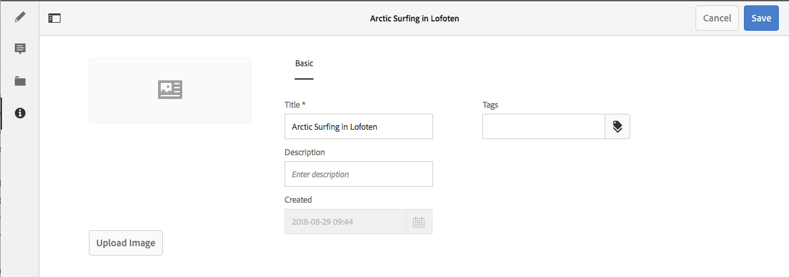

# Metagegevens - Fragmenteigenschappen{#metadata-fragment-properties}

## Eigenschappen/metagegevens bewerken {#editing-properties-meta-data}

U kunt de metagegevens (eigenschappen) voor inhoudsfragmenten weergeven en bewerken:

1. Navigeer in de **middelenconsole** naar de locatie van het inhoudsfragment.
1. Ofwel:

   * Selecteer [**Weergave-eigenschappen **om de dialoogvensters](/help/assets/managing-assets-touch-ui.md#editing-properties)te openen. Als u de weergave eenmaal hebt geopend, kunt u deze ook bewerken.
   * Open het [inhoudsfragment bij Bewerken](/help/assets/content-fragments/content-fragments-managing.md#opening-the-fragment-editor)en selecteer vervolgens **Metagegevens** in het zijpaneel.
   

1. Het tabblad **Standaard** bevat opties die u kunt weergeven of bewerken:

   * Miniatuur, waarvoor u de afbeelding kunt **uploaden**
   * **Titel**
   * **Beschrijving**
   * **Tags**
   * Gemaakt (alleen weergave)
   

