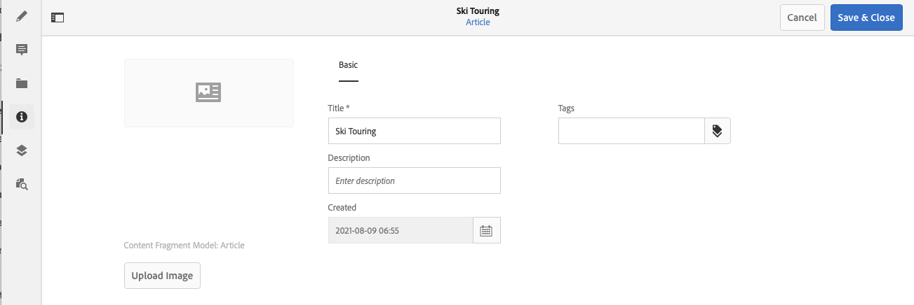

# Metagegevens - Fragmenteigenschappen {#metadata-fragment-properties}

Zie hoe u de eigenschappen van metagegevens voor Content Fragments in AEM kunt weergeven en bewerken om de inhoud zonder kop aan te passen.

## Eigenschappen/metagegevens bewerken {#editing-properties-meta-data}

U kunt de metagegevens (eigenschappen) voor inhoudsfragmenten weergeven en bewerken:

1. In de **Activa** navigeren naar de locatie van het inhoudsfragment.
2. Ofwel:

   * Selecteren [**Eigenschappen weergeven** om de dialoogvensters te openen](/help/assets/manage-assets.md#editing-properties). Als u de weergave eenmaal hebt geopend, kunt u deze ook bewerken.
   * Open het inhoudsfragment voor bewerking en selecteer vervolgens **Metagegevens** in het zijpaneel.

   

3. De **Basis** bevat opties die u kunt weergeven of bewerken:

   * Miniatuur, waarvoor u **Afbeelding uploaden**
   * **Inhoudsfragmentmodel** Hiermee wordt het model aangegeven waarmee het huidige fragment wordt gemaakt
   * **Titel**
   * **Beschrijving**
   * **Tags**
      * [Tags](/help/sites-authoring/tags.md) bijzonder krachtig zijn wanneer het organiseren van uw fragmenten aangezien zij voor inhoudclassificatie en taxonomie kunnen worden gebruikt. Tags kunnen worden gebruikt om inhoud (door tags) te zoeken en om bewerkingen in bulk toe te passen.
U kunt bijvoorbeeld relevante fragmenten labelen als &#39;kerstlancering&#39; om alleen deze fragmenten als een subset te kunnen doorbladeren, of om ze te kopiëren voor gebruik met een andere toekomstige start in een nieuwe map.

     >[!NOTE]
     >
     >**Tags** kan ook worden toegevoegd wanneer [ontwerpen van uw inhoud van de Variatie](/help/assets/content-fragments/content-fragments-variations.md#authoring-your-content) en wanneer [variaties maken](/help/assets/content-fragments/content-fragments-variations.md#creating-a-variation).

   * **Gemaakt** (alleen weergeven)

   Bijvoorbeeld:
   
