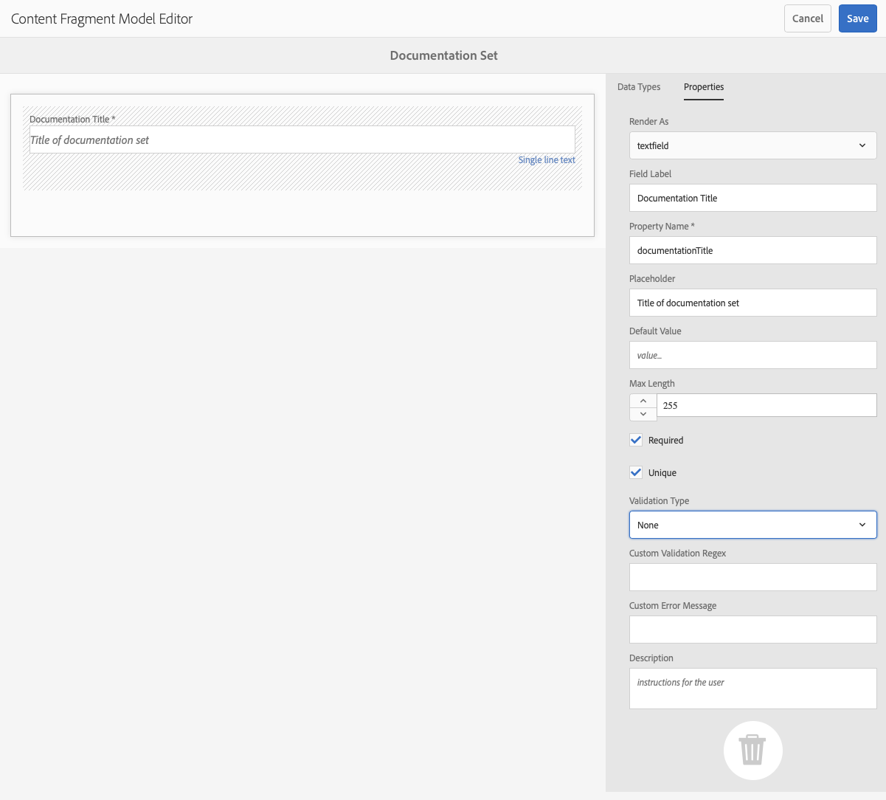
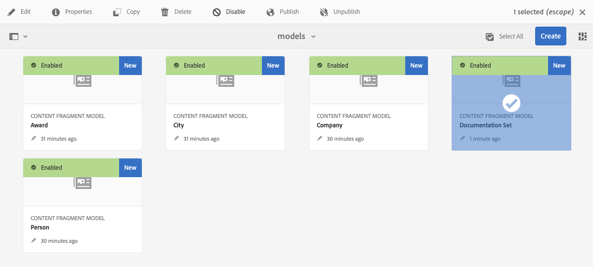

# Modellen van inhoudsfragmenten {#content-fragment-models}

Content Fragment Models in AEM de structuur van de inhoud voor uw [inhoudsfragmenten,](/help/assets/content-fragments/content-fragments.md) fungeren als basis voor uw inhoud zonder kop.

Als u modellen van inhoudsfragmenten wilt gebruiken, kunt u:

1. [Functionaliteit van inhoudsfragmentmodel inschakelen voor uw instantie](/help/assets/content-fragments/content-fragments-configuration-browser.md).
1. [Maken](#creating-a-content-fragment-model), en [vormen](#defining-your-content-fragment-model), uw modellen van inhoudsfragmenten.
1. [Modellen van inhoudsfragmenten inschakelen](#enabling-disabling-a-content-fragment-model) voor gebruik bij het maken van Content Fragments.
1. [Modellen van inhoudsfragmenten toestaan in de vereiste mappen Middelen](#allowing-content-fragment-models-assets-folder) door te vormen **Beleid**.

## Een inhoudsfragmentmodel maken {#creating-a-content-fragment-model}

1. Navigeren naar **Gereedschappen**, **Activa** en vervolgens openen **Modellen van inhoudsfragmenten**.
1. Navigeer naar de map die geschikt is voor uw [configuratie](/help/assets/content-fragments/content-fragments-configuration-browser.md).
1. Gebruiken **Maken** om de wizard te openen.

   >[!CAUTION]
   >
   >Als de [gebruik van inhoudsfragmentmodellen is niet ingeschakeld](/help/assets/content-fragments/content-fragments-configuration-browser.md)de **Maken** is niet beschikbaar.

1. Geef de **modeltitel** op. U kunt ook toevoegen **Tags**, **Beschrijving** en selecteert u **Model inschakelen** tot [het model inschakelen](#enabling-disabling-a-content-fragment-model) indien nodig.

   

1. Gebruiken **Maken** het lege model opslaan. Een bericht geeft het succes van de handeling aan. U kunt **Openen** het model onmiddellijk te bewerken, of **Gereed** om naar de console terug te keren.

## Het model van het inhoudsfragment definiëren {#defining-your-content-fragment-model}

Het inhoudsfragmentmodel definieert effectief de structuur van de resulterende inhoudsfragmenten met behulp van een selectie van **[Gegevenstypen](#data-types)**. Gebruikend de modelredacteur kunt u instanties van de gegevenstypes toevoegen, dan hen vormen om de vereiste gebieden tot stand te brengen:

>[!CAUTION]
>
>Het bewerken van een bestaand inhoudsfragmentmodel kan invloed hebben op afhankelijke fragmenten.

1. Navigeren naar **Gereedschappen**, **Activa** en vervolgens openen **Modellen van inhoudsfragmenten**.

1. Navigeer naar de map met het fragmentmodel van de inhoud.

1. Open het vereiste model voor **Bewerken**; gebruik de snelle actie of selecteer het model en vervolgens de actie op de werkbalk.

   Zodra open de modelredacteur toont:

   * links: velden al gedefinieerd
   * rechts: **datatypen** voor het maken van velden (en **eigenschappen** voor gebruik als er velden zijn gemaakt)

   >[!NOTE]
   >
   >Wanneer een veld als **Vereist** de **Label** aangegeven in het linkerdeelvenster is gemarkeerd met een asterix (**&#42;**).

   

1. **Een veld toevoegen**

   * Sleep een vereist gegevenstype naar de vereiste locatie voor een veld:

     

   * Nadat een veld aan het model is toegevoegd, wordt in het rechterdeelvenster het volgende weergegeven: **Eigenschappen** die voor dat bepaalde gegevenstype kunnen worden gedefinieerd. Hier kunt u definiëren wat voor dat veld is vereist.

      * Veel eigenschappen zijn niet-verklarend, voor meer details zie [Eigenschappen](#properties).
      * Een **Veldlabel** automatisch voltooit het **Eigenschapnaam**  - indien leeg, en het kan achteraf handmatig worden bijgewerkt.

        >[!CAUTION]
        >
        Wanneer u de eigenschap handmatig bijwerkt **Eigenschapnaam** voor een gegevenstype, moeten de namen slechts A-Z, a-z, 0-9, en het onderstrepingsteken &quot;_&quot;als speciaal karakter bevatten.
        >
        Als modellen die in eerdere versies van AEM zijn gemaakt, ongeldige tekens bevatten, verwijdert of werkt u die tekens bij.

     Bijvoorbeeld:

     

1. **Een veld verwijderen**

   Selecteer het vereiste veld en klik op het prullenbakpictogram. U wordt gevraagd de actie te bevestigen.

   

1. Voeg alle vereiste velden toe en definieer de bijbehorende eigenschappen, al naar gelang de vereisten. Bijvoorbeeld:

   

1. Selecteren **Opslaan** om de definitie te handhaven.

## Gegevenstypen {#data-types}

Voor het definiëren van uw model zijn verschillende gegevenstypen beschikbaar:

* **Tekst met één regel**
   * Voeg een of meer velden van één regel tekst toe. De maximumlengte kan worden gedefinieerd
* **Tekst met meerdere regels**
   * Een tekstgebied dat RTF-tekst, platte tekst of Markering kan zijn
* **Getal**
   * Een of meer numerieke velden toevoegen
* **Boolean**
   * Een Booleaans selectievakje toevoegen
* **Datum en tijd**
   * Een datum en/of tijd toevoegen
* **Opsomming**
   * Een set selectievakjes, keuzerondjes of vervolgkeuzelijsten toevoegen
* **Tags**
   * Hiermee kunnen auteurs van fragmenten gebieden met tags openen en selecteren
* **Content Reference**
   * Verwijzingen naar andere inhoud, van elk type; kan worden gebruikt voor [geneste inhoud maken](#using-references-to-form-nested-content)
   * Als er naar een afbeelding wordt verwezen, kunt u ervoor kiezen een miniatuur weer te geven
* **Fragmentverwijzing**
   * Verwijzingen naar andere inhoudsfragmenten; kan worden gebruikt om [geneste inhoud maken](#using-references-to-form-nested-content)
   * Het gegevenstype kan worden geconfigureerd om fragmentauteurs toe te staan:
      * Bewerk het fragment waarnaar wordt verwezen rechtstreeks.
      * Een inhoudsfragment maken op basis van het juiste model
* **JSON-object**
   * Hiermee kan de auteur van het inhoudsfragment JSON-syntaxis invoeren in de overeenkomende elementen van een fragment.
      * Om AEM toe te staan direct JSON op te slaan die u van een andere dienst hebt gekopieerd en gekleefd.
      * De JSON wordt doorgegeven en uitvoer als JSON in GraphQL.
      * Neemt JSON-syntaxismarkering, automatisch aanvullen en foutmarkering op in de inhoudsfragmenteditor.
* **Tijdelijke aanduiding voor tab**
   * Hiermee kunt u tabbladen invoeren die u kunt gebruiken bij het bewerken van de inhoud van het inhoudsfragment.
Dit wordt getoond als verdeler in de modelredacteur, die secties van de lijst van inhoudstypes scheidt. Elke instantie vertegenwoordigt het begin van een nieuw lusje.
In de fragmenteditor wordt elke instantie weergegeven als een tab.

     >[!NOTE]
     >
     Dit gegevenstype wordt alleen gebruikt voor opmaak en wordt genegeerd door het schema AEM GraphQL.

## Eigenschappen {#properties}

Vele eigenschappen zijn voor zichzelf verklarend, voor bepaalde eigenschappen zijn hieronder meer details te vinden:


* **Eigenschapnaam**

  Wanneer u deze eigenschap handmatig bijwerkt voor een gegevenstype, worden de namen **moet** bevatten *alleen* A-Z, a-z, 0-9, en het onderstrepingsteken &quot;_&quot; als speciaal karakter.

  >[!CAUTION]
  >
  Als modellen die in eerdere versies van AEM zijn gemaakt, ongeldige tekens bevatten, verwijdert of werkt u die tekens bij.

* **Renderen als**
De verschillende opties voor het realiseren/renderen van het veld in een fragment. Hier kunt u vaak definiëren of de auteur één instantie van het veld ziet of meerdere instanties mag maken.

* **Veldlabel**
Een **Veldlabel** automatisch een **Eigenschapnaam**, die indien nodig handmatig kan worden bijgewerkt.

* **Validatie**
De basisbevestiging is beschikbaar door mechanismen zoals **Vereist** eigenschap. Sommige gegevenstypen hebben aanvullende validatievelden. Zie [Validatie](#validation) voor nadere bijzonderheden.

* Voor het datatype **Tekst met meerdere regels** is het mogelijk het **standaardtype** als volgt te definiëren:

   * **RTF**
   * **Markering**
   * **Onbewerkte tekst**

  Indien niet opgegeven, wordt de standaardwaarde **RTF** wordt gebruikt voor dit veld.

  Het wijzigen van **Standaardtype** in een inhoudsfragmentmodel heeft alleen effect op een bestaand, verwant inhoudsfragment nadat dat fragment is geopend in de editor en opgeslagen.

* **Uniek**
De inhoud (voor het specifieke veld) moet uniek zijn in alle inhoudsfragmenten die op basis van het huidige model zijn gemaakt.

  Dit wordt gebruikt om ervoor te zorgen dat inhoudsauteurs geen inhoud kunnen herhalen die al in een ander fragment van hetzelfde model is toegevoegd.

  Bijvoorbeeld een **Tekst met één regel** veld aangeroepen `Country` in het inhoudsfragmentmodel kan de waarde niet hebben `Japan` in twee afhankelijke inhoudsfragmenten. Er wordt een waarschuwing weergegeven wanneer de tweede instantie wordt geprobeerd.

  >[!NOTE]
  >
  Er wordt gezorgd voor uniformiteit per taalwortel.

  >[!NOTE]
  >
  Variaties kunnen hetzelfde hebben *uniek* waarde als variaties van hetzelfde fragment, maar niet dezelfde waarde als bij variaties van andere fragmenten.

* Zie **[Content Reference](#content-reference)** voor meer details over dat specifieke gegevenstype en zijn eigenschappen.

* Zie **[Fragmentverwijzing (geneste fragmenten)](#fragment-reference-nested-fragments)** voor meer details over dat specifieke gegevenstype en zijn eigenschappen.

<!--
* **Translatable**
  Checking the **Translatable** checkbox on a field in the Content Fragment Model editor does the following:

  * Ensures that the field's property name is added to the translation configuration, context `/content/dam/<sites-configuration>`, if not already present. 
  * For GraphQL: sets a `<translatable>` property on the Content Fragment field to `yes`, to allow GraphQL query filter for JSON output with only translatable content.
-->

## Validatie {#validation}

Verschillende gegevenstypen bieden nu de mogelijkheid om validatievereisten te definiëren voor het tijdstip waarop inhoud wordt ingevoerd in het resulterende fragment:

* **Tekst met één regel**
   * Vergelijk met een vooraf gedefinieerde regex.
* **Getal**
   * Controleren op specifieke waarden.
* **Content Reference**
   * Testen op specifieke typen inhoud.
   * Er kan alleen worden verwezen naar elementen van een opgegeven bestandsgrootte of kleiner.
   * Er kan alleen worden verwezen naar afbeeldingen met een vooraf gedefinieerde breedte en/of hoogte (in pixels).
* **Fragmentverwijzing**
   * Testen op een specifiek inhoudsfragmentmodel.

## Referenties gebruiken om geneste inhoud te vormen {#using-references-to-form-nested-content}

Inhoudsfragmenten kunnen geneste inhoud vormen met een van de volgende gegevenstypen:

* **[Content Reference](#content-reference)**
   * Verstrekt een eenvoudige verwijzing naar andere inhoud; van om het even welk type.
   * Het kan voor één verwijzing of veelvoudige verwijzingen (in het resulterende fragment) worden gevormd.

* **[Fragmentverwijzing](#fragment-reference-nested-fragments)** (Geneste fragmenten)
   * Verwijzingen naar andere fragmenten, afhankelijk van de opgegeven modellen.
   * Hiermee kunt u gestructureerde gegevens opnemen/ophalen.

     >[!NOTE]
     >
     Deze methode is van bijzonder belang voor [Levering van inhoud zonder kop met gebruik van inhoudsfragmenten met GraphQL](/help/assets/content-fragments/content-fragments-graphql.md).
   * Het kan voor één verwijzing of veelvoudige verwijzingen (in het resulterende fragment) worden gevormd.

>[!NOTE]
>
AEM heeft een terugkerende bescherming voor:
>
* Inhoudsverwijzingen Hiermee voorkomt u dat de gebruiker een verwijzing naar het huidige fragment toevoegt. Dit kan leiden tot een leeg dialoogvenster van de kiezer voor fragmentverwijzing.
>
* Fragmentverwijzingen in GraphQL Als u een diepe query maakt die meerdere Content Fragments retourneert waarnaar door elkaar wordt verwezen, wordt null geretourneerd bij de eerste instantie.

### Content Reference {#content-reference}

Met de Content Reference kunt u inhoud van een andere bron renderen, bijvoorbeeld een afbeelding of een inhoudsfragment.

Naast de standaardeigenschappen kunt u opgeven:

* De **Hoofdpad** voor inhoud waarnaar wordt verwezen
* De inhoudstypen waarnaar kan worden verwezen
* Beperkingen voor bestandsgrootten
* Als naar een afbeelding wordt verwezen:
   * Miniatuur tonen
   * Hoogte- en breedtebeperkingen voor afbeeldingen


### Fragmentverwijzing (geneste fragmenten) {#fragment-reference-nested-fragments}

De fragmentverwijzing verwijst naar een of meer inhoudsfragmenten. Deze functie is vooral van belang wanneer u inhoud ophaalt die u in uw app wilt gebruiken, omdat u gestructureerde gegevens met meerdere lagen kunt ophalen.

Bijvoorbeeld:

* Een model dat details voor een werknemer bepaalt; deze omvatten:
   * Een verwijzing naar het model dat de werkgever (onderneming) definieert

```xml
type EmployeeModel {
    name: String
    firstName: String
    company: CompanyModel
}

type CompanyModel {
    name: String
    street: String
    city: String
}
```

>[!NOTE]
>
Dit is van bijzonder belang voor [Levering van inhoud zonder kop met gebruik van inhoudsfragmenten met GraphQL](/help/assets/content-fragments/content-fragments-graphql.md).

Naast de standaardeigenschappen kunt u definiëren:

* **Renderen als**:

   * **multifield** - de auteur van het fragment kan meerdere, afzonderlijke, verwijzingen maken

   * **fragmentreference** - Hiermee kan de auteur van het fragment één verwijzing naar een fragment selecteren

* **Modeltype**
U kunt meerdere modellen selecteren. Bij het ontwerpen van het inhoudsfragment moeten fragmenten waarnaar wordt verwezen, met deze modellen zijn gemaakt.

* **Hoofdpad**
Geeft een hoofdpad aan voor alle fragmenten waarnaar wordt verwezen.

* **Fragment maken toestaan**

  Hierdoor kan de auteur van het fragment een fragment maken op basis van het juiste model.

   * **fragmentreferencecomponent** - stelt de auteur van het fragment in staat een samenstelling samen te stellen door meerdere fragmenten te selecteren

  

>[!NOTE]
>
Er is een terugkerend beschermingsmechanisme ingesteld. Hiermee wordt de gebruiker verboden het huidige inhoudsfragment in de fragmentverwijzing te selecteren. Dit kan leiden tot een leeg dialoogvenster van de kiezer voor fragmentverwijzing.
>
Er is ook een herhalingsbescherming voor fragmentverwijzingen in GraphQL. Als u een diepe vraag over twee Fragments creeert van de Inhoud die elkaar van verwijzingen voorzien, keert het ongeldig terug.

## Een inhoudsfragmentmodel in- of uitschakelen {#enabling-disabling-a-content-fragment-model}

Voor volledige controle over het gebruik van uw modellen van het Fragment van de Inhoud, hebben zij een status die u kunt plaatsen.

### Een inhoudsfragmentmodel inschakelen {#enabling-a-content-fragment-model}

Nadat een model is gemaakt, moet het zijn ingeschakeld zodat:

* Deze kan worden geselecteerd wanneer u een inhoudsfragment maakt.
* Er kan vanuit een inhoudsfragmentmodel naar worden verwezen.
* Deze is beschikbaar voor GraphQL. Het schema wordt dus gegenereerd.

Een model inschakelen dat is gemarkeerd als:

* **Concept** : mew (nooit ingeschakeld).
* **Uitgeschakeld** : is uitgeschakeld.

U kunt de **Inschakelen** optie van:

* De bovenste werkbalk als het vereiste model is geselecteerd.
* De corresponderende snelle actie (mouse-over het vereiste model).


### Een inhoudsfragmentmodel uitschakelen {#disabling-a-content-fragment-model}

Een model kan ook worden uitgeschakeld, zodat:

* Het model is niet meer beschikbaar als basis voor het maken van *new* Inhoudsfragmenten
* Echter:
   * Het GraphQL-schema wordt steeds gegenereerd en kan nog steeds worden opgevraagd (om geen invloed op de JSON API te hebben).
   * Om het even welke die Inhoudsfragmenten van het model worden gebaseerd kunnen nog van het eindpunt van GraphQL worden gevraagd en zijn teruggekeerd.
* Er kan niet meer naar het model worden verwezen, maar bestaande verwijzingen blijven ongewijzigd en kunnen nog steeds worden opgevraagd en geretourneerd vanaf het GraphQL-eindpunt.

Een model uitschakelen dat is gemarkeerd als **Ingeschakeld**, gebruikt u de **Uitschakelen** optie van:

* De bovenste werkbalk als het vereiste model is geselecteerd.
* De corresponderende snelle actie (mouse-over het vereiste model).



## Modellen voor inhoudsfragmenten toestaan in de middelenmap {#allowing-content-fragment-models-assets-folder}

Om inhoudsbeheer uit te voeren, kunt u vormen **Beleid** in een map Middelen om te bepalen welke modellen van inhoudsfragmenten mogen worden gemaakt voor fragmenten in die map.

>[!NOTE]
>
Het mechanisme lijkt op [toestaan, van paginasjablonen](/help/sites-authoring/templates.md#allowing-a-template-author) voor een pagina en de onderliggende elementen, in geavanceerde eigenschappen van een pagina.

Om te vormen **Beleid** for **Modellen voor toegestane inhoudsfragmenten**:

1. Navigeren en openen **Eigenschappen** voor de map met vereiste middelen.

1. Open de **Beleid** tab, waar u kunt configureren:

   * **Overgenomen van`<folder>`**

     Het beleid wordt automatisch geërft wanneer het creëren van kindomslagen; het beleid kan (en de erfenis gebroken) worden opnieuw gevormd als de subomslagen modellen moeten toestaan verschillend aan de ouderomslag.

   * **Modellen van inhoudsfragmenten op pad toestaan**

     U kunt meerdere modellen toestaan.

   * **Modellen voor inhoudsfragmenten zijn toegestaan op tag**

     U kunt meerdere modellen toestaan.

   

1. **Opslaan** eventuele wijzigingen.

De modellen van inhoudsfragmenten die zijn toegestaan voor een map, worden als volgt opgelost:

* De **Beleid** for **Modellen voor toegestane inhoudsfragmenten**.
* Als dit leeg is, kunt u het beleid bepalen met behulp van de overervingsregels.
* Als de overervingsketen geen resultaat oplevert, kijkt u naar de **Cloud Servicen** configuratie voor die map (ook eerst rechtstreeks en vervolgens via overerving).
* Als geen van de bovenstaande resultaten worden behaald, zijn er geen modellen toegestaan voor die map.

## Een inhoudsfragmentmodel verwijderen {#deleting-a-content-fragment-model}

>[!CAUTION]
>
Het verwijderen van een inhoudsfragmentmodel kan invloed hebben op afhankelijke fragmenten.

Een inhoudsfragmentmodel verwijderen:

1. Navigeren naar **Gereedschappen**, **Activa** en vervolgens openen **Modellen van inhoudsfragmenten**.

1. Navigeer naar de map met het fragmentmodel van de inhoud.
1. Selecteer uw model, gevolgd door **Verwijderen** op de werkbalk.

   >[!NOTE]
   >
   Als naar het model wordt verwezen, wordt een waarschuwing gegeven. Voer de nodige maatregelen uit.

## Een inhoudsfragmentmodel publiceren {#publishing-a-content-fragment-model}

Inhoudsfragmentmodellen moeten worden gepubliceerd wanneer/voordat afhankelijke inhoudsfragmenten worden gepubliceerd.

Een fragmentmodel voor inhoud publiceren:

1. Navigeren naar **Gereedschappen**, **Activa** en vervolgens openen **Modellen van inhoudsfragmenten**.

1. Navigeer naar de map met het fragmentmodel van de inhoud.
1. Selecteer uw model, gevolgd door **Publiceren** op de werkbalk.
De gepubliceerde status wordt vermeld in de console.

   >[!NOTE]
   >
   Als u een inhoudsfragment publiceert waarvoor het model nog niet is gepubliceerd, geeft een selectielijst dit aan en wordt het model gepubliceerd met het fragment.

## Publicatie van een inhoudsfragmentmodel ongedaan maken {#unpublishing-a-content-fragment-model}

Inhoudsfragmentmodellen kunnen ongepubliceerd zijn als naar deze modellen niet wordt verwezen door fragmenten.

Publicatie van een inhoudsfragmentmodel ongedaan maken:

1. Navigeren naar **Gereedschappen**, **Activa** en vervolgens openen **Modellen van inhoudsfragmenten**.

1. Navigeer naar de map met het fragmentmodel van de inhoud.
1. Selecteer uw model, gevolgd door **Publiceren ongedaan maken** op de werkbalk.
De gepubliceerde status wordt vermeld in de console.

## Inhoudsfragmentmodel - eigenschappen {#content-fragment-model-properties}

U kunt de **Eigenschappen** van een inhoudsfragmentmodel:

* **Basis**
   * **Modeltitel**
   * **Tags**
   * **Beschrijving**
   * **Afbeelding uploaden**
