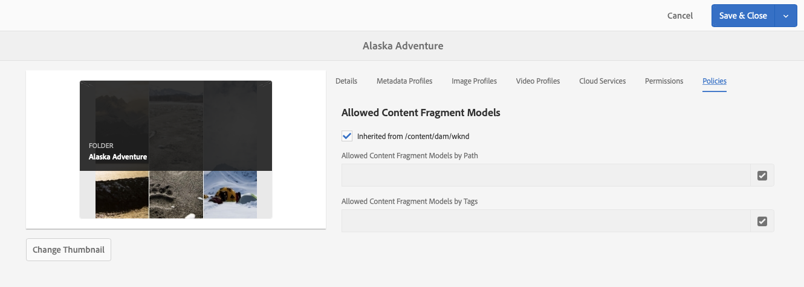

# Modellen van inhoudsfragmenten {#content-fragment-models}

De Modellen van het Fragment van de inhoud in AEM bepalen de structuur van inhoud voor uw [ inhoudsfragmenten, ](/help/assets/content-fragments/content-fragments.md) dienend als stichting van uw inhoud zonder kop.

Als u modellen van inhoudsfragmenten wilt gebruiken, kunt u:

1. [ laat de modelfunctionaliteit van het Fragment van de Inhoud voor uw instantie ](/help/assets/content-fragments/content-fragments-configuration-browser.md) toe.
1. [ creeer ](#creating-a-content-fragment-model), en [ vorm ](#defining-your-content-fragment-model), uw Modellen van het Fragment van de Inhoud.
1. [ laat uw Modellen van het Fragment van de Inhoud ](#enabling-disabling-a-content-fragment-model) voor gebruik toe wanneer het creëren van de Fragmenten van de Inhoud.
1. [ sta uw Modellen van het Fragment van de Inhoud op de vereiste omslagen van Assets ](#allowing-content-fragment-models-assets-folder) toe door **Beleid** te vormen.

## Een inhoudsfragmentmodel maken {#creating-a-content-fragment-model}

1. Navigeer aan **Hulpmiddelen**, **Assets**, dan open **Modellen van het Fragment van de Inhoud**.
1. Navigeer aan de omslag aangewezen aan uw [ configuratie ](/help/assets/content-fragments/content-fragments-configuration-browser.md).
1. Het gebruik **creeert** om de tovenaar te openen.

   >[!CAUTION]
   >
   >Als het [ gebruik van de modellen van het inhoudsfragment niet ](/help/assets/content-fragments/content-fragments-configuration-browser.md) is toegelaten, **creeer** optie is niet beschikbaar.

1. Geef de **modeltitel** op. U kunt **Markeringen**, a **Beschrijving** ook toevoegen, en **selecteren laat model** toe [ om het model ](#enabling-disabling-a-content-fragment-model) indien nodig toe te laten.

   

1. Het gebruik **creeert** om het lege model te bewaren. Een bericht wijst op het succes van de actie, kunt u **Open** selecteren om het model onmiddellijk uit te geven, of **Gedaan** om aan de console terug te keren.

## Het model van het inhoudsfragment definiëren {#defining-your-content-fragment-model}

Het model van het inhoudsfragment bepaalt effectief de structuur van de resulterende inhoudsfragmenten gebruikend een selectie van **[Types van Gegevens](#data-types)**. Gebruikend de modelredacteur kunt u instanties van de gegevenstypes toevoegen, dan hen vormen om de vereiste gebieden tot stand te brengen:

>[!CAUTION]
>
>Het bewerken van een bestaand inhoudsfragmentmodel kan invloed hebben op afhankelijke fragmenten.

1. Navigeer aan **Hulpmiddelen**, **Assets**, dan open **Modellen van het Fragment van de Inhoud**.

1. Navigeer naar de map met het fragmentmodel van de inhoud.

1. Open het vereiste model voor **uitgeven**; gebruik of de snelle actie, of selecteer het model en toen de actie van de toolbar.

   Zodra open de modelredacteur toont:

   * links: velden al gedefinieerd
   * rechts: **datatypen** voor het maken van velden (en **eigenschappen** voor gebruik als er velden zijn gemaakt)

   >[!NOTE]
   >
   >Wanneer een gebied zoals **Vereist**, wordt het **Etiket** vermeld in de linkerruit duidelijk met een asterix (**&#42;**).

   

1. **om een Gebied** toe te voegen

   * Sleep een vereist gegevenstype naar de vereiste locatie voor een veld:

     

   * Zodra een gebied aan het model is toegevoegd, toont het juiste paneel de **Eigenschappen** die voor dat bepaalde gegevenstype kunnen worden bepaald. Hier kunt u definiëren wat voor dat veld is vereist.

      * Vele eigenschappen zijn duidelijk-verklarend, voor extra details zie [ Eigenschappen ](#properties).
      * Het typen a **Etiket van het Gebied** auto-voltooit de **Naam van het Bezit** - als leeg, en het kan achteraf manueel worden bijgewerkt.

        >[!CAUTION]
        >
        >Wanneer manueel het bijwerken van de naam van het bezit **&#x200B;**&#x200B;voor een gegevenstype, moeten de namen slechts a-z, a-z, 0-9, en het onderstrepingsteken &quot;_&quot;als speciaal karakter bevatten.
        >
        >Als modellen die in eerdere versies van AEM zijn gemaakt, ongeldige tekens bevatten, verwijdert of werkt u die tekens bij.

     Bijvoorbeeld:

     

1. **om een Gebied** te verwijderen

   Selecteer het vereiste veld en klik op het prullenbakpictogram. U wordt gevraagd de actie te bevestigen.

   

1. Voeg alle vereiste velden toe en definieer de bijbehorende eigenschappen, al naar gelang de vereisten. Bijvoorbeeld:

   

1. Selecteer **sparen** om de definitie voort te zetten.

## Gegevenstypen {#data-types}

Voor het definiëren van uw model zijn verschillende gegevenstypen beschikbaar:

* **Enige lijntekst**
   * Voeg een of meer velden van één regel tekst toe. De maximumlengte kan worden gedefinieerd
* **Meerdere lijntekst**
   * Een tekstgebied dat RTF-tekst, platte tekst of Markering kan zijn

     >[!NOTE]
     >
     >Vanwege de prestaties is het niet raadzaam meer dan tien RTF-velden in één model op te nemen.
     >
     >Indien nodig, wordt het geadviseerd dat u [ genestelde Fragments van de Inhoud ](#fragment-reference-nested-fragments) gebruikt.

* **Aantal**
   * Een of meer numerieke velden toevoegen
* **Van Boole**
   * Een Booleaans selectievakje toevoegen
* **Datum en tijd**
   * Een datum en/of tijd toevoegen
* **Opsomming**
   * Een set selectievakjes, keuzerondjes of vervolgkeuzelijsten toevoegen
* **Markeringen**
   * Hiermee kunnen auteurs van fragmenten gebieden met tags openen en selecteren
* **Verwijzing van de Inhoud**
   * Verwijzingen andere inhoud, van om het even welk type; kan worden gebruikt om [ te creëren genestelde inhoud ](#using-references-to-form-nested-content)
   * Als er naar een afbeelding wordt verwezen, kunt u ervoor kiezen een miniatuur weer te geven
* **Verwijzing van het Fragment**
   * Verwijzingen andere inhoudsfragmenten; kan worden gebruikt om [ te creëren genestelde inhoud ](#using-references-to-form-nested-content)
   * Het gegevenstype kan worden geconfigureerd om fragmentauteurs toe te staan:
      * Bewerk het fragment waarnaar wordt verwezen rechtstreeks.
      * Een inhoudsfragment maken op basis van het juiste model
* **voorwerp JSON**
   * Hiermee kan de auteur van het inhoudsfragment JSON-syntaxis invoeren in de overeenkomende elementen van een fragment.
      * AEM toestaan direct JSON op te slaan dat u hebt gekopieerd en geplakt van een andere service.
      * De JSON wordt doorgegeven en uitvoer als JSON in GraphQL.
      * Neemt JSON-syntaxismarkering, automatisch aanvullen en foutmarkering op in de inhoudsfragmenteditor.
* **Placeholder van het Lusje**
   * Hiermee kunt u tabbladen invoeren die u kunt gebruiken bij het bewerken van de inhoud van het inhoudsfragment.
Dit wordt getoond als verdeler in de modelredacteur, die secties van de lijst van inhoudstypes scheidt. Elke instantie vertegenwoordigt het begin van een nieuw lusje.
In de fragmenteditor wordt elke instantie weergegeven als een tab.

     >[!NOTE]
     >
     >Dit gegevenstype wordt alleen gebruikt voor opmaak en wordt genegeerd door het AEM GraphQL-schema.

## Eigenschappen {#properties}

Vele eigenschappen zijn voor zichzelf verklarend, voor bepaalde eigenschappen zijn hieronder meer details te vinden:


* **de Naam van het Bezit**

  Wanneer manueel het bijwerken van dit bezit voor een gegevenstype, moeten de namen **&#x200B;**&#x200B;*slechts* a-z, a-z, 0-9, en het onderstrepingsteken &quot;_&quot;als speciaal karakter bevatten.

  >[!CAUTION]
  >
  >Als modellen die in eerdere versies van AEM zijn gemaakt, ongeldige tekens bevatten, verwijdert of werkt u die tekens bij.

* **geeft terug als**
De verschillende opties voor het realiseren/renderen van het veld in een fragment. Hier kunt u vaak definiëren of de auteur één instantie van het veld ziet of meerdere instanties mag maken.

* **Etiket van het Gebied**
Het ingaan van het Etiket van het a **Gebied** autogenerate a **Naam van het Bezit**, die dan manueel kan worden bijgewerkt, indien nodig.

* **Bevestiging**
De fundamentele bevestiging is beschikbaar door mechanismen zoals het **Vereiste** bezit. Sommige gegevenstypen hebben aanvullende validatievelden. Zie [ Bevestiging ](#validation) voor verdere details.

* Voor het datatype **Tekst met meerdere regels** is het mogelijk het **standaardtype** als volgt te definiëren:

   * **Rijke Tekst**
   * **Markering**
   * **Onbewerkte Tekst**

  Als gespecificeerd niet, wordt de standaardwaarde **Rijke Tekst** gebruikt voor dit gebied.

  Het veranderen van het **StandaardType** in een model van het inhoudsfragment neemt slechts op een bestaand, verwant, inhoudsfragment van kracht nadat dat fragment in de redacteur wordt geopend en wordt bewaard.

* **Uniek**
De inhoud (voor het specifieke veld) moet uniek zijn in alle inhoudsfragmenten die op basis van het huidige model zijn gemaakt.

  Dit wordt gebruikt om ervoor te zorgen dat inhoudsauteurs geen inhoud kunnen herhalen die al in een ander fragment van hetzelfde model is toegevoegd.

  Bijvoorbeeld, het 1&rbrace; gebied van de a **Enige lijntekst &lbrace;in het Model van het Fragment van de Inhoud kan niet de waarde `Japan` in twee afhankelijke Fragmenten van de Inhoud hebben.**`Country` Er wordt een waarschuwing weergegeven wanneer de tweede instantie wordt geprobeerd.

  >[!NOTE]
  >
  >Er wordt gezorgd voor uniformiteit per taalwortel.

  >[!NOTE]
  >
  >De variaties kunnen de zelfde *unieke* waarde zoals variaties van het zelfde fragment hebben, maar niet de zelfde waarde zoals die in om het even welke variatie van andere fragmenten wordt gebruikt.

* Zie **[Verwijzing van de Inhoud](#content-reference)** voor meer details over dat specifieke gegevenstype en zijn eigenschappen.

* Zie **[Verwijzing van het Fragment (Genestelde Fragments)](#fragment-reference-nested-fragments)** voor meer details over dat specifieke gegevenstype en zijn eigenschappen.

<!--
* **Translatable**
  Checking the **Translatable** checkbox on a field in the Content Fragment Model editor does the following:

  * Ensures that the field's property name is added to the translation configuration, context `/content/dam/<sites-configuration>`, if not already present. 
  * For GraphQL: sets a `<translatable>` property on the Content Fragment field to `yes`, to allow GraphQL query filter for JSON output with only translatable content.
-->

## Validatie {#validation}

Verschillende gegevenstypen bieden nu de mogelijkheid om validatievereisten te definiëren voor het tijdstip waarop inhoud wordt ingevoerd in het resulterende fragment:

* **Enige lijntekst**
   * Vergelijk met een vooraf gedefinieerde regex.
* **Aantal**
   * Controleren op specifieke waarden.
* **Verwijzing van de Inhoud**
   * Testen op specifieke typen inhoud.
   * Er kan alleen worden verwezen naar elementen van een opgegeven bestandsgrootte of kleiner.
   * Er kan alleen worden verwezen naar afbeeldingen met een vooraf gedefinieerde breedte en/of hoogte (in pixels).
* **Verwijzing van het Fragment**
   * Testen op een specifiek inhoudsfragmentmodel.

## Referenties gebruiken om geneste inhoud te vormen {#using-references-to-form-nested-content}

Inhoudsfragmenten kunnen geneste inhoud vormen met een van de volgende gegevenstypen:

* **[Verwijzing van de Inhoud](#content-reference)**
   * Verstrekt een eenvoudige verwijzing naar andere inhoud; van om het even welk type.
   * Het kan voor één verwijzing of veelvoudige verwijzingen (in het resulterende fragment) worden gevormd.

* **[Verwijzing van het Fragment](#fragment-reference-nested-fragments)** (Geneste Fragmenten)
   * Verwijzingen naar andere fragmenten, afhankelijk van de opgegeven modellen.
   * Hiermee kunt u gestructureerde gegevens opnemen/ophalen.

     >[!NOTE]
     >
     >Deze methode is van bijzonder belang met [ Hoofdloze Levering van de Inhoud gebruikend de Fragmenten van de Inhoud met GraphQL ](/help/assets/content-fragments/content-fragments-graphql.md).
   * Het kan voor één verwijzing of veelvoudige verwijzingen (in het resulterende fragment) worden gevormd.

>[!NOTE]
>
>AEM heeft een terugkerende bescherming voor:
>
>* Content References
>Zo voorkomt u dat de gebruiker een verwijzing naar het huidige fragment toevoegt. Dit kan leiden tot een leeg dialoogvenster van de kiezer voor fragmentverwijzing.
>
>* Fragmentverwijzingen in GraphQL
>Wanneer u een diepe query maakt die meerdere Content Fragments retourneert waarnaar door elkaar wordt verwezen, retourneert deze functie null bij de eerste instantie.

### Content Reference {#content-reference}

Met de Content Reference kunt u inhoud van een andere bron renderen, bijvoorbeeld een afbeelding of een inhoudsfragment.

Naast de standaardeigenschappen kunt u opgeven:

* Het **Weg van de Wortel** voor om het even welke referenced inhoud
* De inhoudstypen waarnaar kan worden verwezen
* Beperkingen voor bestandsgrootten
* Als naar een afbeelding wordt verwezen:
   * Miniatuur tonen
   * Hoogte- en breedtebeperkingen voor afbeeldingen


### Fragmentverwijzing (geneste fragmenten) {#fragment-reference-nested-fragments}

De fragmentverwijzing verwijst naar een of meer inhoudsfragmenten. Deze functie is vooral van belang wanneer u inhoud ophaalt die u in uw app wilt gebruiken, omdat u gestructureerde gegevens met meerdere lagen kunt ophalen.

Bijvoorbeeld:

* Een model dat details voor een werknemer bepaalt; deze omvatten:
   * Een verwijzing naar het model dat de werkgever (onderneming) definieert

```xml
type EmployeeModel {
    name: String
    firstName: String
    company: CompanyModel
}

type CompanyModel {
    name: String
    street: String
    city: String
}
```

>[!NOTE]
>
>Dit is van bijzonder belang met [ Hoofdloze Levering van de Inhoud gebruikend de Fragmenten van de Inhoud met GraphQL ](/help/assets/content-fragments/content-fragments-graphql.md).

Naast de standaardeigenschappen kunt u definiëren:

* **geeft terug als**:

   * **multifield** - de fragmentauteur kan veelvoudige, individuele, verwijzingen creëren

   * **fragmentreference** - staat de fragmentauteur toe om één enkele verwijzing naar een fragment te selecteren

* **ModelType**
U kunt meerdere modellen selecteren. Bij het ontwerpen van het inhoudsfragment moeten fragmenten waarnaar wordt verwezen, met deze modellen zijn gemaakt.

* **Weg van de Wortel**
Geeft een hoofdpad aan voor alle fragmenten waarnaar wordt verwezen.

* **staat het Maken van het Fragment toe**

  Hierdoor kan de auteur van het fragment een fragment maken op basis van het juiste model.

   * **fragmentreferencecomposite** - staat de fragmentauteur toe om een samenstelling te bouwen, door veelvoudige fragmenten te selecteren

  

>[!NOTE]
>
>Er is een terugkerend beschermingsmechanisme ingesteld. Hiermee wordt de gebruiker verboden het huidige inhoudsfragment in de fragmentverwijzing te selecteren. Dit kan leiden tot een leeg dialoogvenster van de kiezer voor fragmentverwijzing.
>
>Er is ook een herhalingsbescherming voor fragmentverwijzingen in GraphQL. Als u een diepe vraag over twee Fragments creeert van de Inhoud die elkaar van verwijzingen voorzien, keert het ongeldig terug.

## Een inhoudsfragmentmodel in- of uitschakelen {#enabling-disabling-a-content-fragment-model}

Voor volledige controle over het gebruik van uw modellen van het Fragment van de Inhoud, hebben zij een status die u kunt plaatsen.

### Een inhoudsfragmentmodel inschakelen {#enabling-a-content-fragment-model}

Nadat een model is gemaakt, moet het zijn ingeschakeld zodat:

* Deze kan worden geselecteerd wanneer u een inhoudsfragment maakt.
* Er kan vanuit een inhoudsfragmentmodel naar worden verwezen.
* Deze is beschikbaar voor GraphQL. Het schema wordt dus gegenereerd.

Een model inschakelen dat is gemarkeerd als:

* **Ontwerp** : mw (nooit toegelaten).
* **Gehandicapten** : is onbruikbaar gemaakt.

U kunt **gebruiken laat** optie van toe of:

* De bovenste werkbalk als het vereiste model is geselecteerd.
* De corresponderende snelle actie (mouse-over het vereiste model).

 toe

### Een inhoudsfragmentmodel uitschakelen {#disabling-a-content-fragment-model}

Een model kan ook worden uitgeschakeld, zodat:

* Het model is niet meer beschikbaar als basis voor het creëren van *nieuwe* Fragmenten van de Inhoud.
* Echter:
   * Het GraphQL-schema wordt steeds gegenereerd en kan nog steeds worden opgevraagd (om geen invloed op de JSON API te hebben).
   * Om het even welke die Inhoudsfragmenten van het model worden gebaseerd kunnen nog van het eindpunt van GraphQL worden gevraagd en zijn teruggekeerd.
* Er kan niet meer naar het model worden verwezen, maar bestaande verwijzingen blijven ongewijzigd en kunnen nog steeds worden opgevraagd en geretourneerd vanaf het GraphQL-eindpunt.

Om een Model onbruikbaar te maken dat als **Toegelaten** wordt gemarkeerd, gebruikt u **onbruikbaar maken** optie van of:

* De bovenste werkbalk als het vereiste model is geselecteerd.
* De corresponderende snelle actie (mouse-over het vereiste model).

 onbruikbaar

## Modellen voor inhoudsfragmenten toestaan in uw Assets-map {#allowing-content-fragment-models-assets-folder}

Om inhoudsbeheer uit te voeren, kunt u **Beleid** op een omslag van Assets vormen om te controleren welke Modellen van het Fragment van de Inhoud voor de verwezenlijking van het Fragment in die omslag worden toegestaan.

>[!NOTE]
>
>Het mechanisme is gelijkaardig aan [ toestaand paginasjablonen ](/help/sites-authoring/templates.md#allowing-a-template-author) voor een pagina, en zijn kinderen, in geavanceerde eigenschappen van een pagina.

Om het **Beleid** voor **toegelaten Modellen van het Fragment van de Inhoud te vormen**:

1. Navigeer en open **Eigenschappen** voor de vereiste omslag van Assets.

1. Open het **Beleid** lusje, waar u kunt vormen:

   * **Overgenomen van`<folder>`**

     Het beleid wordt automatisch geërft wanneer het creëren van kindomslagen; het beleid kan (en de erfenis gebroken) worden opnieuw gevormd als de subomslagen modellen moeten toestaan verschillend aan de ouderomslag.

   * **Toegestane Modellen van het Fragment van de Inhoud door Weg**

     U kunt meerdere modellen toestaan.

   * **Toegestane Modellen van het Fragment van de Inhoud door Markering**

     U kunt meerdere modellen toestaan.

   

1. **sparen** om het even welke veranderingen.

De modellen van inhoudsfragmenten die zijn toegestaan voor een map, worden als volgt opgelost:

* Het **Beleid** voor **Toegestane Modellen van het Fragment van de Inhoud**.
* Als dit leeg is, kunt u het beleid bepalen met behulp van de overervingsregels.
* Als de overervingsketen geen resultaat levert, dan bekijk de **configuratie van de Diensten van de Wolk** voor die omslag (ook eerst direct en dan via overerving).
* Als geen van de bovenstaande resultaten worden behaald, zijn er geen modellen toegestaan voor die map.

## Een inhoudsfragmentmodel verwijderen {#deleting-a-content-fragment-model}

>[!CAUTION]
>
>Het verwijderen van een inhoudsfragmentmodel kan invloed hebben op afhankelijke fragmenten.

Een inhoudsfragmentmodel verwijderen:

1. Navigeer aan **Hulpmiddelen**, **Assets**, dan open **Modellen van het Fragment van de Inhoud**.

1. Navigeer naar de map met het fragmentmodel van de inhoud.
1. Selecteer uw model, dat door **wordt gevolgd Schrapping** van de toolbar.

   >[!NOTE]
   >
   >Als naar het model wordt verwezen, wordt een waarschuwing gegeven. Voer de nodige maatregelen uit.

## Een inhoudsfragmentmodel publiceren {#publishing-a-content-fragment-model}

Inhoudsfragmentmodellen moeten worden gepubliceerd wanneer/voordat afhankelijke inhoudsfragmenten worden gepubliceerd.

Een fragmentmodel voor inhoud publiceren:

1. Navigeer aan **Hulpmiddelen**, **Assets**, dan open **Modellen van het Fragment van de Inhoud**.

1. Navigeer naar de map met het fragmentmodel van de inhoud.
1. Selecteer uw model, dat door **wordt gevolgd publiceert** van de toolbar.
De gepubliceerde status wordt vermeld in de console.

   >[!NOTE]
   >
   >Als u een inhoudsfragment publiceert waarvoor het model nog niet is gepubliceerd, geeft een selectielijst dit aan en wordt het model gepubliceerd met het fragment.

## Publicatie van een inhoudsfragmentmodel ongedaan maken {#unpublishing-a-content-fragment-model}

Inhoudsfragmentmodellen kunnen ongepubliceerd zijn als naar deze modellen niet wordt verwezen door fragmenten.

Publicatie van een inhoudsfragmentmodel ongedaan maken:

1. Navigeer aan **Hulpmiddelen**, **Assets**, dan open **Modellen van het Fragment van de Inhoud**.

1. Navigeer naar de map met het fragmentmodel van de inhoud.
1. Selecteer uw model, dat door **wordt gevolgd unpublish** van de toolbar.
De gepubliceerde status wordt vermeld in de console.

## Inhoudsfragmentmodel - eigenschappen {#content-fragment-model-properties}

U kunt **Eigenschappen** van een Model van het Fragment van de Inhoud uitgeven:

* **Basis**
   * **ModelTitel**
   * **Markeringen**
   * **Beschrijving**
   * **upload Beeld**
