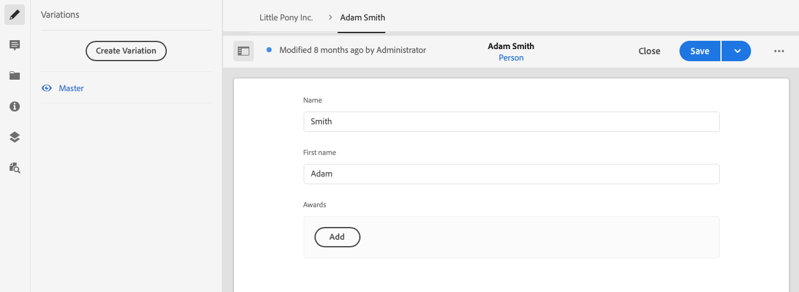
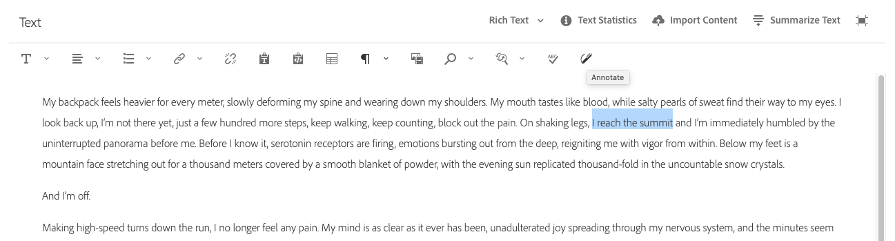
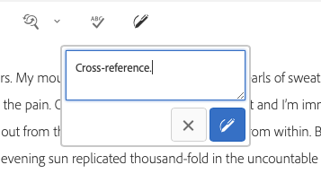

# Variaties - Fragmentinhoud ontwerpen{#variations-authoring-fragment-content}

[ de Variaties ](/help/assets/content-fragments/content-fragments.md#constituent-parts-of-a-content-fragment) zijn een significante eigenschap van de de inhoudsfragmenten van AEM, aangezien zij u toestaan om exemplaren van de hoofdinhoud voor gebruik op specifieke kanalen, en/of scenario&#39;s tot stand te brengen en uit te geven, makend hoofdloze inhoudslevering nog flexibeler.

Van het **lusje van Variaties** kunt u het volgende doen:

* [ ga de inhoud ](#authoring-your-content) voor uw fragment in,
* [ creeer en beheer variaties ](#managing-variations) van de **Hoofd** inhoud,

Voer een reeks andere acties uit afhankelijk van het gegevenstype dat wordt bewerkt, bijvoorbeeld:

* [ Tussenvoegsel visuele activa in uw fragment ](#inserting-assets-into-your-fragment) (beelden)

* Selecteer tussen [ Rijke Tekst ](#rich-text), [ Onbewerkte Tekst ](#plain-text), en [ Markdown ](#markdown) voor het uitgeven

* [Inhoud uploaden](#uploading-content)

* [ de belangrijkste statistieken van de Mening ](#viewing-key-statistics) (over multi-lijntekst)

* [Tekst samenvatten](#summarizing-text)

* [Variaties synchroniseren met stramieninhoud](#synchronizing-with-master)

>[!CAUTION]
>
>Nadat een fragment is gepubliceerd en/of waarnaar wordt verwezen, geeft AEM een waarschuwing weer wanneer een auteur het fragment opent voor opnieuw bewerken. Hiermee wordt u gewaarschuwd dat wijzigingen in het fragment ook van invloed zijn op de pagina&#39;s waarnaar wordt verwezen.

## Inhoud ontwerpen {#authoring-your-content}

Wanneer u uw inhoudsfragment voor het uitgeven opent, wordt het **lusje van Variaties** geopend door gebrek. Hier kunt u de inhoud ontwerpen, voor stramien of variaties die u hebt. Het gestructureerde fragment bevat diverse velden van diverse gegevenstypen die in het inhoudsmodel zijn gedefinieerd.

Bijvoorbeeld:

U kunt:

* Maak direct aan uw inhoud in het **lusje van Variaties** uitgeeft; elk gegevenstype verstrekt verschillende het uitgeven opties, bijvoorbeeld:

   * voor **Meerdere lijntekst** gebieden, kunt u [ het volledig-schermredacteur ](#full-screen-editor) ook openen:

      * selecteren het [ Formaat ](#formats)
      * zie meer het uitgeven opties (voor [ Rich Text ](#rich-text) formaat)
      * toegang tot een waaier van [ acties ](#actions)

   * Voor **gebieden van de Verwijzing van het 0} Fragment {, kan de** Edit optie van het Fragment van de Inhoud [, afhankelijk van de modeldefinitie beschikbaar zijn.](#fragment-references-edit-content-fragment)

* Wijs **Markeringen** aan de huidige variatie toe; de markeringen kunnen worden toegevoegd, worden bijgewerkt, en worden verwijderd

   * [ de Markeringen ](/help/sites-authoring/tags.md) zijn krachtig wanneer het organiseren van uw fragmenten aangezien zij voor inhoudsclassificatie en taxonomie kunnen worden gebruikt. Tags kunnen worden gebruikt voor het zoeken naar inhoud (door tags) en het toepassen van bulkbewerkingen.

      * Zoekt naar een tag en retourneert het fragment, waarbij de tagvariatie is gemarkeerd.
      * Variatietags kunnen ook worden gebruikt om variaties te groeperen voor een specifiek CDN-profiel (Content Delivery Network) (voor CDN-caching) in plaats van de variatienaam te gebruiken.

     U kunt bijvoorbeeld relevante fragmenten labelen als &#39;kerstlancering&#39; om alleen deze fragmenten als een subset te kunnen doorbladeren, of om ze te kopiëren voor gebruik met een andere toekomstige start in een nieuwe map.

  >[!NOTE]
  >
  >**de Markeringen** kunnen ook worden toegevoegd (aan de **Hoofd** variatie) als deel van [ Meta-gegevens ](/help/assets/content-fragments/content-fragments-metadata.md)

* [ creeer en beheer variaties ](#managing-variations) van de **Hoofd** inhoud.

### Volledige schermeditor {#full-screen-editor}

Wanneer u een tekstveld met meerdere regels bewerkt, kunt u de volledige schermeditor openen, in de werkelijke tekst klikken en vervolgens het volgende actiepictogram selecteren:

Hiermee opent u de teksteditor voor het volledige scherm:

De teksteditor voor volledig scherm biedt de volgende mogelijkheden:

* Toegang tot diverse [ acties ](#actions)
* Afhankelijk van het [ formaat ](#formats), extra het formatteren opties ([ Rijke Tekst ](#rich-text))

### Handelingen {#actions}

De volgende acties zijn ook beschikbaar (voor alle [ formaten ](#formats)) wanneer de volledig-schermredacteur (namelijk multi-line tekst) open is:

* Selecteer het [ formaat ](#formats) ([ Rijke Tekst ](#rich-text), [ Onbewerkte Tekst, ](#plain-text) [ Markdown ](#markdown))

* [Inhoud uploaden](#uploading-content)

* [Tekststatistieken tonen](#viewing-key-statistics)

* [ synchroniseer met Hoofd ](#synchronizing-with-master) (wanneer het uitgeven van een variatie)

* [Tekst samenvatten](#summarizing-text)

### Indelingen {#formats}

De opties voor het bewerken van tekst met meerdere regels zijn afhankelijk van de geselecteerde indeling:

* [RTF](#rich-text)
* [Onbewerkte tekst](#plain-text)
* [Markering](#markdown)

De indeling kan worden geselecteerd in de schermvullende editor.

### RTF {#rich-text}

Met RTF-bewerking kunt u opmaken:

* Vet
* Cursief
* Onderstrepen
* Uitlijning: links, midden, rechts
* Lijst met opsommingstekens
* Genummerde lijst
* Inspringing: verhogen, verlagen
* Hyperlinks maken/verbreken
* Tekst/tekst uit Word plakken
* Een tabel invoegen
* Alineastijl: Alinea, kop 1/2/3
* [Element invoegen](#inserting-assets-into-your-fragment)
* Open de volledige-schermredacteur, waar de volgende het formatteren opties beschikbaar zijn:
   * Zoeken
   * Zoeken/vervangen
   * Spellingcontrole
   * [Annotaties](/help/assets/content-fragments/content-fragments-variations.md#annotating-a-content-fragment)
* [ het Fragment van de Inhoud van het Tussenvoegsel ](#inserting-content-fragment-into-your-fragment); beschikbaar wanneer uw **Multi gebied van de lijntekst** met **wordt gevormd staat de Verwijzing van het Fragment** toe.

De [ acties ](#actions) zijn ook toegankelijk van de het volledig-schermredacteur.

### Onbewerkte tekst {#plain-text}

Met platte tekst kunt u snel inhoud invoeren zonder opmaak- of markeringsgegevens. U kunt de het volledig-schermredacteur voor verdere [ acties ](#actions) ook openen.

>[!CAUTION]
>
>Als u **Onbewerkte Tekst** selecteert, zou u om het even welke het formatteren, prijsdaling, en/of activa kunnen verliezen die u in één van beide **Rijke Tekst** of **Markting** hebt opgenomen.

### Markering {#markdown}

>[!NOTE]
>
>Voor volledige informatie, zie de [ documentatie van de Vermindering ](/help/assets/content-fragments/content-fragments-markdown.md).

Hiermee kunt u de tekst opmaken met behulp van een markering. U kunt het volgende definiëren:

* Koppen
* Alinea&#39;s en regeleinden
* Koppelingen
* Afbeeldingen
* Aanhalingstekens blokkeren
* Lijsten
* Nadruk
* Codeblokken
* backslash-eces

U kunt de het volledig-schermredacteur voor verdere [ acties ](#actions) ook openen.

>[!CAUTION]
>
>Als u tussen **Tekst met opmaak** en **Markdown** schakelt, kunt u onverwachte effecten met Blokcitaten en Codeblokken ervaren, aangezien deze twee opmaakindelingen verschillen in hoe zij worden behandeld.

### Fragmentverwijzingen {#fragment-references}

Als het Content Fragment-model fragmentverwijzingen bevat, hebben de auteurs van het fragment mogelijk aanvullende opties:

* [Inhoudsfragment bewerken](#fragment-references-edit-content-fragment)
* [Nieuw inhoudsfragment](#fragment-references-new-content-fragment)

#### Inhoudsfragment bewerken {#fragment-references-edit-content-fragment}

De optie **geeft het Fragment van de Inhoud** uit opent dat fragment in een nieuw vensterlusje.

<!--
The option **Edit Content Fragment** opens that fragment in a new editor tab (within the same browser tab).

Selecting the original tab again (for example, **Little Pony Inc.**), will close this secondary tab (in this case, **Adam Smith**).

-->

#### Nieuw inhoudsfragment {#fragment-references-new-content-fragment}

De optie **Nieuwe Fragment van de Inhoud** laat u een fragment tot stand brengen. Hiervoor wordt een variant van de wizard voor het maken van inhoudsfragmenten geopend in de editor.

U kunt vervolgens een fragment maken door:

1. Navigeer naar en selecteer de gewenste map.
1. Het selecteren van **daarna**.
1. Het specificeren van eigenschappen; bijvoorbeeld, **Titel**.
1. Selecterend **creeer**.
1. Tot slot:
   1. **Gedaan** keert (aan het originele fragment) terug en verwijzingen het nieuwe fragment.
   1. **Open** verwijzingen het nieuwe fragment en opent het nieuwe fragment voor het uitgeven in nieuwe browser tabel.

### Belangrijkste statistieken weergeven {#viewing-key-statistics}

Wanneer de volledig-schermredacteur open is, toont de actie **Statistieken van de Tekst** een waaier van informatie over de tekst.

Bijvoorbeeld:

### Inhoud uploaden {#uploading-content}

U kunt het maken van inhoudsfragmenten vereenvoudigen door tekst te uploaden die is voorbereid in een externe editor en deze rechtstreeks toe te voegen aan het fragment.

### Tekst samenvatten {#summarizing-text}

Samenvattende tekst is ontworpen om gebruikers te helpen de lengte van hun tekst te beperken tot een vooraf gedefinieerd aantal woorden, terwijl de hoofdpunten en de algemene betekenis behouden blijven.

>[!NOTE]
>
>Op een meer technisch niveau, houdt het systeem de zinnen die het als het verstrekken van de *beste verhouding van informatiedichtheid en uniciteit* volgens specifieke algoritmen berekent.

>[!CAUTION]
>
>Het inhoudsfragment moet een geldige taalmap (ISO-code) hebben als voorouder. Hiermee wordt bepaald welk taalmodel moet worden gebruikt.
>
>Bijvoorbeeld `en/` zoals in het volgende pad:
>
>  `/content/dam/my-brand/en/path-down/my-content-fragment`

>[!CAUTION]
>
>Engels is beschikbaar buiten de box.
>
>Andere talen zijn beschikbaar als Pakketten van het Model van de Taal van het Aandeel van het Pakket:
>
>* [ Frans (fr) ](https://experience.adobe.com/#/downloads/content/software-distribution/en/aem.html?package=/content/software-distribution/en/details.html/content/dam/aem/public/adobe/packages/cq630/product/smartcontent-model-fr)
>* [ Duits (de) ](https://experience.adobe.com/#/downloads/content/software-distribution/en/aem.html?package=/content/software-distribution/en/details.html/content/dam/aem/public/adobe/packages/cq630/product/smartcontent-model-de)
>* [ Italiaans (het) ](https://experience.adobe.com/#/downloads/content/software-distribution/en/aem.html?package=/content/software-distribution/en/details.html/content/dam/aem/public/adobe/packages/cq630/product/smartcontent-model-it)
>* [ Spaans (es) ](https://experience.adobe.com/#/downloads/content/software-distribution/en/aem.html?package=/content/software-distribution/en/details.html/content/dam/aem/public/adobe/packages/cq630/product/smartcontent-model-es)
>

1. Selecteer **Meester** of de vereiste variatie.
1. Open de editor voor het volledige scherm.

1. Selecteer **vatten tekst** van de toolbar samen.

   

1. Specificeer het doelaantal woorden en selecteer **Begin**:
1. De oorspronkelijke tekst wordt naast de voorgestelde samenvatting weergegeven:

   * Alle zinnen die moeten worden verwijderd, worden rood gemarkeerd met doorhaling.
   * Klik op een gemarkeerde zin als u deze wilt behouden in de samengevatte inhoud.
   * Klik op een niet-gemarkeerde zin als u deze wilt verwijderen.

1. Selecteer **vat** samen om de veranderingen te bevestigen.

1. De oorspronkelijke tekst wordt naast de voorgestelde samenvatting weergegeven:

   * Alle zinnen die moeten worden verwijderd, worden rood gemarkeerd met doorhaling.
   * Klik op een gemarkeerde zin als u deze wilt behouden in de samengevatte inhoud.
   * Klik op een niet-gemarkeerde zin als u deze wilt verwijderen.
   * De samenvattingsstatistieken worden getoond: **Ware** en **Doel** -
   * U kunt **Voorproef** de veranderingen.

   

### Een inhoudsfragment annoteren {#annotating-a-content-fragment}

Een fragment annoteren:

1. Selecteer **Meester** of de vereiste variatie.

1. Open de editor voor het volledige scherm.

1. Het **annoteert** pictogram is beschikbaar in de hoogste toolbar. U kunt desgewenst tekst selecteren.

   

1. Er wordt een dialoogvenster geopend. Hier kunt u uw annotatie invoeren.

   

1. Selecteer **toepassen** op de dialoogdoos.

   

   Als de annotatie is toegepast op geselecteerde tekst, blijft die tekst gemarkeerd.

   

1. Sluit de volledige-schermredacteur, de annotaties worden nog benadrukt. Als deze optie is geselecteerd, wordt een dialoogvenster geopend waarin u de annotatie verder kunt bewerken.

1. Selecteer **sparen**.

1. Sluit de volledige-schermredacteur, de annotaties worden nog benadrukt. Als deze optie is geselecteerd, wordt een dialoogvenster geopend waarin u de annotatie verder kunt bewerken.

   

### Annotaties weergeven, bewerken, verwijderen {#viewing-editing-deleting-annotations}

Annotaties:

* Deze worden aangegeven door de markering in de tekst, zowel in de modus Volledig scherm als in de normale modus van de editor. Alle details van een annotatie kunnen vervolgens worden weergegeven, bewerkt en/of verwijderd door op de gemarkeerde tekst te klikken, waarna het dialoogvenster opnieuw wordt geopend.

  >[!NOTE]
  >
  >Er is een keuzekiezer beschikbaar als er meerdere annotaties zijn toegepast op één stuk tekst.

* Wanneer u de volledige tekst verwijdert waarop de annotatie is toegepast, wordt de annotatie ook verwijderd.

* Kan worden vermeld, en worden geschrapt, door het **lusje van Annotaties** in de fragmentredacteur te selecteren.

  

* Kan, in de [ Chronologie ](/help/assets/content-fragments/content-fragments-managing.md#timeline-for-content-fragments) voor het geselecteerde fragment worden bekeken en worden geschrapt.

### Assets invoegen in uw fragment {#inserting-assets-into-your-fragment}

Om het proces te verlichten om inhoudsfragmenten te ontwerpen, kunt u [ Assets ](/help/assets/manage-assets.md) (beelden) direct aan het fragment toevoegen.

Zij worden toegevoegd aan de paragraafopeenvolging van het fragment zonder enige het formatteren; het formatteren kan worden gedaan wanneer het [ fragment wordt gebruikt/op een pagina ](/help/sites-authoring/content-fragments.md) van verwijzingen wordt voorzien.

>[!CAUTION]
>
>Deze elementen kunnen niet worden verplaatst of verwijderd op een pagina waarnaar wordt verwezen. Dit moet gebeuren in de fragmenteditor.
>
>Nochtans, moet het formatteren van de activa (bijvoorbeeld, grootte) in de [ paginaredacteur ](/help/sites-authoring/content-fragments.md) worden gedaan. De representatie van het element in de fragmenteditor is uitsluitend bedoeld voor het ontwerpen van de inhoudsstroom.

>[!NOTE]
>
>Er zijn diverse methodes om [ beelden ](/help/assets/content-fragments/content-fragments.md#fragments-with-visual-assets) aan het fragment en/of de pagina toe te voegen.

1. Plaats de cursor op de positie waar u de afbeelding wilt toevoegen.
1. Gebruik het pictogram **Asset invoegen** om het zoekdialoogvenster te openen.

   

1. In het dialoogvenster kunt u het volgende doen:

   * navigeer naar het vereiste element in de DAM
   * zoeken naar de middelen in het DAM

   Selecteer het gewenste element door op de miniatuur te klikken.

1. Gebruik **Selecteren** om de asset op de huidige locatie toe te voegen aan het alineasysteem van het contentfragment.

   >[!CAUTION]
   >
   >Als u de indeling wijzigt nadat u de indeling als element hebt toegevoegd aan:
   >
   >* **Onbewerkte Tekst**: de activa worden verloren van het fragment.
   >* **Markering**: het element is niet zichtbaar, maar is nog hier wanneer u op **Rijke Tekst** terugkeert.

### Een inhoudsfragment invoegen in uw fragment {#inserting-content-fragment-into-your-fragment}

U kunt het maken van inhoudsfragmenten vereenvoudigen door ook een ander inhoudsfragment aan het fragment toe te voegen.

Ze worden als referentie toegevoegd op de huidige locatie in het fragment.

>[!NOTE]
>
>Deze optie is beschikbaar wanneer uw **Meerdere lijntekst** met **wordt gevormd toestaat de Verwijzing van het Fragment**.

>[!CAUTION]
>
>Deze elementen kunnen niet worden verplaatst of verwijderd op een pagina waarnaar wordt verwezen. Dit moet gebeuren in de fragmenteditor.
>
>Nochtans, moet het formatteren van de activa (bijvoorbeeld, grootte) in de [ paginaredacteur ](/help/sites-authoring/content-fragments.md) worden gedaan. De representatie van het element in de fragmenteditor is uitsluitend bedoeld voor het ontwerpen van de inhoudsstroom.

>[!NOTE]
>
>Er zijn diverse methodes om [ beelden ](/help/assets/content-fragments/content-fragments.md#fragments-with-visual-assets) aan het fragment en/of de pagina toe te voegen.

1. Plaats de cursor op de positie waar u het fragment wilt toevoegen.
1. Gebruik het **pictogram van het Fragment van de Inhoud van het Tussenvoegsel** om de onderzoeksdialoog te openen.

   

1. In het dialoogvenster kunt u het volgende doen:

   * naar het gewenste fragment in de Assets-map navigeren
   * zoeken naar het fragment

   Selecteer het gewenste fragment door op de miniatuur te klikken.

1. Gebruik **Uitgezochte** om een verwijzing naar het geselecteerde Fragment van de Inhoud aan uw huidig inhoudsfragment (bij de huidige plaats) toe te voegen.

   >[!CAUTION]
   >
   >Als u de opmaak wijzigt nadat u een verwijzing naar een ander fragment hebt toegevoegd, in:
   >
   >* **Onbewerkte Tekst**: de verwijzing wordt verloren van het fragment.
   >* **Markering**: de verwijzing blijft.

## Variaties beheren {#managing-variations}

### Een variatie maken {#creating-a-variation}

De variaties laten u de **Hoofd** inhoud nemen en het variëren volgens doel (indien nodig).

Een variatie maken:

>[!NOTE]
>
>Variaties voegen verwerkingstijd toe aan een inhoudsfragment, aan de auteursomgeving en ook bij levering. Aanbevolen wordt het aantal variaties tot een beheerbaar minimum te beperken.
>
>De beste manier is om tien variaties per inhoudsfragment niet te overschrijden.

1. Open het fragment en controleer of het zijpaneel zichtbaar is.
1. Selecteer **Variaties** van de pictogrambar in het zijpaneel.
1. Selecteer **creeer Variatie**.
1. Een dialoogdoos opent, specificeer de **Titel** en **Beschrijving** voor de nieuwe variatie.
1. Selecteer **toevoegen**; het fragment **Hoofd** wordt gekopieerd aan de nieuwe variatie, die nu open voor [ het uitgeven ](#editing-a-variation) is.

   >[!NOTE]
   >
   >Wanneer het creëren van een variatie, is het altijd de **Meester** die wordt gekopieerd, niet de variatie die open is.

   >[!NOTE]
   >
   >Wanneer u een variatie creeert, worden alle **Markeringen** momenteel toegewezen aan de **Hoofd** variatie gekopieerd aan uw nieuwe variatie.

### Een variatie bewerken {#editing-a-variation}

Wijzig de variatie-inhoud na:

* [ Creërend uw variatie ](#creating-a-variation).
* Een bestaand fragment openen en vervolgens de gewenste variant in het zijpaneel selecteren.

### De naam van een variatie wijzigen {#renaming-a-variation}

Een bestaande variatie een andere naam geven:

1. Open uw fragment en selecteer **Variaties** van het zijpaneel.
1. Selecteer de gewenste variatie.
1. Selecteer **anders noemen** van **** drop-down Acties.

1. Voer in het dialoogvenster dat verschijnt de nieuwe **titel** en/of **beschrijving** in.

1. Bevestig **anders noemen** actie.

>[!NOTE]
>
>Dit beïnvloedt slechts de variatie **Titel**.

### Een variatie verwijderen {#deleting-a-variation}

Een bestaande wijziging verwijderen:

1. Open uw fragment en selecteer **Variaties** van het zijpaneel.
1. Selecteer de gewenste variatie.
1. Selecteer **Schrapping** van de **drop-down Acties**.

1. Bevestig de **schrapping** actie in de dialoog.

>[!NOTE]
>
>U kunt niet **Hoofd** schrappen.

### Synchroniseren met stramien {#synchronizing-with-master}

**Hoofd** is een deel van een inhoudsfragment en, door definitie, houdt het het hoofdexemplaar van de inhoud, terwijl de variaties de individuele bijgewerkte en gemaakte versies van die inhoud houden. Wanneer de Master wordt bijgewerkt, is het mogelijk dat deze wijzigingen ook relevant zijn voor de wijzigingen en daarom aan hen moeten worden doorgegeven.

Wanneer u een variatie bewerkt, hebt u toegang tot de handeling voor het synchroniseren van het huidige element van de variatie met stramien. Hiermee kunt u automatisch wijzigingen kopiëren die u hebt aangebracht in Stramien naar de gewenste variatie.

>[!CAUTION]
>
>De synchronisatie is alleen beschikbaar om wijzigingen *van **Master**naar de variatie* te kopiëren.
>
>Alleen het huidige element van de variatie wordt gesynchroniseerd.
>
>De synchronisatie werkt slechts op het **Meerdere lijntekst** gegevenstype.
>
>Het overbrengen van wijzigingen *van een variatie naar **master*** is niet beschikbaar als optie.

<!-- needs new screenshot for synchronize effect -->

1. Open het inhoudsfragment in de fragmenteditor. Zorg ervoor dat het **Hoofd** is uitgegeven.

1. Selecteer een specifieke variant en kies vervolgens de gewenste synchronisatiehandeling uit:

   * de **drop-down selecteur van de Acties** **synchroniseer huidig element met meester**

     

   * de toolbar van de het volledig-schermredacteur - **Synchronisatie met meester**

     

1. Stramien en variaties worden naast elkaar weergegeven:

   * groen geeft aan dat inhoud is toegevoegd (aan de variatie)
   * rood geeft aan dat inhoud is verwijderd (uit de variatie)
   * blauw geeft vervangen tekst aan

   

1. Selecteer **Synchroniseer**, wordt de variatie bijgewerkt en getoond.
