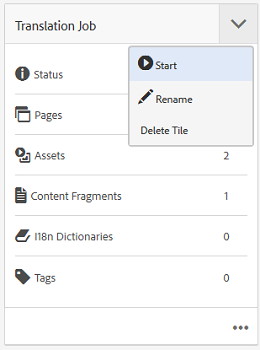
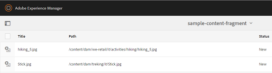
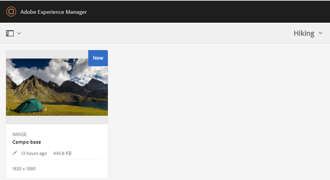

# Vertaalprojecten maken voor inhoudsfragmenten {#creating-translation-projects-for-content-fragments}

Naast elementen ondersteunt Adobe Experience Manager (AEM) Assets workflows voor het kopiëren van talen voor [inhoudsfragmenten](/help/assets/content-fragments/content-fragments.md) (inclusief variaties). Er is geen extra optimalisatie vereist voor het uitvoeren van workflows voor het kopiëren van talen op inhoudsfragmenten. In elke werkstroom wordt het volledige inhoudsfragment verzonden voor vertaling.

De typen workflows die u op inhoudsfragmenten kunt uitvoeren, lijken precies op de typen werkstromen die u voor elementen uitvoert. Bovendien komen de opties die beschikbaar zijn binnen elk workflowtype overeen met de opties die beschikbaar zijn onder de corresponderende workflowtypen voor elementen.

U kunt de volgende typen workflows voor het kopiëren van talen uitvoeren op inhoudsfragmenten:

**Maken en vertalen**

In deze workflow worden inhoudsfragmenten die moeten worden vertaald, gekopieerd naar de hoofdmap van de taal waarnaar u wilt vertalen. Bovendien wordt, afhankelijk van de opties u kiest, een vertaalproject gecreeerd voor de inhoudsfragmenten in de console van Projecten. Afhankelijk van de instellingen kan het vertaalproject handmatig worden gestart of automatisch worden uitgevoerd zodra het vertaalproject is gemaakt.

**Taalkopieën bijwerken**

Wanneer het broninhoudsfragment wordt bijgewerkt of gewijzigd, moet het bijbehorende taalspecifieke inhoudsfragment opnieuw worden vertaald. De workflow voor het kopiëren van de updatetaal zet een extra groep inhoudsfragmenten om en neemt deze op in een taalkopie voor een bepaalde landinstelling. In dit geval worden de vertaalde inhoudsfragmenten toegevoegd aan de doelmap die al eerder vertaalde inhoudsfragmenten bevat.

## Workflow {#create-and-translate-workflow} maken en vertalen

De workflow Maken en vertalen bevat de volgende opties. De procedurele stappen die aan elke optie zijn gekoppeld, zijn vergelijkbaar met die welke aan de overeenkomstige optie voor activa zijn gekoppeld.

* Alleen structuur maken: Zie [Structuur alleen maken voor elementen](translation-projects.md#create-structure-only) voor procedurestappen.
* Een nieuw vertaalproject maken: Zie [Een nieuw vertaalproject maken voor elementen](translation-projects.md#create-a-new-translation-project) voor procedurestappen.
* Toevoegen aan bestaand vertaalproject: Voor procedurestappen, zie [Toevoegen aan bestaand vertaalproject voor activa](translation-projects.md#add-to-existing-translation-project).

## Workflow {#update-language-copies-workflow} bijwerken voor het kopiëren van talen

De workflow voor het kopiëren van de taal Bijwerken bevat de volgende opties. De procedurele stappen die aan elke optie zijn gekoppeld, zijn vergelijkbaar met die welke aan de overeenkomstige optie voor activa zijn gekoppeld.

* Een nieuw vertaalproject maken: Zie [Een nieuw vertaalproject maken voor elementen](translation-projects.md#create-a-new-translation-project) (updateworkflow) voor procedurestappen.
* Toevoegen aan bestaand vertaalproject: Voor procedurestappen, zie [Toevoegen aan bestaand vertaalproject voor activa](translation-projects.md#add-to-existing-translation-project) (updatewerkstroom).

U kunt ook tijdelijke-taalkopieën maken voor fragmenten, vergelijkbaar met de manier waarop u tijdelijke kopieën maakt voor elementen. Zie [Tijdelijke taalkopieën maken voor elementen](translation-projects.md#creating-temporary-language-copies) voor meer informatie.

## Gemengde mediafragmenten {#translating-mixed-media-fragments} omzetten

Met AEM kunt u inhoudsfragmenten vertalen die verschillende typen media-elementen en -verzamelingen bevatten. Als u een inhoudsfragment vertaalt dat inline-elementen bevat, worden de vertaalde kopieën van deze elementen opgeslagen onder de hoofdmap van de doeltaal.

Als het inhoudsfragment een verzameling bevat, worden de elementen in de verzameling samen met het inhoudsfragment vertaald. De vertaalde exemplaren van de activa worden opgeslagen binnen de aangewezen wortel van de doeltaal bij een plaats die de fysieke plaats van de bronactiva onder de wortel van de brontaal aanpast.

Als u inhoudsfragmenten met gemengde media wilt kunnen vertalen, bewerkt u eerst het standaardvertaalframework om de vertaling van inline-elementen en -verzamelingen met betrekking tot inhoudsfragmenten mogelijk te maken.

1. Klik/tik het AEM embleem, en navigeer aan **[!UICONTROL Tools > Deployment > Cloud Services]**.
1. Zoek **[!UICONTROL Translation Integration]** onder **[!UICONTROL Adobe Marketing Cloud]** en klik/tik **[!UICONTROL Show Configurations]**.

   

1. Klik/tik **[!UICONTROL Default configuration (Translation Integration configuration)]** in de lijst met beschikbare configuraties om de pagina **[!UICONTROL Default configuration]** te openen.

   

1. Klik op **[!UICONTROL Edit]** op de werkbalk om het dialoogvenster **[!UICONTROL Translation Config]** weer te geven.

   

1. Navigeer naar het tabblad **[!UICONTROL Assets]** en kies **[!UICONTROL Inline Media Assets and Associated Collections]** in de lijst **[!UICONTROL Translate Content Fragment Assets]**. Klik of tik op **[!UICONTROL OK]** om de wijzigingen op te slaan.

   

1. Open vanuit de hoofdmap in het Engels een inhoudsfragment.

   

1. Klik/tik het **[!UICONTROL Insert Asset]** pictogram.

   

1. Voeg een element in het inhoudsfragment in.

   

1. Klik/tik het **[!UICONTROL Associate Content]** pictogram.

   

1. Klik of tik op **[!UICONTROL Associate Content]**.

   

1. Selecteer een verzameling en neem deze op in het inhoudsfragment. Klik of tik op **[!UICONTROL Save]**.

   

1. Selecteer het inhoudsfragment en klik/tik op het pictogram **[!UICONTROL GlobalNav]**.
1. Selecteer **[!UICONTROL References]** in het menu om het deelvenster **[!UICONTROL References]** weer te geven.

   

1. Klik/tik **[!UICONTROL Language Copies]** onder **[!UICONTROL Copies]** om de taalexemplaren te tonen.

   

1. Klik/tik **[!UICONTROL Create & Translate]** van bij de bodem van het paneel om het **[!UICONTROL Create & Translate]** dialoog te tonen.

   

1. Selecteer de doeltaal in de lijst **[!UICONTROL Target Languages]**.

   

1. Selecteer het type vertaalproject in de lijst **[!UICONTROL Project]**.

   

1. Geef de titel van het project op in het tekstvak **[!UICONTROL Project Title]** en klik/tik op **Maken**.

   

1. Navigeer aan de **[!UICONTROL Projects]** console, en open de projectomslag voor het vertaalproject u creeerde.

   

1. Klik of tik op de projecttegel om de pagina met projectdetails te openen.

   

1. Verifieer vanuit de tegel Vertaaltaak het aantal te vertalen middelen.
1. Start de vertaaltaak vanaf de tegel **[!UICONTROL Translation Job]**.

   

1. Klik op de ovalen onder aan de tegel Vertaal-taak om de status van de vertaaltaak weer te geven.

   

1. Klik of tik op het inhoudsfragment om het pad van de vertaalde gekoppelde elementen te controleren.

   

1. Herzie de taalexemplaar voor de inzameling in de console van Inzamelingen.

   

   U ziet dat alleen de inhoud van de verzameling wordt vertaald. De verzameling zelf is niet vertaald.

1. Navigeer naar het pad van het vertaalde gekoppelde element. Merk op dat het vertaalde element wordt opgeslagen onder de wortel van de doeltaal.

   

1. Navigeer naar de elementen in de verzameling die samen met het inhoudsfragment zijn vertaald. Merk op dat de vertaalde exemplaren van de activa bij de aangewezen doeltaalwortel worden opgeslagen.

   

   >[!NOTE]
   >
   >De procedures voor het toevoegen van een inhoudsfragment aan een bestaand project of voor het uitvoeren van updatewerkstromen zijn gelijkaardig aan de overeenkomstige procedures voor activa. Zie voor leidraden voor deze procedures de voor activa beschreven procedures.

