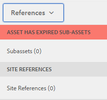

# Digital Rights Management for digital assets {#digital-rights-management-in-assets}

Digitale middelen zijn vaak gekoppeld aan een licentie, waarin de gebruiksvoorwaarden en -duur zijn vastgelegd. Omdat Adobe Experience Manager (AEM)-middelen volledig geïntegreerd zijn met het AEM-platform, kunt u op efficiënte wijze informatie over de vervaldatum van bedrijfsmiddelen en de status van bedrijfsmiddelen beheren. U kunt ook licentiegegevens aan elementen koppelen.

## Vervaldatum van element {#asset-expiration}

Vervaldatum van activa is een effectieve manier om vergunningsvereisten voor activa af te dwingen. Het zorgt ervoor dat het gepubliceerde element niet gepubliceerd wordt wanneer het vervalt, wat de mogelijkheid van schending van de licentie afsluit. Een gebruiker zonder beheerdersrechten kan een verlopen middel niet bewerken, kopiëren, verplaatsen, publiceren en downloaden.

U kunt de vervalstatus van een element bekijken in de middelenconsole in zowel de Kaart- als lijstweergave.

*Afbeelding: In de kaartweergave geeft een markering op de kaart aan dat het element is verlopen.*

**Lijstweergave**

*Afbeelding: In de lijstweergave wordt in de kolom[!UICONTROL Status]de banner[!UICONTROL Verlopen]weergegeven.*

U kunt de vervalstatus van een element in de tijdlijn bekijken. Selecteer het element en kies Tijdlijn in het menu GlobalNav.

U kunt ook de vervalstatus van elementen bekijken in de **[!UICONTROL References]** -rail. Het beheert activa vervalstatussen en verhoudingen tussen samengestelde activa en referenced subassets, inzamelingen, en projecten.

1. Navigeer naar het element waarvan u de verwijzing naar webpagina&#39;s en samengestelde elementen wilt weergeven.
1. Selecteer het element en het logo van Experience Manager.

1. Kies **[!UICONTROL Verwijzingen]** in het menu.

   

   Voor verlopen activa, toont de spoorstaaf References het **[!UICONTROL Activum van de vervalstatus bij de bovenkant Verlopen]** .

   

   Als het activum is verlopen, geeft de References-rail aan dat het status- **[!UICONTROL element is verlopen subactiva]**.

   

### Zoeken in verlopen elementen {#search-expired-assets}

In het deelvenster Zoeken kunt u zoeken naar verlopen elementen, waaronder verlopen subelementen.

1. Klik in de middelenconsole op de werkbalk op **[!UICONTROL Zoeken]** om het vak Onderzoek weer te geven.

1. Met de curseur in het vakje van Onderzoek, druk de sleutel van de Terugkeer om de pagina van de Resultaten van het Onderzoek te tonen.

   

1. Klik op het logo van Experience Manager om het zoekdeelvenster weer te geven.

   

1. Klik op de optie **[!UICONTROL Vervalstatus]** om deze uit te vouwen.

   

1. Selecteer **[!UICONTROL Verlopen]**. De verlopen elementen worden weergegeven in zoekresultaten.

   

Wanneer u de optie **Verlopen** kiest, worden in de middelenconsole alleen de verlopen elementen en subelementen weergegeven waarnaar wordt verwezen door samengestelde elementen. De samengestelde elementen die verwijzen naar verlopen subelementen worden niet direct weergegeven nadat de subelementen verlopen zijn. In plaats daarvan, worden zij getoond nadat de Middelen van AEM ontdekt dat zij verlopen subassets de volgende tijd van de planner in werking stellen van verwijzingen voorzien.

Als u de vervaldatum van een gepubliceerd element aan een datum vroeger dan de huidige plannercyclus wijzigt, ontdekt het programma nog dit element als verlopen activa in de volgende tijd het loopt en wijst dienovereenkomstig op status.

Bovendien als een glitch of een fout de planner verhindert verlopen activa in de huidige cyclus te ontdekken, onderzoekt de planner deze activa in de volgende cyclus opnieuw en ontdekt hun verlopen status.

Om de assetconsole in staat te stellen de refererende samengestelde assets samen met de verlopen subassets weer te geven configureert u een **Adobe CQ DAM-workflow voor verloopmeldingen** in AEM Configuration Manager.

1. Open AEM Configuration Manager.
1. Kies Bericht bij verlopen **[!UICONTROL van Adobe CQ DAM]**. Standaard is **[!UICONTROL Tijdgebaseerde planner]** geselecteerd, die een taak plant om op een bepaald tijdstip te controleren of een element verlopen subassets heeft. Nadat de taak is voltooid, worden elementen waarvan de subelementen zijn verlopen en waarnaar wordt verwezen, weergegeven als verlopen in de zoekresultaten.

   

1. Om de baan periodiek in werking te stellen, ontruim het **[!UICONTROL Op tijd gebaseerde gebied van de Regel]** van de Planner en wijzig de tijd in seconden op het gebied van de **[!UICONTROL Periodieke Planner]** . Bijvoorbeeld bij de voorbeeldexpressie &#39;0 0 0 &amp;ast; &amp;ast; ?&#39; wordt de taak om 00 uur gestart.
1. Selecteer E-mail **** verzenden om e-mails te ontvangen wanneer een element verloopt.

   >[!NOTE]
   >
   >Alleen de maker van het element (de persoon die een bepaald middel uploadt naar AEM Assets) ontvangt een e-mail wanneer het middel vervalt. Zie E-mailmelding  configureren voor meer informatie over het configureren van e-mailmeldingen op algemeen AEM-niveau.

1. In het **[!UICONTROL Voorafgaande bericht in secondengebied]** , specificeer de tijd in seconden voorafgaand aan de tijd een activa verloopt wanneer u een bericht betreffende de vervaldatum wilt ontvangen. Als u een beheerder of de maker van het element bent, ontvangt u een bericht vóór het verlopen van het element om u te laten weten dat het element op het punt staat na de opgegeven tijd te verlopen.

   Nadat het element is verlopen, ontvangt u een ander bericht waarin de vervaldatum wordt bevestigd. Bovendien worden de verlopen activa gedeactiveerd.

1. Click **[!UICONTROL Save]**.

## Elementstatussen {#asset-states}

Op de middelenconsole van Adobe Experience Manager (AEM) Assets kunnen verschillende statussen voor elementen worden weergegeven. Afhankelijk van de huidige status van een bepaald element wordt in de kaartweergave een label weergegeven dat de status beschrijft, bijvoorbeeld Verlopen, Gepubliceerd, Goedgekeurd, Afgewezen enzovoort.

1. Selecteer een element in de gebruikersinterface Elementen.

   

1. Klik op **[!UICONTROL Publiceren]** op de werkbalk. Als u **Publiceren** niet ziet op de werkbalk, klikt u op **[!UICONTROL Meer]** op de werkbalk en zoekt u de optie **[!UICONTROL Publiceren]** .

   

1. Kies **[!UICONTROL Publiceren]** in het menu en sluit het bevestigingsvenster.
1. Sluit de selectiemodus. De publicatiestatus voor het element wordt onder aan de elementminiatuur weergegeven in de kaartweergave. In de lijstmening, toont de Gepubliceerde kolom de tijd toen de activa werd gepubliceerd.

   

1. Selecteer een element in de interface Elementen en klik op **[!UICONTROL Eigenschappen]** om de pagina met elementdetails weer te geven.

   

1. Stel op het tabblad Geavanceerd een vervaldatum in voor het element in het veld **[!UICONTROL Verlopen]** .

   

   *Afbeelding: Het tabblad[!UICONTROL Geavanceerd]in de pagina[!UICONTROL Eigenschappen]van element om de vervaldatum van elementen in te stellen.*

1. Klik op **[!UICONTROL Opslaan]** en vervolgens op **[!UICONTROL Sluiten]** om de Asset-console weer te geven.
1. De publicatiestatus voor het element geeft aan dat de status is verlopen onder aan de elementminiatuur in de kaartweergave. In de lijstweergave wordt de status van het element weergegeven als **[!UICONTROL Verlopen]**.

   

1. Selecteer in de middelenconsole een map en maak een controletaak in de map.
1. Reviseer, keur/verwerp de activa in de overzichtstaak en klik **[!UICONTROL Voltooien]**.
1. Navigeer naar de map waarvoor u de revisietaak hebt gemaakt. De status voor de middelen die u hebt goedgekeurd/geweigerd, wordt onderaan weergegeven in de kaartweergave. In de lijstweergave worden de goedkeuringsstatus en de vervalstatus weergegeven in de desbetreffende kolommen.

   

1. Als u wilt zoeken naar elementen op basis van hun status, klikt u op **[!UICONTROL Zoeken]** om de balk Zoeken weer te geven.

   

1. Druk op Enter en klik vervolgens op **[!UICONTROL GlobalNav]** om het deelvenster Zoeken weer te geven.
1. In the Search panel, click **[!UICONTROL Publish Status]** and select **[!UICONTROL Published]** to search for published assets in AEM Assets.

   

1. Click **[!UICONTROL Approval Status]** and click the appropriate option to search for approved or rejected assets.

   

1. To search for assets based on their expiration status, select **[!UICONTROL Expiry Status]** in the Search panel and choose the appropriate option.

   

1. U kunt ook naar elementen zoeken op basis van een combinatie van statussen onder verschillende zoekfacetten. U kunt bijvoorbeeld zoeken naar gepubliceerde elementen die zijn goedgekeurd in een overzichtstaak en die nog niet zijn verlopen door de juiste opties te selecteren in de zoekfacetten.

   

## Digital Rights Management in Assets {#digital-rights-management-in-assets-1}

Met deze functie wordt de acceptatie van de licentieovereenkomst afgedwongen voordat u een licentie kunt downloaden van Adobe Experience Manager Assets.

Als u een beveiligd element selecteert en op **[!UICONTROL Downloaden]** klikt, wordt u omgeleid naar een licentiepagina waar u de licentieovereenkomst accepteert. Als u de licentieovereenkomst niet accepteert, is de knop **[!UICONTROL Downloaden]** uitgeschakeld.

Als de selectie meerdere beveiligde elementen bevat, selecteert u één element tegelijk, accepteert u de licentieovereenkomst en gaat u verder met het downloaden van het element.

Een actief wordt als beschermd beschouwd indien aan een van deze voorwaarden is voldaan:

* De eigenschap voor metagegevens van het element `xmpRights:WebStatement` verwijst naar het pad van de pagina die de licentieovereenkomst voor het element bevat.
* De waarde van de eigenschap voor metagegevens van het element `adobe_dam:restrictions` is een onbewerkte HTML die de licentieovereenkomst opgeeft.

>[!NOTE]
>
>De locatie `/etc/dam/drm/licenses` die wordt gebruikt voor het opslaan van licenties in eerdere versies van AEM is afgekeurd.
>
>Als u licentiepagina&#39;s maakt of wijzigt of deze van eerdere AEM-versies poort, raadt Adobe u aan deze pagina&#39;s onder `/apps/settings/dam/drm/licenses` of `/conf/&ast;/settings/dam/drm/licenses`op te slaan.

### DRM-beveiligde bestanden downloaden {#downloading-drm-assets}

1. Selecteer in de kaartweergave de elementen die u wilt downloaden en klik op **[!UICONTROL Downloaden]**.
1. In the **[!UICONTROL Copyright Management]** page, select the asset you want to download from the list.
1. Kies **[!UICONTROL Akkoord]** in het venster Licentie. Naast het element waarvoor u de licentieovereenkomst accepteert, wordt een vinkje weergegeven. Klik op de knop **[!UICONTROL Downloaden]** .

   >[!NOTE]
   >
   >The **[!UICONTROL Download]** button is enabled only when you choose to agree to the license agreement for a protected asset. However, if your selection comprises both protected and unprotected assets, only the protected assets are listed in the left pane and the **[!UICONTROL Download]** button is enabled to download the unprotected assets. To simultaneously accept license agreements for multiple protected assets, select the assets from the list and then choose **[!UICONTROL Agree]**.

   

1. Klik in het dialoogvenster op **[!UICONTROL Downloaden]** om het element of de uitvoeringen te downloaden.
