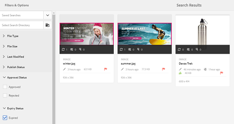

# Digital Rights Management for assets {#digital-rights-management-in-assets}

Digitale middelen zijn vaak gekoppeld aan een licentie die de gebruiksvoorwaarden en -duur bepaalt. Omdat [!DNL Adobe Experience Manager Assets] [!DNL Experience Manager] het platform volledig geïntegreerd is, kunt u de informatie over het verlopen van bedrijfsmiddelen en de status van bedrijfsmiddelen efficiënt beheren. U kunt ook licentiegegevens aan elementen koppelen.

## Vervaldatum van element {#asset-expiration}

Vervaldatum van activa is een effectieve manier om licentievereisten voor activa af te dwingen. Het zorgt ervoor dat het gepubliceerde element niet gepubliceerd wordt wanneer het vervalt, wat de mogelijkheid van schending van de licentie afsluit. Een gebruiker zonder beheerdersmachtigingen kan een verlopen middel niet bewerken, kopiëren, verplaatsen, publiceren en downloaden.

U kunt de vervalstatus van een middel in de [!DNL Assets] console in zowel de kaart als lijstmeningen bekijken.

*Afbeelding: In de kaartweergave geeft een markering op de kaart aan dat het element is verlopen.*

*Afbeelding: In de lijstweergave geeft de[!UICONTROL Status]kolom de[!UICONTROL Expired]banner weer.*

U kunt de vervalstatus van een element weergeven in de [!UICONTROL Timeline] linkertrack.

>[!NOTE]
>
>De vervaldatum van een element wordt anders weergegeven voor gebruikers in verschillende tijdzones.

U kunt de vervalstatus van activa in de **[!UICONTROL References]** spoorstaaf ook bekijken. Het beheert activa vervalstatussen en verhoudingen tussen samengestelde activa en referenced subassets, inzamelingen, en projecten.

1. Navigeer naar het element waarvan u de verwijzing naar webpagina&#39;s en samengestelde elementen wilt weergeven.
1. Selecteer het element en klik op het [!DNL Experience Manager] logo.

1. Kies een optie in het **[!UICONTROL References]** menu.

   

   Voor verlopen activa, toont de spoorstaaf References de vervalstatus **[!UICONTROL Asset is Expired]** bij de bovenkant.

   

   Als het element is verlopen, wordt de status weergegeven in de verwijzingstag **[!UICONTROL Asset has Expired Sub-Assets]**.

   

### Zoeken in verlopen elementen {#search-expired-assets}

In het deelvenster Zoeken kunt u zoeken naar verlopen elementen, waaronder verlopen subelementen.

1. Klik in de [!DNL Assets] **[!UICONTROL Search]** console op de werkbalk om het vak Onderzoek weer te geven.

1. Met de curseur in het vakje van het Onderzoek, druk de Enter sleutel om de pagina van onderzoeksresultaten te tonen.

   

1. Klik op het [!DNL Experience Manager] logo om het zoekvenster weer te geven.

   

1. Click the **[!UICONTROL Expiry Status]** option to expand it.

   

1. Choose **[!UICONTROL Expired]**. De verlopen elementen worden weergegeven in zoekresultaten.

   

Wanneer u de **[!UICONTROL Expired]** optie kiest, worden in de [!DNL Assets] console alleen de verlopen elementen en subelementen weergegeven waarnaar wordt verwezen door samengestelde elementen. De samengestelde elementen die verwijzen naar verlopen subelementen worden niet direct weergegeven nadat de subelementen verlopen zijn. In plaats daarvan, worden zij getoond nadat [!DNL Experience Manager] ontdekt dat zij verlopen subassets de volgende tijd van de planner in werking stellen van verwijzingen voorzien.

Als u de vervaldatum van een gepubliceerd element aan een datum vroeger dan de huidige plannercyclus wijzigt, ontdekt het programma nog dit element als verlopen activa in de volgende tijd het loopt en wijst dienovereenkomstig op status.

Bovendien als een glitch of een fout de planner verhindert verlopen activa in de huidige cyclus te ontdekken, onderzoekt de planner deze activa in de volgende cyclus opnieuw en ontdekt hun verlopen status.

To enable the [!DNL Assets] console to display the referencing compound assets along with the expired subassets, configure an **[!UICONTROL Adobe CQ DAM Expiry Notification]** workflow in [!DNL Experience Manager] Configuration Manager.

1. Open [!DNL Experience Manager] Configuration Manager.
1. Choose **[!UICONTROL Adobe CQ DAM Expiry Notification]**. Standaard **[!UICONTROL Time based Scheduler]** is deze optie geselecteerd. Hiermee wordt een taak gepland om op een bepaald moment te controleren of een element verlopen subelementen heeft. Nadat de taak is voltooid, worden elementen waarvan de subelementen zijn verlopen en waarnaar wordt verwezen, weergegeven als verlopen in de zoekresultaten.

   

1. Als u de taak periodiek wilt uitvoeren, wist u het veld **[!UICONTROL Time Based Scheduler Rule]** en wijzigt u de tijd in seconden in het veld **[!UICONTROL Periodic Scheduler]**. Bijvoorbeeld bij de voorbeeldexpressie &#39;0 0 0 &amp;ast; &amp;ast; ?&#39; wordt de taak om 00 uur gestart.
1. Selecteer **[!UICONTROL send email]** om e-mails te ontvangen wanneer een middel verloopt.

   >[!NOTE]
   >
   >Alleen de maker van het element (de persoon die een bepaald middel uploadt naar [!DNL Assets]) ontvangt een e-mail wanneer het element vervalt. Zie [hoe u e-mailmeldingen](/help/sites-administering/notification.md) configureert voor meer informatie over het configureren van e-mailmeldingen op algemeen [!DNL Experience Manager] niveau.

1. Geef in het **[!UICONTROL Prior notification in seconds]** veld de tijd in seconden op voordat een element vervalt wanneer u een melding over de vervaldatum wilt ontvangen. De makers van bedrijfsmiddelen ontvangen een bericht vóór het verstrijken van het element om aan te geven dat het element op het punt staat na de opgegeven tijd te verlopen. Nadat het element is verlopen, ontvangt u een ander bericht waarin de vervaldatum wordt bevestigd. Bovendien worden de verlopen activa gedeactiveerd.

1. Klik op **[!UICONTROL Save]**.

## Elementstatussen {#asset-states}

De [!DNL Assets] console kan verschillende statussen voor elementen weergeven. Afhankelijk van de huidige status van een bepaald element wordt in de kaartweergave een label weergegeven dat de status beschrijft, bijvoorbeeld Verlopen, Gepubliceerd, Goedgekeurd, Afgewezen enzovoort.

1. Selecteer een element in de [!DNL Assets] gebruikersinterface.

   

1. Klik op **[!UICONTROL Publish]** op de werkbalk. Als u **Publiceren** niet ziet op de werkbalk, klikt u **[!UICONTROL More]** op de werkbalk en zoekt u de optie **[!UICONTROL Publish]** .
1. Kies een optie in het **[!UICONTROL Publish]** menu en sluit het bevestigingsvenster.
1. Sluit de selectiemodus. De publicatiestatus voor het element wordt onder aan de elementminiatuur weergegeven in de kaartweergave. In de lijstmening, toont de Gepubliceerde kolom de tijd toen de activa werd gepubliceerd.

   

1. Als u de pagina met elementdetails wilt weergeven, selecteert u in de [!DNL Assets] interface een element en klikt u op **[!UICONTROL Properties]**.

   

1. Stel op het tabblad Geavanceerd een vervaldatum voor het element in vanuit het **[!UICONTROL Expires]** veld.

   

   *Afbeelding:[!UICONTROL Advanced]op de elementpagina[!UICONTROL Properties]om de vervaldatum van elementen in te stellen.*

1. Klik **[!UICONTROL Save]** en klik vervolgens **[!UICONTROL Close]** om de Asset-console weer te geven.
1. De publicatiestatus voor het element geeft aan dat de status is verlopen onder aan de elementminiatuur in de kaartweergave. In de lijstweergave wordt de status van het element weergegeven als **[!UICONTROL Expired]**.

   

1. Selecteer in de [!DNL Assets] console een map en maak een controletaak in de map.
1. Reviseer, keur/verwerp de activa in de overzichtstaak en klik **[!UICONTROL Complete]**.
1. Navigeer naar de map waarvoor u de revisietaak hebt gemaakt. De status voor de middelen die u hebt goedgekeurd/geweigerd, wordt onderaan weergegeven in de kaartweergave. In de lijstweergave worden de goedkeuringsstatus en de vervalstatus weergegeven in de desbetreffende kolommen.

   

1. Als u naar elementen wilt zoeken op basis van hun status, klikt u op de optie **[!UICONTROL Search]**  Zoeken om de balk Zoeken weer te geven.
1. Druk op Enter en klik [!DNL Experience Manager] om het zoekvenster weer te geven.
1. In the search panel, click **[!UICONTROL Publish Status]** and select **[!UICONTROL Published]** to search for published assets in [!DNL Assets].

   

1. Click **[!UICONTROL Approval Status]** and click the appropriate option to search for approved or rejected assets.

   

1. Als u naar assets wilt zoeken op basis van hun vervalstatus, selecteert u **[!UICONTROL Expiry Status]** in het deelvenster Zoeken en kiest u de juiste optie.

   

1. U kunt ook naar elementen zoeken op basis van een combinatie van statussen onder verschillende zoekfacetten. U kunt bijvoorbeeld zoeken naar gepubliceerde elementen die zijn goedgekeurd in een overzichtstaak en die nog niet zijn verlopen door de juiste opties te selecteren in de zoekfacetten.

   

## Digital Rights Management in [!DNL Assets] {#digital-rights-management-in-assets-1}

Deze functie dwingt de acceptatie van de licentieovereenkomst af voordat u een licentie-asset kunt downloaden van [!DNL Adobe Experience Manager Assets].

Als u een beveiligd element selecteert en klikt **[!UICONTROL Download]**, wordt u omgeleid naar een licentiepagina om de licentieovereenkomst te accepteren. Als u de licentieovereenkomst niet accepteert, is de **[!UICONTROL Download]** optie niet beschikbaar.

Als de selectie meerdere beveiligde elementen bevat, selecteert u één element tegelijk, accepteert u de licentieovereenkomst en gaat u verder met het downloaden van het element.

Een actief wordt als beschermd beschouwd indien aan een van deze voorwaarden is voldaan:

* De eigenschap voor metagegevens van het element `xmpRights:WebStatement` verwijst naar het pad van de pagina die de licentieovereenkomst voor het element bevat.
* De waarde van de eigenschap voor metagegevens van het element `adobe_dam:restrictions` is een onbewerkte HTML die de licentieovereenkomst opgeeft.

>[!NOTE]
>
>De locatie `/etc/dam/drm/licenses` die wordt gebruikt voor het opslaan van licenties in eerdere versies van [!DNL Experience Manager] is afgekeurd.
>
>Als u licentiepagina&#39;s maakt of wijzigt of deze van vorige [!DNL Experience Manager] releases poort, raadt Adobe u aan deze pagina&#39;s onder `/apps/settings/dam/drm/licenses` of `/conf/&ast;/settings/dam/drm/licenses`op te slaan.

### DRM-beveiligde bestanden downloaden {#downloading-drm-assets}

1. Selecteer in de kaartweergave de elementen die u wilt downloaden en klik op **[!UICONTROL Download]**.
1. Selecteer op de pagina **[!UICONTROL Copyright Management]** de asset die u uit de lijst wilt downloaden.
1. Kies in het [!UICONTROL License] deelvenster de optie **[!UICONTROL Agree]**. Naast het element wordt een vinkje weergegeven. Klik op de **[!UICONTROL Download]** optie.

   >[!NOTE]
   >
   >The **[!UICONTROL Download]** option is enabled only when you choose to agree to the license agreement for a protected asset. However, if your selection comprises both protected and unprotected assets, only the protected assets are listed in the pane and the **[!UICONTROL Download]** option is enabled to download the unprotected assets. Als u tegelijkertijd licentieovereenkomsten voor meerdere beveiligde assets wilt accepteren, selecteert u de assets in de lijst en vervolgens kiest u **[!UICONTROL Agree]**.

   

1. Klik in het dialoogvenster **[!UICONTROL Download]** om het element of de uitvoeringen te downloaden.
