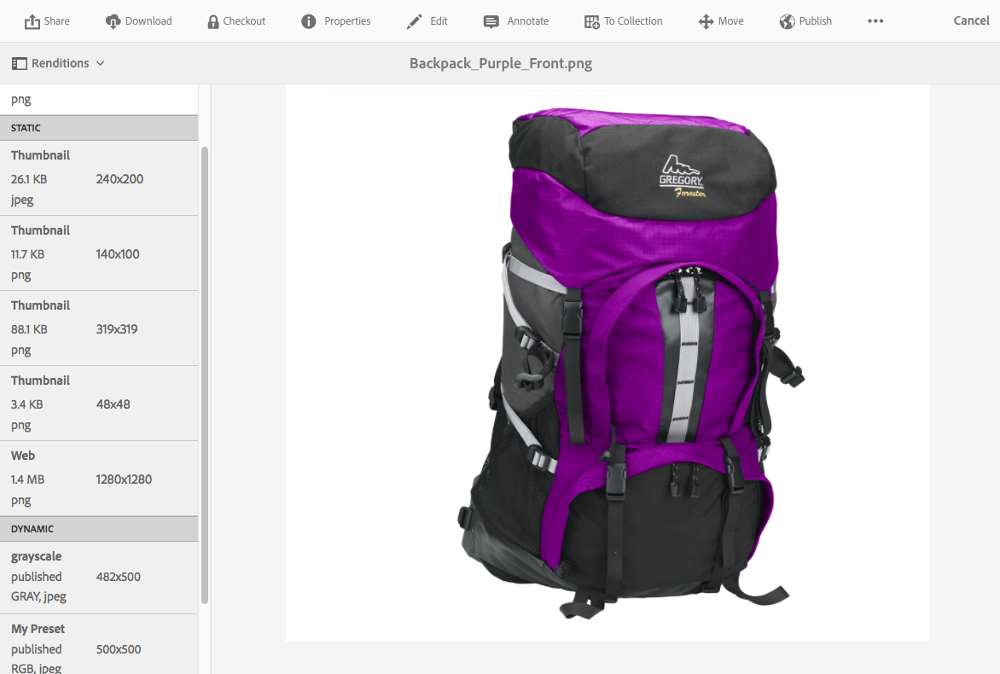

# Werken met Dynamic Media {#working-with-dynamic-media}

[Met Dynamic Media](https://www.adobe.com/solutions/web-experience-management/dynamic-media.html) kunt u op aanvraag rijke visuele producten en marketingmaterialen leveren, die automatisch worden geschaald voor gebruik op websites, mobiele apparaten en sociale sites. Met behulp van een set primaire bronelementen genereert Dynamic Media meerdere variaties van rijke inhoud in real-time via het algemene, schaalbare, voor prestaties geoptimaliseerde netwerk.

Dynamische media zijn geschikt voor interactieve kijkervaringen, zoals zoomen, 360 graden draaien en video. Dynamische media verenigt op unieke wijze de workflows van de Adobe Experience Manager Digital Asset Management (Assets)-oplossing om het beheerproces voor digitale campagnes te vereenvoudigen en te stroomlijnen.

>[!NOTE]
>
>Er is een Community-artikel beschikbaar over [Werken met Adobe Experience Manager en Dynamic Media](https://helpx.adobe.com/experience-manager/using/aem_dynamic_media.html).

## Wat u met Dynamische Media kunt doen {#what-you-can-do-with-dynamic-media}

Met Dynamische media kunt u uw elementen beheren voordat u ze publiceert. Over het werken met middelen in het algemeen wordt uitvoerig ingegaan in het [Werken met Digitale Activa](manage-assets.md). Algemene onderwerpen zijn het uploaden, downloaden, bewerken en publiceren van middelen; weergeven en bewerken van eigenschappen en zoeken naar elementen.

De dynamische Media-enige eigenschappen omvatten het volgende:

* [Carousel-banners](carousel-banners.md)
* [Image Sets](image-sets.md)
* [Interactieve afbeeldingen](interactive-images.md)
* [Interactieve video&#39;s](interactive-videos.md)
* [Mixed Media Sets](mixed-media-sets.md)
* [Panoramische afbeeldingen](panoramic-images.md)

* [Spin Sets](spin-sets.md)
* [Video](video.md)
* [Dynamische media-elementen leveren](delivering-dynamic-media-assets.md)
* [Elementen beheren](managing-assets.md)
* [Quickviews gebruiken om aangepaste pop-ups te maken](custom-pop-ups.md)

Zie ook Dynamische media [instellen](administering-dynamic-media.md).

>[!NOTE]
>
>Om de verschillen te begrijpen tussen het gebruiken van Dynamische Media en het integreren van Dynamische Klassieke Media met AEM, zie [Dynamische integratie van Media Klassieke tegenover Dynamische Media](/help/sites-administering/scene7.md#aem-scene-integration-versus-dynamic-media).

## Dynamische media ingeschakeld en Dynamische media uitgeschakeld {#dynamic-media-on-versus-dynamic-media-off}

U kunt zien of Dynamische media is ingeschakeld (ingeschakeld) door de volgende kenmerken:

* Dynamische uitvoeringen zijn beschikbaar wanneer u elementen downloadt of een voorvertoning weergeeft.
* Afbeeldingssets, centrifuges en gemengde mediasets zijn beschikbaar.
* PTIFF-uitvoeringen worden gemaakt.

Wanneer u op een afbeeldingselement klikt, is de weergave van het element anders en Dynamische media is [ingeschakeld](config-dynamic.md#enabling-dynamic-media). Dynamische media gebruikt de HTML5-viewers op aanvraag.

### Dynamische uitvoeringen {#dynamic-renditions}

Dynamische uitvoeringen zoals voorinstellingen voor afbeeldingen en viewers (onder **[!UICONTROL Dynamic]**) zijn beschikbaar wanneer Dynamische media is ingeschakeld.

### Afbeeldingssets, spelensets, gemengde mediasets {#image-sets-spins-sets-mixed-media-sets}

Afbeeldingssets, centrifuges en gemengde mediasets zijn beschikbaar als Dynamische media is ingeschakeld.

### PTIFF-uitvoeringen {#ptiff-renditions}

Dynamische media-elementen zijn onder andere `pyramid.tiffs`.

### Weergave van element wijzigen {#asset-views-change}

Als Dynamische media is ingeschakeld, kunt u in- en uitzoomen door op de `+` knoppen en `-` knoppen te klikken. U kunt ook op een bepaald gebied klikken of erop tikken. Met Omkeren gaat u naar de oorspronkelijke versie en u kunt de afbeelding op het volledige scherm weergeven door op de diagonale pijlen te klikken. Dynamische media ingeschakeld ziet er als volgt uit:

Met Dynamische media uitgeschakeld kunt u in- en uitzoomen en terugkeren naar de oorspronkelijke grootte:

