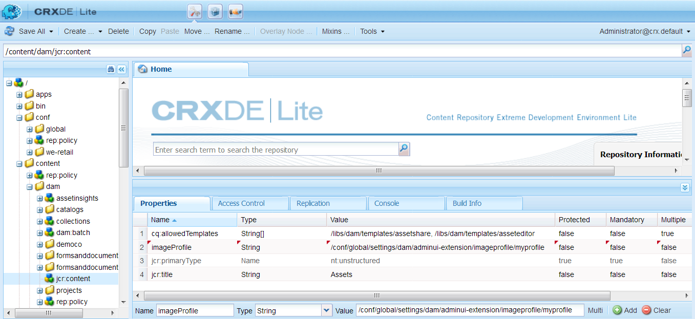

# Dynamic Media-afbeeldingsprofielen {#image-profiles}

Wanneer u afbeeldingen uploadt, kunt u de afbeelding tijdens het uploaden automatisch uitsnijden door een afbeeldingsprofiel toe te passen op de map.

>[!IMPORTANT]
>
>* Slim uitsnijden is alleen beschikbaar in de modus Dynamic Media - Scene7.
>* Afbeeldingsprofielen zijn niet van toepassing op PDF-, geanimeerde GIFFEN- of INDD-bestanden (Adobe InDesign).

## Opties voor uitsnijden {#crop-options}

Wanneer u Slim uitsnijden op afbeeldingen implementeert, raadt de Adobe de volgende aanbevolen procedures aan en past de volgende limiet toe:

| Type limiet | Beste praktijken | Oplegde limiet |
| --- | --- | --- |
| Aantal slimme uitsnijdingen per afbeelding | 5 | 100 |

Zie ook {de beperkingen van 0} Dynamic Media [&#128279;](/help/assets/limitations.md).

<!-- CQDOC-16069 for paragraph directly below -->

De coördinaten voor Slim uitsnijden zijn afhankelijk van de hoogte-breedteverhouding. Als voor de verschillende instellingen voor slimme uitsnijdingen in een afbeeldingsprofiel de hoogte-breedteverhouding voor de toegevoegde afmetingen in het afbeeldingsprofiel gelijk is, wordt dezelfde hoogte-breedteverhouding naar Dynamic Media verzonden. Adobe raadt u aan hetzelfde snijgebied te gebruiken. Zo voorkomt u dat er invloed optreedt op verschillende afmetingen die in het afbeeldingsprofiel worden gebruikt.

Voor elke SmartCrop-generatie die u maakt, is extra verwerkingstijd nodig. Als u bijvoorbeeld meer dan vijf slimme-uitsnijdverhoudingen toevoegt, kan dit leiden tot een langzame opname van elementen. Het veroorzaakt ook een verhoogde belasting op systemen. Omdat u Slim Uitsnijden op het omslagniveau kunt toepassen, adviseert de Adobe dat u het op omslagen *slechts* gebruikt waar het nodig is.

**Richtlijnen voor het bepalen van Slimme Uitsnede in een Profiel van het Beeld**
Om het gebruik van SmartCrop onder controle te houden en de verwerkingstijd en opslag van gewassen te optimaliseren, beveelt de Adobe de volgende richtlijnen en tips aan:

* Op afbeeldingselementen waarop een slimme uitsnijding wordt toegepast, moet minimaal 50 x 50 pixels of groter zijn.
* In het ideale geval hebt u 10-15 slimme gewassen per afbeelding om de beeldverhoudingen en de verwerkingstijd te optimaliseren.
* Noem slimme gewassen die op gewassenafmetingen worden gebaseerd, niet op eindgebruik. Dit helpt u te optimaliseren voor duplicaten waarbij één dimensie op meerdere pagina&#39;s wordt gebruikt.
* Maak paginagewijs/middelengewijs afbeeldingsprofielen voor specifieke mappen en submappen in plaats van een algemeen profiel voor slimme uitsnijdingen dat wordt toegepast op alle mappen of alle elementen.
* Een afbeeldingsprofiel dat u op submappen toepast, overschrijft een afbeeldingsprofiel dat op de map is toegepast.
* Een afbeeldingsprofiel dat dubbele slimme-uitsnijdafmetingen bevat, is niet toegestaan.
* Dubbele benoemde afbeeldingsprofielen waarvoor opties voor slim uitsnijden zijn ingesteld, zijn niet toegestaan.

U hebt twee opties voor het uitsnijden van afbeeldingen waaruit u kunt kiezen: Uitsnijden van pixels of Slim uitsnijden. U kunt er ook voor kiezen om het maken van kleur- en afbeeldingsstalen te automatiseren.

>[!IMPORTANT]
>
>* De Adobe raadt u aan de gegenereerde gewassen en stalen te herzien om ervoor te zorgen dat deze geschikt en relevant zijn voor uw merk en waarden.
>* CMYK-afbeeldingsindeling wordt niet ondersteund voor slim uitsnijden.

| Optie | Wanneer gebruiken | Beschrijving |
| --- | --- | --- |
| Uitsnijden met pixels | Bulk uitsnijdafbeeldingen alleen op basis van afmetingen. | Als u deze optie wilt gebruiken, selecteert u **[!UICONTROL Pixel Crop]** in de vervolgkeuzelijst Uitsnijdopties.   om van de kanten van een beeld uit te snijden, gaat u het aantal pixel in om van om het even welke kant of elke kant van het beeld uit te snijden. Hoeveel van de afbeelding wordt uitgesneden, is afhankelijk van de ppi-instelling (pixels per inch) in het afbeeldingsbestand.   het pixeluitsnijding van het Profiel van het Beeld geeft op de volgende manier terug: ・ De waarden zijn Boven, Onder, Links, en Rechts. ・ Linksboven wordt beschouwd als `0,0` en de pixeluitsnede wordt daar berekend. ・ Beginpunt voor uitsnijden: Links is X en Boven is Y  ・ Horizontale berekening: horizontale pixelafmeting van de oorspronkelijke afbeelding min Links en vervolgens minus Rechts. ・ Verticale berekening: verticale pixelhoogte minus Boven en vervolgens minus Onder.   bijvoorbeeld, veronderstel u een 4000x 3000 pixelbeeld hebt. U gebruikt waarden: Top=250, Bottom=500, Left=300, Right=700.   van Linksboven (300.250) gewas gebruikend de vullingsruimte van (4000-300-700, 300-250-500, of 3000.2250). |
| Slim uitsnijden | Bulk uitsnijdafbeeldingen op basis van hun visuele brandpunt. | Smart Crop maakt gebruik van de kracht van kunstmatige intelligentie in Adobe Sensei om het uitsnijden van afbeeldingen in bulk te automatiseren. Met Slim uitsnijden wordt automatisch het brandpunt in een afbeelding opgespoord en uitgesneden om het gewenste aandachtspunt vast te leggen, ongeacht de schermgrootte.
 
Als u Slim uitsnijden wilt gebruiken, selecteert u **[!UICONTROL Smart Crop]** in de vervolgkeuzelijst Uitsnijdopties en schakelt u de functie in (schakel deze in) rechts van Uitsnijden van responsieve afbeelding.
 
De standaardformaten voor breekpunten van Groot, Medium en Klein dekken over het algemeen het volledige bereik van formaten die de meeste afbeeldingen op mobiele apparaten en tablets, desktops en banners gebruiken. Desgewenst kunt u de standaardnamen van Groot, Medium en Klein bewerken.
 
Als u meer onderbrekingspunten wilt toevoegen, selecteert u **[!UICONTROL Add Crop]** om een uitsnijding te verwijderen en selecteert u het pictogram met de prullenbak. |
| Kleur en afbeeldingsstaal | Met Bulk wordt voor elke afbeelding een afbeeldingsstaal gegenereerd. | **Nota**: Het slimme Staal wordt niet gesteund in Dynamic Media Classic.   bepaal de plaats en produceert automatisch van uitstekende kwaliteit stalen van productbeelden die kleur of textuur tonen.   om het Staal van de Kleur en van het Beeld te gebruiken, selecteer **[!UICONTROL Smart Crop]** van de drop-down lijst van de Opties van het Uitsnijden, dan rechts van Kleur en het Monster van het Beeld, laat (zet) de eigenschap toe. Geef een pixelwaarde op in de tekstvakken Breedte en Hoogte.   terwijl alle beeldgewassen van het spoor van Vertoningen beschikbaar zijn, worden de monsters slechts gebruikt als eigenschap van het Exemplaar URL. Gebruik uw eigen weergavecomponent om het staal op uw site te renderen. (De uitzondering op deze regel zijn carrouselbanners. Dynamic Media biedt de weergavecomponent voor het staal dat wordt gebruikt in carrouselbanners.)  **Gebruikend beeldmonsters**  URL voor beeldmonsters is ongecompliceerd. Het is:  `/is/image/company/&lt;asset_name&gt;:Swatch`  waar `:Swatch` aan het activaverzoek wordt toegevoegd.  **Gebruikend kleurenstalen**  om kleurenstalen te gebruiken, maakt u a `req=userdata` verzoek met het volgende: `/is/image/&lt;company_name&gt;/&lt;swatch_asset_name&gt;:Swatch?req=userdata`   Bijvoorbeeld, is het volgende een staalactiva in Dynamic Media Classic: `https://my.company.com:8080/is/image/DemoCo/Sleek:Swatch`  en hier is het overeenkomstige de dienovereenkomstige `req=userdata` URL van de staalactiva: `https://my.company.com:8080/is/image/DemoCo/Sleek:Swatch?req=userdata`   De `req=userdata` reactie is als volgt: `SmartCropDef=Swatch SmartCropHeight=200.0` `SmartCropRect=0.421671,0.389815,0.0848564,0.0592593,200,200` `SmartCropType=Swatch` `SmartCropWidth=200.0` `SmartSwatchColor=0xA56DB2`   u kunt een `req=userdata` reactie in of XML of formaat JSON, zoals in verzoeken respectieve URL voorbeelden: `https://my.company.com:8080/is/image/DemoCo/Sleek:Swatch?req=userdata,json` `https://my.company.com:8080/is/image/DemoCo/Sleek:Swatch?req=userdata,xml`  **Nota:** creeer uw eigen component WCM om een kleurenmonster te verzoeken en de `SmartSwatchColor` attributen te ontleden, die door een 24 beetjeRGB hexadecimale waarde worden vertegenwoordigd.   zie ook [`userdata` in de Gids van de Verwijzing van Kijkers ](https://experienceleague.adobe.com/en/docs/dynamic-media-developer-resources/image-serving-api/image-serving-api/http-protocol-reference/command-reference/req/r-userdata). |

## Onscherp masker {#unsharp-mask}

Met **[!UICONTROL Unsharp mask]** kunt u een verscherpingsfiltereffect op de uiteindelijke gedownsampelde afbeelding perfectioneren. U kunt de intensiteit van het effect, de straal van het effect (gemeten in pixels) en een drempel voor contrast instellen die wordt genegeerd. Dit effect gebruikt de zelfde opties zoals Adobe Photoshop *Onscherp filter van het Masker*.

>[!NOTE]
>
>Het onscherp masker wordt alleen toegepast op geschaalde uitvoeringen in de PTIFF-indeling (piramide tiff) die meer dan 50% zijn gedownsampled. Dit betekent dat de grootst mogelijke uitvoeringen binnen het pad niet worden beïnvloed door het onscherpe masker, terwijl kleinere uitvoeringen zoals miniaturen worden gewijzigd (en het onscherpe masker tonen).

In **[!UICONTROL Unsharp Mask]** hebt u de volgende filteropties:

| Optie | Beschrijving |
| --- | --- |
| Hoeveelheid | Hiermee bepaalt u de hoeveelheid contrast die wordt toegepast op de randpixels. De standaardwaarde is 1,75. Voor afbeeldingen met een hoge resolutie kunt u de resolutie verhogen tot maximaal 5. Beschouw Hoeveelheid als een maat voor de filterintensiteit. Het bereik is 0-5. |
| Straal | Hiermee bepaalt u het aantal pixels rondom de randpixels dat invloed heeft op de verscherping. Voer voor afbeeldingen met een hoge resolutie een waarde in tussen 1 en 2. Met een lage waarde worden alleen de randpixels verscherpt; met een hoge waarde wordt een bredere reeks pixels verscherpt. De juiste waarde is afhankelijk van de grootte van de afbeelding. De standaardwaarde is 0,2. Het bereik is 0-250. |
| Drempel | Hiermee bepaalt u het contrastbereik dat moet worden genegeerd wanneer het filter Onscherp masker wordt toegepast. Met andere woorden, met deze optie bepaalt u hoe verschillend de verscherpte pixels moeten zijn van het omringende gebied voordat ze als randpixels worden beschouwd en worden verscherpt. Experimenteer met waarden tussen 0 en 255 om ruis te voorkomen. |

Verscherpen wordt beschreven in [ het Verscherpen Beelden ](/help/assets/assets/sharpening_images.pdf).

## Dynamic Media-afbeeldingsprofielen maken {#creating-image-profiles}

Om geavanceerde verwerkingsparameters voor andere activa te bepalen types, zie [ Vormend de Verwerking van Activa ](config-dms7.md#configuring-asset-processing).

Zie [ Profielen voor de Meta-gegevens van de Verwerking, Beelden, en Video&#39;s ](processing-profiles.md).

Zie ook [ Beste praktijken voor het Organiseren van uw Digitale Assets voor het gebruiken van Profielen van de Verwerking ](/help/assets/organize-assets.md).

**om de Profielen van het Beeld van Dynamic Media tot stand te brengen:**

1. Selecteer het Adobe Experience Manager-logo en ga naar **[!UICONTROL Tools]** > **[!UICONTROL Assets]** > **[!UICONTROL Image Profiles]** .
1. Selecteer **[!UICONTROL Create]** om een afbeeldingsprofiel toe te voegen.
1. Voer een profielnaam en waarden in voor onscherp masker, uitsnijden of staal of voor beide.

   Gebruik een profielnaam die specifiek is voor het beoogde doel. Als u bijvoorbeeld een profiel wilt maken dat alleen stalen genereert, dat wil zeggen dat Slim uitsnijden is uitgeschakeld (uitgeschakeld) en Kleur en Afbeeldingsstaal is ingeschakeld (ingeschakeld), gebruikt u de profielnaam &quot;Slimme stalen&quot;.

   Zie ook [Opties voor slim bijsnijden en slimme stalen](#crop-options) en [Onscherp masker](#unsharp-mask).

   

1. Selecteer **[!UICONTROL Save]**. Het nieuwe profiel wordt weergegeven in de lijst met beschikbare profielen.

## Dynamic Media-afbeeldingsprofielen bewerken of verwijderen {#editing-or-deleting-image-profiles}

1. Selecteer het logo van de Experience Manager en ga naar **[!UICONTROL Tools]** > **[!UICONTROL Assets]** > **[!UICONTROL Image Profiles]** .
1. Selecteer het afbeeldingsprofiel dat u wilt bewerken of verwijderen. Selecteer **[!UICONTROL Edit Image Profile]** als u het bestand wilt bewerken. Selecteer **[!UICONTROL Delete Image Profile]** als u het wilt verwijderen.

   

1. Sla de wijzigingen op als u het bestand bewerkt. Bevestig bij verwijderen dat u het profiel wilt verwijderen.

## Dynamic Media-afbeeldingsprofiel toepassen op mappen {#applying-an-image-profile-to-folders}

Wanneer u een afbeeldingsprofiel toewijst aan een map, nemen eventuele submappen het profiel automatisch over van de bovenliggende map. Dit betekent dat u slechts één afbeeldingsprofiel aan een map kunt toewijzen. Denk daarom zorgvuldig na over de mapstructuur van de locatie waar u middelen uploadt, opslaat, gebruikt en archiveert.

Als u een ander afbeeldingsprofiel aan een map hebt toegewezen, overschrijft het nieuwe profiel het vorige profiel. De vorige bestaande mapelementen blijven ongewijzigd. Het nieuwe profiel wordt toegepast op de elementen die later aan de map worden toegevoegd.

Mappen waaraan een profiel is toegewezen, worden in de gebruikersinterface aangegeven met de profielnaam die op de kaart wordt weergegeven.

<!-- When you add smart crop to an existing Image Profile, you need to re-trigger the [DAM Update Asset workflow](assets-workflow.md) if you want to generate crops for existing assets in your asset repository. -->

U kunt afbeeldingsprofielen toepassen op specifieke mappen of op alle elementen.

U kunt elementen opnieuw verwerken in een map die al een bestaand afbeeldingsprofiel heeft dat u later hebt gewijzigd. Zie [ activa in een omslag opnieuw verwerken nadat u zijn verwerkingsprofiel ](processing-profiles.md#reprocessing-assets) hebt uitgegeven.

### Dynamic Media-afbeeldingsprofielen toepassen op specifieke mappen {#applying-image-profiles-to-specific-folders}

U kunt vanuit het menu **[!UICONTROL Tools]** of vanuit **[!UICONTROL Properties]** een afbeeldingsprofiel toepassen op een map. In deze sectie wordt beschreven hoe u op beide manieren afbeeldingsprofielen kunt toepassen op mappen.

Mappen waaraan al een profiel is toegewezen, worden aangegeven door de naam van het profiel direct onder de mapnaam weer te geven.

U kunt elementen in een map opnieuw verwerken die al een bestaand videoprofiel heeft dat u later wijzigt. Zie [ activa in een omslag opnieuw verwerken nadat u zijn verwerkingsprofiel ](processing-profiles.md#reprocessing-assets) hebt uitgegeven.

#### Dynamic Media-afbeeldingsprofielen toepassen op mappen vanuit de gebruikersinterface Profielen {#applying-image-profiles-to-folders-from-profiles-user-interface}

1. Selecteer het logo van de Experience Manager en ga naar **[!UICONTROL Tools]** > **[!UICONTROL Assets]** > **[!UICONTROL Image Profiles]** .
1. Selecteer het afbeeldingsprofiel dat u wilt toepassen op een of meerdere mappen.

   

1. Selecteer **[!UICONTROL Apply Processing Profile to Folders]** en selecteer de map of meerdere mappen die u wilt gebruiken om de nieuw geüploade elementen te ontvangen en selecteer **[!UICONTROL Apply]** . Mappen waaraan al een profiel is toegewezen, worden aangegeven door de naam van het profiel direct onder de mapnaam weer te geven.

#### Dynamic Media-afbeeldingsprofielen toepassen op mappen vanuit eigenschappen {#applying-image-profiles-to-folders-from-properties}

1. Selecteer het logo van het Experience League en navigeer naar **[!UICONTROL Assets]** . Navigeer vervolgens naar de bovenliggende map van de map waarop u een afbeeldingsprofiel wilt toepassen.
1. Selecteer in de map het vinkje om het te selecteren en selecteer vervolgens **[!UICONTROL Properties]** .
1. Selecteer de tab **[!UICONTROL Image Profiles]** . Selecteer in de vervolgkeuzelijst **[!UICONTROL Profile Name]** het profiel en selecteer vervolgens **[!UICONTROL Save & Close]** . Mappen waaraan al een profiel is toegewezen, worden aangegeven door de naam van het profiel direct onder de mapnaam weer te geven.

   

### Een Dynamic Media-afbeeldingsprofiel wereldwijd toepassen {#applying-an-image-profile-globally}

Naast het toepassen van een profiel op een map, kunt u er ook een globaal toepassen, zodat het geselecteerde profiel wordt toegepast op inhoud die is geüpload naar Experience Manager-elementen in een map.

U kunt elementen in een map opnieuw verwerken die al een bestaand videoprofiel heeft dat u later wijzigt. Zie [ het Opverwerken activa in een omslag nadat u zijn verwerkingsprofiel ](processing-profiles.md#reprocessing-assets) hebt uitgegeven.

**om een Profiel van het Beeld van Dynamic Media globaal toe te passen:**

1. Voer een van de volgende handelingen uit:

   * Navigeer naar `https://&lt;AEM server&gt;/mnt/overlay/dam/gui/content/assets/foldersharewizard.html/content/dam` en pas het juiste profiel toe en selecteer **[!UICONTROL Save]** .

     

   * Navigeer naar CRXDE Lite naar het volgende knooppunt: `/content/dam/jcr:content` .

     Voeg de eigenschap `imageProfile:/conf/global/settings/dam/adminui-extension/imageprofile/<name of image profile>` toe en selecteer **[!UICONTROL Save All]** .

     

## Het slimme uitsnijdstaal of het slimme staal van één afbeelding bewerken {#editing-the-smart-crop-or-smart-swatch-of-a-single-image}

>[!IMPORTANT]
>
>* Slim uitsnijden is alleen beschikbaar in de modus Dynamic Media - Scene7.

U kunt het venster voor slimme uitsnijden van een afbeelding handmatig opnieuw uitlijnen of het formaat ervan wijzigen om het brandpunt verder te verfijnen.

Nadat u een slim uitsnijden hebt bewerkt en opgeslagen, wordt de wijziging doorgegeven overal waar u het uitsnijden voor de specifieke afbeeldingen gebruikt.

Herhaal de slimme uitsnijding om de extra uitsnijdingen indien nodig opnieuw te genereren.

Zie ook [ uitgeven het slimme gewas of het slimme monster van veelvoudige beelden ](#editing-the-smart-crop-or-smart-swatch-of-multiple-images).

**om het slimme gewas of slim monster van één enkel beeld uit te geven:**

1. Selecteer het logo van de Experience Manager en navigeer naar **[!UICONTROL Assets]** en vervolgens naar de map waarop een profiel voor slimme uitsnijdingen of slimme stalen is toegepast.
1. Selecteer de map zodat u de inhoud ervan kunt openen.
1. Selecteer de afbeelding waarvan u de slimme uitsnijding of het slimme staal wilt aanpassen.
1. Selecteer **[!UICONTROL Smart Crop]** in de werkbalk.

   >[!TIP]
   >
   >Gebruik de sneltoets `s` om de slimme gewassen of slimme stalen te bewerken.

1. Voer een van de volgende handelingen uit:

   * Sleep de schuifregelaar naar links of rechts boven in de rechterbovenhoek van de pagina om respectievelijk de weergave van de afbeelding te vergroten of te verkleinen.
   * Sleep in de afbeelding een hoekgreep om de grootte van het zichtbare gebied van het uitsnijden of staal aan te passen.
   * Sleep het vak of het staal in de afbeelding naar een nieuwe locatie. U kunt alleen afbeeldingsstalen bewerken; kleurstalen zijn statisch.
   * Selecteer **[!UICONTROL Revert]** boven de afbeelding om alle bewerkingen ongedaan te maken en het oorspronkelijke uitsnijd of staal te herstellen.

1. Selecteer **[!UICONTROL Save]** in de rechterbovenhoek van de pagina en selecteer **[!UICONTROL Close]** om terug te keren naar de map met elementen.

## Het slimme uitsnijdstaal of het slimme staal van meerdere afbeeldingen bewerken {#editing-the-smart-crop-or-smart-swatch-of-multiple-images}

>[!IMPORTANT]
>
>* Slim uitsnijden is alleen beschikbaar in de modus Dynamic Media - Scene7.

Nadat u een afbeeldingsprofiel met slimme uitsnijding hebt toegepast op een map, is op alle afbeeldingen in die map een uitsnijding toegepast. Indien gewenst, kunt u *manueel* opnieuw uitlijnen of resize het slimme gewassenvenster in veelvoudige beelden om hun brandpunt verder te verfijnen.

Nadat u een slim uitsnijden hebt bewerkt en opgeslagen, wordt de wijziging doorgegeven overal waar u het uitsnijden voor de specifieke afbeeldingen gebruikt.

Herhaal de slimme uitsnijding om de extra uitsnijdingen indien nodig opnieuw te genereren.

**om het slimme gewas of slim monster van veelvoudige beelden uit te geven:**

1. Selecteer het logo van de Experience Manager en navigeer naar **[!UICONTROL Assets]** en vervolgens naar een map waarop een profiel voor slimme uitsnijdingen of slimme stalen is toegepast.
1. Selecteer in de map het pictogram **[!UICONTROL More Actions]** (...) en selecteer vervolgens **[!UICONTROL Smart Crop]** .

1. Voer op de pagina **[!UICONTROL Edit Smart Crops]** een van de volgende handelingen uit:

   * Pas de weergavegrootte van afbeeldingen op de pagina aan.

     Sleep de schuifregelaar naar links of rechts naast de vervolgkeuzelijst voor de naam van het onderbrekingspunt om het formaat van de weergave van de weer te geven afbeelding te wijzigen.

     

   * Filter de lijst met weer te geven afbeeldingen op basis van namen van onderbrekingspunten. In het onderstaande voorbeeld worden de afbeeldingen gefilterd met de naam van het onderbrekingspunt &quot;Medium&quot;.

     Selecteer in de vervolgkeuzelijst in de rechterbovenhoek van de pagina een naam voor het onderbrekingspunt om te filteren op welke afbeeldingen u ziet. (Zie de bovenstaande afbeelding.)

     

   * Pas het formaat van het vak voor slimme uitsnijden aan. Voer een van de volgende handelingen uit:

      * Als de afbeelding alleen een slim uitsnijden of een slim staal bevat, sleept u de hoekgreep van het uitsnijdvak om de grootte van het zichtbare gebied van het uitsnijden aan te passen.
      * Als de afbeelding zowel een slim uitsnijden als een slim staal bevat, sleept u de hoekgreep van het uitsnijdvak om de grootte van het zichtbare gebied van het uitsnijden aan te passen. U kunt ook het slimme staal onder de afbeelding selecteren (kleurstalen zijn statisch) en vervolgens de hoekgreep van het uitsnijdvak slepen om de grootte van het zichtbare gedeelte van het staal aan te passen.

     

   * Het vak voor slimme uitsnijding verplaatsen. Voer een van de volgende handelingen uit:

      * Als de afbeelding alleen een slim uitsnijden of een slim staal bevat, sleept u het uitsnijdvak naar een nieuwe locatie.
      * Als de afbeelding zowel een slim uitsnijden als een slim staal bevat, sleept u het vak voor slim uitsnijden naar een nieuwe locatie. U kunt ook het slimme staal onder de afbeelding selecteren (kleurstalen zijn statisch) en het uitsnijdvak van het slimme staal naar een nieuwe locatie slepen.

      uit

   * Maak alle bewerkingen ongedaan en herstel het oorspronkelijke slimme uitsnijdstaal of het oorspronkelijke slimme staal (alleen van toepassing op de huidige bewerkingssessie).

     Selecteer **[!UICONTROL Revert]** boven de afbeelding.

     

1. Selecteer **[!UICONTROL Save]** in de rechterbovenhoek van de pagina en selecteer **[!UICONTROL Close]** om terug te keren naar de map met elementen.

## Dynamic Media-afbeeldingsprofiel verwijderen uit mappen {#removing-an-image-profile-from-folders}

Wanneer u een afbeeldingsprofiel uit een map verwijdert, nemen eventuele submappen automatisch de verwijdering van het profiel uit de bovenliggende map over. Alle verwerking van bestanden die in de mappen zijn opgetreden, blijft echter intact.

U kunt een afbeeldingsprofiel uit een map verwijderen vanuit het menu **[!UICONTROL Tools]** of vanuit **[!UICONTROL Properties]** als u in de map bent. In deze sectie wordt beschreven hoe u afbeeldingsprofielen op beide manieren uit mappen kunt verwijderen.

### Dynamic Media-afbeeldingsprofielen uit mappen verwijderen via de gebruikersinterface Profielen {#removing-image-profiles-from-folders-via-profiles-user-interface}

1. Selecteer het logo van de Experience Manager en ga naar **[!UICONTROL Tools]** > **[!UICONTROL Assets]** > **[!UICONTROL Image Profiles]** .
1. Selecteer het afbeeldingsprofiel dat u uit een of meerdere mappen wilt verwijderen.
1. Selecteer **[!UICONTROL Remove Processing Profile from Folders]** en selecteer de map of meerdere mappen waaruit u het profiel wilt verwijderen en selecteer **[!UICONTROL Remove]** .

   U kunt bevestigen dat het afbeeldingsprofiel niet meer wordt toegepast op een map omdat de naam niet langer onder de mapnaam wordt weergegeven.

### Eigenschappen Dynamic Media-afbeeldingsprofielen uit mappen verwijderen {#removing-image-profiles-from-folders-via-properties}

1. Selecteer het logo van de Experience Manager en navigeer **[!UICONTROL Assets]** naar de map waarvan u een afbeeldingsprofiel wilt verwijderen.
1. Selecteer in de map het vinkje om het te selecteren en selecteer vervolgens **[!UICONTROL Properties]** .
1. Selecteer de tab **[!UICONTROL Image Profiles]** .
1. Selecteer in de vervolgkeuzelijst **[!UICONTROL Profile Name]** eerst **[!UICONTROL None]** en vervolgens **[!UICONTROL Save & Close]** .

   Mappen waaraan al een profiel is toegewezen, worden aangegeven door de naam van het profiel direct onder de mapnaam weer te geven.
