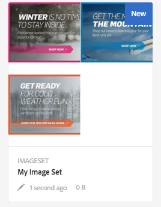
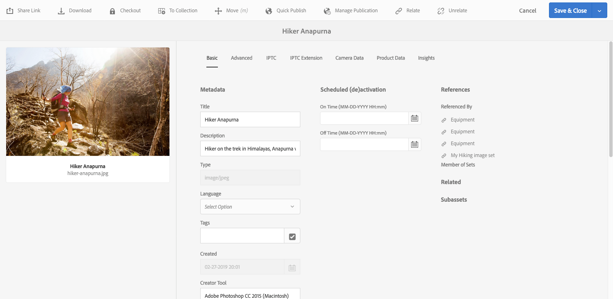

# Afbeeldingssets {#image-sets}

Afbeeldingssets bieden gebruikers een geïntegreerde weergave, waarbij gebruikers verschillende weergaven van een item kunnen zien door een miniatuurafbeelding te selecteren. Met Afbeeldingssets kunt u alternatieve weergaven van een item presenteren en de viewer beschikt over zoomgereedschappen waarmee u afbeeldingen op de juiste wijze kunt bekijken.

Afbeeldingssets worden aangegeven door een banner met het woord `IMAGESET` . Als de afbeeldingset wordt gepubliceerd, wordt bovendien de publicatiedatum, die door het pictogram **[!UICONTROL World]** wordt aangegeven, samen met de laatste wijzigingsdatum op de banner weergegeven. Dit wordt aangegeven door het pictogram **[!UICONTROL Pencil]**.

In de Afbeeldingsset kunt u ook stalen maken door een Afbeeldingsset te maken en miniaturen toe te voegen.

Deze toepassing is handig wanneer u een item in een andere kleur, in een ander patroon of in een ander patroon wilt weergeven. Als u een afbeeldingsset met kleurstalen wilt maken, hebt u één afbeelding nodig voor elke andere kleur, elk patroon of elke afwerking die u aan de gebruikers wilt presenteren. Voor elke kleur, elk patroon of elke afwerking hebt u ook één kleur-, patroon- of eindstaal nodig.

Stel dat u afbeeldingen van uiteinden met verschillende kleurrekeningen wilt weergeven. De rekeningen zijn rood, groen en blauw. In dit geval hebt u drie opnamen van hetzelfde kapje nodig. Je hebt een opname nodig met een rood, een met een groen en een met een blauwe rekening. U hebt ook een rood, groen en blauw kleurenstaal nodig. De kleurstalen fungeren als de miniaturen die gebruikers in de Staalset-viewer selecteren om de rode, groene of blauwe rechthoek te zien.

>[!NOTE]
>
>Voor informatie over het gebruikersinterface van Assets, zie [&#x200B; activa &#x200B;](/help/assets/manage-assets.md) beheren.

Wanneer u een Reeks van het Beeld creeert, beveelt de Adobe de volgende beste praktijken aan en handhaaft de volgende grenzen:

| Type limiet | Beste praktijken | Oplegde limiet |
| --- | --- | --- |
| Aantal dubbele elementen per set | Geen duplicaten | 20‡ |
| Maximumaantal afbeeldingen per set | 5-10 afbeeldingen per set | 1000 |

‡ De beste manier is om geen dubbele elementen in een set te hebben. De limiet is 20 duplicaten voor één element. Als u nog een duplicaat voor dat element toevoegt (binnen die set), geeft de aanvraag een fout of wordt het duplicaat genegeerd.

Zie ook {de beperkingen van 0} Dynamic Media [&#128279;](/help/assets/limitations.md).

## Snel starten: Afbeeldingssets {#quick-start-image-sets}

**om u te krijgen in gebruik snel:**

1. [&#x200B; uploadt uw primaire bronbeelden voor veelvoudige meningen &#x200B;](#uploading-assets-in-image-sets).

   Begin door de beelden voor uw Reeksen van het Beeld te uploaden. Wanneer u afbeeldingen kiest, moet u niet vergeten dat uw klanten op afbeeldingen kunnen zoomen in de viewer voor de afbeeldingsset. Zorg ervoor dat de afbeeldingen ten minste 2000 pixels groot zijn voor optimale zoomdetails. Dynamic Media kan afbeeldingen renderen tot 25 MP (megapixels). U kunt bijvoorbeeld een afbeelding van 5000 x 5000 MP of een andere formaatcombinatie van maximaal 25 MP gebruiken.

   Zie [&#x200B; Dynamic Media - de Ondersteunde formaten van het roosterbeeld &#x200B;](/help/assets/assets-formats.md#supported-raster-image-formats-dynamic-media) voor een lijst van formaten die door de Reeksen van het Beeld worden gesteund.

<!--    Adobe Experience Manager Assets supports many image file formats, but lossless TIFF, PNG, and EPS images are recommended. -->

1. [&#x200B; creeer een Reeks van het Beeld &#x200B;](#creating-image-sets).

   In de Reeksen van het Beeld, selecteren de gebruikers duimnagelbeelden in de Vastgestelde Kijker van het Beeld.

   Ga naar **[!UICONTROL Create]** > **[!UICONTROL Image Sets]** om een Afbeeldingsset te maken in Assets. Voeg vervolgens afbeeldingen toe en selecteer **[!UICONTROL Save]** .

   U kunt beeldreeksen automatisch ook tot stand brengen door [&#x200B; partij vastgestelde vooraf instelt &#x200B;](/help/assets/config-dms7.md).
   >[!IMPORTANT]
   >
   >Batchsets worden gemaakt door het IPS (Image Production System) als onderdeel van het opnemen van elementen en zijn alleen beschikbaar in de Dynamic Media-Scene7-modus.

   Zie [&#x200B; Vastgestelde activa van het Beeld voor upload en het uploaden van uw dossiers &#x200B;](#uploading-assets-in-image-sets) voorbereiden.

   Zie [&#x200B; Werk met Kiezers &#x200B;](/help/assets/working-with-selectors.md).

1. Voeg [&#x200B; Voorinstellingen van de Kijker van het Beeld toe Vastgestelde &#x200B;](/help/assets/managing-viewer-presets.md), zoals nodig.

   Beheerders kunnen voorinstellingen voor de afbeeldingsset Viewer maken of wijzigen. Als u de Afbeeldingsset wilt weergeven met een viewervoorinstelling, selecteert u de Afbeeldingsset en selecteert u **[!UICONTROL Viewers]** in de vervolgkeuzelijst voor de linkertrack.

   Navigeer naar **[!UICONTROL Tools]** > **[!UICONTROL Assets]** > **[!UICONTROL Viewer Presets]** als u voorinstellingen voor viewers wilt maken of bewerken.

1. (Facultatief) [&#x200B; Mening een Reeks van het Beeld &#x200B;](/help/assets/image-sets.md#viewing-image-sets) die gebruikend partijreeks werden gecreeerd vooraf instelt.
1. [&#x200B; de Reeksen van het Beeld van de Voorproef &#x200B;](/help/assets/previewing-assets.md).

   Selecteer de Afbeeldingsset en u kunt er een voorvertoning van weergeven. Selecteer de miniatuurpictogrammen zodat u de Afbeeldingsset kunt bekijken in de geselecteerde viewer. U kunt verschillende viewers kiezen in het menu **[!UICONTROL Viewers]** , dat beschikbaar is in het keuzemenu voor de linkertrack.

1. [&#x200B; Publish en Reeks Beeld &#x200B;](/help/assets/publishing-dynamicmedia-assets.md).

   Als u een Afbeeldingsset publiceert, wordt de URL geactiveerd en wordt de code ingesloten. Bovendien moet u [&#x200B; publiceren om het even welke vooraf ingestelde douaneviewer &#x200B;](/help/assets/managing-viewer-presets.md) die u hebt gecreeerd. Voorinstellingen voor viewers buiten de box zijn al gepubliceerd.

1. [&#x200B; Verbinding URLs aan uw Toepassing van het Web &#x200B;](/help/assets/linking-urls-to-yourwebapplication.md) of [&#x200B; bed de Video of Kijker van het Beeld &#x200B;](/help/assets/embed-code.md) in.

   Experience Manager Assets maakt URL-aanroepen voor afbeeldingssets en activeert deze nadat u de afbeeldingssets hebt gepubliceerd. U kunt deze URL&#39;s kopiëren wanneer u elementen voorvertoont. U kunt ze ook insluiten op uw website.

   Selecteer de Afbeeldingset en selecteer vervolgens in de vervolgkeuzelijst voor het linkerspoor **[!UICONTROL Viewers]**.

   Zie [&#x200B; Verbinding een Beeld dat aan een Web-pagina &#x200B;](/help/assets/linking-urls-to-yourwebapplication.md) wordt geplaatst en [&#x200B; bed de Video of Kijker van het Beeld &#x200B;](/help/assets/embed-code.md) in.

Om de Reeksen van het Beeld uit te geven, zie [&#x200B; de Reeksen van het Beeld &#x200B;](#editing-image-sets) uitgeven. Bovendien kunt u [&#x200B; Vastgestelde eigenschappen van het Beeld bekijken en uitgeven &#x200B;](/help/assets/manage-assets.md#editing-properties).

Als u kwesties creërend reeksen hebt, zie Beelden en Reeksen in [&#x200B; het Oplossen van problemen Dynamic Media - de wijze van Scene7 &#x200B;](/help/assets/troubleshoot-dms7.md#images-and-sets).

## Elementen uploaden in afbeeldingssets {#uploading-assets-in-image-sets}

Begin door de beelden voor uw Reeksen van het Beeld te uploaden. Wanneer u afbeeldingen kiest, moet u niet vergeten dat uw klanten op afbeeldingen kunnen zoomen in de viewer voor de afbeeldingsset. Zorg ervoor dat de afbeeldingen ten minste 2000 pixels groot zijn. Afbeeldingssets ondersteunen veel indelingen voor afbeeldingsbestanden, maar afbeeldingen zonder verlies van de indelingen TIFF, PNG en EPS worden aanbevolen.

U kunt beelden voor de Reeksen van het Beeld zoals u [&#x200B; om het even welke andere activa in Assets &#x200B;](/help/assets/manage-assets.md#uploading-assets) uploadt.

Zie [&#x200B; Dynamic Media - de Ondersteunde formaten van het roosterbeeld &#x200B;](/help/assets/assets-formats.md#supported-raster-image-formats-dynamic-media) voor een lijst van formaten die door de Reeksen van het Beeld worden gesteund.

### Afbeeldingsset-elementen voorbereiden voor uploaden {#preparing-image-set-assets-for-upload}

Voordat u Afbeeldingssets maakt, moet u ervoor zorgen dat de afbeeldingen de juiste grootte en indeling hebben.

Als u een Afbeeldingsset met meerdere weergaven wilt maken, hebt u afbeeldingen nodig die een item vanuit verschillende gezichtspunten weergeven of verschillende aspecten van hetzelfde item weergeven. Het doel is om de belangrijke kenmerken van een item te benadrukken, zodat gebruikers een volledig beeld hebben van hoe het eruit ziet of werkt.

Omdat gebruikers kunnen inzoomen op afbeeldingen in Afbeeldingssets, moet u ervoor zorgen dat de afbeeldingen ten minste 2000 pixels groot zijn. <!-- Assets support many image file formats, but lossless TIFF, PNG, and EPS images are recommended. -->

>[!NOTE]
>
>Als u miniaturen gebruikt om productstalen aan te geven, moet u het volgende doen:
>
>U hebt vignetten of verschillende opnamen van dezelfde afbeelding nodig die deze in verschillende kleuren, patronen of afwerkingen weergeven. U hebt ook miniatuurbestanden nodig die overeenkomen met de verschillende kleuren, patronen of afwerkingen. Als u bijvoorbeeld miniaturen wilt weergeven met een Afbeeldingsset die hetzelfde jasje in zwart, bruin en groen toont, hebt u het volgende nodig:
>
>* Een zwarte, bruine en groene opname van hetzelfde jasje.
>* Een zwarte, bruine en groene kleurminiatuur.

## Een afbeeldingsset maken {#creating-image-sets}

U kunt Afbeeldingssets maken via de gebruikersinterface of via de API. In deze sectie wordt beschreven hoe u Afbeeldingssets maakt in de gebruikersinterface.

>[!NOTE]
>
>U kunt beeldreeksen automatisch ook tot stand brengen door [&#x200B; partij vastgestelde vooraf instelt &#x200B;](/help/assets/config-dms7.md#creating-batch-set-presets-to-auto-generate-image-sets-and-spin-sets).
>**Belangrijk:** de reeksen van de partij worden gecreeerd door IPS (het Systeem van de Productie van het Beeld) als deel van activa opnemen en zijn beschikbaar slechts op Dynamic Media - Scene7 wijze.

Wanneer u elementen aan de set toevoegt, worden deze automatisch in alfanumerieke volgorde toegevoegd. U kunt elementen handmatig opnieuw ordenen of sorteren nadat u ze hebt toegevoegd.

>[!NOTE]
>
>Afbeeldingssets worden niet ondersteund voor elementen met &quot;,&quot; (komma) in de bestandsnaam.

Wanneer u een Reeks van het Beeld creeert, beveelt de Adobe de volgende beste praktijken aan en handhaaft de volgende grenzen:

| Type limiet | Beste praktijken | Oplegde limiet |
| --- | --- | --- |
| Aantal dubbele elementen per set | Geen duplicaten | 20‡ |
| Maximumaantal afbeeldingen per set | 5-10 afbeeldingen per set | 1000 |

‡ De beste manier is om geen dubbele elementen in een set te hebben. De limiet is 20 duplicaten voor één element. Als u nog een duplicaat voor dat element toevoegt (binnen die set), geeft de aanvraag een fout of wordt het duplicaat genegeerd.

Zie ook {de beperkingen van 0} Dynamic Media [&#128279;](/help/assets/limitations.md).

**om een Reeks van het Beeld tot stand te brengen:**

1. Selecteer in Experience Manager het logo van de Experience Manager voor toegang tot de algemene navigatieconsole en ga naar **[!UICONTROL Navigation]** > **[!UICONTROL Assets]** . Navigeer naar de plaats waar u een Afbeeldingsset wilt maken en ga vervolgens naar **[!UICONTROL Create]** > **[!UICONTROL Image Set]** om de pagina Editor afbeeldingsset te openen.

   U kunt de set ook maken vanuit een map die uw elementen bevat.

   

1. Voer in het veld **[!UICONTROL Title]** op de pagina Editor afbeeldingsset een naam in voor de Afbeeldingsset. De naam wordt weergegeven in de banner in de Afbeeldingsset. Voer eventueel een beschrijving in.

   

1. Voer een van de volgende handelingen uit:

   * Selecteer **[!UICONTROL Add Asset]** in de linkerbovenhoek van de pagina Editor afbeeldingsset.

   * Selecteer **[!UICONTROL Tap to open Asset Selector]** in het midden van de pagina Editor afbeeldingsset.

   Selecteer de elementen die u in de afbeeldingsset wilt opnemen. Geselecteerde assets hebben een vinkje. Wanneer u klaar bent, selecteert u **[!UICONTROL Select]** in de rechterbovenhoek van de pagina.

   Met de assetkiezer kunt u naar assets zoeken door een trefwoord te typen en op **[!UICONTROL Return]** te tikken of klikken. U kunt ook filters toepassen om de zoekresultaten te verfijnen. U kunt filteren op pad, verzameling, bestandstype en tag. Selecteer het filter en selecteer vervolgens het pictogram **[!UICONTROL Filter]** op de werkbalk. Wijzig de weergave door te tikken op het pictogram Weergave en **[!UICONTROL Column View]**, **[!UICONTROL Card View]** of **[!UICONTROL List View]** te selecteren.

   Zie [&#x200B; Werk met Kiezers &#x200B;](/help/assets/working-with-selectors.md).

   

1. Wanneer u elementen aan de set toevoegt, worden deze automatisch in alfanumerieke volgorde toegevoegd. Nadat u elementen hebt toegevoegd, kunt u deze handmatig opnieuw rangschikken of sorteren.

   Sleep indien nodig het pictogram Opnieuw ordenen van een element naar de rechterkant van de bestandsnaam van het element om de volgorde van de afbeeldingen in de lijst met sets te wijzigen.

   

   Als u een duimnagel of een monster wilt veranderen, selecteer **+** **duimnagel** pictogram naast het beeld en navigeer aan de duimnagel of het monster u wilt. Selecteer **[!UICONTROL Save]** wanneer u klaar bent met het selecteren van alle afbeeldingen.

1. (Optioneel) Voer een van de volgende handelingen uit:

   * Als u een afbeelding wilt verwijderen, selecteert u de afbeelding en selecteert u **[!UICONTROL Delete Asset]** .

   * Als u een voorinstelling wilt toepassen, selecteert u **[!UICONTROL Preset]** in de rechterbovenhoek van de pagina en selecteert u vervolgens een voorinstelling die u op alle elementen tegelijk wilt toepassen.

   >[!NOTE]
   >
   >Wanneer u de Afbeeldingsset maakt, kunt u de miniatuur van de afbeeldingsset wijzigen of Experience Manager toestaan de miniatuur automatisch te selecteren op basis van de elementen in de Afbeeldingsset. Als u een miniatuur wilt selecteren, selecteert u **[!UICONTROL Change thumbnail]** boven het veld Titel op de pagina Editor afbeeldingsset en selecteert u een willekeurige afbeelding (u kunt ook naar andere mappen navigeren om afbeeldingen te zoeken). Selecteer **[!UICONTROL Switch to]** > **[!UICONTROL Automatic thumbnail]** als u een miniatuur hebt geselecteerd en vervolgens wilt dat Experience Manager een miniatuur genereert uit de Afbeeldingsset.

1. Selecteer **[!UICONTROL Save]**. De nieuwe afbeeldingsset wordt weergegeven in de map waarin u deze hebt gemaakt.

## Een afbeeldingsset weergeven {#viewing-image-sets}

U kunt beeldreeksen of in het gebruikersinterface of automatisch tot stand brengen gebruikend [&#x200B; partij vastgestelde vooraf instelt &#x200B;](/help/assets/config-dms7.md#creating-batch-set-presets-to-auto-generate-image-sets-and-spin-sets).

>[!IMPORTANT]
>
>De reeksen van de partij worden gecreeerd door het IPS [ Systeem van de Productie van het Beeld ] als deel van activa opnemen en zijn beschikbaar slechts op Dynamic Media - wijze Scene7.)

Nochtans, verschijnen de reeksen die gebruikend partij worden gecreeerd vooraf instelt, *niet* in het gebruikersinterface. U kunt deze sets op drie verschillende manieren weergeven. (Deze methoden zijn beschikbaar, zelfs als u de afbeeldingssets in de gebruikersinterface hebt gemaakt.)

* Open de eigenschappen van een afzonderlijk element. Eigenschappen geven aan naar welke sets van het geselecteerde element wordt verwezen of een lid van. Selecteer de naam van de set als u de volledige set wilt zien.

  

* Van een lidafbeelding van om het even welke set. Selecteer het menu **[!UICONTROL Sets]** om de sets weer te geven waarvan het element lid is.

  

* Vanuit de zoekopdracht kunt u **[!UICONTROL Filter]** selecteren, vervolgens **[!UICONTROL Dynamic Media]** uitvouwen en **[!UICONTROL Sets]** selecteren.

  De zoekopdracht retourneert overeenkomende sets die handmatig in de gebruikersinterface zijn gemaakt of die automatisch zijn gemaakt met voorinstellingen voor batchsets. Voor geautomatiseerde reeksen, wordt de onderzoeksvraag geleid gebruikend &quot;Begint met&quot;onderzoekscriteria die van het onderzoek van de Experience Manager verschillend zijn die op het gebruiken van &quot;bevat&quot;onderzoekscriteria gebaseerd is. Het instellen van het filter op **[!UICONTROL Sets]** is de enige manier om geautomatiseerde sets te doorzoeken.

  

>[!NOTE]
>
>U kunt reeksen als gebruikersinterface bekijken zoals die in [&#x200B; wordt beschreven geeft de Reeksen van het Beeld &#x200B;](#editing-image-sets) uit.

## Een afbeeldingsset bewerken {#editing-image-sets}

U kunt verschillende bewerkingstaken uitvoeren op Afbeeldingssets, zoals:

* Voeg afbeeldingen toe aan de Afbeeldingsset.
* Wijzig de volgorde van de afbeeldingen in de afbeeldingsset.
* Elementen in de afbeeldingsset verwijderen.
* Voorinstellingen voor viewers toepassen.
* Verwijder de afbeeldingsset.

**om een Reeks van het Beeld uit te geven:**

1. Voer een van de volgende handelingen uit:

   * Houd de cursor boven een afbeeldingsset-element en selecteer vervolgens **[!UICONTROL Edit]** (potloodpictogram).
   * Als u de cursor boven een afbeeldingsset plaatst, selecteert u **[!UICONTROL Select]** (vinkpictogram) en selecteert u **[!UICONTROL Edit]** op de werkbalk.
   * Selecteer een afbeeldingsset en selecteer vervolgens **[!UICONTROL Edit]** (potloodpictogram) op de werkbalk.

1. Voer een van de volgende handelingen uit om de afbeeldingen in de Afbeeldingsset te bewerken:

   * Als u elementen opnieuw wilt rangschikken, sleept u een afbeelding naar een nieuwe locatie (selecteer het pictogram voor opnieuw ordenen om items te verplaatsen).
   * Als u items in oplopende of aflopende volgorde wilt sorteren, selecteert u de kolomkop.
   * Selecteer **[!UICONTROL Add Asset]** als u een element wilt toevoegen of een bestaand element wilt bijwerken. Navigeer naar een element, selecteer het en selecteer vervolgens **[!UICONTROL Select]** in de rechterbovenhoek van de pagina.

     >[!NOTE]
     >
     >Als u de afbeelding verwijdert die de Experience Manager voor de miniatuur gebruikt door deze te vervangen door een andere afbeelding, wordt het oorspronkelijke element nog steeds weergegeven.
   * Als u een element wilt verwijderen, selecteert u het en selecteert u **[!UICONTROL Delete Asset]** .
   * Als u een voorinstelling wilt toepassen, selecteert u **[!UICONTROL Preset]** in de rechterbovenhoek van de pagina en selecteert u vervolgens een voorinstelling voor de viewer.
   * Als u een miniatuur wilt toevoegen of wijzigen, selecteert u het miniatuurpictogram rechts van het element. Navigeer naar de nieuwe miniatuur of het nieuwe staalelement, selecteer het en selecteer vervolgens **[!UICONTROL Select]** .
   * Als u een volledige afbeeldingsset wilt verwijderen, navigeert u naar de afbeeldingsset, selecteert u deze en selecteert u **[!UICONTROL Delete]** .

   >[!NOTE]
   >
   >U kunt de afbeeldingen in een Afbeeldingsset bewerken door naar de set te navigeren, **[!UICONTROL Set Members]** in de linkertrack te selecteren en vervolgens het potloodpictogram op een afzonderlijk element te selecteren om het bewerkingsvenster te openen.

1. Selecteer **[!UICONTROL Save]** wanneer u klaar bent met bewerken.

## Een voorvertoning van een afbeeldingsset weergeven {#previewing-image-sets}

Zie [&#x200B; het Voorvertonen activa &#x200B;](/help/assets/previewing-assets.md).

## Publish an Image Set {#publishing-image-sets}

Zie [&#x200B; het Publiceren Assets &#x200B;](/help/assets/publishing-dynamicmedia-assets.md).
