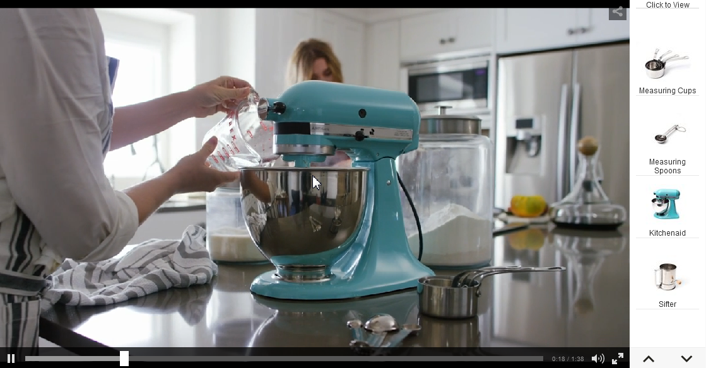
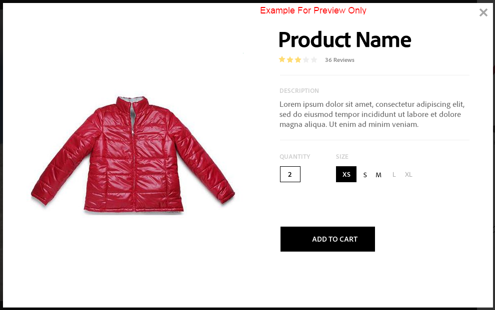
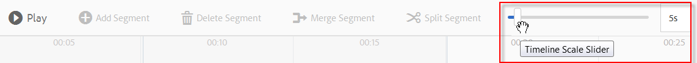
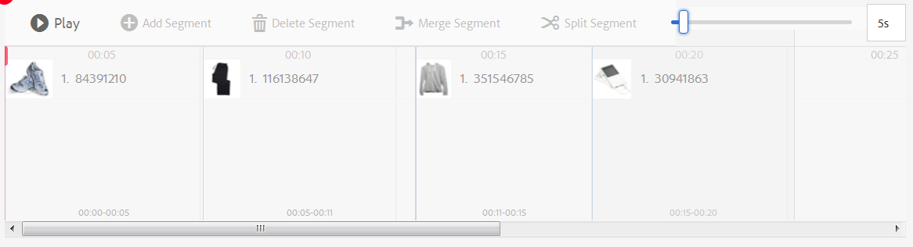
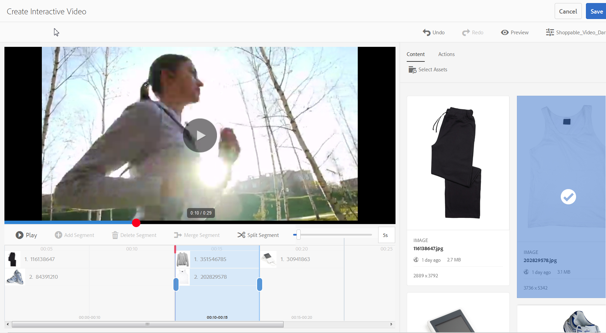

# Interactieve video&#39;s{#interactive-videos}

U kunt eenvoudig interactieve video&#39;s maken, ook wel shoppable video&#39;s genoemd, die de conversie rechtstreeks vanaf de video stimuleren. De betrokkenheid van de klant bij de video vindt plaats in een deelvenster naast de videospeler, waar gerelateerde service-, informatie- of productminiaturen worden weergegeven op basis van wat in de video wordt getoond. Klanten kunnen de miniatuur selecteren en rechtstreeks aan de service koppelen, of het item voor directe aankoop aan een winkelwagentje toevoegen of aan een webpagina koppelen voor meer informatie.

Wanneer de video eindigt, wordt een visueel overzicht van al dienstenaanbod getoond om een call to action te drijven. Klanten hebben nog een kans om het gewenste item te selecteren. Handelbare en specifieke ervaringen zoals deze verhogen de betrokkenheid van klanten en conversies.

Zie ook [&#x200B; Interactieve Beelden &#x200B;](/help/assets/interactive-images.md).

## Interactieve video in actie {#interactive-video-in-action}

Om een interactieve, shoppable video in actie te zien, uitgezochte [&#x200B; Levende Demo&#39;s &#x200B;](https://landing.adobe.com/en/na/dynamic-media/ctir-2755/live-demos.html), scrol aan de **[!UICONTROL Shoppable Media]** rubriek op de pagina, dan selecteren de shoppable video.

* Terwijl producten tijdens het afspelen in de video worden gebruikt, wordt het identieke product aan de rechterkant weergegeven als een miniatuurafbeelding.

* Selecteer de miniatuur als u de video wilt pauzeren en de Snelle weergave van het product wilt openen. Selecteer bijvoorbeeld de miniatuurafbeelding KitchenAid in de video om een centrifugeweergave van 360 graden van de mixer te ervaren of zoom in om details van de mixer te zien.

<!-- There was a link here that showed the video frame of an interactive video and when the reader selected the frame the video would play https://experienceleague.adobe.com/tools/dynamic-media-demo/shoppable-video/AXIS/index.html. This now needs to call a new interactive video-->

 *video vangen van een videoframe van een interactieve, shoppable video.*

>[!NOTE]
>
>Als u een interactieve video maakt om een webpagina te starten wanneer een gebruiker een miniatuurafbeelding selecteert, blokkeren sommige apparaten het openen van de pop-upwebpagina. In dergelijke gevallen moet u de instelling van de pop-upblokkering op het apparaat wijzigen. Bijvoorbeeld, op Apple iPhone 6, navigeer aan **[!UICONTROL Settings]** > **Safari** > **Pop-ups van het Blok**, dan dia de controle aan **[!UICONTROL Off]**. Wanneer u nu een interactieve video afspeelt en een miniatuur selecteert, wordt u gevraagd of u de pop-up wilt openen. Als u akkoord gaat, wordt de webpagina geopend.

### Controleren hoe interactieve video&#39;s worden gemaakt {#watch-how-interactive-videos-are-created}

Speel een analyse op [&#x200B; hoe de interactieve video&#39;s &#x200B;](https://s7d5.scene7.com/s7viewers/html5/VideoViewer.html?videoserverurl=https://s7d5.scene7.com/is/content/&emailurl=https://s7d5.scene7.com/s7/emailFriend&serverUrl=https://s7d5.scene7.com/is/image/&config=Scene7SharedAssets/Universal_HTML5_Video_social&contenturl=https://s7d5.scene7.com/skins/&asset=S7tutorials/InteractiveVideo) (7 minuten en 30 seconden) worden gecreeerd.
Hoewel de videoanalyse met Assets op bestelling wordt gemerkt, zijn de principes en de stappen nog van toepassing op Interactieve Video in Adobe Experience Manager Assets.

### Adobe Customer Solutions Webinar {#adobe-customer-success-webinar}

Met de webinar &#39;Interactive Video, Link Sharing en YouTube sharing gebruiken in Experience Manager Assets&#39; leert u hoe u interactieve video en andere functies kunt gebruiken om conversiegedreven gebeurtenissen aan uw video marketinginhoud te koppelen.

<!-- NOT FOUND; FIND REPLACEMENT
>[!NOTE]
>
>[Using Interactive Video, Link Sharing, and YouTube sharing in Experience Manager Assets](https://adobecustomersuccess.adobeconnect.com/p1yxzdo4aec/). 
-->

## Snel starten: Interactieve video&#39;s {#quick-start-interactive-videos}

De volgende stapsgewijze beschrijving van de workflow is ontworpen om u te helpen snel aan de slag te gaan met interactieve video&#39;s in Dynamic Media.

Zoek de **rubriek van het Voorbeeld** binnen sommige van de Snelle taken van het Begin. Het bevat een korte zelfstudie die op deze beginnende demoWeb-pagina gebaseerd is die *geen* interactiviteit heeft die aan het nog wordt toegevoegd:

[&#x200B; https://experienceleague.adobe.com/tools/dynamic-media-demo/shoppable-video/john-lewis/landing-0.html](https://experienceleague.adobe.com/tools/dynamic-media-demo/shoppable-video/john-lewis/landing-0.html)

Met behulp van de **voorbeelden** kunt u de stappen illustreren voor het integreren van interactieve video&#39;s op uw eigen website.

Wanneer u de zelfstudie voltooit in de laatste voorbeeldsectie, ziet de laatste demo-webpagina met de volledig geïntegreerde interactieve video er als volgt uit:

[&#x200B; https://experienceleague.adobe.com/tools/dynamic-media-demo/shoppable-video/john-lewis/landing-3.html](https://experienceleague.adobe.com/tools/dynamic-media-demo/shoppable-video/john-lewis/landing-3.html)

Interactieve videostappen:

1. **(Facultatief) identificeer variabelen van de Snelle mening** - begin door dynamische variabelen te identificeren die door uw bestaande implementatie van de Snelle weergave worden gebruikt. U gebruikt de variabelen om productminiaturen toe te wijzen aan hun overeenkomstige productQuickView wanneer u uw interactieve video creeert. Zie [&#x200B; (Facultatief) identificeer variabelen van de Snelle mening &#x200B;](#optional-identifying-quickview-variables).
   *Deze stap wordt slechts vereist als alle volgende waar* zijn:
   * U wilt interactiviteit aan uw video toevoegen door aan Snelle mening te teweegbrengen.
   * Uw implementatie van Experience Manager gebruikt *niet* een eCommerce integratiekader voor het trekken van productgegevens in Experience Manager van om het even welke eCommerce oplossing zoals IBM® WebSphere® Commerce, Elastic Path, Hybris, of Intershop. Zie [&#x200B; eCommerce concepten in Experience Manager Assets &#x200B;](/help/commerce/cif-classic/administering/concepts.md).

1. **(Optioneel) Maak een voorinstelling voor een interactieve videoviewer** - Pas de weergave en het gedrag aan van de verschillende componenten waaruit de speler bestaat, zoals de videoscrubber en de interactieve miniaturen.
Het is niet nodig een eigen voorinstelling voor een interactieve videoviewer te maken als u de voorinstellingen voor de uit-de-box Interactieve videoviewer wilt gebruiken `Shoppable_Video_Light` of `Shoppable_Video_Dark` .
Zie [&#x200B; een Kijker creëren vooraf ingesteld &#x200B;](/help/assets/managing-viewer-presets.md#creating-a-new-viewer-preset) (facultatief) en [&#x200B; Speciale overwegingen voor het creëren van een Interactieve Kijker vooraf ingesteld &#x200B;](/help/assets/managing-viewer-presets.md#special-considerations-for-creating-an-interactive-viewer-preset).

1. **upload een video en zijn bijbehorende beeldactiva** - upload een video en bijbehorende beelden die u interactief wilt maken.
Zie [&#x200B; een video en zijn bijbehorende duimnagelactiva &#x200B;](#uploading-a-video-and-its-associated-thumbnail-assets) uploaden.

   >[!NOTE]
   >
   >De MXF-video-indeling wordt nog niet ondersteund voor gebruik met interactieve video&#39;s in Dynamic Media.

1. **voegt interactiviteit aan uw video** toe - voeg één of meerdere tijdsegmenten aan de video toe. Koppel vervolgens afbeeldingsminiaturen aan die tijdsegmenten. Wijs elke afbeeldingsminiatuur toe aan een handeling zoals een hyperlink, een Snelle weergave of een Ervingspatroon.
(De op URL gebaseerde methode van het verbinden is niet mogelijk als uw interactieve inhoud verbindingen met relatieve URLs, in het bijzonder verbindingen met Experience Manager Sites pagina&#39;s heeft.)
Voltooi de bewerking door de interactieve video-elementen te publiceren. Bij het publiceren wordt de insluitcode of URL gemaakt die u uiteindelijk kopieert en toepast op de bestemmingspagina van uw website. Zie [&#x200B; interactiviteit aan uw video &#x200B;](#adding-interactivity-to-your-video) toevoegen.
Zie [&#x200B; publiceren Assets &#x200B;](/help/assets/publishing-dynamicmedia-assets.md).

1. **voeg een interactieve video aan uw website of aan uw website in Experience Manager** toe - als u Experience Manager Sites of eCommerce, of allebei gebruikt, kunt u de interactieve video aan een Web-pagina toevoegen. Sleep de component Interactieve media naar de pagina in Experience Manager. Zie [&#x200B; Dynamische Media Assets aan Pagina&#39;s &#x200B;](/help/assets/adding-dynamic-media-assets-to-pages.md) toevoegen.
Gebruik de insluitcode of URL om uw interactieve video te integreren met uw ervaringen op de website. Zie [&#x200B; een interactieve video met uw website &#x200B;](#integrating-an-interactive-video-with-your-website) integreren.
Als u een externe WCM (Web Content Manager) gebruikt, moet u de nieuwe interactieve video integreren met de bestaande implementatie van de Snelle weergave die op uw website wordt gebruikt. Zie [&#x200B; een interactieve video met een bestaande QuickView &#x200B;](#integrating-an-interactive-video-with-an-existing-quickview) integreren.
   [&#x200B; voeg Dynamische Media Assets aan Pagina&#39;s toe &#x200B;](/help/assets/adding-dynamic-media-assets-to-pages.md)

## (Optioneel) Quickview-variabelen identificeren {#optional-identifying-quickview-variables}

>[!NOTE]
>
>Deze taak is alleen vereist als aan de volgende voorwaarden wordt voldaan:
>
>* U wilt interactiviteit aan uw video toevoegen door aan Snelle mening te teweegbrengen.
>* Uw implementatie van Experience Manager gebruikt *niet* een eCommerce integratiekader voor het trekken van productgegevens in Experience Manager van om het even welke eCommerce oplossing zoals IBM® WebSphere® Commerce, Elastic Path, Hybris, of Intershop. Zie [&#x200B; eCommerce concepten in Experience Manager Assets &#x200B;](/help/commerce/cif-classic/administering/concepts.md).
>
>Als uw implementatie van Experience Manager gebruikmaakt van eCommerce, kunt u deze taak overslaan en doorgaan naar de volgende taak.

Begin door dynamische variabelen te identificeren die door uw bestaande implementatie van QuickView worden gebruikt zodat u productduimnagels aan hun overeenkomstige productSnelle mening tijdens het interactieve videoaanmaakproces kunt in kaart brengen.

Wanneer u tijdsegmenten aan een video toevoegt, wijst u SKU (Stock Keeping Unit) en om het even welke extra variabelen aan elke duimnagel toe u aan een segment toevoegt. Dergelijke variabelen worden later gebruikt om het juiste product van de QuickView te tonen.

Het is belangrijk om behoorlijk te identificeren welke variabelen worden vereist om een productQuickView uniek teweeg te brengen.

Soms is het voldoende om IT-specialisten te raadplegen die verantwoordelijk zijn voor uw bestaande Quickview-implementatie. Zij zullen waarschijnlijk de minimumreeks gegevens kennen om Snelle mening in het systeem te identificeren. Het is echter ook mogelijk om eenvoudig het bestaande gedrag van de front-end code te analyseren.

De meeste implementaties van de Snelle mening gebruiken het volgende paradigma:

* De gebruiker activeert een gebruikersinterface-element op de website. Selecteer bijvoorbeeld een knop Snelle weergave.
* De website verzendt een Ajax-aanvraag naar de achterkant om de Quickview-gegevens of -inhoud te laden, indien nodig.
* De Quickview-gegevens worden omgezet in de inhoud ter voorbereiding op de weergave op de webpagina.
* Tot slot geeft de front-end code dergelijke inhoud visueel op het scherm terug.

Daarom is het verstandig verschillende gebieden van uw bestaande website te bezoeken waar QuickView is geïmplementeerd, de QuickView te activeren en de Ajax-URL vast te leggen die door de webpagina is verzonden voor het laden van de gegevens of inhoud van de QuickView.

Normaal is er geen behoefte aan u om het even welke gespecialiseerde het zuiveren hulpmiddelen te gebruiken. Moderne webbrowsers beschikken over webinspecteurs die hun werk naar behoren doen. Hieronder volgen enkele voorbeelden van webbrowsers met webcontroles:

* Om alle uitgaande HTTP- verzoeken in Google Chrome te zien, druk **F12** (Vensters) of **Command+Options+I** (Mac) om het paneel van de Hulpmiddelen van de Ontwikkelaar te openen, en dan het **Netwerk** te selecteren tabel.

* In Firefox, kunt u of het Vuurwerk elektrisch toestel activeren door **F12** (Vensters) of **Command+Option+I** (Mac) te drukken en zijn **`[Net]`** lusje te gebruiken, of u kunt het ingebouwde hulpmiddel van de Inspecteur en zijn lusje van het Netwerk gebruiken.

* In Internet Explorer, activeer het debugger hulpmiddel door **F12** te drukken.

Wanneer netwerkcontrole in browser wordt aangezet, teweeg de Snelle mening op de pagina.

Zoek nu de URL van Quickview Ajax in het netwerklogboek en kopieer de geregistreerde URL voor toekomstige analyse. Gewoonlijk, wanneer u de Snelle mening teweegbrengt, zijn er talrijke verzoeken die naar de server worden verzonden. De URL van Quickview Ajax is doorgaans een van de eerste in de lijst. Het heeft een complex gedeelte of pad voor een querytekenreeks en het MIME-type voor reactie is `text/html` , `text/xml` of `text/javascript` .

Tijdens dit proces is het belangrijk om verschillende delen van uw website te bezoeken, met verschillende productcategorieën en typen. De reden hiervoor is dat URL&#39;s in de Snelle weergave onderdelen kunnen bevatten die algemeen gelden voor een bepaalde categorie websites, maar deze alleen kunnen wijzigen als u een ander gedeelte van de website bezoekt.

In het eenvoudigste geval, is het enige veranderlijke deel in Quickview URL productSKU. In dit geval is de product-SKU-waarde het enige gegevensstuk dat nodig is om miniaturen toe te voegen aan een tijdsegment in de interactieve video in Experience Manager.

In complexe gevallen heeft de URL van de Snelle weergave echter verschillende elementen die verschillen naast de SKU van het product, zoals categorie-id, kleurcode en code voor grootte. In dergelijke gevallen wordt elk dergelijk element een afzonderlijke variabele in de definitie van miniatuurgegevens in Experience Manager.

Bekijk de volgende voorbeelden van URL&#39;s van QuickView en de bijbehorende miniatuurvariabelen:

<table>
  <tbody>
  <tr>
    <td><p>Enige SKU, die in het vraagkoord wordt gevonden.</p> </td>
    <td><p>De opgenomen URL's van de Snelle weergave bevatten het volgende:</p>
    <ul>
      <li><p><code>https://server/json?productId=866558&source=100</code></p> </li>
      <li><p><code>https://server/json?productId=1196184&source=100</code></p> </li>
      <li><p><code>https://server/json?productId=1081492&source=100</code></p> </li>
      <li><p><code>https://server/json?productId=1898294&source=100</code></p> </li>
    </ul> <p>Het enige variabele deel in de URL is de waarde van de parameter van de <code>productId=</code> querytekenreeks en het is duidelijk een SKU-waarde. Daarom hebben uw miniaturen alleen SKU-velden nodig die zijn gevuld met waarden zoals <strong><code>866558</code></strong> , <strong><code>1196184</code></strong> , <strong><code>1081492</code></strong> en <strong><code>1898294</code></strong> .</p> </td>
  </tr>
  <tr>
    <td><p>Eén SKU, gevonden in het URL-pad.</p> </td>
    <td><p>De opgenomen URL's van de Snelle weergave bevatten het volgende:</p>
    <ul>
      <li><p><code>https://server/product/6422350843</code></p> </li>
      <li><p><code>https://server/product/1607745002</code></p> </li>
      <li><p><code>https://server/product/0086724882</code></p> </li>
    </ul> <p>Het variabele gedeelte bevindt zich in het laatste gedeelte van het pad en wordt de SKU-waarde van Experience Manager-miniaturen: <strong><code>6422350843</code></strong>, <strong><code>1607745002</code></strong>, <strong><code>0086724882</code></strong> .</p> </td>
  </tr>
  <tr>
    <td><p>SKU en categorie-id in de queryreeks.</p> </td>
    <td><p>De opgenomen URL's van de Snelle weergave bevatten het volgende:</p>
    <ul>
      <li><p><code>https://server/quickView/product/?category=1100004&prodId=305466</code></p> </li>
      <li><p><code>https://server/quickView/product/?category=1100004&prodId=310181</code></p> </li>
      <li><p><code>https://server/quickView/product/?category=1740148&prodId=308706</code></p> </li>
    </ul> <p>In dit geval bevat de URL twee verschillende onderdelen. De SKU wordt opgeslagen in de parameter <code>prodId</code> en de categorie-id wordt opgeslagen in de parameter <code>category=</code> .</p> <p>Daarom zijn de miniatuurdefinities paren. Dit is een SKU-waarde en een extra variabele met de naam <code>categoryId</code> . De resulterende paren zijn als volgt:</p>
    <ul>
      <li>SKU is <code>305466</code> en <code>categoryId</code> is <code>1100004</code></li>
      <li>SKU is <code>310181</code> en <code>categoryId</code> is <code>1100004</code></li>
      <li>SKU is <code>308706</code> en <code>categoryId</code> is <code>1740148</code></li>
    </ul> <p> </p> </td>
  </tr>
  </tbody>
</table>

**Voorbeeld**

Wanneer de bovenstaande benadering wordt toegepast op de website van het Voorbeeld, hebt u een Web-pagina met verscheidene productduimnagels, elk met een &quot;ZIE MEER&quot;knoop:

[&#x200B; https://experienceleague.adobe.com/tools/dynamic-media-demo/shoppable-video/john-lewis/landing-0.html](https://experienceleague.adobe.com/tools/dynamic-media-demo/shoppable-video/john-lewis/landing-0.html)

Nadat u alle productenQuickview activeert die op de pagina beschikbaar zijn, krijgt u de volgende lijst van verzoeken van de Snelle mening die aan het achterste eind worden gemaakt:

* datafeed/candles-233396346.json
* datafeed/candles-233978050.json
* datafeed/candles-234024346.json
* datafeed/candles-234024356.json
* datafeed/candles-234024359.json
* datafeed/cushions-233939848.json
* datafeed/cushions-234019477.json
* datafeed/cushions-234019483.json
* datafeed/furniture-231747479.json
* datafeed/furniture-232625621.json
* datafeed/furniture-232625626.json
* datafeed/furniture-233939810.json
* datafeed/furniture-233939825.json
* datafeed/furniture-233939828.json
* datafeed/furniture-233939853.json
* datafeed/furniture-233940334.json
* datafeed/glassware-000064007.json
* datafeed/glassware-230722193.json
* datafeed/glassware-233916550.json
* datafeed/glassware-233916597.json

Wanneer u de serveraanroepen bekijkt, ziet u dat productspecifieke informatie alleen aanwezig is in het aanvraagpad. U merkt ook dat het vraagkoord helemaal niet wordt gebruikt, en er zijn twee verschillende types van gegevensstukken in kwestie:

* Het eerste type is kaarsen, kussens, meubelen en glaswerk. Je kunt deze &#39;productcategorie&#39; noemen.
* Het tweede type is productcode, zoals 233916597. Je kan aannemen dat het &quot;product SKU&quot; is.

Op basis van deze informatie heeft de volledige URL van de Snelle weergave het volgende patroon:

`/datafeed/$categoryId$-$SKU$.json`

Op basis van deze analyse concludeert u dat u de volgende twee variabelen voor de miniaturen kunt gebruiken: `categoryId` en `SKU` .

U kunt nu een video en de bijbehorende miniatuurelementen uploaden.

## (Optioneel) Een voorinstelling voor een interactieve videoviewer maken {#optional-creating-an-interactive-video-viewer-preset}

U kunt deze taak overslaan en verdergaan naar de volgende taak als u een van de standaardtypen, de voorinstellingen voor interactieve videoviewers (out-of-the-box) `Shoppable_Video_dark` of `Shoppable_Video_light` wilt gebruiken.

Wanneer een miniatuur is geselecteerd in de ontwerpomgeving, wordt een voorvertoning van het dialoogvenster Snelle weergave weergegeven.



U kunt desgewenst uw eigen aangepaste voorinstelling voor een interactieve videoviewer maken. U kunt onder andere de opmaak bepalen van de videospeler, de interactieve miniaturen en de weergave van het miniatuurraster die aan het einde van de video wordt weergegeven.

Een voorinstelling voor een interactieve videoviewer geeft de video en alle tijdlijnsegmenten die u hebt toegevoegd correct weer. Er wordt ook een voorbeeld van standaard QuickView gebruikt wanneer u een productminiatuur selecteert in de modus Voorbeeld, zodat u de interactiviteit kunt testen voordat u publiceert.

Nadat u vooraf ingesteld kijker bewaart, wordt zijn staat automatisch geplaatst aan **op** in de Kijker vooraf instelt pagina. Deze status betekent dat deze zichtbaar is in de component Dynamische media en wanneer u een voorvertoning van een video weergeeft. Zorg ervoor dat u de nieuwe viewervoorinstelling ook handmatig publiceert.

Zie [&#x200B; een Nieuwe Vooraf ingestelde Kijker &#x200B;](/help/assets/managing-viewer-presets.md#creating-a-new-viewer-preset) creëren om uw eigen Interactieve Video vooraf ingestelde kijker tot stand te brengen.

## Een video en de bijbehorende miniatuurelementen uploaden {#uploading-a-video-and-its-associated-thumbnail-assets}

Als u reeds uw video en duimnagelactiva hebt geupload, ga aan [&#x200B; te werk voeg interactiviteit aan uw video &#x200B;](#adding-interactivity-to-your-video) toe.

>[!NOTE]
>
>De MXF-video-indeling wordt nog niet ondersteund voor gebruik met interactieve video&#39;s in dynamische media.

Als u de verkeerde video&#39;s of beelden uploadde, of u geuploade video&#39;s of beelden wilt schrappen die u niet meer nodig hebt, zie [&#x200B; activa van de Schrapping &#x200B;](/help/assets/manage-assets.md#deleting-assets).

Een video en de bijbehorende miniatuurelementen uploaden:

1. Upload de video en de bijbehorende miniatuurbestanden naar de gewenste map of mappen.

   Zie [&#x200B; activa &#x200B;](/help/assets/manage-assets.md) uploaden.
Zie [&#x200B; activa uploaden gebruikend de baan die van FTP &#x200B;](/help/assets/manage-assets.md) plannen.

   Voeg nu interactiviteit toe aan uw video.

## Interactiviteit toevoegen aan uw video {#adding-interactivity-to-your-video}

U voegt tijdlijnsegmenten aan een video toe met de lokale visuele editor op de pagina Interactieve video maken.

Nadat u tijdlijnsegmenten hebt toegevoegd, voegt u miniatuurafbeeldingen toe binnen elk segment. Voor elke miniatuur die u toevoegt, past u er een actie op toe. U kunt bijvoorbeeld een Snelle weergave toepassen op de miniatuur, u kunt er een hyperlink aan toewijzen of u kunt een Experience-fragment toevoegen.

Zie [&#x200B; Fragmenten van de Ervaring &#x200B;](/help/sites-authoring/experience-fragments.md).

>[!NOTE]
>
>De gereedschappen voor het delen van sociale media in interactieve video worden niet ondersteund wanneer u de viewer insluit in een ervaringsfragment. Om dit probleem te verhelpen, kunt u voorinstellingen voor viewers gebruiken of maken die geen gereedschappen voor het delen van sociale media hebben. Met dergelijke voorinstellingen voor viewers kunt u de voorinstelling met succes insluiten in Experience Fragments.

>[!NOTE]
>
>De op URL gebaseerde methode van het verbinden is niet mogelijk als uw interactieve inhoud verbindingen met relatieve URLs, in het bijzonder verbindingen met Experience Manager Sites pagina&#39;s heeft.

Opties voor Ongedaan maken en Opnieuw worden in de rechterbovenhoek van de pagina ondersteund tijdens de huidige sessie voor maken en bewerken.

Nadat u de interactieve video hebt opgeslagen, wordt de video direct geopend in Voorvertoning. Van daaruit kunt u een voorinstelling voor een interactieve videoviewer selecteren en de video afspelen om bij benadering te zien hoe deze er voor klanten uitziet.

**om interactiviteit aan uw video toe te voegen:**

1. Navigeer in de Assets-weergave naar de video die u hebt geüpload en maak een interactieve video.
1. Voer een van de volgende handelingen uit:

   * Houd de muisaanwijzer boven de afbeelding en selecteer vervolgens **[!UICONTROL Select]** (vinkje). Selecteer **[!UICONTROL Edit]** op de werkbalk.

   * Houd de muisaanwijzer boven de afbeelding en selecteer vervolgens **[!UICONTROL More actions]** (pictogram met drie punten) **[!UICONTROL > Edit]** .

   * Selecteer de afbeelding zodat u deze kunt openen op de pagina Gedetailleerde weergave. Selecteer **[!UICONTROL Edit]** op de werkbalk.

1. Voer op de pagina Interactieve video maken een van de volgende handelingen uit:

   * Selecteer de knop **[!UICONTROL Play]** om de video af te spelen. Wanneer een bepaald product, de dienst, of het detail dat u wilt benadrukken in mening komt, uitgezocht **[!UICONTROL Add Segment]** op de toolbar. Herhaal deze bewerking totdat u het einde van de video hebt bereikt.

     Voor elk tijdsegment dat u toevoegt, wijst u een of meer miniatuurafbeeldingen toe en koppelt u deze miniaturen aan de productpagina&#39;s van de Snelle weergave die klanten kunnen aanschaffen of aan webpagina&#39;s voor meer informatie.

   * Selecteer de knop **[!UICONTROL Play]** om de video af te spelen. Wanneer een bepaald product, de dienst, of het detail dat u wilt benadrukken in mening komt, uitgezocht **[!UICONTROL Pause]**. Selecteer **[!UICONTROL Add Segment]** .

     Ga door met het afspelen en pauzeren van de video op punten langs de tijdlijn waar u een segment wilt toevoegen totdat u het einde van de video hebt bereikt.

1. (Optioneel) Sleep de balk aan de linkerkant van de **[!UICONTROL Timeline Scale Slider]** om in of naar rechts in te zoomen om uit te zoomen, zodat u kunt bepalen hoeveel detail wordt weergegeven van de segmenten die u hebt toegevoegd.

   

   Afhankelijk van de lengte van uw video, blijft de Duur van het Segment aan de volgende waarden in gebreke:

   <table>
      <tbody>
        <tr>
        <td><strong>Als de videolengte...</strong></td>
        <td><strong>De instelling Duur segment is standaard ingesteld op..</strong></td>
        </tr>
        <tr>
        <td>3 minuten of meer</td>
        <td>60 seconden</td>
        </tr>
        <tr>
        <td>2-3 minuten</td>
        <td>30 seconden</td>
        </tr>
        <tr>
        <td>1-2 minuten</td>
        <td>20 seconden <br /> </td>
        </tr>
        <tr>
        <td>30-60 seconden</td>
        <td>10 seconden</td>
        </tr>
        <tr>
        <td>30 seconden of minder</td>
        <td>5 seconden</td>
        </tr>
      </tbody>
    </table>

   De videotijdlijn gebruikt evenveel schermruimte als de ruimte die er beschikbaar voor is. De segmenten die u hebt toegevoegd, behouden dus hun juiste breedte wanneer de grootte van de browser wordt gewijzigd.

   Ter illustratie gebruiken de volgende drie schermafbeeldingen dezelfde video. U ziet dat de breedte van elk segment afhankelijk is van de instelling voor de tijdlijnschaal.

   

   Schermafbeelding A

   Screenshot A hierboven toont u de standaardweergave van een 29-secondenproductvideo. De tijdlijnschaal wordt standaard ingesteld op 5 seconden.

   

   Schermafbeelding B

   In bovenstaande afbeelding B werd de schuifregelaar Tijdlijnschaal van de standaardduur van 5 seconden naar 3 seconden gesleept. De afzonderlijke tijdstempels voor de schaal van de tijdlijn zijn nu allemaal ingesteld op intervallen van 3 seconden.

   

   Screenshot C

   In bovenstaande screenshot C is de instelling voor Tijdlijnschaal verplaatst naar 8 seconden. U ziet hoe de segmenten met productminiaturen zijn verkleind. Op deze manier uitzoomen is handig als u een lange video hebt en u een overzicht wilt kunnen zien van meer segmenten die normaal gesproken in de breedte van de pagina passen.

1. (Optioneel) Voer een van de volgende handelingen uit:

   * De begintijd en eindtijd van een segment aanpassen.

     Selecteer een segment en sleep vervolgens de voorloopblauwe of navolgende blauwe ovaal om respectievelijk de begin- of eindtijd aan te passen. Het weergegeven videoframe wordt op basis van uw aanpassingen naar de juiste tijd in de video verplaatst. De verplaatsing van het tijdlijnsegment wordt beperkt op basis van eventuele aangrenzende segmenten in de tijdlijn. De minimaal toegestane segmenttijd is één seconde.

     Gebruik de volgende sneltoetsen voor navigatie om uw videosegmenten snel te controleren en af te stemmen:

      * Als u de video direct naar het begin van dat segment wilt zoeken, selecteert u het voorafgaande blauwe ovaal.
      * Als u de video direct naar het einde van dat segment wilt zoeken, selecteert u het navolgende blauwe ovaal.
      * Selecteer het gehele segment om het afspelen van video terug te zetten naar het begin van dat segment.

   

   Het einde van een tijdlijnsegment verplaatsen

   * Een segment verwijderen

     Selecteer het laatste segment op de tijdlijn en selecteer vervolgens op de werkbalk **[!UICONTROL Delete Segment]** . Als twee of meer segmenten zijn geselecteerd, wordt **[!UICONTROL Delete Segment]** uitgeschakeld.

     U kunt alleen het laatste segment verwijderen. Als u bijvoorbeeld alle segmenten op de tijdlijn wilt verwijderen, moet u altijd de laatste selecteren en vervolgens **[!UICONTROL Delete Segment]** selecteren.

1. Selecteer een tijdsegment waaraan u een of meer miniatuurafbeeldingen wilt koppelen.
1. Selecteer rechts van de video de tab **[!UICONTROL Content]** .
1. Selecteer op het tabblad Inhoud de optie **[!UICONTROL Select Assets]** en blader door alle afbeeldingselementen die u voor de video wilt gebruiken en selecteer deze. De geselecteerde elementen worden toegevoegd aan het deelvenster Elementkiezer op het tabblad Inhoud.

1. Voer een van de volgende handelingen uit in de elementkiezer onder het tabblad Inhoud:

   <table>
      <tbody>
        <tr>
        <td>Een miniatuur koppelen aan het geselecteerde tijdlijnsegment</td>
        <td><p>Selecteer de afbeelding in het deelvenster met middelenkiezers aan de rechterkant.</p> <p>U kunt zoveel miniaturen toevoegen als u wilt aan een tijdlijnsegment. Voor elke afbeelding die u selecteert, verschijnt een vinkje boven de afbeelding in de elementenkiezer.</p> </td>
        </tr>
        <tr>
        <td>Een miniatuur verwijderen uit het geselecteerde tijdlijnsegment</td>
        <td><p>Voer een van de volgende handelingen uit:</p>
          <ul>
          <li>Selecteer in het deelvenster Elementen selecteren een afbeelding met een vinkje om de selectie ervan op te heffen. Het afbeeldingselement wordt verwijderd uit het tijdlijnsegment.<br /> </li>
          <li>In het geselecteerde tijdlijnsegment, selecteer een beeld, dan op de toolbar, selecteer <strong> Product van de Schrapping </strong>.</li>
          </ul> </td>
        </tr>
      </tbody>
    </table>

   

   Als u een afbeelding selecteert in het deelvenster met middelenkiezers, wordt deze aan het geselecteerde tijdlijnsegment toegevoegd.

1. Selecteer één miniatuurafbeelding binnen een van de tijdlijnsegmenten en selecteer vervolgens de tab **[!UICONTROL Actions]** .
1. Voer een van de volgende handelingen uit:
   <table> 
    <tbody> 
      <tr> 
      <td>De geselecteerde miniatuurafbeelding aan een Snelle weergave koppelen</td> 
      <td><p>Onder Type van Actie, uitgezochte <strong> QuickView </strong>.</p> <p>Als u een klant van Experience Manager Sites en van de Handel bent:</p> 
       <ul> 
       <li>U ziet dat het tekstveld SKU-waarde vooraf is ingevuld met de SKU (Stock Keeping Unit) van het geselecteerde product. Dit is een unieke id voor elk afzonderlijk product of elke service die u aanbiedt. Deze waarde wordt automatisch ingevuld wanneer de afbeelding is gekoppeld aan een product in Experience Manager Commerce.</li> 
       <li>Als de vooraf ingevulde SKU onjuist is, selecteert u het pictogram Productkiezer (vergrootglas) om de pagina Selecteer product te openen. Selecteer het product dat u wilt gebruiken en selecteer vervolgens het vinkje in de rechterbovenhoek van de pagina zodat u terug kunt keren naar de Interactieve Video-editor.</li> 
       </ul> <p> Als u <em> niet </em> een klant van Experience Manager Sites of van de Handel bent</p> 
       <ul> 
       <li>Zie <a href="/help/assets/carousel-banners.md#identifying-hotspot-and-image-map-variables"> Identificerend hotspot variabelen </a>. De variabelen moeten worden gedefinieerd.  </li> 
       <li>Standaard gebruikt dit SKU-veld de bestandsnaam van het afbeeldingselement zonder de extensie. Als u een standaardnaamgevingsconventie volgt voor uw bestanden die op SKU zijn gebaseerd, hoeft u voor deze bestandsnaam gewoonlijk geen aanvullende bewerkingen uit te voeren. </li> 
       <li>Anders, geef de standaardwaarde uit en ga de correcte waarde SKU in. Typ in het tekstveld SKU-waarde de SKU (Stock Keeping Unit) van het product. Dit is een unieke id voor elk afzonderlijk product of elke service die u aanbiedt. De ingegaan waarde van SKU bevolkt automatisch het veranderlijke gedeelte van het malplaatje van de Snelle mening zodat het systeem weet om het geselecteerde beeld met de Snelle mening van SKU te associëren.</li> 
       </ul> <p>(Facultatief) als er andere variabelen binnen de Snelle mening zijn die u moet gebruiken om een product verder te identificeren, <strong> uitgezocht voeg Algemene Variabele </strong> toe. Geef in het tekstveld een extra variabele op. <code>category=Womens</code> is bijvoorbeeld een toegevoegde variabele.</p> <p> </p> </td> 
      </tr> 
      <tr> 
      <td>De geselecteerde miniatuurafbeelding aan een hyperlink koppelen</td> 
      <td><p>Onder Type van Actie, uitgezochte <strong> Hyperlink </strong>, dan doe één van het volgende:</p> 
       <ul> 
       <li>Als u een Experience Manager Sites-klant bent, selecteert u het pictogram Sitekiezer (map) om naar een webpagina te navigeren. De op URL gebaseerde methode van het verbinden is niet mogelijk als uw interactieve inhoud verbindingen met relatieve URLs, in het bijzonder verbindingen met Experience Manager Sites pagina's heeft.</li> 
       <li>Als u een zelfstandige Dynamic Media-klant bent, geeft u in het tekstveld HREF het volledige URL-pad naar een gekoppelde webpagina op.</li> 
       </ul> <p>Zorg ervoor dat u opgeeft of u de koppeling wilt openen op een nieuw browsertabblad of op het huidige tabblad.</p> </td> 
      </tr> 
      <tr> 
      <td>De geselecteerde miniatuurafbeelding aan een ervaringsfragment koppelen</td> 
      <td><p>Onder Type van Actie, uitgezochte <strong> Fragment van de Ervaring </strong>, dan doe het volgende:<p> 
       <ul> 
       <li>Als u een Experience Manager Sites-klant bent, selecteert u het zoekpictogram (vergrootglas) om de pagina Experience Fragment te openen. Selecteer het Fragment van de Ervaring u wilt gebruiken, dan selecteren <strong> Uitgezocht </strong> in de hoger-juiste hoek van de pagina zodat kunt u aan het paneel van Acties op de vorige pagina terugkeren.<br /> zie <a href="/help/sites-authoring/experience-fragments.md"> Fragmenten van de Ervaring </a>.</li> 
      </ul> 
       <ul> 
       <li>Geef de breedte en hoogte van het ervaringsfragment op zoals u het wilt weergeven op de video.</li>
       </ul><strong> Nota </strong>: De sociale media die hulpmiddelen in Interactieve Video delen worden niet gesteund wanneer u de kijker in een Fragment van de Ervaring inbedt. Om dit probleem te verhelpen, kunt u voorinstellingen voor viewers gebruiken of maken die geen gereedschappen voor het delen van sociale media hebben. Met dergelijke voorinstellingen voor viewers kunt u de voorinstelling met succes insluiten in Experience Fragments.</p></tr>&lt; 
      <tr> 
      <td>Een handeling bewerken die al is toegewezen aan een miniatuurafbeelding</td> 
      <td>Selecteer binnen een tijdlijnsegment een miniatuurafbeelding met een kettingkoppeling rechts van het tekstlabel. De kettingkoppeling geeft aan dat er een handeling aan is toegewezen. Selecteer het <strong> lusje van Acties </strong> zodat kunt u uw veranderingen aanbrengen.</td> 
      </tr> 
      <tr> 
      <td>Het tekstlabel van een miniatuurafbeelding wijzigen</td> 
      <td><p>Standaard gebruikt het tekstlabel het metagegevensveld <code>Title</code> van de miniatuurafbeelding. Als <code>Title</code> niet aanwezig is, wordt in plaats daarvan de bestandsnaam van de miniatuurafbeelding gebruikt, maar zonder de extensie.</p> <p>Om het tekstetiket van een duimnagelbeeld, onder het <strong> lusje van Acties </strong>, direct onder de beeldactiva te veranderen die wordt getoond, ga de gewenste tekst in. Zie de onderstaande schermafbeelding.</p> <p>Het nieuwe tekstlabel wordt alleen gebruikt door de videospeler zelf en de miniatuurtekst die in het tijdlijnsegment wordt weergegeven. De labelwijziging heeft geen invloed op het metagegevensveld Titel van de miniatuurafbeelding en de bestandsnaam van de miniatuurafbeelding.</p> </td> 
      </tr> 
      <tr> 
      <td>Een wijziging herstellen:</td> 
      <td>Vlak de hoger-juiste hoek van de pagina, uitgezocht <strong> ongedaan maken </strong> of <strong> opnieuw </strong>.</td> 
      </tr> 
    </tbody> 
   </table>

   

   Er wordt een nieuw tekstlabel toegevoegd aan de miniatuurafbeelding.

1. Voer een van de volgende handelingen uit:

   * Herhaal stap 6-11 om meer miniatuurafbeeldingen toe te voegen aan tijdlijnsegmenten in uw video.
   * Ga verder met de optionele stap 13.

1. (Optioneel) Voer een van de volgende handelingen uit:

   * **[!UICONTROL Merge Segment]** - U kunt twee aangrenzende segmenten (met of zonder productminiaturen aan hen toegewezen) in één segment combineren.

     Selecteer in de tijdlijn twee of meer aangrenzende segmenten die u wilt samenvoegen. Er zijn geen blauwe, ovale sleepgrepen op de twee geselecteerde segmenten in de onderstaande schermafbeelding.

     Selecteer **[!UICONTROL Merge Segment]** op de werkbalk.

   

   Twee geselecteerde segmenten van vijf seconden samenvoegen tot één segment van tien seconden.

   * **[!UICONTROL Split Segment]** - U kunt één segment opsplitsen in twee gelijke tijdsegmenten. Als er al productminiaturen aan het segment zijn toegewezen, worden de miniaturen gecombineerd in het linkersegment.

     Selecteer in de tijdlijn een segment dat u in tweeën wilt delen en selecteer vervolgens **[!UICONTROL Split Segment]** op de werkbalk.

     Als u twee of meer segmenten selecteert, wordt de functie **[!UICONTROL Split Segment]** uitgeschakeld.

   

   Een geselecteerd segment van tien seconden opsplitsen in twee segmenten van vijf seconden elk.

1. In de rechterbovenhoek van de pagina **[!UICONTROL Create Interactive Video]** wordt de naam weergegeven van de momenteel geselecteerde viewer-voorinstelling die bij de video wordt gebruikt. Selecteer de naam als u een andere viewervoorinstelling wilt selecteren.

   Met de voorinstelling van de viewer `Shoppable_Video_light` kunt u bijvoorbeeld de video afspelen met een wit weergavegebied naast de video. In het weergavegebied worden de selecteerbare miniatuurafbeeldingen tijdens het afspelen weergegeven. Met de voorinstelling van de viewer `Shoppable_Video_dark` kunt u de video afspelen met een zwart weergavegebied naast de video.

   Als u uw eigen voorinstelling voor de interactieve videoviewer hebt gemaakt, wordt deze weergegeven in de lijst met voorinstellingen waaruit u kunt kiezen.

   Selecteer **[!UICONTROL Save]** wanneer u klaar bent.

   >[!NOTE]
   >
   >Wanneer u uw interactieve video opslaat, wordt er automatisch een gekoppeld `.vtt`-bestand bij opgeslagen. Het `.vtt` -bestand wordt opgeslagen in de `_VTT` -map in de hoofdmap van **[!UICONTROL Assets]** . Uw interactieve video kan alleen correct worden afgespeeld op uw website als het bestand en de map aanwezig zijn. Verplaats, bewerk of verwijder daarom de map `_VTT` of de content ervan niet.

1. Publiceer de interactieve video. Met Publiceren maakt u de insluitcode of URL die u uiteindelijk kopieert en plakt naar uw website.

   Als u interactiviteit hebt toegevoegd met de Snelle weergave, gebruikt u alleen de insluitcode. Als u interactiviteit hebt toegevoegd met hypergekoppelde webpagina&#39;s, kunt u ook de gepubliceerde URL gebruiken. De op URL gebaseerde methode voor koppelen is echter niet mogelijk als uw interactieve inhoud koppelingen naar relatieve URL&#39;s bevat, met name koppelingen naar Experience Manager Sites-pagina&#39;s.

   Zie [&#x200B; activa &#x200B;](publishing-dynamicmedia-assets.md) publiceren.

   >[!NOTE]
   >
   >Als u een schokkbare video wilt publiceren met QuickView, moet u ook elk van de verwante afbeeldingselementen van de video afzonderlijk publiceren vanuit uw handelsgebied.

   Nadat u tijdlijnsegmenten hebt toegevoegd en de interactieve video hebt gepubliceerd, kunt u deze toevoegen aan de openingspagina van uw bestaande website. Zie [&#x200B; een interactieve video met uw website &#x200B;](#integrating-an-interactive-video-with-your-website) integreren.

## Interactieve video-elementen publiceren {#publishing-interactive-video-assets}

Zie [&#x200B; activa &#x200B;](/help/assets/publishing-dynamicmedia-assets.md) voor details op publiceren interactieve videoactiva publiceren.

## Een interactieve video integreren met uw website {#integrating-an-interactive-video-with-your-website}

Nadat u een video hebt geüpload, tijdlijnsegmenten hebt toegevoegd en de interactieve video hebt gepubliceerd, kunt u deze nu toevoegen aan uw bestaande website.

Als u een Experience Manager Sites-klant bent, kunt u de interactieve video toevoegen door de component Interactieve media naar de pagina te slepen. Zie [&#x200B; Dynamische activa van Media aan pagina&#39;s &#x200B;](/help/assets/adding-dynamic-media-assets-to-pages.md) toevoegen.

Als u een zelfstandige Experience Manager Assets-klant bent, kunt u de interactieve video handmatig aan uw website toevoegen, zoals in deze sectie wordt beschreven.

1. Kopieer de insluitcode of URL van de gepubliceerde interactieve video.
Zie [&#x200B; de Video of Kijker van het Beeld op een Web-pagina &#x200B;](/help/assets/embed-code.md) inbedden.
Als u interactiviteit hebt toegevoegd met de Snelle weergave, gebruikt u alleen de insluitcode. Als u interactiviteit hebt toegevoegd met hypergekoppelde webpagina&#39;s, kunt u ook de gepubliceerde URL gebruiken. De op URL gebaseerde methode voor koppelen is echter niet mogelijk als uw interactieve inhoud koppelingen naar relatieve URL&#39;s bevat, met name koppelingen naar Experience Manager Sites-pagina&#39;s.

1. Geef in de webpaginacode van het doel aan waar de statische video zich bevindt.
1. Verwijder de statische video en vervang de code door de insluitcode of URL die u net als Experience Manager Assets hebt gekopieerd.
De gekopieerde insluitcode wordt ingesteld voor een responsieve omgeving, zodat deze automatisch past in het gebied dat eerder werd ingenomen door de statische video.

>[!NOTE]
>
>Als u nu alleen interactiviteit met hypergekoppelde webpagina&#39;s hebt toegevoegd, bent u klaar.
>
>Als u echter interactiviteit hebt toegevoegd om een Snelle weergave te activeren, worden de miniaturen naast de interactieve video alleen weergegeven. Ze zijn nog niet geïntegreerd met de bestaande Snelle weergave. In dergelijke gevallen moet u de interactieve video integreren met de bestaande QuickView op uw website.

**Voorbeeld**

De demo-website als voorbeeld gebruiken:

[&#x200B; https://experienceleague.adobe.com/tools/dynamic-media-demo/shoppable-video/john-lewis/landing-0.html](https://experienceleague.adobe.com/tools/dynamic-media-demo/shoppable-video/john-lewis/landing-0.html)

De insluitcode is standaard:

```xml
<style type="text/css">
 #s7video_div.s7videoviewer{
   width:100%;
   height:auto;
 }
</style>

<script type="text/javascript" src="https://demos-pub.assetsadobe.com/etc/dam/viewers/s7viewers/html5/js/VideoViewer.js"></script>
<div id="s7video_div"></div>
<script type="text/javascript">
 var s7videoviewer = new s7viewers.VideoViewer({
  "containerId" : "s7video_div",
  "params" : {
   "serverurl" : "https://adobedemo62-h.assetsadobe.com/is/image",
   "contenturl" : "https://demos-pub.assetsadobe.com/",
   "config" : "/etc/dam/presets/viewer/Video",
   "config2": "/etc/dam/presets/analytics",
   "videoserverurl": "https://gateway-na.assetsadobe.com/DMGateway/public/demoCo",
   "posterimage": "/content/dam/marketing/shoppable-video/john-lewis/shoppable-video-john-lewis-2014.mp4",
   "asset" : "/content/dam/marketing/shoppable-video/john-lewis/shoppable-video-john-lewis-2014.mp4" }
 }).init();
</script>
```

Integratie is zo eenvoudig als het verwijderen van de video-insluitcode en het vervangen van deze code door de interactieve video-insluitcode uit Experience Manager. U kunt de resultaten op de volgende URL zien. Hoewel er een interactieve video op de pagina wordt weergegeven, is deze nog niet geïntegreerd met de bestaande Snelle weergave:

[&#x200B; https://experienceleague.adobe.com/tools/dynamic-media-demo/shoppable-video/john-lewis/landing-1.html](https://experienceleague.adobe.com/tools/dynamic-media-demo/shoppable-video/john-lewis/landing-1.html)

## Een interactieve video integreren met een bestaande QuickView {#integrating-an-interactive-video-with-an-existing-quickview}

>[!NOTE]
>
>Deze taak is alleen van toepassing als u een zelfstandige Experience Manager Assets-klant bent.

De laatste stap in dit proces is uw interactieve video te integreren met een bestaande implementatie van de Snelle mening die op uw website wordt gebruikt. Er is geen oplossing voor de integratie die in alle gevallen werkt. Elke Quickview-implementatie is uniek. Daarom is een specifieke aanpak nodig die de hulp van een front-end IT-persoon omvat.

De bestaande implementatie van QuickView vertegenwoordigt normaal gesproken een reeks onderling samenhangende acties die op de webpagina in de volgende volgorde plaatsvinden:

1. Een gebruiker activeert een element in de gebruikersinterface van uw website.
1. De front-end code verkrijgt een Quickview URL die op het gebruikersinterface element wordt gebaseerd dat in stap 1 werd teweeggebracht.
1. De front-end code verzendt een AJAX verzoek gebruikend URL die in stap 2 wordt verkregen.
1. De achterste logica keert de overeenkomstige gegevens of inhoud van de Snelle mening terug naar de front-end code.
1. De front-end code laadt de gegevens of de inhoud van de Snelle mening.
1. Naar keuze, zet de front-end code de geladen gegevens van de Snelle mening in een vertegenwoordiging van HTML om.
1. De front-end code geeft een modaal dialoogvenster of deelvenster weer en geeft de HTML-inhoud op het scherm weer voor de eindgebruiker.

Deze aanroepen vertegenwoordigen geen onafhankelijke openbare API-aanroepen die door de webpaginalogica kunnen worden aangeroepen vanuit een willekeurige stap. In plaats daarvan, is het een geketende vraag waar elke volgende stap in de laatste fase (callback) van de vorige stap verborgen is.

Wanneer een gebruiker op een miniatuur in de interactieve video een miniatuur selecteert, wordt deze gebruikersinteractie door de viewer afgehandeld terwijl de interactieve video stap 1 en gedeeltelijk stap 2 vervangt. De viewer retourneert een gebeurtenis naar de webpagina die alle miniatuurgegevens bevat die eerder aan Experience Manager zijn toegevoegd.

In een dergelijke gebeurtenishandler doet de front-end code het volgende:

* Luistert naar een gebeurtenis die wordt uitgezonden door de interactieve video.
* Hiermee maakt u een URL van de Snelle weergave op basis van de miniatuurgegevens.
* Triggert het proces om de Snelle mening van het achtereind te laden en het terug te geven op het scherm voor vertoning.

Bovendien ondersteunt de Interactieve Video-viewer de modus Volledig scherm. De eindgebruiker activeert QuickView door een duimnagel te selecteren zonder het volledige scherm te verlaten. Om deze functionaliteit te bereiken, wijzigt u de front-end code zodat het modale dialoogvenster van de Snelle weergave aan de container van de kijker wordt vastgemaakt. Voeg geen BODY van het document of een ander Webpagina-element toe dat niet beschikbaar is wanneer de kijker op volledig-schermwijze is. De code die deze taak uitvoert, moet luisteren naar een of meer callbacks van de viewer die worden verzonden nadat de viewer die op de pagina laadt.

De insluitcode die door Experience Manager wordt geretourneerd, heeft al een gebruiksklare gebeurtenishandler. Er wordt opmerkingen toegevoegd zoals in het volgende gemarkeerde codefragment wordt getoond:

```xml
<style type="text/css">
 #s7interactivevideo_div.s7interactivevideoviewer{
   width:100%;
   height:auto;
 }
</style>
<script type="text/javascript" src="https://demos-pub.assetsadobe.com/etc/dam/viewers/s7viewers/html5/js/InteractiveVideoViewer.js"></script>

<div id="s7interactivevideo_div"></div>
<script type="text/javascript">
 var s7interactivevideoviewer = new s7viewers.InteractiveVideoViewer({
  "containerId" : "s7interactivevideo_div",
  "params" : {
   "serverurl" : "https://adobedemo62-h.assetsadobe.com/is/image",
   "contenturl" : "https://demos-pub.assetsadobe.com/",
   "config" : "/etc/dam/presets/viewer/Shoppable_Video_light",
   "config2": "/etc/dam/presets/analytics",
   "videoserverurl": "https://gateway-na.assetsadobe.com/DMGateway/public/demoCo",
   "interactivedata": "content/dam/_VTT/marketing/shoppable-video/john-lewis/shoppable-video-john-lewis-2014.mp4.svideo.vtt",
   "VideoPlayer.contenturl": "https://adobedemo62-h.assetsadobe.com/is/content",
   "asset" : "/content/dam/marketing/shoppable-video/john-lewis/shoppable-video-john-lewis-2014.mp4" }
 })
 /* // Example of interactive video event for quickview.
   s7interactivevideoviewer.setHandlers({
   "quickViewActivate": function(inData) {
     var sku=inData.sku; //SKU for product ID
    //To pass other parameter from the hotspot, you need to add custom parameter during the hotspot setup as parameterName=value
    loadQuickView(sku); //Replace this call with your quickview plugin
    //See your quickviewer plugin for the quickview call
    },
"initComplete":function() {
    //--- Attach quickview popup to viewer container so popup will work in fullscreen mode ---
    var popup = document.getElementById('quickview_div'); // get custom quickview container
    popup.parentNode.removeChild(popup); // remove it from current DOM
    var sdkContainerId = s7interactivevideoviewer.getComponent("container").getInnerContainerId(); // get viewer container component
    var inner_container = document.getElementById(sdkContainerId);
    inner_container.appendChild(popup); //Attach custom quickview container to viewer
    }
   });
 */
 s7interactivevideoviewer.init();
</script>
```

Het is dus alleen nodig de commentaarmarkering van het gemarkeerde codefragment hierboven ongedaan te maken en de dummy-handlers te vervangen door code die specifiek is voor de specifieke webpagina.

De standaard insluitcode bevat twee standaardcallbackhandlers: `quickViewActivate` en `initComplete` . De `quickViewActivate` -handler wordt geactiveerd wanneer een miniatuur wordt geselecteerd in de viewer. Gebruik deze optie om de viewer te integreren met de activeringslogica van de Snelle weergave. De `initComplete` -handler wordt slechts één keer geactiveerd wanneer de viewer op de pagina wordt geladen. Deze handler wordt gebruikt om de locatie van het dialoogvenster QuickView in het DOM van de webpagina aan te passen.

Het proces om QuickView URL te construeren is tegengesteld aan het proces om duimnagelvariabelen te identificeren die vroeger in dit onderwerp worden behandeld. Met behulp van de eerder geïdentificeerde URL-voorbeelden van QuickView kunt u zien hoe de URL van de Snelle weergave in elk geval wordt samengesteld:

<table>
  <tbody>
  <tr>
    <td><p>Enige SKU, die in het vraagkoord wordt gevonden</p> </td>
    <td><code class="code">s7interactivevideoviewer.setHandlers(&lbrace;
      "quickViewActivate": function(inData) &lbrace;
      var quickViewUrl = "https://server/json?productId=" + inData.sku + "&amp;source=100";
      &rbrace;,
      &rbrace;);</code></td>
  </tr>
  <tr>
    <td>Enkele SKU, gevonden in het pad URL</td>
    <td><code class="code">s7interactivevideoviewer.setHandlers(&lbrace;
      "quickViewActivate": function(inData) &lbrace;
      var quickViewUrl = "https://server/product/" + inData.sku;
      &rbrace;,
      &rbrace;);</code></td>
  </tr>
  <tr>
    <td><p>SKU en categorie-id in de queryreeks</p> </td>
    <td><code class="code">s7interactivevideoviewer.setHandlers(&lbrace;
      "quickViewActivate": function(inData) &lbrace;
      var quickViewUrl = "https://server/quickView/product/?category=" + inData.categoryId + "&amp;prodId=" + inData.sku;
      &rbrace;,
      &rbrace;);</code></td>
  </tr>
  </tbody>
</table>

De laatste stap om de Quickview URL teweeg te brengen en het paneel van de Snelle mening te activeren vereist hoogstwaarschijnlijk de hulp van een front-end persoon van IT van uw afdeling van IT. Zij hebben de kennis om het best te weten hoe te om de implementatie van de Snelle mening van de juiste stap nauwkeurig teweeg te brengen, die een klaar-aan-gebruiksKickview URL hebben.

U kunt zien hoe deze stappen worden toegepast op de demo-website om een interactieve video volledig te integreren met de Quickview-code. Eerder in dit onderwerp, werd de structuur van Snelle mening URL geïdentificeerd als het volgende:

```xml
/datafeed/$CategoryId$-$SKU$.json
```

Het is eenvoudig om deze URL in de `quickViewActivate` handler te reconstrueren met de velden `categoryId` en `sku` die beschikbaar zijn in het `inData` -object dat aan de handler is doorgegeven via de code van de viewer, zoals hieronder:

```xml
var sku=inData.sku;
var categoryId=inData.categoryId;
var quickViewUrl = "datafeed/" + categoryId + "-" + sku + ".json";
```

De demowebsite activeert het dialoogvenster Snelle weergave met een eenvoudige functieaanroep `loadQuickView()` . Deze functie heeft slechts één argument, namelijk de gegevens-URL van de Snelle weergave. De laatste stap om de interactieve video te integreren is dus het toevoegen van de volgende coderegel aan de `quickViewActivate` handler:

```xml
loadQuickView(quickViewUrl);
```

Ten slotte moet het dialoogvenster QuickView zijn gekoppeld aan het containerelement van de viewer. De ingesloten code bevat voorbeeldstappen om deze functionaliteit te bereiken. Als u een verwijzing naar het containerelement van de viewer wilt verkrijgen, kunt u de volgende coderegels gebruiken:

```xml
var sdkContainerId = s7interactivevideoviewer.getComponent("container").getInnerContainerId(); // get viewer container component
var inner_container = document.getElementById(sdkContainerId);
```

Waar `inner_container` een verwijzing is naar een `DIV` -element dat door de viewer wordt beheerd. U wilt dat het dialoogvenster een onderliggend item is van dat `DIV` .

De stappen om het element van het modale dialoogvenster daadwerkelijk te vinden en aan de bovenstaande container te koppelen, zijn specifiek voor hoofdletters en kleine letters. Opnieuw, kunt u de hulp van uw front-end ontwikkelaar zoeken die met uw implementatie vertrouwd is Quickview die nodig is.

Als u de voorbeeldwebsite gebruikt, wordt het modale dialoogvenster van de Snelle weergave geïmplementeerd als een `DIV` met de modale id voor de Snelle weergave die rechtstreeks aan het document is gekoppeld `BODY` . De code waarmee dat dialoogvenster naar de container van de viewer wordt verplaatst, is daarom even eenvoudig als de volgende code:

```xml
var sdkContainerId = s7interactivevideoviewer.getComponent("container").getInnerContainerId(); // get viewer container component
var inner_container = document.getElementById(sdkContainerId);
inner_container.appendChild(document.getElementById("quickview-modal"));
```

De volledige broncode ziet er als volgt uit:

```xml
<style type="text/css">
 #s7interactivevideo_div.s7interactivevideoviewer{
   width:100%;
   height:auto;
 }
</style>
<script type="text/javascript" src="https://demos-pub.assetsadobe.com/etc/dam/viewers/s7viewers/html5/js/InteractiveVideoViewer.js"></script>

<div id="s7interactivevideo_div"></div>
<script type="text/javascript">
 var s7interactivevideoviewer = new s7viewers.InteractiveVideoViewer({
  "containerId" : "s7interactivevideo_div",
  "params" : {
   "serverurl" : "https://adobedemo62-h.assetsadobe.com/is/image",
   "contenturl" : "https://demos-pub.assetsadobe.com/",
   "config" : "/etc/dam/presets/viewer/Shoppable_Video_light",
   "videoserverurl": "https://gateway-na.assetsadobe.com/DMGateway/public/demoCo",
   "interactivedata": "content/dam/_VTT/marketing/shoppable-video/john-lewis/shoppable-video-john-lewis-2014.mp4.svideo.vtt",
   "VideoPlayer.contenturl": "https://adobedemo62-h.assetsadobe.com/is/content",
   "asset" : "/content/dam/marketing/shoppable-video/john-lewis/shoppable-video-john-lewis-2014.mp4" }
 })
 // Example of interactive video event for quickview.
   s7interactivevideoviewer.setHandlers({
   "quickViewActivate": function(inData) {
     var sku=inData.sku; //SKU for product ID
     var categoryId=inData.categoryId; //categoryId
    var quickViewUrl = "datafeed/" + categoryId + "-" + sku + ".json";
    loadQuickView(quickViewUrl);
    },
   "initComplete":function() {
    //--- Attach quickview popup to viewer container so popup will work in fullscreen mode ---
    var sdkContainerId = s7interactivevideoviewer.getComponent("container").getInnerContainerId(); // get viewer container component
    var inner_container = document.getElementById(sdkContainerId);
    inner_container.appendChild(document.getElementById("quickview-modal"));
    }
   });
 s7interactivevideoviewer.init();
</script>
```

De laatste demo-website met de volledig geïntegreerde interactieve video ziet er als volgt uit:

[&#x200B; https://experienceleague.adobe.com/tools/dynamic-media-demo/shoppable-video/john-lewis/landing-3.html](https://experienceleague.adobe.com/tools/dynamic-media-demo/shoppable-video/john-lewis/landing-3.html)

## Aangepaste pop-ups maken met Snelle weergave {#using-quickviews-to-create-custom-pop-ups}

Zie [&#x200B; douane pop-UPS creëren gebruikend QuickView &#x200B;](/help/assets/custom-pop-ups.md).
