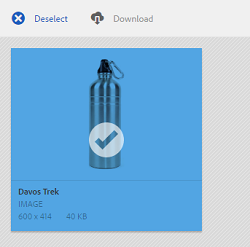

# Middelen delen via een koppeling {#asset-link-sharing}

Met Adobe Experience Manager Assets kunt u elementen, mappen en verzamelingen als een URL delen met leden van uw organisatie en externe entiteiten, waaronder partners en leveranciers. Het delen van elementen via een koppeling is een handige manier om bronnen beschikbaar te maken voor externe partijen zonder dat deze zich eerst hoeven aan te melden bij Middelen.

>[!NOTE]
>
>U vereist geeft ACL toestemming op de omslag of de activa uit die u als verbinding wilt delen.

## Assets delen {#sharelink}

Gebruik het dialoogvenster Koppelen om de URL te genereren voor elementen die u met gebruikers wilt delen. Gebruikers met beheerdersrechten of met leesmachtigingen op de `/var/dam/share` locatie kunnen de koppelingen weergeven die met hen worden gedeeld.

>[!NOTE]
>
>Voordat u een koppeling met gebruikers deelt, moet u ervoor zorgen dat Day CQ Mail Service is geconfigureerd. Er treedt een fout op als u een koppeling probeert te delen zonder eerst de Day CQ Mail Service [te](/help/assets/link-sharing.md#configmailservice)configureren.

1. Selecteer in de gebruikersinterface Elementen het element dat u wilt delen als een koppeling.
1. Klik op de werkbalk op **[!UICONTROL Share Link]** assets_share .

   In het **[!UICONTROL Share Link]** veld wordt automatisch een elementkoppeling gemaakt. Kopieer deze koppeling en deel deze met de gebruikers. De standaardvervaltijd voor de verbinding is één dag.

   

   *Afbeelding: Het dialoogvenster voor het delen van elementen als een koppeling.*

   Alternatief, ga te werk om stappen 3-7 van deze procedure uit te voeren om e-mailontvangers toe te voegen, de vervaltijd voor de verbinding te vormen, en het van de dialoog te verzenden.

   >[!NOTE]
   >
   >Als u koppelingen van uw Experience Manager-auteur naar externe entiteiten wilt delen, dient u ervoor te zorgen dat alleen de volgende URL&#39;s (die worden gebruikt voor het delen van koppelingen) beschikbaar worden gemaakt voor `GET` aanvragen. Andere URL&#39;s blokkeren om de beveiliging van Experience Manager Author te garanderen.
   >
   >* http://[aem_server]:[poort]/linkshare.html
   >* http://[aem_server]:[poort]/linksharepreview.html
   >* http://[aem_server]:[poort]/linkexpired.html

   >[!NOTE]
   >
   >Als een gedeeld element naar een andere locatie wordt verplaatst, werkt de koppeling niet meer. Maak de koppeling opnieuw en deel deze opnieuw met de gebruikers.

1. Ga in Experience Manager-interface naar **[!UICONTROL Tools]** > **[!UICONTROL Operations]** > **[!UICONTROL Web Console]**.

1. Open de **[!UICONTROL Day CQ Link Externalizer]** configuratie en wijzig de volgende eigenschappen op het **[!UICONTROL Domains]** gebied met de waarden die tegen `local`, `author`, en `publish`worden vermeld. Geef voor de eigenschappen `local` en `author` de URL op voor respectievelijk de lokale instantie en de auteur. Zowel `local` als `author` eigenschappen hebben dezelfde waarde als u één Experience Manager Author-instantie uitvoert. Geef `publish`bijvoorbeeld de URL op voor de publicatie-instantie van Experience Manager.

1. Typ in het vak E-mailadres van het dialoogvenster **[!UICONTROL Link Sharing]** de e-mail-id van de gebruiker met wie u de koppeling wilt delen. U kunt de koppeling ook delen met meerdere gebruikers.

   Als de gebruiker lid is van uw organisatie, selecteert u de e-mailid van de gebruiker in de voorgestelde e-mailadressen die worden weergegeven in de lijst onder het invoergebied. Voor een externe gebruiker typt u de volledige e-mailid en selecteert u deze in de lijst.

   Als u wilt dat e-mailberichten naar gebruikers kunnen worden verzonden, configureert u de SMTP-servergegevens in [Day CQ Mail Service](#configmailservice).

   

   *Afbeelding: Koppelingen naar elementen rechtstreeks vanuit het[!UICONTROL Link Sharing]dialoogvenster delen.*

   >[!NOTE]
   >
   >Als u een e-mailadres invoert van een gebruiker die geen lid is van uw organisatie, [!UICONTROL External User] worden de woorden vooraf voorzien van de e-mailid van de gebruiker.

1. Voer in het **[!UICONTROL Subject]** veld een onderwerp in voor het element dat u wilt delen.

1. Voer in het **[!UICONTROL Message]** veld een optioneel bericht in.

1. Geef in het **[!UICONTROL Expiration]** veld met de datumkiezer een vervaldatum en -tijd voor de koppeling op. De vervaldatum wordt standaard ingesteld voor een week vanaf de datum waarop u de koppeling deelt.

   

1. Selecteer **[!UICONTROL Allow download of original file]**.

   >[!NOTE]
   >
   >Standaard kunnen gebruikers alleen de uitvoeringen downloaden van het element dat u als koppeling deelt.

1. Klik op **[!UICONTROL Share]**. Een bericht bevestigt dat de koppeling via e-mail met de gebruikers wordt gedeeld.
1. Klik op de koppeling in de e-mail die naar de gebruiker is verzonden om het gedeelde element weer te geven. Het gedeelde element wordt op de **[!UICONTROL Adobe Marketing Cloud]** pagina weergegeven.

   

   Als u wilt schakelen naar de lijstweergave, klikt u op de layoutoptie op de werkbalk.

1. Klik op het gedeelde element om een voorvertoning van het element te genereren. To close the preview and return to the **[!UICONTROL Marketing Cloud]** page, click **[!UICONTROL Back]** in the toolbar. If you have shared a folder, click **[!UICONTROL Parent Folder]** to return to the parent folder.

   

   >[!NOTE]
   >
   >Experience Manager ondersteunt het genereren van een voorvertoning van elementen van deze MIME-typen: JPG, PNG, GIF, BMP, INDD, PDF en PPT. U kunt alleen de elementen van de andere MIME-typen downloaden.

1. Als u het gedeelde element wilt downloaden, klikt u **[!UICONTROL Select]** op de werkbalk, klikt u op het element en vervolgens klikt u **[!UICONTROL Download]** op de werkbalk.

   

1. Als u de elementen die u als koppelingen hebt gedeeld, wilt weergeven, gaat u naar de gebruikersinterface voor elementen en klikt u op het Experience Manager-logo. Kies een optie **[!UICONTROL Navigation]** in de lijst om het navigatievenster weer te geven.
1. Kies in het navigatievenster **[!UICONTROL Shared Links]** als u een lijst met gedeelde assets wilt weergeven.
1. Als u een element niet wilt delen, selecteert u het en klikt u op **[!UICONTROL Unshare]** de werkbalk. Hierna volgt een bevestigingsbericht. De vermelding voor het element wordt uit de lijst verwijderd.

## CQ-mailservice op dag configureren {#configmailservice}

1. Ga op de startpagina van Experience Manager naar **[!UICONTROL Tools]** > **[!UICONTROL Operations]** > **[!UICONTROL Web Console]**.
1. Van de lijst van de diensten, bepaal de plaats **[!UICONTROL Day CQ Mail Service]**.
1. Click **[!UICONTROL Edit]** beside the service, and configure the following parameters for **[!UICONTROL Day CQ Mail Service]** with the details mentioned against their names:

   * hostnaam SMTP-server: hostnaam e-mailserver
   * SMTP-serverpoort: e-mailserverpoort
   * SMTP-gebruiker: gebruikersnaam e-mailserver
   * SMTP-wachtwoord: wachtwoord e-mailserver
   

1. Klik op **[!UICONTROL Save]**.

## Maximale gegevensgrootte configureren {#maxdatasize}

Wanneer u elementen downloadt van de koppeling die wordt gedeeld met de functie voor het delen van koppelingen, comprimeert Experience Manager de hiërarchie van elementen uit de opslagplaats en retourneert het element vervolgens in een ZIP-bestand. Bij gebrek aan beperkingen van de hoeveelheid gegevens die in een ZIP-bestand kan worden gecomprimeerd, worden enorme hoeveelheden gegevens gecomprimeerd, waardoor fouten in het geheugen in JVM worden veroorzaakt. Om het systeem van een potentiële ontkenning van de dienstaanval toe te schrijven aan deze situatie te beveiligen, vorm de maximumgrootte gebruikend de **[!UICONTROL Max Content Size (uncompressed)]** parameter voor [!UICONTROL Day CQ DAM Adhoc Asset Share Proxy Servlet] in de Manager van de Configuratie. Als de niet-gecomprimeerde grootte van het element de geconfigureerde waarde overschrijdt, worden de verzoeken om het downloaden van het element afgewezen. De standaardwaarde is 100 MB.

1. Click the Experience Manager logo and then go to **[!UICONTROL Tools]** > **[!UICONTROL Operations]** > **[!UICONTROL Web Console]**.
1. Van de Console van het Web, bepaal de plaats van de **[!UICONTROL Day CQ DAM Adhoc Asset Share Proxy Servlet]** configuratie.
1. Open de **[!UICONTROL Day CQ DAM Adhoc Asset Share Proxy Servlet]** configuratie in geef wijze uit, en wijzig de waarde van de **[!UICONTROL Max Content Size (uncompressed)]** parameter.

   

1. Sla de wijzigingen op.

## Beste werkwijzen en probleemoplossing {#bestpractices}

* Elementmappen of verzamelingen die een witruimte in hun naam bevatten, worden mogelijk niet gedeeld.
* Als gebruikers de gedeelde elementen niet kunnen downloaden, vraagt u bij de Experience Manager-beheerder aan welke [downloadlimieten](#maxdatasize) gelden.
* Als u geen e-mail met koppelingen naar gedeelde elementen kunt verzenden of als de andere gebruikers uw e-mail niet kunnen ontvangen, raadpleegt u uw Experience Manager-beheerder of de [e-mailservice](#configmailservice) is geconfigureerd of niet.
* Als u geen elementen kunt delen via de functie voor het delen van koppelingen, controleert u of u de juiste machtigingen hebt. Zie [Elementen](#sharelink)delen.
