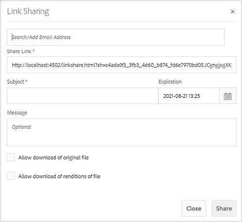

# Middelen delen als koppeling {#asset-link-sharing}

| Versie | Artikelkoppeling |
| -------- | ---------------------------- |
| AEM as a Cloud Service | [ klik hier ](https://experienceleague.adobe.com/docs/experience-manager-cloud-service/content/assets/manage/share-assets.html?lang=en) |
| AEM 6,5 | Dit artikel |

Met [!DNL Adobe Experience Manager Assets] kunt u elementen, mappen en verzamelingen als een URL delen met leden van uw organisatie en externe entiteiten, waaronder partners en leveranciers. Het delen van elementen via een koppeling is een handige manier om bronnen beschikbaar te maken voor externe partijen zonder dat deze zich eerst hoeven aan te melden bij [!DNL Assets] .

>[!PREREQUISITES]
>
>* U hebt `Edit ACL` toestemming nodig voor de map of het middel dat u als koppeling wilt delen.
>* Om e-mails naar de gebruikers te verzenden, vorm de SMTP serverdetails in [ de Dienst van de Post van CQ van de Dag ](#configmailservice).

## Elementen delen {#share-assets}

Gebruik het dialoogvenster [!UICONTROL Link Sharing] om de URL te genereren voor elementen die u met gebruikers wilt delen.

* Gebruikers met beheerdersrechten of met leesmachtigingen op de locatie `/var/dam/share` kunnen de koppelingen weergeven die met hen worden gedeeld.
* Gebruikers met leesmachtigingen op de locatie `/var/dam/jobs/download` kunnen elementen downloaden van de gedeelde koppeling.

1. Selecteer in de gebruikersinterface van [!DNL Assets] het element dat u wilt delen als koppeling.

1. Van de toolbar, klik het **[!UICONTROL Share Link]** . De koppeling die wordt gemaakt nadat op **[!UICONTROL Share]** is geklikt, wordt vooraf weergegeven in het veld [!UICONTROL Share Link] . De koppeling wordt pas gemaakt wanneer u **[!UICONTROL Submit]** selecteert.

   

   *Cijfer: De dialoog om activa als verbinding te delen.*

1. Typ in het vak E-mailadres van het dialoogvenster **[!UICONTROL Link Sharing]** de e-mail-id van de gebruiker met wie u de koppeling wilt delen. U kunt een of meer gebruikers toevoegen.

   >[!NOTE]
   >
   >Als u een e-mailadres invoert van een gebruiker die geen lid is van uw organisatie, wordt het woord [!UICONTROL External User] voorafgegaan door de e-mailid van de gebruiker.

1. Voer in het vak **[!UICONTROL Subject]** een onderwerp in voor het element dat u wilt delen.

1. Voer in het vak **[!UICONTROL Message]** een optioneel bericht in.

1. Geef in het veld **[!UICONTROL Expiration]** een vervaldatum en -tijd op waarop de koppeling moet stoppen. De standaardvervaltijd voor de verbinding is één dag.

   

1. Selecteer **[!UICONTROL Allow download of original file]** als u gebruikers het oorspronkelijke element wilt laten downloaden. Selecteer **[!UICONTROL Allow download of renditions of file]** als u gebruikers alleen de uitvoeringen van de gedeelde elementen wilt laten downloaden.

1. Klik op **[!UICONTROL Share]**. Een bericht bevestigt dat de koppeling via e-mail met de gebruikers wordt gedeeld.

1. Klik op de koppeling in de e-mail die naar de gebruiker is verzonden om het gedeelde element weer te geven. Klik op het gedeelde element om een voorvertoning van het element te genereren. Klik op **[!UICONTROL Back]** om de voorvertoning te sluiten. Als u een map hebt gedeeld, klikt u op **[!UICONTROL Parent Folder]** om terug te keren naar de bovenliggende map.

   

   >[!NOTE]
   >
   >[!DNL Experience Manager] steunt het produceren van de voorproef van activa van slechts [ de gesteunde dossiertypes ](/help/assets/assets-formats.md). Als andere MIME-typen worden gedeeld, kunt u alleen de elementen downloaden en kunt u geen voorvertoning weergeven.

1. Als u het gedeelde element wilt downloaden, klikt u op **[!UICONTROL Select]** op de werkbalk, klikt u op het element en klikt u vervolgens op **[!UICONTROL Download]** op de werkbalk.

    te downloaden

1. Als u de elementen die u hebt gedeeld als koppelingen wilt weergeven, gaat u naar de gebruikersinterface van [!DNL Assets] en klikt u op het logo van [!DNL Experience Manager] . Kies **[!UICONTROL Navigation]** . Kies **[!UICONTROL Shared Links]** in het navigatievenster om een lijst met gedeelde elementen weer te geven.

1. Als u een element niet wilt delen, selecteert u het en klikt u op **[!UICONTROL Unshare]** in de werkbalk. Hierna volgt een bevestigingsbericht. De vermelding voor het element wordt uit de lijst verwijderd.

## CQ-mailservice op dag configureren {#configure-day-cq-mail-service}

1. Navigeer op de startpagina van [!DNL Experience Manager] naar **[!UICONTROL Tools]** > **[!UICONTROL Operations]** > **[!UICONTROL Web Console]** .
1. Zoek in de lijst met services naar **[!UICONTROL Day CQ Mail Service]** .
1. Klik op **[!UICONTROL Edit]** naast de service en configureer de volgende parameters voor **[!UICONTROL Day CQ Mail Service]** met de details die onder hun naam worden vermeld:

   * hostnaam SMTP-server: hostnaam e-mailserver
   * SMTP-serverpoort: poort e-mailserver
   * SMTP-gebruiker: gebruikersnaam e-mailserver
   * SMTP-wachtwoord: wachtwoord e-mailserver

   

1. Klik op **[!UICONTROL Save]**.

## Maximale gegevensgrootte configureren {#configure-maximum-data-size}

Wanneer u elementen downloadt van de koppeling die wordt gedeeld met de functie voor het delen van koppelingen, comprimeert [!DNL Experience Manager] de hiërarchie van elementen uit de opslagplaats en wordt het element vervolgens in een ZIP-bestand geretourneerd. Bij gebrek aan beperkingen van de hoeveelheid gegevens die in een ZIP-bestand kan worden gecomprimeerd, worden enorme hoeveelheden gegevens gecomprimeerd, waardoor fouten in het geheugen in JVM worden veroorzaakt. Om het systeem van een potentiële ontkenning van de dienstaanval toe te schrijven aan deze situatie te beveiligen, vorm de maximumgrootte gebruikend de **[!UICONTROL Max Content Size (uncompressed)]** parameter voor **[!UICONTROL Day CQ DAM Adhoc Asset Share Proxy Servlet]** in de Manager van de Configuratie. Als de niet-gecomprimeerde grootte van het element de geconfigureerde waarde overschrijdt, worden de verzoeken om het downloaden van het element afgewezen. De standaardwaarde is 100 MB.

1. Klik op het logo [!DNL Experience Manager] en ga naar **[!UICONTROL Tools]** > **[!UICONTROL Operations]** > **[!UICONTROL Web Console]** .
1. Zoek in de webconsole de **[!UICONTROL Day CQ DAM Adhoc Asset Share Proxy Servlet]** -configuratie.
1. Open de **[!UICONTROL Day CQ DAM Adhoc Asset Share Proxy Servlet]** -configuratie in de bewerkingsmodus en wijzig de waarde van de **[!UICONTROL Max Content Size (uncompressed)]** -parameter.

   

1. Sla de wijzigingen op.

## Aanbevolen werkwijzen en problemen oplossen {#best-practices-and-troubleshooting}

* Elementmappen of verzamelingen die een witruimte in hun naam bevatten, worden mogelijk niet gedeeld.
* Als de gebruikers niet de gedeelde activa kunnen downloaden, controleer met uw [!DNL Experience Manager] beheerder wat de [ downloadgrenzen ](#configure-maximum-data-size) zijn.
* Als u geen e-mail met verbindingen naar gedeelde activa kunt verzenden of als de andere gebruikers uw e-mail niet kunnen ontvangen, controleer met uw [!DNL Experience Manager] beheerder als de [ e-maildienst ](#configure-day-cq-mail-service) of niet wordt gevormd.
* Als u geen elementen kunt delen via de functie voor het delen van koppelingen, controleert u of u de juiste machtigingen hebt. Zie [ activa ](#share-assets) delen.
* Als een gedeeld element naar een andere locatie wordt verplaatst, werkt de koppeling niet meer. Maak de koppeling opnieuw en deel deze opnieuw met de gebruikers.

* Als u koppelingen wilt delen van de implementatie van [!DNL Experience Manager] Auteurs naar externe entiteiten, dient u alleen de volgende URL&#39;s beschikbaar te maken die worden gebruikt voor het delen van koppelingen, voor `GET` -aanvragen. Andere URL&#39;s blokkeren vanwege beveiligingsredenen.

   * `http://[aem_server]:[port]/linkshare.html`
   * `http://[aem_server]:[port]/linksharepreview.html`
   * `http://[aem_server]:[port]/linkexpired.html`

  Ga in de [!DNL Experience Manager] -interface naar **[!UICONTROL Tools]** > **[!UICONTROL Operations]** > **[!UICONTROL Web Console]** . Open de **[!UICONTROL Day CQ Link Externalizer]** -configuratie en wijzig de volgende eigenschappen in het **[!UICONTROL Domains]** -veld met de waarden die onder `local` , `author` en `publish` worden vermeld. Geef voor de eigenschappen `local` en `author` de URL op voor respectievelijk de lokale instanties en de instanties Auteur. Wanneer u één [!DNL Experience Manager] Auteur-instantie uitvoert, gebruikt u dezelfde waarde voor de eigenschappen `local` en `author` . Geef voor Publish-instanties de URL van de Publish-instantie [!DNL Experience Manager] op.
