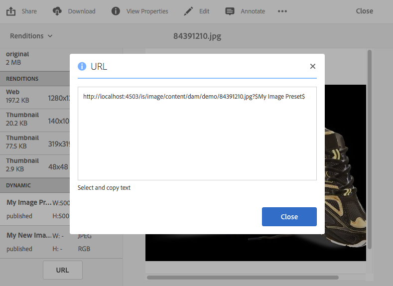
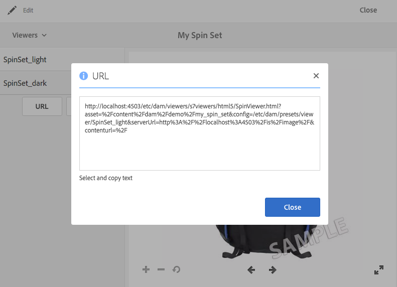

# URL&#39;s koppelen aan uw webtoepassing {#linking-urls-to-your-web-application}

Uw websites en toepassingen hebben via URL-oproepen toegang tot Dynamic Media-services. Nadat u een element hebt gepubliceerd, activeert Dynamic Media een URL-tekenreeks die verwijst naar het element. U kunt deze URL&#39;s voor testdoeleinden in een webbrowser plakken.

U verbindt met URLs slechts als u *niet* gebruikend Experience Manager als uw WCM bent. Koppelen - in plaats van insluiten - wordt gebruikt wanneer u een videospeler wilt leveren als pop-up of modaal venster. Als u Experience Manager als uw WCM gebruikt, [&#x200B; voegt u de activa direct op uw pagina &#x200B;](adding-dynamic-media-assets-to-pages.md) toe.

Kopieer deze URL-tekenreeksen vanuit Dynamic Media om deze in uw webpagina&#39;s en toepassingen te plaatsen.

>[!NOTE]
>
>URL-tekenreeksen zijn alleen beschikbaar voor dynamische uitvoeringen van elementen. Ze zijn momenteel niet beschikbaar voor statische elementen die zich in DAM bevinden en niet voor de Dynamic Media-server. De knop URL wordt niet weergegeven voor vertoningen die statisch zijn.

Zie ook [&#x200B; bed de Video of Kijker van het Beeld op een Web-pagina &#x200B;](embed-code.md) in.

Zie ook [&#x200B; Verbinding YouTube URLs aan uw Toepassing van het Web &#x200B;](video.md).

Zie ook [&#x200B; lever geoptimaliseerde beelden voor een ontvankelijke plaats &#x200B;](responsive-site.md).

Zie ook [&#x200B; activa &#x200B;](manage-assets.md#uploading-assets) uploaden.

## Een URL verkrijgen voor een element {#obtaining-a-url-for-an-asset}

U kunt een URL-tekenreeks verkrijgen die wordt gegenereerd door een voorinstelling voor afbeeldingen of een voorinstelling voor de viewer. Nadat u de URL hebt gekopieerd, wordt de URL op het Klembord geland, zodat u deze desgewenst kunt plakken naar pagina&#39;s in uw website of toepassing.

>[!NOTE]
>
>De URL is pas beschikbaar voor kopiëren nadat u het geselecteerde element hebt gepubliceerd. Daarnaast moet u ook de voorinstelling van de viewer of de voorinstelling van de afbeelding publiceren.
>
>Zie [&#x200B; de activa van Publish &#x200B;](publishing-dynamicmedia-assets.md).
>
>Zie [&#x200B; de Kijker van Publish stelt &#x200B;](managing-viewer-presets.md#publishing-viewer-presets) vooraf in.
>
>Zie [&#x200B; het Beeld van Publish vooraf instelt &#x200B;](managing-image-presets.md#publishing-image-presets).

Er zijn verschillende manieren waarop u een URL-tekenreeks kunt verkrijgen. In de onderstaande stappen ziet u echter slechts één methode die u kunt gebruiken.

**om URL voor een activa te verkrijgen:**

1. Navigeer aan het *gepubliceerde* middel waarvan vooraf ingestelde beeld URL of kijker vooraf ingestelde URL u, en selecteer de activa wilt kopiëren om het te openen.

   Houd er rekening mee dat URL&#39;s alleen beschikbaar zijn om te kopiëren *nadat* u de assets eerst hebt *gepubliceerd*. Bovendien moet de viewervoorinstelling of afbeeldingsvoorinstelling ook worden gepubliceerd.

   Zie [&#x200B; de activa van Publish &#x200B;](publishing-dynamicmedia-assets.md).

   Zie [&#x200B; de Kijker van Publish stelt &#x200B;](managing-viewer-presets.md#publishing-viewer-presets) vooraf in.

   Zie [&#x200B; het Beeld van Publish vooraf instelt &#x200B;](managing-image-presets.md#publishing-image-presets).

1. Voer op basis van het element dat u hebt geselecteerd een van de volgende handelingen uit:

   * Als u een afbeelding hebt geselecteerd, selecteert u **[!UICONTROL Renditions]** in de vervolgkeuzelijst.

     Selecteer onder de kop **[!UICONTROL Dynamic]** een naam voor de voorinstelling om de vertoning ervan in het rechterframe weer te geven. Schuif zo nodig in de lijst Uitvoeringen om de dynamische kop weer te geven.

     Selecteer **[!UICONTROL URL]** onder aan het linkerspoor.

     

   * Selecteer **[!UICONTROL Viewers]** als u een centrifugeset, een afbeeldingsset, een carrouselset of een video hebt geselecteerd in de vervolgkeuzelijst.

     Selecteer in het linkerspoor een naam voor de viewervoorinstelling. Er wordt een voorvertoning van de set of video geopend op een aparte pagina.

     Selecteer **[!UICONTROL URL]** in het linkerspoor, onderaan.

     

1. Selecteer en kopieer de tekst naar uw webbrowser, zodat u een voorvertoning van het element kunt bekijken of het aan uw webinhoudpagina kunt toevoegen.

   Als u het URL-venster wilt sluiten, selecteert u **[!UICONTROL X]** of selecteert u **[!UICONTROL Close]** .

## Een URL verkrijgen voor een statisch element {#obtaining-a-url-for-a-static-asset}

Dynamic Media ondersteunt de levering van statische elementen. Dit zijn aanvullende elementen die verder gaan dan alleen afbeeldingen en video. Tot de ondersteunde indelingen voor statische elementen voor levering behoren:

* 3D-bestanden
* Geanimeerd GIF
* Audiobestanden
* CSS
* JavaScript (wanneer uw bedrijf met zijn eigen domein wordt gevormd)
* PDF
* SVG
* XML
* ZIP

**om een URL voor een statisch element te verkrijgen:**

1. Navigeer aan *gepubliceerde* statische activa de waarvan URL u, en selecteer de activa wilt kopiëren om het te openen.

   Herinner dat URLs slechts beschikbaar is om *te kopiëren nadat* u eerst ** het statische activa hebt gepubliceerd.

   Zie [&#x200B; de activa van Publish &#x200B;](publishing-dynamicmedia-assets.md).

1. Gebruik een van de volgende methoden om de URL van het gepubliceerde statische element te verkrijgen:

   * `The URL of the published static is the following:`

      * `https://*<server_name>*/is/content/*<company_name>*/*<static_asset_filename>*.*<extension>*`

        Bijvoorbeeld `https://aem.com/is/content/adobe/image.gif` .

   * Selecteer **[!UICONTROL Asset]** > **[!UICONTROL Dynamic Renditions]** en selecteer vervolgens een dynamische uitvoering van het statische element en kopieer de URL.

     Wijzig de gekopieerde URL om `is/content` in het pad te gebruiken in plaats van `is/image/` .

## Een video-URL opvragen voor een gepubliceerde video-uitvoering {#obtaining-a-video-url-for-a-published-video-rendition}

1. Navigeer in Experience Manager naar **[!UICONTROL Tools]** > **[!UICONTROL Deployment]** > **[!UICONTROL Cloud]** > **[!UICONTROL Cloud Services]** .
1. Schuif op de pagina **[!UICONTROL Cloud Services]** omlaag naar de kop **[!UICONTROL Dynamic Media Cloud Services]** en selecteer vervolgens **[!UICONTROL Show Configurations]** .
1. Selecteer onder **[!UICONTROL Available Configurations]** de naam van de gewenste configuratie.

1. Kopieer onder **[!UICONTROL Video Service URL]** op de pagina **[!UICONTROL Dynamic Media Cloud Settings]** het volledige URL-pad naar beneden. U dient het gekopieerde URL-pad later in de stappen te gebruiken.

   Het URL-pad kan er bijvoorbeeld ongeveer als volgt uitzien:

   `https://s7athens.macromedia.com:9090/DMGateway/`

   (Het bovenstaande pad is alleen een voorbeeld; het is niet het pad dat u daadwerkelijk kopieert.)

1. Kopieer onder **[!UICONTROL Registration ID]** de naam van de klant die u in het laatste gedeelte van de id vindt.

   Als de registratie-id bijvoorbeeld `87654321|MyCompany` was, zou de naam van de klant `MyCompany` zijn.

1. Selecteer **[!UICONTROL Cloud Services]** in de linkerbovenhoek van de pagina, selecteer vervolgens het logo van de Experience Manager en navigeer naar **[!UICONTROL General]** > **[!UICONTROL CRXDE Lite]** .
1. Kopieer het volledige pad voor video-uitvoering van de JCR (Java™ Content Repository) naar beneden.

   Het weergavepad van de video kan er bijvoorbeeld ongeveer als volgt uitzien:

   `/_renditions_/0bd/0bd28743-a616-4fe6-92aa-6eae7c2112f/avs/Momentum_1080-0x720-2600k.mp4`

   (Het bovenstaande pad is alleen een voorbeeld; het is niet het pad dat u daadwerkelijk kopieert.)

1. Plaats de gekopieerde gegevens in de volgende volgorde, zodat ze een volledig URL-pad vormen:

   `<Video_Service_URL>/public/<Customer_name_from_Registration_ID>/<Video_rendition_path>`

   Met de voorbeeldpaden en de voorbeeldnaam van de klant uit de bovenstaande stappen ziet het volledige pad er als volgt uit:

   `https://s7athens.macromedia.com:9090/DMGateway/public/MyCompany/_renditions_/0bd/0bd28743-a616-4fe6-92aa-6eae7c2112ff/avs/Momentum_1080-0x720-2600k.mp4`

   Dit voorbeeld is de volledige video-URL voor een gepubliceerde video-uitvoering.

## Een video-URL verkrijgen voor adaptieve bitsnelheidstreaming (DASH of HLS) {#obtaining-a-video-url-for-adaptive-streaming-hls}

1. Navigeer in Experience Manager naar **[!UICONTROL Tools]** > **[!UICONTROL Deployment]** > **[!UICONTROL Cloud]** > **[!UICONTROL Cloud Services]** .
1. Schuif op de pagina **[!UICONTROL Cloud Services]** omlaag naar de kop **[!UICONTROL Dynamic Media Cloud Services]** en selecteer vervolgens **[!UICONTROL Show Configurations]** .
1. Selecteer onder **[!UICONTROL Available Configurations]** de naam van de gewenste configuratie.
1. Ga als volgt te werk op de pagina **[!UICONTROL Dynamic Media Cloud Services Settings]** :

   * Kopieer onder **[!UICONTROL Video Service URL]** het volledige URL-pad. U hebt het gekopieerde URL-pad later in deze stappen nodig. Het URL-pad kan er bijvoorbeeld ongeveer als volgt uitzien:

   `https://gateway-na.assetsadobe.com/DMGateway/`

   (Het bovenstaande pad is alleen een voorbeeld; het is niet het pad dat u daadwerkelijk kopieert.)

   * Kopieer onder **[!UICONTROL Registration ID]** de naam van de klant in het laatste gedeelte van de id. U hebt de gekopieerde klantennaam later in deze stappen nodig.

     Als de registratie-id bijvoorbeeld `87654321|demoCo` was, zou de naam van de klant die u kopieert `demoCo` zijn.

1. Kopieer de respectievelijke protocolkiezer op basis van het video-leveringsprotocol dat u gebruikt. U hebt de gekopieerde protocolkiezer later in deze stappen nodig.

   | Video-leveringsprotocol dat u gebruikt | Te gebruiken protocolkiezer |
   |---|---|
   | HTTP   Als u HTTP gebruikt (niet-beveiligde video-levering), moet u https wijzigen in http in de URL-waarde van de videoservice die u eerder hebt gekopieerd. | `public/` |
   | HTTPS | `public-ssl/` |

1. Kopieer het volledige pad naar video-elementen in Experience Manager, zoals verwerkt door Dynamic Media. U hebt dit gekopieerde pad voor video-elementen later in deze stappen nodig.

   Bijvoorbeeld:

   `/content/dam/marketing/MyVideo.mp4`

1. Combineer alle onderdelen die u eerder hebt gekopieerd om een tekenreeks in de volgende volgorde te maken:

   &lt; `video service URL`>&lt; `protocol selector`>&lt; `customer name`>&lt; `video asset path`>

   Met de gekopieerde informatie uit de voorbeelden in deze stappen ziet de tekenreeks er bijvoorbeeld als volgt uit:

   `https://gateway-na.assetsadobe.com/DMGateway/public-ssl/demoCo/content/dam/marketing/MyVideo.mp4`

1. Voltooi de URL door `.m3u8` aan het einde van de tekenreeks toe te voegen. Als u bijvoorbeeld `.m3u8` toevoegt aan de tekenreeks uit de vorige stap, wordt het volledige URL-pad als volgt weergegeven:

   `https://gateway-na.assetsadobe.com/DMGateway/public-ssl/demoCo/content/dam/marketing/MyVideo.mp4.m3u8`

## Gebruik HTTP/2 om uw Dynamic Media-middelen te leveren {#using-http-to-deliver-your-dynamic-media-assets}

HTTP/2 is het nieuwe, bijgewerkte webprotocol dat de manier verbetert waarop browsers en servers communiceren. Het zorgt voor een snellere overdracht van informatie en vermindert de hoeveelheid verwerkingskracht die nodig is. De levering van Dynamic Media-middelen kan nu plaatsvinden via HTTP/2, wat betere responstijd en laadtijden biedt.

Zie [&#x200B; HTTP2 Levering van Inhoud &#x200B;](http2.md) voor volledige details bij het worden begonnen HTTP/2 met uw rekening van Dynamic Media te gebruiken.
