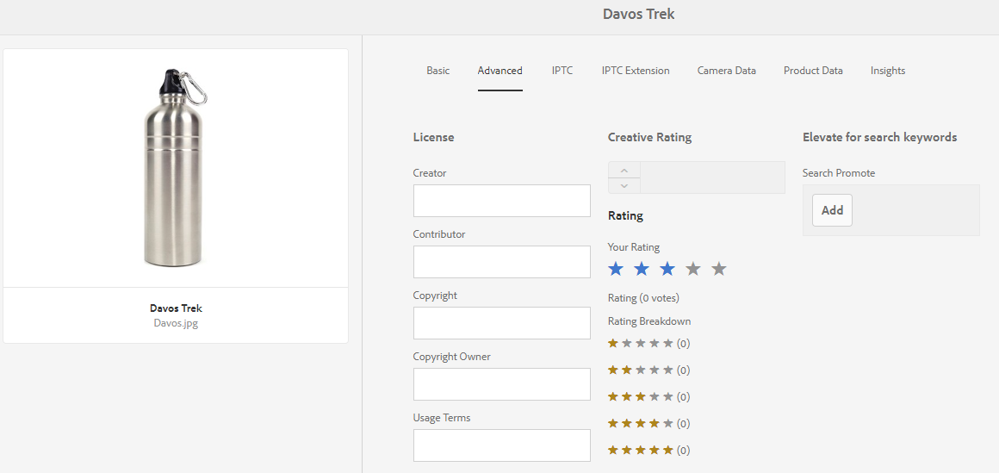

# Uw digitale middelen beheren {#manage-digital-assets}

| Versie | Artikelkoppeling |
| -------- | ---------------------------- |
| AEM as a Cloud Service | [Klik hier](https://experienceleague.adobe.com/docs/experience-manager-cloud-service/content/assets/manage/manage-digital-assets.html?lang=en) |
| AEM 6,5 | Dit artikel |

In [!DNL Adobe Experience Manager Assets], kunt u meer doen dan uw elementen opslaan en beheren. [!DNL Experience Manager] biedt mogelijkheden voor middelenbeheer op bedrijfsniveau. U kunt elementen bewerken en delen, geavanceerde zoekopdrachten uitvoeren en meerdere uitvoeringen van tientallen ondersteunde bestandsindelingen maken. U kunt ook versies en digitale rechten beheren, de verwerking van elementen automatiseren, metagegevens beheren en besturen, samenwerken met annotaties en nog veel meer.

In dit artikel worden de elementaire taken voor middelenbeheer beschreven, zoals maken of uploaden; updates van metagegevens, kopiëren, verplaatsen en verwijderen, publiceren, verwijderen en zoeken naar elementen. Als u de gebruikersinterface wilt begrijpen, raadpleegt u [Aan de slag met de gebruikersinterface voor middelen](/help/sites-authoring/basic-handling.md). Zie voor het beheren van inhoudsfragmenten [Inhoudskaders beheren](/help/assets/content-fragments/content-fragments-managing.md) activa.

## Mappen maken {#creating-folders}

Bij het organiseren van een verzameling elementen, bijvoorbeeld alle `Nature` afbeeldingen kunt u mappen maken om ze bij elkaar te houden. U kunt mappen gebruiken om uw elementen te categoriseren en in te delen. [!DNL Experience Manager Assets] vereist niet dat u elementen in mappen ordent om beter te werken.

>[!NOTE]
>
>* Een [!DNL Assets] map met het type `sling:OrderedFolder` wordt niet ondersteund bij delen naar Experience Cloud. Selecteer [!UICONTROL Ordered] wanneer u een map maakt.
>* [!DNL Experience Manager] staat het gebruik van `subassets` woord als de naam van een map. Het is een sleutelwoord dat voor een knoop wordt gereserveerd die subassets voor samengestelde activa bevat.

1. Navigeer naar de plaats in de map met digitale elementen waar u een map wilt maken. Klik op **[!UICONTROL Create]**. Selecteren **[!UICONTROL New Folder]**.
1. In de **[!UICONTROL Title]** veld, geef een mapnaam op. Standaard gebruikt DAM de titel die u als mapnaam hebt opgegeven. Nadat de map is gemaakt, kunt u de standaardinstelling overschrijven en een andere mapnaam opgeven.
1. Klik op **[!UICONTROL Create]**. De map wordt weergegeven in de map met digitale middelen.

De volgende tekens (lijst met door spaties gescheiden tekens) worden niet ondersteund:

* De naam van een elementbestand mag geen van de volgende tekens bevatten: `* / : [ \\ ] | # % { } ? &`
* De naam van een elementmap mag geen van de volgende tekens bevatten: `* / : [ \\ ] | # % { } ? \" . ^ ; + & \t`

Voeg geen speciale tekens toe aan de extensies van de bestandsnamen van elementen.

## Elementen uploaden {#uploading-assets}

<!-- TBD the following:
Move this section into a new article. CQDOC-14874 ticket is created for this.
In this complete article, replace emphasis with UICONTROL where appropriate.
-->

U kunt verschillende typen elementen (zoals afbeeldingen, PDF-bestanden, RAW-bestanden, enzovoort) uploaden van uw lokale map of een netwerkstation naar [!DNL Experience Manager Assets].

>[!NOTE]
>
>In de modus Dynamic Media - Scene7 is de standaardbestandsgrootte voor het uploaden van middelen 2 GB of minder. Als u het uploaden van middelen groter dan 2 GB tot 15 GB wilt configureren, raadpleegt u [(Optioneel) Configureer de Dynamic Media-Scene7-modus voor het uploaden van middelen groter dan 2 GB](/help/assets/config-dms7.md#optional-config-dms7-assets-larger-than-2gb).

>[!IMPORTANT]
>
>Elementen die u uploadt naar een Experience Manager met een bestandsnaam die groter is dan 100 tekens, krijgen een kortere naam wanneer ze worden gebruikt in Dynamic Media.
>
>De eerste 100 tekens in de bestandsnaam worden als volgt gebruikt. De resterende tekens worden vervangen door een alfanumerieke tekenreeks. Deze methode voor het wijzigen van de naam garandeert een unieke naam wanneer het element in Dynamic Media wordt gebruikt. Het is ook bedoeld om rekening te houden met de maximale lengte voor elementbestanden die in Dynamic Media is toegestaan.

U kunt ervoor kiezen elementen te uploaden naar mappen waaraan al dan niet een verwerkingsprofiel is toegewezen.

Voor mappen waaraan een verwerkingsprofiel is toegewezen, wordt de profielnaam weergegeven op de miniatuur in de kaartweergave. In de lijstweergave wordt de profielnaam weergegeven in het dialoogvenster **Bezig met verwerken profiel** kolom. Zie [Profielen verwerken](/help/assets/processing-profiles.md).

Voordat u een element uploadt, moet u ervoor zorgen dat het zich in een [format](/help/assets/assets-formats.md) dat [!DNL Experience Manager Assets] ondersteunt.

1. In de [!DNL Assets] navigeer in de gebruikersinterface naar de locatie waar u digitale elementen wilt toevoegen.
1. Voer een van de volgende handelingen uit om de elementen te uploaden:

   * Klik op de werkbalk op **[!UICONTROL Create]**. Klik vervolgens in het menu op **[!UICONTROL Files]**. U kunt de naam van het bestand desgewenst wijzigen in het dialoogvenster dat verschijnt.
   * In browser die HTML5 steunt, sleep de activa direct op [!DNL Assets] gebruikersinterface. Het dialoogvenster voor het wijzigen van de naam van het bestand wordt niet weergegeven.

   

   Als u meerdere bestanden wilt selecteren, selecteert u de `Ctrl` of `Command` en selecteert u de elementen in het dialoogvenster Bestandenkiezer. Als u een iPad gebruikt, kunt u slechts één bestand tegelijk selecteren.

   U kunt het uploaden van grote elementen (groter dan 500 MB) pauzeren en later vanaf dezelfde pagina hervatten. Klikken **[!UICONTROL Pause]** naast de voortgangsbalk die wordt weergegeven wanneer het uploaden start.

   

De omvang waarboven een actief als een groot actief wordt beschouwd, is configureerbaar. U kunt het systeem bijvoorbeeld zodanig configureren dat elementen van meer dan 1000 MB (in plaats van 500 MB) als grote elementen worden beschouwd. In dit geval: **[!UICONTROL Pause]** wordt weergegeven op de voortgangsbalk wanneer bestanden van meer dan 1000 MB worden geüpload.

De [!UICONTROL Pause] wordt niet weergegeven als een bestand van meer dan 1000 MB wordt geüpload met een bestand van minder dan 1000 MB. Als u echter het uploaden van bestanden met minder dan 1000 MB annuleert, wordt de knop **[!UICONTROL Pause]** wordt weergegeven.

Om de groottegrens te wijzigen, vorm `chunkUploadMinFileSize` eigendom van de `fileupload` knooppunt in de CRX-opslagplaats beschikbaar op `/apps/dam/gui/content/assets/jcr:content/actions/secondary/create/items/fileupload`.

Wanneer u op **[!UICONTROL Pause]**, schakelt het naar de **[!UICONTROL Play]** -optie. Klik op **[!UICONTROL Play]**.

Als u een actieve upload wilt annuleren, klikt u op Sluiten (`X`) naast de voortgangsbalk. Wanneer u het uploaden annuleert, [!DNL Assets] Hiermee verwijdert u het gedeeltelijk geüploade gedeelte van het element.

De mogelijkheid om het uploaden te hervatten is vooral handig in scenario&#39;s met lage bandbreedte en netwerkstoringen, waarbij het uploaden van een groot element veel tijd in beslag neemt. U kunt het uploaden pauzeren en verdergaan wanneer de situatie verbetert. Wanneer u het document hervat, begint het uploaden vanaf het punt waarop u het hebt gepauzeerd.

Tijdens het uploaden [!DNL Experience Manager] Hiermee slaat u de delen van het element dat wordt geüpload op als stukjes gegevens in de CRX-opslagplaats. Wanneer het uploaden is voltooid, [!DNL Experience Manager] consolideert deze fragmenten tot één enkel gegevensblok in de gegevensopslagruimte.

Ga naar om de opschoningstaak voor de onvoltooide taken voor het uploaden naar `https://[aem_server]:[port]/system/console/configMgr/org.apache.sling.servlets.post.impl.helper.ChunkCleanUpTask`.

>[!CAUTION]
>
>Het uploaden van de brok wordt teweeggebracht wanneer de standaardwaarde 500 MB is en de brokgrootte 50 MB is. Als u [Apache Jackrabbit Oak TokenConfiguration](https://experienceleague.adobe.com/docs/experience-cloud-kcs/kbarticles/KA-16464.html) en stelt de `timeout configuration` als het uploaden van een element minder tijd in beslag neemt, treedt er een sessietime-outsituatie op terwijl het uploaden van het element bezig is. Wijzig daarom de `chunkUploadMinFileSize` en `chunksize` zodat elke segmentaanvraag de sessie vernieuwt.
>
>Op basis van de time-out bij verlopen van de referentie, de latentie, de bandbreedte en de verwachte gelijktijdige uploads, is de hoogste waarde waarmee u ervoor kunt zorgen dat het volgende wordt gekozen:
>
>* Om ervoor te zorgen dat het uploaden van brokken is ingeschakeld voor bestanden met grootten die tijdens het uploaden waarschijnlijk resulteren in een vervaldatum van de referentie.
>
>* Om ervoor te zorgen dat elk segment eindigt alvorens de referentie verloopt.

Als u een element uploadt met dezelfde naam als een element dat al beschikbaar is op de locatie waar u het element uploadt, wordt een waarschuwingsvenster weergegeven.

U kunt een bestaand element vervangen, een andere versie maken of beide behouden door de naam van het nieuwe element dat wordt geüpload te wijzigen. Als u een bestaand element vervangt, worden de metagegevens voor het element en eventuele eerdere wijzigingen (bijvoorbeeld notities aanbrengen of uitsnijden) die u in het bestaande element hebt aangebracht, verwijderd. Als u ervoor kiest beide elementen te behouden, krijgt het nieuwe element een nieuwe naam `1` toegevoegd aan de naam.


>[!NOTE]
>
>Wanneer u **[!UICONTROL Replace]** in de [!UICONTROL Name Conflict] wordt de element-id opnieuw gegenereerd voor het nieuwe element. Deze id verschilt van de id van het vorige element.
>
>Als Assets Insights is ingeschakeld om afbeeldingen te volgen of met klikken [!DNL Adobe Analytics]maakt de opnieuw gegenereerde element-id de gegevensopname voor het element op ongeldig [!DNL Analytics].

Als het element dat u uploadt bestaat in [!DNL Assets]de **[!UICONTROL Duplicates Detected]** wordt gewaarschuwd dat u probeert een gedupliceerd element te uploaden. Het dialoogvenster wordt alleen weergegeven als `SHA 1` de controlesommotum van het binaire element van het bestaande element komt overeen met de waarde van de controlesom van het element dat u uploadt. In dit geval zijn de namen van de elementen niet van belang.

>[!NOTE]
>
>De [!UICONTROL Duplicates Detected] wordt alleen weergegeven wanneer de functie voor dubbele detectie is ingeschakeld. Als u de functie voor dubbele detectie wilt inschakelen, raadpleegt u [Dubbele detectie inschakelen](/help/assets/duplicate-detection.md).


Het dubbele element behouden in [!DNL Assets], klikt u op **[!UICONTROL Keep]**. Als u het geüploade dubbele element wilt verwijderen, klikt u op **[!UICONTROL Delete]**.

[!DNL Experience Manager Assets] Hiermee voorkomt u dat elementen met de verboden tekens in de bestandsnaam worden geüpload. Als u een element probeert te uploaden met een bestandsnaam die een niet-toegestaan teken of meer bevat, [!DNL Assets] geeft een waarschuwingsbericht weer en stopt de upload totdat u deze tekens verwijdert of uploadt met een toegestane naam.

Als u specifieke conventies voor de naamgeving van bestanden voor uw organisatie wilt aanpassen, kunt u de opdracht [!UICONTROL Upload Assets] kunt u lange namen opgeven voor de bestanden die u uploadt.

De volgende tekens (lijst met door spaties gescheiden tekens) worden echter niet ondersteund:

* de naam van het elementbestand mag geen elementen bevatten `* / : [ \\ ] | # % { } ? &`
* de naam van de elementenmap mag niet bevatten `* / : [ \\ ] | # % { } ? \" . ^ ; + & \t`

Voeg geen speciale tekens toe aan de extensies van de bestandsnamen van elementen.


Bovendien [!DNL Assets] in de gebruikersinterface wordt het meest recente element weergegeven dat u uploadt of de map die u als eerste hebt gemaakt.

Als u het uploaden annuleert voordat de bestanden zijn geüpload, [!DNL Assets] uploadt het huidige bestand niet meer en vernieuwt de inhoud. Bestanden die al zijn geüpload, worden echter niet verwijderd.

Het dialoogvenster Uploadvoortgang in [!DNL Assets] geeft het aantal geüploade bestanden weer en de bestanden die niet zijn geüpload.

### Seriële uploads {#serialuploads}

Het uploaden van een groot aantal bedrijfsmiddelen verbruikt aanzienlijke I/O-bronnen, wat de prestaties van uw [!DNL Assets] implementatie. Met name als u een trage internetverbinding hebt, neemt de uploadtijd drastisch toe als gevolg van een spiek in schijf-I/O. Bovendien kan uw webbrowser extra beperkingen instellen voor het aantal aanvragen voor POSTEN [!DNL Assets] kan worden verwerkt voor gelijktijdige uploads van elementen. Hierdoor mislukt de uploadbewerking of wordt deze voortijdig beëindigd. Met andere woorden: [!DNL Experience Manager Assets] kan sommige bestanden missen terwijl u een aantal bestanden opneemt of kan er helemaal geen bestand meer inslikken.

Om deze situatie te verhelpen, [!DNL Assets] neemt één middel tegelijkertijd (periodieke upload) tijdens een bulkupload verrichting op, in plaats van het tegelijkertijd opnemen van alle activa.

Seriële uploaden van elementen is standaard ingeschakeld. Als u de functie wilt uitschakelen en tegelijkertijd uploaden wilt toestaan, bedekt u de `fileupload` knooppunt in Crx-de en stel de waarde van de `parallelUploads` eigenschap aan `true`.

### Elementen uploaden met FTP {#uploading-assets-using-ftp}

Dynamic Media maakt het uploaden van bestanden in batches via FTP-server mogelijk. Als u grote elementen wilt uploaden (>1 GB) of volledige mappen en submappen wilt uploaden, moet u FTP gebruiken. U kunt zelfs instellen dat FTP-upload wordt uitgevoerd op een terugkerende geplande basis.

>[!NOTE]
>
>In de modus Dynamic Media - Scene7 is de standaardbestandsgrootte voor het uploaden van middelen 2 GB of minder. Als u het uploaden van middelen groter dan 2 GB tot 15 GB wilt configureren, raadpleegt u [(Optioneel) Configureer de Dynamic Media-Scene7-modus voor het uploaden van middelen groter dan 2 GB](/help/assets/config-dms7.md#optional-config-dms7-assets-larger-than-2gb).

>[!NOTE]
>
>Als u elementen wilt uploaden via FTP in de modus Dynamic Media - Scene7, installeert u Feature Pack 18912 op de knop [!DNL Experience Manager] auteur-instanties. Contact [Klantenondersteuning Adoben](https://experienceleague.adobe.com/?support-solution=General#support) om toegang te krijgen tot FP-18912 en de installatie van uw FTP-account te voltooien. Zie voor meer informatie [Installeren van functiepak 18912 voor migratie van grote bedrijfsmiddelen](/help/assets/bulk-ingest-migrate.md).
>
>Als u FTP gebruikt voor het uploaden van elementen, worden de uploadinstellingen opgegeven in [!DNL Experience Manager] worden genegeerd. In plaats daarvan worden de regels voor bestandsverwerking gebruikt, zoals gedefinieerd in Dynamic Media Classic.

**Elementen uploaden met FTP**

1. Meld u met uw keuze voor een FTP-client aan bij de FTP-server met de FTP-gebruikersnaam en -wachtwoord die u van de e-mail met de provisioning hebt ontvangen. Upload in de FTP-client bestanden of mappen naar de FTP-server.

1. Open de [Dynamic Media Classic-bureaubladtoepassing](https://experienceleague.adobe.com/docs/dynamic-media-classic/using/intro/dynamic-media-classic-desktop-app.html#system-requirements-dmc-app)en meld u vervolgens aan bij uw account.

   Uw aanmeldingsgegevens en aanmelding zijn door de Adobe opgegeven op het moment van levering. Neem contact op met de Klantenondersteuning van de Adobe als u deze informatie niet hebt.

1. Klik op de algemene navigatiebalk op **[!UICONTROL Upload]**.
1. Klik op de pagina Uploaden in de linkerbovenhoek op de knop **[!UICONTROL Via FTP]** tab.
1. Kies links op de pagina een FTP-map waaruit u bestanden wilt uploaden. Kies rechts op de pagina een doelmap.
1. Klik in de rechterbenedenhoek van de pagina op **[!UICONTROL Job Options]** en stelt vervolgens de gewenste opties in op basis van de elementen in de map die u hebt geselecteerd.

   Zie [Opties voor uploaden](#upload-job-options).

   >[!NOTE]
   >
   >Wanneer u elementen uploadt via FTP, hebben de opties voor uploadtaken die u instelt in Dynamic Media Classic (S7) voorrang op de parameters voor middelenverwerking die zijn ingesteld in [!DNL Experience Manager].

1. Klik in de rechterbenedenhoek van het dialoogvenster Taakopties uploaden op **[!UICONTROL Save]**.
1. Klik in de rechterbenedenhoek van de pagina Uploaden op **[!UICONTROL Submit Upload]**.

   Klik op de algemene navigatiebalk om de voortgang van het uploaden weer te geven **[!UICONTROL Jobs]**. Op de pagina Taken wordt de voortgang van het uploaden weergegeven. U kunt blijven werken in [!DNL Experience Manager] en op elk moment terug naar de pagina Jobs in Dynamic Media Classic om een actieve baan te beoordelen.
Als u een actieve uploadtaak wilt annuleren, klikt u op **[!UICONTROL Cancel]** naast de tijd van de Duur.

#### Opties voor uploaden {#upload-job-options}

| Uploaden, optie | Suboption | Beschrijving |
|---|---|---|
| Taaknaam | | De standaardnaam die vooraf in het tekstveld is ingevuld, bevat het door de gebruiker ingevoerde gedeelte van de naam en de datum- en tijdstempel. U kunt de standaardnaam gebruiken of een naam invoeren van uw eigen ontwerp voor deze uploadtaak. <br>De baan en andere upload en het publiceren banen worden geregistreerd op de pagina van Banen, waar u de status van banen kunt controleren. |
| Publiceren na uploaden | | Hiermee publiceert u automatisch de elementen die u uploadt. |
| Overschrijven in een willekeurige map, dezelfde naam van basiselement, ongeacht de extensie | | Selecteer deze optie als u wilt dat de bestanden die u uploadt, bestaande bestanden met dezelfde naam vervangen. De naam van deze optie kan verschillen, afhankelijk van de instellingen in **[!UICONTROL Application Setup]** > **[!UICONTROL General Settings]** > **[!UICONTROL Upload to Application]** > **[!UICONTROL Overwrite Images]**. |
| ZIP- of Tar-bestanden bij uploaden decomprimeren | | |
| Taakopties | | Klikken **[!UICONTROL Job Options]** zodat u de [!UICONTROL Upload Job Options] en kiest u opties die van invloed zijn op de volledige uploadtaak. Deze opties zijn hetzelfde voor alle bestandstypen.<br>U kunt standaardopties kiezen voor het uploaden van bestanden die beginnen op de pagina Algemene instellingen van toepassing. Kies **[!UICONTROL Setup]** > **[!UICONTROL Application Setup]**. Selecteer de **[!UICONTROL Default Upload Options]** om de [!UICONTROL Upload Job Options] in. |
| | Wanneer | Selecteer Eenmalig of Herhalend. Als u een terugkerende taak wilt instellen, kiest u de optie Herhalen (Dagelijks, Wekelijks, Maandelijks of Aangepast) om op te geven wanneer de FTP-uploadtaak moet worden herhaald. Geef vervolgens de gewenste opties op. |
| | Inclusief submappen | Upload alle submappen in de map die u wilt uploaden. De namen van de map en de submappen die u uploadt, worden automatisch ingevoerd in [!DNL Experience Manager Assets]. |
| | Opties voor uitsnijden | Als u handmatig wilt uitsnijden aan weerszijden van een afbeelding, selecteert u het menu Uitsnijden en kiest u Handmatig. Voer vervolgens het aantal pixels in dat u aan elke zijde van de afbeelding wilt uitsnijden. Hoeveel van de afbeelding wordt uitgesneden, is afhankelijk van de ppi-instelling (pixels per inch) in het afbeeldingsbestand. Als de afbeelding bijvoorbeeld 150 ppi weergeeft en u 75 invoert in de tekstvakken Boven, Rechts, Onder en Links, wordt aan beide zijden een halve inch bijgesneden.<br> Als u pixels in witruimte automatisch wilt uitsnijden in een afbeelding, opent u het menu Uitsnijden, kiest u Handmatig en voert u pixelmetingen in in de velden Boven, Rechts, Onder en Links om van de zijkanten bij te snijden. U kunt ook Bijsnijden kiezen in het menu Uitsnijden en de volgende opties kiezen:<br> **Wegsnijden op basis van** <ul><li>**Kleur** - Kies de optie Kleur. Selecteer vervolgens het menu Hoek en kies de hoek van de afbeelding met de kleur die het beste overeenkomt met de kleur voor de witruimte die u wilt uitsnijden.</li><li>**Transparantie** - Kies de optie Transparantie.<br> **Tolerantie** - Sleep de schuifregelaar om een tolerantie tussen 0 en 1 op te geven. Geef voor bijsnijden op basis van kleur 0 op om alleen pixels bij te snijden als deze exact overeenkomen met de kleur die u in de hoek van de afbeelding hebt geselecteerd. De aantallen dichter aan 1 staan voor meer kleurenverschil toe.<br>Voor het bijsnijden op basis van transparantie geeft u 0 op om alleen pixels bij te snijden als deze transparant zijn. De aantallen dichter aan 1 staan voor meer transparantie toe.</li></ul><br>Deze opties voor uitsnijden zijn niet-destructief. |
| | Opties voor kleurprofiel | Kies een kleurconversie wanneer u geoptimaliseerde bestanden maakt die worden gebruikt voor levering:<ul><li>Standaardkleurbehoud: de kleuren van de bronafbeelding blijven behouden wanneer de afbeeldingen kleurruimtegegevens bevatten; er is geen kleuromzetting. In bijna alle afbeeldingen van vandaag is het juiste kleurprofiel al ingesloten. Als een CMYK-bronafbeelding echter geen ingesloten kleurprofiel bevat, worden de kleuren omgezet in de kleurruimte sRGB (standaard rood-groen-blauw). sRGB is de aanbevolen kleurruimte voor het weergeven van afbeeldingen op webpagina&#39;s.</li><li>Oorspronkelijke kleurruimte behouden: de oorspronkelijke kleuren blijven behouden zonder kleuromzetting op het punt. Voor afbeeldingen zonder ingesloten kleurprofiel wordt elke kleurconversie uitgevoerd met de standaardkleurprofielen die zijn geconfigureerd in de Publicatie-instellingen. De kleurprofielen worden mogelijk niet uitgelijnd met de kleur in de bestanden die met deze optie zijn gemaakt. Daarom wordt u aangeraden de optie Standaardkleurbehoud te gebruiken.</li><li>Aangepast van > tot<br> Hiermee opent u menu&#39;s, zodat u een optie kunt kiezen voor Omzetten van en Omzetten in kleurruimte. Deze geavanceerde optie negeert alle kleurinformatie die in het bronbestand is ingesloten. Selecteer deze optie als alle afbeeldingen die u verzendt, onjuiste of ontbrekende kleurprofielgegevens bevatten.</li></ul> |
| | Opties voor het bewerken van afbeeldingen | U kunt de knipmaskers in afbeeldingen behouden en een kleurprofiel kiezen.<br> Zie [Opties instellen voor het bewerken van afbeeldingen tijdens het uploaden](#setting-image-editing-options-at-upload). |
| | PostScript-opties | U kunt PostScript® rasteren, bestanden uitsnijden, transparante achtergronden behouden, een resolutie kiezen en een kleurruimte kiezen.<br> Zie [Uploadopties voor PostScript en Illustrator instellen](#setting-postscript-and-illustrator-upload-options). |
| | Photoshop-opties | U kunt sjablonen maken van Adobe® Photoshop®-bestanden, lagen behouden, opgeven hoe lagen worden genoemd, tekst extraheren en opgeven hoe afbeeldingen in sjablonen worden verankerd.<br> Sjablonen worden niet ondersteund in [!DNL Experience Manager].<br> Zie [Photoshop-upopties instellen](#setting-photoshop-upload-options). |
| | PDF-opties | U kunt de bestanden rasteren, zoekwoorden en koppelingen extraheren, automatisch een eCatalog genereren, de resolutie instellen en een kleurruimte kiezen.<br>eCatalogi worden niet ondersteund in [!DNL Experience Manager]. <br> Zie [Opties voor het uploaden naar PDF instellen](#setting-pdf-upload-options).<br>**Opmerking**: Een PDF kan maximaal 5000 pagina&#39;s uitnemen voor nieuwe uploads. Deze limiet verandert in 100 pagina&#39;s (voor alle PDF) op 31 december 2022. Zie ook [Dynamic Media-beperkingen](/help/assets/limitations.md). |
| | Illustrator-opties | U kunt Adobe Illustrator®-bestanden rasteren, transparante achtergronden behouden, een resolutie kiezen en een kleurruimte kiezen.<br> Zie [Uploadopties voor PostScript en Illustrator instellen](#setting-postscript-and-illustrator-upload-options). |
| | EVideo-opties | U kunt een videobestand transcoderen door een videovoorinstelling te kiezen.<br> Zie [Uploadopties voor eVideo instellen](#setting-evideo-upload-options). |
| | Voorinstellingen batchset | Als u een Afbeeldingsset of Spin-set wilt maken van de geüploade bestanden, klikt u op de kolom Actief voor de voorinstelling die u wilt gebruiken. U kunt meerdere voorinstellingen selecteren. U maakt de voorinstellingen op de pagina Voorinstellingen voor toepassingsinstellingen/batchsets van Dynamic Media Classic.<br> Zie [Voorinstellingen voor batchsets configureren voor het automatisch genereren van afbeeldingssets en centrifuges](config-dms7.md#creating-batch-set-presets-to-auto-generate-image-sets-and-spin-sets) voor meer informatie over het maken van voorinstellingen voor batchsets.<br> Zie [Voorinstellingen voor batchset instellen bij uploaden](#setting-batch-set-presets-at-upload). |

#### Opties instellen voor afbeeldingsbewerkingen tijdens het uploaden {#setting-image-editing-options-at-upload}

Wanneer u afbeeldingsbestanden uploadt, zoals AI-, EPS- en PSD-bestanden, kunt u de volgende bewerkingen uitvoeren in het dialoogvenster [!UICONTROL Upload Job Options] dialoogvenster:

* Witruimte uitsnijden vanaf de rand van afbeeldingen (zie beschrijving in bovenstaande tabel).
* Handmatig uitsnijden vanaf de zijkanten van afbeeldingen (zie beschrijving in bovenstaande tabel).
* Kies een kleurprofiel (zie de beschrijving van de optie in de bovenstaande tabel).
* Maak een masker van een uitknippad.
* Afbeeldingen verscherpen met onscherpe maskeropties
* Achtergrond uitnemen

<!--
| Option | Sub-option | Description |
|---|---|---|
| Create Mask From Clipping Path | | Create a mask for the image based on its clipping path information. This option applies to images created with image-editing applications in which a clipping path was created. |
| Unsharp Masking | | Lets you fine-tune a sharpening filter effect on the final downsampled image, controlling the intensity of the effect, the radius of the effect (as measured in pixels), and a threshold of contrast that is ignored.<br> This effect uses the same options as Photoshop's Unsharp Mask filter. Contrary to what the name suggests, Unsharp Mask is a sharpening filter. Under Unsharp Masking, set the options you want. Setting options are described in the following: |
| | Amount | Controls the amount of contrast that is applied to edge pixels.<br> Think of it as the intensity of the effect. The main difference between the amount values of Unsharp Mask in Dynamic Media and the amount values in Adobe Photoshop, is that Photoshop has an amount range of 1% to 500%. Whereas, in Dynamic Media, the value range is 0.0 to 5.0. A value of 5.0 is the rough equivalent of 500% in Photoshop; a value of 0.9 is the equivalent of 90%, and so on. |
| | Radius | Controls the radius of the effect. The value range is 0-250.<br> The effect is run on all pixels in an image and radiates out from all pixels in all directions. The radius is measured in pixels. For example, to get a similar sharpening effect for a 2000 x 2000 pixel image and 500 x 500 pixel image, you would set a radius of two pixels on the 2000 x 2000 pixel image and a radius value of one pixel on the 500 x 500 pixel image. A larger value is used for an image that has more pixels. |
| | Threshold | Threshold is a range of contrast that is ignored when the Unsharp Mask filter is applied. It is important so that no "noise" is introduced to an image when this filter is used. The value range is 0-255, which is the number of brightness steps in a grayscale image. 0=black, 128=50% gray and 255=white.<br> For example, a threshold value of 12 ignores slight variations is skin tone brightness to avoid adding noise, but still add edge contrast to areas such as where eyelashes meet skin.<br> For example, if you have a photo of someone's face, the Unsharp Mask affects the parts of the image, such as where eyelashes and skin meet to create an obvious area of contrast, and the smooth skin itself. Even the smoothest skin exhibits subtle changes in brightness values. If you do not use a threshold value, the filter accentuates these subtle changes in skin pixels. In turn, a noisy and undesirable effect is created while contrast on the eyelashes is increased, enhancing sharpness.<br> To avoid this issue, a threshold value is introduced that tells the filter to ignore pixels that do not change contrast dramatically, like smooth skin.<br> In the zipper graphic shown earlier, notice the texture next to the zippers. Image noise is exhibited because the threshold values were too low to suppress the noise. |
| | Monochrome | Select to unsharp-mask image brightness (intensity).<br> Deselect to unsharp-mask each color component separately. |
| Knockout Background | | Automatically removes the background of an image when you upload it. This technique is useful to draw attention to a particular object and make it stand out from a busy background. Select to enable or "turn on" the Knockout Background feature and the following sub-options: |
| | Corner | Required.<br> The corner of the image that is used to define the background color to knockout.<br> You can choose from **Upper Left**, **Bottom Left**, **Upper Right**, or **Bottom Right**. |
| | Fill Method | Required.<br> Controls pixel transparency from the Corner location that you set.<br> You can choose from the following fill methods: <ul><li>**Flood Fill** - turns all pixels transparent that match the Corner that you have specified and are connected to it.</li><li>**Match Pixel** - turns all matching pixels transparent, regardless of their location on the image.</li></ul> |
| | Tolerance | Optional.<br> Controls the allowable amount of variation in pixel color matching based on the Corner location that you set.<br> Use a value of 0.0 to match pixel colors exactly or, use a value of 1.0 to allow for the greatest variation. |
-->

#### Uploadopties voor PostScript en Illustrator instellen {#setting-postscript-and-illustrator-upload-options}

Wanneer u PostScript- (EPS) of Illustrator-afbeeldingsbestanden (AI) uploadt, kunt u deze op verschillende manieren opmaken. U kunt de bestanden rasteren, de transparante achtergrond behouden, een resolutie kiezen en een kleurruimte kiezen. Opties voor de opmaak van PostScript- en Illustrator-bestanden zijn beschikbaar in het dialoogvenster [!UICONTROL Upload Job Options] dialoogvenster onder [!UICONTROL PostScript Options] en [!UICONTROL Illustrator Options].

| Optie | Suboption | Beschrijving |
|---|---|---|
| Verwerking | | Kies **[!UICONTROL Rasterize]** om vectorafbeeldingen in het bestand om te zetten in de bitmapindeling. |
| Transparante achtergrond behouden in gerenderde afbeelding | | De achtergrondtransparantie van het bestand behouden. |
| Resolutie | | Hiermee bepaalt u de resolutie-instelling. Deze instelling bepaalt hoeveel pixels per inch in het bestand worden weergegeven. |
| Kleurruimte | | Selecteer het menu Kleurruimte en kies een van de volgende opties voor kleurruimte: |
| | Automatisch detecteren | Hiermee behoudt u de kleurruimte van het bestand. |
| | Krachten als RGB | Hiermee wordt de kleurruimte RGB omgezet. |
| | Inschakelen als CMYK | Zet om in de CMYK-kleurruimte. |
| | Forceren als grijswaarden | Hiermee wordt de grijswaardenkleurruimte omgezet. |

#### Photoshop-upopties instellen {#setting-photoshop-upload-options}

Photoshop Document (PSD)-bestanden worden meestal gebruikt om afbeeldingssjablonen te maken. Wanneer u een PSD-bestand uploadt, kunt u automatisch een afbeeldingssjabloon maken vanuit het bestand (selecteer de optie [!UICONTROL Create Template] (in het scherm Uploaden).

Dynamic Media maakt meerdere afbeeldingen van een PSD-bestand met lagen als u het bestand gebruikt om een sjabloon te maken. Voor elke laag wordt één afbeelding gemaakt.

Gebruik de [!UICONTROL Crop Options] en [!UICONTROL Color Profile Options], zoals hierboven beschreven, met uploadopties voor Photoshop.

>[!NOTE]
>
>Sjablonen worden niet ondersteund in [!DNL Experience Manager].

| Optie | Suboption | Beschrijving |
|---|---|---|
| Lagen behouden | | Hiermee worden de lagen in de PSD, indien aanwezig, uitgelijnd op afzonderlijke elementen. De elementlagen blijven gekoppeld aan de PSD. U kunt deze weergeven door het PSD-bestand te openen in de gedetailleerde weergave en het deelvenster Lagen te selecteren. |
| Sjabloon maken | | Maakt een sjabloon op basis van de lagen in het PSD-bestand. |
| Tekst extraheren | | Extraheert de tekst zodat gebruikers naar tekst in een viewer kunnen zoeken. |
| Lagen uitbreiden naar achtergrondgrootte | | Hiermee vergroot u de grootte van de uitgesneden afbeeldingslagen tot de grootte van de achtergrondlaag. |
| Laagnaamgeving | | Lagen in het PSD-bestand worden geüpload als aparte afbeeldingen. |
| | Laagnaam | De afbeeldingen krijgen een naam na hun laagnamen in het PSD-bestand. Een laag met de naam Prijscode in het oorspronkelijke PSD-bestand wordt bijvoorbeeld een afbeelding met de naam Prijscode. Als de laagnamen in het PSD-bestand echter standaard Photoshop-laagnamen zijn (Achtergrond, Laag 1, Laag 2, enzovoort), krijgen de afbeeldingen een naam na hun laagnummers in het PSD-bestand. Ze krijgen geen naam achter hun standaardlaagnamen. |
| | Photoshop en Layer Number | De afbeeldingen krijgen een naam na hun laagnummer in het PSD-bestand, waarbij de namen van de oorspronkelijke lagen worden genegeerd. Afbeeldingen krijgen de naam Photoshop en een toegevoegd laagnummer. De tweede laag van een bestand met de naam Voorjaar-Ad.psd krijgt bijvoorbeeld de naam Voorjaar-Ad_2, zelfs als deze in Photoshop een andere naam heeft dan de standaardnaam. |
| | Photoshop- en laagnaam | De afbeeldingen krijgen een naam na het PSD-bestand gevolgd door de naam van de laag of het laagnummer. Het laagnummer wordt gebruikt als de laagnamen in het PSD-bestand standaard Photoshop-laagnamen zijn. Een laag met de naam Price Tag in een PSD-bestand met de naam SpringAd krijgt bijvoorbeeld de naam Spring Ad_Price Tag. Een laag met de standaardnaam Laag 2 wordt genoemd Lente Ad_2. |
| Anker | | Geef op hoe afbeeldingen worden verankerd in sjablonen die worden gegenereerd op basis van de laagsamenstelling die uit het PSD-bestand is samengesteld. Standaard is het anker het middelpunt. Met een middelste anker kunnen vervangende afbeeldingen dezelfde ruimte het beste vullen, ongeacht de hoogte-breedteverhouding van de vervangende afbeelding. Afbeeldingen met een ander aspect dat deze afbeelding vervangt, nemen bij het verwijzen naar de sjabloon en het gebruik van parametervervanging in feite dezelfde ruimte in. Schakel over naar een andere instelling als de vervangende afbeeldingen de toegewezen ruimte in de sjabloon moeten vullen. |

#### Opties voor het uploaden naar PDF instellen {#setting-pdf-upload-options}

Wanneer u een PDF-bestand uploadt, kunt u het op verschillende manieren opmaken. U snijdt zijn pagina&#39;s bij, haalt zoekwoorden op, voert een pixel-per-duimresolutie in, en kiest een kleurenruimte. PDF-bestanden bevatten vaak een snijmarge, snijtekens, registratietekens en andere drukkersmarkeringen. U kunt deze markeringen vanaf de zijkanten van pagina&#39;s bijsnijden wanneer u een PDF-bestand uploadt.

Het maximumaantal pagina&#39;s voor een PDF dat voor extractie in aanmerking komt, is 5000 voor nieuwe uploads. Deze limiet wordt op 31 december 2022 gewijzigd in 100 pagina&#39;s (voor alle PDF). Zie ook [Dynamic Media-beperkingen](/help/assets/limitations.md).

>[!NOTE]
>
>eCatalogi worden niet ondersteund in [!DNL Experience Manager].

Kies een van de volgende opties:

| Optie | Suboption | Beschrijving |
|---|---|---|
| Verwerking | Rasteren | (Standaard) Hiermee worden de pagina&#39;s in het PDF-bestand weggesneden en worden vectorafbeeldingen omgezet in bitmapafbeeldingen. Kies deze optie als u een eCatalog wilt maken. |
| Extraheren | Woorden zoeken | Extraheert woorden uit het PDF-bestand, zodat het bestand op trefwoord in een eCatalog-viewer kan worden doorzocht. |
| | Koppelingen | Extraheert koppelingen uit de PDF-bestanden en converteert deze naar Afbeeldingen met hyperlinks die worden gebruikt in een eCatalog-viewer. |
| E-catalogus automatisch genereren op basis van PDF van meerdere pagina&#39;s | | Hiermee wordt automatisch een eCatalog gemaakt op basis van het PDF-bestand. De eCatalog wordt genoemd naar het dossier van de PDF u uploadde. (Deze optie is alleen beschikbaar als u het PDF-bestand rastert tijdens het uploaden.) |
| Resolutie | | Hiermee bepaalt u de resolutie-instelling. Deze instelling bepaalt hoeveel pixels per inch in het PDF-bestand worden weergegeven. De standaardwaarde is 150. |
| Kleurruimte | | Selecteer het menu Kleurruimte en kies een kleurruimte voor het PDF-bestand. De meeste PDF-bestanden hebben zowel RGB- als CMYK-kleurenafbeeldingen. De kleurruimte RGB heeft de voorkeur voor onlineweergave. |
| | Automatisch detecteren | Hiermee behoudt u de kleurruimte van het PDF-bestand. |
| | Krachten als RGB | Hiermee wordt de kleurruimte RGB omgezet. |
| | Krachten als CMYK | Zet om in de CMYK-kleurruimte. |
| | Krachtig maken als grijswaarden | Hiermee wordt de grijswaardenkleurruimte omgezet. |

#### Uploadopties voor eVideo instellen {#setting-evideo-upload-options}

U transcodeert een videobestand door een keuze te maken uit verschillende videovoorinstellingen.

| Optie | Suboption | Beschrijving |
|---|---|---|
| Adaptieve video | | Eén coderingsvoorinstelling die met een willekeurige hoogte-breedteverhouding werkt voor het maken van video&#39;s voor levering op mobiele apparaten, tablets en desktops. Geüploade bronvideo&#39;s die met deze voorinstelling zijn gecodeerd, worden ingesteld met een vaste hoogte. De breedte wordt echter automatisch geschaald om de hoogte-breedteverhouding van de video te behouden. <br>Aangepaste videocodering wordt aanbevolen. |
| Enkele coderingsvoorinstellingen | Voorinstellingen voor codering sorteren | Selecteren **[!UICONTROL Name]** of **[!UICONTROL Size]** als u de coderingsvoorinstellingen onder Desktop, Mobile en Tablet wilt sorteren op naam of op resolutiegrootte. |
| | Desktop | Maak een MP4-bestand voor een streaming of progressieve videobeleving op bureaubladcomputers. Selecteer een of meer hoogte-breedteverhoudingen met de gewenste resolutie- en doelgegevenssnelheid. |
| | Mobiel | Maak een MP4-bestand voor levering op mobiele iPhone- of Android™-apparaten. Selecteer een of meer hoogte-breedteverhoudingen met de gewenste resolutie- en doelgegevenssnelheid. |
| | Tablet | Maak een MP4-bestand voor levering op iPad- of Android™-tablets. Selecteer een of meer hoogte-breedteverhoudingen met de gewenste resolutie- en doelgegevenssnelheid. |

#### Voorinstellingen batchset instellen bij uploaden {#setting-batch-set-presets-at-upload}

Als u automatisch een set afbeeldingen of een set rotaties wilt maken van geüploade afbeeldingen, klikt u op de kolom Actief voor de voorinstelling die u wilt gebruiken. U kunt meerdere voorinstellingen selecteren.

Zie [Voorinstellingen voor batchsets configureren voor het automatisch genereren van afbeeldingssets en centrifuges](/help/assets/config-dms7.md#creating-batch-set-presets-to-auto-generate-image-sets-and-spin-sets) voor meer informatie over het maken van voorinstellingen voor batchsets.

### Gestroomde uploads {#streamed-uploads}

Als u veel middelen uploadt naar Adobe Experience Manager, nemen de I/O-verzoeken om de server drastisch toe. Hierdoor neemt de uploadefficiëntie af en kan er zelfs een time-out optreden bij sommige uploadtaken. [!DNL Experience Manager Assets] ondersteunt gestreamd uploaden van elementen. Gestroomd uploaden vermindert de schijf-I/O tijdens het uploaden door opslag van middelen in een tijdelijke map op de server te voorkomen voordat deze naar de opslagplaats wordt gekopieerd. In plaats daarvan worden de gegevens rechtstreeks naar de gegevensopslagruimte overgedragen. Op deze manier wordt de uploadtijd voor grote middelen en de mogelijkheid van time-outs verkort. Uploaden via streaming is standaard ingeschakeld in [!DNL Assets].

>[!NOTE]
>
>Uploaden naar streaming is uitgeschakeld voor Adobe Experience Manager dat op de JEE-server wordt uitgevoerd met servlet-api-versie lager dan 3.1.

### ZIP-archief met elementen extraheren {#extractzip}

U kunt ZIP-archieven net als alle andere ondersteunde elementen uploaden. Dezelfde regels voor bestandsnaam gelden voor ZIP-bestanden. [!DNL Experience Manager] Hiermee kunt u een ZIP-archief extraheren naar een DAM-locatie. Als de archiefbestanden geen ZIP als extensie bevatten, schakelt u detectie van bestandstypen met inhoud in.

Selecteer één ZIP-archief tegelijk en klik op **[!UICONTROL Extract Archive]** en selecteer een doelmap. Selecteer een optie die u eventueel wilt gebruiken voor het afhandelen van conflicten. Als de elementen in het ZIP-bestand in de doelmap staan, kunt u een van deze opties selecteren: extractie overslaan, bestaande bestanden vervangen, beide elementen behouden door een andere naam te geven of een versie te maken.

Nadat de extractie is voltooid, [!DNL Experience Manager] brengt u op het berichtgebied op de hoogte. while [!DNL Experience Manager] Hiermee haalt u het ZIP-bestand uit. U kunt teruggaan naar uw werk zonder de extractie te onderbreken.


Enkele beperkingen van de functie zijn:

* Als er op de bestemming een map met dezelfde naam staat, worden de elementen uit het ZIP-bestand geëxtraheerd naar de bestaande map.
* Als u de extractie annuleert, worden de reeds geëxtraheerde elementen niet verwijderd.
* U kunt niet twee ZIP-bestanden tegelijk selecteren en extraheren. U kunt slechts één ZIP-archief tegelijk extraheren.
* Als tijdens het uploaden van een ZIP-archief een serverfout van 500 wordt weergegeven in het dialoogvenster voor uploaden, probeert u het na de installatie opnieuw [het nieuwste Service Pack](/help/release-notes/release-notes.md).

## Elementen voorvertonen {#previewing-assets}

Voer de volgende stappen uit om een voorvertoning van een element weer te geven.

1. Van de [!DNL Assets] navigeer in de gebruikersinterface naar de locatie van het element waarvan u een voorvertoning wilt weergeven.
1. Klik op het gewenste element, zodat u het kunt openen.

1. In de voorvertoningsmodus zijn zoomopties beschikbaar voor [ondersteunde afbeeldingstypen](/help/assets/assets-formats.md#supported-raster-image-formats) (met interactieve bewerkingen).

   Als u wilt inzoomen op een element, klikt u op `+` (of klik op het vergrootglas op het element). Als u wilt uitzoomen, klikt u `-`. Wanneer u inzoomt, kunt u elk gebied van de afbeelding nauwkeurig bekijken door te pannen. Met de zoompijl opnieuw instellen keert u terug naar de oorspronkelijke weergave. Als u de weergave wilt terugzetten naar de oorspronkelijke grootte, klikt u op **[!UICONTROL Reset]** .

**Elementen alleen met toetsenbordtoetsen voorvertonen**

Voer de volgende stappen uit om een voorvertoning van een element weer te geven met het toetsenbord:

1. Van de [!DNL Assets] gebruikersinterface, navigeer aan het gewenste middel gebruikend `Tab` en pijltoetsen.

1. Druk `Enter` op het gewenste element zodat u het kunt openen. In de voorvertoningsmodus kunt u inzoomen op elementen.

1. Inzoomen op het element:
   1. Gebruiken `Tab` om de focus naar de inzoomoptie te verplaatsen.
   1. Gebruiken `Enter` om in te zoomen op de afbeelding.

   Als u wilt uitzoomen, gebruikt u de `Tab` toets om focus op de optie Uitzoomen te plaatsen en op `Enter`.

1. Gebruiken `Shift` + `Tab` Hiermee kunt u de focus weer op de afbeelding plaatsen.

1. Gebruik de pijltoetsen om de ingezoomde afbeelding te verplaatsen.

>[!MORELIKETHIS]
>
>* [Voorbeeld Dynamic Media-middelen bekijken](/help/assets/previewing-assets.md).
>* [Subelementen weergeven](managing-linked-subassets.md#viewing-subassets).

## Eigenschappen en metagegevens bewerken {#editing-properties}

1. Navigeer naar de locatie van het element waarvan u de metagegevens wilt bewerken.

1. Selecteer vervolgens het element op de werkbalk en selecteer **[!UICONTROL Properties]** zodat u de eigenschappen van het element kunt bekijken. U kunt ook de optie **[!UICONTROL Properties]** snelle actie op de asset card.

   

1. In de [!UICONTROL Properties] pagina, bewerkt u de eigenschappen van de metagegevens onder verschillende tabbladen. Bijvoorbeeld onder de **[!UICONTROL Basic]** , bewerkt u de titel en beschrijving.

   >[!NOTE]
   >
   >De indeling van de [!UICONTROL Properties] De beschikbare pagina- en metagegevenseigenschappen zijn afhankelijk van het onderliggende metagegevensschema. Leren hoe u de lay-out van de [!UICONTROL Properties] pagina, zie [Metagegevensschema&#39;s](/help/assets/metadata-schemas.md).

1. Gebruik de datumkiezer naast het veld **[!UICONTROL On Time]** om een bepaalde datum/tijd voor de activering van de asset te plannen.

   

   *Afbeelding: Gebruik de datumkiezer om activering van elementen te plannen.*

1. Controleren **[!UICONTROL On/Off Time Reached]** als u de replicatieagent-triggers wilt bijwerken in de eigenschappen van metagegevens.
   

1. Als u het element na een bepaalde duur wilt deactiveren, kiest u de datum/tijd van deactivering in de datumkiezer naast de **[!UICONTROL Off Time]** veld. De deactiveringsdatum moet later zijn dan de activeringsdatum voor een element. Na de [!UICONTROL Off Time], een actief en de uitleveringen ervan niet beschikbaar via de [!DNL Assets] webinterface of via de HTTP-API.

1. In de **[!UICONTROL Tags]** veld, selecteert u een of meer tags. Als u een aangepaste tag wilt toevoegen, typt u de naam van de tag in het vak en selecteert u `Enter`. De nieuwe tag wordt opgeslagen in [!DNL Experience Manager]. [!DNL YouTube] vereist dat codes worden gepubliceerd. Zie [video&#39;s publiceren naar YouTube](video.md#publishing-videos-to-youtube).

   >[!NOTE]
   >
   >Als u tags wilt maken, hebt u schrijfmachtigingen nodig op `/content/cq:tags/default` in de CRX-opslagplaats.

1. Als u een waardering voor het element wilt opgeven, klikt u op de knop **[!UICONTROL Advanced]** en klikt u op de gewenste positie op de ster om de gewenste classificatie toe te wijzen.

   

   De beoordelingsscore die u aan het element toewijst, wordt onder weergegeven **[!UICONTROL Your Ratings]**. De gemiddelde ratingscore die het actief ontvangt van gebruikers die het actief hebben beoordeeld, wordt onder **[!UICONTROL Rating]**. Daarnaast wordt de opsplitsing van de ratingscores die bijdragen aan de gemiddelde ratingscore weergegeven onder **[!UICONTROL Rating Breakdown]**. U kunt middelen zoeken op basis van gemiddelde score.

1. Als u gebruiksstatistieken voor het element wilt weergeven, klikt u op de knop **[!UICONTROL Insights]** tab.

   De statistieken van het gebruik omvatten het volgende:

   * Aantal keer dat het element is weergegeven of gedownload
   * Kanalen/apparaten waardoor het middel werd gebruikt
   * Creatieve oplossingen waarbij het middel onlangs is gebruikt

   Zie voor meer informatie [Assets Insights](/help/assets/asset-insights.md).

1. Klik op **[!UICONTROL Save & Close]**.
1. Ga naar de [!DNL Assets] gebruikersinterface. De bewerkte eigenschappen van metagegevens, zoals titel, beschrijving, waarderingen, enzovoort, worden weergegeven op de elementenkaart in de Kaartweergave en onder de desbetreffende kolommen in de lijstweergave.

## Elementen kopiëren {#copying-assets}

Wanneer u een middel of een omslag kopieert, wordt het volledige middel of de omslag gekopieerd, samen met zijn inhoudsstructuur. Een gekopieerd middel of een omslag wordt gedupliceerd bij de doelplaats. Het element op de bronlocatie wordt niet gewijzigd.

Enkele kenmerken die uniek zijn voor een bepaalde kopie van een element, worden niet overgedragen. Enkele voorbeelden zijn:

* Element-id, aanmaakdatum en -tijd en versies en versiehistorie. Sommige eigenschappen worden aangegeven door de eigenschappen `jcr:uuid`, `jcr:created`, en `cq:name`.

* De aanmaaktijd en de paden waarnaar wordt verwezen, zijn uniek voor elk element en elke uitvoering ervan.

De andere eigenschappen en metagegevens blijven behouden. Er wordt geen gedeeltelijke kopie gemaakt wanneer een element wordt gekopieerd.

1. In [!DNL Assets] interface, selecteer een of meer elementen en klik op **[!UICONTROL Copy]** op de werkbalk. U kunt ook de **[!UICONTROL Copy]**  snelle actie van de assetkaart.

   >[!NOTE]
   >
   >Als u het [!UICONTROL Copy] snel kunt u slechts één element tegelijk kopiëren.

1. Navigeer naar de locatie waar u de elementen wilt kopiëren.

   >[!NOTE]
   >
   >Als u een element op dezelfde locatie kopieert, [!DNL Experience Manager] genereert automatisch een variatie in de naam. Als u bijvoorbeeld een element met de naam `Square`, [!DNL Experience Manager] genereert automatisch de titel voor de kopie als `Square1`.

1. Klik op de knop **[!UICONTROL Paste]**  de optie Middelen van de werkbalk. Elementen worden vervolgens naar deze locatie gekopieerd.

   >[!NOTE]
   >
   >De **[!UICONTROL Paste]** Deze optie is beschikbaar op de werkbalk totdat de plakbewerking is voltooid.

## Elementen verplaatsen en hernoemen {#moving-or-renaming-assets}

Wanneer u elementen (of mappen) naar een andere locatie verplaatst, worden de elementen (of mappen) tijdens het kopiëren van het element niet gedupliceerd. De elementen (of mappen) worden op de doellocatie geplaatst en worden van de bronlocatie verwijderd. U kunt de naam van het element ook wijzigen wanneer u het naar de nieuwe locatie verplaatst.
Als u een gepubliceerd element naar een andere locatie verplaatst, kunt u desgewenst het element opnieuw publiceren. Door gebrek beweeg verrichting op gepubliceerde activa maakt automatisch het ongedaan. Een verplaatst element wordt opnieuw gepubliceerd als de auteur het [!UICONTROL Republish] optie bij het verplaatsen van het element.


Elementen of mappen verplaatsen:

1. Navigeer naar de locatie van het element dat u wilt verplaatsen.

1. Selecteer het element en klik op **[!UICONTROL Move]** van de werkbalk.
   

1. In de [!UICONTROL Move Assets] Voer een van de volgende handelingen uit:

   * Geef de naam voor het element op nadat het is verplaatst. Klik vervolgens op **[!UICONTROL Next]** om verder te gaan.

   * Klikken **[!UICONTROL Cancel]** om het proces te stoppen.

   >[!NOTE]
   >
   >* U kunt dezelfde naam opgeven voor het element als er geen element met die naam is op de nieuwe locatie. U moet echter een andere naam gebruiken als u het element verplaatst naar een locatie waar zich een element met dezelfde naam bevindt. Als u dezelfde naam gebruikt, genereert het systeem automatisch een variatie in de naam. Als uw element bijvoorbeeld de naam Vierkant heeft, genereert het systeem de naam Vierkant1 voor de kopie.
   >* Bij het wijzigen van de naam is witruimte niet toegestaan in de bestandsnaam.

1. Op de **[!UICONTROL Select Destination]** voert u een van de volgende handelingen uit:

   * Ga naar de nieuwe locatie voor de elementen en klik vervolgens op **[!UICONTROL Next]** om verder te gaan.

   * Klikken **[!UICONTROL Back]** om terug te keren naar de **[!UICONTROL Rename]** scherm.

1. Als de elementen die worden verplaatst, verwijzen naar pagina&#39;s, elementen of verzamelingen, wordt het **[!UICONTROL Adjust References]** wordt weergegeven naast de **[!UICONTROL Select Destination]** tab.

   Voer een van de volgende handelingen uit in de **[!UICONTROL Adjust References]** scherm:

   * Geef de referenties op die u wilt aanpassen op basis van de nieuwe details en klik vervolgens op **[!UICONTROL Move]** om verder te gaan.

   * Van de **[!UICONTROL Adjust]** -kolom, verwijzingen naar de elementen selecteren of de selectie ervan opheffen.
   * Klikken **[!UICONTROL Back]** om terug te keren naar de **[!UICONTROL Select Destination]** scherm.

   * Klikken **[!UICONTROL Cancel]** om de verplaatsingsbewerking te stoppen.

   Als u verwijzingen niet bijwerkt, blijven ze naar het vorige pad van het element wijzen. Als u de referenties aanpast, worden deze bijgewerkt naar het nieuwe middelenpad.

### Elementen verplaatsen met behulp van sleepbewerking {#move-using-drag}

U kunt elementen (of mappen) naar een map op hetzelfde niveau verplaatsen door deze naar de doellocatie te slepen in plaats van ze te gebruiken [!UICONTROL Move] in de gebruikersinterface. Deze bewerking is echter alleen mogelijk in de lijstweergave.

Elementen verplaatsen door ze te slepen, wordt niet geopend [!UICONTROL Move Asset] Daarom kunt u de naam van de elementen tijdens het verplaatsen niet wijzigen. Bovendien worden de reeds gepubliceerde elementen opnieuw gepubliceerd wanneer ze door slepen worden verplaatst, zonder dat de gebruiker toestemming moet vragen om ze opnieuw te publiceren.


## Uitvoeringen beheren {#managing-renditions}

1. U kunt uitvoeringen voor een element toevoegen of verwijderen, behalve voor het origineel. Navigeer naar de locatie van het element waaraan u uitvoeringen wilt toevoegen of verwijderen.

1. Klik op het element zodat de bijbehorende pagina wordt geopend.
1. Selecteer in de interface Experience Manager de optie **[!UICONTROL Renditions]** in de lijst.
1. In de **[!UICONTROL Renditions]** weergegeven.

   

   >[!NOTE]
   >
   >Standaard, [!DNL Assets] geeft de oorspronkelijke vertoning van het element niet weer in de voorvertoningsmodus. Als u een beheerder bent, kunt u overlays gebruiken om te vormen [!DNL Assets] om de originele uitvoeringen weer te geven in de voorvertoningsmodus.

1. Selecteer een vertoning om de vertoning weer te geven of te verwijderen.

   **Een vertoning verwijderen**

   Selecteer een vertoning in het menu **[!UICONTROL Renditions]** en klikt u op de knop **[!UICONTROL Delete Rendition]**  van de werkbalk. Uitvoeringen kunnen niet bulksgewijs worden verwijderd nadat de verwerking van het element is voltooid. Voor afzonderlijke elementen kunt u uitvoeringen handmatig uit de gebruikersinterface verwijderen. Voor meerdere elementen kunt u de Experience Manager aanpassen om bepaalde vertoningen te verwijderen of om de elementen te verwijderen en de verwijderde elementen opnieuw te uploaden.

   **Een nieuwe uitvoering uploaden**

   Navigeer naar de pagina met elementdetails voor het element en klik op de knop **[!UICONTROL Add Rendition]**  in de werkbalk om een nieuwe uitvoering voor het element te uploaden.

   >[!NOTE]
   >
   >Als u een uitvoering selecteert in het deelvenster **[!UICONTROL Renditions]**, verandert de context van de werkbalk en worden alleen die acties weergegeven die relevant zijn voor de uitvoering. Opties, zoals de [!UICONTROL Upload Rendition] wordt niet weergegeven. Ga naar de pagina met details voor de asset om deze opties in de werkbalk weer te geven.

   U kunt de afmetingen configureren voor de vertoning die u wilt weergeven op de detailpagina van een afbeelding of video-element. Op basis van de opgegeven afmetingen [!DNL Assets] Hiermee geeft u de vertoning weer met de exacte of dichtstbijzijnde afmetingen.

   Als u weergaveafmetingen van een afbeelding op het niveau van de assetdetails wilt configureren, overlapt u het knooppunt `renditionpicker` (`libs/dam/gui/content/assets/assetpage/jcr:content/body/content/content/items/assetdetail/items/col1/items/assetview/renditionpicker`) en configureert u de waarde van de breedte-eigenschap. De eigenschap configureren **[!UICONTROL size (Long) in KB]** in plaats van breedte, zodat u de uitvoering op de pagina met elementdetails kunt aanpassen op basis van de afbeeldingsgrootte. Voor aanpassing op basis van grootte wijst de eigenschap `preferOriginal` de voorkeur toe aan het origineel als de grootte van de overeenkomstige weergave groter is dan het origineel.

   Op dezelfde manier kunt u de afbeelding van de pagina Annotatie aanpassen door deze te bedekken `libs/dam/gui/content/assets/annotate/jcr:content/body/content/content/items/content/renditionpicker`.

   

   Navigeer naar het deelvenster `videopicker` knooppunt in de CRX-opslagplaats op de locatie `/libs/dam/gui/content/assets/assetpage/jcr:content/body/content/content/items/assetdetail/items/col1/items/assetview/videopicker`, bedekt het knooppunt en bewerkt vervolgens de desbetreffende eigenschap.

   >[!NOTE]
   >
   >Videoannotaties worden alleen ondersteund in browsers met video-indelingen die compatibel zijn met HTML5. Afhankelijk van de browser worden bovendien verschillende video-indelingen ondersteund. De MXF-video-indeling wordt echter nog niet ondersteund met video-annotaties.

Zie voor meer informatie over het genereren en weergeven van subelementen [Submiddelen beheren](managing-linked-subassets.md#generate-subassets).

## Elementen verwijderen {#deleting-assets}

Voor het verwijderen van elementen vereist een gebruiker verwijderingsmachtigingen voor `dam/asset`. Als u alleen over wijzigingsmachtigingen beschikt, kunt u alleen de metagegevens van de elementen bewerken en annotaties toevoegen aan het element. U kunt het element of de metagegevens echter niet verwijderen.

Als u de inkomende verwijzingen van andere pagina&#39;s wilt oplossen of verwijderen, werkt u de relevante verwijzingen bij voordat u een element verwijdert. Als u gebruikers niet wilt toestaan om waarnaar wordt verwezen, te verwijderen en verbroken koppelingen te behouden, schakelt u de optie voor het forceren verwijderen uit met behulp van een bedekking.

Middelen of mappen met elementen verwijderen:

1. Navigeer naar de locatie van het element of de map die u wilt verwijderen.

1. Selecteer het middel of de omslag, en klik **[!UICONTROL Delete]**  op de werkbalk.

   Zodra u de schrapping bevestigt:

   * Als het element geen verwijzingen bevat, wordt het element verwijderd.

   * Als het element verwijzingen bevat, wordt u via een foutbericht geïnformeerd dat **Naar een of meer elementen wordt verwezen**. U kunt **[!UICONTROL Force Delete]** of **[!UICONTROL Cancel]**.

   >[!NOTE]
   >
   >* Als u de inkomende verwijzingen van andere pagina&#39;s wilt oplossen of verwijderen, werkt u de relevante verwijzingen bij voordat u een element verwijdert. Schakel ook de optie voor forceren verwijderen uit met behulp van een overlay, zodat gebruikers geen bestanden waarnaar wordt verwezen kunnen verwijderen en verbroken koppelingen behouden blijven.
   >* Het is mogelijk een *map* die uitgecheckte elementbestanden bevat. Voordat u een map verwijdert, moet u controleren of er geen digitale elementen zijn uitgecheckt door gebruikers.

>[!NOTE]
>
>Als u een map verwijdert met de bovenstaande methode uit de gebruikersinterface, worden ook de bijbehorende gebruikersgroepen verwijderd.
>
>Bestaande redundante, ongebruikte en automatisch gegenereerde gebruikersgroepen kunnen echter uit de opslagplaats worden opgeschoond met `clean` methode in JMX in uw auteurinstantie (`https://[server]:[port]/system/console/jmx/com.day.cq.dam.core.impl.team%3Atype%3DClean+redundant+groups+for+Assets`).

## Elementen downloaden {#downloading-assets}

Zie [Elementen downloaden van Experience Manager](/help/assets/download-assets-from-aem.md).

## Elementen publiceren of publiceren ongedaan maken {#publish-assets}

Nadat u elementen hebt geüpload, verwerkt of bewerkt op [!DNL Experience Manager] auteur, publiceert u het element naar de publicatieserver. Met publicatie wordt het middel openbaar gemaakt. Met de actie Unpublishing is het element van de publicatieserver verwijderd, maar niet van de ontwerpserver.

Voor specifieke informatie [!DNL Dynamic Media], zie [publiceren [!DNL Dynamic Media] elementen](/help/assets/publishing-dynamicmedia-assets.md).

1. Navigeer naar de locatie van het element of de map met middelen die u wilt publiceren of die u uit de publicatieomgeving wilt verwijderen (publicatie ongedaan maken).

1. Selecteer het element of de map waarvan u de publicatie wilt ongedaan maken en klik op **[!UICONTROL Manage Publication]**  van de werkbalk. Als u snel wilt publiceren, selecteert u **[!UICONTROL Quick Publish]** van de werkbalk. Als de map die u wilt publiceren een lege map bevat, wordt de lege map niet gepubliceerd.

1. Selecteer de **[!UICONTROL Publish]** of **[!UICONTROL Unpublish]** naar wens.

   
   *Afbeelding: Publiceer- en publicatieopties en de planningsoptie.*

1. Selecteren **[!UICONTROL Now]** om direct op het middel te handelen of selecteer **[!UICONTROL Later]** om de actie te plannen. Selecteer een datum en tijd als u de optie **[!UICONTROL Later]** -optie. Klik op **[!UICONTROL Next]**.

1. Als een element bij het publiceren naar andere elementen verwijst, worden de bijbehorende verwijzingen in de wizard weergegeven. Alleen die verwijzingen worden weergegeven die niet zijn gepubliceerd of zijn gewijzigd sinds de laatste publicatie. Kies de referenties die u wilt publiceren.

1. Wanneer u de publicatie ongedaan maakt, kiest u de referenties die u ongedaan wilt maken wanneer een element naar andere elementen verwijst. Klik op **[!UICONTROL Unpublish]**. Klik in het bevestigingsdialoogvenster op **[!UICONTROL Cancel]** om de handeling te stoppen of klik op **[!UICONTROL Unpublish]** om te bevestigen dat de activa op de vastgestelde datum niet gepubliceerd zullen worden.

De volgende beperkingen en tips voor het publiceren of verwijderen van middelen of mappen zijn beschikbaar:

* De optie om [!UICONTROL Manage Publication] is beschikbaar slechts aan de gebruikersrekeningen die replicatiemachtigingen hebben.
* Verwijder tijdens het verwijderen van de publicatie van een complex element alleen de publicatie van het element. Verwijder de publicatie van de verwijzingen niet omdat mogelijk naar deze verwijzingen wordt verwezen door andere gepubliceerde elementen.
* Lege mappen worden niet gepubliceerd.
* Als u een element publiceert dat wordt verwerkt, wordt alleen de oorspronkelijke inhoud gepubliceerd. De uitvoeringen ontbreken. Wacht tot de verwerking is voltooid en publiceer het element of publiceer het opnieuw nadat de verwerking is voltooid.

## Gesloten gebruikersgroep {#closed-user-group}

Er wordt een gesloten gebruikersgroep (CUG) gebruikt om de toegang te beperken tot specifieke mappen met elementen die zijn gepubliceerd vanuit [!DNL Experience Manager]. Als u een CUG maakt voor een map, is de toegang tot de map (inclusief mapelementen en submappen) beperkt tot alleen toegewezen leden of groepen. Om tot de omslag toegang te hebben, moeten zij login gebruikend hun veiligheidsgeloofsbrieven.

CUG&#39;s zijn een extra manier om de toegang tot uw elementen te beperken. U kunt ook een aanmeldingspagina voor de map configureren.

1. Selecteer een map in het menu [!DNL Assets] en klik op de knop [!UICONTROL Properties] van de werkbalk, zodat u de pagina met eigenschappen kunt weergeven.
1. Van de **[!UICONTROL Permissions]** tabblad, leden of groepen toevoegen onder **[!UICONTROL Closed User Group]**.

   

1. Als u een aanmeldingsscherm wilt weergeven wanneer gebruikers de map openen, selecteert u de optie **[!UICONTROL Enable]** -optie. Selecteer vervolgens het pad naar een aanmeldingspagina in [!DNL Experience Manager]en sla de wijzigingen op.

   

   >[!NOTE]
   >
   >Als u het pad naar een aanmeldingspagina niet opgeeft, [!DNL Experience Manager] Hiermee geeft u de standaardaanmeldingspagina weer in de publicatie-instantie.

1. Publiceer de map en probeer deze vervolgens te openen vanuit de publicatie-instantie. Er wordt een aanmeldingsscherm weergegeven.
1. Als u lid van de GECG bent, ga uw veiligheidsgeloofsbrieven in. De map wordt weergegeven na [!DNL Experience Manager] verklaart u voor authentiek.

## Zoeken in middelen {#assetsearch}

Het zoeken naar middelen staat centraal in het gebruik van een digitaal assetmanagementsysteem. Deze functionaliteit is belangrijk voor creatieve medewerkers, voor een robuust beheer van bedrijfsmiddelen door zakelijke gebruikers en marketeers, of voor beheer door DAM-beheerders.

Voor eenvoudige, geavanceerde, en douaneonderzoeken om de meest aangewezen activa te ontdekken en te gebruiken, zie [zoekmiddelen in Experience Manager](search-assets.md).

## Snelle acties {#quick-actions}

De snelle actiepictogrammen zijn beschikbaar voor één middel tegelijkertijd. Voer afhankelijk van het apparaat de volgende handelingen uit om de snelactiepictogrammen weer te geven:

* Aanraakapparaten: aanraken en vasthouden. Op een iPad kunt u bijvoorbeeld een element selecteren en ingedrukt houden, zodat de snelle acties worden weergegeven.
* Niet-aanraakapparaten: Aanwijzer aanwijzen. Op een bureaubladapparaat wordt bijvoorbeeld de snelle actiebalk weergegeven als u de aanwijzer boven de elementminiatuur houdt.

### Navigeren en elementen selecteren {#navigating-and-selecting-assets}

U kunt elementen met een van de beschikbare weergaven (Kaart, Kolom en Lijst) weergeven, doorbladeren en selecteren met de opdracht **[!UICONTROL Select]** -optie.

In de lijstweergave en de kolomweergave wordt **[!UICONTROL Select]** Deze optie wordt weergegeven wanneer u de aanwijzer boven de miniatuur van het element plaatst.

In de kaartweergave **[!UICONTROL Select]** wordt weergegeven als een snelle handeling.

Wanneer u in het dialoogvenster [!DNL Assets] in een browser kunt u alle weergegeven of geladen elementen selecteren met de [!UICONTROL Select All] in de rechterbovenhoek. In eerste instantie worden slechts 100 elementen in de kaartweergave geladen en worden 200 in de lijstweergave geladen. Er worden meer elementen in de weergave geladen wanneer u door de pagina met zoekresultaten bladert. De [!UICONTROL Select All] selecteert alleen de geladen elementen.

Zie voor meer informatie [uw bronnen weergeven en selecteren](/help/sites-authoring/basic-handling.md#viewing-and-selecting-resources).

## Afbeeldingen bewerken {#editing-images}

De bewerkingsgereedschappen in het dialoogvenster [!DNL Assets] kunt u kleine bewerkingstaken uitvoeren op afbeeldingselementen. U kunt afbeeldingen uitsnijden, roteren, spiegelen en andere bewerkingstaken uitvoeren. U kunt ook afbeeldingen met hyperlinks toevoegen aan elementen.

>[!NOTE]
>
>Voor sommige componenten zijn er extra opties beschikbaar voor de modus Volledig scherm.

1. Voer een van de volgende handelingen uit om een element te openen in de bewerkingsmodus:

   * Selecteer het element en klik op **[!UICONTROL Edit]** in de werkbalk.
   * Klikken **[!UICONTROL Edit]** optie die op een element in de kaartweergave wordt weergegeven.
   * Klikken **[!UICONTROL Edit]** van de werkbalk .

1. Klik op **[!UICONTROL Crop]** .

1. Selecteer de gewenste optie in de lijst. Het uitsnijdgebied wordt op basis van de gekozen optie weergegeven in de afbeelding. Met de optie **Vrije hand** kunt u de afbeelding bijsnijden zonder beperkingen voor de hoogte-breedteverhouding.

1. Selecteer het gebied dat u wilt bijsnijden en wijzig de grootte of de positie van het gebied in de afbeelding.

1. Gebruik de **[!UICONTROL Undo]**  en **[!UICONTROL Redo]**  opties om terug te keren naar de niet-uitgesneden afbeelding of de uitgesneden afbeelding te behouden.
1. Klik op de juiste **[!UICONTROL Rotate]** om de afbeelding rechtsom of linksom te roteren.

   

1. Klik op de juiste **[!UICONTROL Flip]** als u de afbeelding horizontaal wilt spiegelen  of verticaal .

1. Als u het bewerken van de afbeelding wilt voltooien, klikt u op **[!UICONTROL Finish]** . Klikken **Voltooien** start ook de regeneratie van uitvoeringen.

>[!NOTE]
>
>Beeldbewerking wordt ondersteund voor de bestandsindelingen BMP, GIF, PNG en JPEG.

U kunt ook afbeeldingen met hyperlinks toevoegen met de afbeeldingseditor. Zie voor meer informatie [Afbeeldingen met hyperlinks toevoegen](/help/assets/image-maps.md).

>[!NOTE]
>
>Als u een TXT-bestand wilt bewerken, stelt u **Day CQ Link ExternalAlizer** in Configuratiebeheer.

## Tijdlijn {#timeline}

In de tijdlijn kunt u verschillende gebeurtenissen voor een geselecteerd item weergeven, zoals actieve workflows voor een element, opmerkingen/annotaties, activiteitenlogbestanden en versies.


*Afbeelding: de items in de tijdlijn van een element sorteren.*

>[!NOTE]
>
>In de [Collectieconsole](/help/assets/manage-collections.md#navigating-the-collections-console)de **[!UICONTROL Show All]** biedt alleen opties voor het weergeven van opmerkingen en workflows. Bovendien wordt de chronologie getoond slechts voor top-level inzamelingen die in de console vermeld zijn. Deze wordt niet weergegeven als u in een van de verzamelingen navigeert.

>[!NOTE]
>
>De tijdlijn bevat verschillende [specifieke opties voor inhoudsfragmenten](/help/assets/content-fragments/content-fragments-managing.md#timeline-for-content-fragments).

## Elementen notities aanbrengen {#annotating}

Annotaties zijn opmerkingen of toelichtingen die aan afbeeldingen of video&#39;s worden toegevoegd. Annotaties bieden marketers de mogelijkheid samen te werken en feedback over middelen te geven.

Videoannotaties worden alleen ondersteund in browsers met video-indelingen die compatibel zijn met HTML5. Video-indelingen die [!DNL Assets] Ondersteuning is afhankelijk van de browser. De MXF-video-indeling wordt echter nog niet ondersteund met video-annotaties.

>[!NOTE]
>
>Voor inhoudsfragmenten, [annotaties worden gemaakt in de fragmenteditor](/help/assets/content-fragments/content-fragments-variations.md#annotating-a-content-fragment).

1. Navigeer naar de locatie van het element waaraan u annotaties wilt toevoegen.
1. Klik op de knop **[!UICONTROL Annotate]** van een van de volgende opties:

   * [Snelle acties](/help/assets/manage-assets.md#quick-actions)
   * Selecteer het element op de werkbalk of navigeer naar de elementpagina.

1. Voeg een opmerking toe in het vak **[!UICONTROL Comment]** onder aan de tijdlijn. U kunt ook een gebied in de afbeelding markeren en een annotatie toevoegen in het dialoogvenster **[!UICONTROL Add Annotation]**.

1. Als u een gebruiker op de hoogte wilt stellen van een aantekening, geeft u het e-mailadres van de gebruiker op en voegt u de opmerking toe. Als u Aaron MacDonald bijvoorbeeld wilt informeren over een annotatie, voert u @aa in. Tips voor alle overeenkomende gebruikers worden weergegeven in een lijst. Selecteer het e-mailadres van Aaron in de lijst zodat u de persoon met de opmerking kunt voorzien van tags. Op dezelfde manier kunt u meer gebruikers overal in de annotatie of ervoor of erna een tag toewijzen.

   

   >[!NOTE]
   >
   >Voor een gebruiker die geen beheerder is, worden de suggesties alleen weergegeven als de gebruiker leesmachtigingen heeft op `/home` pad in CRXDE.

1. Nadat u de annotatie hebt toegevoegd, klikt u op **[!UICONTROL Add]** opslaan. Een kennisgeving voor de aantekening wordt verzonden naar Aaron.

   >[!NOTE]
   >
   >U kunt meerdere annotaties toevoegen voordat u ze opslaat.

1. Klikken **[!UICONTROL Close]** om de Annotatiemodus te verlaten.
1. Meld u aan bij [!DNL Assets] met Aaron MacDonald&#39;s geloofsbrieven en klik op **[!UICONTROL Notifications]** om de melding weer te geven.

   >[!NOTE]
   >
   >U kunt ook annotaties toevoegen aan video-elementen. Tijdens het annoteren van video&#39;s pauzeert de speler zodat u notities kunt aanbrengen in een frame. Zie voor meer informatie [beheren, video-elementen](/help/assets/managing-video-assets.md). MXF-video-indeling wordt nog niet ondersteund met videoannotaties.

1. Als u een andere kleur wilt kiezen, zodat u onderscheid kunt maken tussen gebruikers, klikt u op de optie Profiel en klikt u op **[!UICONTROL My Preferences]**.

   

   Geef de gewenste kleur op in het dialoogvenster **[!UICONTROL Annotation Color]** en klik vervolgens op **[!UICONTROL Accept]**.

   

>[!NOTE]
>
>U kunt ook annotaties toevoegen aan een verzameling. Als een verzameling onderliggende verzamelingen bevat, kunt u echter alleen annotaties/opmerkingen aan de bovenliggende verzameling toevoegen. De optie Annoteren is niet beschikbaar voor onderliggende verzamelingen.

### Opgeslagen annotaties weergeven {#viewing-saved-annotations}

U kunt slechts één annotatie tegelijk weergeven.

>[!NOTE]
>
>Als u meerdere annotaties selecteert, wordt de laatste annotatie weergegeven in de gebruikersinterface.
>
>Multi-select wordt alleen ondersteund voor het afdrukken van het geannoteerde element als PDF.

**Opgeslagen annotaties voor een element weergeven:**

1. Ga naar de locatie van het element en open de elementpagina.

1. Kies in de interface Experience Manager de optie **[!UICONTROL Timeline]**.
1. Selecteer in de lijst **[!UICONTROL Show All]** in de tijdlijn de optie **[!UICONTROL Comments]** om de resultaten te filteren op basis van annotaties.

   Klik op een opmerking in het dialoogvenster **[!UICONTROL Timeline]** als u de overeenkomstige annotatie in de afbeelding wilt bekijken.

   

   Klikken **[!UICONTROL Delete]** om een bepaalde opmerking te verwijderen.

### Annotaties afdrukken {#printing-annotations}

Als een element annotaties heeft of een revisiewerkstroom heeft ondergaan, kunt u het element samen met annotaties afdrukken en de status controleren als een PDF-bestand voor offline revisie.

U kunt ook alleen de annotaties of de revisiestatus afdrukken.

>[!NOTE]
>
>U kunt meerdere annotaties selecteren wanneer u het geannoteerde element afdrukt als PDF.

Als u de notities en de revisiestatus wilt afdrukken, klikt u op **[!UICONTROL Print]** en volgt u de instructies in de wizard. De **[!UICONTROL Print]** wordt alleen op de werkbalk weergegeven als aan het element ten minste één aantekening of revisiestatus is toegewezen.

1. Van de [!DNL Assets] , opent u de voorvertoningspagina voor een element.
1. Voer een van de volgende handelingen uit:

   * Als u alle annotaties en de revisiestatus wilt afdrukken, slaat u stap 3 over en gaat u rechtstreeks naar stap 4.
   * Als u specifieke annotaties en de revisiestatus wilt afdrukken, opent u het dialoogvenster [tijdlijn](/help/assets/manage-assets.md#timeline) en ga vervolgens naar stap 3.

1. Als u specifieke annotaties wilt afdrukken, selecteert u de annotaties in de tijdlijn.

   

   Als u alleen de revisiestatus wilt afdrukken, selecteert u deze in de tijdlijn.

1. Klik op **[!UICONTROL Print]** op de werkbalk.

1. Kies in het dialoogvenster Afdrukken de positie waarop u de annotaties/revisiestatus wilt weergeven op de PDF. Als u bijvoorbeeld wilt dat de annotaties/status rechtsboven op de pagina met de afgedrukte afbeelding worden afgedrukt, gebruikt u de optie **Linksboven** instellen. Deze optie is standaard geselecteerd.

   U kunt andere instellingen kiezen, afhankelijk van de positie waar u de annotaties/status wilt weergeven in de afgedrukte PDF. Kies **[!UICONTROL Next Page]** als u de annotaties/status wilt weergeven op een pagina die gescheiden is van de afgedrukte asset.

1. Klik op **[!UICONTROL Print]**. Afhankelijk van de optie die u kiest in stap 2, geeft de gegenereerde PDF de annotaties/status op de opgegeven positie weer. Als u bijvoorbeeld zowel annotaties als de revisiestatus wilt afdrukken met de instelling **Linksboven**, lijkt de gegenereerde uitvoer op het PDF-bestand dat hier wordt weergegeven.

   

1. Downloaden  of afdrukken  de PDF met gebruik van de opties rechtsboven.

   >[!NOTE]
   >
   >Als het element subelementen bevat, kunt u alle subelementen samen met de specifieke paginagewijze annotaties afdrukken.

   Als u de weergave van het gerenderde PDF-bestand wilt bewerken, bijvoorbeeld de lettertypekleur, -grootte en -stijl, opent u het dialoogvenster **[!UICONTROL Annotation PDF configuration]** van de Manager van de Configuratie, en wijzig de gewenste opties. Als u bijvoorbeeld de weergavekleur van de goedgekeurde status wilt wijzigen, wijzigt u de kleurcode in het desbetreffende veld. Zie voor informatie over het wijzigen van de fontkleur van annotaties [Annotatie](/help/assets/manage-assets.md#annotating).

   

   Ga terug naar het gerenderde PDF-bestand en vernieuw het. De vernieuwde PDF geeft de wijzigingen weer die u hebt aangebracht.

Als een element annotaties in vreemde talen bevat (met name niet-Latijnse talen), moet u eerst CQ-DAM-Handler-Gibson Font Manager Service configureren op de [!DNL Experience Manager] -server om deze annotaties af te drukken. Geef bij het configureren van de service CQ-DAM-Handler-Gibson Font Manager het pad op waar de lettertypen voor de gewenste talen zich bevinden.

1. Open de configuratiepagina CQ-DAM-Handler-Gibson Font Manager Service via de URL `https://[aem_server]:[port]/system/console/configMgr/com.day.cq.dam.handler.gibson.fontmanager.impl.FontManagerServiceImpl`.
1. Voer een van de volgende handelingen uit om CQ-DAM-Handler-Gibson Font Manager Service te configureren:

   * Geef in de directory System Fonts (Systeemlettertypen) het volledige pad naar de map Fonts op uw systeem op. Als u bijvoorbeeld een Mac-gebruiker bent, kunt u het pad opgeven als */Library/Fonts* in de directory System Fonts (Systeemlettertypen). [!DNL Experience Manager] haalt de lettertypen op uit deze map.
   * Een map maken met de naam `fonts` in de `crx-quickstart` map. CQ-DAM-Handler-Gibson Font Manager Service haalt de lettertypen automatisch op de locatie `crx-quickstart/fonts`. U kunt dit standaardpad overschrijven vanuit de directory Adobe Server Fonts.

   * Maak een map voor lettertypen op uw systeem en sla de gewenste lettertypen op in de map. Geef vervolgens het volledige pad naar die map op in de directory met lettertypen voor klanten.

1. Toegang tot de configuratie van de PDF van de Annotatie vanaf de URL `https://[aem_server]:[4502]/system/console/configMgr/com.day.cq.dam.core.impl.annotation.pdf.AnnotationPdfConfig`.
1. Configureer de PDF Annotation met de juiste set lettertypen als volgt:

   * De tekenreeks opnemen `<font_family_name_of_custom_font, sans-serif>` in de optie font-family. Als u bijvoorbeeld annotaties wilt afdrukken in CJK (Chinees, Japans en Koreaans), neemt u de tekenreeks op `Arial Unicode MS, Noto Sans, Noto Sans CJK JP, sans-serif` in de lettertypefamilie. Als u annotaties wilt afdrukken in het Hindi, downloadt u het juiste lettertype en configureert u de lettertypefamilie als Arial® Unicode MS®, Noto Sans, Noto Sans CJK JP, Noto Sans Devanagari, sans-serif.

1. De opdracht opnieuw starten [!DNL Experience Manager] implementatie.

Hier is een voorbeeld van hoe u kunt vormen [!DNL Experience Manager] om annotaties af te drukken in CJK (Chinees, Japans en Koreaans):

1. Download Google Noto CJK-lettertypen van de volgende koppelingen en sla deze op in de lettertypemap die is geconfigureerd in Font Manager Service.

   * All in One Super CJK font: [https://fonts.google.com/noto/use](https://fonts.google.com/noto/use)
   * Noto Sans (voor Europese talen): [https://fonts.google.com/noto](https://fonts.google.com/noto)
   * Geen lettertypen voor een taal van uw keuze: [https://fonts.google.com/noto](https://fonts.google.com/noto)

1. Configureer het PDF-bestand van de annotatie door de parameter font-family in te stellen op `Arial Unicode MS, Noto Sans, Noto Sans CJK JP, sans-serif`. Deze configuratie is standaard beschikbaar en werkt voor alle Europese en CJK-talen.
1. Als de taal van uw keuze afwijkt van de talen die in stap 2 worden genoemd, voegt u een toepasselijke (door komma&#39;s gescheiden) vermelding toe aan de standaardlettertypefamilie.

## Elementversies maken, beheren, voorvertonen en herstellen {#asset-versioning}

Met Versioning maakt u een momentopname van digitale elementen op een bepaald tijdstip. Versioning helpt bij het later herstellen van elementen naar een vorige status. Als u bijvoorbeeld een wijziging in een element ongedaan wilt maken, herstelt u de onbewerkte versie van het element. In [!DNL Experience Manager]kunt u een versie maken, de huidige revisie bekijken, verschillen tussen twee versies van afbeeldingen naast elkaar weergeven en een element terugzetten naar de vorige versie.

U kunt in [!DNL Experience Manager] in de volgende scenario&#39;s:

* Upload een element met dezelfde bestandsnaam die op dezelfde locatie bestaat. Dit kan een nieuw element of een gewijzigde versie van hetzelfde element zijn.
* Een afbeelding bewerken in [!DNL Experience Manager] en sla de wijzigingen op.
* Bewerk de metagegevens van een element.
* Gebruiken [!DNL Experience Manager] bureaubladtoepassing om een bestaand middel uit te checken, te bewerken en [upload uw wijzigingen](https://experienceleague.adobe.com/docs/experience-manager-desktop-app/using/using.html#edit-assets-upload-updated-assets).

U kunt automatische versioning ook inschakelen via een workflow. Wanneer u een versie voor een element maakt, worden de metagegevens en de uitvoeringen samen met de versie opgeslagen. Uitvoeringen zijn alternatieven voor dezelfde afbeeldingen, bijvoorbeeld een PNG-uitvoering van een geüpload JPEG-bestand.

1. Navigeer naar de locatie van het element waarvoor u een versie wilt maken en klik erop om de voorvertoning te openen. Open in de linkerbovenhoek van de pagina het menu en selecteer **[!UICONTROL Timeline]**.

   

   *Afbeelding: Open het menu in de linkerbovenhoek van de pagina en selecteer [!UICONTROL Timeline] -optie.*

1. Een versie van het element maken:

   * Klik op de knop **[!UICONTROL Actions]** onderaan.
   * Klikken **[!UICONTROL Save as Version]** zodat u een versie voor het element kunt maken. Voeg desgewenst een label en opmerking toe.
   * Klikken **[!UICONTROL Create]** om een versie te maken.

     

     *Afbeelding: Een versie van een element maken op basis van de [!UICONTROL Timeline] linkerzijbalk.*

1. Een versie van een element weergeven:

   * Klikken **[!UICONTROL Show All]** in [!UICONTROL Timeline].
   * Klik op **[!UICONTROL Versions]**. Alle versies die voor een element zijn gemaakt, worden weergegeven in de linkerzijbalk.

   * Selecteer een specifieke versie van het element en klik op **[!UICONTROL Preview Version]**.

1. Ga als volgt te werk om terug te keren naar een oudere versie van het element. Na het terugkeren wordt deze versie weergegeven in het dialoogvenster [!DNL Assets] en is beschikbaar voor gebruik.

   * Klik op een versie van het element. Voeg desgewenst een label en een opmerking toe.
   * Klik op **[!UICONTROL Revert to this Version]**.

     

     *Afbeelding: selecteer een versie en herstel deze. Het wordt de huidige versie die dan beschikbaar aan de gebruikers DAM is.*

1. Voer de volgende stappen uit om twee versies van een afbeelding te vergelijken:
   * Klik op de versie die u met de huidige versie wilt vergelijken.
   * Sleep de schuifregelaar naar links om deze versie over de huidige versie heen te plaatsen en te vergelijken.

   

   *Afbeelding: gebruik de schuifregelaar om de geselecteerde versies van een element eenvoudig te vergelijken met de huidige versie.*

### Een workflow op een element starten {#starting-a-workflow-on-an-asset}

Als u een workflow wilt toepassen om een element te verwerken, raadpleegt u [werkstroom starten voor een element](/help/assets/assets-workflow.md#apply-a-workflow-to-an-asset).

## Verzamelingen {#collections}

Een verzameling is een geordende set elementen. Gebruik verzamelingen om gerelateerde elementen te delen tussen gebruikers of om vergelijkbare elementen te groeperen voor eenvoudige detectie.

* Een verzameling kan elementen van verschillende locaties bevatten, omdat deze alleen verwijzingen naar deze elementen bevatten. Bij elke verzameling blijft de referentiële integriteit van de elementen behouden.
* U kunt verzamelingen delen met meerdere gebruikers met verschillende machtigingsniveaus, zoals bewerken, weergeven, enzovoort.

Voor meer informatie over het beheer van verzamelingen raadpleegt u [Verzamelingen digitale middelen beheren](/help/assets/manage-collections.md).

## Verlopen elementen verbergen bij weergave van elementen in bureaubladtoepassing of Adobe Asset Link {#hide-expired-assets-via-acp-api}

[!DNL Experience Manager] bureaubladtoepassing biedt toegang tot de DAM-opslagplaats van Windows of Mac-desktop. Met de Adobe Asset Link hebt u toegang tot elementen vanuit de ondersteunde [!DNL Creative Cloud] bureaubladtoepassingen.

Bij bladeren door elementen vanuit [!DNL Experience Manager] gebruikersinterface, worden de verlopen elementen niet weergegeven. Beheerders kunnen de volgende configuratie uitvoeren om te voorkomen dat verlopen middelen worden weergegeven, gezocht en opgehaald wanneer ze middelen zoeken vanuit de bureaubladtoepassing en de Asset Link. De configuratie werkt voor alle gebruikers, ongeacht beheerderrechten.

Voer het volgende bevel CURL uit. Leestoegang verzekeren bij `/conf/global/settings/dam/acpapi/` voor gebruikers die toegang hebben tot elementen. Gebruikers die deel uitmaken van `dam-user` groep heeft standaard de machtiging.

```curl
curl -v -u admin:admin --location --request POST 'http://localhost:4502/conf/global/settings/dam/acpapi/configuration/_jcr_content' \
--header 'Content-Type: application/x-www-form-urlencoded' \
--data-urlencode 'jcr:title=acpapiconfig' \
--data-urlencode 'hideExpiredAssets=true' \
--data-urlencode 'hideExpiredAssets@TypeHint=Boolean' \
--data-urlencode 'jcr:primaryType=nt:unstructured' \
--data-urlencode '../../jcr:primaryType=sling:Folder'
```

Meer informatie vindt u in [door DAM-middelen bladeren met bureaubladtoepassing](https://experienceleague.adobe.com/docs/experience-manager-desktop-app/using/using.html#browse-search-preview-assets) en [hoe te om de Verbinding van Activa van de Adobe te gebruiken](https://helpx.adobe.com/nl/enterprise/using/manage-assets-using-adobe-asset-link.html).
