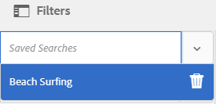

# Verzamelingen beheren {#managing-collections}

| Versie | Artikelkoppeling |
| -------- | ---------------------------- |
| AEM as a Cloud Service | [ klik hier ](https://experienceleague.adobe.com/docs/experience-manager-cloud-service/content/assets/manage/manage-collections.html?lang=en) |
| AEM 6,5 | Dit artikel |

Een verzameling is een set elementen binnen [!DNL Adobe Experience Manager Assets] . Gebruik verzamelingen om elementen tussen gebruikers te delen. De set kan een statische verzameling of een dynamische verzameling zijn die is gebaseerd op zoekresultaten.

In tegenstelling tot mappen kan een verzameling elementen van verschillende locaties bevatten. U kunt verzamelingen delen met verschillende gebruikers waaraan verschillende niveaus van bevoegdheden zijn toegewezen, zoals weergeven, bewerken, enzovoort.

U kunt meerdere verzamelingen delen met een gebruiker. Elke verzameling bevat verwijzingen naar elementen. De referentiële integriteit van activa wordt gehandhaafd over inzamelingen.

De inzamelingen zijn van de volgende types, die op de manier worden gebaseerd zij activa sorteren:

* Een verzameling die een statische referentielijst met elementen, mappen en andere verzamelingen bevat.

* Een slimme verzameling die dynamisch elementen bevat op basis van zoekcriteria.

## Toegang tot de verzamelingsconsole {#navigating-the-collections-console}

Ga in de interface van [!DNL Experience Manager] naar **[!UICONTROL Assets]** > **[!UICONTROL Collections]** om **[!UICONTROL Collections]** te openen.

## Een verzameling maken {#creating-a-collection}

U kunt een inzameling of met [ statische verwijzingen ](#creating-a-collection-with-static-references) tot stand brengen of op a [ onderzoek op criteria-gebaseerde filter ](#creating-a-smart-collection) worden gebaseerd. U kunt ook een verzameling maken van een lichtbak.

### Een verzameling met statische verwijzingen maken {#creating-a-collection-with-static-references}

U kunt een verzameling maken met statische verwijzingen, bijvoorbeeld een verzameling met verwijzingen naar elementen, mappen, verzamelingen, centrifuges en afbeeldingssets.

1. Navigeer naar de **[!UICONTROL Collections]** -console.
1. Klik **[!UICONTROL Create]** op de werkbalk.
1. Voer op de pagina **[!UICONTROL Create Collection]** een titel en een optionele beschrijving in voor de verzameling.
1. Voeg leden toe aan de verzameling en wijs de juiste machtigingen toe. U kunt ook **[!UICONTROL Public Collection]** selecteren om alle gebruikers toegang te geven tot de verzameling.

   >[!NOTE]
   >
   >Als u wilt dat leden verzamelingen kunnen delen met andere gebruikers, geeft u de `dam-users` groep leesmachtigingen op het pad `home/users` . Geef gebruikers toestemming op de locatie `/content/dam/collections` om de verzamelingen in pop-uplijsten weer te geven. U kunt de gebruiker ook deel laten uitmaken van een `dam-users` -groep.

1. (Optioneel) Voeg een miniatuurafbeelding toe voor de verzameling.
1. Klik op **[!UICONTROL Create]** en vervolgens op **[!UICONTROL OK]** om het dialoogvenster te sluiten. Een verzameling met de opgegeven titel en eigenschappen wordt geopend in de console voor verzamelingen.

   >[!NOTE]
   >
   >Met [!DNL Experience Manager Assets] kunt u revisietaken voor een verzameling maken, net als bij het maken van revisietaken voor een map met elementen.

   Als u elementen aan de verzameling wilt toevoegen, navigeert u naar de gebruikersinterface van [!DNL Assets] . Voor details, zie [ activa aan een inzameling ](#adding-assets-to-a-collection) toevoegen.

### Verzamelingen maken met dropzone {#create-collections-using-dropzone}

U kunt elementen vanuit de gebruikersinterface van [!DNL Assets] naar een verzameling slepen. U kunt ook een kopie van een verzameling maken en de elementen daar slepen.

1. Selecteer in de gebruikersinterface van [!DNL Assets] de elementen die u aan een verzameling wilt toevoegen.
1. Sleep de elementen naar de **[!UICONTROL Drop in Collection]** -zone. U kunt ook op **[!UICONTROL To Collection]** op de werkbalk klikken.

   

1. Klik op de werkbalk van de pagina **[!UICONTROL Add To Collection]** op **[!UICONTROL Create Collection]** .

   Als u de elementen aan een bestaande verzameling wilt toevoegen, selecteert u deze op de pagina en klikt u op **[!UICONTROL Add]** . Standaard wordt de laatst bijgewerkte verzameling geselecteerd.

1. Geef in het dialoogvenster **[!UICONTROL Create New Collection]** een naam op voor de verzameling. Selecteer **[!UICONTROL Public Collection]** als u de verzameling toegankelijk wilt maken voor alle gebruikers.
1. Klik op **[!UICONTROL Continue]** om de verzameling te maken.

### Een slimme verzameling maken {#creating-a-smart-collection}

Een slimme verzameling gebruikt zoekcriteria om elementen dynamisch te vullen. U kunt een slimme verzameling alleen maken met behulp van bestanden, niet met mappen of bestanden en mappen.

Voer de volgende stappen uit om een slimme verzameling te maken:

1. Navigeer naar de gebruikersinterface van [!DNL Assets] en klik op Zoeken.

1. Typ het trefwoord in het vak Zoeken en selecteer `Enter` . Open het deelvenster Filters en pas een zoekfilter toe.

1. Selecteer in de lijst **[!UICONTROL Files & Folders]** de optie **[!UICONTROL Files]** .

   

1. Klik op **[!UICONTROL Save Smart Collection]**.

1. Geef een naam op voor de verzameling. Selecteer **[!UICONTROL Public]** om de groep DAM-gebruikers met de Viewer-rol toe te voegen aan de slimme verzameling.

   

   >[!NOTE]
   >
   >Als u **[!UICONTROL Public]** selecteert, wordt de slimme verzameling beschikbaar voor iedereen met de eigenaarrol nadat u deze hebt gemaakt. Als u de optie **[!UICONTROL Public]** annuleert, wordt de DAM-gebruikersgroep niet meer gekoppeld aan de slimme verzameling.

1. Klik op **[!UICONTROL Save]** om de slimme verzameling te maken en sluit vervolgens het berichtvenster om het proces te voltooien.

   De nieuwe slimme verzameling wordt ook toegevoegd aan de lijst **[!UICONTROL Saved Searches]** .

   

   Het label van de optie **[!UICONTROL Create Smart Selection]** verandert in **[!UICONTROL Edit Smart Selection]** . Als u de instellingen van de slimme verzameling wilt bewerken, selecteert u **[!UICONTROL Files]** in de lijst **[!UICONTROL Files & Folders]**. Klik **[!UICONTROL Edit Smart Selection]** .

## Elementen toevoegen aan een verzameling {#adding-assets-to-a-collection}

U kunt elementen toevoegen aan een verzameling die een lijst met bestanden of mappen waarnaar wordt verwezen, bevat. Slimme verzamelingen gebruiken een zoekquery om elementen te vullen. Daarom zijn statische verwijzingen naar elementen en mappen niet op hen van toepassing.

1. In het [!DNL A] bezit gebruikersinterface, selecteer de activa en klik **[!UICONTROL To Collection]**  van de toolbar.
U kunt het element ook naar het **[!UICONTROL Drop in Collection]** -gebied op de interface slepen. Voeg de elementen toe wanneer het label van het gebied verandert in **[!UICONTROL Drop to Add]** .

1. Selecteer op de pagina **[!UICONTROL Add To Collection]** de verzameling waaraan u het element wilt toevoegen.

1. Klik op **[!UICONTROL Add]** en sluit het bevestigingsbericht. Het element wordt toegevoegd aan de collectie.

## Een slimme verzameling bewerken {#editing-a-smart-collection}

De slimme inzamelingen worden gebouwd door een onderzoek te bewaren zodat kunt u hun inhoud veranderen door de onderzoeksparameters van het [ bewaarde onderzoek ](#saved-searches) te wijzigen.

1. In het [!DNL Assets] gebruikersinterface, klik de 1&rbrace; onderzoeksoptie van de onderzoeksoptie  van de toolbar.
1. Selecteer de `Return` -toets terwijl de cursor in het vak Onderzoek staat.
1. Open in de interface [!DNL Experience Manager] het deelvenster Filters.
1. Selecteer in de lijst met **[!UICONTROL Saved Searches]** de slimme verzameling die u wilt wijzigen. In het deelvenster Zoeken worden de filters weergegeven die zijn geconfigureerd voor de opgeslagen zoekopdracht.

   

1. Selecteer in de lijst **[!UICONTROL Files & Folders]** de optie **[!UICONTROL Files]** .
1. Wijzig desgewenst een of meer filters. Klik op **[!UICONTROL Edit Smart Collection]**.

   U kunt ook de naam van de slimme verzameling bewerken.

    uit

1. Klik op **[!UICONTROL Save]**. Het dialoogvenster **[!UICONTROL Edit Smart Collection]** wordt weergegeven.
1. Klik op **[!UICONTROL Overwrite]** om de originele slimme verzameling te vervangen door de bewerkte verzameling. U kunt ook **[!UICONTROL Save As]** selecteren om de bewerkte verzameling afzonderlijk op te slaan.
1. Klik in het bevestigingsdialoogvenster op **[!UICONTROL Save]** om het proces te voltooien.

## Metagegevens van verzamelingen weergeven en bewerken {#view-edit-collection-metadata}

De meta-gegevens van de inzameling omvat gegevens over de inzameling, met inbegrip van om het even welke markeringen die worden toegevoegd.

1. Selecteer in de [!UICONTROL Collections] -console een verzameling en klik op **[!UICONTROL Properties]** op de werkbalk.
1. Bekijk de metagegevens voor verzamelingen op de tabbladen **[!UICONTROL Basic]** en **[!UICONTROL Advanced]** op de pagina **[!UICONTROL Collection Metadata]** .
1. Wijzig desgewenst de metagegevens. Klik op **[!UICONTROL Save & Close]** op de werkbalk om de wijzigingen op te slaan.

## Metagegevens van meerdere verzamelingen bulksgewijs bewerken {#editing-collection-metadata-in-bulk}

U kunt de metagegevens van meerdere verzamelingen tegelijk bewerken. Deze functionaliteit helpt u snel gemeenschappelijke meta-gegevens in veelvoudige inzamelingen te herhalen.

1. Selecteer twee of meer verzamelingen in de verzamelingsconsole.
1. Klik **[!UICONTROL Properties]** op de werkbalk.
1. Bewerk desgewenst de metadata op de pagina **[!UICONTROL Collection Metadata]** onder de tabbladen **[!UICONTROL Basic]** en **[!UICONTROL Advanced]**.
1. Als u de eigenschappen van metagegevens voor een specifieke verzameling wilt weergeven, annuleert u de selectie van de resterende verzamelingen in de lijst met verzamelingen. De gebieden van de meta-gegevensredacteur zijn bevolkt met de meta-gegevens voor de bepaalde inzameling.

   >[!NOTE]
   >
   >* Op de pagina [!UICONTROL Properties] kunt u verzamelingen uit de lijst met verzamelingen verwijderen door de selectie te annuleren. Alle verzamelingen zijn standaard geselecteerd in de lijst met verzamelingen. [!DNL Experience Manager] werkt de metagegevens van de verzamelingen die u verwijdert niet bij.
   >* Selecteer boven aan de lijst het selectievakje bij **[!UICONTROL Title]** om te schakelen tussen het selecteren van de verzamelingen en het wissen van de lijst.

1. Klik op **[!UICONTROL Save & Close]** op de werkbalk en sluit het bevestigingsvenster.
1. Selecteer **[!UICONTROL Append mode]** om de nieuwe metadata toe te voegen aan de bestaande metadata. Als u deze optie niet selecteert, worden de bestaande metadata in de velden vervangen door de nieuwe metadata. Klik op **[!UICONTROL Submit]**.

   >[!NOTE]
   >
   >De metagegevens die u voor de geselecteerde verzamelingen toevoegt, overschrijven de vorige metagegevens voor deze verzamelingen. Gebruik [!UICONTROL Append mode] om nieuwe waarden toe te voegen aan de bestaande metagegevens in de velden die meerdere waarden kunnen bevatten. Velden met één waarde worden altijd overschreven. Alle tags die u toevoegt in het veld [!UICONTROL Tags] , worden toegevoegd aan de bestaande lijst met tags in de metagegevens.

Gebruik de Schema-editor om de pagina met metagegevens [!UICONTROL Properties] aan te passen, zoals eigenschappen van metagegevens toevoegen, wijzigen of verwijderen.

>[!TIP]
>
>De bulkbewerkingsmethode werkt voor elementen die beschikbaar zijn in een verzameling. Voor de activa die over omslagen beschikbaar zijn of een gemeenschappelijke criteria aanpassen, is het mogelijk aan [ bulkupdate de meta-gegevens na het zoeken ](/help/assets/search-assets.md#metadataupdates).

## Verzamelingen zoeken {#searching-collections}

U kunt inzamelingen van de console van Inzamelingen zoeken. Wanneer u met trefwoorden in het vak Zoeken zoekt, zoekt [!DNL Assets] naar namen van verzamelingen, metagegevens en de tags die aan de verzamelingen zijn toegevoegd.

Als u naar inzamelingen van top-level zoekt, slechts zijn de individuele inzamelingen teruggekeerd in onderzoeksresultaten. [!DNL Assets] of mappen in de verzamelingen worden uitgesloten. In alle andere gevallen (bijvoorbeeld in een afzonderlijke verzameling of in een mappenhiërarchie) worden alle relevante elementen, mappen en verzamelingen geretourneerd.

## Zoeken in verzamelingen {#searching-within-collections}

Klik in de console Verzamelingen op een verzameling om deze te openen.

In een verzameling is het zoeken in [!DNL Experience Manager] beperkt tot elementen (en de bijbehorende tags en metagegevens) in de verzameling die u bekijkt. Wanneer u in een map zoekt, worden alle overeenkomende elementen en onderliggende mappen in de huidige map geretourneerd. Wanneer u in een verzameling zoekt, worden alleen overeenkomende elementen, mappen en andere verzamelingen geretourneerd die directe leden van de verzameling zijn.

## Verzamelingsinstellingen bewerken {#editing-collection-settings}

U kunt verzamelingsinstellingen bewerken, zoals titel en beschrijving, of leden toevoegen aan een verzameling.

1. Selecteer een verzameling en klik op **[!UICONTROL Settings]** op de werkbalk. U kunt ook de handeling **[!UICONTROL Settings]** quick uit de verzamelingsminiatuur gebruiken.
1. Wijzig de verzamelingsinstellingen op de pagina **[!UICONTROL Collection Settings]**. Bijvoorbeeld, wijzig de inzamelingstitel, beschrijvingen, leden, en toestemmingen zoals besproken in [ Toevoegend Verzamelingen ](#creating-a-collection).

1. Klik op **[!UICONTROL Save]** om de wijzigingen op te slaan.

## Een verzameling verwijderen {#deleting-a-collection}

1. Selecteer een of meer verzamelingen in de console Verzamelingen en klik op Verwijderen op de werkbalk.

1. Klik in het dialoogvenster op **[!UICONTROL Delete]** om de verwijderactie te bevestigen.

   >[!NOTE]
   >
   >U kunt slimme inzamelingen ook schrappen door [ bewaarde onderzoeken ](#saved-searches) te schrappen.

## Een verzameling downloaden {#downloading-a-collection}

Wanneer u een verzameling downloadt, wordt de volledige hiërarchie van elementen in de verzameling gedownload, inclusief mappen en onderliggende verzamelingen.

1. Selecteer een of meer verzamelingen die u wilt downloaden in de console Verzamelingen.
1. Klik **[!UICONTROL Download]** op de werkbalk.
1. Klik in het dialoogvenster **[!UICONTROL Download]** op **[!UICONTROL Download]** . Selecteer **[!UICONTROL Renditions]** als u de uitvoeringen van de elementen in de verzameling wilt downloaden. Selecteer de optie **[!UICONTROL Email]** om een e-mailbericht te verzenden naar de eigenaar van de verzameling.

   Wanneer u een verzameling selecteert die u wilt downloaden, wordt de volledige maphiërarchie onder de verzameling gedownload. Selecteer **[!UICONTROL Create separate folder for each asset]** als u elke verzameling die u downloadt, wilt opnemen (inclusief elementen in onderliggende verzamelingen die onder de bovenliggende verzameling zijn genest) in een afzonderlijke map.

## Geneste verzamelingen maken {#creating-nested-collections}

U kunt een verzameling toevoegen aan een andere verzameling, zodat u een geneste verzameling maakt.

1. Selecteer in de verzamelingsconsole de gewenste verzameling of groep verzamelingen en klik op **[!UICONTROL To Collection]** op de werkbalk.

1. Selecteer op de pagina **[!UICONTROL Add To Collection]** de verzameling waarin u de verzameling wilt toevoegen.

   >[!NOTE]
   >
   >De verzameling die het laatst is bijgewerkt, is standaard geselecteerd op de pagina **[!UICONTROL Add To Collection]** .

1. Klik op **[!UICONTROL Add]**. Een bericht bevestigt dat de verzameling wordt toegevoegd aan de doelverzameling op de pagina **[!UICONTROL Select Destination]** . Sluit het bericht om het proces te voltooien.

>[!NOTE]
>
>Slimme verzamelingen kunnen niet worden genest. Met andere woorden, slimme verzamelingen kunnen geen andere verzameling bevatten.

## Opgeslagen zoekopdrachten {#saved-searches}

In de gebruikersinterface van [!DNL Assets] kunt u elementen zoeken of filteren op basis van bepaalde regels, zoekcriteria of aangepaste zoekfacetten. Als u deze opslaat als **[!UICONTROL Saved Searches]**, kunt u ze later openen vanuit de lijst **[!UICONTROL Saved Searches]** in het deelvenster Filteren. Als u een opgeslagen zoekopdracht maakt, wordt ook een slimme verzameling gemaakt.

Opgeslagen zoekopdrachten worden gemaakt wanneer u een slimme verzameling maakt. Slimme verzamelingen worden automatisch toegevoegd aan de lijst met **[!UICONTROL Saved Searches]**. De query [!UICONTROL Saved Searches] voor de verzameling wordt opgeslagen in de eigenschap `dam:query` in CRXDE op de relatieve locatie `/content/dam/collections/` . Er gelden geen limieten voor de zoekopdrachten die u kunt opslaan en voor de opgeslagen zoekopdrachten die in de lijst worden weergegeven.

>[!NOTE]
>
>U kunt slimme verzamelingen op dezelfde manier delen als statische verzamelingen.

Opgeslagen zoekopdrachten bewerken is hetzelfde als slimme verzamelingen bewerken. Voor details, zie [ een slimme inzameling ](#editing-a-smart-collection) uitgeven.

Voer de volgende stappen uit om opgeslagen zoekopdrachten te verwijderen:

1. In het [!DNL Assets] gebruikersinterface, klik onderzoek .
1. Selecteer de `Return` -toets terwijl de cursor zich in het veld Onderzoek bevindt.
1. Open in de interface [!DNL Experience Manager] het deelvenster Filters.
1. Klik in de lijst **[!UICONTROL Saved Searches]** op **[!UICONTROL Delete]** naast de slimme verzameling die u wilt verwijderen.

   

1. Klik in het dialoogvenster op **[!UICONTROL Delete]** om de opgeslagen zoekopdracht te verwijderen.

## Een workflow op een verzameling uitvoeren {#running-a-workflow-on-a-collection}

U kunt een workflow voor de elementen in een verzameling uitvoeren. Als de verzameling geneste verzamelingen bevat, wordt de workflow ook uitgevoerd op de elementen in de geneste verzamelingen. Als de verzameling en de geneste verzameling echter dubbele elementen bevatten, wordt de workflow slechts eenmaal uitgevoerd voor dergelijke elementen.

1. Open **[!UICONTROL Assets]** > **[!UICONTROL Collections]** . Selecteer een specifieke verzameling als u een workflow op die verzameling wilt uitvoeren.
1. Open **[!UICONTROL Timeline]** rail. Klik  en klik **[!UICONTROL Start Workflow]**.
1. Selecteer in de sectie **[!UICONTROL Start Workflow]** een workflowmodel in de lijst. Selecteer bijvoorbeeld het model **[!UICONTROL DAM Update Asset]** .
1. Voer een titel in voor de workflow en klik op **[!UICONTROL Start]** .
1. Klik in het dialoogvenster op **[!UICONTROL Proceed]** . De workflow verwerkt alle elementen in de geselecteerde verzameling.

>[!MORELIKETHIS]
>
>* [ vorm Experience Manager Assets e-mailberichten ](/help/sites-administering/notification.md#assetsconfig)
>* [ creeer een overzichtstaak voor Inzamelingen ](bulk-approval.md)
