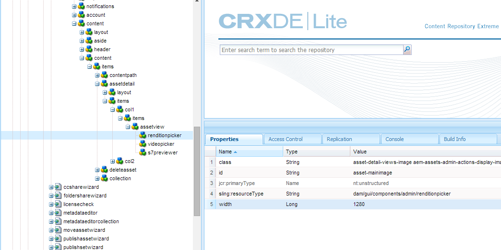
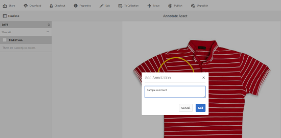

# Uw digitale middelen beheren {#manage-digital-assets}

In [!DNL Adobe Experience Manager Assets] kunt u meer doen dan alleen uw elementen opslaan en beheren. [!DNL Experience Manager] biedt mogelijkheden voor middelenbeheer op bedrijfsniveau. U kunt elementen bewerken en delen, geavanceerde zoekopdrachten uitvoeren, meerdere uitvoeringen van tientallen ondersteunde bestandsindelingen maken, versies en digitale rechten beheren, de verwerking van elementen automatiseren, metagegevens beheren en besturen, samenwerken met annotaties en nog veel meer.

In dit artikel worden de basistaken voor middelenbeheer beschreven, zoals het maken of uploaden van bedrijfsmiddelen. updates van metagegevens; kopiëren, verplaatsen en verwijderen; publiceert, publiceert en doorzoekt elementen. Zie [Aan de slag met de gebruikersinterface](/help/sites-authoring/basic-handling.md)voor elementen om de gebruikersinterface te begrijpen. Zie [Inhoud-fragmenten](/help/assets/content-fragments/content-fragments-managing.md) beheren voor informatie over het beheren van inhoudsfragmenten.

## Mappen maken {#creating-folders}

Wanneer u een verzameling elementen indeelt, bijvoorbeeld alle `Nature` afbeeldingen, kunt u mappen maken om ze bij elkaar te houden. U kunt mappen gebruiken om uw elementen te categoriseren en in te delen. [!DNL Experience Manager Assets] vereist niet dat u elementen in mappen ordent om beter te werken.

>[!NOTE]
>
>* Het delen van een [!DNL Assets] map van het type `sling:OrderedFolder` wordt niet ondersteund bij het delen naar de Marketing Cloud. Als u een map wilt delen, selecteert u deze niet [!UICONTROL Ordered] wanneer u een map maakt.
>* [!DNL Experience Manager] staat het gebruik van `subassets` woord als naam van een map niet toe. Het is een gereserveerd sleutelwoord voor knoop die subassets voor samengestelde activa bevatten.

1. Navigeer naar de plaats in de map met digitale elementen waar u een nieuwe map wilt maken. In the menu, click **[!UICONTROL Create]**. Selecteer **[!UICONTROL New Folder]**.
1. Geef in het **[!UICONTROL Title]** veld een mapnaam op. Standaard gebruikt DAM de titel die u als mapnaam hebt opgegeven. Nadat de map is gemaakt, kunt u de standaardinstelling overschrijven en een andere mapnaam opgeven.
1. Klik op **[!UICONTROL Create]**. De map wordt weergegeven in de map met digitale middelen.

De volgende tekens (lijst met door spaties gescheiden tekens) worden niet ondersteund:

* De naam van een elementbestand mag geen van de volgende tekens bevatten: `* / : [ \\ ] | # % { } ? &`
* De naam van een elementmap mag geen van de volgende tekens bevatten: `* / : [ \\ ] | # % { } ? \" . ^ ; + & \t`

Voeg geen speciale tekens toe aan de extensies van de bestandsnamen van elementen.

## Elementen uploaden {#uploading-assets}

<!-- TBD the following:
Move this section into a new article. CQDOC-14874 ticket is created for this.
In this complete article, replace emphasis with UICONTROL where appropriate.
-->

U kunt verschillende typen elementen (zoals afbeeldingen, PDF-bestanden, RAW-bestanden, enzovoort) uploaden van uw lokale map of een netwerkstation naar [!DNL Experience Manager Assets].

>[!NOTE]
>
>In de modus Dynamische media - Scene7 kunt u alleen elementen uploaden waarvan de bestandsgrootte 2 GB of minder is.

U kunt ervoor kiezen elementen te uploaden naar mappen waaraan al dan niet een verwerkingsprofiel is toegewezen.

Voor mappen waaraan een verwerkingsprofiel is toegewezen, wordt de profielnaam weergegeven op de miniatuur in de kaartweergave. In de lijstweergave wordt de profielnaam weergegeven in de kolom **Verwerkingsprofiel** . Zie [Profielen](/help/assets/processing-profiles.md)verwerken.

Voordat u een element uploadt, moet u ervoor zorgen dat dit een [indeling](/help/assets/assets-formats.md) heeft die [!DNL Experience Manager Assets] ondersteuning biedt.

1. Navigeer in de [!DNL Assets] gebruikersinterface naar de locatie waar u digitale elementen wilt toevoegen.
1. Voer een van de volgende handelingen uit om de elementen te uploaden:

   * On the toolbar, click **[!UICONTROL Create]**. Then on the menu, click **[!UICONTROL Files]**. U kunt de naam van het bestand desgewenst wijzigen in het dialoogvenster dat verschijnt.
   * In een browser die HTML5 ondersteunt, sleept u de elementen rechtstreeks naar de [!DNL Assets] gebruikersinterface. Het dialoogvenster voor het wijzigen van de naam van het bestand wordt niet weergegeven.

   

   Als u meerdere bestanden wilt selecteren, drukt u op Ctrl of Command en selecteert u de elementen in het dialoogvenster Bestandenkiezer. Als u een iPad gebruikt, kunt u slechts één bestand tegelijk selecteren.

   U kunt het uploaden van grote elementen (groter dan 500 MB) pauzeren en later vanaf dezelfde pagina hervatten. Klik **[!UICONTROL Pause]** naast de voortgangsbalk die wordt weergegeven wanneer het uploaden start.

   

De omvang waarboven een actief als een groot actief wordt beschouwd, kan worden geconfigureerd. U kunt het systeem bijvoorbeeld zodanig configureren dat elementen boven 1000 MB (in plaats van 500 MB) als grote elementen worden beschouwd. In dit geval wordt op de voortgangsbalk **[!UICONTROL Pause]** weergegeven wanneer bestanden van meer dan 1000 MB worden geüpload.

De knop Pauzeren wordt niet weergegeven als een bestand van meer dan 1000 MB wordt geüpload met een bestand van minder dan 1000 MB. Als u echter het uploaden van bestanden met minder dan 1000 MB annuleert, wordt de **[!UICONTROL Pause]** knop weergegeven.

Om de groottegrens te wijzigen, vorm het `chunkUploadMinFileSize` bezit van de `fileupload`knoop in de bewaarplaats CRX.

Wanneer u klikt, schakelt **[!UICONTROL Pause]** u over naar de **[!UICONTROL Play]** optie. Klik op **[!UICONTROL Play]** om het uploaden te hervatten.

Als u een actieve upload wilt annuleren, klikt u op Sluiten (`X`) naast de voortgangsbalk. Wanneer u het uploaden annuleert, [!DNL Assets] verwijdert u het gedeeltelijk geüploade gedeelte van het element.

De mogelijkheid om het uploaden te hervatten is vooral handig in scenario&#39;s met lage bandbreedte en netwerkstoringen, waarbij het uploaden van een groot element veel tijd in beslag neemt. U kunt het uploaden pauzeren en verdergaan wanneer de situatie verbetert. Wanneer u het document hervat, begint het uploaden vanaf het punt waarop u het hebt gepauzeerd.

Tijdens het uploaden worden de delen van het element dat wordt geüpload als stukjes gegevens opgeslagen in de CRX-opslagplaats. [!DNL Experience Manager] Wanneer het uploaden is voltooid, [!DNL Experience Manager] worden deze fragmenten samengevoegd tot één gegevensblok in de gegevensopslagruimte.

Ga naar om de opschoningstaak voor de onvoltooide taken voor het uploaden van taken te configureren. `https://[aem_server]:[port]/system/console/configMgr/org.apache.sling.servlets.post.impl.helper.ChunkCleanUpTask`

>[!CAUTION]
>
>De standaardwaarde wanneer de brokkenupload wordt teweeggebracht is 500 MB en de brokgrootte is 50 MB. Als u de [Apache Jackrabbit Oak TokenConfiguration](https://helpx.adobe.com/experience-manager/kb/How-to-set-token-session-expiration-AEM.html) zodanig wijzigt dat deze minder lang `timeout configuration` is dan de tijd die het uploaden van een element kost, kunt u een sessietime-outsituatie doorlopen terwijl het uploaden van het element bezig is. U, daarom, moet u veranderen `chunkUploadMinFileSize` en `chunksize`, zodat elke brokkenverzoek de zitting vernieuwt.
>
>Op basis van de time-out bij verlopen van de referentie, de latentie, de bandbreedte en de verwachte gelijktijdige uploads, wordt de hoogste waarde gekozen waarmee u ervoor kunt zorgen dat het volgende wordt gekozen:
>
>* Om ervoor te zorgen dat het uploaden van brokken is ingeschakeld voor bestanden met grootten die tijdens het uploaden waarschijnlijk resulteren in een vervaldatum van de referentie.
   >
   >
* Om ervoor te zorgen dat elk segment eindigt alvorens de referentie verloopt.

Als u een element uploadt met dezelfde naam als een element dat al beschikbaar is op de locatie waar u het element uploadt, wordt een waarschuwingsvenster weergegeven.

U kunt een bestaand element vervangen, een andere versie maken of beide behouden door de naam van het nieuwe element dat wordt geüpload te wijzigen. Als u een bestaand element vervangt, worden de metagegevens voor het element en eventuele eerdere wijzigingen (bijvoorbeeld notities aanbrengen of uitsnijden) die u in het bestaande element hebt aangebracht, verwijderd. Als u ervoor kiest om beide elementen te behouden, wordt de naam van het nieuwe element gewijzigd in een nummer dat aan de naam wordt toegevoegd. `1`

>[!NOTE]
>
>Wanneer u **[!UICONTROL Replace]** in het [!UICONTROL Name Conflict] dialoogvenster selecteert, wordt de element-id opnieuw gegenereerd voor het nieuwe element. Deze id verschilt van de id van het vorige element.
>
>Als Asset Insights is ingeschakeld voor het bijhouden van indrukken/klikken met Adobe Analytics, maakt de opnieuw gegenereerde asset-id de vastgelegde gegevens voor het element op Analytics ongeldig.

Als het element dat u uploadt aanwezig is in [!DNL Assets], wordt in het **[!UICONTROL Duplicates Detected]** dialoogvenster gewaarschuwd dat u probeert een gedupliceerd element te uploaden. Het dialoogvenster wordt alleen weergegeven als de waarde van de `SHA 1` controlesom van het binaire element van het bestaande element overeenkomt met de waarde van de controlesom van het element dat u uploadt. In dit geval zijn de namen van elementen niet van belang.

>[!NOTE]
>
>Het [!UICONTROL Duplicates Detected] dialoogvenster wordt alleen weergegeven wanneer de functie voor dubbele detectie is ingeschakeld. Zie Dubbele detectie [inschakelen als u de functie voor dubbele detectie wilt inschakelen](/help/assets/duplicate-detection.md).

Als u het gedupliceerde element wilt behouden in [!DNL Assets], klikt u **[!UICONTROL Keep]**. Als u het geüploade dubbele element wilt verwijderen, klikt u op **[!UICONTROL Delete]**.

[!DNL Experience Manager Assets] Hiermee voorkomt u dat elementen met de verboden tekens in de bestandsnaam worden geüpload. Als u een element probeert te uploaden met een bestandsnaam die een niet-toegestaan teken of meer bevat, wordt een waarschuwingsbericht weergegeven en wordt het uploaden gestopt totdat u deze tekens verwijdert of uploadt met een toegestane naam. [!DNL Assets]

In het [!UICONTROL Upload Assets] dialoogvenster kunt u lange namen opgeven voor de bestanden die u uploadt, zodat deze passen bij specifieke naamconventies voor bestanden voor uw organisatie.

De volgende tekens (lijst met door spaties gescheiden tekens) worden echter niet ondersteund:

* de naam van het elementbestand mag geen elementen bevatten `* / : [ \\ ] | # % { } ? &`
* de naam van de elementenmap mag niet bevatten `* / : [ \\ ] | # % { } ? \" . ^ ; + & \t`

Voeg geen speciale tekens toe aan de extensies van de bestandsnamen van elementen.

Bovendien wordt in de [!DNL Assets] gebruikersinterface het element weergegeven dat u het laatst hebt geüpload of de map die u het eerst hebt gemaakt.

Als u het uploaden annuleert voordat de bestanden zijn geüpload, [!DNL Assets] stopt u met het uploaden van het huidige bestand en vernieuwt u de inhoud. Bestanden die al zijn geüpload, worden echter niet verwijderd.

In het dialoogvenster Uploadvoortgang in [!DNL Assets] worden het aantal geüploade bestanden en de bestanden weergegeven die niet zijn geüpload.

### Seriële uploads {#serialuploads}

Het uploaden van talrijke activa in bulk verbruikt significante I/O middelen, die de prestaties van uw [!DNL Assets] plaatsing kunnen negatief beïnvloeden. Met name als u een trage internetverbinding hebt, neemt de uploadtijd drastisch toe als gevolg van een spiek in schijf-I/O. Bovendien kan uw webbrowser extra beperkingen instellen voor het aantal aanvragen van POSTEN dat kan worden afgehandeld voor gelijktijdige uploads van middelen. [!DNL Assets] Hierdoor mislukt de uploadbewerking of wordt deze voortijdig beëindigd. Met andere woorden, sommige bestanden kunnen [!DNL Experience Manager Assets] worden overgeslagen terwijl u een aantal bestanden opneemt of ze kunnen helemaal geen bestand opnemen.

Om deze situatie te verhelpen, [!DNL Assets] neemt één activa tegelijkertijd (periodieke upload) tijdens een bulkupload verrichting op, in plaats van het tegelijkertijd opnemen van alle activa.

Seriële uploaden van elementen is standaard ingeschakeld. Als u de functie wilt uitschakelen en tegelijkertijd uploaden wilt toestaan, bedekt u het `fileupload` knooppunt in Crx-de en stelt u de waarde van de `parallelUploads` eigenschap in op `true`.

### Elementen uploaden met FTP {#uploading-assets-using-ftp}

Met Dynamic Media kunt u via de FTP-server items in batches uploaden. Als u grote bestanden (>1 GB) wilt uploaden of volledige mappen en submappen wilt uploaden, moet u FTP gebruiken. U kunt zelfs instellen dat FTP-upload wordt uitgevoerd op een terugkerende geplande basis.

>[!NOTE]
>
>In de modus Dynamische media - Scene7 kunt u alleen elementen uploaden waarvan de bestandsgrootte 2 GB of minder is.

>[!NOTE]
>
>Als u elementen wilt uploaden via FTP in de modus Dynamic Media - Scene7, installeert u Feature Pack 18912 op de [!DNL Experience Manager] auteur. Neem contact op met de klantenservice [van](https://helpx.adobe.com/nl/contact/enterprise-support.ec.html) Adobe om toegang te krijgen tot FP-18912 en de installatie van uw FTP-account te voltooien. Zie [Install feature pack 18912 voor de migratie](/help/assets/bulk-ingest-migrate.md)van bulkmiddelen voor meer informatie.
>
>Als u FTP gebruikt om elementen te uploaden, worden de opgegeven uploadinstellingen genegeerd. [!DNL Experience Manager] In plaats daarvan worden de regels voor bestandsverwerking gebruikt, zoals gedefinieerd in Dynamic Media Classic.

**Elementen uploaden met FTP**

1. Meld u met uw keuze voor een FTP-client aan bij de FTP-server met de FTP-gebruikersnaam en -wachtwoord die u van de e-mail met de provisioning hebt ontvangen. Upload in de FTP-client bestanden of mappen naar de FTP-server.
1. [Meld u aan bij Dynamic Media Classic](https://www.adobe.com/marketing-cloud/experience-manager/scene7-login.html) met gebruikersgegevens die zijn ontvangen van de e-mail met provisioning. Klik op de algemene navigatiebalk **[!UICONTROL Upload]**.

1. Klik op de pagina Uploaden in de linkerbovenhoek op het **[!UICONTROL Via FTP]** tabblad.
1. Kies links op de pagina een FTP-map waaruit u bestanden wilt uploaden. aan de rechterkant van de pagina kiest u een doelmap.
1. Klik in de rechterbenedenhoek van de pagina **[!UICONTROL Job Options]** en stel de gewenste opties in op basis van de elementen in de map die u hebt geselecteerd.

   Zie Taakopties [uploaden](#upload-job-options).

   >[!NOTE]
   >
   >Wanneer u elementen uploadt via FTP, hebben de opties voor uploadtaken die u instelt in Dynamic Media Classic (S7) voorrang op de parameters voor elementverwerking die zijn ingesteld in [!DNL Experience Manager].

1. Klik in de rechterbenedenhoek van het dialoogvenster Taakopties uploaden op **[!UICONTROL Save]**.
1. In the lower-right corner of the Upload page, click **[!UICONTROL Submit Upload]**.

   Klik op de algemene navigatiebalk om de voortgang van het uploaden weer te geven. **[!UICONTROL Jobs]**. Op de pagina Taken wordt de voortgang van het uploaden weergegeven. U kunt binnen blijven werken [!DNL Experience Manager] en aan de pagina van Banen in Dynamische Klassiek van Media op elk ogenblik terugkeren om een lopende baan te herzien.
Als u een uploadtaak die wordt uitgevoerd wilt annuleren, klikt u **[!UICONTROL Cancel]** naast de duur.

#### Opties voor uploaden {#upload-job-options}

| Uploaden, optie | Suboptie | Beschrijving |
|---|---|---|
| Taaknaam |  | De standaardnaam die vooraf in het tekstveld is ingevuld, bevat het door de gebruiker ingevoerde gedeelte van de naam en de datum- en tijdstempel. U kunt de standaardnaam gebruiken of een naam invoeren van uw eigen ontwerp voor deze uploadtaak.  De baan en andere upload en het publiceren banen worden geregistreerd op de pagina van Banen, waar u de status van banen kunt controleren. |
| Publiceren na uploaden |  | Hiermee publiceert u automatisch de elementen die u uploadt. |
| Overschrijven in een willekeurige map, dezelfde naam van basiselement, ongeacht de extensie |  | Selecteer deze optie als u wilt dat de bestanden die u uploadt, bestaande bestanden met dezelfde naam vervangen. De naam van deze optie kan verschillen, afhankelijk van de instellingen in **[!UICONTROL Application Setup]** > **[!UICONTROL General Settings]** > **[!UICONTROL Upload to Application]** > **[!UICONTROL Overwrite Images]**. |
| ZIP- of Tar-bestanden bij uploaden decomprimeren |  |  |
| Taakopties |  | Klik **[!UICONTROL Job Options]** om het [!UICONTROL Upload Job Options] dialoogvenster te openen en kies opties die de volledige uploadtaak beïnvloeden. Deze opties zijn hetzelfde voor alle bestandstypen. U kunt standaardopties kiezen voor het uploaden van bestanden die beginnen op de pagina Algemene instellingen van toepassing. Kies **[!UICONTROL Setup]** > **[!UICONTROL Application Setup]**. Klik op de **[!UICONTROL Default Upload Options]** knop om het [!UICONTROL Upload Job Options] dialoogvenster te openen. |
|  | Wanneer | Selecteer Eenmalig of Herhalend. Als u een terugkerende taak wilt instellen, kiest u de optie Herhalen (Dagelijks, Wekelijks, Maandelijks of Aangepast) om op te geven wanneer de FTP-uploadtaak moet worden herhaald. Geef vervolgens de gewenste planningsopties op. |
|  | Inclusief submappen | Upload alle submappen in de map die u wilt uploaden. De namen van de map en de submappen die u uploadt, worden automatisch ingevoerd [!DNL Experience Manager Assets]. |
|  | Opties voor uitsnijden | Als u handmatig wilt uitsnijden aan weerszijden van een afbeelding, selecteert u het menu Uitsnijden en kiest u Handmatig. Voer vervolgens het aantal pixels in dat u aan elke zijde van de afbeelding wilt uitsnijden. Hoeveel van de afbeelding wordt uitgesneden, is afhankelijk van de ppi-instelling (pixels per inch) in het afbeeldingsbestand. Als de afbeelding bijvoorbeeld 150 ppi weergeeft en u 75 invoert in de tekstvakken Boven, Rechts, Onder en Links, wordt aan beide zijden een halve inch bijgesneden.  Als u pixels in witruimte automatisch wilt uitsnijden in een afbeelding, opent u het menu Uitsnijden, kiest u Handmatig en voert u pixelmetingen in in de velden Boven, Rechts, Onder en Links om van de zijkanten bij te snijden. U kunt ook Bijsnijden kiezen in het menu Uitsnijden en de volgende opties kiezen:  **Wegsnijden op basis van** <ul><li>**Kleur** - Kies de optie Kleur. Selecteer vervolgens het menu Hoek en kies de hoek van de afbeelding met de kleur die het beste overeenkomt met de kleur voor de witruimte die u wilt uitsnijden.</li><li>**Transparantie** - Kies de optie Transparantie.  **Tolerantie** - Sleep de schuifregelaar om een tolerantie tussen 0 en 1 op te geven. Geef voor bijsnijden op basis van kleur 0 op om alleen pixels bij te snijden als deze exact overeenkomen met de kleur die u in de hoek van de afbeelding hebt geselecteerd. De aantallen dichter aan 1 staan voor meer kleurenverschil toe. Voor het bijsnijden op basis van transparantie geeft u 0 op om alleen pixels bij te snijden als deze transparant zijn. De aantallen dichter aan 1 staan voor meer transparantie toe.</li></ul> Deze opties voor uitsnijden zijn niet-destructief. |
|  | Opties voor kleurprofiel | Kies een kleurconversie wanneer u geoptimaliseerde bestanden maakt die worden gebruikt voor levering:<ul><li>Standaardkleurbehoud: De kleuren van de bronafbeelding blijven behouden wanneer de afbeeldingen kleurruimte-informatie bevatten. er is geen kleurconversie. In bijna alle afbeeldingen van vandaag is het juiste kleurprofiel al ingesloten. Als een CMYK-bronafbeelding echter geen ingesloten kleurprofiel bevat, worden de kleuren omgezet in de kleurruimte sRGB (standaard rood-groen-blauw). sRGB is de aanbevolen kleurruimte voor het weergeven van afbeeldingen op webpagina&#39;s.</li><li>Oorspronkelijke kleurruimte behouden: Behoudt de oorspronkelijke kleuren zonder kleurconversie op het punt. Voor afbeeldingen zonder ingesloten kleurprofiel wordt elke kleurconversie uitgevoerd met de standaardkleurprofielen die zijn geconfigureerd in de Publicatie-instellingen. De kleurprofielen worden mogelijk niet uitgelijnd met de kleur in de bestanden die met deze optie zijn gemaakt. Daarom wordt u aangeraden de optie Standaardkleurbehoud te gebruiken.</li><li>Kies Aangepast van > naar  om de menu&#39;s te openen, zodat u de optie Omzetten van en Omzetten in kleurruimte kunt kiezen. Deze geavanceerde optie negeert alle kleurinformatie die in het bronbestand is ingesloten. Selecteer deze optie als alle afbeeldingen die u verzendt, onjuiste of ontbrekende kleurprofielgegevens bevatten.</li></ul> |
|  | Beeldbewerkingsopties | U kunt de knipmaskers in afbeeldingen behouden en een kleurprofiel kiezen.  Zie Opties voor [het bewerken van afbeeldingen tijdens het uploaden](#setting-image-editing-options-at-upload)instellen. |
|  | PostScript-opties | U kunt PostScript® rasteren, bestanden uitsnijden, transparante achtergronden behouden, een resolutie kiezen en een kleurruimte kiezen.  Zie [Uploadopties](#setting-postscript-and-illustrator-upload-options)voor PostScript en Illustrator instellen. |
|  | Photoshop-opties | U kunt sjablonen maken van Adobe® Photoshop®-bestanden, lagen behouden, opgeven hoe lagen worden benoemd, tekst extraheren en opgeven hoe afbeeldingen in sjablonen worden verankerd.  Sjablonen worden niet ondersteund in [!DNL Experience Manager].  Zie [Photoshop-uploadopties](#setting-photoshop-upload-options)instellen. |
|  | PDF-opties | U kunt de bestanden rasteren, zoekwoorden en koppelingen extraheren, automatisch een eCatalog genereren, de resolutie instellen en een kleurruimte kiezen.  E-catalogi worden niet ondersteund in [!DNL Experience Manager].   Zie [Opties voor](#setting-pdf-upload-options)PDF-upload instellen. |
|  | Illustrator-opties | U kunt Adobe Illustrator®-bestanden rasteren, transparante achtergronden behouden, een resolutie kiezen en een kleurruimte kiezen.  Zie [Uploadopties](#setting-postscript-and-illustrator-upload-options)voor PostScript en Illustrator instellen. |
|  | EVideo-opties | U kunt een videobestand transcoderen door een videovoorinstelling te kiezen.  Zie [Opties voor](#setting-evideo-upload-options)eVideo-upload instellen. |
|  | Voorinstellingen batchset | Als u een Afbeeldingsset of Spin-set wilt maken van de geüploade bestanden, klikt u op de kolom Actief voor de voorinstelling die u wilt gebruiken. U kunt meerdere voorinstellingen selecteren. U maakt de voorinstellingen op de pagina Voorinstellingen voor toepassingen/batchsets van Dynamic Media Classic.  Zie Voorinstellingen voor batchsets [configureren voor het automatisch genereren van afbeeldingssets en centrifuges](config-dms7.md#creating-batch-set-presets-to-auto-generate-image-sets-and-spin-sets) voor meer informatie over het maken van voorinstellingen voor batchsets.  Zie Voorinstellingen [voor batchset instellen bij uploaden](#setting-batch-set-presets-at-upload). |

#### Opties voor het bewerken van afbeeldingen tijdens het uploaden instellen {#setting-image-editing-options-at-upload}

Wanneer u afbeeldingsbestanden uploadt, zoals AI-, EPS- en PSD-bestanden, kunt u de volgende bewerkingen uitvoeren in het [!UICONTROL Upload Job Options] dialoogvenster:

* Witruimte uitsnijden vanaf de rand van afbeeldingen (zie beschrijving in bovenstaande tabel).
* Handmatig uitsnijden vanaf de zijkanten van afbeeldingen (zie beschrijving in bovenstaande tabel).
* Kies een kleurprofiel (zie de beschrijving van de optie in de bovenstaande tabel).
* Maak een masker op basis van een uitknippad.
* Afbeeldingen verscherpen met onscherpe maskeropties
* Achtergrond uitnemen

<!--
| Option | Sub-option | Description |
|---|---|---|
| Create Mask From Clipping Path | | Create a mask for the image based on its clipping path information. This option applies to images created with image-editing applications in which a clipping path was created. |
| Unsharp Masking | | Lets you fine-tune a sharpening filter effect on the final downsampled image, controlling the intensity of the effect, the radius of the effect (as measured in pixels), and a threshold of contrast that is ignored.  This effect uses the same options as Photoshop’s Unsharp Mask filter. Contrary to what the name suggests, Unsharp Mask is a sharpening filter. Under Unsharp Masking, set the options you want. Setting options are described in the following: |
| | Amount | Controls the amount of contrast that is applied to edge pixels.  Think of it as the intensity of the effect. The main difference between the amount values of Unsharp Mask in Dynamic Media and the amount values in Adobe Photoshop, is that Photoshop has an amount range of 1% to 500%. Whereas, in Dynamic Media, the value range is 0.0 to 5.0. A value of 5.0 is the rough equivalent of 500% in Photoshop; a value of 0.9 is the equivalent of 90%, and so on. |
| | Radius | Controls the radius of the effect. The value range is 0-250.  The effect is run on all pixels in an image and radiates out from all pixels in all directions. The radius is measured in pixels. For example, to get a similar sharpening effect for a 2000 x 2000 pixel image and 500 x 500 pixel image, you would set a radius of two pixels on the 2000 x 2000 pixel image and a radius value of one pixel on the 500 x 500 pixel image. A larger value is used for an image that has more pixels. |
| | Threshold | Threshold is a range of contrast that is ignored when the Unsharp Mask filter is applied. It is important so that no "noise" is introduced to an image when this filter is used. The value range is 0-255, which is the number of brightness steps in a grayscale image. 0=black, 128=50% gray and 255=white.  For example, a threshold value of 12 ignores slight variations is skin tone brightness to avoid adding noise, but still add edge contrast to areas such as where eyelashes meet skin.  For example, if you have a photo of someone’s face, the Unsharp Mask affects the parts of the image, such as where eyelashes and skin meet to create an obvious area of contrast, and the smooth skin itself. Even the smoothest skin exhibits subtle changes in brightness values. If you do not use a threshold value, the filter accentuates these subtle changes in skin pixels. In turn, a noisy and undesirable effect is created while contrast on the eyelashes is increased, enhancing sharpness.  To avoid this issue, a threshold value is introduced that tells the filter to ignore pixels that do not change contrast dramatically, like smooth skin.  In the zipper graphic shown earlier, notice the texture next to the zippers. Image noise is exhibited because the threshold values were too low to suppress the noise. |
| | Monochrome | Select to unsharp-mask image brightness (intensity).  Deselect to unsharp-mask each color component separately. |
| Knockout Background | | Automatically removes the background of an image when you upload it. This technique is useful to draw attention to a particular object and make it stand out from a busy background. Select to enable or “turn on” the Knockout Background feature and the following sub-options: |
| | Corner | Required.  The corner of the image that is used to define the background color to knockout.  You can choose from **Upper Left**, **Bottom Left**, **Upper Right**, or **Bottom Right**. |
| | Fill Method | Required.  Controls pixel transparency from the Corner location that you set.  You can choose from the following fill methods: <ul><li>**Flood Fill** - turns all pixels transparent that match the Corner that you have specified and are connected to it.</li><li>**Match Pixel** - turns all matching pixels transparent, regardless of their location on the image.</li></ul> |
| | Tolerance | Optional.  Controls the allowable amount of variation in pixel color matching based on the Corner location that you set.  Use a value of 0.0 to match pixel colors exactly or, use a value of 1.0 to allow for the greatest variation. |
-->

#### Uploadopties voor PostScript en Illustrator instellen {#setting-postscript-and-illustrator-upload-options}

Wanneer u PostScript- (EPS) of Illustrator-afbeeldingsbestanden (AI) uploadt, kunt u deze op verschillende manieren opmaken. U kunt de bestanden rasteren, de transparante achtergrond behouden, een resolutie kiezen en een kleurruimte kiezen. Opties voor de opmaak van PostScript- en Illustrator-bestanden zijn beschikbaar in het [!UICONTROL Upload Job Options] dialoogvenster onder [!UICONTROL PostScript Options] en [!UICONTROL Illustrator Options].

| Optie | Suboptie | Beschrijving |
|---|---|---|
| Verwerking |  | Kies **[!UICONTROL Rasterize]** of u vectorafbeeldingen in het bestand wilt omzetten in de bitmapindeling. |
| Transparante achtergrond behouden in gerenderde afbeelding |  | De achtergrondtransparantie van het bestand behouden. |
| Resolutie |  | Hiermee bepaalt u de resolutie-instelling. Deze instelling bepaalt hoeveel pixels per inch in het bestand worden weergegeven. |
| Kleurruimte |  | Selecteer het menu Kleurruimte en kies een van de volgende opties voor kleurruimte: |
|  | Automatisch detecteren | Hiermee behoudt u de kleurruimte van het bestand. |
|  | Als RGB forceren | Zet om in de RGB-kleurruimte. |
|  | Inschakelen als CMYK | Zet om in de CMYK-kleurruimte. |
|  | Forceren als grijswaarden | Hiermee wordt de grijswaardenkleurruimte omgezet. |

#### Photoshop-upopties instellen {#setting-photoshop-upload-options}

PSD-bestanden (Photoshop Document) worden meestal gebruikt om afbeeldingssjablonen te maken. Wanneer u een PSD-bestand uploadt, kunt u automatisch een afbeeldingssjabloon maken vanuit het bestand (selecteer de [!UICONTROL Create Template] optie in het scherm Uploaden).

Met Dynamische media maakt u meerdere afbeeldingen van een PSD-bestand met lagen als u het bestand gebruikt om een sjabloon te maken. er wordt één afbeelding voor elke laag gemaakt.

Gebruik de [!UICONTROL Crop Options] en [!UICONTROL Color Profile Options], zoals hierboven beschreven, met Photoshop-uploadopties.

>[!NOTE]
>
>Sjablonen worden niet ondersteund in [!DNL Experience Manager].

| Optie | Suboptie | Beschrijving |
|---|---|---|
| Lagen behouden |  | Hiermee worden de lagen in de PSD (indien aanwezig) naar afzonderlijke elementen verplaatst. De elementlagen blijven gekoppeld aan de PSD. U kunt deze weergeven door het PSD-bestand te openen in de gedetailleerde weergave en het deelvenster Lagen te selecteren. |
| Sjabloon maken |  | Hiermee maakt u een sjabloon op basis van de lagen in het PSD-bestand. |
| Tekst extraheren |  | Extraheert de tekst zodat gebruikers naar tekst in een viewer kunnen zoeken. |
| Lagen uitbreiden naar achtergrondgrootte |  | Hiermee vergroot u de grootte van de uitgesneden afbeeldingslagen tot de grootte van de achtergrondlaag. |
| Laagnaamgeving |  | Lagen in het PSD-bestand worden geüpload als afzonderlijke afbeeldingen. |
|  | Laagnaam | De afbeeldingen krijgen een naam na de namen van de lagen in het PSD-bestand. Een laag met de naam Prijscode in het oorspronkelijke PSD-bestand wordt bijvoorbeeld een afbeelding met de naam Prijscode. Als de laagnamen in het PSD-bestand echter standaard Photoshop-laagnamen zijn (Achtergrond, Laag 1, Laag 2, enzovoort), krijgen de afbeeldingen een naam na hun laagnummers in het PSD-bestand, niet na hun standaardlaagnamen. |
|  | Photoshop en Layer Number | De afbeeldingen krijgen een naam na hun laagnummer in het PSD-bestand, waarbij de namen van de oorspronkelijke lagen worden genegeerd. Afbeeldingen krijgen de naam Photoshop en een toegevoegd laagnummer. De tweede laag van een bestand met de naam Voorjaar-Ad.psd krijgt bijvoorbeeld de naam Voorjaar-Ad_2, zelfs als deze in Photoshop een andere naam heeft dan de standaardnaam. |
|  | Photoshop- en laagnaam | De afbeeldingen krijgen een naam na het PSD-bestand, gevolgd door de laagnaam of het laagnummer. Het laagnummer wordt gebruikt als de laagnamen in het PSD-bestand standaard Photoshop-laagnamen zijn. Een laag met de naam Prijstag in een PSD-bestand met de naam SpringAd krijgt bijvoorbeeld de naam Spring Ad_Price Tag. Een laag met de standaardnaam Laag 2 wordt genoemd Lente Ad_2. |
| Anker |  | Geef op hoe afbeeldingen worden verankerd in sjablonen die worden gegenereerd op basis van de laagcompositie die uit het PSD-bestand is samengesteld. Standaard is het anker het middelpunt. Met een middelste anker kunnen vervangende afbeeldingen dezelfde ruimte het beste vullen, ongeacht de hoogte-breedteverhouding van de vervangende afbeelding. Afbeeldingen met een ander aspect dat deze afbeelding vervangt, nemen bij het verwijzen naar de sjabloon en het gebruik van parametervervanging in feite dezelfde ruimte in. Schakel over naar een andere instelling als de vervangende afbeeldingen de toegewezen ruimte in de sjabloon moeten vullen. |

#### Opties voor PDF-upload instellen {#setting-pdf-upload-options}

Wanneer u een PDF-bestand uploadt, kunt u het op verschillende manieren opmaken. U snijdt zijn pagina&#39;s bij, haalt zoekwoorden op, voert een pixel-per-dun resolutie in, en kiest een kleurenruimte. PDF-bestanden bevatten vaak een snijmarge, snijtekens, registratietekens en andere drukkersmarkeringen. U kunt deze markeringen vanaf de zijkanten van pagina&#39;s bijsnijden terwijl u een PDF-bestand uploadt.

>[!NOTE]
>
>eCatalogs worden niet ondersteund in [!DNL Experience Manager].

Kies een van de volgende opties:

| Optie | Suboptie | Beschrijving |
|---|---|---|
| Verwerking | Rasteren | (Standaard) Hiermee worden de pagina&#39;s in het PDF-bestand weggesneden en worden vectorafbeeldingen naar bitmapafbeeldingen geconverteerd. Kies deze optie om een eCatalog te maken. |
| Extraheren | Woorden zoeken | Extraheert woorden uit het PDF-bestand, zodat het bestand kan worden doorzocht op trefwoord in een eCatalog-viewer. |
|  | Koppelingen | Extraheert koppelingen uit de PDF-bestanden en converteert deze naar Afbeeldingen met hyperlinks die in een eCatalog-viewer worden gebruikt. |
| E-catalogus automatisch genereren op basis van PDF van meerdere pagina&#39;s |  | Er wordt automatisch een eCatalog gemaakt van het PDF-bestand. De eCatalog wordt genoemd naar het Pdf- dossier u uploadde. (Deze optie is alleen beschikbaar als u het PDF-bestand rastert terwijl u het uploadt.) |
| Resolutie |  | Hiermee bepaalt u de resolutie-instelling. Deze instelling bepaalt hoeveel pixels per inch in het PDF-bestand worden weergegeven. De standaardwaarde is 150. |
| Kleurruimte |  | Selecteer het menu Kleurruimte en kies een kleurruimte voor het PDF-bestand. De meeste PDF-bestanden hebben zowel RGB- als CMYK-kleurenafbeeldingen. De RGB-kleurruimte heeft de voorkeur voor onlineweergave. |
|  | Automatisch detecteren | Hiermee behoudt u de kleurruimte van het PDF-bestand. |
|  | Als RGB forceren | Zet om in de RGB-kleurruimte. |
|  | Krachten als CMYK | Zet om in de CMYK-kleurruimte. |
|  | Krachtig maken als grijswaarden | Hiermee wordt de grijswaardenkleurruimte omgezet. |

#### Uploadopties voor eVideo instellen {#setting-evideo-upload-options}

U transcodeert een videobestand door een keuze te maken uit verschillende videovoorinstellingen.

| Optie | Suboptie | Beschrijving |
|---|---|---|
| Adaptieve video |  | Eén coderingsvoorinstelling die met een willekeurige hoogte-breedteverhouding werkt voor het maken van video&#39;s voor levering op mobiele apparaten, tablets en desktops. Geüploade bronvideo&#39;s die met deze voorinstelling zijn gecodeerd, worden ingesteld met een vaste hoogte. De breedte wordt echter automatisch geschaald om de hoogte-breedteverhouding van de video te behouden.  Aangepaste videocodering wordt aanbevolen. |
| Enkele coderingsvoorinstellingen | Voorinstellingen voor codering sorteren | Selecteer Naam of Grootte om de coderingsvoorinstellingen onder Desktop, Mobiel en Tablet op naam of op resolutiegrootte te sorteren. |
|  | X | Maak een MP4-bestand voor een streaming of progressieve videobeleving op bureaubladcomputers. Selecteer een of meer hoogte-breedteverhoudingen met de gewenste resolutiegrootte en gegevenssnelheid. |
|  | Mobiel | Maak een MP4-bestand voor levering op mobiele iPhone- of Android-apparaten. Selecteer een of meer hoogte-breedteverhoudingen met de gewenste resolutie- en doelgegevenssnelheid. |
|  | Tablet | Maak een MP4-bestand voor levering op iPad- of Android-tablets. Selecteer een of meer hoogte-breedteverhoudingen met de gewenste resolutie- en doelgegevenssnelheid. |

#### Voorinstellingen batchset instellen bij uploaden {#setting-batch-set-presets-at-upload}

Als u automatisch een set afbeeldingen of een set rotaties wilt maken van geüploade afbeeldingen, klikt u op de kolom Actief voor de voorinstelling die u wilt gebruiken. U kunt meerdere voorinstellingen selecteren.

Zie Voorinstellingen voor batchsets [configureren voor het automatisch genereren van afbeeldingssets en centrifuges](/help/assets/config-dms7.md#creating-batch-set-presets-to-auto-generate-image-sets-and-spin-sets) voor meer informatie over het maken van voorinstellingen voor batchsets.

### Gestroomde uploads {#streamed-uploads}

Als u veel middelen uploadt naar Adobe Experience Manager, nemen de I/O-verzoeken om de server drastisch toe. Hierdoor neemt de uploadefficiëntie af en kan er zelfs een time-out optreden bij sommige uploadtaken. [!DNL Experience Manager Assets] ondersteunt gestreamd uploaden van elementen. Gestroomd uploaden vermindert de schijf-I/O tijdens het uploaden door opslag van middelen in een tijdelijke map op de server te voorkomen voordat deze naar de opslagplaats wordt gekopieerd. In plaats daarvan worden de gegevens rechtstreeks naar de gegevensopslagruimte overgedragen. Op deze manier wordt de uploadtijd voor grote middelen en de mogelijkheid van time-outs verminderd. Uploaden via streaming is standaard ingeschakeld in [!DNL Assets].

>[!NOTE]
>
>Uploaden naar streaming is uitgeschakeld voor Adobe Experience Manager dat op de JEE-server wordt uitgevoerd en de servlet-api-versie lager is dan 3.1.

### ZIP-archief met elementen extraheren {#extractzip}

U kunt ZIP-archieven net als alle andere ondersteunde elementen uploaden. Dezelfde regels voor bestandsnaam gelden voor ZIP-bestanden. [!DNL Experience Manager] kunt u een ZIP-archief extraheren naar een DAM-locatie. Als de archiefbestanden geen ZIP als extensie bevatten, schakelt u detectie van bestandstypen met inhoud in.

Selecteer één ZIP-archief tegelijk, klik **[!UICONTROL Extract Archive]** en selecteer een doelmap. Selecteer een optie om eventuele conflicten af te handelen. Als de elementen in het ZIP-bestand al in de doelmap staan, kunt u een van de volgende opties selecteren: extractie overslaan, bestaande bestanden vervangen, beide elementen behouden door een andere naam te geven of een nieuwe versie te maken.

Nadat de extractie is voltooid, wordt u in het systeemvak op de hoogte [!DNL Experience Manager] gesteld. Terwijl u het ZIP-bestand [!DNL Experience Manager] extraheert, kunt u teruggaan naar uw werk zonder de extractie te onderbreken.

Enkele beperkingen van de functie zijn:

* Als er op de bestemming een map met dezelfde naam staat, worden de elementen uit het ZIP-bestand geëxtraheerd naar de bestaande map.
* Als u de extractie annuleert, worden de reeds geëxtraheerde elementen niet verwijderd.
* U kunt niet twee ZIP-bestanden tegelijk selecteren en extraheren. U kunt slechts één ZIP-archief tegelijk extraheren.
* Als tijdens het uploaden van een ZIP-archief in het dialoogvenster voor uploaden een serverfout van 500 wordt weergegeven, probeert u het opnieuw nadat u het laatste servicepack hebt geïnstalleerd.

## Elementen voorvertonen {#previewing-assets}

Voer de volgende stappen uit om een voorvertoning van een element weer te geven.

1. Navigeer in de [!DNL Assets] gebruikersinterface naar de locatie van het element waarvan u een voorvertoning wilt weergeven.
1. Klik op het gewenste element om het te openen.

1. In de voorvertoningsmodus zijn zoomopties beschikbaar voor [ondersteunde afbeeldingstypen](/help/assets/assets-formats.md#supported-raster-image-formats) (met interactieve bewerking).

   Als u wilt inzoomen op een element, klikt u op het vergrootglas `+` (of klikt u op het element). Klik op `-`Uitzoomen. Wanneer u inzoomt, kunt u elk gebied van de afbeelding nauwkeurig bekijken door te pannen. Met de zoompijl opnieuw instellen keert u terug naar de oorspronkelijke weergave. Als u de weergave wilt terugzetten op de oorspronkelijke grootte, klikt u op Weergave **[!UICONTROL Reset]** opnieuw instellen.

**Elementen alleen met toetsenbordtoetsen voorvertonen**

Voer de volgende stappen uit om een voorvertoning van een element weer te geven met het toetsenbord:

1. Navigeer vanuit de [!DNL Assets] gebruikersinterface naar het gewenste element met `Tab` en pijltoetsen.

1. Druk op `Enter` de toets op het gewenste element om het te openen. In de voorvertoningsmodus kunt u inzoomen op elementen.

1. Inzoomen op het element:
   1. Gebruik de toets `Tab` om de focus naar de inzoomoptie te verplaatsen.
   1. Gebruik de `Enter` toets om in te zoomen op de afbeelding.

   Als u wilt uitzoomen, gebruikt u de `Tab` toets om de focus naar de uitzoomoptie te verplaatsen en drukt u op `Enter`.

1. Gebruik de toetsen `Shift` + `Tab` om de focus weer op de afbeelding te plaatsen.

1. Gebruik de pijltoetsen om de ingezoomde afbeelding te verplaatsen.

>[!MORELIKETHIS]
>
>* [Dynamische media-elementen](/help/assets/previewing-assets.md)voorvertonen.
>* [Subelementen](managing-linked-subassets.md#viewing-subassets)weergeven.

## Eigenschappen en metagegevens bewerken {#editing-properties}

1. Navigeer naar de locatie van het element om de metagegevens te bewerken.

1. Selecteer het element en klik op **[!UICONTROL Properties]** de werkbalk om de eigenschappen van het element weer te geven. U kunt ook de **[!UICONTROL Properties]** snelle actie op de kaart kiezen.

   

1. Bewerk op de [!UICONTROL Properties] pagina de eigenschappen van de metagegevens onder verschillende tabbladen. Bewerk bijvoorbeeld onder het **[!UICONTROL Basic]** tabblad de titel, beschrijving, enzovoort.

   >[!NOTE]
   >
   >De indeling van de [!UICONTROL Properties] pagina en de beschikbare metagegevenseigenschappen zijn afhankelijk van het onderliggende metagegevensschema. Zie [!UICONTROL Properties] Metagegevensschema&#39;s voor meer informatie over het wijzigen van de indeling van de [pagina](/help/assets/metadata-schemas.md).

1. Gebruik de datumkiezer naast het veld **[!UICONTROL On Time]** om een bepaalde datum/tijd voor de activering van de asset te plannen.

   

   *Afbeelding: Gebruik de datumkiezer om activering van middelen te plannen.*

1. Als u het element na een bepaalde duur wilt deactiveren, kiest u de datum/tijd van deactivering in de datumkiezer naast het **[!UICONTROL Off Time]** veld. De deactiveringsdatum moet later zijn dan de activeringsdatum voor een element. Na de [!UICONTROL Off Time]API zijn een middel en de uitvoeringen ervan niet beschikbaar via de [!DNL Assets] webinterface of via de HTTP-API.

1. Selecteer een of meer tags in het **[!UICONTROL Tags]** veld. Als u een aangepaste tag wilt toevoegen, typt u de naam van de tag in het vak en drukt u op Enter. De nieuwe tag wordt opgeslagen in [!DNL Experience Manager]. [!DNL YouTube] vereist dat codes worden gepubliceerd. Bekijk [publicatievideo&#39;s op YouTube](video.md#publishing-videos-to-youtube).

   >[!NOTE]
   >
   >Als u tags wilt maken, moet u schrijfmachtigingen uitvoeren in `/content/cq:tags/default` de CRX-opslagruimte.

1. To provide a rating to the asset, click the **[!UICONTROL Advanced]** tab and then click the star at the appropriate position to assign the desired rating.

   

   De beoordelingsscore die u aan het element toewijst, wordt onder **[!UICONTROL Your Ratings]** weergegeven. De gemiddelde ratingscore die het actief heeft ontvangen van gebruikers die het actief beoordeelden, wordt onder weergegeven **[!UICONTROL Rating]**. Daarnaast wordt onder **[!UICONTROL Rating Breakdown]** weergegeven hoe de ratingscores die bijdragen aan de gemiddelde ratingscore, zijn verdeeld. U kunt middelen zoeken op basis van gemiddelde score.

1. Klik op het **[!UICONTROL Insights]** tabblad om gebruiksstatistieken voor het element weer te geven.

   De statistieken van het gebruik omvatten het volgende:

   * Aantal keer dat het element is weergegeven of gedownload
   * Kanalen/apparaten waardoor het middel werd gebruikt
   * Creatieve oplossingen waarbij het middel onlangs is gebruikt

   Zie [Asset Insights](/help/assets/touch-ui-asset-insights.md)voor meer informatie.

1. Klik op **[!UICONTROL Save & Close]**.
1. Navigeer naar de [!DNL Assets] gebruikersinterface. De bewerkte eigenschappen van metagegevens, zoals titel, beschrijving, waarderingen, enzovoort, worden weergegeven op de elementenkaart in de Kaartweergave en onder de desbetreffende kolommen in de lijstweergave.

## Elementen kopiëren {#copying-assets}

Wanneer u een middel of een omslag kopieert, wordt het volledige middel of de omslag gekopieerd, samen met zijn inhoudsstructuur. Een gekopieerd middel of een omslag wordt gedupliceerd bij de doelplaats. Het element op de bronlocatie wordt niet gewijzigd.

Enkele kenmerken die uniek zijn voor een bepaalde kopie van een element, worden niet overgedragen. Enkele voorbeelden zijn:

* Element-id, aanmaakdatum en -tijd en versies en versiegeschiedenis. Sommige van deze eigenschappen worden aangegeven door de eigenschappen `jcr:uuid`, `jcr:created`en `cq:name`.

* De aanmaaktijd en de paden waarnaar wordt verwezen, zijn uniek voor elk element en elke uitvoering ervan.

De andere eigenschappen en metagegevens blijven behouden. Er wordt geen gedeeltelijke kopie gemaakt wanneer een element wordt gekopieerd.

1. Selecteer een of meer elementen in de [!DNL Assets] interface en klik op **[!UICONTROL Copy]** de werkbalk. U kunt ook de optie **[!UICONTROL Copy]** Kopiëren op de werkbalk in de middeleninterface  selecteren met de snelle actie van de elementenkaart.

   >[!NOTE]
   >
   >Als u de [!UICONTROL Copy] snelle handeling gebruikt, kunt u slechts één element tegelijk kopiëren.

1. Navigeer naar de locatie waar u de elementen wilt kopiëren.

   >[!NOTE]
   >
   >Als u een element op dezelfde locatie kopieert, wordt automatisch een variatie in de naam gegenereerd. [!DNL Experience Manager] Als u bijvoorbeeld een element met de naam kopieert `Square`, wordt de titel voor de kopie [!DNL Experience Manager] automatisch als titel gegenereerd `Square1`.

1. Klik op de werkbalk op de optie **[!UICONTROL Paste]** Plakken op de werkbalk  Elementen. Elementen worden vervolgens naar deze locatie gekopieerd.

   >[!NOTE]
   >
   >De **[!UICONTROL Paste]** optie is beschikbaar op de werkbalk totdat de plakbewerking is voltooid.

### Elementen verplaatsen of hernoemen {#moving-or-renaming-assets}

1. Navigeer naar de locatie van het element dat u wilt verplaatsen.

1. Select the asset, and click **[!UICONTROL Move]** option from the toolbar.
   

1. Voer in de [!UICONTROL Move Assets] wizard een van de volgende handelingen uit:

   * Geef de naam voor het element op nadat het is verplaatst. Klik vervolgens **[!UICONTROL Next]** om door te gaan.

   * Klik **[!UICONTROL Cancel]** om het proces te stoppen.
   >[!NOTE]
   >
   >* U kunt dezelfde naam opgeven voor het element als er geen element met die naam is op de nieuwe locatie. U moet echter een andere naam gebruiken als u het element verplaatst naar een locatie waar zich een element met dezelfde naam bevindt. Als u dezelfde naam gebruikt, genereert het systeem automatisch een variatie in de naam. Als uw element bijvoorbeeld de naam Vierkant heeft, genereert het systeem de naam Vierkant1 voor de kopie.
   >* Bij het wijzigen van de naam is witruimte niet toegestaan in de bestandsnaam.

1. Voer in het **[!UICONTROL Select Destination]** dialoogvenster een van de volgende handelingen uit:

   * Navigeer naar de nieuwe locatie voor de elementen en klik vervolgens **[!UICONTROL Next]** om door te gaan.

   * Klik **[!UICONTROL Back]** om terug te keren naar het **[!UICONTROL Rename]** scherm.

1. Als de elementen die worden verplaatst, verwijzen naar pagina&#39;s, elementen of verzamelingen, wordt het **[!UICONTROL Adjust References]** tabblad naast het **[!UICONTROL Select Destination]** tabblad weergegeven.

   Voer een van de volgende handelingen uit op het **[!UICONTROL Adjust References]** scherm:

   * Geef op welke verwijzingen op basis van de nieuwe details moeten worden aangepast en klik vervolgens om door te gaan **[!UICONTROL Move]** .

   * In de **[!UICONTROL Adjust]** kolom selecteert/deselecteert u verwijzingen naar de elementen.
   * Klik **[!UICONTROL Back]** om terug te keren naar het **[!UICONTROL Select Destination]** scherm.

   * Klik **[!UICONTROL Cancel]** om de verplaatsingsbewerking te stoppen.

   Als u verwijzingen niet bijwerkt, blijven ze naar het vorige pad van het element wijzen. Als u de referenties aanpast, worden deze bijgewerkt naar het nieuwe middelenpad.

## Uitvoeringen beheren {#managing-renditions}

1. U kunt uitvoeringen voor een element toevoegen of verwijderen, behalve voor het origineel. Navigeer naar de locatie van het element waaraan u uitvoeringen wilt toevoegen of verwijderen.

1. Klik op het element om de bijbehorende pagina te openen.
1. Selecteer in de Experience Manager-interface een optie in de **[!UICONTROL Renditions]** lijst.

   

1. Geef in het **[!UICONTROL Renditions]** deelvenster de lijst weer met uitvoeringen die voor het element zijn gegenereerd.

   

   >[!NOTE]
   >
   >Standaard wordt de oorspronkelijke uitvoering van het element [!DNL Assets] niet weergegeven in de voorvertoningsmodus. Als beheerder kunt u overlays gebruiken om originele uitvoeringen in de voorvertoningsmodus [!DNL Assets] te configureren.

1. Selecteer een vertoning om de vertoning weer te geven of te verwijderen.

   **Een vertoning verwijderen**

   Selecteer een vertoning in het **[!UICONTROL Renditions]** deelvenster en klik vervolgens op de **[!UICONTROL Delete Rendition]** optie  uit de werkbalk te verwijderen. Uitvoeringen kunnen niet bulksgewijs worden verwijderd nadat de verwerking van het element is voltooid. Voor afzonderlijke elementen kunt u uitvoeringen handmatig uit de gebruikersinterface verwijderen. Voor meerdere elementen kunt u de Experience Manager aanpassen om bepaalde uitvoeringen te verwijderen of om de elementen te verwijderen en de verwijderde elementen opnieuw te uploaden.

   **Een nieuwe uitvoering uploaden**

   Navigeer naar de pagina met elementdetails voor het element en klik op de optie **[!UICONTROL Add Rendition]** Vertoning  te uploaden in de werkbalk om een nieuwe uitvoering voor het element te uploaden.

   >[!NOTE]
   >
   >Als u een uitvoering selecteert in het deelvenster **[!UICONTROL Renditions]**, verandert de context van de werkbalk en worden alleen die acties weergegeven die relevant zijn voor de uitvoering. Opties, zoals de [!UICONTROL Upload Rendition] optie, worden niet weergegeven. Ga naar de pagina met details voor de asset om deze opties in de werkbalk weer te geven.

   U kunt de afmetingen configureren voor de vertoning die u wilt weergeven op de detailpagina van een afbeelding of video-element. Op basis van de afmetingen die u opgeeft, [!DNL Assets] wordt de vertoning weergegeven met de exacte of dichtstbijzijnde afmetingen.

   Als u weergaveafmetingen van een afbeelding op het niveau van de assetdetails wilt configureren, overlapt u het knooppunt `renditionpicker` (`libs/dam/gui/content/assets/assetpage/jcr:content/body/content/content/items/assetdetail/items/col1/items/assetview/renditionpicker`) en configureert u de waarde van de breedte-eigenschap. Configureer de eigenschap **[!UICONTROL size (Long) in KB]** in plaats van de breedte om de weergave op de pagina met assetdetails aan te passen op basis van de afbeeldingsgrootte. Voor aanpassing op basis van grootte wijst de eigenschap `preferOriginal` de voorkeur toe aan het origineel als de grootte van de overeenkomstige weergave groter is dan het origineel.

   Op dezelfde manier kunt u de afbeelding van de pagina Annotatie aanpassen door deze te bedekken `libs/dam/gui/content/assets/annotate/jcr:content/body/content/content/items/content/renditionpicker`.

   

   Als u vertoningsdimensies voor een video-element wilt configureren, navigeert u naar het `videopicker` knooppunt in de CRX-opslagruimte op de locatie `/libs/dam/gui/content/assets/assetpage/jcr:content/body/content/content/items/assetdetail/items/col1/items/assetview/videopicker`, bedekt u het knooppunt en bewerkt u de juiste eigenschap.

   >[!NOTE]
   >
   >Videoannotaties worden alleen ondersteund in browsers met HTML5-compatibele video-indelingen. Afhankelijk van de browser worden bovendien verschillende video-indelingen ondersteund.

Zie [Subassets](managing-linked-subassets.md#generate-subassets)beheren voor meer informatie over het genereren en weergeven van subassets.

## Elementen verwijderen {#deleting-assets}

Voor het verwijderen van elementen heeft een gebruiker verwijderingsmachtigingen nodig `dam/asset`. Als u alleen over wijzigingsmachtigingen beschikt, kunt u alleen de metagegevens van de elementen bewerken en annotaties toevoegen aan het element. U kunt het element of de metagegevens echter niet verwijderen.

Als u de inkomende verwijzingen van andere pagina&#39;s wilt oplossen of verwijderen, werkt u de relevante verwijzingen bij voordat u een element verwijdert. Als u gebruikers niet wilt toestaan om waarnaar wordt verwezen, te verwijderen en verbroken koppelingen te verlaten, schakelt u de optie voor het forceren verwijderen uit met behulp van een overlay.

1. Navigeer naar de locatie van de elementen die u wilt verwijderen.

1. Selecteer het element en klik op de werkbalk op de optie **[!UICONTROL Delete]**  Verwijderen.

1. Selecteer een van de volgende opties in het bevestigingsvenster:

   * **[!UICONTROL Cancel]** om de handeling te stoppen
   * **[!UICONTROL Delete]** ter bevestiging van de actie :

      * Als het element geen verwijzingen bevat, wordt het element verwijderd.
      * Als het element verwijzingen bevat, wordt u via een foutbericht geïnformeerd dat naar **een of meer elementen wordt verwezen.** U kunt selecteren **[!UICONTROL Force Delete]** of **[!UICONTROL Cancel]**.

   >[!NOTE]
   >
   >* Als u de inkomende verwijzingen van andere pagina&#39;s wilt oplossen of verwijderen, werkt u de relevante verwijzingen bij voordat u een element verwijdert. Schakel ook de knop forceren verwijderen uit met behulp van een overlay, zodat gebruikers geen bestanden waarnaar wordt verwezen kunnen verwijderen en verbroken koppelingen behouden blijven.
   >* Het is mogelijk om een *map* te verwijderen die uitgecheckte elementbestanden bevat. Voordat u een map verwijdert, moet u controleren of er geen digitale elementen zijn uitgecheckt door gebruikers.

## Elementen downloaden {#downloading-assets}

Zie Elementen [downloaden van Experience Manager](/help/assets/download-assets-from-aem.md).

## Publish assets {#publishing-assets}

>[!NOTE]
>
>Zie Dynamische media-elementen [publiceren voor meer informatie over Dynamic Media.](/help/assets/publishing-dynamicmedia-assets.md)

1. Navigeer naar de locatie van de middelen/map die u wilt publiceren.

1. Either select the **[!UICONTROL Publish]** quick action from the asset card, or select the asset and click the **[!UICONTROL Quick Publish]** option from the toolbar.
1. Als het element verwijst naar andere elementen, worden de verwijzingen ervan weergegeven in de wizard. Alleen verwijzingen die niet-gepubliceerd of gewijzigd zijn sinds ze voor het laatst zijn gepubliceerd/niet gepubliceerd, worden weergegeven. Kies de referenties die u wilt publiceren.

   >[!NOTE]
   >
   >Lege mappen, die onderdeel zijn van een map die u hebt gepubliceerd, worden niet gepubliceerd.

1. Klik **[!UICONTROL Publish]** om de activering voor de elementen te bevestigen.

>[!CAUTION]
>
>Als u elementen publiceert die worden verwerkt, wordt alleen de oorspronkelijke inhoud gepubliceerd. De uitvoeringen ontbreken. Wacht tot de verwerking is voltooid en publiceer het element of publiceer het opnieuw nadat de verwerking is voltooid.

## Elementen verwijderen {#unpublishing-assets}

1. Navigeer naar de locatie van de map met middelen die u uit de publicatieomgeving wilt verwijderen (publicatie ongedaan maken).

1. Selecteer het element of de map waarvan u de publicatie wilt ongedaan maken en klik op de werkbalk op de optie **[!UICONTROL Manage Publication]** Publicatie  beheren.

1. Select the **[!UICONTROL Unpublish]** action from the list.

   

1. Als u de publicatie van het element later ongedaan wilt maken, selecteert u **[!UICONTROL Unpublish Later]** en selecteert u vervolgens een datum voor het ongedaan maken van de publicatie van het element.
1. Plan een datum waarop het element niet beschikbaar is in de publicatieomgeving.
1. Als het element verwijst naar andere elementen, kiest u de verwijzingen die u ongedaan wilt maken. Klik op **[!UICONTROL Unpublish]**.
1. Klik in het bevestigingsdialoogvenster op:

   * **[!UICONTROL Cancel]** om de handeling te stoppen
   * **[!UICONTROL Unpublish]** om te bevestigen dat de elementen op de opgegeven datum niet gepubliceerd zijn (niet meer beschikbaar in de publicatieomgeving).

   >[!NOTE]
   >
   >Verwijder tijdens het verwijderen van de publicatie van een complex element alleen de publicatie van het element. Verwijder de publicatie van de verwijzingen niet omdat mogelijk naar deze verwijzingen wordt verwezen door andere gepubliceerde elementen.

## Gesloten gebruikersgroep {#closed-user-group}

Een gesloten gebruikersgroep (CUG) wordt gebruikt om toegang tot specifieke middelomslagen te beperken die van worden gepubliceerd [!DNL Experience Manager]. Als u een CUG maakt voor een map, is de toegang tot de map (inclusief mapelementen en submappen) beperkt tot alleen toegewezen leden of groepen. Om tot de omslag toegang te hebben, moeten zij login gebruikend hun veiligheidsgeloofsbrieven.

CUG&#39;s zijn een extra manier om de toegang tot uw elementen te beperken. U kunt ook een aanmeldingspagina voor de map configureren.

1. Selecteer een map in de [!DNL Assets] interface en klik op de [!UICONTROL Properties] optie op de werkbalk om de pagina met eigenschappen weer te geven.
1. Voeg op het **[!UICONTROL Permissions]** tabblad leden of groepen toe onder **[!UICONTROL Closed User Group]**.

   

1. Selecteer de **[!UICONTROL Enable]** optie om een aanmeldingsscherm weer te geven wanneer gebruikers de map openen. Selecteer vervolgens het pad naar een aanmeldingspagina in [!DNL Experience Manager]en sla de wijzigingen op.

   

   >[!NOTE]
   >
   >Als u het pad naar een aanmeldingspagina niet opgeeft, wordt de standaardaanmeldingspagina [!DNL Experience Manager] weergegeven in de publicatie-instantie.

1. Publiceer de map en probeer deze vervolgens te openen vanuit de publicatie-instantie. Er wordt een aanmeldingsscherm weergegeven.
1. Als u lid van de GECG bent, ga uw veiligheidsgeloofsbrieven in. De map wordt weergegeven nadat u bent [!DNL Experience Manager] geverifieerd.

## Assets doorzoeken {#assetsearch}

Het zoeken naar middelen is van cruciaal belang voor het gebruik van een systeem voor het beheer van digitale activa — of het nu gaat om verder gebruik door creatieve ondernemingen, voor een robuust beheer van activa door zakelijke gebruikers en marketeers, of voor beheer door DAM-beheerders.

Voor eenvoudige, geavanceerde, en douaneonderzoeken om de meest aangewezen activa te ontdekken en te gebruiken, zie [onderzoeksactiva in Experience Manager](search-assets.md).

## Snelle acties {#quick-actions}

De snelle actiepictogrammen zijn beschikbaar voor één middel tegelijkertijd. Voer afhankelijk van het apparaat de volgende handelingen uit om de snelactiepictogrammen weer te geven:

* Aanraakapparaten: Raak aan en houd de muisknop ingedrukt. Op een iPad kunt u bijvoorbeeld tikken en een element ingedrukt houden, zodat de snelle acties worden weergegeven.
* Niet-aanraakapparaten: Aanwijzer aanwijzen. Op een bureaubladapparaat wordt bijvoorbeeld de snelle actiebalk weergegeven als u de aanwijzer boven de elementminiatuur houdt.

### Navigeren en elementen selecteren {#navigating-and-selecting-assets}

Met de **[!UICONTROL Select]** optie kunt u elementen weergeven, doorbladeren en selecteren met een van de beschikbare weergaven (Kaart, Kolom en Lijst).

In de lijstweergave en de kolomweergave wordt de **[!UICONTROL Select]** optie weergegeven wanneer u de aanwijzer boven de elementminiatuur plaatst.

In de kaartweergave wordt de **[!UICONTROL Select]** optie als een snelle actie weergegeven.

Wanneer u in de [!DNL Assets] gebruikersinterface van een browser door een map of verzameling bladert, kunt u alle weergegeven of geladen elementen selecteren met de [!UICONTROL Select All] optie in de rechterbovenhoek. In eerste instantie worden slechts 100 elementen in de kaartweergave geladen en worden 200 in de lijstweergave geladen. Er worden meer elementen in de weergave geladen wanneer u door de pagina met zoekresultaten bladert. Met de [!UICONTROL Select All] optie selecteert u alleen de geladen elementen.

Zie de bronnen [weergeven en selecteren voor meer informatie](/help/sites-authoring/basic-handling.md#viewing-and-selecting-resources).

## Afbeeldingen bewerken {#editing-images}

Met de bewerkingsgereedschappen in de [!DNL Assets] interface kunt u kleine bewerkingstaken uitvoeren op afbeeldingselementen. U kunt afbeeldingen uitsnijden, roteren, spiegelen en andere bewerkingstaken uitvoeren. U kunt ook afbeeldingen met hyperlinks toevoegen aan elementen.

>[!NOTE]
>
>Voor sommige componenten zijn er extra opties beschikbaar voor de modus Volledig scherm.

1. Voer een van de volgende handelingen uit om een element te openen in de bewerkingsmodus:

   * Selecteer het element en klik op **[!UICONTROL Edit]** de werkbalk.
   * Klik op **[!UICONTROL Edit]** de optie die in de kaartweergave op een element wordt weergegeven.
   * Klik op **[!UICONTROL Edit]** op de werkbalk.

   

1. Als u de afbeelding wilt uitsnijden, klikt u op **[!UICONTROL Crop]** Optie om een afbeelding uit te snijden.

1. Selecteer de gewenste optie in de lijst. Het bijsnijdgebied wordt op basis van de gekozen optie weergegeven in de afbeelding. Met de optie **Vrije hand** kunt u de afbeelding bijsnijden zonder beperkingen voor de hoogte-breedteverhouding.

   

1. Selecteer het gebied dat u wilt bijsnijden en wijzig de grootte of de positie van het gebied in de afbeelding.

1. Met de opties voor de werkbalk **[!UICONTROL Undo]** Ongedaan maken en de werkbalkoptie  **[!UICONTROL Redo]**  Opnieuw kunt u terugkeren naar de niet-bijgesneden afbeelding of de uitgesneden afbeelding behouden.
1. Klik op de gewenste **[!UICONTROL Rotate]** optie om de afbeelding rechtsom of linksom te roteren.

   

1. Klik op de juiste **[!UICONTROL Flip]** opties om de afbeelding horizontaal te  of verticaal te .

1. Klik op de optie **[!UICONTROL Finish]** Voltooien om de bewerking van de afbeelding te voltooien. Als u op **Voltooien** klikt, worden de uitvoeringen opnieuw gegenereerd.

>[!NOTE]
>
>Beeldbewerking wordt ondersteund voor de bestandsindelingen BMP, GIF, PNG en JPEG.

U kunt ook afbeeldingen met hyperlinks toevoegen met de afbeeldingseditor. Zie [Afbeeldingskaarten](/help/assets/image-maps.md)toevoegen voor meer informatie.

>[!NOTE]
>
>Om een TXT- dossier uit te geven, plaats **Dag CQ Verbinding Externalzer** van de Manager van de Configuratie.

## Tijdlijn {#timeline}

In de tijdlijn kunt u verschillende gebeurtenissen voor een geselecteerd item weergeven, zoals actieve workflows voor een element, opmerkingen/annotaties, activiteitenlogbestanden en versies.

*Afbeelding: Sorteer de tijdlijnitems voor een element.*

>[!NOTE]
>
>In de [Collections-console](/help/assets/managing-collections-touch-ui.md#navigating-the-collections-console)biedt de **[!UICONTROL Show All]** lijst alleen opties voor het weergeven van opmerkingen en workflows. Bovendien wordt de chronologie getoond slechts voor top-level inzamelingen die in de console vermeld zijn. Deze wordt niet weergegeven als u in een van de verzamelingen navigeert.

>[!NOTE]
>
>De tijdlijn bevat verschillende [opties die specifiek zijn voor inhoudsfragmenten](/help/assets/content-fragments/content-fragments-managing.md#timeline-for-content-fragments).

## Elementen notities aanbrengen {#annotating}

Annotaties zijn opmerkingen of toelichtingen die aan afbeeldingen of video&#39;s worden toegevoegd. Annotaties bieden marketers de mogelijkheid samen te werken en feedback over middelen te geven.

Videoannotaties worden alleen ondersteund in browsers met HTML5-compatibele video-indelingen. Welke video-indelingen worden ondersteund, is afhankelijk van de browser. [!DNL Assets]

>[!NOTE]
>
>Voor inhoudsfragmenten worden [annotaties gemaakt in de fragmenteditor](/help/assets/content-fragments/content-fragments-variations.md#annotating-a-content-fragment).

1. Navigeer naar de locatie van het element waaraan u annotaties wilt toevoegen.
1. Klik op de **[!UICONTROL Annotate]** optie van een van de volgende opties:

   * [Snelle acties](/help/assets/managing-assets-touch-ui.md#quick-actions)
   * Vanuit de werkbalk nadat u het element hebt geselecteerd of naar de elementpagina bent genavigeerd

   

1. Voeg een opmerking toe in het vak **[!UICONTROL Comment]** onder aan de tijdlijn. U kunt ook een gebied in de afbeelding markeren en een annotatie toevoegen in het dialoogvenster **[!UICONTROL Add Annotation]**.

   

1. Als u een gebruiker op de hoogte wilt stellen van een aantekening, geeft u het e-mailadres van de gebruiker op en voegt u de opmerking toe. Als u Aaron MacDonald bijvoorbeeld wilt informeren over een annotatie, voert u @aa in. Tips voor alle overeenkomende gebruikers worden weergegeven in een lijst. Selecteer het e-mailadres van Aaron in de lijst om de opmerking aan haar toe te voegen. Op dezelfde manier kunt u meer gebruikers overal in de annotatie of ervoor of erna een tag toewijzen.

   

   >[!NOTE]
   >
   >Voor een niet-beheerdersgebruiker, verschijnen de suggesties slechts als de gebruiker leestemmingen bij `/home` weg in CRXDE heeft.

1. Nadat u de annotatie hebt toegevoegd, klikt u **[!UICONTROL Add]** om deze op te slaan. Een kennisgeving voor de aantekening wordt verzonden naar Aaron.

   

   >[!NOTE]
   >
   >U kunt meerdere annotaties toevoegen voordat u ze opslaat.

1. Klik **[!UICONTROL Close]** om de annotatiemodus te verlaten.
1. Meld u aan bij Aaron MacDonald&#39;s referenties om de melding weer te geven en klik op de [!DNL Assets] **[!UICONTROL Notifications]** optie om de melding weer te geven.

   >[!NOTE]
   >
   >U kunt ook annotaties toevoegen aan video-elementen. Tijdens het annoteren van video&#39;s pauzeert de speler zodat u notities kunt aanbrengen in een frame. Zie Video-elementen [beheren voor meer informatie](/help/assets/managing-video-assets.md).

1. Als u een andere kleur wilt kiezen, zodat u onderscheid kunt maken tussen gebruikers, klikt u op de optie Profiel en klikt u **[!UICONTROL My Preferences]**.

   

   Specify the desired color in the **[!UICONTROL Annotation Color]** box and then click **[!UICONTROL Accept]**.

   

>[!NOTE]
>
>U kunt ook annotaties toevoegen aan een verzameling. Als een verzameling onderliggende verzamelingen bevat, kunt u echter alleen annotaties/opmerkingen aan de bovenliggende verzameling toevoegen. De optie Annoteren is niet beschikbaar voor onderliggende verzamelingen.

### Opgeslagen notities weergeven {#viewing-saved-annotations}

1. Als u opgeslagen annotaties voor een element wilt weergeven, navigeert u naar de locatie van het element en opent u de elementpagina voor het element.

1. In the Experience Manager interface, choose **[!UICONTROL Timeline]**.

   

1. Selecteer in de lijst **[!UICONTROL Show All]** in de tijdlijn de optie **[!UICONTROL Comments]** om de resultaten te filteren op basis van annotaties.

   

   Klik op een opmerking in het **[!UICONTROL Timeline]** deelvenster om de bijbehorende annotatie in de afbeelding weer te geven.

   

   Klik **[!UICONTROL Delete]** om een bepaalde opmerking te verwijderen.

### Annotaties afdrukken {#printing-annotations}

Als een element annotaties heeft of een revisiewerkstroom heeft ondergaan, kunt u het element samen met annotaties en de revisiestatus als PDF-bestand afdrukken voor offline revisie.

U kunt ook alleen de annotaties of de revisiestatus afdrukken.

Als u de annotaties en de revisiestatus wilt afdrukken, klikt u op de instructies in de wizard **[!UICONTROL Print]** en volgt u deze. De **[!UICONTROL Print]** optie wordt alleen op de werkbalk weergegeven als aan het element ten minste één aantekening of revisiestatus is toegewezen.

1. Open vanuit de [!DNL Assets] interface de voorvertoningspagina voor een element.
1. Voer een van de volgende handelingen uit:

   * Als u alle annotaties en de revisiestatus wilt afdrukken, slaat u stap 3 over en gaat u rechtstreeks naar stap 4.
   * Als u specifieke annotaties en de revisiestatus wilt afdrukken, opent u de [tijdlijn](/help/assets/managing-assets-touch-ui.md#timeline) en gaat u naar stap 3.

1. Als u specifieke annotaties wilt afdrukken, selecteert u de annotaties in de tijdlijn.

   

   Als u alleen de revisiestatus wilt afdrukken, selecteert u deze in de tijdlijn.

1. Klik op **[!UICONTROL Print]** op de werkbalk.

   

1. Kies in het dialoogvenster Afdrukken de positie waar u de annotaties/revisiestatus wilt weergeven in de PDF. Als u bijvoorbeeld wilt dat de annotaties/status rechtsboven op de pagina met de afgedrukte afbeelding worden afgedrukt, gebruikt u de instelling **Linksboven** . Deze optie is standaard geselecteerd.

   

   U kunt andere instellingen kiezen, afhankelijk van de positie waar u de annotaties/status wilt weergeven in de afgedrukte PDF. Kies **[!UICONTROL Next Page]** als u de annotaties/status wilt weergeven op een pagina die gescheiden is van de afgedrukte asset.

   >[!NOTE]
   >
   >Lengte annotaties worden mogelijk niet correct weergegeven in het PDF-bestand. Voor een optimale rendering raadt Adobe aan om annotaties te beperken tot 50 woorden.

1. Klik op **[!UICONTROL Print]**. Afhankelijk van de optie die u kiest in stap 2, geeft de gegenereerde PDF de annotaties/status op de opgegeven positie weer. Als u bijvoorbeeld zowel annotaties als de revisiestatus wilt afdrukken met de instelling **Linksboven**, lijkt de gegenereerde uitvoer op het PDF-bestand dat hier wordt weergegeven.

   

1. Download de optie  of druk  in de PDF met de opties in de rechterbovenhoek.

   >[!NOTE]
   >
   >Als het element subelementen bevat, kunt u alle subelementen samen met de specifieke paginagewijze annotaties afdrukken.

   Als u de weergave van het gerenderde PDF-bestand wilt wijzigen, bijvoorbeeld de lettertypekleur, -grootte en -stijl, de achtergrondkleur van de opmerkingen en status, opent u het bestand **[!UICONTROL Annotation PDF configuration]** in Configuration Manager en wijzigt u de gewenste opties. Als u bijvoorbeeld de weergavekleur van de goedgekeurde status wilt wijzigen, wijzigt u de kleurcode in het desbetreffende veld. Zie [Annoteren](/help/assets/managing-assets-touch-ui.md#annotating)voor informatie over het wijzigen van de lettertypekleur van annotaties.

   

   Ga terug naar het gerenderde PDF-bestand en vernieuw het. De vernieuwde PDF weerspiegelt de wijzigingen die u hebt aangebracht.

Als een element annotaties in vreemde talen bevat (vooral niet-Latijnse talen), moet u eerst de service CQ-DAM-Handler-Gibson Font Manager op de [!DNL Experience Manager] server configureren om deze annotaties af te drukken. Geef bij het configureren van de service CQ-DAM-Handler-Gibson Font Manager het pad op waar de lettertypen voor de gewenste talen zich bevinden.

1. Open de configuratiepagina CQ-DAM-Handler-Gibson Font Manager Service via de URL `https://[aem_server]:[port]/system/console/configMgr/com.day.cq.dam.handler.gibson.fontmanager.impl.FontManagerServiceImpl`.
1. Voer een van de volgende handelingen uit om CQ-DAM-Handler-Gibson Font Manager Service te configureren:

   * Geef in de directory System Fonts (Systeemlettertypen) het volledige pad naar de map Fonts op uw systeem op. Als u bijvoorbeeld een Mac-gebruiker bent, kunt u het pad opgeven als */Bibliotheek/Fonts* in de optie Systeemlettertypen. [!DNL Experience Manager] haalt de lettertypen op uit deze map.
   * Maak een map met de naam `fonts` in de `crx-quickstart` map. CQ-DAM-Handler-Gibson Font Manager Service haalt de lettertypen automatisch op de locatie op `crx-quickstart/fonts`. U kunt dit standaardpad overschrijven vanuit de directory Adobe Server Fonts.

   * Maak een nieuwe map voor lettertypen op uw systeem en sla de gewenste lettertypen op in de map. Geef vervolgens het volledige pad naar die map op in de directory met lettertypen voor klanten.

1. Open de PDF-configuratie van de annotatie via de URL `https://[aem_server]:[4502]/system/console/configMgr/com.day.cq.dam.core.impl.annotation.pdf.AnnotationPdfConfig`.
1. Configureer de Annotatie-PDF met de juiste set lettertypefamilies als volgt:

   * Neem de tekenreeks op `<font_family_name_of_custom_font, sans-serif>` in de optie voor de lettertypefamilie. Als u bijvoorbeeld annotaties wilt afdrukken in CJK (Chinees, Japans en Koreaans), neemt u de tekenreeks op `Arial Unicode MS, Noto Sans, Noto Sans CJK JP, sans-serif` in de optie voor lettertypefamilies. Als u annotaties wilt afdrukken in het Hindi, downloadt u het juiste lettertype en configureert u de lettertypefamilie als Arial Unicode MS, Noto Sans, Noto Sans CJK JP, Noto Sans Devanagari, sans-serif.

1. Start de [!DNL Experience Manager] implementatie opnieuw.

Hier is een voorbeeld van hoe u kunt vormen [!DNL Experience Manager] om annotaties in CJK (Chinees, Japans en Koreaans) te drukken:

1. Download Google Noto CJK-lettertypen van de volgende koppelingen en sla deze op in de lettertypemap die is geconfigureerd in Font Manager Service.

   * All in One Super CJK font: [https://www.google.com/get/noto/help/cjk/](https://www.google.com/get/noto/help/cjk/)
   * Noto Sans (voor Europese talen): [https://www.google.com/get/noto/](https://www.google.com/get/noto/)
   * Geen lettertypen voor een taal van uw keuze: [https://www.google.com/get/noto/](https://www.google.com/get/noto/)

1. Configureer het PDF-bestand met annotaties door de parameter font-family in te stellen op `Arial Unicode MS, Noto Sans, Noto Sans CJK JP, sans-serif`. Deze configuratie is standaard beschikbaar en werkt voor alle Europese en CJK-talen.
1. Als de taal van uw keuze afwijkt van de talen die in stap 2 worden genoemd, voegt u een geschikt item (gescheiden door komma&#39;s) toe aan de standaardlettertypefamilie.

## Elementversies maken, beheren, voorvertonen en herstellen {#asset-versioning}

Met Versioning maakt u een momentopname van digitale elementen op een bepaald tijdstip. Versioning helpt bij het terugzetten van elementen naar een vorige status op een later tijdstip. Als u bijvoorbeeld een wijziging in een element ongedaan wilt maken, herstelt u de onbewerkte versie van het element. In [!DNL Experience Manager], kunt u een versie tot stand brengen, de huidige revisie bekijken, zij aan zij verschillen tussen twee versies van beelden bekijken, en activa aan zijn vorige versie herstellen.

In de volgende gevallen kunt u versies maken [!DNL Experience Manager] in:

* Upload een element met dezelfde bestandsnaam die op dezelfde locatie bestaat. Dit kan een nieuw element of een gewijzigde versie van hetzelfde element zijn.
* Bewerk een afbeelding in [!DNL Experience Manager] en sla de wijzigingen op.
* Bewerk de metagegevens van een element.
* Gebruik de [!DNL Experience Manager] bureaubladtoepassing om een bestaand middel uit te checken, te bewerken en uw wijzigingen [te](https://docs.adobe.com/content/help/en/experience-manager-desktop-app/using/using.html#edit-assets-upload-updated-assets)uploaden.

U kunt automatische versioning ook inschakelen via een workflow. Wanneer u een versie voor een element maakt, worden de metagegevens en uitvoeringen samen met de versie opgeslagen. Uitvoeringen zijn alternatieven voor dezelfde afbeeldingen, bijvoorbeeld een PNG-uitvoering van een geüpload JPEG-bestand.

1. Navigeer naar de locatie van het element waarvoor u een versie wilt maken en klik erop om de voorvertoning te openen. Open in de linkerbovenhoek van de pagina het menu en selecteer **[!UICONTROL Timeline]**.

   

   *Afbeelding: Open het menu in de linkerbovenhoek van de pagina en selecteer de[!UICONTROL Timeline]optie.*

1. Een versie van het element maken:

   * Klik op de **[!UICONTROL Actions]** onderkant.
   * Klik **[!UICONTROL Save as Version]** om een versie voor het element te maken. Voeg desgewenst een label en opmerking toe.
   * Klik **[!UICONTROL Create]** om een versie te maken.

      

      *Afbeelding: Maak een versie van een element op de linkerzijbalk.[!UICONTROL Timeline]*

1. Een versie van een element weergeven:

   * Klik **[!UICONTROL Show All]** in [!UICONTROL Timeline].
   * Klik op **[!UICONTROL Versions]**. Alle versies die voor een element zijn gemaakt, worden weergegeven in de linkerzijbalk.

      

   * Selecteer een specifieke versie van het element en klik op **[!UICONTROL Preview Version]**.

1. Ga als volgt te werk om terug te keren naar een oudere versie van het element. Na het terugkeren wordt deze versie weergegeven in de [!DNL Assets] interface en is deze beschikbaar voor gebruik.

   * Klik op een versie van het element. Voeg desgewenst een label en een opmerking toe.
   * Klik op **[!UICONTROL Revert to this Version]**.

      

      *Afbeelding: Selecteer een versie en herstel deze. Het wordt de huidige versie die dan beschikbaar aan de gebruikers DAM is.*

1. Voer de volgende stappen uit om twee versies van een afbeelding te vergelijken:
   * Klik op de versie die u met de huidige versie wilt vergelijken.
   * Sleep de schuifregelaar naar links om deze versie over de huidige versie heen te plaatsen en te vergelijken.

   

   *Afbeelding: Gebruik de schuifregelaar om de geselecteerde versies van een element eenvoudig te vergelijken met de huidige versie.*

### Een workflow op een element starten {#starting-a-workflow-on-an-asset}

Zie Workflow [starten voor een element](/help/assets/assets-workflow.md#apply-a-workflow-to-an-asset)als u een workflow wilt toepassen om een element te verwerken.

## Verzamelingen {#collections}

Een verzameling is een geordende set elementen. Gebruik verzamelingen om gerelateerde elementen te delen tussen gebruikers of om vergelijkbare elementen te groeperen voor eenvoudige detectie.

* Een verzameling kan elementen van verschillende locaties bevatten, omdat deze alleen verwijzingen naar deze elementen bevatten. Bij elke verzameling blijft de referentiële integriteit van de elementen behouden.
* U kunt verzamelingen delen met meerdere gebruikers met verschillende machtigingsniveaus, zoals bewerken, weergeven, enzovoort.

Zie Verzamelingen  beheren voor meer informatie over verzamelingsbeheer.
