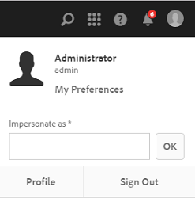

# Uw digitale middelen beheren {#managing-assets-with-the-touch-optimized-ui}

Dit artikel beschrijft om activa in de Activa van de Manager van de Ervaring van Adobe (AEM) te beheren en uit te geven. Om begonnen met het gebruikersinterface en de lay-out te worden, zie [Basis behandeling van Aanraking UI](/help/sites-authoring/basic-handling.md). Om de Fragmenten van de Inhoud te beheren, zie het [Leiden de activa van de Fragmenten](content-fragments-managing.md) van de Inhoud.

## Mappen maken {#creating-folders}

Wanneer het organiseren van een inzameling van activa, bijvoorbeeld, kunnen alle `Nature` beelden, u omslagen tot stand brengen om hen samen te houden. U kunt omslagen gebruiken om uw activa te categoriseren en te organiseren. Voor AEM-bedrijfsmiddelen hoeft u geen bedrijfsmiddelen in mappen te organiseren om beter te kunnen werken.

>[!NOTE]
>
>* Het delen van een omslag van Activa van het type `sling:OrderedFolder`, wordt niet gesteund wanneer het delen aan de Wolk van de Marketing. Als u een omslag wilt delen, selecteer niet [!UICONTROL Besteld] wanneer het creëren van een omslag.
>* De Manager van de ervaring staat niet het gebruiken van `subassets` woord als naam van een omslag toe. Het is een sleutelwoord dat voor knoop wordt gereserveerd die subassets voor samengestelde activa bevatten.

1. Navigeer aan de plaats in uw digitale activaomslag waar u een nieuwe omslag wilt tot stand brengen. Klik in het menu op **[!UICONTROL Maken]**. Selecteer **[!UICONTROL Nieuwe Omslag]**.
1. Op het gebied van de **[!UICONTROL Titel]** , verstrek een omslagnaam. Door gebrek, gebruikt DAM de titel die u als omslagnaam verstrekte. Zodra de omslag wordt gecreeerd, kunt u het gebrek met voeten treden en een andere omslagnaam specificeren.
1. Klik **[!UICONTROL creëren]**. Uw omslag wordt getoond in de digitale activaomslag.

De volgende (ruimte-gescheiden lijst van) karakters worden niet gesteund:

* Een naam van een activabasis mag geen van deze tekens bevatten: `* / : [ \\ ] | # % { } ? &`
* Een naam van een activaomslag kan geen van deze karakters bevatten: `* / : [ \\ ] | # % { } ? \" . ^ ; + & \t`

## Activa uploaden {#uploading-assets}

<!-- TBD the following:
Move this section into a new article. CQDOC-14874 ticket is created for this.
In this complete article, replace emphasis with UICONTROL where appropriate.
-->

U kunt diverse types van activa (met inbegrip van beelden, Pdf- dossiers, RAW dossiers, etc.) van uw lokale omslag of een netwerkaandrijving aan Activa uploaden AEM.

>[!NOTE]
>
>Op Dynamische Media - de wijze Scene7, kunt u activa slechts uploaden de waarvan dossiergrootte 2 GB of minder is.

U kunt verkiezen om activa aan omslagen met of zonder een verwerkingsprofiel te uploaden dat aan hen wordt toegewezen.

Voor omslagen die een toegewezen verwerkingsprofiel hebben, verschijnt de profielnaam op de duimnagel in de kaartmening. In de lijstmening, verschijnt de profielnaam in de kolom van het Profiel van de **Verwerking** . Zie Profielen [verwerken](/help/assets/processing-profiles.md).

Alvorens een activa te uploaden, zorg ervoor dat het in een [formaat](/help/assets/assets-formats.md) is dat de Activa van AEM steunt.

1. In het gebruikersinterface van Activa, navigeer aan de plaats waar u digitale activa wilt toevoegen.
1. Om de activa te uploaden, doe één van het volgende:

   * Tik op de werkbalk op het pictogram **[!UICONTROL Aanmaken]** . Dan op het menu, tik **[!UICONTROL Dossiers]**. U kunt het dossier in de voorgestelde dialoog anders noemen indien nodig.
   * In browser die HTML5 steunt, sleep direct de activa op het gebruikersinterface van Activa. De dialoog om dossier anders te noemen wordt niet getoond.
   

   Om veelvoudige dossiers te selecteren, druk CTRL of de sleutel van het Bevel en selecteer de activa in de dialoog van de dossierplukker. Wanneer u een iPad gebruikt, kunt u slechts één bestand tegelijk selecteren.

   U kunt pauzeren het uploaden van grote activa (groter dan 500 MB) en het hervatten later van de zelfde pagina. Tik op het pictogram **[!UICONTROL Pauze]** naast de voortgangsbalk die wordt weergegeven wanneer een upload wordt gestart.

   

   De omvang waarboven een actief als een groot actief wordt beschouwd, is configureerbaar. Bijvoorbeeld, kunt u het systeem vormen om activa boven 1000 MB (in plaats van 500 MB) als grote activa te overwegen. In dit geval, verschijnt de **[!UICONTROL Pauze]** op de vooruitgangsbar wanneer de activa van grootte groter dan 1000 MB worden geupload.

   De knoop van de Pauze toont niet als een dossier groter dan 1000 MB met een dossier minder dan 1000 MB wordt geupload. Nochtans, als u het minder dan 1000 MB dossier annuleert uploadt, verschijnt de knoop van de **[!UICONTROL Pauze]** .

   Om de groottegrens te wijzigen, vorm het `chunkUploadMinFileSize` bezit van de `fileupload`knoop in de bewaarplaats CRX.

   Wanneer u het pictogram van de **[!UICONTROL Pauze]** klikt, knevels het aan een pictogram van het **[!UICONTROL Spel]** . Om het uploaden te hervatten, klik het pictogram van het **[!UICONTROL Spel]** .

   

   Om aan de gang zijnde te annuleren upload, klik dicht (`X`) naast de vooruitgangsbar. Wanneer u annuleert uploadt verrichting, schrapt de Activa AEM het gedeeltelijk geuploade gedeelte van de activa.

   De capaciteit om het uploaden te hervatten is vooral nuttig in laag-bandbreedtescenario&#39;s en netwerkglitches, waar het een lange tijd vergt om grote activa te uploaden. U kunt pauzeren uploadt verrichting en verdergaat later wanneer de situatie verbetert. Wanneer u hervat, begint het uploaden vanaf het punt waar u het pauzeerde.

   Tijdens het uploaden slaat AEM de delen van het bedrijfsmiddel op die worden geüpload als stukjes gegevens in de CRX-opslagplaats. Wanneer het uploaden is voltooid, consolideert AEM deze bestanden in één gegevensblok in de repository.

   Ga naar om de opschoningstaak te configureren voor de onvoltooide brok die taken uploadt. `https://[aem_server]:[port]/system/console/configMgr/org.apache.sling.servlets.post.impl.helper.ChunkCleanUpTask`Ga naar.

   Als u activa met de zelfde naam zoals die van activa uploadt reeds beschikbaar bij de plaats waar u de activa uploadt, wordt een waarschuwingsdialoog getoond.

   U kunt verkiezen om bestaande activa te vervangen, een andere versie tot stand te brengen, of allebei te houden door de nieuwe activa anders te noemen die worden geupload. Als u een bestaand actief vervangt, worden de meta-gegevens voor het actief en om het even welke vroegere wijzigingen (bijvoorbeeld annoteert of gewas) u aan het bestaande actief maakte geschrapt. Als u verkiest om beide activa te houden, wordt de nieuwe activa anders genoemd met aantal dat aan zijn naam wordt toegevoegd `1` .

   

   >[!NOTE]
   >
   >Wanneer u selecteert **[!UICONTROL vervang]** in de dialoog van het Conflict [!UICONTROL van de] Naam, wordt activumidentiteitskaart geregenereerd voor de nieuwe activa. Deze identiteitskaart is verschillend van identiteitskaart van het vorige actief.
   >
   >Als de Inzichten van Activa wordt toegelaten om indrukken/kliks met de Analyse van Adobe te volgen, maakt geregenereerde activaidentiteitskaart de gegeven-gevangen voor de activa op Analytics ongeldig.

   Als de activa u uploadt in activa AEM bestaat, waarschuwt de **[!UICONTROL Duplicaten Ontdekte]** dialoog dat u probeert om dubbele activa te uploaden. De dialoog verschijnt slechts als de `SHA 1` controlesomwaarde van het binaire getal van de bestaande activa de controlesomwaarde van de activa aanpast u uploadt. In dit geval, is de namen van activa niet van belang.

   >[!NOTE]
   >
   >De [!UICONTROL Duplicaten ontdekte] dialoog verschijnt slechts wanneer de dubbele opsporingseigenschap wordt toegelaten. Om de dubbele opsporingseigenschap toe te laten, zie [Dubbele Opsporing](/help/assets/duplicate-detection.md)toelaten.

   

   Om de dubbele activa in activa te behouden AEM, tik/klik **[!UICONTROL Levend]**. Om de dubbele activa te schrappen u uploadde, kraan/klik **[!UICONTROL Schrapping]**.

   Met AEM-elementen kunt u geen elementen uploaden met de toegestane tekens in de bestandsnamen. Als u probeert om activa met dossier te uploaden - noem die een verboden karakter of meer bevat, toont de Activa van AEM een waarschuwingsbericht en houdt tegen uploadt tot u deze karakters verwijdert of met een toegestane naam uploadt.

   Om specifieke dossier het noemen overeenkomsten voor uw organisatie aan te passen, laat de [!UICONTROL Upload dialoog van Activa] u lange namen voor de dossiers specificeren die u uploadt.

   De volgende (spatie-gescheiden lijst van) karakters worden echter niet gesteund:

   * de naam van het activadossier moet niet bevatten `* / : [ \\ ] | # % { } ? &`
   * de naam van de activaomslag mag niet bevatten `* / : [ \\ ] | # % { } ? \" . ^ ; + & \t`
   

   Bovendien toont het gebruikersinterface van Activa de meest recente activa die u uploadt of de omslag die u eerst creeerde.

   Als u het uploaden annuleert alvorens de dossiers worden geupload, houdt de Activa van AEM op uploadend het huidige dossier en verfrist de inhoud. Nochtans, worden de dossiers die reeds worden geupload niet geschrapt.

   In het dialoogvenster Voortgang uploaden in AEM Assets wordt de telling weergegeven van bestanden die met succes zijn geüpload en de bestanden die niet zijn geüpload.

### Seriële uploads {#serialuploads}

Het uploaden van talrijke activa in bulk verbruikt significante I/O middelen, die de prestaties van uw instantie van de Activa van AEM negatief kunnen beïnvloeden. Met name als u een trage internetverbinding hebt, neemt de tijd om te uploaden drastisch toe als gevolg van een snelle toename van de I/O-capaciteit op schijf. Bovendien kan uw Webbrowser extra beperkingen op het aantal POST- verzoekenAEMActiva introduceren voor gezamenlijke activa uploadt. Dientengevolge, upload ontbreekt verrichting of eindigt voortijdig. Met andere woorden, kunnen de activa van AEM sommige dossiers missen terwijl het opnemen van een bos van dossiers of helemaal er niet in slagen om het even welk dossier in te nemen.

Om deze situatie te overwinnen, neemt de Activa van AEM tegelijkertijd één activa (serie upload) tijdens een bulkupload verrichting op, in plaats van het tegelijkertijd innemen van alle activa.

Het periodieke uploaden van activa wordt toegelaten door gebrek. Om de eigenschap onbruikbaar te maken en het gezamenlijke uploaden toe te staan, bedek de `fileupload` knoop in crx-de en plaats de waarde van het `parallelUploads` bezit aan `true`.

### Upload activa gebruikend FTP {#uploading-assets-using-ftp}

De dynamische Media laat partij toe uploadend van activa via de server van FTP. Als u van plan bent grote activa (> 1 GB) te uploaden of volledige omslagen en sub-omslagen te uploaden, zou u FTP moeten gebruiken. U kunt zelfs opstellingsFTP uploaden om op een terugkomende geplande basis voor te komen.

>[!NOTE]
>
>Op Dynamische Media - de wijze Scene7, kunt u activa slechts uploaden de waarvan dossiergrootte 2 GB of minder is.

>[!NOTE]
>
>Om activa via FTP op Dynamische Media - wijze te uploaden Scene7, installeer het Pak 18912 van de Eigenschap op de auteur AEM instanties. De Zorg [van de Klant van](https://helpx.adobe.com/contact/enterprise-support.ec.html) Adobe van het contact om toegang tot FP-18912 te krijgen en de opstelling van uw rekening van FTP te voltooien. Voor meer informatie, zie het [Installeren van eigenschappak 18912 voor de migratie](/help/assets/bulk-ingest-migrate.md)van bulkactiva.
>
>Als u FTP voor het uploaden van activa gebruikt, upload worden de montages die in AEM worden gespecificeerd genegeerd. In plaats daarvan, worden de regels van de dossierverwerking, zoals die in Dynamische Klassieke Media worden bepaald, gebruikt.

**Om activa te uploaden gebruikend FTP**

1. Gebruikend uw keus van de cliënt van FTP, login aan de server van FTP gebruikend de de gebruikersnaam en wachtwoord van FTP die u van de leveringse-mail ontving. In de cliënt van FTP, upload dossiers of omslagen aan de server van FTP.
1. [Meld u aan bij Dynamic Media Classic](https://www.adobe.com/marketing-cloud/experience-manager/scene7-login.html) met behulp van referenties die u hebt ontvangen van de e-mail met provisioning. Voor de Globale Bar van de Navigatie, **[!UICONTROL uploadt de kraan]**.

1. Voor de Upload pagina, dichtbij de upper-left hoek, tik de **[!UICONTROL Via FTP]** tabel.
1. Voor de linkerkant van de pagina, kies een omslag van FTP om dossiers van te uploaden; op de rechterkant van de pagina, kies een bestemmingsomslag.
1. Vlak de laag-juiste hoek van de pagina, klik de Opties **[!UICONTROL van de]** Baan en plaats dan de opties u gebaseerd op de activa in de omslag wilt u selecteerde.

   Zie Taakopties [uploaden](#upload-job-options).

   >[!NOTE]
   >
   >Wanneer u activa via FTP uploadt, upload de baanopties u in Dynamische Klassieke Media (S7) plaatst belangrijkheid over de parameters van de activaverwerking die in AEM worden geplaatst.

1. Klik in de rechterbenedenhoek van het dialoogvenster Taakopties uploaden op **[!UICONTROL Opslaan]**.
1. In de laag-juiste hoek van de Upload pagina, **[!UICONTROL legt de kraan Upload]** voor.

   Om de vooruitgang van te bekijken uploadt, op de Globale Bar van de Navigatie, de **[!UICONTROL Banen]**van de kraan. De pagina van Banen toont de vooruitgang van upload. U kunt blijven werkend in AEM en aan de pagina van Banen in Dynamische Klassieke Media terugkeren om een lopende baan te herzien.
Als u wilt annuleren dat een uploadtaak wordt uitgevoerd, tikt u op **[!UICONTROL Annuleren]** naast de duur van de duur.

#### Taakopties uploaden {#upload-job-options}

| Optie voor uploaden | Suboptie | Beschrijving |
|---|---|---|
| Taaknaam |  | De standaardnaam die in het tekstgebied vooraf wordt ingevuld omvat het gebruiker-binnengegaane gedeelte van de naam en de datum-en-tijdzegel. U kunt de standaardnaam gebruiken of een naam van uw eigen verwezenlijking ingaan voor dit uploadt baan.  De baan en andere upload en het publiceren banen worden geregistreerd op de pagina van Banen, waar u de status van banen kunt controleren. |
| Publiceren na uploaden |  | publiceert automatisch de activa die u uploadt. |
| Beschrijf in om het even welke omslag, de zelfde naam van basisactiva ongeacht uitbreiding |  | Selecteer deze optie als u de dossiers wilt uploaden u bestaande dossiers met de zelfde namen vervangen. De naam van deze optie zou kunnen verschillend zijn, afhankelijk van de montages in de Opstelling **[!UICONTROL van de]** Toepassing > **[!UICONTROL Algemene Montages]** > **[!UICONTROL Upload aan Toepassing]** > **[!UICONTROL beschrijft Beelden]**. |
| Zip- of Tar-bestanden verwijderen bij uploaden |  |  |
| Taakopties |  | Taaktekst/ klik op **[!UICONTROL Taakopties]** om het dialoogvenster [!UICONTROL Taakopties] uploaden te openen en opties te kiezen die van invloed zijn op de volledige upload taak. Deze opties zijn het zelfde voor alle dossiertypes. U kunt standaardopties kiezen om dossiers te uploaden die op de pagina van de Montages van de Toepassing beginnen Algemene. Om deze pagina te openen, verkies **[!UICONTROL Opstelling]** > de Opstelling **[!UICONTROL van de]** Toepassing. Tik op de knop **[!UICONTROL Standaardopties]** uploaden om het dialoogvenster [!UICONTROL Taakopties] uploaden te openen. |
|  | Wanneer | Selecteer Eenmalig of Terugkomend. Om een terugkomende baan te plaatsen, verkies een Herhaling optie-Dagelijks, Wekelijks, Maandelijks, of Douane-om te specificeren wanneer u FTP wilt herstellen uploadt baan. Dan specificeer zonodig de het plannen opties. |
|  | Inclusief submappen | Upload alle subfolders binnen de omslag u van plan bent te uploaden. De namen van de omslag en zijn subfolders u uploadt zijn automatisch ingegaan in activa AEM. |
|  | Gewasopties | Om van de kanten van een beeld manueel te bebouwen, selecteer het menu van het Gewas en kies Handboek. Dan ga het aantal pixel aan gewas van om het even welke kant of elke kant van het beeld in. Hoeveel van het beeld wordt bebouwd hangt van ppi (pixel per duim) af plaatsend in het beelddossier. Bijvoorbeeld, als de beeldvertoningen 150 ppi en u 75 in de Hoogste, Juiste, Bodem, en Linker tekstvakjes ingaat, wordt een halve duim bebouwd van elke kant.  Om wit-ruimte pixel van een beeld automatisch te bebouwen, open het menu van het Gewas, verkies Handboek, en ga pixelmetingen in de Hoogste, Juiste, Bodem, en Linkergebieden aan gewas van de kanten in. U kunt de Versiering op het menu van het Gewas ook kiezen en deze opties kiezen:  **Trim weg op basis van** <ul><li>**Kleur** - kies de optie van de Kleur. Dan selecteer het menu van de Hoek en kies de hoek van het beeld met de kleur die het best de wit-ruimtekleur vertegenwoordigt u wilt bebouwen.</li><li>**Transparantie** - Kies de optie Transparantie.  **Tolerantie** - Sleep de schuif om een tolerantie van 0 door 1 te specificeren.Voor het in orde maken gebaseerd op kleur, specificeer 0 aan gewassenpixel slechts als zij precies de kleur aanpassen u in de hoek van het beeld selecteerde. De aantallen dichter aan 1 staan voor meer kleurenverschil toe. Voor het in orde maken die op transparantie wordt gebaseerd, specificeer 0 aan gewassenpixel slechts als zij transparant zijn. De aantallen dichter aan 1 staan voor meer transparantie toe.</li></ul> Merk op dat deze gewassenopties niet destructief zijn. |
|  | Opties voor kleurenprofiel | Kies een kleurenomzetting wanneer u geoptimaliseerde dossiers creeert die voor levering worden gebruikt:<ul><li>Standaardkleurbehoud: Handhaaft de bronbeeldkleuren wanneer de beelden de informatie van de kleurenruimte bevatten; er is geen kleurconversie. Bijna hebben alle beelden vandaag reeds het aangewezen kleurenprofiel ingebed. Nochtans, als een CMYK bronbeeld geen ingebed kleurenprofiel bevat, worden de kleuren omgezet in sRGB (standaard Rood Groen Blauw) kleurenruimte. sRGB is de geadviseerde kleurenruimte voor het tonen van beelden op Web-pagina&#39;s.</li><li>Originele kleurruimte behouden: Behoudt de originele kleuren zonder enige kleurenomzetting op het punt. Voor beelden zonder een ingebed kleurenprofiel, wordt om het even welke kleurenomzetting gedaan gebruikend de standaardkleurenprofielen die in de Publish montages worden gevormd. De kleurenprofielen kunnen zich niet op de kleur in de dossiers richten die met deze optie worden gecreeerd. Daarom wordt u aangemoedigd om de optieStandaardBehoud van de Kleur te gebruiken.</li><li>De douane van > aan  opent menu&#39;s zodat kunt u een Bekeerling van kiezen en in kleurenruimte omzetten. Deze geavanceerde optie treedt om het even welke kleureninformatie met voeten die in het brondossier wordt ingebed. Selecteer deze optie wanneer alle afbeeldingen die u indient, onjuiste of ontbrekende gegevens van het kleurenprofiel bevatten.</li></ul> |
|  | Opties voor afbeeldingsbewerking | U kunt de het knippen maskers in beelden bewaren, en een kleurenprofiel kiezen.  Zie Opties voor [afbeeldingsbewerking instellen tijdens uploaden](#setting-image-editing-options-at-upload). |
|  | Opties voor postscript | U kunt rasterize de dossiers van PostScript®, gewassendossiers, handhaven transparante achtergronden, een resolutie kiezen, en een kleurenruimte kiezen.  Zie Opties [Plaatsen PostScript en Illustrator uploaden opties](#setting-postscript-and-illustrator-upload-options). |
|  | Photoshop-opties | U kunt malplaatjes van de dossiers van Adobe® creëren Photoshop®, lagen handhaven, specificeren hoe de lagen worden genoemd, tekst halen, en specificeren hoe de beelden in malplaatjes worden verankerd.  Merk op dat de malplaatjes niet in AEM worden gesteund.  Zie [Plaatsende Photoshop uploadopties](#setting-photoshop-upload-options). |
|  | PDF-opties | U kunt rasterize de dossiers, halen onderzoekswoorden en verbindingen, auto-produceren een eCatalog, de resolutie plaatsen, en een kleurenruimte kiezen.  Merk op dat eCatalogs niet in AEM worden gesteund.   Zie Opties [voor](#setting-pdf-upload-options)PDF-uploaden instellen. |
|  | Illustrator-opties | U kunt rasterize de dossiers van Adobe Illustrator®, transparante achtergronden handhaven, een resolutie kiezen, en een kleurenruimte kiezen.  Zie Opties [Plaatsen PostScript en Illustrator uploaden opties](#setting-postscript-and-illustrator-upload-options). |
|  | EVideo-opties | U kunt een videodossier transcoderen door een Video te kiezen vooraf instelt.  Zie Opties [voor eVideo-upload instellen](#setting-evideo-upload-options). |
|  | Voorinstellingen voor batchset | Om een Reeks van het Beeld, of Rotatie te creëren die van de geuploade dossiers wordt geplaatst, klik de Actieve kolom voor vooraf ingesteld u wilt gebruiken. U kunt meer dan één vooraf ingesteld selecteren. U creeert vooraf instelt in de Opstelling van de Toepassing/de Reeks van de Partij stelt pagina van Dynamische Klassieke Media vooraf in.  Zie [het Vormen de Reeks van de Partij vooraf instelt om de Reeksen van het Beeld en de Reeksen](config-dms7.md#creating-batch-set-presets-to-auto-generate-image-sets-and-spin-sets) van de Rotatie auto-te produceren om meer te leren over het creëren van partijreeks vooraf instelt.  Zie de [Plaatsende Reeks van de Partij vooraf instelt bij upload](#setting-batch-set-presets-at-upload). |

#### Stel opties voor afbeeldingsbewerking in op upload {#setting-image-editing-options-at-upload}

Wanneer het uploaden van beelddossiers, met inbegrip van AI, EPS, en Psd- dossiers, kunt u de volgende het uitgeven acties in het de dialoogvakje van de Opties van de Baan van de [!UICONTROL Upload] ondernemen:

* De witte ruimte van het gewas van de rand van beelden (zie beschrijving in lijst hierboven).
* Het gewas manueel van de kanten van beelden (zie beschrijving in lijst hierboven).
* Kies een kleurenprofiel (zie de optiesbeschrijving in lijst hierboven).
* Creeer een masker van een het knippen weg.
* Scherpe afbeeldingen met opties voor onscherp maskeren
* Achtergrond kennis

<!--
| Option | Sub-option | Description |
|---|---|---|
| Create Mask From Clipping Path | | Create a mask for the image based on its clipping path information. This option applies to images created with image-editing applications in which a clipping path was created. |
| Unsharp Masking | | Lets you fine-tune a sharpening filter effect on the final downsampled image, controlling the intensity of the effect, the radius of the effect (as measured in pixels), and a threshold of contrast that is ignored.  This effect uses the same options as Photoshop’s Unsharp Mask filter. Contrary to what the name suggests, Unsharp Mask is a sharpening filter. Under Unsharp Masking, set the options you want. Setting options are described in the following: |
| | Amount | Controls the amount of contrast that is applied to edge pixels.  Think of it as the intensity of the effect. The main difference between the amount values of Unsharp Mask in Dynamic Media and the amount values in Adobe Photoshop, is that Photoshop has an amount range of 1% to 500%. Whereas, in Dynamic Media, the value range is 0.0 to 5.0. A value of 5.0 is the rough equivalent of 500% in Photoshop; a value of 0.9 is the equivalent of 90%, and so on. |
| | Radius | Controls the radius of the effect. The value range is 0-250.  The effect is run on all pixels in an image and radiates out from all pixels in all directions. The radius is measured in pixels. For example, to get a similar sharpening effect for a 2000 x 2000 pixel image and 500 x 500 pixel image, you would set a radius of two pixels on the 2000 x 2000 pixel image and a radius value of one pixel on the 500 x 500 pixel image. A larger value is used for an image that has more pixels. |
| | Threshold | Threshold is a range of contrast that is ignored when the Unsharp Mask filter is applied. It is important so that no "noise" is introduced to an image when this filter is used. The value range is 0-255, which is the number of brightness steps in a grayscale image. 0=black, 128=50% gray and 255=white.  For example, a threshold value of 12 ignores slight variations is skin tone brightness to avoid adding noise, but still add edge contrast to areas such as where eyelashes meet skin.  For example, if you have a photo of someone’s face, the Unsharp Mask affects the parts of the image, such as where eyelashes and skin meet to create an obvious area of contrast, and the smooth skin itself. Even the smoothest skin exhibits subtle changes in brightness values. If you do not use a threshold value, the filter accentuates these subtle changes in skin pixels. In turn, a noisy and undesirable effect is created while contrast on the eyelashes is increased, enhancing sharpness.  To avoid this issue, a threshold value is introduced that tells the filter to ignore pixels that do not change contrast dramatically, like smooth skin.  In the zipper graphic shown earlier, notice the texture next to the zippers. Image noise is exhibited because the threshold values were too low to suppress the noise. |
| | Monochrome | Select to unsharp-mask image brightness (intensity).  Deselect to unsharp-mask each color component separately. |
| Knockout Background | | Automatically removes the background of an image when you upload it. This technique is useful to draw attention to a particular object and make it stand out from a busy background. Select to enable or “turn on” the Knockout Background feature and the following sub-options: |
| | Corner | Required.  The corner of the image that is used to define the background color to knockout.  You can choose from **Upper Left**, **Bottom Left**, **Upper Right**, or **Bottom Right**. |
| | Fill Method | Required.  Controls pixel transparency from the Corner location that you set.  You can choose from the following fill methods: <ul><li>**Flood Fill** - turns all pixels transparent that match the Corner that you have specified and are connected to it.</li><li>**Match Pixel** - turns all matching pixels transparent, regardless of their location on the image.</li></ul> |
| | Tolerance | Optional.  Controls the allowable amount of variation in pixel color matching based on the Corner location that you set.  Use a value of 0.0 to match pixel colors exactly or, use a value of 1.0 to allow for the greatest variation. |
-->

#### Opties voor PostScript- en Illustrator-upload instellen {#setting-postscript-and-illustrator-upload-options}

Wanneer u PostScript (EPS) of Illustrator (AI) beelddossiers uploadt, kunt u hen op diverse manieren formatteren. U kunt rasterize de dossiers, de transparante achtergrond handhaven, een resolutie kiezen, en een kleurenruimte kiezen. De opties voor het formatteren van PostScript en de dossiers van de Illustrator zijn beschikbaar in het de dialoogvakje van de Opties [!UICONTROL van de Baan van de] Upload onder de Opties [!UICONTROL van] PostScript en de Opties [!UICONTROL van de]Illustrator.

| Optie | Suboptie | Beschrijving |
|---|---|---|
| Verwerking |  | Verkies **[!UICONTROL Rasterize]** om vectorgrafiek in het dossier in het bitmap formaat om te zetten. |
| Transparante achtergrond behouden in gerenderde afbeelding |  | Handhaaf de achtergrondtransparantie van het dossier. |
| Resolutie |  | Bepaalt resolutie het plaatsen. Dit het plaatsen bepaalt hoeveel pixel per duim in het dossier worden getoond. |
| Kleurruimte |  | Selecteer het menu van de Ruimte van de Kleur en kies van de volgende opties van de kleurenruimte: |
|  | Automatisch detecteren | Behoudt de kleurenruimte van het dossier. |
|  | Afdwingen als RGB | Zet in de RGB kleurenruimte om. |
|  | Krachten als CMYK | Zet in de CMYK kleurenruimte om. |
|  | Kracht als grayscale | Zet in de grayscale kleurenruimte om. |

#### Opties voor Photoshop-upload instellen {#setting-photoshop-upload-options}

De dossiers van het Document van Photoshop (PSD) worden het vaakst gebruikt om beeldmalplaatjes te creëren. Wanneer u een Psd- dossier uploadt, kunt u een beeldmalplaatje automatisch van het dossier tot stand brengen (selecteer de [!UICONTROL Create optie van het Malplaatje] op het Upload scherm).

De dynamische Media leiden tot veelvoudige beelden van een Psd- dossier met lagen als u het dossier gebruikt om een malplaatje te creëren; het leidt tot één beeld voor elke laag.

Gebruik de hierboven beschreven Opties [!UICONTROL van het] Gewas en de Opties [!UICONTROL van het Profiel van de]Kleur, met Photoshop uploadt opties.

>[!NOTE]
>
>De malplaatjes worden niet gesteund in AEM.

| Optie | Suboptie | Beschrijving |
|---|---|---|
| Lagen behouden |  | Ript de lagen in PSD, als om het even welk, in individuele activa. De activalagen blijven verbonden aan PSD. U kunt hen bekijken door het Psd- dossier in detail te openen bekijkt en het laagpaneel te selecteren. |
| Template maken |  | Creeert een malplaatje van de lagen in het Psd- dossier. |
| Tekst extraheren |  | Trekt de tekst uit zodat de gebruikers naar tekst in een Kijker kunnen zoeken. |
| Lagen uitbreiden naar achtergrondgrootte |  | Breidt de grootte van geknipte beeldlagen tot de grootte van de achtergrondlaag uit. |
| Laagnamen |  | De lagen in het Psd- dossier worden geupload als afzonderlijke beelden. |
|  | Laagnaam | Namen de beelden na hun laagnamen in het Psd- dossier. Bijvoorbeeld, wordt een laag genoemd de Markering van de Prijs in het oorspronkelijke Psd- dossier een beeld genoemd Prijsmarkering. Nochtans, als de laagnamen in het Psd- dossier standaardPhotoshop laagnamen (Achtergrond, Laag 1, Laag 2, etc.) zijn, worden de beelden genoemd na hun laagaantallen in het Psd- dossier, niet hun standaardlaagnamen. |
|  | Photoshop- en laagnummer | Namen de beelden na hun laagaantallen in het Psd- dossier, negerend originele laagnamen. De beelden worden genoemd met filename Photoshop en een toegevoegd laagaantal. Bijvoorbeeld, wordt de tweede laag van een dossier genoemd Lente Ad.psd. genoemd Lente Ad_2 zelfs als het een niet-standaardnaam in Photoshop had. |
|  | Naam Photoshop en laag | Namen de beelden na het Psd- dossier dat door de laagnaam of het laagaantal wordt gevolgd. Het laagaantal wordt gebruikt als de laagnamen in het Psd- dossier standaardPhotoshop laagnamen zijn. Bijvoorbeeld, wordt een laag genoemd de Markering van de Prijs in een Psd- dossier genoemd SpringAd genoemd Lente Ad_Price Markering. Een laag met de standaardnaamLaag 2 wordt genoemd Lente Ad_2. |
| Anker |  | Specificeer hoe de beelden in malplaatjes worden verankerd die van de gelaagde samenstelling worden geproduceerd die uit het Psd- dossier wordt geproduceerd. Door gebrek, is het anker het centrum. Een centrumanker staat vervangingsbeelden toe om de zelfde ruimte, geen kwestie de aspectverhouding van het vervangingsbeeld het best te vullen. De beelden met een verschillend aspect dat dit beeld vervangt, wanneer het van verwijzingen voorzien van het malplaatje en het gebruiken van parametersubstitutie, bezetten effectief de zelfde ruimte. Verandering in het verschillende plaatsen als uw toepassing de vervangingsbeelden vereist om de toegewezen ruimte in het malplaatje te vullen. |

#### Opties voor PDF-upload instellen {#setting-pdf-upload-options}

Wanneer u een Pdf- dossier uploadt, kunt u het op diverse manieren formatteren. U bebouwt zijn pagina&#39;s, haalt onderzoekswoorden, gaat een pixel-per-duim resolutie in, en kiest een kleurenruimte. De dossiers PDF bevatten vaak een versieringsmarge, gewassentekens, registratietekens, en de tekens van andere printer. U kunt deze tekens van de kanten van pagina&#39;s bebouwen aangezien u een Pdf- dossier uploadt.

>[!NOTE]
>
>eCatalogs worden niet gesteund in AEM.

Kies uit de volgende opties:

| Optie | Suboptie | Beschrijving |
|---|---|---|
| Verwerking | Rasterize | (Gebrek) Ript de pagina&#39;s in het Pdf- dossier en zet vectorgrafiek in bitmap beelden om. Kies deze optie om een eCatalog tot stand te brengen. |
| Extract | Zoekwoorden | Extracteert woorden uit het Pdf- dossier zodat het dossier door sleutelwoord in een eCatalogKijker kan worden gezocht. |
|  | Koppelingen | Trekt verbindingen van de Pdf- dossiers af en bedekt hen aan de Kaarten van het Beeld die in een eCatalogKijker worden gebruikt. |
| Automatisch eCatalog van veelvoudige pagina PDF produceren |  | Automatisch een eCatalog van het Pdf- dossier tot stand brengen. De eCatalog wordt genoemd na het Pdf- dossier u uploadde. (Deze optie is slechts beschikbaar als u rasterize het Pdf- dossier aangezien u het uploadt.) |
| Resolutie |  | Bepaalt resolutie het plaatsen. Dit het plaatsen bepaalt hoeveel pixel per duim in het Pdf- dossier worden getoond. Het gebrek is 150. |
| Kleurruimte |  | Selecteer het menu Kleurruimte en kies een kleurruimte voor het PDF-bestand. De meeste Pdf- dossiers hebben zowel RGB als CMYK kleurenbeelden. De RGB kleurenruimte is verkieslijk voor online het bekijken. |
|  | Automatisch opsporen | Behoudt de kleurenruimte van het Pdf- dossier. |
|  | Afdwingen als RGB | Zet in de RGB kleurenruimte om. |
|  | Kracht als CMYK | Zet in de CMYK kleurenruimte om. |
|  | Kracht als grayscale | Zet in de grayscale kleurenruimte om. |

#### Opties voor eVideo-upload instellen {#setting-evideo-upload-options}

Om een videodossier te transcoderen door van een verscheidenheid van video te kiezen stelt vooraf in.

| Optie | Suboptie | Beschrijving |
|---|---|---|
| Adaptieve video |  | Één enkele het coderen vooraf ingesteld die met om het even welke aspectverhouding werkt om video&#39;s tot stand te brengen voor levering aan mobiel, tablet, en Desktop. Geüploade bronvideo&#39;s die met deze voorinstelling zijn gecodeerd, worden ingesteld met een vaste hoogte. Nochtans, de breedteschalen automatisch om de aspectverhouding van de video te bewaren.  De beste praktijken moeten het Aanpassings Video coderen gebruiken. |
| Enige het Coderen stelt vooraf in | Incodering sorteren Voorinstellingen | Selecteer Naam of Grootte om het coderen te sorteren vooraf instelt vermeld onder Desktop, Mobiel, en Tablet door naam of door resolutiegrootte. |
|  | Desktop | Maak een MP4-bestand om een streaming- of progressieve videobeleving te bieden aan desktopcomputers.Selecteer een of meer beeldverhoudingen met de gewenste resolutie- en doelgegevenssnelheid. |
|  | Mobiel | Creeer een MP4 dossier voor levering op iPhone of de mobiele apparaten van Android.Selecteer één of meerdere aspectverhoudingen met de resolutiegrootte en het tarief van doelgegevens u wenst. |
|  | Tablet | Maak een MP4-bestand voor levering op iPad- of Android-tabletapparaten.Selecteer een of meer beeldverhoudingen met de gewenste resolutie- en doelgegevenssnelheid. |

#### De vastgestelde Reeks van de Partij stelt bij upload vooraf in {#setting-batch-set-presets-at-upload}

Als u een Reeks van het Beeld wilt automatisch tot stand brengen of die van geuploade beelden plaatsen centreert, klik de Actieve kolom voor vooraf ingesteld u wilt gebruiken. U kunt meer dan één vooraf ingesteld selecteren.

Zie [het Vormen de Reeks van de Partij vooraf instelt om de Reeksen van het Beeld en de Reeksen](/help/assets/config-dms7.md#creating-batch-set-presets-to-auto-generate-image-sets-and-spin-sets) van de Rotatie auto-te produceren om meer te leren over het creëren van partijreeks vooraf instelt.

### Gestroomde uploads {#streamed-uploads}

Als u vele activa aan AEM uploadt, nemen de I/O verzoeken om server drastisch toe, wat de upload efficiency vermindert en wat kan zelfs veroorzaken uploadt taak aan tijd uit. AEM Assets ondersteunt gestreamde uploadtaken van bedrijfsmiddelen. Het gestreamde uploaden vermindert de I/O van de schijf tijdens het uploaden door opslag van bedrijfsmiddelen in een tijdelijke map op de server te vermijden alvorens deze te kopiëren naar de repository. In plaats daarvan wordt het gegeven rechtstreeks naar de bewaarplaats overgebracht. Deze manier, wordt de tijd om grote activa te uploaden en de mogelijkheid van onderbrekingen verminderd. De gestreamde upload wordt standaard ingeschakeld in AEM Assets.

>[!NOTE]
>
>Het stromen upload is gehandicapt voor AEM die op server JEE loopt met servlet-api versie lager dan 3.1.

### ZIP-archief met elementen extraheren {#extractzip}

U kunt ZIP-archieven net als andere ondersteunde elementen uploaden. De zelfde dossier - noem regels zijn op de dossiers van het PIT van toepassing. AEM staat u toe om een archief van het PIT aan een plaats te halen DAM. Als de archiefdossiers geen ZIP als uitbreiding bevatten, laat dossiertype opsporing toe gebruikend inhoud.

Selecteer één archief van het PIT tegelijkertijd, klik het Archief **[!UICONTROL van het]** Uittreksel, en selecteer een bestemmingsomslag. Selecteer een optie om eventuele conflicten te behandelen. Als de activa in het dossier van het PIT reeds in de bestemmingsomslag bestaan, kunt u één van deze opties selecteren: overslaan de extractie, vervangen bestaande dossiers, houden beide activa door anders te noemen, of creëren nieuwe versie.

Nadat de extractie volledig is, deelt AEM u in het berichtgebied mee. Terwijl AEM het PIT haalt, kunt u terug naar uw werk zonder de extractie te onderbreken.

Sommige beperkingen van de eigenschap zijn:

* Als een omslag door de zelfde naam bij de bestemming bestaat, worden de activa van het dossier van het PIT gehaald in de bestaande omslag.
* Als u de extractie annuleert, worden de reeds gewonnen activa niet geschrapt.
* U kunt niet twee dossiers van het PIT tezelfdertijd selecteren en hen halen. U kunt slechts één archief van het PIT tegelijkertijd halen.
* Wanneer het uploaden van een archief van het PIT, als de upload dialoog een 500 serverfout toont, probeer opnieuw na het installeren van het recentste de dienstpak.

## Voorbeeld van elementen {#previewing-assets}

Aan voorproef volgt een activa, deze stappen.

1. Van het gebruikersinterface van Activa, navigeer aan de plaats van de activa u aan voorproef wilt.
1. Tik op het gewenste element om het te openen.

1. Op de voorproefwijze, zijn de gezoemopties beschikbaar voor de [gesteunde types](/help/assets/assets-formats.md#supported-raster-image-formats) van Beeld (met het interactieve uitgeven).

   Om in activa te zoemen, tik/klik `+` (of kraan/klik het vergrootglas op de activa). Om uit te zoemen, tik/klik `-`. Wanneer u binnen zoemt, kunt u dicht bij om het even welk gebied van het beeld kijken door te pannen. De het gezoempijl van het terugstellen brengt u terug naar de originele mening.

   

   Tik op **[!UICONTROL Opnieuw instellen]** om de weergave te herstellen naar de oorspronkelijke grootte.

   

**Voorbeeld van elementen met alleen toetsenbordtoetsen**

Aan voorproef volgt een activa die toetsenbord gebruiken, deze stappen:

1. Van het gebruikersinterface van Activa, navigeer aan de plaats van de activa u aan voorproef, gebruikend `Tab` en pijlsleutels wilt.

1. Open de gewenste activa.

   Op de voorproefwijze, zijn de gezoem en het terugstellen opties beschikbaar voor de [gesteunde types](/help/assets/assets-formats.md#supported-raster-image-formats) van Beeld (met het interactieve uitgeven).
1. Om in de activa te zoemen:
   1. De `Tab` sleutel van het gebruik om nadruk aan gezoem-binnen pictogram te bewegen.
   1. De `Enter` sleutel van het gebruik om in het beeld te zoemen.
   Om uit gebruikssleutel te zoemen om nadruk naar het gezoem-uit pictogram te bewegen en te drukken `Tab` `Enter`.

1. Gebruik `Shift` + `Tab` sleutels om de nadruk terug op het beeld te bewegen.

1. De pijlsleutels van het gebruik om zich rond het gezoemde beeld te bewegen.

Zie ook [Voorproef Dynamische Middelen van Media.](/help/assets/previewing-assets.md)

## Eigenschappen en metagegevens bewerken {#editing-properties}

1. Navigeer aan de plaats van de activa de waarvan meta-gegevens u wilt uitgeven.

1. Selecteer de activa, en de kraan/klikt **[!UICONTROL Eigenschappen]** van de toolbar om activaeigenschappen te bekijken. Alternatief, kies de snelle actie van **[!UICONTROL Eigenschappen]** op de activakaart.

   

1. In de pagina van [!UICONTROL Eigenschappen] , geef de meta-gegevenseigenschappen onder diverse lusjes uit. Bijvoorbeeld, onder het **[!UICONTROL Basis]** lusje, geef de titel, de beschrijving, etc. uit.

   >[!NOTE]
   >
   >De lay-out van de pagina van [!UICONTROL Eigenschappen] en de beschikbare meta-gegevenseigenschappen hangen van het onderliggende meta-gegevensschema af. Leren hoe te om de lay-out van de pagina van [!UICONTROL Eigenschappen] te wijzigen, zie de Schema&#39;s van [Meta-gegevens](/help/assets/metadata-schemas.md).

1. To schedule a particular date/time for the activation of the asset, use the date picker beside the **[!UICONTROL On Time]** field.

   

1. Als u het actief na een bepaalde duur wilt deactiveren, kiest u de datum/tijd van deactivering van de datumkiezer naast het veld **[!UICONTROL Off Time]** . De datum waarop een actief wordt gedeactiveerd, moet later zijn dan de activeringsdatum van het actief. Na de [!UICONTROL Uit Tijd], zijn activa en zijn vertolkingen niet beschikbaar of via de het Webinterface van Activa of door HTTP API.

   

1. Selecteer in het veld **[!UICONTROL Labels]** een of meer tags. Om een douanetag toe te voegen, typ de naam van de markering in de doos en druk binnengaan. De nieuwe markering wordt bewaard in AEM. YouTube heeft tags nodig om te publiceren. Bekijk [video&#39;s voor YouTube](video.md#publishing-videos-to-youtube).

   >[!NOTE]
   >
   >Om markeringen te creëren, moet u schrijf toestemming bij `/content/cq:tags/default` in de bewaarplaats CRX.

1. To provide a rating to the asset, tap/click the **[!UICONTROL Advanced]** tab and then tap/click the star at the appropriate position to assign the desired rating.

   

   De beoordelingsscore die u aan de activa toewijst wordt getoond onder **[!UICONTROL Uw Ratings]**. De gemiddelde beoordelingsscore die het van gebruikers ontvangen actief dat het actief beoordeelde, wordt weergegeven onder **[!UICONTROL Beoordeling]**. Daarnaast wordt de opsplitsing van de ratingscores die bijdragen aan de gemiddelde ratingscore weergegeven onder **[!UICONTROL Rating Breakdown]**. U kunt activa zoeken die op gemiddelde beoordelingsscores worden gebaseerd.

1. Om de statistieken van het gebruiksgebruik voor de activa te bekijken, klik/tik de **[!UICONTROL Inzichten]** tabel.

   De statistieken van het gebruik omvatten het volgende:

   * Aantal keren dat het actief is bekeken of gedownload
   * Kanalen/apparaten waardoor de activa werden gebruikt
   * Creatieve oplossingen waarbij het actief onlangs is gebruikt
   Voor meer details, zie de Inzichten van [Activa](/help/assets/touch-ui-asset-insights.md).

1. Tik/klik op **[!UICONTROL Opslaan en sluiten]**.
1. Navigeer aan het gebruikersinterface van Activa. De uitgegeven meta-gegevenseigenschappen, met inbegrip van titel, beschrijving, classificaties, etc. worden getoond op de activakaart in de mening van de Kaart en onder relevante kolommen in de mening van de Lijst.

## Kopieermiddelen {#copying-assets}

Wanneer u activa of een omslag kopieert, wordt de volledige activa of de omslag gekopieerd, samen met zijn inhoudsstructuur. Een gekopieerde activa of een omslag worden gedupliceerd bij de doelplaats. De activa bij de bronplaats worden niet veranderd.

Een paar attributen die aan een bepaalde exemplaar van activa uniek zijn worden niet overgebracht. Enkele voorbeelden zijn:

* Identiteitskaart van activa, verwezenlijkingsdatum en tijd, en versies en versiegeschiedenis. Sommige van deze eigenschappen worden vermeld door de eigenschappen `jcr:uuid`, `jcr:created`, en `cq:name`.

* De tijd van de verwezenlijking en de referenced wegen zijn uniek voor elke activa en elk van zijn vertolking.

De andere eigenschappen en meta-gegevensinformatie worden behouden. Een gedeeltelijk exemplaar wordt niet gecreeerd wanneer het kopiëren van activa.

1. Van de Activa UI, selecteer één of meerdere activa, en tik/klik dan het pictogram van het **[!UICONTROL Exemplaar]** van de toolbar. U kunt ook de snelactie **[!UICONTROL Kopiëren]** selecteren op de activatcard.
   

   >[!NOTE]
   >
   >Als u de snelle actie van het [!UICONTROL Exemplaar] gebruikt, kunt u slechts één activa tegelijkertijd kopiëren.

1. Navigeer aan de plaats waar u de activa wilt kopiëren.

   >[!NOTE]
   >
   >Als u activa bij de zelfde plaats kopieert, produceert AEM automatisch een variatie van de naam. Bijvoorbeeld, als u activa kopieert met een titel `Square`, produceert AEM automatisch de titel voor zijn exemplaar zoals `Square1`.

1. Klik/tik het de activapictogram van het **[!UICONTROL Deeg]** van de toolbar.

   Activa worden dan gekopieerd aan deze plaats.

   >[!NOTE]
   >
   >Het pictogram **[!UICONTROL Plakken]** is beschikbaar op de werkbalk totdat de plakbewerking is voltooid.

### Verplaats of noem activa anders {#moving-or-renaming-assets}

1. Navigeer aan de plaats van de activa u zich wilt bewegen.

1. Selecteer de activa, en tik/klik het pictogram van de **[!UICONTROL Beweging]** van de toolbar.
   

1. In de tovenaar van de Activa van de Beweging, doe één van het volgende:

   * Specificeer de naam voor de activa nadat het wordt bewogen. Tik vervolgens op/klik op **[!UICONTROL Volgende]** om verder te gaan.

   * Tik/klik op **[!UICONTROL Annuleren]** om het proces te stoppen.
   >[!NOTE]
   >
   >* U kunt de zelfde naam voor de activa specificeren als er geen activa met die naam bij de nieuwe plaats zijn. Nochtans, zou u een verschillende naam moeten gebruiken als u de activa naar een plaats verplaatst waar activa met de zelfde naam bestaan. Als u de zelfde naam gebruikt, produceert het systeem automatisch een variatie van de naam. Bijvoorbeeld als uw activa de naamVierkant hebben, produceert het systeem naam Square1 voor zijn exemplaar.
   >* Wanneer het anders noemen, whitespace wordt niet toegestaan in het dossier - naam.

1. Voor de **[!UICONTROL Uitgezochte dialoog van de Bestemming]** , doe één van het volgende:

   * Navigeer aan de nieuwe plaats voor de activa, en dan de kraan/klik **[!UICONTROL daarna]** om te werk te gaan.

   * Tik/klik op **[!UICONTROL Terug]** om terug te keren naar het scherm **[!UICONTROL Naam]** wijzigen.

1. Als de activa die om het even welke het van verwijzingen voorzien pagina&#39;s, activa, of inzamelingen hebben worden bewogen, verschijnt het **[!UICONTROL Adjust lusje van Verwijzingen]** naast de **[!UICONTROL Uitgezochte Bestemming]** tabel die.

   Doe één van het volgende in het **[!UICONTROL Adjust scherm van Verwijzingen]** :

   * Specificeer de verwijzingen die op de nieuwe details moeten worden aangepast, en dan te tikken/te klikken **[!UICONTROL Beweging]** om te werk te gaan.

   * Van de **[!UICONTROL Adjust]** kolom, uitgezochte/unselect verwijzingen naar de activa.
   * Tik/klik op **[!UICONTROL Terug]** om terug te keren naar het scherm **[!UICONTROL Bestemming]** selecteren.

   * Tik/klik op **[!UICONTROL Annuleren]** om de verplaatsing te stoppen.
   Als u geen verwijzingen bijwerkt, blijven zij aan de vorige weg van de activa richten. Als u de verwijzingen aanpast, worden zij bijgewerkt aan de nieuwe activaweg.

## Rendities beheren {#managing-renditions}

1. U kunt rendities voor activa, behalve origineel toevoegen of verwijderen. Navigeer aan de plaats van de activa waarvoor u vertolkingen toevoegen of wilt verwijderen.

1. Tik/klik op het element om de activapagina te openen.

   

1. Tik/klik op het pictogram GlobalNav en selecteer **[!UICONTROL Rendities]** in de lijst.

   

1. In het paneel van **[!UICONTROL Vertolkingen]** , bekijk de lijst van vertolkingen die voor de activa worden geproduceerd.

   

   >[!NOTE]
   >
   >Door gebrek, tonen de Activa AEM niet de originele vertolking van de activa op de voorproefwijze. Als u een beheerder bent, kunt u bekledingen gebruiken om Activa te vormen AEM om originele vertolkingen op de voorproefwijze te tonen.

1. Selecteer een renditie om de renditie te bekijken of te verwijderen.

   **Een renditie verwijderen**

   Selecteer een renditie in het deelvenster **[!UICONTROL Rendities]** en tik op/klik vervolgens op het pictogram Renditie **** verwijderen op de werkbalk.

   

   **Een nieuwe renditie uploaden**

   Navigate to the asset details page for the asset, and tap/click the **[!UICONTROL Add Rendition]** icon in the toolbar to upload a new rendition for the asset.

   

   >[!NOTE]
   >
   >If you select a rendition from the **[!UICONTROL Renditions]** panel, the toolbar changes context and displays only those actions that are relevant to the rendition. Opties zoals het pictogram Uitvoering uploaden worden niet weergegeven. Ga naar de pagina met details voor de asset om deze opties in de werkbalk weer te geven.

   U kunt de afmetingen voor de vertolking vormen u getoond in de detailspagina van een beeld of videoactiva wilt. Gebaseerd op de afmetingen u specificeert, toont de Activa AEM de vertolking met de nauwkeurige of dichtste afmetingen.

   Als u weergaveafmetingen van een afbeelding op het niveau van de assetdetails wilt configureren, overlapt u het knooppunt `renditionpicker` (`libs/dam/gui/content/assets/assetpage/jcr:content/body/content/content/items/assetdetail/items/col1/items/assetview/renditionpicker`) en configureert u de waarde van de breedte-eigenschap. Configure the property **[!UICONTROL size (Long) in KB]** in place of width to customize rendition on asset detail page based on image size. Voor aanpassing op basis van grootte wijst de eigenschap `preferOriginal` de voorkeur toe aan het origineel als de grootte van de overeenkomstige weergave groter is dan het origineel.

   Op dezelfde manier kunt u het de paginabeeld van de Annotatie aanpassen door te bekleden `libs/dam/gui/content/assets/annotate/jcr:content/body/content/content/items/content/renditionpicker`.

   

   Om de afmetingen van de vertolking voor een videoactiva te vormen, navigeer aan de `videopicker` knoop in de bewaarplaats CRX bij de plaats `/libs/dam/gui/content/assets/assetpage/jcr:content/body/content/content/items/assetdetail/items/col1/items/assetview/videopicker`, bedek de knoop, en geef dan het aangewezen bezit uit.

   >[!NOTE]
   >
   >De video annotaties worden gesteund slechts op browsers met HTML5 compatibele videoformaten. Bovendien, afhankelijk van browser, worden de verschillende videoformaten gesteund.

Voor meer informatie over het produceren van en het bekijken van subassets, zie [leiden subassets](managing-linked-subassets.md#generate-subassets).

## Elementen verwijderen {#deleting-assets}

Om de inkomende verwijzingen uit andere pagina&#39;s op te lossen of te verwijderen, werk de relevante verwijzingen bij alvorens activa te schrappen.

Ook, maak de knoop van de krachtschrapping onbruikbaar gebruikend een bekleding, om gebruikers te verbieden referenced activa te schrappen en gebroken verbindingen te verlaten.

1. Blader naar de locatie van de elementen die u wilt verwijderen.

1. Selecteer de activa, en tik/klik het pictogram van de **[!UICONTROL Schrapping]** van de toolbar.

   

1. Klik in het bevestigingsvenster op:

   * **[!UICONTROL Annuleren]** om de actie te stoppen
   * **[!UICONTROL Schrap]** om de actie te bevestigen:

      * Als het actief geen verwijzingen heeft, wordt het actief verwijderd.
      * Als de activa verwijzingen heeft, informeert een fout-bericht u dat **Één of meerdere activa van verwijzingen worden voorzien.** U kunt **[!UICONTROL de Schrapping]** van de Kracht selecteren of **[!UICONTROL annuleren]**.
   >[!NOTE]
   >
   >Om activa te schrappen, vereist een gebruiker schrappingstoestemmingen op `dam/asset`. Als u slechts toestemmingen hebt wijzigen, kunt u de activameta-gegevens uitgeven en annotaties toevoegen aan de activa. Nochtans, kunt u niet de activa of zijn meta-gegevens schrappen.

   >[!NOTE]
   >
   >Om de inkomende verwijzingen uit andere pagina&#39;s op te lossen of te verwijderen, werk de relevante verwijzingen bij alvorens activa te schrappen. Ook, maak de knoop van de krachtschrapping onbruikbaar gebruikend een bekleding, om gebruikers te verbieden referenced activa te schrappen en gebroken verbindingen te verlaten.

## Downloadmiddelen {#downloading-assets}

See [Download assets from AEM](/help/assets/download-assets-from-aem.md).

## Activa publiceren {#publishing-assets}

>[!NOTE]
>
>Voor meer informatie specifiek voor Dynamische Media, zie het [Publiceren de Dynamische Activa van Media.](/help/assets/publishing-dynamicmedia-assets.md)

1. Navigeer aan de plaats van de activa/de omslag u wilt publiceren

1. Either select the **[!UICONTROL Publish]** quick action from the asset card, or select the asset and tap/click the **[!UICONTROL Quick Publish]** icon from the toolbar.
1. Als de activaverwijzingen andere activa, zijn verwijzingen vermeld in de tovenaar zijn. Slechts worden de verwijzingen die of niet gepubliceerd of gewijzigd zijn aangezien zij het laatst werden gepubliceerd/unpublished getoond. Kies de verwijzingen u wilt publiceren.

   

   >[!NOTE]
   >
   >De lege omslagen, die deel van een omslag uitmaken die u hebt gepubliceerd, worden niet gepubliceerd.

1. Tik/klik op **[!UICONTROL Publiceren]** om de activering van de elementen te bevestigen.

>[!CAUTION]
>
>Als u activa publiceert die worden verwerkt, slechts wordt de originele inhoud gepubliceerd. De rendities ontbreken. Of wacht op verwerking om te voltooien en dan het activa te publiceren of opnieuw te publiceren zodra de verwerking voltooit.

## Niet-publiceren van activa {#unpublishing-assets}

1. Navigeer aan de plaats van de activa/activaomslag u uit wilt verwijderen publiceert milieu (unpublished).

1. Selecteer de activa/de omslag aan unpublished, en tik/klik het **[!UICONTROL Manage pictogram van de Publicatie]** van de toolbar.

   

1. Selecteer de actie **[!UICONTROL Unpublished]** van de lijst.

   

1. Om de activa later ongedaan te maken, selecteer later **** Unpublished, en selecteer dan een datum voor het unpublishing van de activa.
1. Plan een datum voor de activa om niet beschikbaar te zijn van publiceren milieu.
1. Als de activaverwijzingen andere activa, de verwijzingen kiezen u wilt unpublished. Tik/klik op **[!UICONTROL Onpubliceren]**.
1. Tik/klik in het bevestigingsvenster op:

   * **[!UICONTROL Annuleren]** om de actie te stoppen
   * **[!UICONTROL Unpublished]** om te bevestigen dat de activa niet gepubliceerd (niet meer beschikbaar op publiceren milieu) op de gespecificeerde datum zijn.
   >[!NOTE]
   >
   >Terwijl het unpublishing van een complexe activa, unpublish slechts de activa. Vermijd het unpublishing van de verwijzingen omdat zij door andere gepubliceerde activa kunnen worden van verwijzingen voorzien.

## Gesloten gebruikersgroep {#closed-user-group}

Een gesloten gebruikersgroep (CUG) wordt gebruikt om toegang tot specifieke activaomslagen te beperken die van AEM worden gepubliceerd. Als u een CUG voor een omslag creeert, is de toegang tot de omslag (met inbegrip van omslagactiva en subfolders) beperkt tot toegewezen leden of slechts groepen. Om tot de omslag toegang te hebben, moeten zij login gebruikend hun veiligheidsgeloofsbrieven.

CUGs zijn een extra manier om toegang tot uw activa te beperken. U kunt een login pagina voor de omslag ook vormen.

1. Selecteer een omslag van Activa UI, en tik/klik het pictogram van Eigenschappen van de toolbar om de eigenschappen pagina te tonen.
1. Van het lusje van **[!UICONTROL Toestemmingen]** , voeg leden of groepen onder de **[!UICONTROL Gesloten Groep]** van de Gebruiker toe.

   

1. Om een login scherm te tonen wanneer de gebruikers tot de omslag toegang hebben, selecteer de **[!UICONTROL Enable]** optie. Dan, selecteer de weg aan een login pagina in AEM, en sla de veranderingen op.

   

   >[!NOTE]
   >
   >Als u niet de weg aan een login pagina specificeert, toont AEM de standaard login pagina in publiceert instantie.

1. Publiceer de omslag, en probeer toegang hebbend tot het dan van publiceren instantie. Het login scherm wordt getoond.
1. Als u een lid van de CUG bent, ga uw veiligheidsgeloofsbrieven in. De omslag wordt getoond nadat AEM u voor authentiek verklaart.

## Assets doorzoeken {#assetsearch}

Het zoeken naar middelen is van essentieel belang voor het gebruik van een digitaal systeem voor het beheer van activa — of het nu gaat om verder gebruik door creatieven, voor een robuust beheer van activa door zakelijke gebruikers en marketeers, of voor beheer door DAM-beheerders.

Voor eenvoudige, geavanceerde, en douaneonderzoeken om de meest aangewezen activa te ontdekken en te gebruiken, zie [onderzoeksactiva in AEM](search-assets.md).

## Snelle acties {#quick-actions}

De snelle actiepictogrammen zijn beschikbaar voor één enkele activa tegelijkertijd. Afhankelijk van uw apparaat, voer de volgende acties uit om de snelle actiepictogrammen te tonen:

* Aanraakapparaten: Aanraken en vasthouden. Bijvoorbeeld, op een iPad, kunt u tikken-en-greep activa zodat de snelle acties tonen.
* Niet-aanraakapparatuur: Beweeg de aanwijzer. Bijvoorbeeld, op een Desktopapparaat, wordt de snelle actiebar getoond als u de wijzer over de activaduimnagel hangt.

### Navigeer en selecteer activa {#navigating-and-selecting-assets}

U kunt bekijken, door navigeren, en activa met om het even welke beschikbare meningen (Kaart, Kolom, en Lijst) selecteren gebruikend de **[!UICONTROL Uitgezochte]** optie.

In lijstmening en kolommening, de **[!UICONTROL Uitgezochte]** optiesvertoningen wanneer u de wijzer over de activaduimnagel hangt.

In kaartmening, de **[!UICONTROL Uitgezochte]** optievertoningen als snelle actie.

Wanneer het doorbladeren van een omslag of een inzameling in het gebruikersinterface van Activa in browser, kunt u alle getoonde of geladen activa selecteren door de [!UICONTROL Uitgezochte Al] optie van de hoger-juiste hoek te gebruiken. Als u niet hieronder scrolt, slechts worden 100 activa geladen in kaartmening en 200 geladen in lijstmening. Selecteer Alle optie selecteert slechts deze vele activa.

Voor meer informatie, zie [mening en selecterend uw middelen](/help/sites-authoring/basic-handling.md#viewing-and-selecting-resources).

## Afbeeldingen bewerken {#editing-images}

De het uitgeven hulpmiddelen in de interface van Activa AEM laten u kleine het uitgeven banen op beeldactiva uitvoeren. U kunt, andere het uitgeven banen op beelden bebouwen roteren, wegknippen en uitvoeren. U kunt beeldkaarten aan activa ook toevoegen.

>[!NOTE]
>
>Voor sommige componenten, heeft de Volledige wijze van het Scherm extra beschikbare opties.

1. Voer een van de volgende handelingen uit om een element in de bewerkingsmodus te openen:

   * Selecteer de activa en klik/tik dan het pictogram **[!UICONTROL uitgeven]** in de toolbar.
   * Tik/klik op het pictogram **[!UICONTROL Bewerken]** dat wordt weergegeven op een element in de weergave Kaart.
   * Tik op/klik op het pictogram **[!UICONTROL Bewerken]** op de werkbalk op de actiepagina.
   

1. Om het beeld te bebouwen, tik/klik het pictogram van het **Gewas** .

   

1. Selecteer de gewenste optie in de lijst. Het bijsnijdgebied wordt op basis van de gekozen optie weergegeven in de afbeelding. Met de optie **Vrije hand** kunt u de afbeelding bijsnijden zonder beperkingen voor de hoogte-breedteverhouding.

   

1. Selecteer het te bebouwen gebied, en resize of verander het op het beeld van plaats.
1. Gebruik het pictogram van de **Afwerking** (hoogste juiste hoek) om het beeld te bebouwen. Het klikken van het pictogram van de **Afwerking** teweegbrengt ook de regeneratie van vertolkingen teweeg.

   

1. Gebruik de pictogrammen **Ongedaan maken** en **Opnieuw uitvoeren** rechtsboven om respectievelijk terug te keren naar de niet-bijgesneden afbeelding of de bijgesneden afbeelding te behouden.

   

1. Tik/klik op het juiste pictogram Roteren om de afbeelding rechtsom of tegen de wijzers van de klok in te draaien.

   

1. Tik/klik op het juiste pictogram Tik om de afbeelding horizontaal of verticaal om te draaien.

   

1. Tik/klik op het pictogram **Voltooien** om de wijzigingen op te slaan.

   

>[!NOTE]
>
>Het uitgeven van het beeld wordt gesteund voor BMP, GIF, PNG, en Jpeg- dossierformaten.

U kunt beeldkaarten ook toevoegen gebruikend de beeldredacteur. Voor details, zie het [Toevoegen van de Kaarten](/help/assets/image-maps.md)van het Beeld.

>[!NOTE]
>
>Om een TXT- dossier uit te geven, plaats **de Verbinding van CQ van de Dag uiterlijk** van de Manager van de Configuratie.

## Tijdschema {#timeline}

De chronologie laat u diverse gebeurtenissen voor een geselecteerd punt, zoals actieve werkschema&#39;s voor activa, commentaren/annotaties, activiteitenlogboeken, en versies bekijken.

*Afbeelding: De chronologieingangen van de soort voor een activa*

>[!NOTE]
>
>In de console [van](/help/assets/managing-collections-touch-ui.md#navigating-the-collections-console)Inzamelingen, verstrekt de **[!UICONTROL Show Al]** lijst opties om commentaren en werkschema&#39;s slechts te bekijken. Bovendien wordt de chronologie getoond slechts voor top-level inzamelingen die in de console vermeld zijn. Het wordt niet getoond als u binnen om het even welke inzamelingen navigeert.

>[!NOTE]
>
>De chronologie bevat verscheidene [opties specifiek voor inhoudsfragmenten](/help/assets/content-fragments-managing.md#timeline-for-content-fragments).

## Annoteer activa {#annotating}

Annotaties zijn opmerkingen of toelichtingen die aan afbeeldingen of video&#39;s worden toegevoegd. Annotaties bieden marketeers de mogelijkheid om samen te werken en feedback te geven over bedrijfsmiddelen.

De video annotaties worden slechts gesteund op browsers met HTML5-Compatibele videoformaten. De video formaten die de steunen van de Activa AEM van browser afhangen.

>[!NOTE]
>
>Voor de Fragmenten van de Inhoud, worden de [annotaties gecreeerd in de fragmentredacteur](/help/assets/content-fragments-variations.md#annotating-a-content-fragment).

1. Navigeer aan de plaats van de activa waaraan u annotaties wilt toevoegen.
1. Tik/klik op het pictogram **[!UICONTROL Annoteren]** in een van de volgende opties:

   * [Snelle acties](/help/assets/managing-assets-touch-ui.md#quick-actions)
   * Van de toolbar na het selecteren van de activa of het navigeren aan de activapagina
   

1. Add a comment in the **[!UICONTROL Comment]** box at the bottom of the timeline. Alternatively, mark up an area on the image and add an annotation in the **[!UICONTROL Add Annotation]** dialog.

   

1. Om een gebruiker over een annotatie op de hoogte te brengen, specificeer het e-mailadres van de gebruiker en voeg de commentaar toe. Bijvoorbeeld, om Aaron MacDonald over een annotatie op de hoogte te brengen, ga @aa in. De wenken voor alle passende gebruikers worden getoond in een lijst. Selecteer Aaron&#39;s e-mailadres in de lijst om haar met de opmerking te labelen. Op dezelfde manier kunt u meer gebruikers overal binnen de annotatie of vóór of na het etiketteren.

   >[!NOTE]
   >
   >Voor een niet-beheerdergebruiker, verschijnen de suggesties slechts als de gebruiker toestemmingen bij/huis ** in Crx-de heeft gelezen.

   

1. Na het toevoegen van de annotatie, voegt de klik **[!UICONTROL toe]** om het te bewaren. Een kennisgeving voor de annotatie wordt verzonden naar Aaron.

   

   >[!NOTE]
   >
   >U kunt veelvoudige annotaties toevoegen, alvorens u hen bewaart.

1. Tik/klik op **[!UICONTROL Sluiten]** om de Annotatiemodus te verlaten.
1. Om het bericht te bekijken, login aan activa AEM met de geloofsbrieven van Aaron MacDonald en het pictogram van **[!UICONTROL Berichten]** te klikken om het bericht te bekijken.

   >[!NOTE]
   >
   >De annotaties kunnen ook aan videoactiva worden toegevoegd. Terwijl het annoteren van video&#39;s, pauzeert de speler om u op een kader te laten annoteren. Voor details, zie het [beheren van videoactiva](/help/assets/managing-video-assets.md).

1. Om een verschillende kleur te kiezen zodat u tussen gebruikers kunt onderscheiden, klik/tik het pictogram van het Profiel en klik/tik **[!UICONTROL Mijn Voorkeur]**.

   

   Specify the desired color in the **[!UICONTROL Annotation Color]** box and then click/tap **[!UICONTROL Accept]**.

   

>[!NOTE]
>
>U kunt annotaties aan een inzameling ook toevoegen. Nochtans, als een inzameling kindinzamelingen bevat, kunt u annotaties/commentaren aan de ouderinzameling toevoegen slechts. De annotate optie is niet beschikbaar voor kindinzamelingen.

### Opgeslagen annotaties bekijken {#viewing-saved-annotations}

1. Om opgeslagen annotaties voor activa te bekijken, navigeer aan de plaats van de activa en open de activapagina voor de activa.

1. Tik/klik het pictogram GlobalNav, en kies **[!UICONTROL Chronologie]** van de lijst.

   

1. From the **[!UICONTROL Show All]** list in the timeline, select **[!UICONTROL Comments]** to filter the results based on annotations.

   

   Tik/klik op een opmerking in het deelvenster **[!UICONTROL Tijdlijn]** om de bijbehorende annotatie op de afbeelding weer te geven.

   

   Tik/klik op **[!UICONTROL Verwijderen]** om een bepaalde opmerking te verwijderen.

### Aantekeningen afdrukken {#printing-annotations}

Als een bedrijfsmiddel annotaties heeft of aan een overzichtswerkschema is onderworpen, kunt u de activa samen met annotaties en overzichtsstatus als Pdf- dossier voor off-line overzicht drukken.

U kunt ook verkiezen om slechts de annotaties of overzichtsstatus te drukken.

Om de annotaties en de overzichtsstatus te drukken, tik/klik het pictogram van de **[!UICONTROL Druk]** en volg de instructies in de tovenaar. Het pictogram van de **[!UICONTROL Druk]** verschijnt in de toolbar slechts wanneer de activa minstens één annotatie of overzichtsstatus hebben die aan het wordt toegewezen.

1. Van de Activa UI, open de voorproefpagina voor activa.
1. Voer een van de volgende handelingen uit:

   * Om alle annotaties en de overzichtsstatus te drukken, sla stap 3 over en ga direct naar stap 4.
   * Om specifieke annotaties en overzichtsstatus te drukken, open de [chronologie](/help/assets/managing-assets-touch-ui.md#timeline) en ga dan naar stap 3.

1. Om specifieke annotaties te drukken, selecteer de annotaties van de chronologie.

   

   Om de overzichtsstatus slechts te drukken, selecteer het van de chronologie.

   

1. Tap/click the **[!UICONTROL Print]** icon from the toolbar.

   

1. Van de dialoog van de Druk, kies de positie u de annotaties/overzichtsstatus wilt dat op PDF worden getoond. Bijvoorbeeld, als u de annotaties/de status bij het hoogste recht van de pagina wilt worden gedrukt die het gedrukte beeld bevat, gebruik **Top-Left** het plaatsen. Het wordt geselecteerd door gebrek.

   

   U kunt andere instellingen kiezen, afhankelijk van de positie waar u de annotaties/status wilt weergeven in de afgedrukte PDF. If you want the annotations/status to appear in a page that is separate from the printed asset, choose **[!UICONTROL Next Page]**.

   >[!NOTE]
   >
   >De annotaties van de lengte kunnen niet behoorlijk in het Pdf- dossier teruggeven. Voor het optimale teruggeven, adviseert Adobe dat u annotaties tot 50 woorden beperkt.

1. Tik/klik op **[!UICONTROL Afdrukken]**. Afhankelijk van de optie die u kiest in stap 2, geeft de gegenereerde PDF de annotaties/status op de opgegeven positie weer. Als u bijvoorbeeld zowel annotaties als de revisiestatus wilt afdrukken met de instelling **Linksboven**, lijkt de gegenereerde uitvoer op het PDF-bestand dat hier wordt weergegeven.

   

1. Download of druk PDF gebruikend de opties bij het hoogste recht.

   

   >[!NOTE]
   >
   >Als de activa subassets hebben, kunt u alle subassets samen met hun specifieke pagina-wijze annotaties drukken.

   Om de verschijning van het teruggegeven Pdf- dossier, bijvoorbeeld de doopvontkleur, de grootte, en de stijl, achtergrondkleur van de commentaren en de statussen te wijzigen, open de configuratie **[!UICONTROL van de]** Annotatie PDF van de Manager van de Configuratie, en wijzig de gewenste opties. Bijvoorbeeld, om de vertoningskleur van de goedgekeurde status te veranderen, wijzig de kleurencode op het overeenkomstige gebied. Voor informatie rond het veranderen van de doopvontkleur van annotaties, zie het [Annoteren](/help/assets/managing-assets-touch-ui.md#annotating).

   

   Terugkeer naar het teruggegeven Pdf- dossier en vernieuw het. De vernieuwde PDF geeft de wijzigingen weer die u hebt aangebracht.

Als een activa annotaties in vreemde talen (vooral niet-Latijns talen) omvat, moet u de Dienst van de Manager van de Doopvont van CQ-DAM-Handler-Gibson op de server van AEM eerst vormen om deze annotaties te kunnen drukken. Wanneer het vormen van de Dienst van de Manager van de Doopvont CQ-DAM-Handler-Gibson, verstrek de weg waar de doopvonten voor de gewenste talen worden gevestigd.

1. Open de CQ-DAM-Handler-Gibson de configuratiepagina van de Dienst van de Manager van de Doopvont van URL `https://[aem_server]:[port]/system/console/configMgr/com.day.cq.dam.handler.gibson.fontmanager.impl.FontManagerServiceImpl`.
1. Om de Dienst van de Manager van de Doopvont te vormen CQ-DAM-Handler-Gibson, doe één van het volgende:

   * In de de folderoptie van de Doopvonten van het Systeem, specificeer de volledige weg aan de doopvontenfolder op uw systeem. Bijvoorbeeld, als u een gebruiker van MAC bent, kunt u de weg als */Bibliotheek/Doopvonten* in de de folderoptie van de Doopvonten van het Systeem specificeren. AEM haalt de doopvonten van deze folder.
   * Creeer een folder genoemd `fonts` binnen de ``crx-quickstart`` omslag. CQ-DAM-Handler-Gibson de Dienst van de Manager van de Doopvont haalt automatisch de doopvonten bij de plaats `crx-quickstart/fonts`. U kunt deze standaardweg van binnen de de folderoptie van de Doopvonten van de Server van Adobe met voeten treden.

   * Creeer een nieuwe omslag voor doopvonten in uw systeem, en sla de gewenste doopvonten in de omslag op. Dan, specificeer de volledige weg aan die omslag in de de folderoptie van de Doopvonten van de Klant.

1. Heb toegang tot de configuratie van de Annotatie PDF van URL `https://[aem_server]:[4502]/system/console/configMgr/com.day.cq.dam.core.impl.annotation.pdf.AnnotationPdfConfig`.
1. Vorm de Annotatie PDF met de correcte reeks doopvont-familie als volgt:

   * Omvat het koord `<font_family_name_of_custom_font, sans-serif>` binnen de doopvont-familie optie. Bijvoorbeeld, als u annotaties in CJK (Chinees, Japans en Koreaans) wilt drukken, omvat het koord `Arial Unicode MS, Noto Sans, Noto Sans CJK JP, sans-serif` in de doopvont-familie optie. Als u annotaties in Hindi wilt drukken, download de aangewezen doopvont en vorm de doopvont-familie als Arial MS van Unicode, Nus Sans, Nus Sans CJK JP, Noot Sans Devanagari, sans-serif.

1. Start de AEM-instantie opnieuw op.

Hier is een voorbeeld van hoe u AEM kunt vormen om annotaties in CJK (Chinees, Japans en Koreaans) te drukken:

1. Download de doopvonten van Google Noto CJK van de volgende verbindingen, en sla hen in de doopvontfolder op die in de Dienst van de Manager van de Doopvont wordt gevormd.

   * Alles in één Super CJK-lettertype: [https://www.google.com/get/noto/help/cjk/](https://www.google.com/get/noto/help/cjk/)
   * Noto Sans (voor Europese talen): [https://www.google.com/get/noto/](https://www.google.com/get/noto/)
   * Geen lettertypen voor een taal van uw keuze: [https://www.google.com/get/noto/](https://www.google.com/get/noto/)

1. Vorm het annotatiePdf- dossier door de doopvont-familie parameter te plaatsen aan `Arial Unicode MS, Noto Sans, Noto Sans CJK JP, sans-serif`. Deze configuratie is beschikbaar door gebrek en werkt voor alle Europese en talen CJK.
1. Als de taal van uw keus van de talen verschillend is die in stap 2 worden vermeld, voeg een aangewezen (komma gescheiden) ingang aan de standaard doopvont-familie toe.

## Asset-versies {#asset-versioning}

Het versioning leidt tot een momentopname van digitale activa op een specifiek punt in tijd. Versioning helpt bij het terugzetten van bedrijfsmiddelen naar een vorige status op een later tijdstip. Bijvoorbeeld, als u een verandering wilt ongedaan maken die u aan activa aanbracht, herstel de onuitgegeven versie van de activa.

Het volgende is scenario&#39;s waar u versies creeert:

* U wijzigt een afbeelding in een andere toepassing en uploadt deze naar AEM-elementen. Een versie van het beeld wordt gecreeerd zodat wordt uw origineel beeld niet beschreven.
* U geeft de meta-gegevens van een activa uit.
* U gebruikt AEM-desktop-app om een bestaand element te controleren en uw wijzigingen op te slaan. Een nieuwe versie wordt gecreeerd telkens als de activa wordt bewaard.

U kunt automatische versioning door een werkschema ook toelaten. Wanneer u een versie voor activa creeert, worden de meta-gegevens en de teruggaven bewaard samen met de versie. De rendities worden teruggegeven alternatieven van de zelfde beelden, bijvoorbeeld, een PNG- vertolking van een geupload Jpeg- dossier.

De versioning functionaliteit laat u het volgende doen:

* Creeer een versie van activa.
* Bekijk de huidige herziening voor activa.
* Herstel de activa aan een vorige versie.

1. Navigeer aan de plaats van de activa waarvoor u een versie wilt tot stand brengen, en tik/klik het om zijn activapagina te openen.

1. Tik/klik het pictogram GlobalNav, en kies **[!UICONTROL Chronologie]** van het menu.

   

1. Tik/klik op het pictogram **[!UICONTROL Acties]** (pijl) onder aan om de beschikbare acties weer te geven die u kunt uitvoeren op de elementen.

   

1. Tik/klik op **[!UICONTROL Opslaan als versie]** om een versie voor de elementen te maken.

   

1. Voeg een etiket en een commentaar toe, en klik dan **[!UICONTROL creëren]** om een versie tot stand te brengen. U kunt ook tikken op/klikken op **Annuleren** om de bewerking af te sluiten.

   

1. To view the new version, open the **[!UICONTROL Show All]** list in the timeline from the asset details page or the Assets UI, and choose **[!UICONTROL Versions]**. Alle versies die voor een asset zijn gemaakt, worden weergegeven onder het tabblad Tijdlijn. You can filter the list to show Versions, by clicking the drop arrow and selecting **[!UICONTROL Versions]** from the list.

   

1. Selecteer een specifieke versie voor de activa aan voorproef het of laat het toe om in de Activa UI te verschijnen.

   

   >[!NOTE]
   >
   >U kunt de activa van de mening [van de](/help/sites-authoring/basic-handling.md#viewing-and-selecting-resources) Lijst of de mening [van de](/help/sites-authoring/basic-handling.md#viewing-and-selecting-resources)Kolom ook selecteren.

1. Voeg een etiket en een commentaar voor de versie toe om aan de bepaalde versie in de Activa UI terug te keren.

   

1. To generate a preview for the version, tap/click **[!UICONTROL Preview Version]**.
1. Om deze versie in de uitgezochte Activa UI te tonen, **[!UICONTROL keer aan deze Versie]** terug.
1. Om tussen twee versies te vergelijken, ga naar activapagina van de activa en tik/klik de versie die met de huidige versie moet worden vergeleken.

   

1. Van de chronologie, selecteer de versie u de schuif vergelijken en wilt slepen aan de linkerzijde om deze versie over de huidige versie toe te voegen en te vergelijken.

   

### Begin een werkschema op activa {#starting-a-workflow-on-an-asset}

1. Navigeer aan de plaats van de activa waarvoor u een werkschema wilt beginnen, en tik/klik de activa om de activapagina te openen.
1. Tik op het pictogram GlobalNav en selecteer vervolgens de **[!UICONTROL tijdlijn]** in het menu om de tijdlijn weer te geven.

   

1. Tik onderaan het pictogram van **[!UICONTROL Acties]** (pijl) om de lijst van acties te openen beschikbaar voor de activa.

   

1. Tik op Werkstroom **** starten in de lijst.

   

1. In the **[!UICONTROL Start Workflow]** dialog, select a workflow model from the list.

   

1. (Facultatief) specificeer een titel voor het werkschema, dat kan worden gebruikt om de werkschemainstantie van verwijzingen te voorzien.

   

1. Tik op **[!UICONTROL Start]** en tik vervolgens op **[!UICONTROL Doorgaan]** in het dialoogvenster. Elke stap van de workflow wordt als een gebeurtenis in de tijdlijn weergegeven.

   

## Verzamelingen {#collections}

Een inzameling is een bevolen reeks activa. De inzamelingen van het gebruik om verwante activa tussen gebruikers te delen of gelijkaardige activa te groeperen voor gemakkelijke ontdekking.

* Een inzameling kan activa van verschillende plaatsen omvatten omdat zij slechts verwijzingen naar deze activa bevatten. Elke inzameling handhaaft de referentiële integriteit van activa.
* U kunt inzamelingen met veelvoudige gebruikers met verschillende voorrechtniveaus, met inbegrip van het uitgeven, het bekijken, etc. delen.

Zie [collecties](/help/assets/managing-collections-touch-ui.md) beheren voor meer informatie over verzamelingsbeheer.
