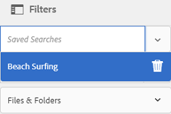

# Verzamelingen beheren {#managing-collections}

Een verzameling is een set elementen in Adobe Experience Manager (AEM)-middelen. Gebruik verzamelingen om elementen tussen gebruikers te delen.

* Een verzameling kan elementen van verschillende locaties bevatten.
* U kunt verzamelingen delen met verschillende gebruikers waaraan verschillende niveaus van bevoegdheden zijn toegewezen, zoals weergeven, bewerken, enzovoort.

U kunt meerdere verzamelingen delen met een gebruiker. Elke verzameling bevat verwijzingen naar elementen. De referentiële integriteit van activa wordt gehandhaafd over inzamelingen.

De inzamelingen zijn van de volgende types, die op de manier worden gebaseerd zij activa sorteren:

* Een verzameling die een statische referentielijst bevat van elementen, mappen en andere verzamelingen

* Een slimme verzameling die dynamisch elementen bevat op basis van zoekcriteria

## Navigeren door de verzamelingsconsole {#navigating-the-collections-console}

De **[!UICONTROL Collections]** -console openen:

1. Tik of klik op het AEM-logo.
1. Ga op de navigatiepagina naar **[!UICONTROL Middelen]** > **[!UICONTROL Verzamelingen]**. De **[!UICONTROL Collections]** -console wordt weergegeven.

## Een verzameling maken {#creating-a-collection}

U kunt een verzameling maken met [statische verwijzingen](#creating-a-collection-with-static-references) of op basis van een op [zoekcriteria gebaseerd filter](#creating-a-smart-collection). U kunt ook een verzameling maken van een lichtbak.

### Een verzameling met statische verwijzingen maken {#creating-a-collection-with-static-references}

U kunt een verzameling maken met statische verwijzingen, bijvoorbeeld een verzameling met verwijzingen naar elementen, mappen, verzamelingen, centrifuges en afbeeldingssets.

1. Navigeer naar de **[!UICONTROL Collections]** -console.
1. Tik op de werkbalk of klik op **[!UICONTROL Maken]**.
1. Voer op de pagina **[!UICONTROL Verzameling]** maken een titel en een optionele beschrijving in voor de verzameling.
1. Voeg leden toe aan de verzameling en wijs de juiste machtigingen toe. U kunt ook **[!UICONTROL Openbare verzameling]** selecteren om alle gebruikers toegang tot de verzameling te geven.

   >[!NOTE]
   >
   >Om de leden toe te laten om inzamelingen met andere gebruikers te delen, verstrek de `dam-users` groep lees toestemmingen bij de weg `home/users`. Geef gebruikers op de `/content/dam/collections` locatie toestemming om de verzamelingen in pop-uplijsten weer te geven. U kunt de gebruiker ook deel laten uitmaken van een `dam-users` groep.

1. (Optioneel) Voeg een miniatuurafbeelding toe voor de verzameling.
1. Tik/klik op **[!UICONTROL Maken]** en tik/klik op **[!UICONTROL OK]** om het dialoogvenster te sluiten. Een inzameling met de gespecificeerde titel en de eigenschappen wordt geopend in de console van Inzamelingen.

   >[!NOTE]
   >
   >Met AEM-middelen kunt u controletaken voor een verzameling maken, vergelijkbaar met de manier waarop u overzichtstaken voor een map met middelen maakt.

   Navigeer naar de gebruikersinterface Elementen om elementen aan de verzameling toe te voegen. Zie Elementen [toevoegen aan een verzameling](/help/assets/managing-collections-touch-ui.md#adding-assets-to-a-collection)voor meer informatie.

### Verzamelingen maken met dropzone {#create-collections-using-dropzone}

U kunt elementen van de interface Elementen naar een verzameling slepen. U kunt ook een kopie van een verzameling maken en de elementen daar slepen.

1. Selecteer in de interface Elementen de elementen die u aan een verzameling wilt toevoegen.
1. Sleep de elementen naar de zone **[!UICONTROL Drop in Collection]** .

   

   Laat de muisknop los wanneer de Dropzone actief wordt en het label verandert in **[!UICONTROL Daling in Toevoegen]**.

   

   U kunt ook op het pictogram **[!UICONTROL Naar verzameling]** op de werkbalk tikken of erop klikken.

   

1. Tik of klik op het pictogram Verzameling **** maken op de werkbalk op de pagina Toevoegen aan verzameling **** .

   Als u de elementen aan een bestaande verzameling wilt toevoegen, selecteert u deze op de pagina en tikt u op **[!UICONTROL Toevoegen]**. Standaard is de laatst bijgewerkte verzameling geselecteerd.

1. Geef een naam voor de verzameling op in het dialoogvenster Nieuwe verzameling **** maken. Als u wilt dat de verzameling toegankelijk is voor alle gebruikers, selecteert u **[!UICONTROL Openbare verzameling]**.
1. Tik/klik op **[!UICONTROL Doorgaan]** om de verzameling te maken.

### Een slimme verzameling maken {#creating-a-smart-collection}

Een slimme verzameling gebruikt zoekcriteria om elementen dynamisch te vullen. U kunt een slimme verzameling alleen maken met behulp van bestanden en niet met behulp van mappen of bestanden en mappen.

1. Navigeer naar de interface Middelen en tik op het pictogram **[!UICONTROL Zoeken]** .
1. Typ het trefwoord in het vak Zoeken en druk op Enter. Tik/klik op het pictogram GlobalNav om het deelvenster Filters weer te geven en een zoekfilter toe te passen vanuit het deelvenster Zoeken.
1. Selecteer **[!UICONTROL Bestanden]** in de lijst **[!UICONTROL Bestanden en mappen]**.

   

1. Tik/klik op **[!UICONTROL Slimme verzameling]** opslaan.
1. Geef een naam op voor de verzameling. Selecteer **[!UICONTROL Openbaar]** om de groep DAM-gebruikers met de Viewer-rol toe te voegen aan de slimme verzameling.

   

   >[!NOTE]
   >
   >Als u **[!UICONTROL Openbaar]** selecteert, wordt de slimme verzameling beschikbaar voor iedereen met de rol Eigenaar nadat u deze hebt gemaakt.
   >
   >
   >Als u de optie **[!UICONTROL Openbaar]** uitschakelt, wordt de DAM-gebruikersgroep niet meer gekoppeld aan de slimme verzameling.

1. Tik/klik op **[!UICONTROL Opslaan]** om de slimme verzameling te maken en sluit het berichtvenster om het proces te voltooien.

   De nieuwe slimme verzameling wordt ook toegevoegd aan de lijst **[!UICONTROL Opgeslagen zoekopdrachten]** .

   

   Het label van de knop **[!UICONTROL Slimme selectie]** maken verandert in Slimme selectie **[!UICONTROL bewerken]**. Als u de instellingen van de slimme verzameling wilt bewerken, selecteert u **[!UICONTROL Bestanden]** in de lijst **[!UICONTROL Bestanden en mappen]** . Tik vervolgens op de knop Slimme selectie **** bewerken of klik erop.

   

## Elementen toevoegen aan een verzameling {#adding-assets-to-a-collection}

U kunt elementen toevoegen aan een verzameling die een lijst met bestanden of mappen waarnaar wordt verwezen, bevat.

>[!NOTE]
>
>Slimme verzamelingen gebruiken een zoekquery om elementen te vullen. Daarom zijn statische verwijzingen naar elementen en mappen niet op hen van toepassing.

1. In Elementen UI, navigeer aan de plaats van de activa die u aan een inzameling wilt toevoegen.
1. Selecteer het element en tik/klik op het pictogram **[!UICONTROL Naar verzameling]** op de werkbalk.

   

   U kunt het element ook naar de zone **[!UICONTROL Inzameling]** neerzetten slepen. Laat de muisknop los wanneer de neerzetzone actief wordt en het label verandert in **[!UICONTROL Slagen in Toevoegen]**.

1. Selecteer op de pagina **[!UICONTROL Toevoegen aan verzameling]** de verzameling waaraan u het element wilt toevoegen.
1. Tik/klik op **[!UICONTROL Toevoegen]** en sluit het bevestigingsbericht. Het element wordt toegevoegd aan de collectie.

## Een slimme verzameling bewerken {#editing-a-smart-collection}

Slimme verzamelingen worden gemaakt door een zoekopdracht op te slaan, zodat u de inhoud kunt wijzigen door de zoekparameters van de [opgeslagen zoekopdracht](#editing-saved-searches)te wijzigen.

1. Tik in de interface Middelen op het pictogram **[!UICONTROL Zoeken]** op de werkbalk.

   

1. Met de curseur in het vakje van het Onderzoek, duw op de sleutel van de Terugkeer.
1. Tik/klik op het pictogram GlobalNav om het deelvenster Filters weer te geven.
1. Selecteer in de lijst **[!UICONTROL Opgeslagen zoekopdrachten]** de slimme verzameling die u wilt wijzigen. In het deelvenster Zoeken worden de filters weergegeven die zijn geconfigureerd voor de opgeslagen zoekopdracht.

   

1. Selecteer **[!UICONTROL Bestanden]** in de lijst **[!UICONTROL Bestanden en mappen]**.
1. Wijzig desgewenst een of meer filters. Tik/klik op Slimme verzameling **** bewerken.

   U kunt ook de naam van de slimme verzameling bewerken.

   

1. Tik/klik op **[!UICONTROL Opslaan]**. Het dialoogvenster Slimme verzameling **** bewerken wordt geopend.
1. Tik/klik op **[!UICONTROL Overschrijven]** om de originele slimme verzameling te vervangen door de bewerkte verzameling. Of selecteer **[!UICONTROL Opslaan als]** om de bewerkte verzameling afzonderlijk op te slaan.
1. Tik in het bevestigingsvenster op **[!UICONTROL Opslaan]** of klik op Opslaan om het proces te voltooien.

## Metagegevens van verzamelingen weergeven en bewerken {#viewing-and-editing-collection-metadata}

De meta-gegevens van de inzameling omvat gegevens over de inzameling, met inbegrip van om het even welke markeringen die worden toegevoegd.

1. Selecteer een verzameling in de verzamelingsconsole en tik op het pictogram **[!UICONTROL Eigenschappen]** op de werkbalk.
1. Op de pagina Metagegevens **[!UICONTROL van de]** Inzameling, bekijk de inzamelingsmeta-gegevens van de **[!UICONTROL Basis]** en de **Geavanceerde** lusjes.
1. Wijzig desgewenst de metagegevens en tik/klik op **[!UICONTROL Opslaan en sluiten]** op de werkbalk om de wijzigingen op te slaan.

### Metagegevens van verzamelingen bulksgewijs bewerken {#editing-collection-metadata-in-bulk}

U kunt de metagegevens van meerdere verzamelingen tegelijk bewerken. Deze functionaliteit helpt u snel gemeenschappelijke meta-gegevens in veelvoudige inzamelingen te herhalen.

1. Selecteer twee of meer verzamelingen waarvoor u metagegevens wilt bewerken in de console Verzamelingen.
1. Tik op of klik op het pictogram **[!UICONTROL Eigenschappen]** op de werkbalk.
1. Bewerk desgewenst de metagegevens op de pagina Metagegevens **** verzameling onder de tabbladen **[!UICONTROL Standaard]** en **[!UICONTROL Geavanceerd]** .
1. Tik/klik op **[!UICONTROL Opslaan en sluiten]** op de werkbalk en sluit het bevestigingsvenster om het proces te voltooien.
1. Als u de nieuwe metagegevens wilt toevoegen aan de bestaande metagegevens, selecteert u de modus **[!UICONTROL Toevoegen]**. Als u deze optie niet selecteert, worden de bestaande metagegevens in de velden vervangen door de nieuwe metagegevens. Tik/klik op **[!UICONTROL Verzenden]**.

   >[!NOTE]
   >
   >De modus Toevoegen werkt alleen voor velden die meerdere waarden kunnen bevatten. Voor velden die slechts één waarde kunnen bevatten, worden de nieuwe metagegevens niet toegevoegd aan de bestaande waarde in het veld, zelfs niet als u de modus **** Toevoegen selecteert.

## Verzamelingen zoeken {#searching-collections}

U kunt inzamelingen van de console van Inzamelingen zoeken. Wanneer u met trefwoorden in het vak Zoeken zoekt, zoekt AEM-middelen naar verzamelingsnamen, metagegevens en de tags die aan de verzamelingen zijn toegevoegd.

Als u zoekt naar verzamelingen op het hoogste niveau, worden alleen afzonderlijke verzamelingen geretourneerd in zoekresultaten. Elementen of mappen in de verzamelingen zijn uitgesloten. In alle andere gevallen (bijvoorbeeld in een afzonderlijke verzameling of in een mappenhiërarchie) worden alle relevante elementen, mappen en verzamelingen geretourneerd.

## Zoeken in verzamelingen {#searching-within-collections}

Tik of klik op een verzameling in de verzamelingsconsole om deze te openen.

In een verzameling is het zoeken naar AEM-middelen beperkt tot elementen (en de bijbehorende tags en metagegevens) in de verzameling die u bekijkt. Wanneer u in een map zoekt, worden alle overeenkomende elementen en onderliggende mappen in de huidige map geretourneerd. Wanneer u in een verzameling zoekt, worden alleen overeenkomende elementen, mappen en andere verzamelingen geretourneerd die directe leden van de verzameling zijn.

## Verzamelingsinstellingen bewerken {#editing-collection-settings}

U kunt verzamelingsinstellingen bewerken, zoals titel en beschrijving, of leden toevoegen aan een verzameling.

1. Selecteer een verzameling en tik op het pictogram **[!UICONTROL Instellingen]** op de werkbalk. U kunt ook de snelle actie **[!UICONTROL Instellingen]** van de miniatuur van de verzameling gebruiken.
1. Wijzig de verzamelingsinstellingen op de pagina **[!UICONTROL Verzamelingsinstellingen]** . U kunt bijvoorbeeld de titel van de verzameling, beschrijvingen, leden en machtigingen wijzigen zoals beschreven in [Verzamelingen](#creating-a-collection)toevoegen.

1. Tik/klik op **[!UICONTROL Opslaan]** om de wijzigingen op te slaan.

## Een verzameling verwijderen {#deleting-a-collection}

1. Selecteer een of meer verzamelingen in de console Verzamelingen en tik op het pictogram Verwijderen op de werkbalk.

   

1. Tik/klik in het dialoogvenster op **[!UICONTROL Verwijderen]** om de verwijderactie te bevestigen.

   >[!NOTE]
   >
   >U kunt slimme verzamelingen ook verwijderen door opgeslagen zoekopdrachten [te verwijderen](#deleting-saved-searches).

## Een verzameling downloaden {#downloading-a-collection}

Wanneer u een verzameling downloadt, wordt de volledige hiërarchie van elementen in de verzameling gedownload, inclusief mappen en onderliggende verzamelingen.

1. Selecteer een of meer verzamelingen die u wilt downloaden in de console Verzamelingen.
1. Tik op of klik op het downloadpictogram op de werkbalk.
1. Tik/klik op **[!UICONTROL Downloaden]** in het dialoogvenster **[!UICONTROL Downloaden]**. Selecteer **[!UICONTROL Uitvoeringen]** als u de uitvoeringen van de elementen in de verzameling wilt downloaden. Selecteer de optie **[!UICONTROL E-mail]** om een e-mailbericht naar de eigenaar van de verzameling te verzenden.

   Wanneer u een verzameling selecteert die u wilt downloaden, wordt de volledige maphiërarchie onder de verzameling gedownload. Als u elke verzameling die u downloadt (inclusief elementen in onderliggende verzamelingen die onder de bovenliggende verzameling zijn genest), wilt opnemen in een afzonderlijke map, selecteert u **[!UICONTROL Een aparte map maken voor elk element]**.

## Geneste verzamelingen maken {#creating-nested-collections}

U kunt een verzameling toevoegen aan een andere verzameling en zo een geneste verzameling maken.

1. Selecteer in de verzamelingsconsole de gewenste verzameling of groep verzamelingen en tik of klik op het pictogram **[!UICONTROL Naar verzameling]** op de werkbalk.

   

1. Selecteer op de pagina **[!UICONTROL Toevoegen aan verzameling]** de verzameling waarin u de verzameling wilt toevoegen.

   >[!NOTE]
   >
   >De laatst bijgewerkte verzameling is standaard geselecteerd in de pagina **[!UICONTROL Toevoegen aan verzameling]** .

1. Tik/klik op **[!UICONTROL Toevoegen]**. Een bericht bevestigt dat de inzameling aan de doelinzameling in de **[!UICONTROL Uitgezochte pagina van de Bestemming]** wordt toegevoegd. Sluit het bericht om het proces te voltooien.

>[!NOTE]
>
>Slimme verzamelingen kunnen niet worden genest. Met andere woorden, slimme verzamelingen kunnen geen andere verzameling bevatten.

## Opgeslagen zoekopdrachten {#saved-searches}

In de interface Elementen kunt u op basis van bepaalde regels, zoekcriteria of aangepaste zoekfacetten zoeken of filteren. Als u deze opslaat als **[!UICONTROL Opgeslagen zoekopdrachten]**, kunt u ze later openen via de lijst **[!UICONTROL Opgeslagen zoekopdrachten]** in het deelvenster Filter. Als u een opgeslagen zoekopdracht maakt, maakt u ook een slimme verzameling.

### Opgeslagen zoekopdrachten maken {#creating-saved-searches}

Opgeslagen zoekopdrachten worden gemaakt wanneer u een slimme verzameling maakt. Slimme verzamelingen worden automatisch toegevoegd aan de lijst **[!UICONTROL Opgeslagen zoekopdrachten]** . De opgeslagen vraag van Zoekopdrachten voor de inzameling wordt bewaard in het `dam:query` bezit in crxde bij de relatieve plaats `/content/dam/collections/`.

>[!NOTE]
>
>U kunt slimme verzamelingen op dezelfde manier delen als statische verzamelingen.

### Opgeslagen zoekopdrachten bewerken {#editing-saved-searches}

Opgeslagen zoekopdrachten bewerken is hetzelfde als slimme verzamelingen bewerken. Zie Een slimme verzameling bewerken voor meer informatie.

### Opgeslagen zoekopdrachten verwijderen {#deleting-saved-searches}

1. Navigeer naar de interface Middelen en tik op het pictogram Zoeken op de werkbalk.

   

1. Met de curseur in het Universeel vakje van het Onderzoek, duw op de sleutel van de Terugkeer.
1. Klik of tik op het GlobalNav-pictogram om het deelvenster Filters weer te geven.

1. Tik in de lijst **[!UICONTROL Opgeslagen zoekopdrachten]** op **[!UICONTROL Verwijderen]** naast de slimme verzameling die u wilt verwijderen.

   

1. Tik in het dialoogvenster op **[!UICONTROL Verwijderen]** om de opgeslagen zoekopdracht te verwijderen.

## Een workflow op een verzameling uitvoeren {#running-a-workflow-on-a-collection}

U kunt een workflow voor de elementen in een verzameling uitvoeren. Als de verzameling geneste verzamelingen bevat, wordt de workflow ook uitgevoerd op de elementen in de geneste verzamelingen. Als de verzameling en de geneste verzameling echter dubbele elementen bevatten, wordt de workflow slechts eenmaal uitgevoerd voor dergelijke elementen.

1. Selecteer in de console Verzamelingen een verzameling waarop u een workflow wilt uitvoeren.
1. Tik/klik op het pictogram GlobalNav en kies **[!UICONTROL Tijdlijn]** in de lijst.
1. Klik of tik vanaf de tijdlijn op het pictogram Caret onderaan en tik vervolgens op Workflow **** starten.

   

1. Selecteer in de sectie **[!UICONTROL Workflow]** starten een workflowmodel in de lijst. Selecteer bijvoorbeeld het model **[!UICONTROL DAM Update Asset]** .
1. Voer een titel in voor de workflow en tik op **[!UICONTROL Start]**/klik op Start.
1. Tik/klik op **[!UICONTROL Doorgaan in het dialoogvenster]**. De workflow wordt uitgevoerd op alle elementen in de verzameling.

>[!MORELIKETHIS]
>
>* [E-mailberichten voor AEM Assets configureren](/help/sites-administering/notification.md#assetsconfig)
>* [Eigenschappen van metagegevens van meerdere verzamelingen bewerken](/help/assets/managing-multiple-assets.md)
>* [Een revisietaak maken voor verzamelingen](/help/assets/bulk-approval.md)

