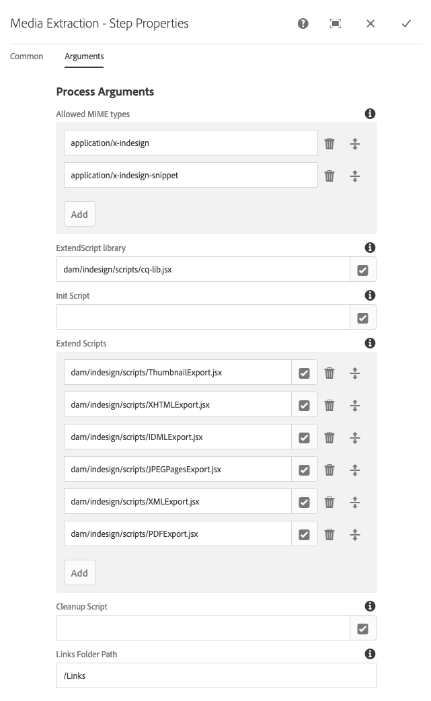
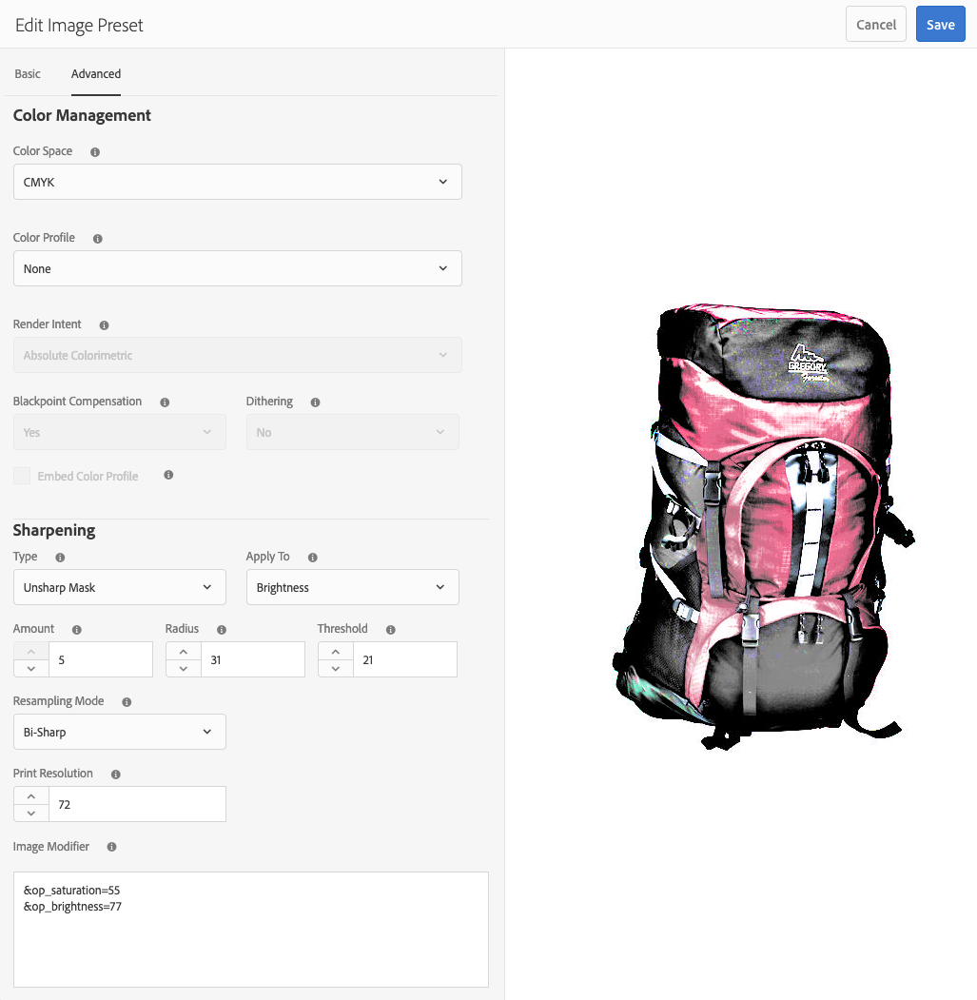
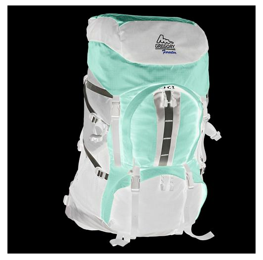
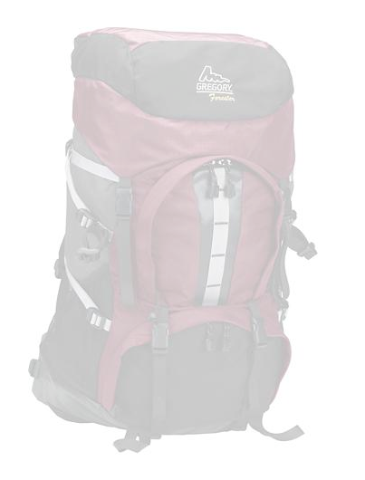

# Dynamic Media-voorinstellingen voor afbeeldingen beheren{#managing-image-presets}

Met voorinstellingen voor afbeeldingen kan Adobe Experience Manager Assets dynamisch afbeeldingen van verschillende grootten, in verschillende indelingen of met andere afbeeldingseigenschappen leveren die dynamisch worden gegenereerd. Elke voorinstelling voor afbeeldingen vertegenwoordigt een vooraf gedefinieerde verzameling opdrachten voor het vergroten of verkleinen en opmaken van afbeeldingen. Wanneer u een voorinstelling voor afbeeldingen maakt, kiest u een grootte voor het leveren van de afbeelding. U kiest ook opmaakopdrachten, zodat de weergave van de afbeelding wordt geoptimaliseerd wanneer de afbeelding wordt geleverd voor weergave.

Beheerders kunnen voorinstellingen maken voor het exporteren van elementen. Gebruikers kunnen bij het exporteren van afbeeldingen een voorinstelling kiezen die de afbeeldingen opnieuw opmaakt volgens de specificaties die de beheerder heeft opgegeven.

U kunt ook voorinstellingen voor afbeeldingen maken die reageren. Als u een voorinstelling voor een responsieve afbeelding toepast op uw elementen, worden deze afhankelijk van het apparaat of de schermgrootte waarop ze worden weergegeven. U kunt afbeeldingsvoorinstellingen zo configureren dat naast RGB of Grijs ook CMYK in de kleurruimte wordt gebruikt.

In deze sectie wordt beschreven hoe u voorinstellingen voor afbeeldingen maakt, wijzigt en over het algemeen beheert. U kunt een voorinstelling voor afbeeldingen op elk gewenst moment op een afbeelding toepassen. Zie [Voorinstellingen afbeelding toepassen](/help/assets/image-presets.md).

>[!NOTE]
>
>Slimme beeldverwerking werkt met bestaande voorinstellingen voor afbeeldingen en maakt gebruik van intelligentie tijdens de laatste milliseconde van levering om de bestandsgrootte van de afbeelding verder te beperken op basis van de snelheid van de browser of netwerkverbinding. Zie [Slimme afbeeldingen](/help/assets/imaging-faq.md) voor meer informatie .

## Voorinstellingen voor Dynamic Media-afbeeldingen {#understanding-image-presets}

Net als bij een macro is een voorinstelling voor afbeeldingen een vooraf gedefinieerde verzameling opdrachten voor het vergroten of verkleinen en opmaken van de grootte die onder een naam zijn opgeslagen. Als u wilt weten hoe Voorinstellingen afbeelding werken, veronderstelt u dat elke productafbeelding op uw website moet worden weergegeven in verschillende formaten, formaten en compressiesnelheden voor levering op de desktopcomputer en op mobiele apparatuur.

>[!NOTE]
>
>In de modus Dynamic Media - Scene7 worden afbeeldingsvoorinstellingen alleen ondersteund voor afbeeldingselementen.

U kunt twee voorinstellingen voor afbeeldingen maken: een met 500 x 500 pixels voor de desktopversie en 150 x 150 pixels voor de mobiele versie. U maakt twee voorinstellingen voor afbeeldingen, die u één voorinstelling noemt `Enlarge` om afbeeldingen weer te geven op 500 x 500 pixels en één opgeroepen `Thumbnail` om afbeeldingen weer te geven op 150 x 150 pixels. Als u afbeeldingen wilt leveren op de `Enlarge` en `Thumbnail` grootte, zoekt de Experience Manager omhoog de definitie van de Voorinstelling Afbeelding vergroten en de Voorinstelling Miniatuurafbeelding. Vervolgens genereert Experience Manager dynamisch een afbeelding met de grootte en opmaakspecificaties van elke voorinstelling voor afbeeldingen.

Afbeeldingen die bij dynamische levering kleiner worden gemaakt, kunnen scherper en gedetailleerder worden. Daarom bevat elke voorinstelling voor afbeeldingen opmaakbesturingselementen waarmee u een afbeelding kunt optimaliseren wanneer deze met een bepaalde grootte wordt geleverd. Met deze besturingselementen zorgt u ervoor dat uw afbeeldingen scherp en duidelijk zijn wanneer ze aan uw website of toepassing worden geleverd.

Beheerders kunnen voorinstellingen voor afbeeldingen maken. Als u een voorinstelling voor een afbeelding wilt maken, begint u helemaal opnieuw of u kunt een bestaande voorinstelling beginnen en opslaan onder een andere naam.

## Dynamic Media-voorinstellingen voor afbeeldingen beheren {#managing-image-presets-1}

U beheert uw voorinstellingen voor afbeeldingen in Experience Manager door te tikken op het logo van de Experience Manager of erop te klikken om de algemene navigatieconsole te openen, vervolgens te tikken of te klikken op het pictogram Gereedschappen en naar **[!UICONTROL Assets > Image Presets]**.


>[!NOTE]
>
>Alle afbeeldingsvoorinstellingen die u maakt, zijn ook beschikbaar als dynamische uitvoeringen wanneer u elementen voorvertoont of levert.
>
>In *Dynamic Media - Scene7-modus*, doet u dat *niet* moeten voorinstellingen voor afbeeldingen publiceren als voorinstellingen voor afbeeldingen automatisch worden gepubliceerd.
>
>In *Dynamic Media - Hybride modus* moet u voorinstellingen voor afbeeldingen handmatig publiceren.
>
>Zie [Voorinstellingen voor afbeeldingen publiceren](#publishing-image-presets).

>[!NOTE]
>
>Het systeem toont verschillende vertoningen wanneer u selecteert **[!UICONTROL Renditions]** in de detailweergave van een element. U kunt het aantal voorinstellingen voor afbeeldingen dat wordt weergegeven, verhogen of verlagen. Zie [Het aantal voorinstellingen voor afbeeldingen dat wordt weergegeven verhogen](#increasing-or-decreasing-the-number-of-image-presets-that-display).

### Smart crop, Adobe Illustrator (AI), Postscript (EPS) en PDF-bestandsindelingen {#adobe-illustrator-ai-postscript-eps-and-pdf-file-formats}

>[!NOTE]
>
>Dit onderwerp is van toepassing op Dynamic Media - Hybride wijze slechts.

Als u de opname van AI-, EPS- en PDF-bestanden wilt ondersteunen, zodat u dynamische uitvoeringen van deze bestandsindelingen kunt genereren, controleert u de volgende informatie voordat u voorinstellingen voor afbeeldingen maakt.

Adobe Illustrator-bestandsindeling is een variant van PDF. De belangrijkste verschillen in de context van Experience Manager Assets zijn:

* Adobe Illustrator-documenten bestaan uit één pagina met meerdere lagen. Elke laag wordt geëxtraheerd als een PNG-subelement onder het Illustrator-hoofdelement.
* PDF-documenten bestaan uit een of meer pagina&#39;s. Elke pagina wordt geëxtraheerd als een PDF-subelement van één pagina onder het PDF-hoofddocument met meerdere pagina&#39;s.

De subassets worden gemaakt door de `Create Sub Asset process` binnen het algemene `DAM Update Asset` workflow. Selecteer **[!UICONTROL Tools]** > **[!UICONTROL Workflow]** > **[!UICONTROL Models]** > **[!UICONTROL DAM Update Asset]** > **[!UICONTROL Edit]**.

Zie ook [Pagina&#39;s van een bestand met meerdere pagina&#39;s weergeven](/help/assets/managing-linked-subassets.md#view-pages-of-a-multi-page-file).

U kunt de submiddelen of de pagina&#39;s bekijken wanneer u het element opent, het menu Inhoud selecteert en **[!UICONTROL Subassets]** of **[!UICONTROL Pages]**. De subelementen zijn echte elementen. Met andere woorden: PDF-pagina&#39;s worden door de `Create Sub Asset` workflowcomponent. Zij worden dan opgeslagen zoals `page1.pdf`, `page2.pdf`, enzovoort, onder het hoofdactief. Nadat ze zijn opgeslagen, `DAM Update Asset` deze werkstromen verwerken.

Als u Dynamic Media wilt gebruiken om dynamische uitvoeringen voor AI-, EPS- of PDF-bestanden voor te vertonen en te genereren, moet u de volgende verwerkingsstappen uitvoeren:

1. In de `DAM Update Asset` werkschema, de `Rasterize PDF/AI Image Preview Rendition` procescomponent rasterizes de eerste pagina van origineel element-gebruikend gevormde resolutie-in `cqdam.preview.png` uitvoering.

1. De `cqdam.preview.png` uitvoering wordt vervolgens geoptimaliseerd in een PTIFF-bestand door de `Dynamic Media Process Image Assets` procescomponent in de workflow.

>[!NOTE]
>
>In de [!UICONTROL DAM Update Asset] werkschema, de **[!UICONTROL EPS thumbnails]** worden miniaturen voor EPS-bestanden gegenereerd.

#### Eigenschappen van PDF/AI/EPS-metagegevens {#pdf-ai-eps-asset-metadata-properties}

| **Eigenschap Metadata** | **Beschrijving** |
|---|---|
| `dam:Physicalwidthininches` | Documentbreedte in inches. |
| `dam:Physicalheightininches` | Documenthoogte in inches. |

U hebt toegang `Rasterize PDF/AI Image Preview Rendition` procescomponentopties als `DAM Update Asset` workflow.

Selecteer in de linkerbovenhoek Adobe Experience Manager en navigeer naar **[!UICONTROL Tools]** > **[!UICONTROL Workflow]** > **[!UICONTROL Models]**. Selecteer op de pagina Workflowmodellen de optie **[!UICONTROL DAM Update Asset]** selecteert u vervolgens op de werkbalk **[!UICONTROL Edit]**. Op de [!UICONTROL DAM Update Asset] werkstroompagina, selecteert u de `Rasterize PDF/AI Image Preview Rendition` procescomponent om het dialoogvenster Step Properties te openen.

#### Opties van PDF/AI-voorvertoning van afbeelding omzetten in pixels {#rasterize-pdf-ai-image-preview-rendition-options}


Argumenten voor het rasteren van PDF- of AI-workflow

<table>
 <tbody>
  <tr>
   <td><strong>Procesargument</strong></td>
   <td><strong>Standaardinstelling</strong></td>
   <td><strong>Beschrijving</strong></td>
  </tr>
  <tr>
   <td>MIME-typen</td>
   <td><p>application/pdf</p> <p>application/postscript</p> <p>toepassing/illustrator<br /> </p> </td>
   <td>Lijst met documentmime-typen die worden beschouwd als PDF- of Illustrator-documenten.<br /> </td>
  </tr>
  <tr>
   <td>Max. breedte</td>
   <td>2048</td>
   <td>Maximale breedte van de gegenereerde voorvertoning, in pixels.<br /> </td>
  </tr>
  <tr>
   <td>Max. hoogte</td>
   <td>2048</td>
   <td>Maximumhoogte van de gegenereerde voorvertoning, in pixels.<br /> </td>
  </tr>
  <tr>
   <td>Resolutie</td>
   <td>72</td>
   <td>Resolutie voor het rasteren van de eerste pagina, in ppi (pixels per inch).</td>
  </tr>
 </tbody>
</table>

Met de standaardprocesargumenten wordt de eerste pagina van een PDF/AI-document gerasterd met 72 ppi en de gegenereerde voorvertoning met een grootte van 2048 x 2048 pixels. Voor een gebruikelijke implementatie kunt u de resolutie verhogen tot minimaal 150 ppi of meer. Een document met een tekengrootte van 300 ppi in de VS vereist bijvoorbeeld een maximale breedte en hoogte van respectievelijk 2550 x 3300 pixels.

Met Maximale breedte en Maximumhoogte kunt u de resolutie beperken waarbij u de afbeelding wilt rasteren. Als de maximale waarden bijvoorbeeld ongewijzigd blijven en de resolutie is ingesteld op 300 ppi, wordt een US Letter-document gerasterd naar 186 ppi. Het document is dus 1581 x 2046 pixels.

De `Rasterize PDF/AI Image Preview Rendition` procescomponent heeft een maximum gedefinieerd om ervoor te zorgen dat er geen te grote afbeeldingen in het geheugen worden gemaakt. Zulke grote afbeeldingen kunnen het geheugen overlopen dat aan de JVM (Java™ Virtual Machine) wordt geleverd. Er moet op worden gelet dat de JVM over voldoende geheugen beschikt om het geconfigureerde aantal parallelle workflows te beheren, waarbij elk van beide de mogelijkheid heeft om een image op de maximaal geconfigureerde grootte te maken.

### InDesign-bestandsindeling (INDD) {#indesign-indd-file-format}

Als u de opname van INDD-bestanden wilt ondersteunen, zodat u dynamische uitvoering van deze bestandsindeling kunt genereren, is het verstandig de volgende informatie te bekijken voordat u voorinstellingen voor afbeeldingen maakt.

Voor bestanden met InDesigns worden subelementen alleen geëxtraheerd als de Adobe InDesign Server is geïntegreerd met Experience Manager. Elementen waarnaar wordt verwezen, zijn gekoppeld op basis van hun metagegevens. InDesign Server is niet vereist voor koppelen. De middelen waarnaar wordt verwezen, moeten echter aanwezig zijn in de Experience Manager voordat de bestanden met InDesigns worden verwerkt, zodat de koppelingen tussen de bestanden met InDesigns en de elementen waarnaar wordt verwezen, worden gemaakt.

Zie [Experience Manager Assets integreren met InDesign Server](/help/assets/indesign.md).

De procescomponent Media Extraction in het dialoogvenster `DAM Update Asset` in de workflow worden verschillende vooraf geconfigureerde Extend Scripts uitgevoerd om InDesigns bestanden te verwerken.



De ExtendScript-paden in de argumenten van Media Extraction Process-component in het dialoogvenster [!UICONTROL DAM Update Asset] workflow.

De volgende scripts worden door Dynamic Media-integratie gebruikt:

<table>
 <tbody>
  <tr>
   <td><strong>ExtendScript-naam</strong></td>
   <td><strong>Standaard</strong></td>
   <td><strong>Beschrijving</strong></td>
  </tr>
  <tr>
   <td>ThumbnailExport.jsx</td>
   <td>Ja</td>
   <td>Genereert een 300-ppi <code>thumbnail.jpg</code> uitvoering die is geoptimaliseerd en door <code>Dynamic Media Process Image Assets</code> procescomponent.<br /> </td>
  </tr>
  <tr>
   <td>JPEGPagesExport.jsx</td>
   <td>Ja</td>
   <td>Genereert een subelement van 300 ppi JPEG voor elke pagina. Het JPEG-submiddel is een echt middel dat is opgeslagen onder het InDesign-element. Het wordt ook geoptimaliseerd en door de <code>DAM Update Asset</code> workflow.<br /> </td>
  </tr>
  <tr>
   <td>PDFPagesExport.jsx</td>
   <td>Nee</td>
   <td>Hiermee genereert u een PDF-subelement voor elke pagina. Het PDF-subelement wordt verwerkt zoals eerder beschreven. Omdat de PDF slechts één pagina bevat, worden geen subelementen gegenereerd.<br /> </td>
  </tr>
 </tbody>
</table>

## Miniatuurgrootte van afbeelding configureren {#configuring-image-thumbnail-size}

U kunt de grootte van miniaturen configureren door de instellingen in het dialoogvenster **[!UICONTROL DAM Update Asset]** workflow. De workflow bevat twee stappen waarmee u de miniatuurgrootte van afbeeldingselementen kunt configureren. Hoewel (**[!UICONTROL Dynamic Media Process Image Assets]**) wordt gebruikt voor dynamische afbeeldingselementen, en (**[!UICONTROL Process Thumbnails]**) is voor het genereren van statische miniaturen, of wanneer bij alle andere processen geen miniaturen worden gegenereerd; *beide* moeten dezelfde instellingen hebben.

Met de stap **[!UICONTROL Dynamic Media Process Image Assets]** worden miniaturen gegenereerd door de afbeeldingsserver en deze configuratie is onafhankelijk van de configuratie die op de stap **[!UICONTROL Process Thumbnails]** is toegepast. Het genereren van miniaturen via de stap **[!UICONTROL Process Thumbnails]** is de langzaamste en meest geheugenintensieve manier om miniaturen te maken.

Miniatuurgrootte wordt gedefinieerd in de volgende indeling: **`width:height:center`**, bijvoorbeeld `80:80:false`. De breedte en hoogte bepalen de grootte in pixels van de miniatuur. De middelste waarde is onwaar of true en als de waarde true is, wordt aangegeven dat de miniatuurafbeelding exact de grootte heeft die in de configuratie is opgegeven. Als de gewijzigde afbeelding kleiner is, wordt deze gecentreerd in de miniatuur.

>[!NOTE]
>
>* Miniatuurgrootten voor EPS-bestanden worden geconfigureerd in het dialoogvenster **[!UICONTROL EPS thumbnails]** stap, in de **[!UICONTROL Arguments]** onder Miniaturen.
>
>* Miniatuurgrootten voor video&#39;s worden geconfigureerd in het dialoogvenster **[!UICONTROL FFmpeg thumbnails]** stap, in de **[!UICONTROL Process]** tab onder **[!UICONTROL Arguments]**.
>

**De grootte van afbeeldingsminiaturen configureren:**

1. Selecteren **[!UICONTROL Tools]** > **[!UICONTROL Workflow]** > **[!UICONTROL Models]** > **[!UICONTROL DAM Update Asset]** > **[!UICONTROL Edit]**.
1. Selecteer de **[!UICONTROL Dynamic Media Process Image Assets]** en klik op de knop **[!UICONTROL Thumbnails]** tab. Wijzig desgewenst de miniatuurgrootte en selecteer **[!UICONTROL OK]**.

   

1. Selecteer de **[!UICONTROL Process Thumbnails]** stap selecteert u vervolgens de **[!UICONTROL Thumbnails]** tab. Wijzig desgewenst de miniatuurgrootte en selecteer **[!UICONTROL OK]**.

   >[!NOTE]
   >
   >De waarden in het argument voor miniaturen in de stap **[!UICONTROL Process Thumbnails]** moeten overeenkomen met het argument voor miniaturen in de stap **[!UICONTROL Dynamic Media Process Image Assets]**.

1. Selecteren **[!UICONTROL Save]** om de wijzigingen in de workflow op te slaan.

### Het aantal Dynamic Media-voorinstellingen voor afbeeldingen dat wordt weergegeven verhogen of verlagen {#increasing-or-decreasing-the-number-of-image-presets-that-display}

Afbeeldingsvoorinstellingen die u maakt, zijn beschikbaar als dynamische uitvoeringen wanneer u een voorvertoning van elementen weergeeft. Experience Manager geeft verschillende dynamische uitvoeringen weer wanneer een element wordt weergegeven vanuit **[!UICONTROL Detail View > Renditions]**. U kunt de limiet van weergegeven uitvoeringen verhogen of verlagen.

**Het aantal weergegeven Dynamic Media-voorinstellingen voor afbeeldingen vergroten of verkleinen:**

1. Navigeren naar CRXDE Lite ([https://localhost:4502/crx/de](https://localhost:4502/crx/de)).
1. Navigeer naar het knooppunt met vooraf ingestelde lijsten voor afbeeldingen op `/libs/dam/gui/coral/content/commons/sidepanels/imagepresetsdetail/imgagepresetslist`

   

1. Wijzig in de eigenschap **[!UICONTROL limit]** de **[!UICONTROL Value]**, die standaard op 15 is ingesteld, in het gewenste getal.
1. Navigeer naar de gegevensbron voor de afbeeldingsvoorinstelling op `/libs/dam/gui/coral/content/commons/sidepanels/imagepresetsdetail/imgagepresetslist/datasource`

   

1. Wijzig in de eigenschap limit het getal in het gewenste getal, bijvoorbeeld `{empty requestPathInfo.selectors[1] ? "20" : requestPathInfo.selectors[1]}`
1. Selecteren **[!UICONTROL Save All]**.

## Een Dynamic Media-voorinstelling voor afbeeldingen maken {#creating-image-presets}

Als u een Dynamic Media-voorinstelling voor afbeeldingen maakt, kunt u deze instellingen op alle afbeeldingen toepassen wanneer u een voorvertoning weergeeft of publiceert.

>[!NOTE]
>
>Als u Internet Explorer 9 gebruikt, wordt het maken van een voorinstelling niet meteen na het opslaan weergegeven in de lijst met voorinstellingen. U kunt dit probleem omzeilen door de cache voor IE9 uit te schakelen.

Als u de opname van AI-, PDF- en EPS-bestanden wilt ondersteunen, zodat u een dynamische uitvoering van deze bestandsindelingen kunt genereren, bekijkt u de volgende informatie voordat u voorinstellingen voor afbeeldingen maakt.
Zie [Adobe Illustrator- (AI), Postscript- (EPS) en PDF-bestandsindelingen](#adobe-illustrator-ai-postscript-eps-and-pdf-file-formats).

Als u de opname van INDD-bestanden wilt ondersteunen, zodat u dynamische uitvoering van deze bestandsindeling kunt genereren, is het verstandig de volgende informatie te bekijken voordat u voorinstellingen voor afbeeldingen maakt.
Zie [InDesign-bestandsindeling (INDD)](#indesign-indd-file-format).

>[!NOTE]
>
>Als u Dynamic Media-voorinstellingen voor afbeeldingen wilt maken, moet u beheerdersrechten hebben als Experience Manager- of Admin Console-beheerder.

**Een Dynamic Media-voorinstelling voor afbeeldingen maken:**

1. In Experience Manager, selecteer het embleem van de Experience Manager om tot de globale navigatieconsole toegang te hebben, dan selecteer **[!UICONTROL Tools]** > **[!UICONTROL Assets]** > **[!UICONTROL Image Presets]**.
1. Klik op **[!UICONTROL Create]**. De **[!UICONTROL Edit Image Preset]** wordt geopend.

   

   >[!NOTE]
   >
   >Als u deze voorinstelling responsief wilt maken, wist u de waarden in de velden **[!UICONTROL width]** en **[!UICONTROL height]** en laat u deze leeg.

1. Voer desgewenst waarden in op de tabbladen **[!UICONTROL Basic]** en **[!UICONTROL Advanced]**, inclusief een naam. De opties worden beschreven in [Opties voor afbeeldingsvoorinstellingen](#image-preset-options). Voorinstellingen worden weergegeven in het linkerdeelvenster en kunnen direct samen met andere assets worden gebruikt.

   

1. Klik op **[!UICONTROL Save]**.

## Een responsieve voorinstelling voor afbeeldingen maken {#creating-a-responsive-image-preset}

Als u een responsieve voorinstelling voor afbeeldingen wilt maken, voert u de stappen in [Voorinstellingen voor afbeeldingen maken](#creating-image-presets). Wanneer u de hoogte en breedte in het dialoogvenster **[!UICONTROL Edit Image Preset]** , wist de waarden en laat ze leeg.

Als u deze leeg laat, krijgt de Experience Manager de melding dat deze voorinstelling reageert. U kunt de andere waarden desgewenst aanpassen.


>[!NOTE]
>
>Als u de knoppen **[!UICONTROL URL]** en **[!UICONTROL RESS]** wilt zien wanneer u een voorinstelling voor een afbeelding op een asset toepast, moet de asset worden gepubliceerd.
>
>
>
>In de modus Dynamic Media - Scene7 worden afbeeldingsvoorinstellingen en afbeeldingselementen automatisch gepubliceerd.
>
>In Dynamic Media - hybride modus moet u handmatig voorinstellingen voor afbeeldingen en afbeeldingselementen publiceren.

### Voorinstellingsopties voor afbeelding {#image-preset-options}

Wanneer u voorinstellingen voor afbeeldingen maakt of bewerkt, worden de opties in deze sectie beschreven. Daarnaast raadt de Adobe aan om de volgende opties voor best practices te kiezen:

* **[!UICONTROL Format]** (**[!UICONTROL Basic]** tab) - Selecteer **[!UICONTROL JPEG]** of een andere indeling die aan uw vereisten voldoet. Alle webbrowsers ondersteunen de JPEG-afbeeldingsindeling. Deze biedt een goede balans tussen kleine bestandsgrootten en afbeeldingskwaliteit. JPEG-afbeeldingen gebruiken echter een compressieschema met dataverlies dat ongewenste afbeeldingsartefacten kan veroorzaken als de compressie-instelling te laag is. Daarom raadt Adobe aan de compressiekwaliteit in te stellen op 75. Deze instelling biedt een goede balans tussen afbeeldingskwaliteit en kleine bestandsgrootte.

* **[!UICONTROL Enable Simple Sharpening]** - Niet selecteren **[!UICONTROL Enable Simple Sharpening]** (dit verscherpingsfilter biedt minder controle dan de instellingen voor onscherpe maskering).

* **[!UICONTROL Sharpening: Resampling Mode]** - Selecteer **[!UICONTROL Sharp2]**.

#### Opties op het tabblad Standaard {#basic-tab-options}

<table>
 <tbody>
  <tr>
   <td><strong>Veld</strong></td>
   <td><strong>Beschrijving</strong></td>
  </tr>
  <tr>
   <td><strong>Naam</strong></td>
   <td>Voer een beschrijvende naam in zonder spaties. Neem de afbeeldingsgroottespecificatie op in de naam, zodat gebruikers deze voorinstelling voor afbeeldingen kunnen herkennen.</td>
  </tr>
  <tr>
   <td><strong>Breedte en Hoogte</strong></td>
   <td>Voer in pixels de grootte in waarmee de afbeelding wordt geleverd. De breedte en hoogte moeten groter zijn dan 0 pixels. Als een van deze waarden 0 is, wordt geen voorinstelling gemaakt. Als beide waarden leeg zijn, wordt een responsieve voorinstelling voor de afbeelding gemaakt.</td>
  </tr>
  <tr>
   <td><strong>Indeling</strong></td>
   <td><p>Kies een indeling in het menu.</p> <p>Kiezen <strong>JPEG</strong> biedt de volgende aanvullende opties:</p>
    <ul>
     <li><strong>Kwaliteit</strong> - Hiermee bepaalt u het compressieniveau JPEG. Deze instelling is van invloed op zowel de bestandsgrootte als de afbeeldingskwaliteit. De schaal van de kwaliteit van de JPEG is 1-100. De schaal is zichtbaar wanneer u de schuifregelaar versleept.</li>
     <li><strong>Downsampling van JPG-chrominantie inschakelen</strong> - Omdat het oog minder gevoelig is voor hoogfrequente kleurinformatie dan hoogfrequente luminantie, verdelen JPEG-afbeeldingen de afbeeldingsgegevens in luminantie en kleurcomponenten. Wanneer een JPEG-afbeelding wordt gecomprimeerd, blijft de luminantiecomponent op volledige resolutie staan, terwijl de kleurcomponenten worden gedownsampled door het gemiddelde te nemen van pixelgroepen. Door downsampling wordt het gegevensvolume met de helft of met een derde verminderd, zonder dat dit van invloed is op de waargenomen kwaliteit. Downsampling is niet van toepassing op grijswaardenafbeeldingen. Met deze techniek vermindert u de hoeveelheid compressie die handig is voor afbeeldingen met veel contrast (bijvoorbeeld afbeeldingen met overlappende tekst).</li>
    </ul>
    <div>
      Kiezen
     <strong>GIF</strong> of
     <strong>GIF met alfa</strong> verstrekt extra
     <strong>Kwantisering kleur GIF</strong> opties:
    </div>
    <ul>
     <li><strong>Type </strong>- Selecteer <strong>Aangepast</strong> (standaard), <strong>Web</strong>, of <strong>Macintosh</strong>. Als u <strong>GIF met Alpha</strong>, is de optie Macintosh niet beschikbaar.</li>
     <li><strong>Dithering</strong> - Selecteer <strong>Onscherp</strong> of <strong>Uit</strong>.</li>
     <li><strong>Aantal kleuren </strong>- Voer een getal in tussen 2 en 256.</li>
     <li><strong>Kleurenlijst</strong> - Voer een door komma's gescheiden lijst in. Voor wit, grijs en zwart voert u bijvoorbeeld de volgende gegevens in: <code>000000,888888,ffffff</code>.</li>
    </ul>
    <div>
      Kiezen
     <strong>PDF</strong>,
     <strong>TIFF</strong>, of
     <strong>TIFF met alpha</strong> biedt deze extra optie:
    </div>
    <ul>
     <li><strong>Compressie</strong> - Selecteer een compressiealgoritme. Algoritmeopties voor PDF zijn <strong>Geen</strong>, <strong>Postcode</strong>, en <strong>Jpeg</strong>; voor TIFF zijn de opties <strong>Geen</strong>, <strong>LZW</strong>, <strong>Jpeg</strong>, en <strong>Postcode</strong>; en voor TIFF met Alpha <strong>Geen</strong>, <strong>LZW</strong>, en <strong>Postcode</strong>.</li>
    </ul> <p>Kiezen <strong>PNG</strong>, <strong>PNG met Alpha,</strong> of <strong>EPS</strong> biedt geen aanvullende opties.</p> </td>
  </tr>
  <tr>
   <td><strong>Verscherpen</strong></td>
   <td>Selecteer de <strong>Eenvoudig verscherpen inschakelen</strong> gebruiken om een standaard verscherpingsfilter toe te passen op de afbeelding nadat alle schaling heeft plaatsgevonden. Verscherpen kan helpen de vervaging te compenseren die kan optreden wanneer u een afbeelding met een andere grootte weergeeft. </td>
  </tr>
 </tbody>
</table>

#### Opties op het tabblad Geavanceerd {#advanced-tab-options}

<table>
 <tbody>
  <tr>
   <td><strong>Veld</strong></td>
   <td><strong>Beschrijving</strong></td>
  </tr>
  <tr>
   <td><strong>Kleurruimte</strong></td>
   <td>Selecteren <strong>RGB, CMYK,</strong> of <strong>Grijswaarden</strong> voor de kleurruimte.</td>
  </tr>
  <tr>
   <td><strong>Kleurprofiel</strong></td>
   <td>Selecteer het kleurruimteprofiel van de uitvoer waarnaar het element moet worden geconverteerd als dit afwijkt van het werkprofiel.</td>
  </tr>
  <tr>
   <td><strong>Render-intentie</strong></td>
   <td>U kunt de standaard rendering intent overschrijven. Render-intenties bepalen wat er gebeurt met kleuren die niet in het doelkleurprofiel kunnen worden gereproduceerd (buiten kleuromvang). De render-intentie wordt genegeerd als deze niet compatibel is met het ICC-profiel.
    <ul>
     <li>Selecteren <strong>Perceptueel</strong> om de totale kleuromvang van de ene kleurruimte naar een andere kleurruimte te comprimeren wanneer een of meer kleuren in de oorspronkelijke afbeelding buiten de kleuromvang van de doelkleurruimte vallen.</li>
     <li>Selecteren <strong>Relatief colorimetrisch</strong> wanneer een kleur in de huidige kleurruimte buiten de kleuromvang valt in de doelkleurruimte. En u wilt deze toewijzen aan de dichtstbijzijnde mogelijke kleur binnen de kleuromvang van de doelkleurruimte zonder dat dit van invloed is op andere kleuren. </li>
     <li>Selecteren <strong>Verzadiging</strong> als u de oorspronkelijke kleurverzadiging van de afbeelding wilt reproduceren bij de omzetting in de doelkleurruimte. </li>
     <li>Selecteren <strong>Absoluut colorimetrisch</strong> om kleuren exact overeen te laten komen zonder aanpassing voor het witpunt of zwartpunt waardoor de helderheid van de afbeelding wordt gewijzigd.</li>
    </ul> </td>
  </tr>
  <tr>
   <td><strong>Compensatie zwartpunt</strong></td>
   <td>Selecteer deze optie als het uitvoerprofiel deze functie ondersteunt. Zwartpuntcompensatie wordt genegeerd als deze niet compatibel is met het opgegeven ICC-profiel.</td>
  </tr>
  <tr>
   <td><strong>Dithering</strong></td>
   <td>Selecteer deze optie als u kleurstreepvorming mogelijk wilt voorkomen of verminderen. </td>
  </tr>
  <tr>
   <td><strong>Verscherpingstype</strong></td>
   <td><p>Selecteren <strong>Geen</strong>, <strong>Verscherpen</strong>, of <strong>Onscherp masker</strong>. </p>
    <ul>
     <li>Selecteren <strong>Geen</strong> als u verscherpen wilt uitschakelen.</li>
     <li>Selecteren <strong>Verscherpen</strong> als u een standaard verscherpingsfilter wilt toepassen op de afbeelding nadat alle schaling heeft plaatsgevonden. Verscherpen kan helpen de vervaging te compenseren die kan optreden wanneer u een afbeelding met een andere grootte weergeeft. </li>
     <li>Selecteren<strong> Onscherp masker</strong> als u een verscherpingsfiltereffect wilt perfectioneren op de uiteindelijke gedownsampelde afbeelding. U kunt de intensiteit van het effect, de straal van het effect (gemeten in pixels) en een drempel voor het contrast instellen die wordt genegeerd. Voor dit effect worden dezelfde opties gebruikt als voor het filter Onscherp masker in Photoshop.</li>
    </ul> <p>In <strong>Onscherp masker</strong>hebt u de volgende opties:</p>
    <ul>
     <li><strong>Hoeveelheid</strong> - Hiermee bepaalt u de hoeveelheid contrast die wordt toegepast op de randpixels. De standaardwaarde voor het reële getal is 1,0. Voor afbeeldingen met een hoge resolutie kunt u de resolutie verhogen tot 5,0. Beschouw Hoeveelheid als een maat voor de filterintensiteit.</li>
     <li><strong>Straal</strong> - Hiermee bepaalt u het aantal pixels rondom de randpixels dat invloed heeft op de verscherping. Voer voor afbeeldingen met een hoge resolutie een getal in tussen 1 en 2. Met een lage waarde worden alleen de randpixels verscherpt; met een hoge waarde wordt een bredere reeks pixels verscherpt. De juiste waarde is afhankelijk van de grootte van de afbeelding.</li>
     <li><strong>Drempel</strong> - Hiermee bepaalt u het contrastbereik dat moet worden genegeerd wanneer het filter Onscherp masker wordt toegepast. Met andere woorden, met deze optie bepaalt u hoe verschillend de verscherpte pixels moeten zijn van het omringende gebied voordat ze als randpixels worden beschouwd en worden verscherpt. Experimenteer met gehele getallen tussen 2 en 20 om ruis te voorkomen. </li>
     <li><strong>Toepassen op</strong> - Hiermee wordt bepaald of de verscherping wordt toegepast op elke kleur of helderheid.</li>
    </ul>
    <div>
      Verscherpen wordt beschreven in
     <a href="https://experienceleague.adobe.com/docs/experience-manager-65/assets/sharpening_images.pdf">Afbeeldingen verscherpen</a>.
    </div> </td>
  </tr>
  <tr>
   <td><strong>Modus voor nieuwe pixels</strong></td>
   <td>Selecteer een <strong>Modus voor nieuwe pixels</strong> -optie. Met deze opties verscherpt u de afbeelding wanneer deze wordt gedownsampled:
    <ul>
     <li><strong>Bi-Lineair</strong> - De snelste methode voor het berekenen van nieuwe beeldpixels. Sommige aliasingartefacten zijn waarneembaar.</li>
     <li><strong>Bi-Cubic</strong> - Verhoogt het CPU-gebruik, maar geeft scherpere afbeeldingen met minder merkbare aliasing artefacten.</li>
     <li><strong>Scherp2</strong> - De resultaten kunnen iets scherper zijn dan die van Bi-Cubic, maar tegen nog hogere CPU-kosten.</li>
     <li><strong>Bi-Sharp</strong> - Hiermee selecteert u Photoshop standaardresampler voor het verkleinen van de afbeeldingsgrootte, die wordt aangeroepen <strong>bicubisch scherper</strong> in Adobe Photoshop.</li>
     <li><strong>Elke kleur</strong> en <strong>Helderheid</strong> - elke methode kan gebaseerd zijn op kleur of helderheid. Standaard <strong>Elke kleur</strong> is geselecteerd.</li>
    </ul> </td>
  </tr>
  <tr>
   <td><strong>Afdrukresolutie</strong></td>
   <td>Selecteer een resolutie voor het afdrukken van deze afbeelding; 72 pixels is de standaardinstelling.</td>
  </tr>
  <tr>
   <td><strong>Afbeelding wijzigen</strong></td>
   <td><p>Naast de algemene afbeeldingsinstellingen die beschikbaar zijn in de gebruikersinterface, ondersteunt Dynamic Media een groot aantal geavanceerde afbeeldingswijzigingen die u kunt opgeven in het dialoogvenster <strong>Afbeeldingsmodificatoren</strong> veld. Deze parameters worden gedefinieerd in het dialoogvenster <a href="https://experienceleague.adobe.com/docs/dynamic-media-developer-resources/image-serving-api/image-serving-api/http-protocol-reference/command-reference/c-command-reference.html#image-serving-api">Verwijzing naar de opdracht Protocol van Image Server</a>.</p> <p>Belangrijk: de volgende functionaliteit die in de API wordt vermeld, wordt niet ondersteund:</p>
    <ul>
     <li>Standaardopdrachten voor sjablonen en tekstrendering: <code>text= textAngle= textAttr= textFlowPath= textFlowXPath= textPath=</code> en <code>textPs=</code></li>
     <li>Localisatie-opdrachten: <code>locale=</code> en <code>req=xlate</code></li>
     <li><code>req=set</code> is niet beschikbaar voor algemeen gebruik.</li>
     <li><code>req=mbrset</code></li>
     <li><code>req=saveToFile</code></li>
     <li><code>req=targets</code></li>
     <li><code>template=</code></li>
     <li>Niet-core Dynamic Media services: SVG, Afbeeldingen renderen en Web-to-Print</li>
    </ul> </td>
  </tr>
 </tbody>
</table>

## Voorinstellingsopties voor afbeeldingen definiëren met afbeeldingsopties {#defining-image-preset-options-with-image-modifiers}

Naast de opties op de tabbladen Standaard en Geavanceerd kunt u ook opties voor het wijzigen van afbeeldingen definiëren voor het definiëren van voorinstellingen voor afbeeldingen. Rendering van afbeeldingen is afhankelijk van de API voor het renderen van afbeeldingen die in detail is gedefinieerd in het dialoogvenster [HTTP-protocolreferentie](https://experienceleague.adobe.com/docs/dynamic-media-developer-resources/image-serving-api/image-serving-api/http-protocol-reference/command-reference/c-command-reference.html#image-serving-api).

Hieronder volgen enkele basisvoorbeelden van wat u kunt doen met wijzigingstoetsen voor afbeeldingen.

>[!NOTE]
>
>Bepaalde afbeeldingsopties [kan niet worden gebruikt in Experience Manager](#advanced-tab-options).

* [op_invert](https://experienceleague.adobe.com/docs/dynamic-media-developer-resources/image-serving-api/image-serving-api/http-protocol-reference/command-reference/r-op-invert.html#image-serving-api) - Hiermee wordt elke kleurcomponent omgekeerd voor een negatief afbeeldingseffect.

  ```xml
  &op_invert=1
  ```

  

* [op_vervagen](https://experienceleague.adobe.com/docs/dynamic-media-developer-resources/image-serving-api/image-serving-api/http-protocol-reference/command-reference/r-op-blur.html#image-serving-api) - Hiermee past u een vervagend filter toe op de afbeelding.

  ```xml
  &op_blur=7
  ```

  

* Gecombineerde opdrachten - op_vervagen en op-omkeren

  ```xml
  &op_invert=1&op_blur=7
  ```

  

* [op_brightness](https://experienceleague.adobe.com/docs/dynamic-media-developer-resources/image-serving-api/image-serving-api/http-protocol-reference/command-reference/r-op-brightness.html#image-serving-api) - Vermindert of verhoogt de helderheid.

  ```xml
  &op_brightness=58
  ```

  

* [opac](https://experienceleague.adobe.com/docs/dynamic-media-developer-resources/image-serving-api/image-serving-api/http-protocol-reference/command-reference/r-opac.html#image-serving-api) - Hiermee past u de dekking van de afbeelding aan. Hiermee kunt u de dekking van de voorgrond verlagen.

  ```xml
  opac=29
  ```

  

## Voorinstellingen voor afbeeldingen bewerken {#modifying-image-presets}

1. In Experience Manager, selecteer het embleem van de Experience Manager om tot de globale navigatieconsole toegang te hebben, dan selecteer **[!UICONTROL Tools]** > **[!UICONTROL Assets]** > **[!UICONTROL Image Presets]**.

   

1. Selecteer een voorinstelling en klik op **[!UICONTROL Edit]**. De **[!UICONTROL Edit Image Preset]** wordt geopend.
1. Wijzigingen aanbrengen en klikken **[!UICONTROL Save]** om uw wijzigingen op te slaan of **[!UICONTROL Cancel]** om uw wijzigingen te annuleren.

## Dynamic Media-voorinstellingen voor afbeeldingen publiceren {#publishing-image-presets}

Als u de modus Dynamic Media - Hybride gebruikt, moet u de voorinstellingen voor afbeeldingen handmatig publiceren.

(Als u de modus Dynamic Media - Scene7 uitvoert, worden afbeeldingsvoorinstellingen automatisch voor u gepubliceerd. U hoeft deze stappen niet uit te voeren.)

**Voorinstellingen voor afbeeldingen publiceren in Dynamic Media - hybride modus:**

1. Klik in Experience Manager op het logo van de Experience Manager voor toegang tot de algemene navigatieconsole, klik op het pictogram Gereedschappen en navigeer naar **[!UICONTROL Assets]** > **[!UICONTROL Image Presets]**.
1. Selecteer de afbeeldingsvoorinstelling of meerdere afbeeldingsvoorinstellingen in de lijst met voorinstellingen voor afbeeldingen en klik op **[!UICONTROL Publish]**.
1. Nadat de voorinstelling voor de afbeelding is gepubliceerd, verandert de status van niet-gepubliceerd in gepubliceerd.

   

## Dynamic Media-voorinstellingen voor afbeeldingen verwijderen {#deleting-image-presets}

1. In Experience Manager, klik het embleem van de Experience Manager om tot de globale navigatieconsole toegang te hebben.
1. Selecteer de **[!UICONTROL Tools]** pictogram, navigeer vervolgens naar **[!UICONTROL Assets]** > **[!UICONTROL Image Presets]**.
1. Selecteer een voorinstelling en klik op **[!UICONTROL Delete]**. Dynamic Media bevestigt dat je het wilt verwijderen. Selecteren **[!UICONTROL Delete]** verwijderen of selecteren **[!UICONTROL Cancel]** om af te breken.
