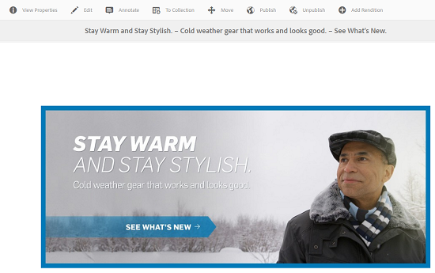

# Samengestelde en uit meerdere pagina&#39;s bestaande elementen beheren {#managing-compound-assets}

[!DNL Adobe Experience Manager Assets] kan vaststellen of een geüpload bestand verwijzingen bevat naar elementen die al in de opslagplaats bestaan. Deze functie is alleen beschikbaar voor ondersteunde bestandsindelingen. Als het geüploade element verwijzingen naar [!DNL Experience Manager] elementen bevat, wordt een bidirectionele koppeling gemaakt tussen de geüploade elementen en de elementen waarnaar wordt verwezen.

Naast het elimineren van overtolligheid, het van verwijzingen voorzien van de activa in [!DNL Adobe Creative Cloud] toepassingen verbetert samenwerking en verhoogt de efficiency en de productiviteit van gebruikers.

[!DNL Experience Manager Assets] ondersteunt bidirectionele referentie. U vindt de middelen waarnaar wordt verwezen op de elementdetailpagina van het geüploade bestand. Daarnaast kunt u de bestanden waarnaar wordt verwezen, weergeven op de pagina met elementdetails van het element waarnaar wordt verwezen.

Verwijzingen worden opgelost op basis van pad, document-id en instantie-id van de middelen waarnaar wordt verwezen.

## Digitale elementen toevoegen als verwijzingen in [!DNL Adobe Illustrator] {#refai}

U kunt vanuit een [!DNL Adobe Illustrator] bestand verwijzen naar bestaande digitale elementen.

1. Haal de digitale middelen op het lokale bestandssysteem op met de [Experience Manager-bureaubladtoepassing](https://docs.adobe.com/content/help/en/experience-manager-desktop-app/using/using.html). Navigeer naar de bestandssysteemlocatie van het element waarnaar u wilt verwijzen.
1. Sleep het element van de lokale map naar het [!DNL Illustrator] bestand.

1. Sla het [!DNL Illustrator] bestand op het gekoppelde station op of [upload](/help/assets/managing-assets-touch-ui.md#uploading-assets) het bestand naar de [!DNL Experience Manager] opslagplaats.

1. Nadat de workflow is voltooid, gaat u naar de pagina met elementdetails voor het element. De verwijzingen naar bestaande digitale elementen staan onder **[!UICONTROL Dependencies]** de **[!UICONTROL References]** kolom.

   

1. De middelen waarnaar wordt verwezen die onder **[!UICONTROL Dependencies]** worden weergegeven, kunnen ook worden verwezen door andere bestanden dan de huidige. Als u een lijst wilt weergeven met bestanden die naar een element verwijzen, klikt u op het element onder **[!UICONTROL Dependencies]**.

   

1. Klik op **[!UICONTROL View Properties]** op de werkbalk. Op de [!UICONTROL Properties] pagina wordt de lijst met bestanden die naar het huidige element verwijzen, weergegeven onder de **[!UICONTROL References]** kolom op het **[!UICONTROL Basic]** tabblad.

   

   *Afbeelding: Verwijzingen naar elementen in de elementen.*

## Digitale elementen toevoegen als verwijzingen in [!DNL Adobe InDesign] {#add-aem-assets-as-references-in-adobe-indesign}

Als u vanuit een [!DNL InDesign] bestand naar digitale elementen wilt verwijzen, sleept u elementen naar het [!DNL InDesign] bestand of exporteert u het [!DNL InDesign] bestand als een ZIP-archief.

Er bestaan al middelen waarnaar wordt verwezen in [!DNL Experience Manager Assets]. U kunt subassets extraheren door InDesign Server [te configureren](indesign.md). Ingesloten elementen in een [!DNL InDesign] bestand worden geëxtraheerd als subelementen.

>[!NOTE]
>
>Als de voorvertoning [!DNL InDesign Server] is proxy, wordt de voorvertoning van [!DNL InDesign] bestanden ingesloten in de XMP metagegevens. In dit geval is het niet expliciet vereist miniatuurextractie uit te voeren. Als de proxy echter niet [!DNL InDesign Server] is proxy, moeten miniaturen expliciet worden uitgepakt voor [!DNL InDesign] bestanden.

### Verwijzingen maken door elementen te slepen {#create-references-by-dragging-aem-assets}

Deze procedure is vergelijkbaar met het [toevoegen van digitale elementen als verwijzingen in Adobe Illustrator](#refai).

### Verwijzingen naar elementen maken door een ZIP-bestand te exporteren {#create-references-to-aem-assets-by-exporting-a-zip-file}

1. Voer de stappen in Workflowmodellen  maken uit om een nieuwe workflow te maken.
1. Gebruik de functie Pakket van [!DNL Adobe InDesign] om het document te exporteren. [!DNL Adobe InDesign] U kunt een document en de gekoppelde elementen als een pakket exporteren. In dit geval bevat de geëxporteerde map een map Koppelingen met subelementen in het [!DNL InDesign] bestand.
1. Maak een ZIP-bestand en upload het naar de [!DNL Experience Manager] opslagplaats.
1. Start de `Unarchiver` workflow.
1. Wanneer de werkstroom is voltooid, wordt er automatisch naar de verwijzingen in de map Koppelingen verwezen als subelementen. Als u een lijst met de desbetreffende elementen wilt weergeven, navigeert u naar de pagina met elementdetails van het [!DNL InDesign] element en sluit u de [Rail](/help/sites-authoring/basic-handling.md#rail-selector).

## Digitale elementen toevoegen als verwijzingen in [!DNL Adobe Photoshop] {#refps}

1. Gebruik [!DNL Experience Manager] bureaubladtoepassing voor toegang [!DNL Experience Manager Assets]. Download en open de middelen op het lokale bestandssysteem. Gebruik de [!UICONTROL Place Linked] functionaliteit in [!DNL Adobe Photoshop]. Zie Elementen [plaatsen in de bureaubladtoepassing](https://docs.adobe.com/content/help/en/experience-manager-desktop-app/using/using.html#place-assets-in-native-documents).

   

1. Opslaan in [!DNL Photoshop] bestand op het gekoppelde station of [uploaden](/help/assets/managing-assets-touch-ui.md#uploading-assets) naar de [!DNL Experience Manager] opslagplaats.
1. Nadat de workflow is voltooid, worden de verwijzingen naar bestaande [!DNL Experience Manager] elementen weergegeven op de pagina met elementdetails.

   Als u de middelen waarnaar wordt verwezen wilt weergeven, sluit u de [Rail](/help/sites-authoring/basic-handling.md#rail-selector) op de pagina met elementdetails.

1. De middelen waarnaar wordt verwezen, bevatten ook de lijst met elementen waarnaar wordt verwezen. Als u een lijst met middelen waarnaar wordt verwezen wilt weergeven, navigeert u naar de pagina met elementdetails en sluit u de [Rail](/help/sites-authoring/basic-handling.md#rail-selector).

>[!NOTE]
>
>Er kan ook worden verwezen naar de elementen in samengestelde elementen op basis van hun document-id en instantie-id. Deze functionaliteit is alleen beschikbaar bij [!DNL Adobe Illustrator] en in [!DNL Adobe Photoshop] versies. Voor andere toepassingen wordt het verwijzen uitgevoerd op basis van het relatieve pad van gekoppelde elementen in het hoofdsamengestelde element, zoals dat in eerdere versies van [!DNL Experience Manager]dit programma is gebeurd.

## Subelementen maken {#generate-subassets}

Voor de ondersteunde elementen met indelingen die uit meerdere pagina&#39;s bestaan (PDF-bestanden, AI-bestanden [!DNL Microsoft PowerPoint] en [!DNL Apple Keynote] bestanden, en [!DNL Adobe InDesign] -bestanden), [!DNL Experience Manager] kunt u subelementen genereren die overeenkomen met elke afzonderlijke pagina van het oorspronkelijke element. Deze subelementen zijn gekoppeld aan het *bovenliggende* element en maken de weergave van meerdere pagina&#39;s eenvoudiger. Voor alle andere doeleinden worden de subactiva behandeld als normale activa in [!DNL Experience Manager].

Genereren van subelementen is standaard uitgeschakeld. Voer de volgende stappen uit om het genereren van subelementen in te schakelen:

1. Meld u aan [!DNL Experience Manager] als beheerder. Ga naar **[!UICONTROL Tools]** > **[!UICONTROL Workflow]** > **[!UICONTROL Models]**.
1. Select **[!UICONTROL DAM Update Asset]** workflow and click **[!UICONTROL Edit]**.
1. Klik **[!UICONTROL Toggle Side Panel]** en zoek de **[!UICONTROL Create Sub Asset]** stap. Voeg de stap toe aan de workflow. Klik op **[!UICONTROL Sync]**.

Voer een van de volgende handelingen uit om de subelementen te genereren:

* Nieuwe elementen: De [!UICONTROL DAM Update Assets] workflow wordt uitgevoerd op elk nieuw element waarnaar geüpload wordt [!DNL Experience Manager]. Subelementen worden automatisch gegenereerd voor nieuwe elementen die uit meerdere pagina&#39;s bestaan.
* Bestaande elementen met meerdere pagina&#39;s: Voer handmatig de [!UICONTROL DAM Update Assets] workflow uit volgens een van de volgende stappen:

   * Selecteer een element en klik [!UICONTROL Timeline] om het linkerdeelvenster te openen. U kunt ook de sneltoets gebruiken `alt + 3`. Klik [!UICONTROL Start Workflow], selecteer [!UICONTROL DAM Update Asset], klik [!UICONTROL Start], en klik [!UICONTROL Proceed].
   * Selecteer een element en klik op [!UICONTROL Create] > [!UICONTROL Workflow] op de werkbalk. Selecteer in het pop-updialoogvenster de [!UICONTROL DAM Update Asset] workflow, klik [!UICONTROL Start]en klik op [!UICONTROL Proceed].

Met name voor Microsoft Word-documenten voert u de **[!UICONTROL DAM Parse Word Documents]** workflow uit. Er wordt een `cq:Page` component gegenereerd op basis van de inhoud van het Microsoft Word-document. De afbeeldingen die uit het document zijn geëxtraheerd, worden vanuit de `cq:Page` component gebruikt. Deze afbeeldingen worden geëxtraheerd, zelfs als het genereren van subelementen is uitgeschakeld.

## Subelementen weergeven {#viewing-subassets}

De subelementen worden alleen weergegeven als de subelementen zijn gegenereerd en beschikbaar zijn voor het geselecteerde element met meerdere pagina&#39;s. Open het element met meerdere pagina&#39;s om de gegenereerde subelementen weer te geven. Klik in de linkerbovenhoek van de pagina op  te openen en klik in de lijst **[!UICONTROL Subassets]** . Wanneer u een keuze maakt in de **[!UICONTROL Subassets]** lijst. U kunt ook de sneltoets gebruiken `alt + 5`.

## Pagina&#39;s van een bestand met meerdere pagina&#39;s weergeven {#view-pages-of-a-multi-page-file}

U kunt een bestand met meerdere pagina&#39;s, zoals PDF, INDD, PPT, PPTX en AI, weergeven met de functie Paginaviewer van [!DNL Experience Manager Assets]. Open een element met meerdere pagina&#39;s en klik in de linkerbovenhoek van de pagina. **[!UICONTROL View Pages]** In de Paginaviewer die wordt geopend, worden de pagina&#39;s van het element en de besturingselementen weergegeven waarmee u door elke pagina kunt bladeren en erop kunt inzoomen.

U kunt bijvoorbeeld pagina&#39;s uitnemen met [!DNL InDesign]behulp van [!DNL InDesign Server]. Als de voorvertoningen van pagina&#39;s worden opgeslagen tijdens het maken van het [!DNL InDesign] bestand, is [!DNL InDesign Server] dit niet vereist voor het uitnemen van pagina&#39;s.

De volgende opties zijn beschikbaar in de werkbalk, in de linkerrails en in de besturingselementen voor de Paginaviewer:

* **[!UICONTROL Desktop Actions]** om een specifiek submiddel te openen of weer te geven met de [!DNL Experience Manager] bureaubladtoepassing. Zie hoe u bureaubladhandelingen [kunt](https://docs.adobe.com/content/help/en/experience-manager-desktop-app/using/using.html#desktopactions-v2) configureren als u [!DNL Experience Manager] bureaubladtoepassing gebruikt.

* **[!UICONTROL Properties]** Hiermee opent u de [!UICONTROL Properties] pagina van het specifieke subelement.

* **[!UICONTROL Annotate]** kunt u het specifieke subelement van een annotatie voorzien. De annotaties die u op afzonderlijke subelementen gebruikt, worden samen verzameld en weergegeven wanneer het bovenliggende element wordt geopend voor weergave.

* **[!UICONTROL Page Overview]** worden alle subelementen tegelijkertijd weergegeven.

* **[!UICONTROL Timeline]** Nadat u op  te openen, wordt de activiteitsstroom voor het bestand weergegeven.

## Beste werkwijzen en beperking {#best-practice-limitation-tips}

* Bij elke [!DNL Experience Manager] implementatie kan het genereren van submiddelen zeer veel resources vergen. Als u subassets genereert wanneer complexe elementen worden geüpload, voegt u de stap toe in de DAM-workflow voor het bijwerken van middelen. Als u op verzoek subassets genereert, maakt u een aparte workflow om subassets te genereren. Met een speciale workflow kunt u de andere stappen in de workflow voor DAM-update-elementen overslaan en computerbronnen opslaan.

>[!MORELIKETHIS]
>
>* [Adobe Experience Manager-bureaubladtoepassing gebruiken](https://docs.adobe.com/content/help/en/experience-manager-desktop-app/using/using.html)
>* [Bureaubladhandelingen configureren in Adobe Experience Manager](https://docs.adobe.com/content/help/en/experience-manager-desktop-app/using/using.html#desktopactions-v2)
>* [Gekoppelde slimme objecten maken in Adobe Photoshop](https://helpx.adobe.com/photoshop/using/create-smart-objects.html#create-linked-smart-objects)
>* [Afbeeldingen plaatsen in Adobe InDesign](https://helpx.adobe.com/indesign/using/placing-graphics.html)

