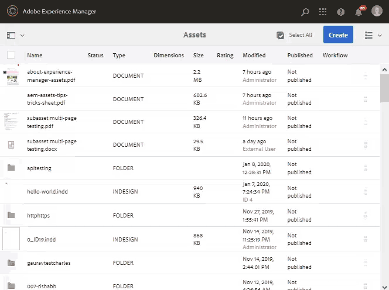

# Samengestelde en uit meerdere pagina&#39;s bestaande elementen beheren {#managing-compound-assets}

Met Adobe Experience Manager (AEM) kunt u nagaan of een geüpload bestand verwijzingen bevat naar elementen die al in de opslagplaats bestaan. Deze functie is alleen beschikbaar voor ondersteunde bestandsindelingen. Als het geüploade element verwijzingen naar AEM-elementen bevat, wordt een bidirectionele koppeling gemaakt tussen de geüploade en de gerefereerde elementen.

Naast redundantie elimineert u door te verwijzen naar AEM-middelen in Adobe Creative Cloud-toepassingen de samenwerking en verhoogt u de efficiëntie en productiviteit van gebruikers.

AEM-elementen ondersteunen bidirectionele verwijzingen. U vindt de middelen waarnaar wordt verwezen op de elementdetailpagina van het geüploade bestand. Daarnaast kunt u de bestanden waarnaar wordt verwezen voor AEM-elementen bekijken op de pagina met elementdetails van het element waarnaar wordt verwezen.

Verwijzingen worden opgelost op basis van pad, document-id en instantie-id van de middelen waarnaar wordt verwezen.

## AEM-elementen toevoegen als verwijzingen in Adobe Illustrator {#refai}

U kunt vanuit een Adobe Illustrator-bestand verwijzen naar bestaande AEM-elementen.

1. Plaats met de [AEM-bureaubladtoepassing](https://docs.adobe.com/content/help/en/experience-manager-desktop-app/using/using.html)de opslagplaats voor AEM-middelen als een station op uw lokale computer. Navigeer in het gekoppelde station naar de locatie van het element waarnaar u wilt verwijzen.
1. Sleep het element van het gekoppelde station naar het Illustrator-bestand.
1. Sla het Illustrator-bestand op het gekoppelde station op of [upload het bestand naar](/help/assets/managing-assets-touch-ui.md#uploading-assets) de AEM-opslagplaats.
1. Nadat de workflow is voltooid, gaat u naar de pagina met elementdetails voor het element. De verwijzingen naar bestaande activa AEM zijn vermeld onder **[!UICONTROL Afhankelijkheden]** in de **[!UICONTROL kolom van Verwijzingen]** .

   

1. De middelen waarnaar wordt verwezen die onder **[!UICONTROL Afhankelijkheden]** verschijnen kunnen ook door dossiers buiten huidige worden van verwijzingen voorzien. Als u een lijst met referentiebestanden voor een element wilt weergeven, klikt u op het element onder **[!UICONTROL Afhankelijkheden]**.

   

1. Klik op Eigenschappen **[!UICONTROL van]** weergave op de werkbalk. Op de pagina [!UICONTROL Eigenschappen] wordt de lijst met bestanden die naar het huidige element verwijzen, weergegeven onder de kolom **[!UICONTROL Verwijzingen]** op het tabblad **[!UICONTROL Standaard]** .

   

## AEM-elementen toevoegen als verwijzingen in Adobe InDesign {#add-aem-assets-as-references-in-adobe-indesign}

Als u vanuit een InDesign-bestand wilt verwijzen naar AEM-elementen, sleept u AEM-elementen naar het InDesign-bestand of exporteert u het InDesign-bestand als een ZIP-bestand.

De activa waarnaar wordt verwezen bestaan reeds in activa AEM. U kunt subelementen extraheren door de InDesign-server [te](/help/assets/indesign.md)configureren. Ingesloten elementen in een InDesign-bestand worden als subelementen geëxtraheerd.

>[!NOTE]
>
>Als de InDesign-server is proxy, is de voorvertoning van InDesign-bestanden ingesloten in de XMP-metagegevens. In dit geval is het niet expliciet vereist miniatuurextractie uit te voeren. Als de InDesign-server echter geen proxy is, moeten miniaturen expliciet worden geëxtraheerd voor InDesign-bestanden.

### Verwijzingen maken door elementen te slepen {#create-references-by-dragging-aem-assets}

Deze procedure is vergelijkbaar met AEM-elementen [toevoegen als verwijzingen in Adobe Illustrator](#refai).

### Verwijzingen naar elementen maken door een ZIP-bestand te exporteren {#create-references-to-aem-assets-by-exporting-a-zip-file}

1. Voer de stappen in Workflowmodellen  maken uit om een nieuwe workflow te maken.
1. Met de functie Pakket van Adobe InDesign kunt u het document exporteren.
Adobe InDesign kan een document en de gekoppelde elementen als een pakket exporteren. In dit geval bevat de geëxporteerde map een map Koppelingen met subelementen in het InDesign-bestand.
1. Maak een ZIP-bestand en upload het naar de AEM-opslagplaats.
1. Start de `Unarchiver` workflow.
1. Wanneer de werkstroom is voltooid, wordt er automatisch naar de verwijzingen in de map Koppelingen verwezen als subelementen. Als u een lijst met de desbetreffende elementen wilt weergeven, navigeert u naar de pagina met elementdetails in het InDesign-element en sluit u de [Rail](/help/sites-authoring/basic-handling.md#rail-selector).

## AEM-elementen toevoegen als verwijzingen in Adobe Photoshop {#refps}

1. Met een WebDav-client kunt u AEM-middelen monteren als een station.
1. Als u verwijzingen naar AEM-elementen in een Photoshop-bestand wilt maken, navigeert u met de functie Gekoppelde plaatsen in Photoshop naar de overeenkomstige elementen in het gekoppelde station.

   

1. Opslaan in Photoshop-bestand op het gekoppelde station of [uploaden](/help/assets/managing-assets-touch-ui.md#uploading-assets) naar de AEM-opslagplaats.
1. Nadat de workflow is voltooid, worden de verwijzingen naar bestaande AEM-elementen weergegeven op de pagina met elementdetails.

   Als u de middelen waarnaar wordt verwezen wilt weergeven, sluit u de [Rail](/help/sites-authoring/basic-handling.md#rail-selector) op de pagina met elementdetails.

1. De middelen waarnaar wordt verwezen, bevatten ook de lijst met elementen waarnaar wordt verwezen. Als u een lijst met middelen waarnaar wordt verwezen wilt weergeven, navigeert u naar de pagina met elementdetails en sluit u de [Rail](/help/sites-authoring/basic-handling.md#rail-selector).

>[!NOTE]
>
>Er kan ook worden verwezen naar de elementen in samengestelde elementen op basis van hun document-id en instantie-id. Deze functionaliteit is alleen beschikbaar in Adobe Illustrator- en Adobe Photoshop-versies. Voor andere toepassingen vindt de verwijzing plaats op basis van het relatieve pad van gekoppelde elementen in het belangrijkste samengestelde element, zoals dat in eerdere versies van AEM is gebeurd.

## Subelementen maken {#generate-subassets}

Voor de ondersteunde elementen met indelingen die uit meerdere pagina&#39;s bestaan — PDF-bestanden, AI-bestanden, Microsoft PowerPoint- en Apple-toetsenbordbestanden en Adobe InDesign-bestanden — kan AEM subelementen genereren die overeenkomen met elke afzonderlijke pagina van het oorspronkelijke element. Deze subelementen zijn gekoppeld aan het *bovenliggende* element en maken de weergave van meerdere pagina&#39;s eenvoudiger. Voor alle andere doeleinden worden de subactiva behandeld als normale activa in AEM.

Genereren van subelementen is standaard uitgeschakeld. Voer de volgende stappen uit om het genereren van subelementen in te schakelen:

1. Meld u aan bij Experience Manager als beheerder. Ga naar **[!UICONTROL Extra > Workflow > Modellen]**.
1. Selecteer de **[!UICONTROL DAM-workflow Element]** bijwerken en klik op **[!UICONTROL Bewerken]**.
1. Klik op **[!UICONTROL Zijpaneel]** in-/uitschakelen en zoek de stap **[!UICONTROL Subelement]** maken. Voeg de stap toe aan de workflow. Klik op **[!UICONTROL Synchroniseren]**.

Voer een van de volgende handelingen uit om de subelementen te genereren:

* Nieuwe elementen: De workflow [!UICONTROL DAM Update Assets] wordt uitgevoerd op elk nieuw element dat naar AEM wordt geüpload. Subelementen worden automatisch gegenereerd voor nieuwe elementen die uit meerdere pagina&#39;s bestaan.
* Bestaande elementen met meerdere pagina&#39;s: Voer handmatig de workflow [!UICONTROL DAM Update Assets] uit volgens een van de volgende stappen:

   * Selecteer een element en klik op [!UICONTROL Tijdlijn] om het linkerdeelvenster te openen. U kunt ook de sneltoets gebruiken `alt + 3`. Klik op Workflow starten, selecteer [!UICONTROL DAM Update Asset], klik op [!UICONTROL Start]en klik op [!UICONTROL Doorgaan].
   * Selecteer een element en klik op [!UICONTROL Maken > Workflow] op de werkbalk. Selecteer in het pop-updialoogvenster de [!UICONTROL DAM-workflow Element] bijwerken, klik op [!UICONTROL Start]en [!UICONTROL Ga verder].

Met name voor Microsoft Word-documenten voert u de workflow **[!UICONTROL DAM Parse Word Documents]** uit. Er wordt een `cq:Page` component gegenereerd op basis van de inhoud van het Microsoft Word-document. De afbeeldingen die uit het document zijn geëxtraheerd, worden vanuit de `cq:Page` component gebruikt. Deze afbeeldingen worden geëxtraheerd, zelfs als het genereren van subelementen is uitgeschakeld.

## Subelementen weergeven {#viewing-subassets}

De subelementen worden alleen weergegeven als de subelementen zijn gegenereerd en beschikbaar zijn voor het geselecteerde element met meerdere pagina&#39;s. Open het element met meerdere pagina&#39;s om de gegenereerde subelementen weer te geven. Klik in de linkerbovenhoek van de pagina op het pictogram  Submiddelen **** in de lijst. Wanneer u **[!UICONTROL Subassets]** in de lijst selecteert. U kunt ook de sneltoets gebruiken `alt + 5`.

## Pagina&#39;s van een bestand met meerdere pagina&#39;s weergeven {#view-pages-of-a-multi-page-file}

U kunt een bestand met meerdere pagina&#39;s, zoals PDF-, INDD-, PPT-, PPTX- en AI-bestanden, weergeven met de functie Paginaviewer van AEM-middelen. Open een element met meerdere pagina&#39;s en klik op Pagina&#39;s **** weergeven in de linkerbovenhoek van de pagina. In de Paginaviewer die wordt geopend, worden de pagina&#39;s van het element en de besturingselementen weergegeven waarmee u door elke pagina kunt bladeren en erop kunt inzoomen.

Voor InDesign kunt u pagina&#39;s uitnemen met InDesign-server. Als de voorvertoningen van pagina&#39;s worden opgeslagen tijdens het maken van InDesign-bestanden, is InDesign Server niet vereist voor het uitnemen van pagina&#39;s.

De volgende opties zijn beschikbaar in de werkbalk, in de linkerrails en in de besturingselementen voor de Paginaviewer:

* **[!UICONTROL Bureaubladhandelingen]** om een specifiek submiddel te openen of weer te geven met de AEM-bureaubladtoepassing. Zie hoe u bureaubladhandelingen [kunt](https://docs.adobe.com/content/help/en/experience-manager-desktop-app/using/using.html#desktopactions-v2) configureren als u AEM-bureaubladtoepassing gebruikt.

* **[!UICONTROL Met de optie Eigenschappen]** wordt de pagina [!UICONTROL Eigenschappen] van het specifieke subelement geopend.

* **[!UICONTROL Met de optie Annoteren]** kunt u het specifieke subelement annoteren. De annotaties die u op afzonderlijke subelementen gebruikt, worden samen verzameld en weergegeven wanneer het bovenliggende element wordt geopend voor weergave.

* **[!UICONTROL Met de optie Paginaoverzicht]** worden alle subelementen tegelijkertijd weergegeven.

* **[!UICONTROL De optie Tijdlijn]** van de linkerspoorstaaf na het klikken van het pictogram  Linker spoorstaaf toont de activiteitenstroom voor het dossier.
