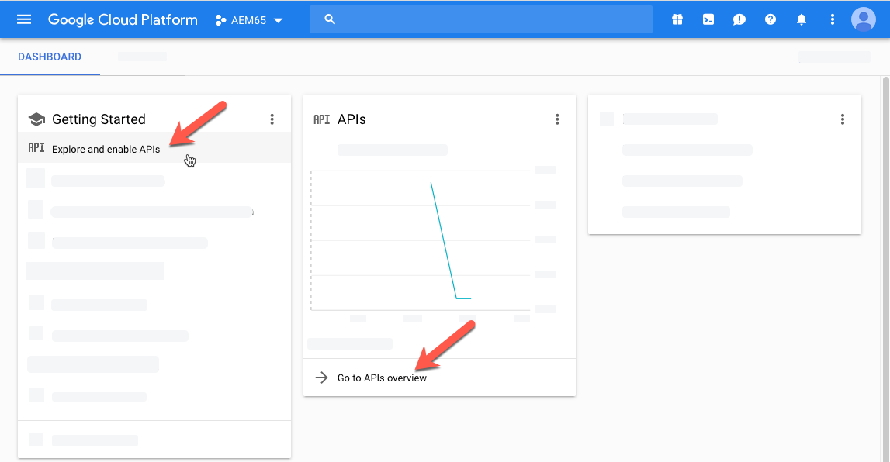

# Video-elementen beheren {#manage-video-assets}

| Versie | Artikelkoppeling |
| -------- | ---------------------------- |
| AEM as a Cloud Service | [ klik hier ](https://experienceleague.adobe.com/docs/experience-manager-cloud-service/content/assets/manage/manage-video-assets.html?lang=en) |
| AEM 6,5 | Dit artikel |

De video-indeling is een essentieel onderdeel van digitale middelen van een organisatie. [!DNL Adobe Experience Manager] biedt geavanceerde aanbiedingen en functies om de volledige levenscyclus van uw video-elementen te beheren nadat deze zijn gemaakt.

Leer hoe u de video-elementen beheert en bewerkt in [!DNL Adobe Experience Manager Assets] . Codering en transcodering van video, bijvoorbeeld MPEG-transcodering, is mogelijk met [!DNL Dynamic Media] -integratie.

## Video-elementen uploaden en voorvertonen {#upload-and-preview-video-assets}

[!DNL Adobe Experience Manager Assets] genereert voorvertoningen voor video-elementen met de extensie MP4. Als de indeling van het element niet MP4 is, installeert u het MPEG-pakket om een voorvertoning te genereren. MPEG maakt video-uitvoeringen van het type OGG en MP4. U kunt een voorvertoning van de uitvoeringen weergeven in de gebruikersinterface van [!DNL Assets] .

1. Navigeer in de map met digitale elementen of in de submappen naar de locatie waar u digitale elementen wilt toevoegen.
1. Als u het element wilt uploaden, klikt u op **[!UICONTROL Create]** op de werkbalk en kiest u **[!UICONTROL Files]** . U kunt ook een bestand naar de gebruikersinterface slepen. Zie [ activa ](manage-assets.md#uploading-assets) voor details uploaden.
1. Om een video in de mening van de Kaart voor te vertonen, klik de **[!UICONTROL Play]**  optie op de videoactiva. U kunt video alleen in de kaartweergave pauzeren of afspelen. De opties [!UICONTROL Play] en [!UICONTROL Pause] zijn niet beschikbaar in de lijstweergave.

1. Klik op **[!UICONTROL Edit]** op de kaart om een voorvertoning van de video weer te geven op de pagina met elementdetails. De video wordt afgespeeld in de native videospeler van de browser. U kunt de video afspelen, pauzeren, het volume bepalen en op het volledige scherm in- of uitzoomen.

   

## Configuratie voor het uploaden van middelen die groter zijn dan 2 GB {#configuration-to-upload-assets-that-are-larger-than-gb}

In [!DNL Assets] kunt u standaard geen elementen uploaden die groter zijn dan 2 GB vanwege een maximale bestandsgrootte. U kunt deze limiet echter overschrijven door naar CRXDE Lite te gaan en een knooppunt onder de map `/apps` te maken. Het knooppunt moet dezelfde knooppuntnaam, directorystructuur en vergelijkbare knooppunteigenschappen van volgorde hebben.

Wijzig, naast de [!DNL Assets] -configuratie, de volgende configuraties om grote elementen te uploaden:

* Verhoog de vervaltijd van het token. Zie [!UICONTROL Adobe Granite CSRF Servlet] in webconsole op `https://[aem_server]:[port]/system/console/configMgr` . Voor meer informatie, zie {bescherming 0} CSRF [&#128279;](/help/sites-developing/csrf-protection.md).
* Verhoog de `receiveTimeout` in Dispatcher-configuratie. Voor meer informatie, zie {de configuratie van Dispatcher van de Experience Manager 0} [&#128279;](https://experienceleague.adobe.com/docs/experience-manager-dispatcher/using/configuring/dispatcher-configuration.html#renders-options).

>[!NOTE]
>
>De [!DNL Experience Manager] klassieke gebruikersinterface heeft geen beperking voor de bestandsgrootte van 2 GB. Bovendien wordt de end-to-end workflow voor grote video niet volledig ondersteund.

Voer de volgende stappen uit in de map `/apps` als u een hogere maximale bestandsgrootte wilt configureren.

1. Klik in [!DNL Experience Manager] op **[!UICONTROL Tools]** > **[!UICONTROL General]** > **[!UICONTROL CRXDE Lite]** .
1. Navigeer in CRXDE Lite naar `/libs/dam/gui/content/assets/jcr:content/actions/secondary/create/items/fileupload` . Klik op `>>` om het mappenvenster weer te geven.
1. Klik op de werkbalk op **[!UICONTROL Overlay Node]** . U kunt ook **[!UICONTROL Overlay Node]** selecteren in het contextmenu.
1. Klik in het dialoogvenster **[!UICONTROL Overlay Node]** op **[!UICONTROL OK]** .

   

1. Vernieuw de browser. Het bedekkingsknooppunt `/apps/dam/gui/content/assets/jcr:content/actions/secondary/create/items/fileupload` wordt geselecteerd.
1. Voer op het tabblad **[!UICONTROL Properties]** de juiste waarde in bytes in om de maximale grootte tot de gewenste grootte te verhogen. Als u bijvoorbeeld de formaatlimiet wilt verhogen tot 30 GB, voert u `32212254720` in.

1. Klik **[!UICONTROL Save All]** op de werkbalk.
1. Klik in [!DNL Experience Manager] op **[!UICONTROL Tools]** > **[!UICONTROL Operations]** > **[!UICONTROL Web Console]** .
1. Zoek op de pagina [!DNL Adobe Experience Manager] [!UICONTROL Web Console Bundles] onder de kolom Naam van de tabel de locatie en klik op **[!UICONTROL Adobe Granite Workflow External Process Job Handler]** .
1. Stel op de pagina [!UICONTROL Adobe Granite Workflow External Process Job Handler] de seconden voor zowel **[!UICONTROL Default Timeout]** - als **[!UICONTROL Max Timeout]** -velden in op `18000` (5 uur). Klik op **[!UICONTROL Save]**.
1. Klik in [!DNL Experience Manager] op **[!UICONTROL Tools]** > **[!UICONTROL Workflow]** > **[!UICONTROL Models]** .
1. Selecteer **[!UICONTROL Dynamic Media Encode Video]** op de pagina Workflowmodellen en klik vervolgens op **[!UICONTROL Edit]** .
1. Dubbelklik op de workflowpagina op de component **[!UICONTROL Dynamic Media Video Service Process]** .
1. Vouw in het dialoogvenster [!UICONTROL Step Properties] onder het tabblad **[!UICONTROL Common]** **Geavanceerde instellingen** uit.
1. Geef in het veld **[!UICONTROL Timeout]** de waarde `18000` op en klik vervolgens op **[!UICONTROL OK]** om terug te keren naar de **[!UICONTROL Dynamic Media Encode Video]** werkstroompagina.
1. Klik boven aan de pagina, onder de paginatitel [!UICONTROL Dynamic Media Encode Video] , op **[!UICONTROL Save]** .

## Publish-video-elementen {#publish-video-assets}

Na publicatie kunt u de video-elementen in een webpagina opnemen als een URL of de elementen rechtstreeks insluiten. Voor details, zie [ de activa van Dynamic Media ](/help/assets/publishing-dynamicmedia-assets.md) publiceren.

## Publish-video&#39;s naar YouTube {#publishing-videos-to-youtube}

U kunt video-elementen op locatie voor Experience Managers rechtstreeks publiceren naar een YouTube-kanaal dat u eerder hebt gemaakt.

Als u video-elementen naar YouTube wilt publiceren, stelt u Experience Manager Assets in met tags. U koppelt deze tags aan een YouTube-kanaal. Als de tag van een video-element overeenkomt met de tag van een YouTube-kanaal, wordt de video gepubliceerd naar YouTube. Publish naar YouTube treedt op samen met een normale publicatie van de video zolang een bijbehorende tag wordt gebruikt.

YouTube voert zijn eigen codering uit. Als zodanig wordt het oorspronkelijke videobestand dat naar de Experience Manager is geüpload, gepubliceerd naar YouTube in plaats van elke video-uitvoering die door de codering van Dynamic Media is gemaakt. Hoewel het niet nodig is om video&#39;s te verwerken met Dynamic Media, wordt verwacht dat dit gebeurt voor het geval dat een viewer-voorinstelling nodig is voor het afspelen.

Wanneer u het videoverwerkingsprofiel overslaat en rechtstreeks naar YouTube publiceert, betekent dit gewoon dat uw video-element in Experience Manager Asset geen zichtbare miniatuur krijgt. Dit betekent ook dat als u uitvoert in de uitvoermodi `dynamicmedia` of `dynamicmedia_scene7` , video&#39;s die niet zijn gecodeerd, niet werken met een van de Dynamic Media-elementtypen.

Bij het publiceren van video-elementen naar YouTube-servers moeten de volgende taken worden uitgevoerd om een veilige en beveiligde server-naar-server verificatie met YouTube te garanderen:

1. [Google Cloud-instellingen configureren](#configuring-google-cloud-settings)
1. [Een YouTube-kanaal maken](#creating-a-youtube-channel)
1. [Codes toevoegen voor publicatie](#adding-tags-for-publishing)
1. [De YouTube Publish Replication-agent inschakelen](#enabling-the-youtube-publish-replication-agent)
1. [YouTube instellen in Experience Manager](#setting-up-youtube-in-aem)
1. [(Optioneel) Automatiseer de standaardeigenschappen van YouTube voor uw geüploade video&#39;s](#optional-automating-the-setting-of-default-youtube-properties-for-your-uploaded-videos)
1. [Publish-video&#39;s naar uw YouTube-kanaal](#publishing-videos-to-your-youtube-channel)
1. [(Optioneel) Controleer de gepubliceerde video op YouTube](/help/assets/video.md#optional-verifying-the-published-video-on-youtube)
1. [YouTube-URL&#39;s koppelen aan uw webtoepassing](#linking-youtube-urls-to-your-web-application)

U kunt ook [ unpublish video&#39;s om hen uit YouTube ](#unpublishing-videos-to-remove-them-from-youtube) te verwijderen.

### Google Cloud-instellingen configureren {#configuring-google-cloud-settings}

Als u wilt publiceren naar YouTube, hebt u een Google-account nodig. Als u een GMAIL-account hebt, hebt u al een Google-account. Als u geen Google-account hebt, kunt u er eenvoudig een maken. U hebt het account nodig omdat u aanmeldingsgegevens nodig hebt om video-elementen naar YouTube te publiceren. Als u reeds een rekening hebt gecreeerd, dan overslaat deze taak en gaat direct aan [ te werk creeert een kanaal van YouTube ](#creating-a-youtube-channel).

Het account dat wordt gebruikt met Google Cloud en het Google-account dat wordt gebruikt voor YouTube, hoeft niet hetzelfde te zijn.

Google wijzigt regelmatig de gebruikersinterface. De stappen voor het publiceren van video&#39;s naar YouTube kunnen dan ook enigszins afwijken van wat hieronder wordt beschreven. Dit voorbehoud geldt ook voor YouTube wanneer u probeert te controleren of er video&#39;s naar worden geüpload.

>[!NOTE]
>
>De volgende stappen waren correct op het moment van schrijven. Google werkt zijn websites echter regelmatig en zonder kennisgeving bij. Daarom kunnen deze stappen iets anders zijn.

Google Cloud-instellingen configureren:

1. Maak een Google-account.

   Als u al een Google-account hebt, gaat u verder met de volgende stap.

1. Ga naar [ https://cloud.google.com/ ](https://cloud.google.com/).
1. Klik in de rechterbovenhoek op de Google Cloud-pagina op **[!UICONTROL Console]**.

   Indien nodig, **[!UICONTROL Sign in]** gebruikt u de gegevens van uw Google-account om de optie **[!UICONTROL Console]** te zien.

1. Klik op de pagina Dashboard, rechts van **[!UICONTROL Google Cloud Platform]**, op de vervolgkeuzelijst Project om het dialoogvenster Een project selecteren te openen.
1. Selecteer **[!UICONTROL New Project]** in het dialoogvenster Een project selecteren.

   

1. Typ in het dialoogvenster Nieuw project in het veld Projectnaam de naam van het nieuwe project.

   Uw project-id is gebaseerd op uw projectnaam. Kies daarom de projectnaam zorgvuldig en deze kan niet worden gewijzigd nadat deze is gemaakt. Ook, moet u zelfde identiteitskaart van het Project opnieuw ingaan wanneer u opstelling YouTube in Experience Manager later; overweegt schrijvend het.

1. Klik op **[!UICONTROL Create]**.

1. Voer een van de volgende handelingen uit:

   * Selecteer **[!UICONTROL Explore and enable APIs]** op het dashboard van uw project in de Aan de slag-kaart.
   * Selecteer **[!UICONTROL Go to APIs overview]** op het dashboard van uw project in de API&#39;s-kaart.

   

1. Selecteer **[!UICONTROL Enable APIs and Services]** boven aan de pagina API&#39;s &amp; services.
1. Selecteer op de pagina API-bibliotheek links onder **[!UICONTROL Category]** de optie **[!UICONTROL YouTube]** . Selecteer **[!UICONTROL YouTube Data API]** rechts van de pagina.
1. Selecteer **[!UICONTROL Enable]** op de v3-pagina YouTube Data API.

   

1. U hebt referenties nodig om de API te gebruiken. Klik indien nodig op **[!UICONTROL Create Credentials]** .

   

1. Ga als volgt te werk op de pagina **[!UICONTROL Add credentials to your project]** , stap 1:

   * Selecteer in de vervolgkeuzelijst **[!UICONTROL Which API are you using?]** de optie **[!UICONTROL YouTube Data API v3]**.

   * Selecteer **[!UICONTROL Web Server (for example, node.js, Tomcat)]** in de vervolgkeuzelijst **[!UICONTROL Where are you calling the API from?]**

   * Selecteer in de vervolgkeuzelijst **[!UICONTROL What data are you accessing?]** de optie **[!UICONTROL User data]**.

   

1. Selecteren **[!UICONTROL What credentials do I need?]**
1. Voer op de pagina **[!UICONTROL Add credentials to your project]** in stap 2 onder de kop **[!UICONTROL Create an OAuth 2.0 client ID]** in het veld Naam desgewenst een unieke naam in. U kunt ook de standaardnaam gebruiken die door Google is opgegeven.
1. Voer in het tekstveld onder de kop **[!UICONTROL Authorized JavaScript origins]** het volgende pad in, waarbij u uw eigen domein- en poortnummer in het pad vervangt, en druk vervolgens op **[!UICONTROL Enter]** om het pad aan de lijst toe te voegen:

   `https://<servername.domain>:<port_number>`

   Bijvoorbeeld: `https://1a2b3c.mycompany.com:4321`

   **Nota**: Het wegvoorbeeld hierboven is voorgenomen voor demonstratiedoeleinden slechts.

   

1. Voer in het tekstveld onder de kop **[!UICONTROL Authorized redirect URIs]** het volgende pad in, waarbij u uw eigen domein- en poortnummer in het pad vervangt, en druk vervolgens op **[!UICONTROL Enter]** om het pad aan de lijst toe te voegen:

   `https://<servername.domain>:<port_number>/etc/cloudservices/youtube.youtubecredentialcallback.json`

   Bijvoorbeeld: `https://1a2b3c.mycompany.com:4321/etc/cloudservices/youtube.youtubecredentialcallback.json`

   **Nota**: Het wegvoorbeeld hierboven is voorgenomen voor demonstratiedoeleinden slechts.

1. Klik op **[!UICONTROL Create OAuth client ID]**.
1. Selecteer op de pagina **[!UICONTROL Add credentials to your project]** in stap 3 onder de kop **[!UICONTROL Set up the OAuth 2.0 consent screen]** het e-mailadres van Gmail dat u momenteel gebruikt.

   

1. Voer onder de kop **[!UICONTROL Product name shown to users]** in het tekstveld in wat u wilt weergeven op het instemmingsscherm.

   Het toestemmingsscherm wordt getoond aan de beheerder van de Experience Manager wanneer zij aan YouTube voor authentiek verklaren; de Experience Manager contacteert YouTube voor toestemming.

1. Klik op **[!UICONTROL Continue]**.
1. Selecteer **[!UICONTROL Download]** onder de kop **[!UICONTROL Download credentials]** in stap 4 van de knop Inloggegevens toevoegen aan uw projectpagina.

   

1. Sla het `client_id.json` -bestand op.

   U hebt dit gedownloade json-bestand nodig wanneer u YouTube later instelt in Adobe Experience Manager.

1. Klik op **[!UICONTROL Done]**.

   Log uit op je Google account. Maak nu een YouTube-kanaal.

### Een YouTube-kanaal maken {#creating-a-youtube-channel}

Voor het publiceren van video&#39;s naar YouTube hebt u een of meer kanalen nodig. Als u reeds een kanaal van YouTube hebt gecreeerd, kunt u deze taak overslaan en naar [ gaan toevoegen markeringen voor het publiceren ](/help/assets/video.md#adding-tags-for-publishing).

>[!WARNING]
>
>Ben zeker u reeds opstelling één of meerdere kanalen in YouTube *vóór* hebt u kanalen onder de Montages van YouTube in Experience Manager (zie [ Opstelling YouTube in Experience Manager ](#setting-up-youtube-in-aem) hieronder) toevoegt. Als u een of meer kanalen niet instelt, wordt u niet gewaarschuwd voor niet-bestaande kanalen. Google-verificatie vindt echter nog steeds plaats wanneer u een kanaal toevoegt, maar er is geen optie om te kiezen welk kanaal de video wordt verzonden.

**om een kanaal van YouTube tot stand te brengen:**

1. Ga naar [ https://www.youtube.com ](https://www.youtube.com/) en teken binnen gebruikend uw de rekeningsgeloofsbrieven van Google.
1. Klik in de rechterbovenhoek van de YouTube-pagina op de profielafbeelding (kan ook als een letter binnen een cirkel met effen kleuren worden weergegeven) en klik vervolgens op **[!UICONTROL YouTube settings]** (pictogram met ronde versnelling).
1. Klik op de pagina Overzicht onder de kop Extra functies op **[!UICONTROL See all my channels or create a channel]** .
1. Klik op de pagina Kanalen op **[!UICONTROL Create a new channel]** .
1. Voer op de pagina Merkaccount in het veld Merknaam een bedrijfsnaam of een andere kanaalnaam in die u kiest waar u de video-elementen wilt publiceren en klik vervolgens op **[!UICONTROL Create]** .

   Onthoud de naam die u hier invoert, omdat u deze opnieuw moet invoeren wanneer u YouTube instelt in Experience Manager.

1. (Optioneel) Voeg desgewenst meer kanalen toe.

   Voeg nu codes toe voor publicatie.

### Codes toevoegen voor publicatie {#adding-tags-for-publishing}

Als u video&#39;s naar YouTube wilt publiceren, koppelt de Experience Manager de tags aan een of meer YouTube-kanalen. Om markeringen voor het publiceren toe te voegen, zie [ labels beheren ](/help/sites-administering/tags.md).

Of, als u van plan bent om de standaardmarkeringen in Experience Manager te gebruiken, kunt u deze taak overslaan en naar [ gaan toelaten de de replicatieagent van YouTube Publish ](#enabling-the-youtube-publish-replication-agent).

### De YouTube Publish-replicatieagent inschakelen {#enabling-the-youtube-publish-replication-agent}

Nadat u de YouTube Publish-replicatieagent hebt ingeschakeld, selecteert u **[!UICONTROL Test Connection]** als u de verbinding met de Google Cloud-account wilt testen. Op het tabblad Browser worden de verbindingsresultaten weergegeven. Als u YouTube-kanalen hebt toegevoegd, wordt een lijst met kanalen weergegeven als onderdeel van de test.

1. Klik in de linkerbovenhoek van de Experience Manager op het logo van de Experience Manager en klik vervolgens in de linkertrack op **[!UICONTROL Tools]** > **[!UICONTROL Deployment]** > **[!UICONTROL Replication]** > **[!UICONTROL Agents on Author]** .
1. Klik op de pagina Agents van auteur op **[!UICONTROL YouTube Publish]** .
1. Klik op de werkbalk rechts van Instellingen op **[!UICONTROL Edit]** .
1. Schakel het selectievakje **[!UICONTROL Enabled]** in zodat u de replicatieagent kunt inschakelen.
1. Klik op **[!UICONTROL OK]**.

   Stel nu YouTube in Experience Manager in.

### YouTube instellen in Experience Manager {#setting-up-youtube-in-aem}

Vanaf Experience Manager 6.4 is een nieuwe aanraakgebruikersinterfacemethode geïntroduceerd om YouTube-publicaties in Experience Manager in te stellen. Op basis van de geïnstalleerde Experience Manager die u gebruikt, voert u een van de volgende handelingen uit:

* Om YouTube in Experience Manager vóór 6.4 te vormen, zie [ Opstelling YouTube in Experience Manager vóór 6.4 ](/help/assets/video.md#setting-up-youtube-in-aem-before).
* Om YouTube in Experience Manager 6.4 of recenter te vormen, zie [ Opstelling YouTube in Experience Manager 6.4 en later ](#setting-up-youtube-in-aem-and-later).

#### YouTube instellen in Experience Manager 6.4 en hoger {#setting-up-youtube-in-aem-and-later}

1. Meld u als beheerder aan bij uw exemplaar van Dynamic Media.
1. Selecteer in de linkerbovenhoek het logo van de Experience Manager en selecteer vervolgens in de linkertrack **[!UICONTROL Tools]** (hamerpictogram) > **[!UICONTROL Cloud Services]** > **[!UICONTROL YouTube Publishing Configuration]** .
1. Selecteer **[!UICONTROL global]** (niet selecteren).

1. Selecteer **[!UICONTROL Create]** in de rechterbovenhoek van de algemene pagina.
1. Voer op de pagina YouTube-configuratie maken onder Google Cloud-platforminstellingen in het veld **[!UICONTROL Application Name]** de Google-project-id in.

   U hebt de project-id opgegeven toen u de Google Cloud-instellingen voor het eerst eerder hebt geconfigureerd.
Laat de pagina YouTube-configuratie maken open. U gaat er zo meteen op terugkomen.

   

1. Gebruikend een gewone tekstredacteur, open het JSON dossier dat u vroeger in de taak [ downloadde en bewaarde montages van de Wolk van Google ](/help/assets/video.md#configuring-google-cloud-settings) vormt.
1. Selecteer en kopieer de volledige JSON-tekst.
1. Ga terug naar het dialoogvenster YouTube-accountinstellingen. Plak de JSON-tekst in het veld **[!UICONTROL JSON Config]**.
1. Selecteer **[!UICONTROL Save]** in de rechterbovenhoek van de pagina.

   Stel nu YouTube-kanalen in Experience Manager in.

1. Selecteer **[!UICONTROL Add Channel]** .
1. Voer in het veld Kanaalnaam de naam in van het kanaal dat u in de taak **[!UICONTROL Adding one or more channels to YouTube]** eerder hebt gemaakt.

   U kunt desgewenst een beschrijving toevoegen.

1. Selecteer **[!UICONTROL Add]** .
1. YouTube/Google-verificatie wordt weergegeven. Als u zich nog niet hebt aangemeld bij het Google Cloud-account, slaat u deze stap over.

   * Voer de Google-gebruikersnaam en het wachtwoord in die aan de Google Project ID en de JSON-tekst hierboven zijn gekoppeld.
   * Afhankelijk van hoeveel kanalen uw account twee of meer items bevat. Selecteer een kanaal. Selecteer het e-mailadres niet, het is geen kanaal.
   * Selecteer op de volgende pagina **[!UICONTROL Accept]** om toegang tot dit kanaal toe te staan.

1. Selecteer **[!UICONTROL Allow]** .

   Stel nu labels in voor publicatie.

1. **[!UICONTROL Setting up tags for publishing]** - Selecteer op de pagina Cloud Servicen > YouTube het potloodpictogram om de lijst met tags die u wilt gebruiken te bewerken.
1. Selecteer het pictogram van de vervolgkeuzelijst (ondersteboven) zodat u de lijst met beschikbare labels in de Experience Manager kunt weergeven.
1. Selecteer een of meer tags zodat u deze kunt toevoegen.

   Als u een toegevoegde tag wilt verwijderen, selecteert u de tag en selecteert u **[!UICONTROL X]** .

1. Selecteer **[!UICONTROL Save]** wanneer u alle gewenste tags hebt toegevoegd.

   Nu publiceert u video&#39;s naar uw YouTube-kanaal.

#### YouTube instellen in Experience Manager vóór 6.4 {#setting-up-youtube-in-aem-before}

1. Meld u als beheerder aan bij uw exemplaar van Dynamic Media.

1. Selecteer in de linkerbovenhoek het logo van de Experience Manager en selecteer vervolgens in de linkertrack **[!UICONTROL Tools]** (hamerpictogram) > **[!UICONTROL Deployment]** > **[!UICONTROL Cloud Services]** .
1. Selecteer onder YouTube onder de kop Services van derden de optie **[!UICONTROL Configure now]** .
1. Voer in het dialoogvenster Configuratie maken een titel (verplicht) en een naam (optioneel) in de desbetreffende velden in.
1. Selecteer **[!UICONTROL Create]** .
1. Voer in het veld **[!UICONTROL Application Name]** in het dialoogvenster YouTube-accountinstellingen de Google-project-id in.

   U specificeerde projectidentiteitskaart wanneer u aanvankelijk [ de montages van de Wolk van Google ](/help/assets/video.md#configuring-google-cloud-settings) vroeger vormde.
Laat het dialoogvenster YouTube-accountinstellingen open. U gaat er zo dadelijk op terugkomen.

1. Open met een teksteditor zonder opmaak het JSON-bestand dat u eerder hebt gedownload en opgeslagen in de taak Google Cloud-instellingen configureren.
1. Selecteer en kopieer de volledige JSON-tekst.
1. Ga terug naar het dialoogvenster YouTube-accountinstellingen. Plak de JSON-tekst in het veld **[!UICONTROL JSON Config]**.
1. Selecteer **[!UICONTROL OK]** .

   Stel nu YouTube-kanalen in Experience Manager in.

1. Rechts van **[!UICONTROL Available Channels]**, uitgezochte **+** (plusteken pictogram).
1. Voer in het veld Titel in het dialoogvenster YouTube-kanaalinstellingen de naam in van het kanaal dat u eerder in de taak **[!UICONTROL Adding one or more channels to YouTube]** hebt gemaakt.

   U kunt desgewenst een beschrijving toevoegen.

1. Selecteer **[!UICONTROL OK]** .
1. YouTube/Google-verificatie wordt weergegeven. Als u zich nog niet hebt aangemeld bij het Google Cloud-account, slaat u deze stap over.

   * Voer de Google-gebruikersnaam en het wachtwoord in die aan de Google Project ID en de JSON-tekst hierboven zijn gekoppeld.
   * Afhankelijk van hoeveel kanalen uw account twee of meer items bevat. Selecteer een kanaal. Selecteer het e-mailadres niet, het is geen kanaal.
   * Selecteer op de volgende pagina **[!UICONTROL Accept]** om toegang tot dit kanaal toe te staan.

1. Selecteer **[!UICONTROL Allow]** .

   Stel nu labels in voor publicatie.

1. **[!UICONTROL Setting up tags for publishing]** - Selecteer op de pagina Cloud Servicen > YouTube het potloodpictogram om de lijst met tags die u wilt gebruiken te bewerken.
1. Selecteer het pictogram van de vervolgkeuzelijst (ondersteboven) zodat u de lijst met beschikbare labels in de Experience Manager kunt weergeven.
1. Selecteer een of meer tags zodat u deze kunt toevoegen.

   Om een markering te schrappen die u hebt toegevoegd, selecteer de markering, en selecteer **X**.

1. Selecteer **[!UICONTROL OK]** wanneer u alle gewenste tags hebt toegevoegd.

   Nu publiceert u video&#39;s naar uw YouTube-kanaal.

### (Optioneel) Automatiseer de standaardeigenschappen van YouTube voor uw geüploade video&#39;s {#optional-automating-the-setting-of-default-youtube-properties-for-your-uploaded-videos}

U kunt desgewenst de instelling van YouTube-eigenschappen automatiseren bij het uploaden van uw video&#39;s door een verwerkingsprofiel voor metagegevens in Experience Manager te maken.

Als u het verwerkingsprofiel voor metadata wilt maken, kopieert u eerst waarden uit de velden **[!UICONTROL Field Label]**, **[!UICONTROL Map to property]** en **[!UICONTROL Choices]** die te vinden zijn in de metadataschema&#39;s voor video. Vervolgens kunt u het verwerkingsprofiel voor YouTube-videometagegevens samenstellen door deze waarden eraan toe te voegen.

U kunt als volgt de standaardeigenschappen van YouTube voor uw geüploade video&#39;s automatiseren:

1. Selecteer in de linkerbovenhoek het logo van de Experience Manager en klik vervolgens in de linkertrack op **[!UICONTROL Tools]** (hamerpictogram) > **[!UICONTROL Assets]** > **[!UICONTROL Metadata Schemas]** .
1. Klik op **[!UICONTROL default]**. (Voeg geen vinkje toe aan het selectievak links van &quot;standaard&quot;.)
1. Schakel op de pagina **[!UICONTROL default]** het vakje links van **[!UICONTROL video]** in en selecteer vervolgens **[!UICONTROL Edit]** .
1. Selecteer het tabblad **[!UICONTROL Advanced]** op de pagina van de Editor van het metagegevensschema.
1. Klik onder de kop YouTube-publicatie op **[!UICONTROL YouTube Category]**.
1. Voer aan de rechterkant van de pagina, onder de tab **[!UICONTROL Settings]** , de volgende handelingen uit:

   * Selecteer en kopieer de waarde in het tekstveld **[!UICONTROL Map to property]** .
Plak de gekopieerde waarde in de geopende teksteditor. Deze waarde hebt u later nodig wanneer u uw verwerkingsprofiel voor metagegevens maakt. Laat de teksteditor geopend.

   * Selecteer en kopieer onder **[!UICONTROL Choices]** de standaardwaarde die u wilt gebruiken (zoals Personen en blogs of Wetenschap en Technologie).
Plak de gekopieerde waarde in de geopende teksteditor. Deze waarde hebt u later nodig wanneer u uw verwerkingsprofiel voor metagegevens maakt. Laat de teksteditor geopend.

1. Selecteer onder de kop YouTube Publishing de optie **[!UICONTROL YouTube Privacy]** .
1. Voer aan de rechterkant van de pagina, onder de tab **[!UICONTROL Settings]** , de volgende handelingen uit:

   * Selecteer en kopieer de waarde in het tekstveld **[!UICONTROL Map to property]** .
Plak de gekopieerde waarde in de geopende teksteditor. Deze waarde hebt u later nodig wanneer u uw verwerkingsprofiel voor metagegevens maakt. Laat de teksteditor geopend.

   * Selecteer en kopieer onder **[!UICONTROL Choices]** de standaardwaarde die u wilt gebruiken. De keuzen zijn gegroepeerd in twee. Het onderste veld in het paar is de standaardwaarde die u wilt kopiëren, bijvoorbeeld public, unlist of private.
Plak de gekopieerde waarde in de geopende teksteditor. Deze waarde hebt u later nodig wanneer u uw verwerkingsprofiel voor metagegevens maakt. Laat de teksteditor geopend.

1. Klik in de rechterbovenhoek van de pagina Metadata Schema Editor op **[!UICONTROL Cancel]** .
1. Selecteer in de linkerbovenhoek van de Experience Manager het logo van de Experience Manager en klik vervolgens in de linkertrack op **[!UICONTROL Tools]** (hamerpictogram) > **[!UICONTROL Assets]** > **[!UICONTROL Metadata Profiles]** .

1. Klik in de rechterbovenhoek van de pagina Metagegevensprofielen op **[!UICONTROL Create]** .
1. Voer in het tekstveld **[!UICONTROL Profile title]** in het dialoogvenster Metadataprofiel toevoegen de naam `YouTube Video` in en klik vervolgens op **[!UICONTROL Create]**.
1. Klik op het tabblad **[!UICONTROL Advance]** op de pagina Metagegevensprofieleditor.
1. Voeg de gekopieerde YouTube Publishing-waarden als volgt toe aan het profiel:

   * Klik rechts van de pagina op de tab **[!UICONTROL Build Form]** .
   * (Optioneel) Sleep de component met het label **[!UICONTROL Section Header]** naar links en zet deze neer in het formuliergebied.
   * (Optioneel) Klik op **[!UICONTROL Field Label]** om de component te selecteren.
   * (Optioneel) Typ `YouTube Publishing` rechts van de pagina onder het tabblad Instellingen in het tekstveld Veld Label.
   * Klik op de tab **[!UICONTROL Build Form]** en sleep de component met het label **[!UICONTROL Multi Value Text]** onder de kop **[!UICONTROL YouTube Publishing]** die u hebt gemaakt.

   * Klik op **[!UICONTROL Field Label]** , zodat de component is geselecteerd.
   * Plak rechts van de pagina, onder het tabblad Instellingen, de YouTube Publishing-waarden (Field Label value en Map to property value) die u eerder hebt gekopieerd, in hun respectievelijke velden op het formulier. Plak de waarde Keuzen in het veld Standaardwaarde.

1. Voeg de gekopieerde YouTube-privacywaarden als volgt toe aan het profiel:

   * Klik rechts van de pagina op de tab **[!UICONTROL Build Form]** .
   * (Optioneel) Sleep de component met het label **[!UICONTROL Section Header]** naar links en zet deze neer in het formuliergebied.
   * (Optioneel) Klik op **[!UICONTROL Field Label]** om de component te selecteren.
   * (Optioneel) Typ `YouTube Privacy` rechts van de pagina onder het tabblad Instellingen in het tekstveld Veld Label.
   * Klik op de tab **[!UICONTROL Build Form]** en sleep de component met het label **[!UICONTROL Multi Value Text]** onder de kop **[!UICONTROL YouTube Privacy]** die u hebt gemaakt.

   * Klik op **[!UICONTROL Field Label]** , zodat de component is geselecteerd.
   * Plak rechts van de pagina, onder het tabblad Instellingen, de YouTube Publishing-waarden (Field Label value en Map to property value) die u eerder hebt gekopieerd, in hun respectievelijke velden op het formulier. Plak de waarde Keuzen in het veld Standaardwaarde.

1. Klik in de rechterbovenhoek van de pagina op **[!UICONTROL Save]**.
1. Pas het metagegevensprofiel voor YouTube Publishing toe op de mappen waarin u video&#39;s gaat uploaden. U moet zowel het profiel Metagegevens als het videoprofiel hebben ingesteld.

   Zie [Metadataprofielen](/help/assets/metadata-config.md#metadata-profiles) en [Videoprofielen](/help/assets/video-profiles.md).

### Publish-video&#39;s naar uw YouTube-kanaal {#publishing-videos-to-your-youtube-channel}

Nu associeert u de markeringen die u eerder aan videoactiva toevoegde. Dit proces stelt de Experience Manager in kennis van de elementen die naar uw YouTube-kanaal moeten worden gepubliceerd.

>[!NOTE]
>
>Als u de functie Dynamic Media - Scene7 gebruikt, wordt deze functie niet automatisch naar YouTube gepubliceerd. Als de Dynamic Media - Scene7-modus is ingesteld, zijn er twee publicatieopties waaruit u kunt kiezen: **[!UICONTROL Immediately]** of **[!UICONTROL Upon Activation]** .
>
>**[!UICONTROL Publish Immediately]** betekent dat het geüploade element (nadat het met IPS is gesynchroniseerd) automatisch naar het leveringssysteem wordt gepubliceerd. Dat geldt voor Dynamic Media, maar dat geldt niet voor YouTube. Als u wilt publiceren naar YouTube, moet u publiceren als Experience Manager Auteur.

>[!NOTE]
>
>Voor het publiceren van inhoud vanuit YouTube gebruikt Experience Manager de **[!UICONTROL Publish to YouTube]** -workflow. Hiermee kunt u de voortgang volgen en eventuele foutgegevens weergeven.
>
>Zie [ video het coderen van de Monitor en YouTube het publiceren vooruitgang ](#monitoring-video-encoding-and-youtube-publishing-progress).
>
>Voor gedetailleerdere voortgangsgegevens kunt u het YouTube-logboek onder replicatie controleren. Houd er echter rekening mee dat voor dergelijke bewaking beheerderstoegang vereist is.

**om video&#39;s aan uw kanaal van YouTube te publiceren:**

1. Navigeer in Experience Manager naar een video-element dat u naar het YouTube-kanaal wilt publiceren.
1. Selecteer het video-element (de adaptieve videoset).
1. Klik op **[!UICONTROL Properties]** op de werkbalk.
1. Klik op het tabblad Standaard onder de kop Metagegevens op **[!UICONTROL Open Selection Dialog]** rechts van het veld Codes.
1. Navigeer op de pagina Codes selecteren naar de gewenste codes en selecteer een of meer codes.

   Vergeet niet dat de tags moeten worden gekoppeld aan het YouTube-kanaal.

1. Klik in de rechterbovenhoek van de pagina op **[!UICONTROL Select]** .
1. Klik in de rechterbovenhoek van de eigenschappenpagina van de video op **[!UICONTROL Save and Close]** .
1. Klik op **[!UICONTROL Quick Publish]** op de werkbalk.

   Zie ook [ Gebruikend het Beheer van de Publicatie met Experience Manager Sites ](https://experienceleague.adobe.com/docs/experience-manager-learn/sites/page-authoring/publication-management-feature-video-use.html).

   U kunt desgewenst de gepubliceerde video op uw YouTube-kanaal verifiëren.

### (Optioneel) Controleer de gepubliceerde video op YouTube {#optional-verifying-the-published-video-on-youtube}

U kunt optioneel de voortgang van het publiceren van YouTube (of het ongedaan maken van het publiceren) volgen.

Zie [ video het coderen van de Monitor en YouTube het publiceren vooruitgang ](#monitoring-video-encoding-and-youtube-publishing-progress).

De het publiceren tijden kunnen zeer afhankelijk van talrijke factoren variëren die het formaat van uw primaire bronvideo, dossiergrootte, en uploadverkeer omvatten. Het publicatieproces kan een paar minuten tot enkele uren duren. Bovendien worden indelingen met een hogere resolutie veel langzamer gerenderd. Het duurt bijvoorbeeld langer om 720p en 1080p weer te geven dan 480p.

Als er nog steeds een statusbericht van **[!UICONTROL Uploaded (processing, please wait)]** wordt weergegeven, verwijdert u de video van de site van de Adobe en uploadt u deze opnieuw.

### YouTube-URL&#39;s koppelen aan uw webtoepassing {#linking-youtube-urls-to-your-web-application}

U kunt een YouTube URL-tekenreeks verkrijgen die door Dynamic Media wordt gegenereerd nadat u de video hebt gepubliceerd. Wanneer u de YouTube-URL kopieert, wordt deze op het Klembord gedownload, zodat u deze indien nodig kunt plakken naar pagina&#39;s in uw website of toepassing.

>[!NOTE]
>
>De YouTube-URL kan pas worden gekopieerd nadat u het video-element naar YouTube hebt gepubliceerd.

**om YouTube URLs aan uw Webtoepassing te verbinden:**

1. Navigeer aan *YouTube publiceerde* videoactiva waarvan URL die u wilt kopiëren, dan het selecteren.

   Herinner dat YouTube URLs slechts beschikbaar is om *te kopiëren nadat* u eerst ** de videoactiva aan YouTube hebt gepubliceerd.

1. Klik op **[!UICONTROL Properties]** op de werkbalk.
1. Klik op de tab **[!UICONTROL Advanced]** .
1. Selecteer onder YouTube Publishing in de URL-lijst van YouTube de URL-tekst die u naar uw webbrowser wilt kopiëren om een voorvertoning van het element weer te geven of om deze toe te voegen aan uw pagina met webinhoud.

### Publicatie van video&#39;s ongedaan maken zodat u deze kunt verwijderen uit YouTube {#unpublishing-videos-to-remove-them-from-youtube}

Wanneer u de publicatie van een video-element in Experience Manager ongedaan maakt, wordt de video verwijderd uit YouTube.

>[!CAUTION]
>
>Als u een video rechtstreeks uit YouTube verwijdert, is de Experience Manager zich hiervan niet bewust en gedragen deze zich alsof de video nog steeds naar YouTube wordt gepubliceerd. Publiceer de publicatie van een video-element vanuit YouTube altijd ongedaan als Experience Manager.

>[!NOTE]
>
>Als u inhoud uit YouTube wilt verwijderen, gebruikt Experience Manager de **[!UICONTROL Unpublish from YouTube]** -workflow. Hiermee kunt u de voortgang volgen en eventuele foutgegevens weergeven.
>
>Zie [ video het coderen van de Monitor en YouTube het publiceren vooruitgang ](#monitoring-video-encoding-and-youtube-publishing-progress).

**unpublish video&#39;s om hen uit YouTube te verwijderen:**

1. Navigeer naar de video-elementen waarvan u de publicatie via uw YouTube-kanaal wilt ongedaan maken.
1. Selecteer in de modus voor middelenselectie een of meer gepubliceerde video-elementen.
1. Klik op **[!UICONTROL Manage Publication]** op de werkbalk. Selecteer het pictogram met drie puntjes (.. .) op de werkbalk zodat **[!UICONTROL Manage Publication]** wordt geopend.
1. Selecteer **[!UICONTROL Unpublish]** op de pagina Publicatie beheren.
1. Selecteer **[!UICONTROL Next]** rechtsboven op de pagina.
1. Selecteer **[!UICONTROL Unpublish]** rechtsboven op de pagina.

## Video-codering en YouTube-publicatievoortgang controleren {#monitoring-video-encoding-and-youtube-publishing-progress}

Wanneer u een nieuwe video uploadt naar een map waarop videocodering is toegepast, of wanneer u uw video publiceert naar YouTube, kunt u controleren hoe de videocodering/YouTube-publicatie vordert. Werkelijke vorderingen bij het publiceren in YouTube zijn alleen beschikbaar via de logboeken. De mislukking of het succes ervan wordt echter vermeld op aanvullende manieren die in de volgende procedure worden beschreven. Bovendien ontvangt u e-mailmeldingen wanneer een publicatieworkflow of videocodering van YouTube is voltooid of onderbroken.

### Voortgang van controle {#monitoring-progress}

1. Voortgang videocodering weergeven in map met elementen:

   * In de kaartweergave wordt de voortgang van de videocodering met een percentage weergegeven op het element. Als er een fout optreedt, wordt deze informatie ook weergegeven op het element.

   

   * In de lijstweergave wordt de voortgang van de videocodering weergegeven in de kolom **[!UICONTROL Processing Status]** . Als er een fout is, toont dit bericht in die zelfde kolom.

   

   Deze kolom wordt niet standaard weergegeven. Als u de kolom wilt inschakelen, selecteert u **[!UICONTROL View Settings]** in de vervolgkeuzelijst Weergaven en voegt u de kolom **[!UICONTROL Processing Status]** toe en klikt u op **[!UICONTROL Update]** .

   

1. De voortgang van de elementen weergeven. Wanneer u op een element klikt, opent u het vervolgkeuzemenu en selecteert u **[!UICONTROL Timeline]** . Selecteer **[!UICONTROL Workflows]** als u het wilt beperken tot workflowactiviteiten zoals coderen of YouTube publiceren.

   

   Workflowinformatie, zoals codering, wordt weergegeven in de tijdlijn. Voor YouTube-publicatie bevat de tijdlijn van de workflow ook de naam van het YouTube-kanaal en de YouTube-video-URL. Bovendien ziet u eventuele foutmeldingen in de tijdlijn van de workflow nadat het publiceren is voltooid.

   >[!NOTE]
   >
   >Het kan lange tijd voor mislukking/foutenmeldingen duren om definitief te worden geregistreerd toe te schrijven aan veelvoudige werkschemeconfiguraties op **[!UICONTROL retries]**, **[!UICONTROL retry delay]**, en **[!UICONTROL timeout]** van [ https://localhost:4502/system/console/configMgr ](https://localhost:4502/system/console/configMgr), bijvoorbeeld:
   >
   >* Configuratie Apache Sling-taakwachtrij
   >* Adobe Granite Workflow External Process Handler
   >* Tijdelijke wachtrij voor Granite Workflow
   >
   >U kunt de eigenschappen **[!UICONTROL retries]** , **[!UICONTROL retry delay]** en **[!UICONTROL timeout]** in deze configuraties aanpassen.

1. Zie Workflowinstanties beschikbaar via **[!UICONTROL Tools]** > **[!UICONTROL Workflow]** > **[!UICONTROL Instances]** voor actieve workflows.

   >[!NOTE]
   >
   >U hebt beheerrechten nodig om het menu **[!UICONTROL Tools]** te openen.

   

   Selecteer de instantie en selecteer **[!UICONTROL Open History]** .

   

   Vanuit het gebied Workflowinstanties kunt u workflows ook opschorten, beëindigen of hernoemen. Zie [ Beherende werkschema&#39;s ](/help/sites-administering/workflows-administering.md) voor meer informatie.

1. Voor mislukte taken raadpleegt u de beschikbare workflowfouten in **[!UICONTROL Tools]** > **[!UICONTROL Workflow]** > **[!UICONTROL Failures]**. De lijst **[!UICONTROL Workflow Failure]** bevat alle mislukte workflowactiviteiten.

   >[!NOTE]
   >
   >U hebt beheerrechten nodig om het menu **[!UICONTROL Tools]** te openen.

   

   >[!NOTE]
   >
   >Het kan lange tijd voor het foutenbericht duren om definitief te worden geregistreerd toe te schrijven aan veelvoudige werkschemeconfiguraties op **[!UICONTROL retries]**, **[!UICONTROL retry delay]**, en **[!UICONTROL timeout]** van [ https://localhost:4502/system/console/configMgr ](https://localhost:4502/system/console/configMgr), bijvoorbeeld:
   >
   >* Configuratie Apache Sling-taakwachtrij
   >* Adobe Granite Workflow External Process Handler
   >* Tijdelijke wachtrij voor Granite Workflow
   >
   >U kunt de eigenschappen **[!UICONTROL retries]** , **[!UICONTROL retry delay]** en **[!UICONTROL timeout]** in deze configuraties aanpassen.

1. Zie Workflowarchief in **[!UICONTROL Tools]** > **[!UICONTROL Workflow]** > **[!UICONTROL Archive]** voor voltooide workflows. In **[!UICONTROL Workflow Archive]** vindt u een lijst met alle voltooide workflowactiviteiten.

   >[!NOTE]
   >
   >U hebt beheerrechten nodig om het menu **[!UICONTROL Tools]** te openen.

   

1. U ontvangt e-mailmeldingen over afgebroken of mislukte workflowtaken. Deze e-mailberichten kunnen door een beheerder worden geconfigureerd. Zie [ e-mailberichten ](#configuring-e-mail-notifications) vormen.

#### E-mailmeldingen configureren {#configuring-e-mail-notifications}

>[!NOTE]
>
>U hebt beheerrechten nodig om het menu **[!UICONTROL Tools]** te openen.

Hoe u een melding configureert, hangt af van het feit of u meldingen voor coderingstaken of YouTube-publicatietaken wilt:

* Voor coderingstaken hebt u toegang tot de configuratiepagina voor alle e-mailmeldingen over de werkstroom van Experience Managers via **[!UICONTROL Tools]** > **[!UICONTROL Operations]** > **[!UICONTROL Web Console]** en door te zoeken naar **[!UICONTROL Day CQ Workflow Email Notification Service]** . Zie [ e-mailbericht in Experience Manager ](/help/sites-administering/notification.md) vormen. U kunt de selectievakjes voor **[!UICONTROL Notify on Abort]** of **[!UICONTROL Notify on Complete]** dienovereenkomstig selecteren of wissen.

* Ga als volgt te werk voor publicatietaken in YouTube:

1. Selecteer in Experience Manager **[!UICONTROL Tools]** > **[!UICONTROL Workflow]** > **[!UICONTROL Models]** .
1. Selecteer op de pagina Workflowmodellen **[!UICONTROL Publish to YouTube]** en selecteer vervolgens **[!UICONTROL Edit]** op de werkbalk.
1. Selecteer **[!UICONTROL Edit]** in de rechterbovenhoek van de workflowpagina Publish naar YouTube.
1. Houd de muisaanwijzer boven de component YouTube Upload en selecteer vervolgens één keer om de inlinewerkbalk weer te geven.

   

1. Selecteer op de inlinewerkbalk het configuratiepictogram (moersleutel). Klik op de tab **[!UICONTROL Arguments]** .

   

1. Selecteer het tabblad **[!UICONTROL Arguments]** in het dialoogvenster YouTube Uploaden: stapeigenschappen.

   

1. U kunt de volgende selectievakjes in- of uitschakelen:

   * Publish Start
   * Publish-fout
   * Publish Voltooien - bevat informatie over kanalen en URL&#39;s

   Als u een selectievakje wist, ontvangt u geen e-mailbericht van de YouTube Publish-workflow.

   >[!NOTE]
   >
   >Deze e-mailberichten zijn specifiek voor YouTube en vormen een aanvulling op de algemene e-mailmeldingen over de workflow. Dit betekent dat u twee sets e-mailmeldingen kunt ontvangen: het algemene bericht in de **[!UICONTROL Day CQ Workflow Email Notification Service]** en een specifiek bericht voor YouTube, afhankelijk van de configuratie-instellingen.

1. Wanneer u klaar bent, selecteert u in de rechterbovenhoek van het dialoogvenster het pictogram **[!UICONTROL Done]** (vinkje).
1. Selecteer **[!UICONTROL Sync]** op de workflowpagina Publish-YouTube rechtsboven in het scherm.

## Video-elementen notities aanbrengen {#annotate-video-assets}

1. Selecteer in de [!DNL Assets] -console **[!UICONTROL Edit]** op de elementenkaart om de pagina met elementdetails weer te geven.
1. Klik op **[!UICONTROL Preview]** om de video af te spelen.
1. Klik op **[!UICONTROL Annotate]** om de video van notities te voorzien. Er wordt een aantekening toegevoegd op het specifieke tijdstip (frame) in de video. Wanneer u notities maakt, kunt u op het canvas tekenen en een opmerking bij de tekening opnemen. Opmerkingen worden automatisch opgeslagen. Klik op **[!UICONTROL Close]** om de wizard Annotatie af te sluiten.

   

1. Zoek naar een specifiek punt in de video, geef de tijd in seconden op in het veld voor **tekst** en klik op **Springen**. Als u bijvoorbeeld de eerste 20 seconden van de video wilt overslaan, voert u 20 in het tekstveld in.

   

1. Klik op een annotatie om deze in de tijdlijn weer te geven. Klik op **[!UICONTROL Delete]** om de annotatie uit de tijdlijn te verwijderen.

   

>[!MORELIKETHIS]
>
>* [ beheer digitale activa in Experience Manager Assets ](/help/assets/manage-assets.md)
>* [ beheert inzamelingen in Experience Manager Assets ](/help/assets/manage-collections.md)
>* [ de videodocumentatie van Dynamic Media ](/help/assets/video.md).
